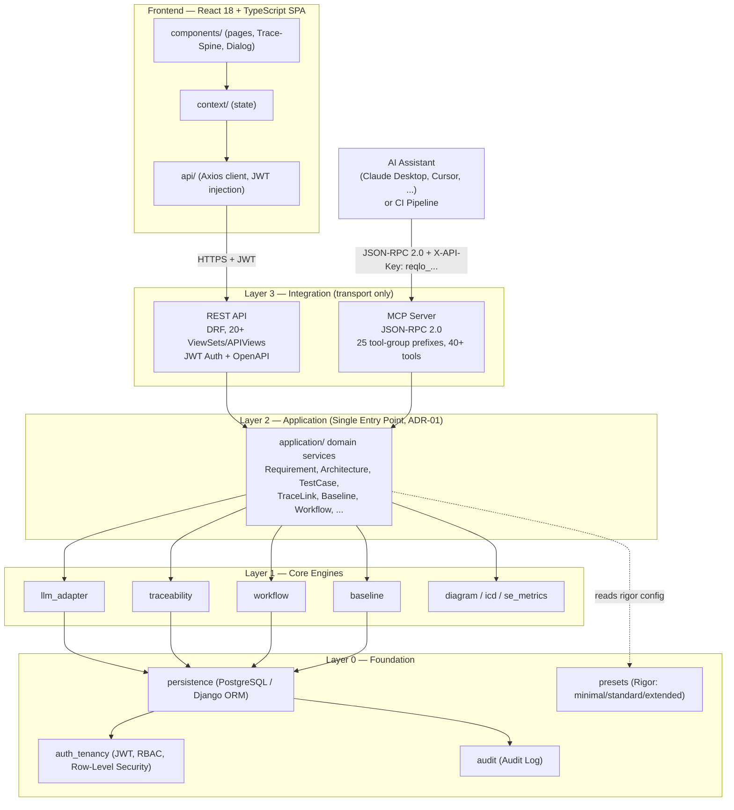
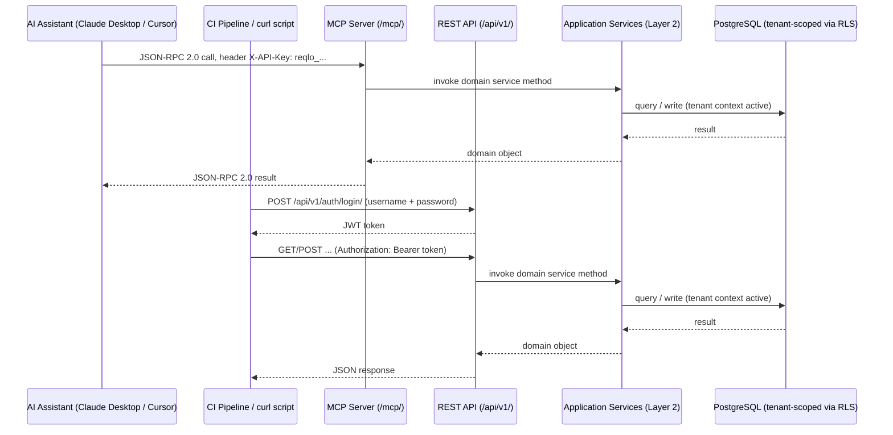
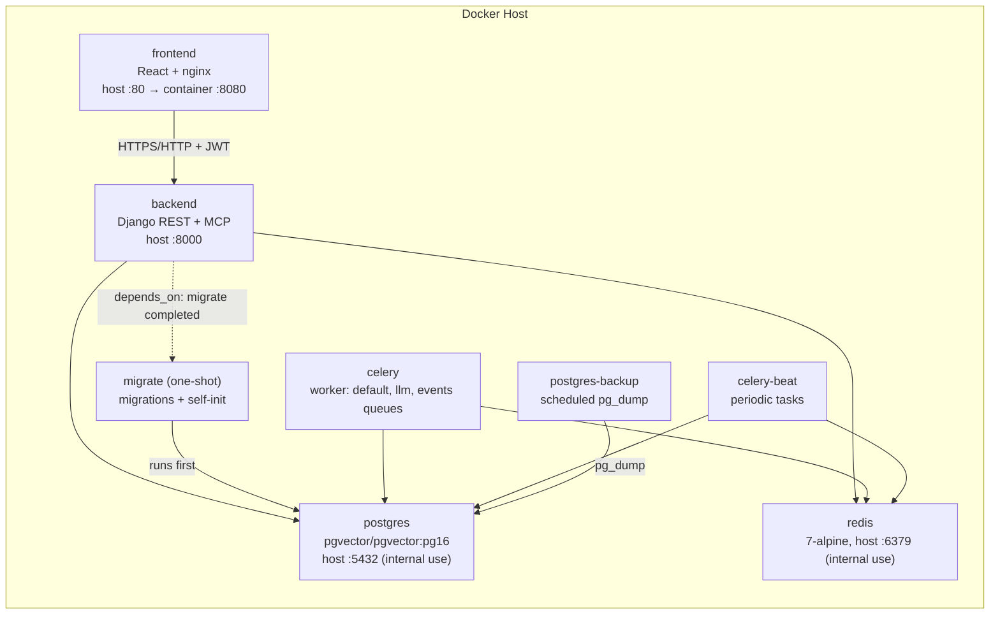

# ReqogniLoom

**AI-native requirements and test management for systems engineering.**

## What is ReqogniLoom?

ReqogniLoom is an AI-integrated requirements management and test case tracking system designed for organizations ranging from simple project management to complex systems engineering workflows. Built on Django, React 18, and PostgreSQL, ReqogniLoom provides scalable artifact-based traceability, workflow automation, and intelligent integration points for large language models.

Whether you're managing a small backlog or orchestrating a multi-level systems architecture with MBSE-style decomposition, ReqogniLoom adapts to your rigor level and integrates seamlessly with your LLM tools.

## Features

### Core Capabilities
- **Requirements Management** — Create, organize, and manage requirements with workflow states and categorization
- **Architecture Elements** — Model systems engineering structures (MBSE-compatible)
- **Testcase Management** — Attach test cases to requirements and track coverage
- **Traceability** — Automatic and manual linking between requirements, architecture elements, and test cases (14 link types: parent-child, derives-from, satisfies, verifies, implements, refines, documents, realizes, traces, copy-of, allocated-to, uses-term, decides, decomposes)
- **Baselines & Snapshots** — Capture and compare system states across time
- **Visual Artifact Diff** — Side-by-side and unified field-level change highlighting for requirements, architecture elements, and test cases
- **History Endpoint** — Full audit trail per artifact (GET /api/v1/requirements/{id}/history/)
- **PDF Report Export** — Generate Requirement Documents and Traceability Matrices as PDF with metadata
- **Test Run Tracking** — Test-Run-Protokollierung with bulk result ingestion via REST and MCP
- **CSV Bulk Import** — Atomic CSV import for Requirements, ArchitectureElements, and TestCases
- **API-Key Management** — Create, list, and revoke API keys for CI/CD integration
- **Workflow Automation** — Configurable requirement states and transitions

### AI Integration
- **MCP Server** — native Model Context Protocol server; 30 tool-group prefixes (requirement, needs, architecture, test, traceability, artifact, workspace, permissions, admin, audit, events, user, adr, risk, issue, glossary, change_request, prompt_template, prompt_variable, ai_derivation, diagram, custom_field, review, baseline, goal, main_goal, context, interview, memory, requirement_bundle), 171 individual tools (`docs/agent-templates/tool-manifest.json`), for Claude Desktop, Cursor, and other MCP-capable LLM platforms
- **LLM Adapter** — Pluggable providers: Anthropic, OpenAI, Ollama (local), Azure OpenAI, opencode_go, or mock mode (default, no external calls)
- **AI Derivation** — Configurable prompts to intelligently decompose Stakeholder Needs into System Requirements
- **Semantic Glossary & Linking** — Intelligent requirement matching and terminology suggestions
- **AI Long-Term Memory** — Two-tier memory (per-workspace + per-user tenant-wide) consolidated from interview interactions; self-hosted by default (in-process `sentence-transformers` embeddings, Postgres/pgvector storage), with Ollama/OpenAI embeddings and an external Honcho backend as opt-in alternatives. Cross-workspace search scope and a semantic (RRF-fused) search pass round out the existing full-text search. Managed via a per-workspace on/off toggle (Workspace Settings) and the `memory.query`/`memory.list`/`memory.forget` MCP tools — no system-wide admin dashboard for browsing individual memory entries yet (v1 scope, see `docs/superpowers/plans/2026-08-24-ai-memory-and-search.md`)

### Enterprise Features
- **Multi-Tenancy** — Row-level security with automatic tenant isolation
- **Configurable Rigor** — 3 presets (minimal, standard, extended) adapt complexity to your team
- **Terminology Profiles** — Switch between dev-mode and systems engineering terminology
- **Audit Logging** — Complete activity history for compliance and debugging
- **Internationalization** — German and English interfaces
- **System & Workspace Banners** — Dismissible, Markdown-rendered notice banners at global (System Admin) and per-workspace (Workspace/System Admin) scope, with 4 severity levels and session-scoped dismissal; also shown on the login page

### Developer Experience
- **REST API** — Full-featured /api/v1/ with JWT authentication, 20+ ViewSets/APIViews, OpenAPI 3.0 schema (drf-spectacular)
- **Type-Safe Frontend** — React 18 + TypeScript (strict) + Vite; unified page-header/list-toolbar/artifact-row/empty-state pattern across artifact types, shared `Dialog` primitive (focus-trap, keyboard nav), Trace-Spine derivation-chain navigator, ARIA-compliant virtualized tree — see [`docs/UI_KONZEPT.md`](docs/UI_KONZEPT.md) for the design system rationale
- **Comprehensive Tests** — pytest backend suite + Vitest frontend unit tests + Playwright E2E suite (42 spec files)
- **Docker Compose** — self-hosted stack (ADR-08) with dedicated migrate/backup services

## System Architecture

ReqogniLoom follows a strict **Single-Entry-Point Pattern** (ADR-01): both the REST API and the native MCP server are thin transport adapters that call into the *same* Layer 2 `application/` domain services — there is no parallel business logic. Layer 0 (`persistence`, `auth_tenancy`, `presets`, `audit`) provides tenant-isolated storage (Row-Level Security, ADR-03); Layer 1 hosts the core engines (LLM adapter, traceability, workflow, baseline, diagram/ICD).



**V-Model Traceability:** ReqogniLoom follows a V-Model decomposition (L0 stakeholder needs → L1 system requirements → L2 subsystems → L3 components → L4 presentation), with full REQ traceability from stakeholder needs down to test cases.

### Integration Data Flow

How an external AI assistant (via MCP) and a CI pipeline (via REST) reach the same application layer and database:



**Services (production `docker-compose.yml`):** `postgres` (PostgreSQL 16 + pgvector) · `postgres-backup` (scheduled `pg_dump`) · `redis` (Celery broker/cache) · `migrate` (one-shot migrations + self-init: admin user, base workspace, default workflows) · `backend` (Django :8000) · `celery` (async worker) · `celery-beat` (periodic tasks) · `frontend` (React + nginx, published on :80). The included `docker-compose.override.yml` swaps `frontend`/`backend` into hot-reload dev mode automatically.

## How to Start

### Prerequisites
- Docker Desktop or Docker Engine, with Docker Compose >= 2.24.4
  (`docker compose version`) — the dev overlay needs the `!override` merge tag
- Node.js 18+ (for E2E tests only; Vite dev server runs in container)
- Git
- 4+ GB available RAM

### 1. Clone and Build

```bash
git clone https://github.com/Popoboxxo/ReqogniLoom.git
cd ReqogniLoom
docker-compose build
```

### 2. Configure Secrets (REQUIRED)

Before starting the stack, you **must** set up three critical secrets in a `.env` file — the application refuses to start in production mode if any is missing or empty:

```bash
# Copy the example .env
cp .env.example .env

# Generate SECRET_KEY (Django)
python3 -c "import secrets; print(secrets.token_urlsafe(64))"

# Generate AUTH_JWT_SECRET (JWT signing)
python3 -c "import secrets; print(secrets.token_urlsafe(64))"

# Generate FIELD_ENCRYPTION_KEY (encrypts stored LLM API keys at rest)
python3 -c "from cryptography.fernet import Fernet; print(Fernet.generate_key().decode())"

# Edit .env and fill in all three (plus DB_PASSWORD / DB_APP_PASSWORD / SYSTEM_ADMIN_PASSWORD):
# SECRET_KEY=<value-from-above>
# AUTH_JWT_SECRET=<value-from-above>
# FIELD_ENCRYPTION_KEY=<value-from-above>
vim .env
```

**Why this is required:** `SECRET_KEY`, `AUTH_JWT_SECRET`, and `FIELD_ENCRYPTION_KEY` are critical for security and are not defaulted in production (`DJANGO_ENV=production`, the `.env.example` default). `DB_PASSWORD`/`DB_APP_PASSWORD` and `SYSTEM_ADMIN_PASSWORD` also need real values before first start (see `.env.example` for the full annotated list).

### 3. Start the Stack

```bash
docker-compose up
```

The one-shot `migrate` service runs first (`backend`/`celery`/`celery-beat` wait for it via `depends_on: service_completed_successfully`). It applies migrations **and** self-initializes a fresh database on first run: base tenant, base workspace, admin user, and default workflow/permission definitions (`application/self_init.py`, triggered via a `post_migrate` signal) — no manual `migrate`/seed step is needed for a first start. Wait for `backend` and `frontend` to report healthy; open a new terminal for the next step.

### 4. Verify the Database Was Initialized

```bash
docker-compose ps
# migrate should show "Exited (0)"; postgres/redis/backend/celery/celery-beat/frontend should show "Up (healthy)"
```

If you ever need to (re-)run migrations manually (e.g. after pulling new model changes without recreating the stack):

```bash
docker-compose run --rm migrate
```

### 5. Access with Default Admin User

Self-init creates the admin user automatically on first start if `SYSTEM_ADMIN_PASSWORD` is set (uses `SYSTEM_ADMIN_USERNAME`/`SYSTEM_ADMIN_EMAIL` defaults otherwise). Provisioning is create-only — an admin who later changes their password via the UI keeps it across restarts.

**Default credentials** (if not overridden in `.env`):
- **Username:** `admin`
- **Email:** `admin@demo.local`
- **Password:** Set via `SYSTEM_ADMIN_PASSWORD` in `.env`, or fails on first startup if not provided

To override the default admin credentials, edit `.env` before starting the stack:

```bash
# In .env (before docker-compose up)
SYSTEM_ADMIN_USERNAME=my_admin
SYSTEM_ADMIN_EMAIL=my_admin@example.com
SYSTEM_ADMIN_PASSWORD=my_secure_password
```

The bootstrap process is idempotent — it creates the admin user only if it does not exist. Subsequent restarts do not modify the password.

### 6. (Optional) Seed Demo Data

To populate your workspace with example requirements, architecture elements, and test cases:

```bash
# Creates demo artifacts (requirements, architecture, tests)
docker-compose exec backend python manage.py seed_demo
```

**Override demo admin password** (for development only):
```bash
docker-compose exec -e SYSTEM_ADMIN_PASSWORD="new-password" backend python manage.py seed_demo --reset-password
```

Re-running `seed_demo` is safe (idempotent); it skips artifacts that already exist.

### 7. Access the Application

- **Frontend:** http://localhost:5173
  - **Default credentials:** username=`admin`, password: set via `SYSTEM_ADMIN_PASSWORD` environment variable (or as configured in `.env` via `SYSTEM_ADMIN_*`)
- **API:** http://localhost:8000/api/v1/
  - **Get JWT token:** `POST /api/v1/auth/login/` with credentials:
    ```bash
    curl -X POST http://localhost:8000/api/v1/auth/login/ \
      -H "Content-Type: application/json" \
      -d '{"username":"admin","password":"your-password"}'
    # → {"token": "eyJhbGc...", "user": {...}, "tenant_id": "...", "roles": ["admin"]}
    ```
    > **Note:** `tenant_id` identifies the tenant (RLS isolation boundary), it is
    > **not** the `workspace_id` most CRUD endpoints require as a query parameter.
    > Fetch available workspaces via `GET /api/v1/workspaces/` and use the
    > returned `id` as `workspace_id`.
  - **Use token:** `Authorization: Bearer <token>` header on all subsequent requests
  - **Validate token:** `GET /api/v1/auth/me/` returns the authenticated user
  - **Full OpenAPI docs:** http://localhost:8000/api/v1/docs/
- **Admin Panel:** http://localhost:8000/admin/
  - Same credentials as frontend

### 8. (Optional) Configure LLM Provider

By default, ReqogniLoom runs in **mock mode** (no actual LLM calls). To enable AI features:

```bash
# Stop the running stack
docker-compose down

# Set environment variables and restart
LLM_PROVIDER=anthropic LLM_API_KEY=sk-ant-... docker-compose up
```

**Supported Providers** (`backend/llm_adapter/providers.py`):
- `anthropic` — Claude API (set `LLM_API_KEY`, `LLM_MODEL`)
- `openai` — OpenAI API (set `LLM_API_KEY`, `LLM_MODEL`)
- `ollama` — Local Ollama instance (set `LLM_BASE_URL`, default `http://localhost:11434`, and `LLM_MODEL`)
- `azure` — Azure OpenAI (set `LLM_API_KEY`, `LLM_BASE_URL` to the resource endpoint, `LLM_MODEL` to the deployment name)
- `opencode_go` — opencode/go-backed provider (see `.env.example` for its variables)
- `mock` — Dry-run mode, no API calls (default)

See `.env.example` for all available configuration options and per-provider examples.

### 8a. (Optional) Configure AI Memory & Embeddings

By default, ReqogniLoom runs fully self-hosted: `sentence-transformers` computes embeddings in-process inside the `backend`/`celery` containers (no extra service, no external API call), and memory entries are stored in this project's own Postgres via `pgvector`. No configuration is required to use the memory feature at its default settings.

```bash
# Optional: use Ollama for embeddings instead of the bundled sentence-transformers model
EMBEDDING_PROVIDER=ollama OLLAMA_BASE_URL=http://ollama:11434 docker-compose up

# Optional: use an external Honcho instance as the memory backend
MEMORY_BACKEND=honcho HONCHO_BASE_URL=https://your-honcho-instance.example.com docker-compose up
```

**Supported `EMBEDDING_PROVIDER`** (`backend/llm_adapter/embedding_service.py`): `sentence-transformers` (default, 384-dim) | `ollama` (768-dim) | `openai` (1536-dim) | `mock` (384-dim)
**Supported `MEMORY_BACKEND`** (`backend/memory/backends.py`): `pgvector` (default) | `honcho` (optional; `query`/`list`/`forget` are not yet implemented for this backend — `upsert` only)

⚠️ **Embedding dimension is part of the schema.** All pgvector columns are `vector(384)`, sized from `backend/persistence/embedding_dimensions.py` to match the default provider. Selecting a provider with a different native width **silently disables** embedding writes and semantic search for those columns — the width guard skips them rather than erroring (this was issue #794). `manage.py check` reports the mismatch as `llm_adapter.W001`, and the first skipped write logs at WARNING. To run such a provider, change `EMBEDDING_VECTOR_DIMENSIONS`, generate the resulting migrations, and re-run `manage.py backfill_embeddings`; pgvector cannot cast between widths, so existing vectors are discarded.

⚠️ `EMBEDDING_PROVIDER` is fixed per deployment for v1 — switching it later does not re-embed existing data. Use `python manage.py backfill_embeddings` (optionally `--force`) to (re)generate `Requirement`/`TraceLink` embeddings for rows that already exist; they are otherwise only written on create/update. `IcdVersion` rows are immutable and can only be embedded by creating a new version.

See `.env.example` for all variables and `docker-compose.override.example.yml` for the matching optional-service Compose stubs.

### 8b. Verify Installation

Check all services are running:

```bash
docker-compose ps
```

All containers should show `Up (healthy)` or `Up`.

### 9. Connect an MCP Client (Claude Desktop / Cursor)

You can connect external AI assistants like Claude Desktop or Cursor to ReqogniLoom's MCP server.
ReqogniLoom exposes an SSE (Server-Sent Events) transport endpoint for remote connections.

**Important:** You need an active API key to authenticate (see Step 5 above).

#### Example: Claude Desktop Configuration

Edit your `claude_desktop_config.json` (usually located at `~/Library/Application Support/Claude/claude_desktop_config.json` on macOS or `%APPDATA%\\Claude\\claude_desktop_config.json` on Windows):

```json
{
  "mcpServers": {
    "reqogniloom": {
      "command": "curl",
      "args": [
        "-N", 
        "-s",
        "-H", "X-API-Key: YOUR_API_KEY",
        "http://localhost:8000/mcp/sse/"
      ]
    }
  }
}
```
*Note: Since ReqogniLoom provides an HTTP/SSE endpoint, we use `curl -N` to pipe the SSE stream into Claude Desktop's standard input. Alternatively, you can write a tiny Node.js script that connects to the SSE URL and bridges it to stdio.*

#### Example: Cursor IDE

In Cursor, go to **Settings > Features > MCP**:
1. Click **+ Add new MCP server**
2. **Name**: `ReqogniLoom`
3. **Type**: `sse`
4. **URL**: `http://localhost:8000/mcp/sse/`
5. **Headers**: Add a header `X-API-Key` with your API Key value.

## Manual MCP Test (curl)

Verify the MCP server responds correctly to tool calls:

```bash
# 1. Get a JWT token
TOKEN=$(curl -s -X POST http://localhost:8000/api/v1/auth/login/ \
  -H "Content-Type: application/json" \
  -d '{"username":"admin","password":"your-password"}' | jq -r .token)

# 2. Create an API key for MCP
API_KEY=$(curl -s -X POST http://localhost:8000/api/v1/api-keys/ \
  -H "Authorization: Bearer $TOKEN" \
  -H "Content-Type: application/json" \
  -d '{"name":"manual-test"}' | jq -r .key)

# 3. List your workspaces (read tool, no Admin needed)
WORKSPACE_ID=$(curl -s -X POST http://localhost:8000/mcp/ \
  -H "Content-Type: application/json" \
  -H "X-API-Key: $API_KEY" \
  -d '{"jsonrpc":"2.0","id":1,"method":"workspace.get_context","params":{}}' \
  | jq -r .result.workspaces[0].id)

# 4. Query requirements
curl -X POST http://localhost:8000/mcp/ \
  -H "Content-Type: application/json" \
  -H "X-API-Key: $API_KEY" \
  -d "{\\"jsonrpc\\":\\"2.0\\",\\"id\\":2,\\"method\\":\\"requirement.query\\",\\"params\\":{\\"workspace_id\\":\\"$WORKSPACE_ID\\",\\"limit\\":5}}"

# 5. Server health check (no auth)
curl http://localhost:8000/mcp/
# → {"server":"ReqFlow MCP Server","protocol":"JSON-RPC 2.0","transports":["http","sse","stdio"],"version":"1.0.0"}
```

## Running Tests

ReqogniLoom has **1,400+ tests** across 4 layers. Run them based on what you need to verify.

### Quick Reference (Makefile)

The root `Makefile` provides single-command targets that run against the **running dev stack**
(`docker-compose up -d` first). This is the primary entry point for the normal development loop.

```bash
make test            # Backend (pytest) + Frontend (vitest) — the standard dev check. NO E2E.
make test-backend    # Backend unit + integration tests only (pytest)
make test-frontend   # Frontend unit tests only (vitest)
make test-e2e        # Playwright E2E — SEPARATE, MANUAL ONLY (see warning below)
```

> **`make test` never runs E2E.** Playwright is intentionally excluded from `make test` (not even
> as a dependency). Unit + integration tests are fast and safe to run on every change; E2E is slow,
> resource-intensive, and must be triggered explicitly. See [End-to-End Tests](#end-to-end-tests-playwright).

The sections below document each layer manually (without Docker/Make) for fine-grained control.

### Prerequisites

```bash
# Database: ReqogniLoom tests require PostgreSQL.
# Option A (recommended): Use the running Docker stack's Postgres
docker-compose up -d postgres
export DB_HOST=localhost   # Linux/macOS
# Windows PowerShell: $env:DB_HOST="localhost"

# Option B: Local PostgreSQL with a 'reqogniloom' database
createdb reqogniloom
export DB_HOST=localhost   # Linux/macOS
# Windows PowerShell: $env:DB_HOST="localhost"
```

### Backend Tests (pytest)

```bash
cd backend

# ALL backend tests (Django + pytest)
pytest -q

# With coverage report
pytest --cov=. --cov-report=term-missing --cov-report=html
# → open htmlcov/index.html

# By module (fast feedback during development)
pytest auth_tenancy -q          # RBAC, API-Key, Item-Permission, Tenant-Context
pytest mcp_server -q            # MCP tools, protocol, registry
pytest admin_ops -q             # Disaster Recovery
pytest application -q           # 16 ApplicationServices
pytest persistence -q           # Models, Tenancy, Migrations
pytest workflow -q              # Workflow + State-Lifecycle
pytest baseline -q              # Baseline + Diff

# Skip slow performance tests
pytest -m "not slow"

# Only the new MCP E2E suite (added 2026-06-28, 150+ tests)
pytest mcp_server/tests/test_e2e_all_tools.py -v
pytest mcp_server/tests/test_e2e_audit.py -v
pytest mcp_server/tests/test_e2e_sse_transport.py -v

# Single test by name
pytest -k "test_login_success" -v

# Reuse existing test database to speed up subsequent test runs (Recommended)
pytest --keepdb

# With Django check
python manage.py check && pytest -q
```

> **Warning:** It is highly discouraged to run `pytest` against the actual development database, as tests will truncate tables and delete your data. `pytest` automatically creates a separate `test_reqogniloom` database. Use `--keepdb` to persist this test database between runs.
> For End-to-End Tests (Playwright), the tests *do* run against the actual development environment.

**Status:** 5,768 backend tests + 1,363 frontend tests passing; 274 E2E tests via Playwright (last verified 2026-08-27).

### Frontend Unit Tests (Vitest)

```bash
cd frontend
npm install                  # first time only
npm test                     # run tests (Vitest)
```

**Note:** If you encounter `Invalid URL` errors for API calls during tests, you may need to configure a base URL in your test environment or provide a mocked fetch setup.

### End-to-End Tests (Playwright)

> **⚠️ Separate, opt-in test layer.** E2E tests are **not** part of `make test` and never run
> automatically. They drive a real browser against the full running stack, take minutes to complete,
> and consume significant CPU/RAM. Run them **only** when you deliberately want to verify UI flows —
> e.g. before a release or after touching UI-critical code.

Wir nutzen Playwright im Frontend für robuste UI-Tests und zur Bereitstellung eines MCP-Servers (Model Context Protocol), damit LLMs die UI testen können. Die UI ist mit über 400 `data-testid`-Attributen extrem LLM-freundlich aufgebaut.

**Prerequisite:** the full stack must be running (`docker-compose up -d`), seeded with `seed_demo`
(see [6. (Optional) Seed Demo Data](#6-optional-seed-demo-data) above) **and** with the
`seed_toothbrush` fixture workspace, which `tests/toothbrush-syseng.spec.ts` requires — that spec
seeds a large ("Zahnbürste SysEng Demo") multi-level SysEng workspace (~880 requirements,
architecture tree, ICDs, test cases, ...) used to exercise the UI at realistic scale. Without it,
that spec fails fast with a clear "workspace not found" error naming the exact command to run:

```bash
docker-compose exec backend python manage.py seed_toothbrush   # idempotent, safe to re-run
```

CI (`.github/workflows/playwright.yml`) already runs this alongside `seed_demo` before every E2E
job; it is only missing when seeding a local dev stack by hand.

> **Two more local-only pitfalls that read like app bugs but aren't** (found while triaging
> docs/SYSTEMAUDIT_2026-08-18.md BUG-17/B-SRCH-001 — both traced back to these, not to the app):
>
> 1. **Admin password mismatch.** `e2e/helpers/auth.ts` logs in as `admin` /
>    `admin12345` — the `seed_demo` default. If your local `.env` sets its own
>    `SYSTEM_ADMIN_PASSWORD` (as the production hardening guidance above recommends), every E2E
>    login fails with a plain 401 *before* the test's actual assertion ever runs — the symptom
>    (whatever the test was checking) looks unrelated to auth. Fix: either re-seed with the E2E
>    default (`docker-compose exec -e SYSTEM_ADMIN_PASSWORD=admin12345 backend python manage.py
>    seed_demo --reset-password`), or set `E2E_ADMIN_PASSWORD=<your .env password>` when running
>    Playwright so `auth.ts` uses it instead.
> 2. **Backend port mismatch (fixed).** `docker-compose.yml` publishes the backend on host port
>    `8001`. The E2E helpers/specs' `BACKEND_URL` default now matches (`http://localhost:8001`),
>    so a local run no longer needs to pass it explicitly — only override it if your stack maps
>    the backend to a different host port (e.g. a local-only compose override to avoid port
>    clashes with other running stacks).

```bash
make test-e2e                # full suite via Makefile (installs deps + runs Playwright)

# Or manually (BACKEND_URL only needed if your stack doesn't use the default 8001 — see pitfall 2 above):
cd e2e
npm install                  # first time only
npx playwright test          # full suite (~3 min)
npm run test:e2e:ui          # interactive UI mode
npm run mcp:playwright       # starte Playwright MCP Server für LLM-Agenten
```

**Status:** Playwright Setup & MCP integriert.

> **Known gap:** E2E tests always run against a fixed `localhost` URL with a
> fresh login per test, so they can't catch bugs caused by a stale browser
> tab, a changed LAN IP (DHCP drift), or a tab left open across a backend
> restart. See [`e2e/TESTING.md`](e2e/TESTING.md#known-gap-stale-host--session-drift)
> for the symptom pattern and how to tell it apart from a real auth bug.

## Production Deployment

ReqogniLoom is designed for self-hosted deployment on Linux/Unix servers using Docker Compose. This section covers hardening the stack for production use.

### Prerequisites

- Docker >= 24.0 and Docker Compose >= 2.24.4 (the development overlay
  `docker-compose.override.yml` uses the `!override` merge tag)
- A Linux server (amd64) or macOS
- 8+ GB available RAM
- HTTPS reverse proxy (nginx, Traefik, etc.) or cloud load balancer

### Quick Start

1. **Clone and prepare:**

   ```bash
   git clone https://github.com/Popoboxxo/ReqogniLoom.git
   cd ReqogniLoom
   cp .env.example .env
   ```

2. **Configure .env** — critical for production:

   ```bash
   # Generate a strong Django SECRET_KEY:
   python3 -c "import secrets; print(secrets.token_hex(50))"
   
   # Edit .env and fill ALL CHANGE-ME fields:
   vim .env
   ```

   Key variables (see `.env.example` for the full annotated list):
   - `SECRET_KEY`, `AUTH_JWT_SECRET`, `FIELD_ENCRYPTION_KEY` — generate with Python (see [How to Start](#2-configure-secrets-required) above)
   - `DEBUG=False`, `DJANGO_ENV=production` — disable debug mode (default in `.env.example`)
   - `ALLOWED_HOSTS` — your server hostname(s)
   - `CORS_ALLOWED_ORIGINS` — your exact frontend origin(s), never `*`
   - `DB_PASSWORD`, `DB_APP_PASSWORD` — strong passwords (32+ chars, random)
   - `SYSTEM_ADMIN_PASSWORD` — required for the admin account to be created on first start
   - `LLM_PROVIDER` — leave as `mock` for core features without AI

3. **Build and start:**

   ```bash
   docker-compose build
   docker-compose up -d
   ```

4. **Database initialization is automatic:**

   The one-shot `migrate` service runs migrations and self-initializes the base tenant, workspace, admin user, and default workflows (`application/self_init.py`) before `backend`/`celery`/`celery-beat` start — no manual step needed. Optionally seed demo data afterwards:

   ```bash
   docker-compose exec backend python manage.py seed_demo
   ```

5. **Verify all services:**

   ```bash
   docker-compose ps
   # migrate: Exited (0); postgres/postgres-backup/redis/backend/celery/celery-beat/frontend: Up (healthy) or Up
   ```

### Architecture



**Services** (`docker-compose.yml`):
- **postgres** — `pgvector/pgvector:pg16` (PostgreSQL 16 with the pgvector extension pre-installed into `template1`)
- **postgres-backup** — `postgres:16-alpine` sidecar; runs `backup_postgres.sh` every `BACKUP_INTERVAL` seconds (default 24h), retains `BACKUP_RETENTION` (default 7) gzip dumps
- **redis** — `redis:7-alpine` (Celery broker + cache, `appendonly` persistence, 256mb `maxmemory`)
- **migrate** — one-shot; runs `python manage.py migrate` then the `post_migrate` self-init signal; `backend`/`celery`/`celery-beat` wait for it via `service_completed_successfully`
- **backend** — Django REST API + MCP server (`:8000`), connects as the least-privilege `DB_APP_USER` role (RLS-enforced)
- **celery** — async worker consuming the `default`, `llm`, `events` queues
- **celery-beat** — periodic task scheduler (`django_celery_beat.schedulers:DatabaseScheduler`)
- **frontend** — React build served by nginx, container port `8080`, published on host `:80`

**Data Persistence:**
- `postgres_data` — named volume, PostgreSQL data directory
- `postgres_backup_data` — named volume, retained `pg_dump` archives
- `backend_dr_backups` — named volume, `admin.backup_create`/`restore` JSON files (`/app/backups`)

### Reverse Proxy Setup (nginx example)

> **Note:** `docker-compose.yml` publishes `frontend` on host port `80` by default (container listens on `8080`). If you front the stack with your own reverse proxy on `80`/`443` (recommended for TLS), either remove the `ports:` mapping on the `frontend` service and let the proxy reach it via the Docker network, or rebind it to a non-conflicting host port (e.g. `"3000:8080"`) and adjust the `upstream frontend` block below accordingly.

```nginx
# /etc/nginx/sites-available/reqogniloom
upstream backend {
    server localhost:8000;
}

upstream frontend {
    server localhost:3000;
}

server {
    listen 80;
    server_name your-domain.com;
    
    # Redirect HTTP → HTTPS
    return 301 https://$server_name$request_uri;
}

server {
    listen 443 ssl http2;
    server_name your-domain.com;
    
    ssl_certificate /etc/letsencrypt/live/your-domain.com/fullchain.pem;
    ssl_certificate_key /etc/letsencrypt/live/your-domain.com/privkey.pem;
    
    # Frontend (React)
    location / {
        proxy_pass http://frontend;
        proxy_set_header Host $host;
        proxy_set_header X-Real-IP $remote_addr;
        proxy_set_header X-Forwarded-For $proxy_add_x_forwarded_for;
        proxy_set_header X-Forwarded-Proto $scheme;
    }
    
    # Backend API
    location /api/ {
        proxy_pass http://backend;
        proxy_set_header Host $host;
        proxy_set_header X-Real-IP $remote_addr;
        proxy_set_header X-Forwarded-For $proxy_add_x_forwarded_for;
        proxy_set_header X-Forwarded-Proto $scheme;
        proxy_redirect off;
    }
    
    # MCP Server
    location /mcp/ {
        proxy_pass http://backend;
        proxy_set_header Host $host;
        proxy_set_header X-Real-IP $remote_addr;
        proxy_set_header X-Forwarded-For $proxy_add_x_forwarded_for;
        proxy_set_header X-Forwarded-Proto $scheme;
        # For SSE (Server-Sent Events):
        proxy_http_version 1.1;
        proxy_set_header Connection "";
    }
    
    # Admin interface
    location /admin/ {
        proxy_pass http://backend;
        proxy_set_header Host $host;
        proxy_set_header X-Real-IP $remote_addr;
        proxy_set_header X-Forwarded-For $proxy_add_x_forwarded_for;
        proxy_set_header X-Forwarded-Proto $scheme;
    }
}
```

### Environment-Specific Configuration

**For Development:**

By default, `docker-compose.yml` is production-focused. To restore development conveniences:

```bash
# docker-compose.override.yml is automatically merged by Docker Compose
# It enables hot-reload, dev server, and weak defaults
# (it's already included in the repository)

docker-compose up
# Stack runs in dev mode with hot-reload
```

**For Production:**

Delete or rename `docker-compose.override.yml` and ensure only `docker-compose.yml` is used:

```bash
rm docker-compose.override.yml
docker-compose up -d
```

### PostgreSQL with pgvector

The postgres service uses the `pgvector/pgvector:pg16` image, which ships the pgvector extension for vector-based semantic search.

`CREATE EXTENSION vector` requires **superuser** rights, but the application connects at runtime as the least-privilege, `NOSUPERUSER` role `DB_APP_USER` (default `reqogniloom_app`, REQ-L2-PL-010). The extension is therefore installed up front by the superuser init hook `docker/postgres/initdb/10-pgvector.sh` — into **`template1`** and into `${DB_NAME}`. Because `CREATE DATABASE` clones `template1`, every database created afterwards (including Django's ephemeral `test_*` databases from `pytest --create-db`) inherits the extension, and the `CREATE EXTENSION IF NOT EXISTS vector` in `persistence/migrations/0024_requirement_embedding.py` degrades to a harmless `NOTICE`.

No manual setup is required for a fresh volume.

**Existing volume:** the Postgres image runs `/docker-entrypoint-initdb.d/` scripts only on a completely empty data directory. A dev machine set up before this hook existed will still fail with `permission denied to create extension "vector"` on `pytest --create-db`. Fix it once, without recreating the volume or losing data:

```bash
./scripts/enable_pgvector.sh
```

### Monitoring & Logs

```bash
# Check all services
docker-compose ps

# View logs
docker-compose logs -f backend      # Django logs
docker-compose logs -f celery       # Async task logs
docker-compose logs -f postgres     # Database logs
docker-compose logs -f redis        # Cache/broker logs
docker-compose logs -f frontend     # Frontend server logs

# Follow all logs
docker-compose logs -f
```

### Backup & Restore

**Automatic backups:** the `postgres-backup` sidecar service already runs `pg_dump` on a schedule (`BACKUP_INTERVAL`, default 24h) and retains the last `BACKUP_RETENTION` (default 7) gzip-compressed dumps in the `postgres_backup_data` volume — no manual cron job needed.

**Manual backup:**

```bash
docker-compose exec postgres pg_dump -U reqogniloom reqogniloom > backup.sql
```

**Manual restore:**

```bash
docker-compose exec -T postgres psql -U reqogniloom reqogniloom < backup.sql
```

**Restore from an automatic backup:**

```bash
docker-compose exec postgres-backup sh -c 'gunzip -c /backups/reqogniloom_<timestamp>.sql.gz' | \
  docker-compose exec -T postgres psql -U reqogniloom reqogniloom
```

There is also an application-level Disaster Recovery mechanism (`admin.backup_create`/`admin.backup_list`/`admin.restore` MCP tools, Admin role + `X-Captcha: RESTORE` header) that snapshots artifacts as JSON into the `backend_dr_backups` volume — a separate, artifact-level complement to the raw Postgres dumps above.

### Scaling Considerations

- **Multiple Celery workers:** Copy the `celery` service and rename each (celery-1, celery-2, etc.)
- **External Redis:** Configure `CELERY_BROKER_URL` and `CELERY_RESULT_BACKEND` to point to external Redis
- **External PostgreSQL:** Configure `DB_HOST`, `DB_USER`, `DB_PASSWORD` to point to managed RDS/Cloud SQL
- **Load balancing:** Use Traefik, Kubernetes, or cloud load balancers in front of `docker-compose up`

### Security Checklist

- [ ] `.env` file with strong `SECRET_KEY` and `DB_PASSWORD`
- [ ] `.env` added to `.gitignore` (do NOT commit secrets)
- [ ] `DEBUG=False` in production
- [ ] `ALLOWED_HOSTS` set to your actual hostnames
- [ ] HTTPS enforced via reverse proxy or load balancer
- [ ] SSH key pair for server access (no password login)
- [ ] Firewall rules restrict ports (only 80/443 from internet, 5432/6379 from internal only)
- [ ] Regular backups of `postgres_data` volume
- [ ] Log aggregation configured (optional but recommended)

### Troubleshooting Deployment

```bash
# Check if stack is healthy
docker-compose ps
# Look for: Up (healthy)

# View error logs
docker-compose logs --tail 50

# Restart a service
docker-compose restart backend

# Rebuild and restart all
docker-compose down
docker-compose build --no-cache
docker-compose up -d

# Reset database (⚠️ WARNING: Deletes all data)
docker-compose down
docker volume rm reqogniloom_postgres_data
docker-compose up -d
docker-compose exec backend python manage.py migrate
```

### Test Coverage & Known Gaps

**Coverage:** 5,768 pytest unit and integration tests (auth, models, API, workflows, traceability) + 1,363 Vitest frontend tests + 274 Playwright E2E tests (UI flows, MCP tooling).

**Known gaps (by design):**

- **CSRF/Cross-Origin enforcement** — pytest's `APIRequestFactory` and `django.test.Client` disable CSRF checks by default (`enforce_csrf_checks=False`), so CSRF token validation is rarely triggered in automated tests. Playwright API tests using the `request.post` fixture send no `Origin` header (triggering no CSRF origin check), and Playwright UI tests ran against `localhost:5173`, which is already whitelisted in the default `CSRF_TRUSTED_ORIGINS` (so no rejection is visible).
  - **Concrete example:** REQ-138 identified a missing `CSRF_TRUSTED_ORIGINS` entry that blocked all cross-origin POST/PATCH/DELETE from the frontend in production, but passed 38+ automated tests undetected.
  - **Fix:** REQ-139 adds a targeted regression test using `Client(enforce_csrf_checks=True)`.
  - **Test infrastructure:** See `backend/reqogniloom/settings_test.py` for test-specific Django settings.

**Recommendation:** After release-critical changes to auth or cross-origin handling, manually verify CSRF rejection with a real browser or add targeted tests using strict CSRF enforcement.

### Troubleshooting Tests

```bash
# Tests can't connect to Postgres
export DB_HOST=localhost          # or 'postgres' if running inside docker
docker-compose ps                  # verify postgres is running

# Tests fail with "DISABLE_SERVER_SIDE_CURSORS"
# → Known Django+psycopg2 issue; pinned in test setup

# Migrations needed
docker-compose exec backend python manage.py migrate

# Stale __pycache__
find . -type d -name __pycache__ -exec rm -rf {} + 2>/dev/null
```

## MCP Server

ReqogniLoom ships a native MCP (Model Context Protocol) server alongside the REST API. The server exposes **25 tool-group prefixes** (40+ individual tools, verified floor — see `backend/mcp_server/tests/test_mcp_api_key_roles.py`) for requirements engineering, stakeholder needs, architecture, test management, traceability, ADRs, risks, issues, glossary, change requests, goals, diagrams, AI derivation, workspace administration, permissions, backups, audit, and user management. Several prefixes share one underlying tool-group implementation (e.g. `traceability`/`artifact`/`context` all route to `CrossCuttingToolGroup`, `audit`/`events` to `AuditToolGroup`) — see `backend/mcp_server/tool_registry.py` for the full prefix → implementation map.

### Transport Endpoints

| Endpoint | Method | Transport | Authentication |
|----------|--------|-----------|----------------|
| `/mcp/` | POST | HTTP/JSON-RPC 2.0 | `X-API-Key: reqlo_<key>` header OR `params.api_key` in body |
| `/mcp/sse/` | GET | SSE — opens the event stream | `X-API-Key: reqlo_<key>` header |
| `/mcp/messages/?session_id=<id>` | POST | SSE — sends JSON-RPC into an open stream | Session-bound; the key is **not** accepted in this URL |
| `/mcp/` | GET | — | Server info / health check (no auth required) |
| (stdio) | — | stdio (local pipe) | `params.api_key` argument |

**Choosing a transport.** HTTP and SSE are two independent, equally supported
transports — not two stages of one handshake. `POST /mcp/` is a complete
Streamable-HTTP JSON-RPC endpoint: `initialize`, `tools/list` and `tools/call`
all work over it with a single request/response round-trip, without ever
touching `/mcp/sse/`. Use it for scripts, CI jobs and any client that just wants
to call a tool (the [Manual MCP Test](#manual-mcp-test-curl) above is plain
`curl` against this endpoint). Use `/mcp/sse/` when your MCP client expects a
long-lived event stream — most desktop MCP clients (Claude Desktop, Cursor) do,
which is why the shipped client configs point at it. The server advertises what
it actually implements: `GET /mcp/` (no auth) returns
`{"transports": ["http", "sse", "stdio"], ...}`, so a client can discover the
available transports instead of assuming one.

**SSE requires an ASGI server.** The SSE view streams asynchronously; a WSGI
server (including `manage.py runserver`) cannot serve it — Django buffers the
whole async iterator, so the request never returns. Both the production image
(`gunicorn -k uvicorn.workers.UvicornWorker`) and the dev stack
(`uvicorn --reload`, see `docker-compose.override.yml`) run ASGI.

### SSE Sessions and Reconnecting

The SSE handshake (`GET /mcp/sse/`) mints a `session_id`, binds your API key to
it server-side, and delivers the message endpoint in the first `endpoint` event.
That binding lives in Redis with a bounded TTL (8 h, `SESSION_TTL_SECONDS`) and
also disappears if Redis restarts or evicts the key.

Once the binding is gone, `POST /mcp/messages/` answers **HTTP 401** with a
`SESSION_EXPIRED` error envelope — deliberately distinct from `AUTH_FAILED`:

```json
{
  "jsonrpc": "2.0",
  "id": 7,
  "error": {
    "error_code": "SESSION_EXPIRED",
    "message": "MCP SSE session '…' is unknown or has expired. This is NOT an authentication failure — …",
    "data": {
      "reconnect_endpoint": "/mcp/sse/",
      "session_ttl_seconds": 28800,
      "retryable": true
    }
  }
}
```

**Expected client behaviour:** on `SESSION_EXPIRED`, re-open `GET /mcp/sse/`,
take the fresh `session_id` from the new `endpoint` event and retry the call.
Do **not** rotate or re-issue the API key — it is still valid. Clients that do
not reconnect automatically need a manual reconnect (in Claude Code:
`/mcp reconnect`). Passing the previous `session_id` as a `?session_id=` query
parameter on the handshake resumes the same replay buffer when the binding is
still alive; an expired one simply yields a new session.

### Authentication

MCP tools authenticate via API keys prefixed with `reqlo_`. To create one:

```bash
# 1. Obtain a JWT session token via the REST API
TOKEN=$(curl -s -X POST http://localhost:8000/api/v1/auth/login/ \
  -H "Content-Type: application/json" \
  -d '{"username":"alice","password":"•••"}' | jq -r .access)

# 2. Create a new API key
curl -X POST http://localhost:8000/api/v1/api-keys/ \
  -H "Authorization: Bearer $TOKEN" \
  -H "Content-Type: application/json" \
  -d '{"name":"claude-desktop"}'
# Response: {"id":7, "key":"reqlo_Ab12Cd34Ef56Gh78Ij90Kl12Mn34Op56Qr78St90Uv12", ...}
```

The plaintext key is returned **once** at creation. Store it securely.

### Quickstart — Call a Tool

```bash
curl -X POST http://localhost:8000/mcp/ \
  -H "Content-Type: application/json" \
  -H "X-API-Key: reqlo_Ab12Cd34Ef56Gh78Ij90Kl12Mn34Op56Qr78St90Uv12" \
  -d '{
    "jsonrpc":"2.0",
    "id":1,
    "method":"tools/call",
    "params":{
      "name":"requirement.query",
      "arguments":{"workspace_id":1,"limit":5}
    }
  }'
```

### Client Configuration Examples

**Cursor (`.cursor/mcp.json`)**
```json
{
  "mcpServers": {
    "reqogniloom": {
      "command": "curl",
      "args": [
        "-s",
        "-X", "POST",
        "http://localhost:8000/mcp/stdio/",
        "-H", "X-API-Key: reqlo_Ab12Cd34Ef56Gh78Ij90Kl12Mn34Op56Qr78St90Uv12",
        "-d", "@-"
      ]
    }
  }
}
```
*(Note: Since Cursor only supports stdio currently, we use `curl` to bridge stdio to the HTTP endpoint).*

**Claude Desktop (`claude_desktop_config.json`)**
```json
{
  "mcpServers": {
    "reqogniloom": {
      "command": "curl",
      "args": [
        "-s",
        "-X", "POST",
        "http://localhost:8000/mcp/stdio/",
        "-H", "X-API-Key: reqlo_Ab12Cd34Ef56Gh78Ij90Kl12Mn34Op56Qr78St90Uv12",
        "-d", "@-"
      ]
    }
  }
}
```

### Tool Groups (25 prefixes)

| Prefix | Purpose | Example tools | Role required |
|--------|---------|---------------|---------------|
| `requirement` | Read, create, update, decompose, validate, derive requirements | `get`, `query`, `create`, `update`, `decompose`, `validate`, `derive` | Member |
| `needs` | Stakeholder Needs CRUD + trace/derive to requirements | `read`, `create`, `update`, `get_traces`, `derive_requirements` | Member |
| `architecture` | Read, create, update, link, decompose architecture artifacts | `get`, `query`, `create`, `update`, `link`, `decompose` | Member |
| `test` | Read, create, link, run tests, report results, derive from requirement | `get`, `query`, `create`, `update`, `link`, `run_create`, `run_get`, `run_report_results`, `derive_from_requirement` | Member |
| `traceability` / `artifact` / `context` | Cross-cutting traceability, artifact tree/search, workspace context (one shared `CrossCuttingToolGroup`) | `traceability.query`, `artifact.search`, `artifact.get_tree`, `workspace.get_context` | Member |
| `adr` / `risk` / `issue` / `glossary` / `change_request` | Generic CRUD for ADRs, risks, issues, glossary terms, change requests | `read`, `create`, `update`, `delete` | Member |
| `goal` / `main_goal` | Goal and MainGoal CRUD (workflow-backed) | `get`, `query`, `create`, `update` | Member |
| `diagram` | Diagram generation and CRUD | `get`, `create`, `update` | Member |
| `custom_field` | Custom field definitions | `get`, `list` | Member |
| `review` | Review workflow tools | `get`, `create` | Member |
| `baseline` | Baseline capture, diff, restore (wraps `BaselineFacade`) | `create`, `get`, `diff` | Member |
| `prompt_template` | Read configurable AI derivation prompts | `get` | Member |
| `ai_derivation` | AI-assisted derivation of requirements/architecture/decomposition | `derive_requirements_from_need`, `suggest_architecture_for_requirement`, `decompose_requirement_next_level` | Member |
| `workspace` | **Admin** — close, reactivate, delete workspaces (falls through non-lifecycle `workspace.*` to `context`) | `get_context`, `close`, `reactivate`, `delete` | Admin |
| `permissions` | **Admin** — RBAC rule management | `set_rule`, `list`, `revoke`, `check` | Admin |
| `admin` | **Admin** — Backup & restore (Captcha `RESTORE` required) | `backup_create`, `backup_list`, `restore` | Admin |
| `audit` / `events` | Audit log query + Domain-Event Dead-Letter Queue (one shared `AuditToolGroup`) | `audit.query`, `events.dlq_list`, `events.dlq_replay` | Member (own scope) / Admin (all) |
| `user` | **Admin** — User & role management | `create`, `assign_role`, `list`, `deactivate` | Admin |

### Security Notes

- **Never commit API keys.** The `reqlo_` prefix is intentional so secrets-scanners can grep for it.
- **Keys inherit the creator's roles.** Creating a key as Admin gives it Admin scope; there is no separate key-role system.
- **All calls are audit-logged** (`actor`, `operation`, `workspace`, `params` summary, `timestamp`).
- **Workspace lifecycle (close/reactivate/delete)** and **permissions mutations** require Admin role; attempts return `PERMISSION_DENIED`.
- **Backup restore** requires the literal Captcha header `X-Captcha: RESTORE` in addition to Admin role.

See [`docs/CODEBASE_OVERVIEW.md`](docs/CODEBASE_OVERVIEW.md) for the complete tool reference and architecture overview.

## REST API

ReqogniLoom provides a RESTful API for programmatic access to all features.

### Quick Start

```bash
# Authenticate: exchange username/password for a JWT token
curl -X POST http://localhost:8000/api/v1/auth/login/ \
  -H "Content-Type: application/json" \
  -d '{"username": "admin", "password": "your-password"}'
# → {"token": "eyJhbGc...", "user": {...}, "tenant_id": "...", "roles": ["admin"]}

# tenant_id != workspace_id: tenant_id is the RLS isolation boundary, while most
# CRUD endpoints below expect a workspace_id query parameter (a preset/config
# scope within the tenant). Look up workspace IDs via GET /api/v1/workspaces/.

# Use the token in subsequent requests
curl -H "Authorization: Bearer <token>" \
  http://localhost:8000/api/v1/requirements/
```

### API Endpoints

20+ ViewSets/APIViews back `/api/v1/`, covering every artifact type plus cross-cutting concerns. Selected resources:

| Resource | Endpoint |
|----------|----------|
| Requirements | `GET/POST /api/v1/requirements/`, `GET/PATCH/DELETE /api/v1/requirements/{id}/` |
| Stakeholder Needs | `GET/POST /api/v1/needs/` |
| Architecture Elements | `GET/POST /api/v1/architecture_elements/` |
| Test Cases | `GET/POST /api/v1/testcases/` |
| Test Runs | `GET/POST /api/v1/test_runs/` |
| Traceability Links | `GET/POST /api/v1/links/` |
| Baselines | `GET/POST /api/v1/baselines/` |
| Workflow Definitions | `GET/POST /api/v1/workflows/` |
| Goals / Main Goals | `GET/POST /api/v1/goals/`, `GET/POST /api/v1/main_goals/` |
| ADRs / Risks / Issues / Change Requests | `GET/POST /api/v1/adrs/`, `/risks/`, `/issues/`, `/change_requests/` |
| Glossary Terms | `GET/POST /api/v1/glossary_terms/` |
| Workspaces | `GET/POST /api/v1/workspaces/` |
| API Keys | `GET/POST /api/v1/api-keys/` |
| ICD (Interface Control Documents) | `GET/POST /api/v1/icd/...` |
| Diagrams | `GET/POST /api/v1/diagrams/...` |
| SE Metrics | `GET /api/v1/metrics/...` |

Full OpenAPI 3.0 specification (drf-spectacular) available at http://localhost:8000/api/v1/docs/ (Swagger UI) — the authoritative endpoint reference.

## Technology Stack

| Layer | Technology | Version |
|-------|-----------|---------|
| **Backend** | Django | 4.2+ |
| | Django REST Framework | 3.15+ |
| | drf-spectacular (OpenAPI 3.0) | latest |
| | PostgreSQL (via pgvector image, Django ORM) | 16 |
| | Celery | 5.3+ |
| | Redis | 7.0+ (caching, Celery broker) |
| **Frontend** | React | 18+ |
| | TypeScript (strict mode) | 5.5+ |
| | Vite | 5.4+ |
| | TanStack Query | 5+ |
| | CSS Modules / Design Tokens | Native |
| **Testing** | pytest | 7+ |
| | Vitest | latest |
| | Playwright | 1.40+ |
| **Infrastructure** | Docker | 24+ |
| | Docker Compose | 2.24.4+ |
| **AI / LLM Integration** | Native MCP server | JSON-RPC 2.0 (HTTP, SSE, stdio) |
| | LLM Adapters | Anthropic, OpenAI, Ollama, Azure OpenAI, opencode_go, mock (default) |

## Development Workflow

### Branch Strategy

Use feature branches for all development:

```bash
# Create a feature branch
git checkout -b feat/your-feature

# Or bugfix
git checkout -b fix/your-bugfix
```

### Code Conventions

- **Python:** PEP 8, type hints, docstrings for public functions
- **TypeScript:** ESLint config, Prettier for formatting
- **Commits:** Conventional Commits format: `feat(REQ-123): description` or `fix: description`

### Hot Reload

During development, changes to Python and TypeScript code trigger automatic reload:

```bash
# Backend auto-reloads on .py changes
docker-compose logs -f backend

# Frontend (Vite) auto-reloads on src/ changes
docker-compose logs -f frontend
```

## Configuration

### Environment Variables

Key variables (discrete vars, not a single `DATABASE_URL` — see `.env.example` for the full annotated list):

```bash
# Database (postgres superuser role, used only by the `migrate` service)
DB_NAME=reqogniloom
DB_USER=reqogniloom
DB_PASSWORD=<strong-password>
# Least-privilege runtime role used by backend/celery/celery-beat (RLS-enforced)
DB_APP_USER=reqogniloom_app
DB_APP_PASSWORD=<strong-password>

# Redis (used via CELERY_BROKER_URL / CELERY_RESULT_BACKEND, composed in docker-compose.yml)
REDIS_PASSWORD=

# LLM Provider
LLM_PROVIDER=mock  # or: anthropic, openai, ollama, azure, opencode_go
LLM_API_KEY=...    # if not using mock

# Application secrets (all REQUIRED in production — see "Configure Secrets" above)
DEBUG=False
ALLOWED_HOSTS=localhost,127.0.0.1
SECRET_KEY=<generate-with-python-secrets>
AUTH_JWT_SECRET=<generate-with-python-secrets>
FIELD_ENCRYPTION_KEY=<generate-with-python-cryptography-fernet>

# Tenancy
DEFAULT_TENANT_ID=1
```

### Presets & Rigor Levels

Configure complexity via workspace settings:

- **Minimal** — Requirements + basic workflow
- **Standard** — + Architecture elements, testcases, traceability
- **Extended** — + Baselines, advanced workflow, audit logging

### Terminology Profile

Switch requirement terminology:

- **dev_mode** — Developer-friendly labels (feature, epic, story)
- **se_mode** — Systems engineering terminology (requirement, specification, design element)

## Troubleshooting

### Services won't start

```bash
# Check logs
docker-compose logs backend
docker-compose logs frontend

# Rebuild images
docker-compose build --no-cache
docker-compose up
```

### Database migration fails

```bash
# Check the one-shot migrate service's own logs first — it runs before backend/celery
docker-compose logs migrate

# Reset database (⚠️ deletes all data)
docker-compose down
docker volume rm reqogniloom_postgres_data
docker-compose up -d
# migrate runs automatically; to re-run it manually:
docker-compose run --rm migrate
```

### Frontend blank page

- Clear browser cache (Ctrl+Shift+Delete / Cmd+Shift+Delete)
- Check frontend logs: `docker-compose logs frontend`
- Verify API is accessible: `curl http://localhost:8000/health/`

### E2E tests fail

```bash
# Ensure stack is running
docker-compose up -d

# Reinstall dependencies
cd e2e && npm install

# Run with debug output
DEBUG=pw:api npx playwright test
```

## Roadmap

### Known Limitations

- **Workflow Admin UI coverage:** the workflow engine itself supports configurable state machines end-to-end for all artifact types (backed cleanly for Goal/MainGoal), but the Workflow Admin UI currently only lists 7 of the ~13 configurable entity types — tracked in issues #332/#333. Configuring workflows for the remaining entity types requires the REST/MCP API directly.

### UI-Konzept Vollrollout (Implemented — 2026-08-01)
- ✅ Unified page-header / list-toolbar / artifact-row / empty-state pattern across all artifact types
- ✅ Shared `Dialog` primitive with focus-trap and full keyboard handling
- ✅ Trace-Spine — visual derivation-chain navigator, wired into most artifact detail views, backed by a tenant-scoped backend `resolve` endpoint
- ✅ ARIA-compliant keyboard navigation + virtualization on the shared tree component
- ✅ Documented theming system — see [`docs/UI_KONZEPT.md`](docs/UI_KONZEPT.md)

### v1.1 (Implemented — 2026-06-27)
- ✅ PDF-Report-Export (Requirement Documents + Traceability Matrix)
- ✅ Test-Run-Protokollierung with bulk ingestion via REST and MCP
- ✅ CSV-Bulk-Import for Requirements / ArchitectureElements / TestCases
- ✅ Visual Artifact Diff (field-level change highlighting)
- ✅ History-Endpoint for full audit trail
- ✅ API-Key Management (list / create / revoke)
- ✅ Visual Baselines (existing) & Visual Baseline Diff
- ✅ Workspace-Lifecycle-Management (REQ-L1-042)
- ✅ Item-Level-RBAC (REQ-L1-039)
- ✅ Disaster Recovery (REQ-L1-046)

### v2.0 (Next)
- ReqIF import/export for tool interoperability
- Comment threads and collaborative annotations with @Mention
- Semantic search with RAG (requires LLM)
- WebSocket-based real-time collaboration
- Embedded diagram editor (SysML, UML blocks)
- Automated compliance reporting (for safety standards like IEC 61508, DO-178B)

### Changelog Highlights

Detailed requirement and architecture specifications: [`docs/se/`](docs/se/)

| Release | Date | Highlights |
|---------|------|------------|
| **v1.7.0** | 2026-08-23 | System & Workspace Banners (global + per-workspace, Markdown, 4 severity levels); 7-group bugfix batch (RBAC/API-key permissions, MCP XSS-sanitization regression, LLM key precedence, baseline scope validation, editor race conditions, System Health UI, minor UI fixes); 4 dependency updates. See [`CHANGELOG.md`](CHANGELOG.md) and [`docs/UMSETZUNGSPLAN_POST-1.7.0-BACKLOG.md`](docs/UMSETZUNGSPLAN_POST-1.7.0-BACKLOG.md) for details. |
| **v1.1.1 — Session 2026-06-28** | 2026-06-28 | 7 new waves: Workspace-Lifecycle MCP (REQ-L1-042), Item-Level-RBAC (REQ-L1-039), Disaster Recovery (REQ-L1-046), MCP wrappers for Audit/DLQ/User-Management. ~277 new tests. |
| **v1.1 — Session 2026-06-27** | 2026-06-27 | 1,130 pytest / 111 E2E tests; 9 L1 REQs decomposed (SE-Phases 1-6); 6 leaf REQs in Pipeline B (3 implemented); 3 continue REQs for v2.0 (ReqIF, Comments, RAG) |
| **v1.0 — Greenfield** | 2026-06-25 | 1,042 pytest tests; 16 L2 subsystems; 12 L2 architectures terminal; full SE-Kaskade L0→L2 |

## AI-Readable E2E Test Output

ReqogniLoom utilizes Playwright for end-to-end testing and provides two scripts that produce compact, AI-readable output. Because LLM context windows are limited, standard test outputs are too noisy. These scripts generate minimal, highly readable logs that a developer can paste into an AI assistant for failure analysis.

**These scripts are always triggered manually by the developer — never run autonomously by AI agents.**

### Available scripts
1. **Single Test / Module Execution:**
   `npm run test:e2e:ai -- tests/<name>.spec.ts`
   Uses the `--reporter=line` flag and provides a compact pass/fail list.
2. **Failure Analysis:**
   Playwright appends the DOM snapshot and stacktrace to the output for failed tests. The developer can hand this output to an AI assistant to identify a broken selector or state and propose a fix.
3. **Mass-Execution (Whole Suite):**
   `npm run test:e2e:ai-mass`
   Uses the `dot` reporter for a condensed summary, surfacing only regressions without flooding the output.

## License

[To be defined — add license file if applicable]

## Support & Contributing

For issues, feature requests, or contributions:

1. Check existing GitHub Issues
2. Open a new issue with context (error log, reproduction steps)
3. For PRs: ensure all tests pass and CODEBASE_OVERVIEW.md is updated

See `CONTRIBUTING.md` for detailed contribution guidelines.

---

**Built for teams that care about traceability.**
