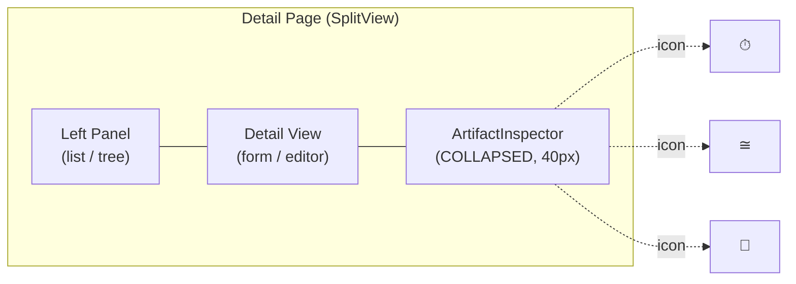
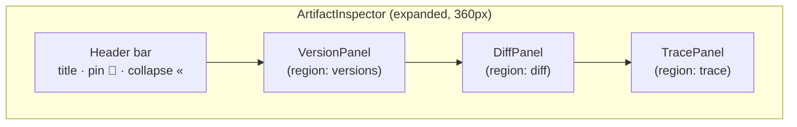
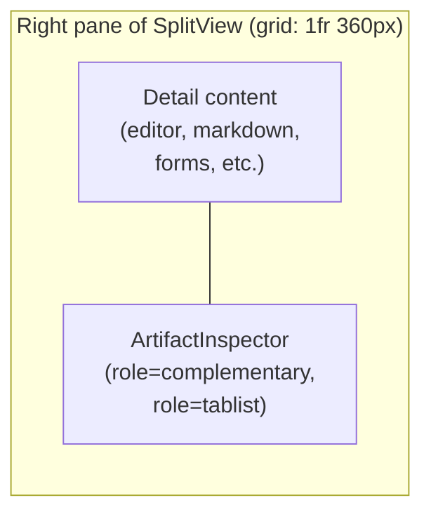
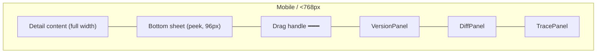
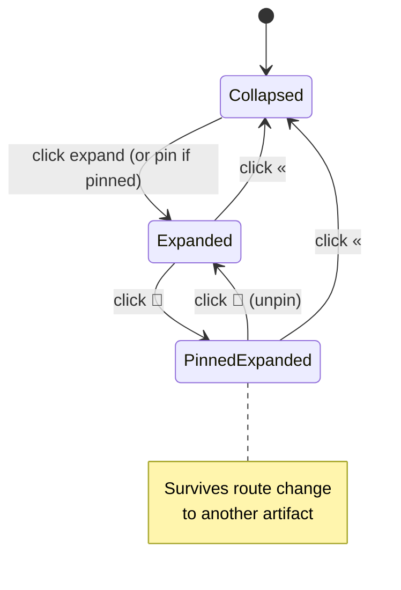

# UI Standards — ArtifactInspector (Unified Right Sidebar)

> **Status:** Design specification (no implementation)
> **Scope:** Frontend (React 18 + TypeScript)
> **Derived from:** REQ-L0-062 (Unified Artifact Inspector Sidebar) — see `docs/se/L0/SN_Stakeholder_Needs.md` §"Erweiterung v12"
> **Supersedes / replaces:** the page-specific inline sidebars of `IcdView`, `RequirementEditors`, `ArchitectureEditors`, `DiagramView`, and the linked-requirements panel of `TestCasesView` (see §[Adoption Checklist](#10-adoption-checklist--per-artifact-type-migration))

---

## 1. Purpose & Scope

### 1.1 What the ArtifactInspector is

The **ArtifactInspector** is the single, persistent, right-hand sidebar that
appears on the detail page of every artifact type that ReqFlow manages. It is
the only place where the three cross-cutting concerns of an artifact —
**versioning**, **field-level diffing**, and **traceability** — are exposed to
the user.

| Panel          | Role                                                                                                     |
|----------------|----------------------------------------------------------------------------------------------------------|
| `VersionPanel` | List of versions for the current artifact, with a baseline badge, a "switch to" action and a "compare to current" action. |
| `DiffPanel`    | Field-level diff between any two selectable versions. Reuses the existing `ArtifactDiff` component (`frontend/src/components/ArtifactDiff/ArtifactDiff.tsx`). |
| `TracePanel`   | Inbound + outbound `TraceLink`s, filterable by the 8 link types defined in `frontend/src/types/index.ts` (see §[5.1](#51-tracepanel)). Each row is a navigation link to the linked artifact. |

The shell supports **collapse** (hide all three panels) and **pin** (keep the
sidebar open while the user navigates between artifacts). Both states are
persisted in `localStorage` per user, per artifact type.

### 1.2 What the ArtifactInspector is **not**

- **Not** a navigation aid. The primary navigation is `SidebarNavigation` (in
  `frontend/src/components/NavigationShell/`).
- **Not** a content editor. Form fields, rich-text editors and the `SplitView`
  detail pane remain owned by the artifact's own editor component.
- **Not** a workspace- or project-level sidebar. It is scoped to the single
  artifact selected in the URL.
- **Not** a replacement for the full-screen `TraceabilityView`
  (`frontend/src/components/TraceabilityView/TraceabilityView.tsx`). The
  TracePanel is a *summary*; deep graph exploration stays in that view.

### 1.3 Acceptance cross-references

The acceptance criteria of REQ-L0-062 are mapped 1-to-1 onto the sections of
this document:

| AC   | Section(s)                                                          |
|------|---------------------------------------------------------------------|
| AC1  | §[10 Adoption Checklist](#10-adoption-checklist--per-artifact-type-migration) |
| AC2  | §[3 Anatomy](#3-anatomy), §[4 Component Contract](#4-component-contract) |
| AC3  | §[6 Interaction Patterns](#6-interaction-patterns), §[7 Data Flow & Persistence](#7-data-flow--persistence) |
| AC4  | §[4.4 TracePanel](#44-tracepanel), §[5.1](#51-tracepanel)           |
| AC5  | §[4.2 VersionPanel](#42-versionpanel)                               |
| AC6  | §[4.3 DiffPanel](#43-diffpanel), §[4.5 ArtifactDiff reuse](#45-artifactdiff-reuse) |
| AC7  | §[9 Accessibility](#9-accessibility)                                |
| AC8  | §[8 i18n Key Naming](#8-i18n-key-naming)                            |
| AC9  | §[10 Adoption Checklist](#10-adoption-checklist--per-artifact-type-migration) — ICD, Requirement, Architecture, Diagram, TestCase |

---

## 2. Existing inline sidebar being replaced

The most prominent inline sidebar that the unified pattern supersedes is the
right-hand `<aside>` block in the ICD detail page:

> **File:** `frontend/src/components/IcdView/IcdView.tsx`
> **Lines:** ~1154–1339 (`IcdDetailPane` → `<aside>`)
> **Test-IDs replaced:** `icd-versions-list`, `icd-traceability-sidebar`

The same component file also contains the *grid* that splits the detail pane
into a 2/3 + 1/3 layout (`gridTemplateColumns: "2fr 1fr"`, line ~1068) — that
1/3 column is what becomes the new `<ArtifactInspector>` slot.

For the full list of inline sidebars that this design replaces, see
§[10 Adoption Checklist](#10-adoption-checklist--per-artifact-type-migration).

---

## 3. Anatomy

The ArtifactInspector is a vertical stack of three collapsible panels inside a
fixed-width column. The column is owned by `SplitView`; the inspector sits
inside `SplitView`'s right pane and is rendered as a separate grid cell beside
the artifact's detail content (not over it).

### 3.1 Collapsed state (icon strip)



- Width: 40 px, full height of the right pane.
- Three stacked icon buttons (one per panel) in this order: Version → Diff → Trace.
- A small numeric badge on each icon if the corresponding panel has unread /
  freshly-loaded content (e.g. new version since last visit, diff ready,
  trace-link count).
- A toggle button at the bottom switches to the expanded state.

### 3.2 Expanded state (all 3 panels open)



Default expanded width is **360 px** (range 280–520 px, user-resizable via the
SplitView divider). The shell is a `<aside role="complementary">`.



If the viewport is narrow, the inspector collapses to the icon strip (§[3.3](#33-responsive--mobile--narrow-viewport)).

### 3.3 Responsive / mobile / narrow viewport

Below the same `< 768 px` breakpoint that `SplitView` already enforces, the
ArtifactInspector swaps from a side column to a **bottom sheet** anchored to
the right edge, with a drag handle.



- Sheet states: **peek** (header + panel-tab strip + first row of first
  panel), **half** (all three panels visible, each scrollable), **full**
  (covers the entire right pane; only the detail is visible behind it).
- Tapping the handle cycles peek → half → full → peek.
- Panels stack vertically inside the sheet, in the same Version → Diff → Trace
  order.

---

## 4. Component Contract

All panels are **pure presentational** components: they receive pre-resolved
data via props and emit intents via callbacks. Data fetching, caching and
invalidation live in a thin parent hook (`useArtifactInspectorData`,
described in §[7.1](#71-data-fetching-hook)). This keeps the panels trivially
re-usable across the 10 artifact types and easy to drive from MCP-based AI
agents.

### 4.0 Shared types (TypeScript shape)

```ts
// Common, located at frontend/src/components/ArtifactInspector/types.ts
export type ArtifactKind =
  | "icd"
  | "diagram"
  | "adr"
  | "risk"
  | "issue"
  | "glossary"
  | "stakeholderNeed"
  | "requirement"
  | "architecture"
  | "testCase";

export interface VersionEntry {
  version: number;
  label: string;             // human label, e.g. "v3 (current)"
  isCurrent: boolean;
  createdAt: string | null;  // ISO datetime
  baselineIds: UUID[];       // baselines that pin this version
}

export interface TraceLinkRow {
  id: UUID;
  direction: "inbound" | "outbound";
  linkType: LinkType;
  otherArtifact: {
    id: UUID;
    title: string;
    kind: ArtifactKind;
    route: string;
  };
  createdAt: string;
}

export type InspectorPanel = "version" | "diff" | "trace";
```

### 4.1 RightSidebar shell

```ts
export interface ArtifactInspectorProps {
  /** Which artifact is being inspected. */
  artifactId: UUID;
  artifactKind: ArtifactKind;

  /** Pre-resolved data from useArtifactInspectorData. */
  versions: VersionEntry[];
  traceLinks: TraceLinkRow[];

  /** Default to current version; allow user override. */
  selectedVersion: number;

  /** Initial panel tab when the sidebar is expanded. */
  initialPanel?: InspectorPanel;

  /** localStorage key suffix; default: "default". */
  storageNamespace?: string;

  /** Whether the user can mutate (controls edit affordances). */
  canEdit: boolean;

  /** Resolved baseline summary (see VersionPanel). */
  baselines: Array<{ id: UUID; name: string; scope: string; pinnedVersion: number }>;

  /** Fetcher for the diff between two versions. DiffPanel injects this so the
   *  shell stays unaware of entity-specific endpoints. */
  diffFetcher: (id: UUID, fromV: number, toV: number) => Promise<ArtifactDiffResult>;
  versionsFetcher: (id: UUID) => Promise<ArtifactVersion[]>;
  diffEntityType: "requirement" | "architecture" | "testcase" | "icd" | "diagram" | "adr" | "risk" | "issue" | "glossary" | "stakeholderNeed";

  /** Optional: MCP-driven actions (open in editor, copy id, derive, ...). */
  onVersionSwitch?: (version: number) => void;
  onTraceLinkClick?: (row: TraceLinkRow) => void;
}
```

The shell renders the header (title, pin 📌, collapse «), the three panel
slots in the fixed order **Version → Diff → Trace**, and the collapsed-state
icon strip. It does **not** fetch data; data is passed in.

### 4.2 VersionPanel

```ts
export interface VersionPanelProps {
  artifactId: UUID;
  versions: VersionEntry[];          // newest first
  selectedVersion: number;
  baselines: Array<{
    id: UUID;
    name: string;
    scope: "document" | "project" | "global";
    pinnedVersion: number;
  }>;
  canSwitch: boolean;                // false for icd/diagram where history is immutable
  loading: boolean;
  error: string | null;
  onSwitch: (version: number) => void;
  /** Triggered when the user picks "Compare to current" in the row menu. */
  onCompareToCurrent: (version: number) => void;
}
```

**Rendered UI** (per row):

| Field        | Source                                         | Behaviour on click                                  |
|--------------|------------------------------------------------|-----------------------------------------------------|
| Version label | `entry.label`                                 | If `canSwitch` → `onSwitch(entry.version)`          |
| Current dot  | `entry.isCurrent`                              | n/a (indicator)                                     |
| Baseline chip | `entry.baselineIds.length > 0`                | Tooltip: `Baselines: <name1>, <name2>` (comma-sep) |
| Date         | `entry.createdAt`                              | n/a (info)                                          |
| Overflow `…`  | always                                         | Opens menu: **Switch to v{n}**, **Compare to current**, **Copy version id** |

**Empty / loading / error states** — see §[6.4](#64-empty--loading--error-states).

**Baseline indicator copy** (concise, for chip tooltip and screen-reader text):
`"In Baseline: {name} ({scope}, {createdAt})"`.

### 4.3 DiffPanel

```ts
export interface DiffPanelProps {
  entityId: UUID;
  entityType: DiffEntityType;       // see ArtifactDiff.tsx + new types
  currentVersion: number;
  /** Versions available in the VersionPanel — drives the two dropdowns. */
  availableVersions: VersionEntry[];
  diffFetcher: (id: UUID, from: number, to: number) => Promise<ArtifactDiffResult>;
  versionsFetcher: (id: UUID) => Promise<ArtifactVersion[]>;
  /** Pre-selected comparison (e.g. when "Compare to current" is invoked
   *  from the VersionPanel). */
  initial?: { from: number; to: number };
  /** When true, the panel header swaps to "Restore" (not implemented in MVP). */
  allowRestore?: boolean;
}
```

The panel renders the existing `ArtifactDiff` component inside its body and
provides a compact two-row version selector header (`From ▾ v3` → `To ▾ v5`).
The fields inside `ArtifactDiff` are styled to fit the 360 px column width
(presently the component is full-width; see §[11 Open Questions](#11-open-questions)).

When the user invokes "Compare to current" from a VersionPanel row, the
DiffPanel receives `initial = { from: <clickedVersion>, to: <currentVersion> }`
and the inspector automatically scrolls/focuses the DiffPanel header
(`tabIndex={-1}` on the heading + `.focus()` after mount).

### 4.4 TracePanel

```ts
export interface TracePanelProps {
  artifactId: UUID;
  links: TraceLinkRow[];            // pre-resolved; see §[7.1](#71-data-fetching-hook)
  linkTypes: LinkType[];            // 8 types — see §[5.1](#51-tracepanel)
  activeTypeFilters: Set<LinkType>;
  onToggleTypeFilter: (t: LinkType) => void;
  onClearFilters: () => void;
  onLinkClick: (row: TraceLinkRow) => void;
  loading: boolean;
  error: string | null;
  pageSize?: number;                // default 25; "Show all" expands to all
}
```

**Rendered UI** (top to bottom):

1. **Filter chips** — one chip per `LinkType` (8 chips). Each chip is a toggle
   button (`aria-pressed="true|false"`). A trailing "Clear" link clears all
   filters. The filter row scrolls horizontally on narrow widths.
2. **Inbound section** — `h4` "Inbound (n)". List of `TraceLinkRow` whose
   `direction === "inbound"`.
3. **Outbound section** — `h4` "Outbound (n)". List of `TraceLinkRow` whose
   `direction === "outbound"`.
4. **Create-link affordance** — visible only if `canEdit` and the artifact
   kind supports it (Requirement, Architecture, TestCase, ICD, Diagram). It
   opens the existing `TraceLinkPanel` create form in a modal (do not embed
   the full panel; the modal is the source of truth). For non-editable kinds
   (Glossary, Stakeholder Need, Risk) the affordance is hidden.

Each row uses the existing `TraceLinkPanel` visual primitives
(`frontend/src/components/shared/TraceLinkPanel.tsx`) for consistency.

### 4.5 ArtifactDiff reuse

`DiffPanel` MUST reuse the existing `ArtifactDiff` component. To accommodate
all 10 artifact kinds, two changes are needed (not implemented in this doc,
see §[11](#11-open-questions)):

1. Extend `DiffEntityType` (currently `"requirement" | "architecture"` in
   `frontend/src/components/ArtifactDiff/ArtifactDiff.tsx:33`) to include the
   remaining kinds.
2. Wire `diffFetcher` and `versionsFetcher` per kind:
   - `requirement` → `requirementsApi.diff`, `requirementsApi.versions`
   - `architecture` → `architectureApi.diff`, `architectureApi.versions`
   - `testcase` → (TBD; backend support required)
   - `icd` → reuse `icdsApi.getVersionTimeline` (single-row model — diff is
     a no-op for v1, see §[11 Open Questions](#11-open-questions))
   - `diagram` → reuse `diagramsApi.getVersionTimeline` if available
   - `adr` / `risk` / `issue` → TBD; backend lacks `/diff/` endpoints
   - `glossary` / `stakeholderNeed` → TBD

   For kinds without a diff endpoint, the DiffPanel renders an
   **"Diff not available for this artifact kind"** empty state (with a
   tooltip explaining why) rather than a broken fetch.

### 4.6 Header (shell)

| Element       | Behaviour                                                       |
|---------------|-----------------------------------------------------------------|
| Title         | `t("sidebar.inspector.title", "Inspector")` — fixed             |
| Pin toggle 📌 | Persists in `localStorage[reqflow_inspector_pinned_<kind>]`; when pinned, the sidebar survives a route change to a different artifact of the same kind until the user unpins. |
| Collapse «    | Toggles to the icon strip; persists as `reqflow_inspector_collapsed_<kind>`. |

---

## 5. Data Model & APIs

### 5.1 VersionPanel

Sources (all read-only, no mutations on the client):

| Endpoint                                                                | Shape                       | Used by       |
|-------------------------------------------------------------------------|-----------------------------|---------------|
| `GET /api/v1/<kind>/<id>/`                                             | `{ version: number, created_at, ... }` | current version + metadata |
| `GET /api/v1/<kind>/<id>/versions/`                                    | `ArtifactVersion[]`         | Requirements, Architecture (existing), others if backend adds them |
| `GET /api/v1/icds/<id>/`                                                | synthesised in `icdsApi.getVersionTimeline()` (v1..vN) | ICD |
| `GET /api/v1/baselines/?workspace_id=<ws>&artifact_id=<id>`            | `PaginatedResponse<Baseline>` (see `frontend/src/api/baselines.ts`) | Baseline chips |

For kinds where the backend does not yet expose a `/versions/` endpoint
(ADR, Risk, Issue, Glossary, Stakeholder Need, TestCase), `VersionPanel`
renders only the **current** version (single row) and labels the panel
header `"Version"` instead of `"Version History"`. The `Compare to current`
menu item is disabled in that case.

### 5.2 DiffPanel

Existing endpoint (used by `ArtifactDiff`):
`GET /api/v1/requirements/<id>/diff/?from_version=<a>&to_version=<b>` and the
symmetric one for architecture — see
`frontend/src/api/requirements.ts:95` and
`frontend/src/api/architecture.ts:112`.

Payload (`ArtifactDiffResult` in `frontend/src/types/index.ts:488`):

```ts
{
  from_version: number,
  to_version: number,
  entity_type: string,
  fields: Array<{
    name: string,
    status: "added" | "removed" | "modified" | "unchanged",
    from?: string,
    to?: string,
    lines?: string[]  // for text fields with line-level diff
  }>,
  note?: string
}
```

### 5.3 TracePanel

Source (existing, see `frontend/src/api/tracelinks.ts:20`):

```
GET /api/v1/tracelinks/?workspace_id=<ws>&artifact_id=<id>
```

Returns `PaginatedResponse<TraceLink>` (`frontend/src/types/index.ts:164`).
The data hook then calls `resolveArtifactRef(id)` for each `other_id` to
obtain `{ title, route }` (existing helper at
`frontend/src/api/artifactRefs.ts:35`).

`LinkType` (8 types) — see `frontend/src/types/index.ts:154`:

```
parent-child | derives-from | satisfies | verifies |
implements  | refines     | documents | allocated-to
```

The TracePanel uses this exact 8-value union for its filter chips. The
backend enum (`backend/traceability/types.py`) defines 12 values; the
frontend subset is the public contract for the inspector and any future
additions require a coordinated type + i18n update.

---

## 6. Interaction Patterns

### 6.1 Collapse / pin

- **Collapse** (`«` button) hides the three panels and shows the icon strip.
  Persisted under `reqflow_inspector_collapsed_<kind>` (`true` / `false`).
- **Pin** (`📌` button) toggles persistence across artifact navigation:
  - **Pinned** — when the user navigates to a different artifact of the same
    kind, the inspector remains expanded (collapse state ignored).
  - **Unpinned** (default) — when the user navigates away, the inspector
    collapses to the icon strip.
- Persisted under `reqflow_inspector_pinned_<kind>` (`true` / `false`).
- Both states default to `false` on a fresh user/workspace.

### 6.2 Panel switching

- Each panel header is a `<button>` rendered as a **disclosure**
  (`aria-expanded`, `aria-controls`) so the panel can be collapsed *individually*
  without affecting the others. Initial state: all three open.
- Disclosure state is per-session (in-memory); only the global
  collapse/pin (§[6.1](#61-collapse--pin)) is persisted.

### 6.3 Lazy-load on expand

- Data fetching starts when the inspector **first expands** (not when the
  page loads). The `useArtifactInspectorData` hook:
  1. Fetches versions + baselines + trace links in parallel
     (`Promise.all`).
  2. Resolves trace-link target refs via `resolveArtifactRef` (debounced per
     id, max 6 in flight).
  3. Caches the resolved refs for the session keyed by artifact id
     (`Map<UUID, ArtifactRef>`).
- If the user collapses the inspector while data is in flight, the requests
  continue but the response is discarded; a re-expand re-uses the cache
  (TTL: 60 s, then re-fetched silently in the background).

### 6.4 Empty / loading / error states

| State         | VersionPanel                            | DiffPanel                                            | TracePanel                                      |
|---------------|------------------------------------------|-------------------------------------------------------|-------------------------------------------------|
| **Loading**   | Skeleton rows (3 lines, 24 px each)      | Compact spinner centred, no dropdowns yet            | Skeleton chips + 3 skeleton rows per section    |
| **Empty**     | "No version history for this artifact"   | "Select two versions above to compare"               | "No trace links" (with link to `TraceabilityView`) |
| **Error**     | Red banner with retry button             | Red banner; clear the dropdowns to retry             | Red banner with retry; chips remain interactive |
| **Diff kind unsupported** | n/a                            | "Diff is not yet available for {kind} artifacts"     | n/a                                             |

All banners use the existing tokens: `var(--color-danger)` background tint,
`var(--color-text)` foreground. All buttons keep `cursor: pointer` and
`:focus-visible` ring (see §[9.2](#92-keyboard--focus)).

### 6.5 Refresh

- A small `↻` icon in the inspector header re-runs the data hook in
  full (no cache).
- VersionPanel also has a "Refresh versions" overflow item on the latest
  row, which re-fetches only versions + baselines.

---

## 7. Data Flow & Persistence

### 7.1 Data-fetching hook

```ts
// frontend/src/components/ArtifactInspector/useArtifactInspectorData.ts
export function useArtifactInspectorData(args: {
  artifactId: UUID;
  artifactKind: ArtifactKind;
  workspaceId: UUID;
  enabled: boolean;          // false when collapsed
}): {
  versions: VersionEntry[];
  baselines: BaselineChip[];
  traceLinks: TraceLinkRow[];
  diffFetcher: DiffFetcher;
  versionsFetcher: VersionsFetcher;
  isLoading: boolean;
  error: string | null;
  refresh: () => void;
};
```

The hook is the single integration point with the existing API clients in
`frontend/src/api/`. It does **not** own localStorage — persistence is the
shell's concern.

### 7.2 Persistence keys

| Key                                                | Type      | Default |
|----------------------------------------------------|-----------|---------|
| `reqflow_inspector_collapsed_<kind>`               | `"true"`  | `"false"` |
| `reqflow_inspector_pinned_<kind>`                  | `"true"`  | `"false"` |
| `reqflow_inspector_panelstate_<kind>_<artifactId>` | JSON `{version: bool, diff: bool, trace: bool}` | `{true,true,true}` |
| `reqflow_inspector_tracefilter_<kind>_<artifactId>`| JSON `LinkType[]`                          | all 8 types selected |
| `reqflow_inspector_width_<kind>`                   | number (px)                                | 360 |

`<kind>` ∈ `icd|diagram|adr|risk|issue|glossary|stakeholderNeed|requirement|architecture|testCase`.

`<artifactId>` is included only where per-artifact customisation matters
(panel collapsed state and trace filter). The width and the global
collapse/pin are per-kind so the user gets a consistent sidebar across all
artifacts of the same kind.

### 7.3 State diagram (shell)



---

## 8. i18n Key Naming

The namespace is fixed and was defined in REQ-L0-062. The complete key tree
that the implementation MUST populate (in both `frontend/src/i18n/locales/en.json`
and `de.json`) is:

```text
sidebar.inspector.title              # "Inspector" / "Inspektor"
sidebar.inspector.collapse           # "Collapse sidebar" / "Seitenleiste einklappen"
sidebar.inspector.expand             # "Open sidebar" / "Seitenleiste öffnen"
sidebar.inspector.pin                # "Pin sidebar" / "Seitenleiste anheften"
sidebar.inspector.unpin              # "Unpin sidebar" / "Seitenleiste lösen"
sidebar.inspector.refresh            # "Refresh" / "Aktualisieren"
sidebar.inspector.skeletonLoading    # "Loading inspector..." / "Lade Inspektor..."

sidebar.version.title                # "Version" / "Version"
sidebar.version.currentLabel         # "Current" / "Aktuell"
sidebar.version.baselineChip         # "In baseline: {name}" / "In Baseline: {name}"
sidebar.version.baselineChipPlural   # "In {n} baselines" / "In {n} Baselines"
sidebar.version.empty                # "No version history for this artifact." / "Keine Versionshistorie für dieses Artefakt."
sidebar.version.error                # "Could not load versions." / "Versionen konnten nicht geladen werden."
sidebar.version.menu.switch          # "Switch to v{n}" / "Zu v{n} wechseln"
sidebar.version.menu.compare         # "Compare to current" / "Mit aktueller Version vergleichen"
sidebar.version.menu.copy            # "Copy version id" / "Versions-ID kopieren"
sidebar.version.copied               # "Version id copied" / "Versions-ID kopiert"

sidebar.diff.title                   # "Diff" / "Diff"
sidebar.diff.from                    # "From" / "Von"
sidebar.diff.to                      # "To" / "Bis"
sidebar.diff.empty                   # "Select two versions above to compare." / "Wähle oben zwei Versionen zum Vergleichen."
sidebar.diff.error                   # "Could not load diff." / "Diff konnte nicht geladen werden."
sidebar.diff.unsupported             # "Diff is not yet available for {kind} artifacts." / "Diff ist für {kind}-Artefakte noch nicht verfügbar."
sidebar.diff.compareCurrent          # "Comparing v{from} → v{to}" / "Vergleiche v{from} → v{to}"

sidebar.trace.title                  # "Trace Links" / "Trace-Links"
sidebar.trace.inbound                # "Inbound" / "Eingehend"
sidebar.trace.outbound               # "Outbound" / "Ausgehend"
sidebar.trace.empty                  # "No trace links." / "Keine Trace-Links."
sidebar.trace.error                  # "Could not load trace links." / "Trace-Links konnten nicht geladen werden."
sidebar.trace.filter.label           # "Filter by type" / "Nach Typ filtern"
sidebar.trace.filter.clear           # "Clear" / "Zurücksetzen"
sidebar.trace.filter.allSelected     # "All types" / "Alle Typen"
sidebar.trace.create                 # "Add trace link" / "Trace-Link hinzufügen"
sidebar.trace.viewAll                # "View full graph" / "Vollständigen Graph anzeigen"
```

**Code-fence version of the naming pattern (machine-friendly):**

```text
sidebar.<area>.<key>                  # area ∈ {inspector, version, diff, trace}
sidebar.<area>.<key>                  # key  ∈ camelCase, dot-nested if needed
sidebar.<area>.<key>.{param}          # interpolation via i18next {{name}}
```

Hard rule: **never** nest under the existing `tracelinks.*` or `icds.*`
namespaces — those are page-scoped. The inspector owns its own subtree
prefixed with `sidebar.*`.

---

## 9. Accessibility

### 9.1 ARIA roles

| Element                          | Role / attribute                                                      |
|----------------------------------|------------------------------------------------------------------------|
| Outer sidebar                    | `<aside role="complementary" aria-label="{t(sidebar.inspector.title)}">` |
| Each panel wrapper               | `<section role="region" aria-labelledby="inspector-<panel>-label">`    |
| Panel header (clickable disclosure) | `<h3><button aria-expanded aria-controls="inspector-<panel>-body">…</button></h3>` |
| Filter chips                     | `<button role="switch" aria-pressed="true|false">`                     |
| Version list                     | `<ol>` (semantic ordered list)                                         |
| Trace link list                  | `<ul>` with each item `<li>` containing a `<button>` (whole row is the button) |
| Diff update announce              | `<div role="status" aria-live="polite">` showing the latest `fromVersion → toVersion` |
| Version switch live region        | `<div role="status" aria-live="polite">` announces "Switched to v{n}" |

### 9.2 Keyboard / focus

- The sidebar MUST be reachable via **Tab** in the order: header (pin,
  collapse) → panel 1 disclosure → panel 2 disclosure → panel 3 disclosure
  → panel content (version rows / diff version selectors / trace filter
  chips → trace link rows).
- **Inside a version list**:
  - `ArrowDown` / `ArrowUp` move focus between version rows
    (`roving tabindex`, first row `tabIndex={0}`, others `tabIndex={-1}`).
  - `Enter` / `Space` opens the overflow menu (or directly triggers
    `onSwitch` if the row is not the current version).
  - `Escape` closes the overflow menu.
- **Inside the trace filter**:
  - `ArrowLeft` / `ArrowRight` move between chips.
  - `Space` toggles `aria-pressed`.
  - `Enter` on a trace-link row navigates to the linked artifact
    (`onLinkClick`).
- **Focus ring** — every focusable element uses a 2 px solid
  `var(--color-primary)` outline with 2 px offset; tokens already define
  `var(--color-primary)` for both dark and light themes
  (`frontend/src/styles/tokens.css`).

### 9.3 Screen reader

- All copy is in the i18n keys (§[8](#8-i18n-key-naming)) so EN + DE are
  supported from day one.
- Icon-only buttons (`📌`, `«`, `↻`, overflow `…`) carry
  `aria-label="…"` resolved through the i18n keys.
- Diff status badges (added/removed/modified/unchanged) include the text
  in addition to color (the existing `STATUS_LABELS` in
  `ArtifactDiff.tsx:87`).
- The "Comparing v3 → v5" status div is a polite live region — assistive
  tech announces the change once the diff is loaded.

### 9.4 Reduced motion

- All transitions use the existing `var(--transition-fast)`. The CSS
  `@media (prefers-reduced-motion: reduce)` block in
  `frontend/src/styles/tokens.css` (or a new rule) sets these to
  `transition: none`.

---

## 10. Theming & Spacing

The inspector uses **only** the design tokens defined in
`frontend/src/styles/tokens.css`; no hard-coded hex values. Spacing follows
the existing 4 px scale (`--space-1` = 0.25 rem … `--space-8` = 2 rem).

### 10.1 Tokens in use

| Concern        | Token(s)                                                       |
|----------------|----------------------------------------------------------------|
| Sidebar background | `var(--color-surface)`                                       |
| Panel background (raised) | `var(--color-surface-raised)`                          |
| Border         | `1px solid var(--color-border)`                                |
| Hover border / accent | `var(--color-border-hover)` / `var(--color-primary)`    |
| Header text    | `var(--font-size-base)`, weight 700                            |
| Panel title    | `var(--font-size-lg)`, weight 600                              |
| Body text      | `var(--font-size-sm)`                                          |
| Caption (date, count) | `var(--font-size-xs)`, color `var(--color-text-muted)`    |
| Primary action | `background: var(--color-primary); color: var(--color-text)`  |
| Danger         | `background: var(--color-danger); color: white`                |
| Focus ring     | `outline: 2px solid var(--color-primary); outline-offset: 2px` |
| Radius         | `var(--radius-md)` (panels), `var(--radius-full)` (chips/badges) |
| Shadow         | `var(--shadow-card)` (panel header)                            |

### 10.2 Spacing

- Outer padding: `var(--space-4)` (1 rem).
- Between panels: `var(--space-3)` (0.75 rem) — gap in the flex column.
- Inner padding of a panel: `var(--space-4)`.
- Row gap inside a list: `var(--space-2)` (0.5 rem).
- Chip horizontal padding: `var(--space-2) var(--space-3)`.
- Button padding: `var(--space-2) var(--space-4)`.

### 10.3 Typography sizes

| Element           | Token                  |
|-------------------|------------------------|
| Sidebar title     | `var(--font-size-base)` (1 rem), weight 700 |
| Panel title       | `var(--font-size-lg)` (1.125 rem), weight 600 |
| Version label     | `var(--font-size-sm)` (0.875 rem), weight 600 |
| Date / caption    | `var(--font-size-xs)` (0.75 rem) |
| Diff field label  | inherits `var(--font-size-sm)` |

### 10.4 Light vs dark theme

Both themes are already covered by the token layer
(`frontend/src/styles/tokens.css` lines 1–62 dark, 69–98 light, toggled by
`data-theme="light"` on `<html>`). The inspector requires no theme-specific
overrides.

---

## 11. Adoption Checklist — per-artifact-type migration

The 10 artifact types fall into three migration categories. The "Replace"
column lists the inline sidebars that must be removed when the ArtifactInspector
is adopted.

| Artifact Type        | Route (approx.)                       | Migration     | Existing inline sidebar to remove                                                                                                                                          | Backend gaps                                                                                                |
|----------------------|---------------------------------------|---------------|----------------------------------------------------------------------------------------------------------------------------------------------------------------------------|-------------------------------------------------------------------------------------------------------------|
| **ICD**              | `/icds/:id`                           | **Replace**   | `<aside>` in `frontend/src/components/IcdView/IcdView.tsx` (lines ~1154–1339, test-ids `icd-versions-list` + `icd-traceability-sidebar`)                                  | `GET /icds/<id>/versions/` and `/diff/` not exposed — VersionPanel renders current only, DiffPanel shows "Diff not yet available" |
| **Diagram**          | `/diagrams/:id`                       | **Replace**   | `<aside data-testid="diagram-traceability-panel">` in `frontend/src/components/DiagramView/DiagramView.tsx` (lines ~1045–1234, including the inline create-link form)        | `/diff/` endpoint missing                                                                                   |
| **Requirement**      | `/requirements/:id`                   | **Replace**   | `<TraceabilityPanel>` rendered in `frontend/src/components/RequirementEditors/RequirementForm.tsx` (line ~470, the `upstreamLinks`/`downstreamLinks` props) — REQ-L3-RF003-003 | none                                                                                                        |
| **Architecture**     | `/architecture/:id`                   | **Replace**   | `<aside data-testid="arch-linked-reqs-panel">` in `frontend/src/components/ArchitectureEditors/ArchitectureEditors.tsx` (lines ~252–326) — REQ-L3-RF004-003                  | none                                                                                                        |
| **TestCase**         | `/testcases/:id`                      | **Replace**   | The "Linked Requirements" panel inside `frontend/src/components/TestCases/TestCasesView.tsx` (lines ~828–870)                                                              | `/diff/` endpoint missing                                                                                   |
| **Stakeholder Need** | `/needs/:id`                          | **Add**       | (none — `NeedForm.tsx` already uses the shared `TraceLinkPanel`; replace that with the unified `TracePanel` and wrap the page in `<ArtifactInspector>`)                   | `/versions/` and `/diff/` endpoints missing                                                                 |
| **ADR**              | `/adrs/:id`                           | **Add**       | (none — `AdrList.tsx` has no detail editor yet)                                                                                                                            | `/versions/` and `/diff/` endpoints missing                                                                 |
| **Risk**             | `/risks/:id`                          | **Add**       | (none — `RiskList.tsx` has no detail editor yet)                                                                                                                           | `/versions/` and `/diff/` endpoints missing                                                                 |
| **Issue**            | `/issues/:id`                         | **Add**       | (none — `IssueList.tsx` has no detail editor yet)                                                                                                                          | `/versions/` and `/diff/` endpoints missing                                                                 |
| **Glossary**         | `/glossary/:id`                       | **Add**       | (none — `GlossaryView.tsx` has no detail editor yet)                                                                                                                       | `/versions/`, `/diff/`, and (in practice) any meaningful trace-link affordance                              |

### 11.1 Per-type migration steps

For each **Replace** type:

1. Open the page component and remove the inline `<aside>` (or equivalent
   `TraceabilityPanel` import + JSX).
2. Move the `data-testid`s listed above to the new `<ArtifactInspector>`
   wrapper so existing e2e selectors keep working (or update e2e in the
   same PR — preferred).
3. Render `<ArtifactInspector …>` as the second grid child of the page's
   right pane (after the detail form). Wrap the page in `<SplitView
   moduleType="<kind>">` if it does not already use one.
4. Wire `useArtifactInspectorData({ artifactId, artifactKind, workspaceId, enabled: !collapsed })`
   and pass the result into the inspector.
5. Pass `diffFetcher`/`versionsFetcher` only if the kind has the backend
   support; otherwise pass a stub that throws → DiffPanel shows the
   "unsupported" empty state.
6. Remove obsolete state (e.g. `timeline`, `traceability` from
   `IcdView.tsx`).
7. Update tests:
   - The frontend has no test for the inline ICD sidebar (verified
     via `Get-ChildItem frontend/src/components/IcdView`); only the
     e2e suite (under `e2e/`) is at risk.
   - Replace any test-id-based selector with the new
     `data-testid="artifact-inspector-<panel>"` value.

For each **Add** type (Stakeholder Need, ADR, Risk, Issue, Glossary):

1. Identify the page component and the right-pane JSX. If a SplitView
   already exists, add the inspector as the second child; if not, wrap
   the page in `<SplitView moduleType="<kind>" leftPanel={…} rightPanel={<>{detail}<ArtifactInspector …/></>}>`.
2. Implement the page's detail fetch in the standard hook shape
   (versions → VersionPanel, baseline-aware, etc.).
3. For Glossary and Stakeholder Need: the `TraceLinkPanel` integration
   is already there; replace the inline panel with the unified
   `TracePanel` and feed it the same `links` + `refsById` data.

### 11.2 Rollout order (suggested)

1. **Phase A — Shell + one type (Requirement)**: build the shell,
   `useArtifactInspectorData`, and migrate the Requirement editor
   (which already has the cleanest data hooks).
2. **Phase B — Architecture + TestCase**: same `diffFetcher` shape,
   reuse VersionPanel and TracePanel.
3. **Phase C — ICD + Diagram**: handle the synthetic-timeline case
   (single-row version model).
4. **Phase D — Add-only types**: ADR, Risk, Issue, Glossary,
   Stakeholder Need. These need a detail editor first; the inspector
   can land in parallel.

---

## 12. Open Questions for the Orchestrator

1. **Diff endpoint coverage** — only Requirement and Architecture have
   a `/diff/` endpoint today. Should the inspector:
   (a) render the existing `ArtifactDiff` for those two and show a
   "Diff is not yet available for {kind}" empty state for the other 8,
   or
   (b) wait for backend support before adopting the inspector on the
   remaining 8 kinds?
   Recommendation: **(a)** — the inspector is still useful with
   Version + Trace, and the empty state is the right cue for a follow-up
   backend task.

2. **ArtifactDiff width** — the existing `ArtifactDiff` component
   assumes a full-width detail pane (the `<pre>` blocks have `overflow-x: auto`
   but the field labels are stacked vertically). Should we:
   (a) wrap it as-is in a 360 px column and accept tighter line breaks, or
   (b) extract the field-row CSS to a `DiffPanel.module.scss` that
   flips to a horizontal `name | status | from → to` layout at narrow
   widths?
   Recommendation: **(b)** — the visual experience in a 360 px column
   is materially better.

3. **DiffEntityType extension** — `DiffEntityType` is currently a
   2-value union. Extending it to 10 values is mechanical but touches
   the public type. Is that acceptable, or should we re-export a wider
   `ArtifactKind` and use it instead?

4. **Pin semantics across kinds** — does "pin" mean "keep open across
   all artifact kinds" or "keep open across all artifacts of *this*
   kind"? Current design assumes the latter (per-kind localStorage).
   Confirm with product.

5. **Baseline chip freshness** — the VersionPanel reads baselines from
   `GET /baselines/?artifact_id=<id>`. Should the chip auto-refresh
   when the user navigates to a different artifact, or only on user
   action (`↻` button)? Current design: auto-refresh on artifact change,
   manual refresh on the `↻` button.

6. **MCP-driven affordances** — REQ-L0-046 calls out "proactive AI
   agents". Should the inspector expose hook points (props / events)
   for an MCP server to drive actions like "switch to latest baseline
   version" or "open the supersede flow"? Out of scope for the first
   cut, but worth flagging in the type signature so it is
   forward-compatible (see `onVersionSwitch` / `onTraceLinkClick`).

7. **Existing inline sidebars not yet inventoried** — a sweep across
   `frontend/src/components/**/!(*.test).tsx` for `<aside
   data-testid=…>` should be run before the design is finalised. The
   ones listed in §[11](#11-adoption-checklist--per-artifact-type-migration)
   were located by manual grep; there may be additional
   page-specific panels (e.g. inside a modal) that should also be
   migrated.

---

*End of design document. Implementation MUST follow this contract; any
deviation requires an update to this file and a re-review by the
ui-ux-designer agent.*
