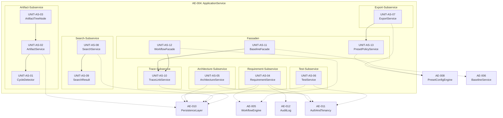
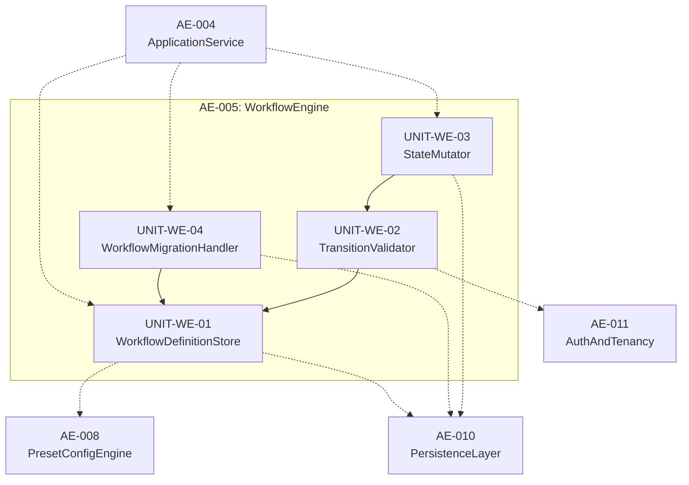
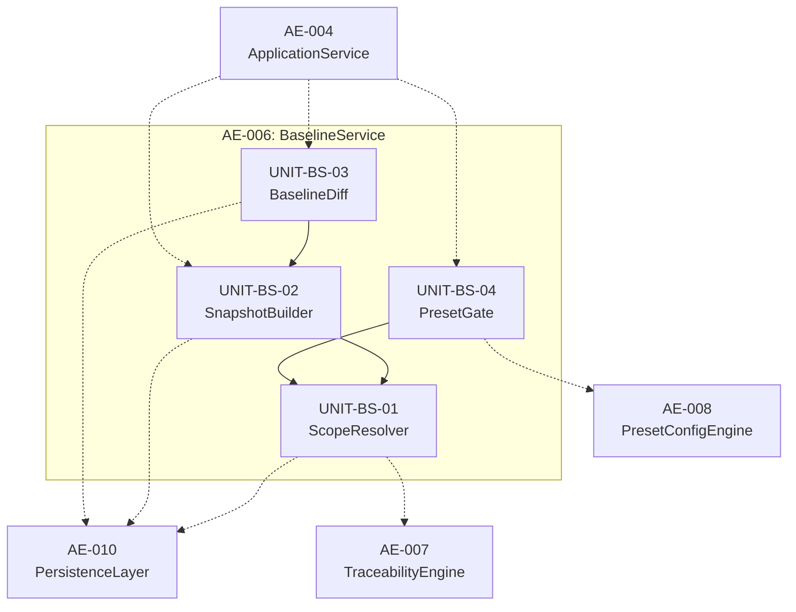
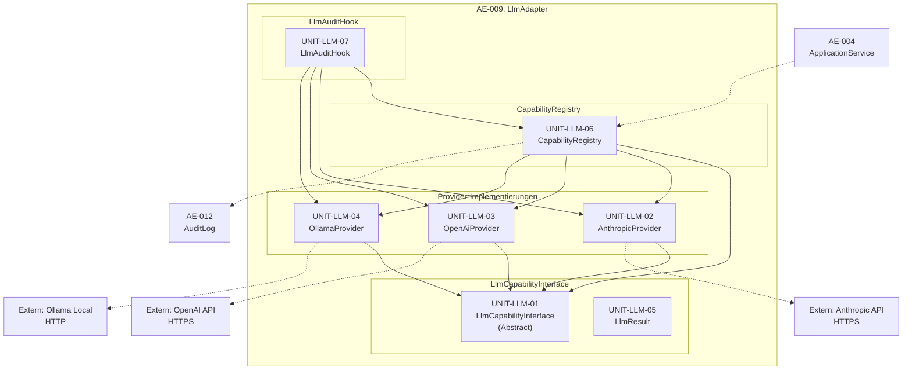
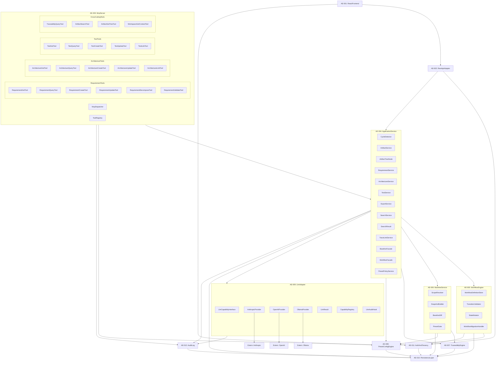

# ReqFlow — Architecture Elements L3 (Detailed Subsystem Decomposition)

> Status: ENTWURF | Erstellt: 2026-06-17
> Quelle: REQUIREMENTS_L3.md + architecture-elements.md + system-overview.md
> Sprache: Deutsch (Beschreibungen), English (IDs, Code-Namen).

---

## 1. Übersicht

### 1.1 L3-Zerlegungsprinzip

Die L3-Zerlegung transformiert die fünf kritischsten Architecture Elements (AE-003, AE-004, AE-005, AE-006, AE-009) aus der L2-Whitebox in **konkrete, implementierbare Code-Units** (Python-Klassen, Module, Datenklassen). Jede Unit erfüllt genau eine messbare Verantwortlichkeit und ist mindestens einer UNIT-REQ zugeordnet.

**Zerlegungsregeln:**
- **Single Responsibility:** Jede Unit hat genau eine benennbare Verantwortlichkeit.
- **Dependency Direction:** Abhängigkeiten zeigen von oben (Facade/Service) nach unten (Repository/Model/Utility). Keine zyklischen Abhängigkeiten.
- **Interface Segregation:** Schnittstellen zwischen Units sind minimal und kohäsiv.
- **Testbarkeit:** Jede Unit ist isoliert testbar (Mock-bare Abhängigkeiten).

### 1.2 Scope und Metriken

| Metrik | Wert |
|--------|------|
| Zerlegte AEs | 5 (AE-004, AE-003, AE-005, AE-006, AE-009) |
| Interne Units (Gesamt) | 50 |
| UNIT-REQ-Abdeckung | 81 / 81 (100%) |
| Externe AE-Schnittstellen | 7 AE-Kontexte (AE-001, AE-002, AE-007, AE-008, AE-010, AE-011, AE-012) |

### 1.3 Unit-ID-Schema

| AE | Präfix | Beispiel |
|----|--------|----------|
| AE-004 ApplicationService | `UNIT-AS-` | `UNIT-AS-01` … `UNIT-AS-13` |
| AE-003 McpServer | `UNIT-MCP-` | `UNIT-MCP-01` … `UNIT-MCP-22` |
| AE-005 WorkflowEngine | `UNIT-WE-` | `UNIT-WE-01` … `UNIT-WE-04` |
| AE-006 BaselineService | `UNIT-BS-` | `UNIT-BS-01` … `UNIT-BS-04` |
| AE-009 LlmAdapter | `UNIT-LLM-` | `UNIT-LLM-01` … `UNIT-LLM-07` |

---

## 2. AE-004: ApplicationService — L3-Zerlegung

> **Typ:** Service | **Priorität:** P0 | **UNIT-REQs:** 25
>
> Die zentrale Domain-Service-Fassade. Nach Use-Case-Gruppen (Subservices) partitioniert. Orchestriert untergeordnete Domain-Services und stellt transaktionale Konsistenz sicher.

### 2.1 Interne Struktur



**Legende:** Durchgezogene Pfeile = interne Abhängigkeiten. Gestrichelte Pfeile = externe Schnittstellen zu anderen AEs.

### 2.2 Unit-Katalog

| ID | Name | Typ | Verantwortlichkeit | UNIT-REQs |
|----|------|-----|--------------------|-----------|
| UNIT-AS-01 | `CycleDetector` | Validator | DFS-basierte Zyklus-Erkennung in der Artifact-Hierarchie (direkte + indirekte Zyklen). | UNIT-REQ-001 |
| UNIT-AS-02 | `ArtifactService` | Service | Artifact-Hierarchie-CRUD, Zyklus-Prüf-Hook vor Persistierung, Recursive-CTE-Tree-Query. | UNIT-REQ-002, UNIT-REQ-003 |
| UNIT-AS-03 | `ArtifactTreeNode` | Builder | Datenklasse für Knoten im Artefakt-Baum mit Serialisierung (`to_dict`). | UNIT-REQ-004 |
| UNIT-AS-04 | `RequirementService` | Service | Requirement-CRUD, Workflow-Initialisierung, change_reason-Validierung, Löschung mit TraceLink-Cascade. | UNIT-REQ-005, UNIT-REQ-006, UNIT-REQ-007 |
| UNIT-AS-05 | `ArchitectureService` | Service | ArchitectureElement-CRUD, Typ-Validierung, Optimistic-Locking-Versionierung, Löschung mit TraceLink-Cascade. | UNIT-REQ-008, UNIT-REQ-009, UNIT-REQ-010 |
| UNIT-AS-06 | `TestService` | Service | TestCase-CRUD, Typ-Validierung, Ausführungsstatus-Update, Query mit Filterung. | UNIT-REQ-011, UNIT-REQ-012, UNIT-REQ-013 |
| UNIT-AS-07 | `ExportService` | Service | JSON-/CSV-Export-Generator, Terminologie-Profil-Metadatum-Einbettung. | UNIT-REQ-014, UNIT-REQ-015, UNIT-REQ-016 |
| UNIT-AS-08 | `SearchService` | Service | PostgreSQL-Full-Text-Search-Executor, Typ-Filter, Workspace-Filter. | UNIT-REQ-017, UNIT-REQ-019, UNIT-REQ-020 |
| UNIT-AS-09 | `SearchResult` | Builder | Datenklasse für einzelne Suchergebnisse mit Serialisierung. | UNIT-REQ-018 |
| UNIT-AS-10 | `TraceLinkService` | Service | TraceLink-CRUD, Source/Target-Validierung, Bulk-Löschung bei Entity-Delete. | UNIT-REQ-021, UNIT-REQ-022 |
| UNIT-AS-11 | `BaselineFacade` | Facade | Baseline-Erstellungs-Orchestrierung (delegiert an AE-006 BaselineService). | UNIT-REQ-023 |
| UNIT-AS-12 | `WorkflowFacade` | Facade | Workflow-Transition-Orchestrierung (delegiert an AE-005 WorkflowEngine). | UNIT-REQ-024 |
| UNIT-AS-13 | `PresetPolicyService` | Validator | Downgrade-Inkompabilitäts-Prüfung bei Preset-Wechsel. | UNIT-REQ-025 |

### 2.3 Schnittstellen-Deklaration

#### UNIT-AS-01: CycleDetector
```python
class CycleDetector:
    def detect_cycle(artifact_id: UUID, proposed_parent_id: UUID) -> bool:
        """
        Prüft ob ein Zyklus entstehen würde.
        Pre: artifact_id != proposed_parent_id (direkte Selbstreferenz wird erkannt)
        Post: Gibt False zurück wenn kein Zyklus. Löst CycleDetectedException bei Zyklus.
        """
        ...
```

#### UNIT-AS-02: ArtifactService
```python
class ArtifactService:
    def set_parent(self, artifact_id: UUID, new_parent_id: UUID | None) -> None:
        """
        Setzt den parent eines Artifacts. Prüft Zyklus vor Persistierung.
        Pre: Artifact existiert.
        Post: parent-Feld aktualisiert, oder CycleDetectedException bei Zyklus.
        """
        ...

    def get_tree(self, workspace_id: UUID, root_id: UUID | None = None) -> list[ArtifactTreeNode]:
        """
        Liefert die Artefakt-Hierarchie via Recursive CTE.
        Pre: Workspace existiert.
        Post: Liste von ArtifactTreeNode (verschachtelt).
        """
        ...
```

#### UNIT-AS-03: ArtifactTreeNode
```python
from dataclasses import dataclass

@dataclass
class ArtifactTreeNode:
    artifact: Artifact
    children: list["ArtifactTreeNode"]
    depth: int
    path: list[UUID]

    def to_dict(self) -> dict:
        """
        Serialisiert den Baum als rekursives JSON-Objekt.
        """
        ...
```

#### UNIT-AS-04: RequirementService
```python
class RequirementService:
    def create_requirement(self, title: str, description: str, category: str,
                           artifact_id: UUID, priority: str | None = None,
                           tags: list[str] | None = None) -> Requirement:
        """
        Erzeugt ein Requirement mit initialem WorkflowState.
        Pre: Artifact existiert, Kategorie ist gültig.
        Post: Requirement mit version=1, workflow_state=initial.
        """
        ...

    def update_requirement(self, requirement_id: UUID, fields: dict,
                           change_reason: str | None = None) -> Requirement:
        """
        Aktualisiert Felder. Prüft change_reason im Extended-Preset.
        Pre: Requirement existiert.
        Post: version inkrementiert, oder ValidationError / OptimisticLockError.
        """
        ...

    def delete_requirement(self, requirement_id: UUID) -> int:
        """
        Löscht Requirement und zugehörige TraceLinks.
        Pre: Requirement existiert.
        Post: Requirement + TraceLinks gelöscht, Anzahl gelöschter Links zurückgegeben.
        """
        ...
```

#### UNIT-AS-05: ArchitectureService
```python
class ArchitectureService:
    def create_architecture_element(self, title: str, description: str,
                                    element_type: str, workspace_id: UUID,
                                    artifact_id: UUID | None = None) -> ArchitectureElement:
        """
        Erzeugt ArchitectureElement mit Typ-Validierung.
        Pre: element_type in (Component, Interface, Subsystem, Layer, Module).
        Post: Element mit version=1 und initialem WorkflowState.
        """
        ...

    def update_architecture_element(self, architecture_element_id: UUID,
                                    fields: dict, expected_version: int) -> ArchitectureElement:
        """
        Update mit Optimistic Locking.
        Pre: expected_version == aktuelle Version.
        Post: version inkrementiert, oder OptimisticLockError.
        """
        ...

    def delete_architecture_element(self, architecture_element_id: UUID) -> int:
        """
        Löscht Element und zugehörige TraceLinks.
        Pre: Element existiert.
        Post: Element + TraceLinks gelöscht.
        """
        ...
```

#### UNIT-AS-06: TestService
```python
class TestService:
    def create_test_case(self, title: str, test_type: str, workspace_id: UUID,
                         description: str | None = None,
                         linked_req_id: UUID | None = None) -> TestCase:
        """
        Erzeugt TestCase. Optional mit TraceLink zu Requirement.
        Pre: test_type in (Unit, Integration, System, Acceptance).
        Post: TestCase + optional TraceLink verifies.
        """
        ...

    def update_test_status(self, test_case_id: UUID, execution_status: str) -> TestCase:
        """
        Aktualisiert Ausführungsstatus.
        Pre: execution_status in (Passed, Failed, Not Run).
        Post: execution_status aktualisiert, version inkrementiert.
        """
        ...

    def query_test_cases(self, filters: dict) -> PaginatedList[TestCase]:
        """
        Filtert TestCases nach test_type, workspace_id, execution_status, workflow_state.
        Post: Paginierte Liste, AND-Logik bei kombinierten Filtern.
        """
        ...
```

#### UNIT-AS-07: ExportService
```python
class ExportService:
    def export_json(self, scope: str, scope_id: UUID) -> dict:
        """
        JSON-Export aller Entitäten im Scope.
        Post: JSON mit metadata.terminology_profile.
        """
        ...

    def export_csv(self, scope: str, scope_id: UUID) -> str:
        """
        CSV-Export aller Entitäten im Scope.
        Post: UTF-8 CSV mit Kommentar-Zeile # terminology_profile: <name>.
        """
        ...

    def _get_terminology_metadata(self, workspace_id: UUID) -> dict:
        """
        Liest aktives Terminologie-Profil von PresetConfigEngine.
        Post: {"terminology_profile": <profil_name>}.
        """
        ...
```

#### UNIT-AS-08: SearchService
```python
class SearchService:
    def search(self, query: str, types: list[str] | None = None,
               workspace_id: UUID | None = None) -> list[SearchResult]:
        """
        PostgreSQL tsvector/tsquery Full-Text-Suche.
        Post: Nach Relevanz sortierte Ergebnisliste.
        """
        ...

    def _apply_type_filter(self, queryset: QuerySet, types: list[str]) -> QuerySet:
        """
        Schränkt Ergebnisse auf Artefakttypen ein.
        Pre: Alle Typen sind gültige Enum-Werte.
        """
        ...

    def _apply_workspace_filter(self, queryset: QuerySet, workspace_id: UUID) -> QuerySet:
        """
        Schränkt Ergebnisse auf Workspace ein.
        """
        ...
```

#### UNIT-AS-09: SearchResult
```python
@dataclass
class SearchResult:
    entity_id: UUID
    artifact_type: str  # requirement | architecture_element | test_case
    title: str
    description_snippet: str  # max 200 Zeichen
    relevance_score: float
    workspace_id: UUID

    def to_dict(self) -> dict:
        """
        Serialisiert das Ergebnis für REST/MCP-Responses.
        """
        ...
```

#### UNIT-AS-10: TraceLinkService
```python
class TraceLinkService:
    def create_trace_link(self, source_type: str, source_id: UUID,
                          target_type: str, target_id: UUID,
                          link_type: str) -> TraceLink:
        """
        Erzeugt TraceLink mit Validierung.
        Pre: link_type in (parent-child, derives-from, satisfies, verifies, implements, refines).
        Post: TraceLink persistiert, oder ValidationError.
        """
        ...

    def delete_links_for_entity(self, entity_type: str, entity_id: UUID) -> int:
        """
        Löscht alle TraceLinks einer Entität (als Source oder Target).
        Post: Anzahl gelöschter Links zurückgegeben.
        """
        ...
```

#### UNIT-AS-11: BaselineFacade
```python
class BaselineFacade:
    def create_baseline(self, scope: str, name: str, workspace_id: UUID | None = None,
                        artifact_id: UUID | None = None, description: str | None = None) -> Baseline:
        """
        Orchestriert Baseline-Erstellung.
        Pre: Scope ist im Preset erlaubt.
        Post: Baseline mit atomarem JSON-Snapshot.
        """
        ...
```

#### UNIT-AS-12: WorkflowFacade
```python
class WorkflowFacade:
    def transition(self, item_type: str, item_id: UUID, target_state: str,
                   change_reason: str | None = None) -> WorkflowState:
        """
        Orchestriert Workflow-State-Übergang.
        Pre: Transition ist in WorkflowDefinition erlaubt.
        Post: State aktualisiert, History-Eintrag geschrieben.
        """
        ...
```

#### UNIT-AS-13: PresetPolicyService
```python
class PresetPolicyService:
    def validate_downgrade(self, workspace_id: UUID, target_preset: str) -> list[str]:
        """
        Prüft Inkompabilitäten beim Preset-Downgrade.
        Post: Leere Liste = OK, oder DowngradeBlockedError mit Gründen.
        """
        ...
```

---

## 3. AE-003: McpServer — L3-Zerlegung

> **Typ:** Component | **Priorität:** P0 | **UNIT-REQs:** 22
>
> Nativer MCP-Protokoll-Handler für AI-Agenten. Implementiert 20 Tools in vier Gruppen plus Transport-/Dispatch-Schicht. Jede Tool-Gruppe ist ein dünner Translator: JSON-Schema-Validierung → ApplicationService-Aufruf → Ergebnis-Serialisierung.

### 3.1 Interne Struktur

```mermaid
flowchart TD
    subgraph AE003["AE-003: McpServer"]
        subgraph Transport["McpTransport"]
            U14["UNIT-MCP-01<br/>McpDispatcher"]
            U15["UNIT-MCP-02<br/>ToolRegistry"]
        end

        subgraph ReqTools["RequirementTools (6 Tools)"]
            U16["UNIT-MCP-03<br/>RequirementGetTool"]
            U17["UNIT-MCP-04<br/>RequirementQueryTool"]
            U18["UNIT-MCP-05<br/>RequirementCreateTool"]
            U19["UNIT-MCP-06<br/>RequirementUpdateTool"]
            U20["UNIT-MCP-07<br/>RequirementDecomposeTool"]
            U21["UNIT-MCP-08<br/>RequirementValidateTool"]
        end

        subgraph ArchTools["ArchitectureTools (5 Tools)"]
            U22["UNIT-MCP-09<br/>ArchitectureGetTool"]
            U23["UNIT-MCP-10<br/>ArchitectureQueryTool"]
            U24["UNIT-MCP-11<br/>ArchitectureCreateTool"]
            U25["UNIT-MCP-12<br/>ArchitectureUpdateTool"]
            U26["UNIT-MCP-13<br/>ArchitectureLinkTool"]
        end

        subgraph TestTools["TestTools (5 Tools)"]
            U27["UNIT-MCP-14<br/>TestGetTool"]
            U28["UNIT-MCP-15<br/>TestQueryTool"]
            U29["UNIT-MCP-16<br/>TestCreateTool"]
            U30["UNIT-MCP-17<br/>TestUpdateTool"]
            U31["UNIT-MCP-18<br/>TestLinkTool"]
        end

        subgraph CrossTools["CrossCuttingTools (4 Tools)"]
            U32["UNIT-MCP-19<br/>TraceabilityQueryTool"]
            U33["UNIT-MCP-20<br/>ArtifactSearchTool"]
            U34["UNIT-MCP-21<br/>ArtifactGetTreeTool"]
            U35["UNIT-MCP-22<br/>WorkspaceGetContextTool"]
        end
    end

    %% Transport-Dispatch
    U14 --> U15

    %% Tool-Registrierung
    U15 --> U16
    U15 --> U17
    U15 --> U18
    U15 --> U19
    U15 --> U20
    U15 --> U21
    U15 --> U22
    U15 --> U23
    U15 --> U24
    U15 --> U25
    U15 --> U26
    U15 --> U27
    U15 --> U28
    U15 --> U29
    U15 --> U30
    U15 --> U31
    U15 --> U32
    U15 --> U33
    U15 --> U34
    U15 --> U35

    %% Externe Schnittstellen (gestrichelt)
    U16 -.-> AE004["AE-004<br/>ApplicationService"]
    U17 -.-> AE004
    U18 -.-> AE004
    U19 -.-> AE004
    U20 -.-> AE004
    U21 -.-> AE009["AE-009<br/>LlmAdapter"]
    U22 -.-> AE004
    U23 -.-> AE004
    U24 -.-> AE004
    U25 -.-> AE004
    U26 -.-> AE004
    U27 -.-> AE004
    U28 -.-> AE004
    U29 -.-> AE004
    U30 -.-> AE004
    U31 -.-> AE004
    U32 -.-> AE007["AE-007<br/>TraceabilityEngine"]
    U33 -.-> AE004
    U34 -.-> AE004
    U35 -.-> AE008["AE-008<br/>PresetConfigEngine"]
    U35 -.-> AE007
    U35 -.-> AE005["AE-005<br/>WorkflowEngine"]

    %% Auth + Audit
    U14 -.-> AE011["AE-011<br/>AuthAndTenancy"]
    U18 -.-> AE012["AE-012<br/>AuditLog"]
    U19 -.-> AE012
    U24 -.-> AE012
    U25 -.-> AE012
    U29 -.-> AE012
    U30 -.-> AE012
    U26 -.-> AE012
    U31 -.-> AE012
```



**Legende:** Durchgezogene Pfeile = interne Dispatch-/Registrierungs-Beziehungen. Gestrichelte Pfeile = externe Delegation an ApplicationService oder andere Domain-Services.

### 3.2 Unit-Katalog

| ID | Name | Typ | Verantwortlichkeit | UNIT-REQs |
|----|------|-----|--------------------|-----------|
| UNIT-MCP-01 | `McpDispatcher` | Handler | Empfängt JSON-RPC-Requests, validiert Pflichtfelder, leitet an Tool-Handler weiter. | UNIT-REQ-026 |
| UNIT-MCP-02 | `ToolRegistry` | Registry | Verwaltet Registrierung aller 20 MCP-Tools gruppiert nach Tool-Gruppe. | UNIT-REQ-027 |
| UNIT-MCP-03 | `RequirementGetTool` | Handler | `requirement.get` — Einzelabruf mit Kontext (Traces, Workflow-History, Audit). | UNIT-REQ-028 |
| UNIT-MCP-04 | `RequirementQueryTool` | Handler | `requirement.query` — Filter-Query mit JSON-Schema-Validierung. | UNIT-REQ-029 |
| UNIT-MCP-05 | `RequirementCreateTool` | Handler | `requirement.create` — Erstellung mit Audit-Log-Eintrag. | UNIT-REQ-030 |
| UNIT-MCP-06 | `RequirementUpdateTool` | Handler | `requirement.update` — Update mit change_reason Fail-Fast. | UNIT-REQ-031 |
| UNIT-MCP-07 | `RequirementDecomposeTool` | Handler | `requirement.decompose` — Batch-Zerlegung mit optionaler LLM-Konsultation. | UNIT-REQ-032 |
| UNIT-MCP-08 | `RequirementValidateTool` | Handler | `requirement.validate` — LLM-gestützte Prüfung mit graceful Error. | UNIT-REQ-033 |
| UNIT-MCP-09 | `ArchitectureGetTool` | Handler | `architecture.get` — Einzelabruf mit Kontext. | UNIT-REQ-034 |
| UNIT-MCP-10 | `ArchitectureQueryTool` | Handler | `architecture.query` — Filter-Query. | UNIT-REQ-035 |
| UNIT-MCP-11 | `ArchitectureCreateTool` | Handler | `architecture.create` — Erstellung mit Audit. | UNIT-REQ-036 |
| UNIT-MCP-12 | `ArchitectureUpdateTool` | Handler | `architecture.update` — Update mit OptimisticLock-Propagation. | UNIT-REQ-037 |
| UNIT-MCP-13 | `ArchitectureLinkTool` | Handler | `architecture.link` — TraceLink-Erstellung. | UNIT-REQ-038 |
| UNIT-MCP-14 | `TestGetTool` | Handler | `test.get` — Einzelabruf mit Kontext. | UNIT-REQ-039 |
| UNIT-MCP-15 | `TestQueryTool` | Handler | `test.query` — Filter-Query. | UNIT-REQ-040 |
| UNIT-MCP-16 | `TestCreateTool` | Handler | `test.create` — Erstellung mit optionaler Verknüpfung. | UNIT-REQ-041 |
| UNIT-MCP-17 | `TestUpdateTool` | Handler | `test.update` — Status-Update nach Ausführung. | UNIT-REQ-042 |
| UNIT-MCP-18 | `TestLinkTool` | Handler | `test.link` — Nachträgliche TraceLink-Erstellung. | UNIT-REQ-043 |
| UNIT-MCP-19 | `TraceabilityQueryTool` | Handler | `traceability.query` — Upstream/Downstream-Graph. | UNIT-REQ-044 |
| UNIT-MCP-20 | `ArtifactSearchTool` | Handler | `artifact.search` — Typ-übergreifende Volltextsuche. | UNIT-REQ-045 |
| UNIT-MCP-21 | `ArtifactGetTreeTool` | Handler | `artifact.get_tree` — Hierarchie-Abruf. | UNIT-REQ-046 |
| UNIT-MCP-22 | `WorkspaceGetContextTool` | Handler | `workspace.get_context` — Workspace-Metadaten-Aggregation. | UNIT-REQ-047 |

### 3.3 Schnittstellen-Deklaration

#### UNIT-MCP-01: McpDispatcher
```python
class McpDispatcher:
    def dispatch(self, jsonrpc_request: dict) -> dict:
        """
        Empfängt JSON-RPC-Request und leitet an registrierten Tool-Handler weiter.
        Pre: jsonrpc_request enthält jsonrpc, method, id, params.
        Post: JSON-RPC Response oder Error (-32601 bei unbekanntem Tool, -32600 bei Invalid Request).
        """
        ...
```

#### UNIT-MCP-02: ToolRegistry
```python
class ToolRegistry:
    def register_tool(self, tool_name: str, schema: dict, handler: Callable) -> None:
        """
        Registriert ein Tool mit JSON-Schema und Handler-Referenz.
        Post: Tool ist via get_handler() abrufbar.
        """
        ...

    def get_handler(self, tool_name: str) -> Callable | None:
        """
        Liefert Handler für Tool-Namen.
        Post: Handler-Referenz oder None.
        """
        ...

    def list_tools(self) -> list[dict]:
        """
        Listet alle registrierten Tools mit Name und Schema.
        Post: Liste für MCP tools/list Response.
        """
        ...
```

#### Tool-Handler (vereinheitlichtes Schema)

Alle 20 Tool-Handler (UNIT-MCP-03 bis UNIT-MCP-22) implementieren eine einheitliche Schnittstelle:

```python
class BaseToolHandler:
    def execute(self, params: dict) -> dict:
        """
        Führt das Tool aus. Validiert Params gegen JSON-Schema, delegiert an ApplicationService.
        Pre: Params sind schema-konform.
        Post: JSON-RPC-konformes Ergebnis-Dict oder Error-Dict.
        """
        ...

    def validate_params(self, params: dict) -> list[str]:
        """
        Prüft Params gegen internes JSON-Schema.
        Post: Liste von Validierungsfehlern (leer = OK).
        """
        ...
```

Konkrete Implementierungen (Beispiele):

```python
class RequirementGetTool(BaseToolHandler):
    def execute(self, params: dict) -> dict:
        """
        UNIT-MCP-03: requirement.get
        Pre: params.id ist gültige UUID.
        Post: Requirement-Daten + Traces + Workflow-History + Audit-Felder.
        """
        ...

class RequirementDecomposeTool(BaseToolHandler):
    def execute(self, params: dict) -> dict:
        """
        UNIT-MCP-07: requirement.decompose
        Pre: params.id ist gültige UUID.
        Post: Liste erzeugter Kind-Requirements mit UUIDs, oder LLM_NOT_CONFIGURED Error.
        """
        ...

class WorkspaceGetContextTool(BaseToolHandler):
    def execute(self, params: dict) -> dict:
        """
        UNIT-MCP-22: workspace.get_context
        Post: JSON mit open_requirements, unlinked_tests, coverage, preset, terminology_profile, workflow_definitions.
        """
        ...
```

---

## 4. AE-005: WorkflowEngine — L3-Zerlegung

> **Typ:** Service | **Priorität:** P1 | **UNIT-REQs:** 14
>
> Verwaltung konfigurierbarer Item-Lifecycles. Führt WorkflowDefinitions pro Item-Typ und Workspace, validiert State-Übergänge gegen erlaubte Rollen und change_reason-Pflicht, und protokolliert jeden Übergang append-only.

### 4.1 Interne Struktur



### 4.2 Unit-Katalog

| ID | Name | Typ | Verantwortlichkeit | UNIT-REQs |
|----|------|-----|--------------------|-----------|
| UNIT-WE-01 | `WorkflowDefinitionStore` | Repository | CRUD für WorkflowDefinitions, Default-Templates pro Preset (Minimal/Standard/Extended). | UNIT-REQ-048, UNIT-REQ-049, UNIT-REQ-050, UNIT-REQ-051 |
| UNIT-WE-02 | `TransitionValidator` | Validator | Prüft Transition-Erlaubnis, Rollenberechtigung, Change-Reason-Pflicht. | UNIT-REQ-052, UNIT-REQ-053, UNIT-REQ-054, UNIT-REQ-055 |
| UNIT-WE-03 | `StateMutator` | Service | Atomare State-Aktualisierung, append-only History-Eintrag, WorkflowState-Initialisierung. | UNIT-REQ-056, UNIT-REQ-057, UNIT-REQ-058 |
| UNIT-WE-04 | `WorkflowMigrationHandler` | Handler | Erkennung verwaister States bei Definition-Änderung, Migrations-Blockade. | UNIT-REQ-059, UNIT-REQ-060, UNIT-REQ-061 |

### 4.3 Schnittstellen-Deklaration

#### UNIT-WE-01: WorkflowDefinitionStore
```python
class WorkflowDefinitionStore:
    def create_default_definition(self, workspace_id: UUID, item_type: str,
                                   preset: str = "minimal") -> WorkflowDefinition:
        """
        Erzeugt Default-WorkflowDefinition für Preset.
        Pre: preset in (minimal, standard, extended), item_type in (requirement, architecture_element, test_case).
        Post: Persistierte WorkflowDefinition mit is_default=true.
        """
        ...

    def create_custom_definition(self, workspace_id: UUID, item_type: str,
                                  name: str, states: list[dict],
                                  transitions: list[dict]) -> WorkflowDefinition:
        """
        Erzeugt benutzerdefinierte WorkflowDefinition.
        Pre: Mindestens ein initial-State, alle Transition-States existieren, keine Duplikate.
        Post: Persistierte benutzerdefinierte Definition.
        """
        ...
```

#### UNIT-WE-02: TransitionValidator
```python
class TransitionValidator:
    def validate_transition(self, workflow_definition: WorkflowDefinition,
                            from_state: str, to_state: str) -> bool:
        """
        Prüft ob Transition in Definition erlaubt ist.
        Post: True oder TransitionNotAllowedError.
        """
        ...

    def validate_role(self, transition: WorkflowTransitionDefinition,
                      user_roles: list[str]) -> bool:
        """
        Prüft ob Nutzerrolle für Transition erlaubt ist.
        Post: True oder RoleNotAllowedError.
        """
        ...

    def validate_change_reason(self, transition: WorkflowTransitionDefinition,
                               change_reason: str | None) -> bool:
        """
        Prüft change_reason-Pflicht.
        Post: True oder ChangeReasonRequiredError.
        """
        ...

    def validate(self, workflow_definition: WorkflowDefinition, from_state: str,
                 to_state: str, user_roles: list[str],
                 change_reason: str | None) -> bool:
        """
        Kombinierte Validierungs-Pipeline (Fail-Fast).
        Post: True oder erste fehlschlagende Exception.
        """
        ...
```

#### UNIT-WE-03: StateMutator
```python
class StateMutator:
    def mutate(self, workflow_state: WorkflowState, to_state: str) -> WorkflowState:
        """
        Atomare State-Aktualisierung mit Optimistic Locking.
        Pre: workflow_state.version stimmt mit DB überein.
        Post: current_state aktualisiert, version inkrementiert, oder OptimisticLockError.
        """
        ...

    def write_history(self, workflow_state: WorkflowState, from_state: str, to_state: str,
                      user_id: UUID, change_reason: str | None = None) -> None:
        """
        Schreibt append-only History-Eintrag.
        Post: Eintrag angehängt, oder HistoryImmutableError bei Manipulationsversuch.
        """
        ...

    def initialize_state(self, item_type: str, item_id: UUID,
                         workflow_definition: WorkflowDefinition) -> WorkflowState:
        """
        Erzeugt neuen WorkflowState mit initialem State.
        Pre: WorkflowDefinition hat genau einen initial-State.
        Post: WorkflowState mit current_state=initial, history=[].
        """
        ...
```

#### UNIT-WE-04: WorkflowMigrationHandler
```python
class WorkflowMigrationHandler:
    def find_orphaned_items(self, old_definition: WorkflowDefinition,
                            new_definition: WorkflowDefinition) -> list[dict]:
        """
        Identifiziert Items in verwaisten States.
        Post: Liste von {item_type, item_id, orphaned_state}.
        """
        ...

    def validate_migration(self, old_definition: WorkflowDefinition,
                           new_definition: WorkflowDefinition) -> bool:
        """
        Blockiert Definition-Änderung bei verwaisten Items.
        Post: True oder MigrationBlockedError.
        """
        ...

    def apply_definition_change(self, definition: WorkflowDefinition,
                                new_states: list[dict],
                                new_transitions: list[dict]) -> WorkflowDefinition:
        """
        Orchestriert Definition-Änderung mit Migrations-Check.
        Post: Aktualisierte Definition, oder MigrationBlockedError (Transaktion rollback).
        """
        ...
```

---

## 5. AE-006: BaselineService — L3-Zerlegung

> **Typ:** Service | **Priorität:** P1 | **UNIT-REQs:** 10
>
> Erstellung unveränderlicher, benannter Baselines auf drei Scopes (document, project, global). Ermittelt betroffene Item-IDs und Versionen, persistiert atomar als JSON-Snapshot und stellt Diff-Vergleiche bereit.

### 5.1 Interne Struktur



### 5.2 Unit-Katalog

| ID | Name | Typ | Verantwortlichkeit | UNIT-REQs |
|----|------|-----|--------------------|-----------|
| UNIT-BS-01 | `ScopeResolver` | Resolver | Ermittelt betroffene Item-IDs/Versionen je Scope (document/project/global). | UNIT-REQ-062, UNIT-REQ-063, UNIT-REQ-064 |
| UNIT-BS-02 | `SnapshotBuilder` | Builder | Erstellt atomaren JSON-Snapshot, persistiert unveränderlich, validiert Immutability. | UNIT-REQ-065, UNIT-REQ-066 |
| UNIT-BS-03 | `BaselineDiff` | Service | Vergleich zweier Baselines (added/changed/removed), Ergebnis-Serialisierung, Kompatibilitätsprüfung. | UNIT-REQ-067, UNIT-REQ-068, UNIT-REQ-069 |
| UNIT-BS-04 | `PresetGate` | Validator | Scope-Verfügbarkeitsprüfung vor Baseline-Erstellung (Preset-abhängig). | UNIT-REQ-070, UNIT-REQ-071 |

### 5.3 Schnittstellen-Deklaration

#### UNIT-BS-01: ScopeResolver
```python
class ScopeResolver:
    def resolve_document_scope(self, artifact_id: UUID) -> list[dict]:
        """
        Ermittelt Items für Document-Scope.
        Post: Liste von {entity_type, entity_id, version} für Artifact + Nachkommen + zugehörige Items.
        """
        ...

    def resolve_project_scope(self, workspace_id: UUID) -> list[dict]:
        """
        Ermittelt Items für Project-Scope.
        Post: Liste aller Items im Workspace.
        """
        ...

    def resolve_global_scope(self, tenant_id: UUID) -> list[dict]:
        """
        Ermittelt Items für Global-Scope.
        Post: Liste aller Items aller Workspaces des Tenants.
        """
        ...
```

#### UNIT-BS-02: SnapshotBuilder
```python
class SnapshotBuilder:
    def build(self, baseline_name: str, scope: str, resolved_items: list[dict],
              workspace_id: UUID | None = None, artifact_id: UUID | None = None,
              created_by: UUID, description: str | None = None) -> Baseline:
        """
        Erzeugt atomaren Baseline-Snapshot.
        Post: Persistierte Baseline mit unveränderlichem snapshot-Feld.
        """
        ...

    def validate_immutable(self, baseline_id: UUID) -> bool:
        """
        Stellt sicher dass Snapshot nicht verändert wurde.
        Post: True oder Exception bei Mutation.
        """
        ...
```

#### UNIT-BS-03: BaselineDiff
```python
class BaselineDiff:
    def compute(self, baseline_a: Baseline, baseline_b: Baseline) -> BaselineDiffResult:
        """
        Berechnet Diff zwischen zwei Baselines.
        Post: BaselineDiffResult mit added, removed, changed.
        """
        ...

    def validate_compatibility(self, baseline_a: Baseline, baseline_b: Baseline) -> bool:
        """
        Prüft ob Baselines vergleichbar sind.
        Post: True oder BaselineIncompatibleError.
        """
        ...

@dataclass
class BaselineDiffResult:
    added: list[dict]
    removed: list[dict]
    changed: list[dict]
    added_count: int
    removed_count: int
    changed_count: int

    def to_dict(self) -> dict:
        """
        Serialisiert Diff-Ergebnis.
        """
        ...
```

#### UNIT-BS-04: PresetGate
```python
class PresetGate:
    def is_scope_allowed(self, workspace_id: UUID, scope: str) -> bool:
        """
        Prüft Scope-Erlaubnis basierend auf aktivem Preset.
        Post: True (erlaubt) oder False (nicht erlaubt).
        """
        ...

    def require_scope_allowed(self, workspace_id: UUID, scope: str) -> None:
        """
        Wrapper: wirft ScopeNotAllowedError bei nicht erlaubtem Scope.
        """
        ...
```

---

## 6. AE-009: LlmAdapter — L3-Zerlegung

> **Typ:** Component | **Priorität:** P2 | **UNIT-REQs:** 10
>
> Provider-agnostische LLM-Abstraktionsschicht. Stabile interne Schnittstelle, austauschbare Provider-Implementierungen, Graceful Degradation bei fehlender Konfiguration.

### 6.1 Interne Struktur



### 6.2 Unit-Katalog

| ID | Name | Typ | Verantwortlichkeit | UNIT-REQs |
|----|------|-----|--------------------|-----------|
| UNIT-LLM-01 | `LlmCapabilityInterface` | Adapter | Abstrakte Basisklasse mit drei Operationen (validate_artifact, decompose_requirement, check_consistency). | UNIT-REQ-072 |
| UNIT-LLM-02 | `AnthropicProvider` | Adapter | Claude-API-Implementierung. | UNIT-REQ-073 |
| UNIT-LLM-03 | `OpenAiProvider` | Adapter | OpenAI-API-Implementierung. | UNIT-REQ-074 |
| UNIT-LLM-04 | `OllamaProvider` | Adapter | Lokale Ollama-API-Implementierung (Self-Hosted). | UNIT-REQ-075 |
| UNIT-LLM-05 | `LlmResult` | Builder | Standardisierte Datenklassen für LLM-Rückgaben (LlmResult, LlmDecompositionResult, LlmConsistencyResult). | UNIT-REQ-076 |
| UNIT-LLM-06 | `CapabilityRegistry` | Registry | Deployment-Config-Auslesung, Provider-Registrierung, Graceful-Degradation-Wrapper, Capability-Aktivierung. | UNIT-REQ-077, UNIT-REQ-078, UNIT-REQ-079 |
| UNIT-LLM-07 | `LlmAuditHook` | Handler | Audit-Logging für LLM-Aufrufe, Token-Verbrauch-Tracking. | UNIT-REQ-080, UNIT-REQ-081 |

### 6.3 Schnittstellen-Deklaration

#### UNIT-LLM-01: LlmCapabilityInterface
```python
from abc import ABC, abstractmethod

class LlmCapabilityInterface(ABC):
    @abstractmethod
    def validate_artifact(self, artifact_id: UUID) -> LlmResult:
        """
        LLM-gestützte Qualitätsprüfung.
        Post: LlmResult mit score und suggestions.
        """
        ...

    @abstractmethod
    def decompose_requirement(self, requirement_id: UUID) -> LlmDecompositionResult:
        """
        LLM-gestützte Zerlegungsvorschläge.
        Post: LlmDecompositionResult mit Kind-Vorschlägen.
        """
        ...

    @abstractmethod
    def check_consistency(self, workspace_id: UUID) -> LlmConsistencyResult:
        """
        LLM-gestützte Konsistenzprüfung.
        Post: LlmConsistencyResult mit issues.
        """
        ...
```

#### UNIT-LLM-02..04: Provider-Implementierungen

```python
class AnthropicProvider(LlmCapabilityInterface):
    def __init__(self, api_key: str, model: str = "claude-3-5-sonnet-20241022"):
        ...
    # Implementiert alle drei abstrakten Methoden

class OpenAiProvider(LlmCapabilityInterface):
    def __init__(self, api_key: str, model: str = "gpt-4o"):
        ...
    # Implementiert alle drei abstrakten Methoden

class OllamaProvider(LlmCapabilityInterface):
    def __init__(self, base_url: str, model: str = "llama3.1"):
        ...
    # Implementiert alle drei abstrakten Methoden
```

#### UNIT-LLM-05: LlmResult
```python
@dataclass
class LlmResult:
    score: float  # 0.0 - 1.0
    suggestions: list[str]
    provider: str
    model: str
    token_usage: dict | None  # {prompt_tokens, completion_tokens, total_tokens}

    def __post_init__(self):
        if not 0.0 <= self.score <= 1.0:
            raise ValueError("score must be between 0.0 and 1.0")

@dataclass
class LlmDecompositionResult(LlmResult):
    children: list[dict]  # [{title, description}]

@dataclass
class LlmConsistencyResult(LlmResult):
    issues: list[dict]  # [{type, description, affected_items}]
```

#### UNIT-LLM-06: CapabilityRegistry
```python
class CapabilityRegistry:
    def __init__(self):
        self._provider: LlmCapabilityInterface | None = None

    def get_provider(self) -> LlmCapabilityInterface | None:
        """
        Liefert aktiven Provider oder None.
        """
        ...

    def execute_capability(self, capability_name: str, **kwargs) -> dict:
        """
        Zentraler Einstiegspunkt für LLM-Aufrufe.
        Post: {"result": LlmResult} oder {"error": {code, message}}.
        """
        ...

    def is_capability_enabled(self, capability_name: str) -> bool:
        """
        Prüft ob Capability in Deployment aktiviert ist.
        """
        ...
```

#### UNIT-LLM-07: LlmAuditHook
```python
class LlmAuditHook:
    def log_llm_call(self, provider: str, capability: str, artifact_id: UUID,
                     token_usage: dict | None = None, success: bool = True,
                     error: str | None = None) -> None:
        """
        Schreibt LLM-Aufruf in AuditLog.
        Post: AuditLog-Eintrag mit source="llm_adapter".
        """
        ...

    def extract_token_usage(self, provider_response: dict) -> dict | None:
        """
        Extrahiert Token-Verbrauch aus Provider-Response.
        Post: {prompt_tokens, completion_tokens, total_tokens} oder None.
        """
        ...
```

---

## 7. L3-Gesamtübersicht



**Lesehinweis:** Die Gesamtübersicht zeigt die 5 detailliert zerlegten AEs mit ihren internen Units (als Kästen) und die 7 nicht zerlegten AEs als Kontext (einfache Knoten). Alle Pfeile sind externe Schnittstellen — die internen Abhängigkeiten innerhalb der AEs sind in den jeweiligen AE-spezifischen Diagrammen dargestellt.

---

## 8. Schnittstellen-Matrix L3

Die Matrix listet alle internen Unit→Unit-Schnittstellen und Unit→AE-Schnittstellen der 5 zerlegten AEs.

### 8.1 AE-004: ApplicationService — Interne Schnittstellen

| Source | Target | Schnittstelle | Typ | Payload |
|--------|--------|---------------|-----|---------|
| UNIT-AS-02 | UNIT-AS-01 | `detect_cycle()` | API | `artifact_id: UUID, proposed_parent_id: UUID → bool / CycleDetectedException` |
| UNIT-AS-02 | UNIT-AS-03 | `get_tree()` liefert | API | `list[ArtifactTreeNode]` |
| UNIT-AS-08 | UNIT-AS-09 | `search()` liefert | API | `list[SearchResult]` |
| UNIT-AS-11 | UNIT-AS-10 | `delete_links_for_entity()` | API | `entity_type, entity_id → int` |
| UNIT-AS-12 | UNIT-AS-10 | `delete_links_for_entity()` | API | `entity_type, entity_id → int` |
| UNIT-AS-07 | UNIT-AS-13 | `_get_terminology_metadata()` | API | `workspace_id → dict` |

### 8.2 AE-004: ApplicationService — Externe Schnittstellen

| Source | Target | Schnittstelle | Typ | Payload |
|--------|--------|---------------|-----|---------|
| UNIT-AS-02, UNIT-AS-04, UNIT-AS-05, UNIT-AS-06, UNIT-AS-08, UNIT-AS-10 | AE-010 | Django ORM | API | `tenant_id`-gefilterte Queries |
| UNIT-AS-04 | AE-005 | Workflow-Initialisierung | API | `item_type, workspace_id → WorkflowState` |
| UNIT-AS-04, UNIT-AS-05, UNIT-AS-06 | AE-011 | RBAC-Check | API | `operation, resource → bool / PermissionDenied` |
| UNIT-AS-04, UNIT-AS-05, UNIT-AS-06, UNIT-AS-07, UNIT-AS-10 | AE-012 | Audit-Log | API | `actor, op, entity_id, details` |
| UNIT-AS-07 | AE-008 | Terminologie-Profil | API | `workspace_id → dict` |
| UNIT-AS-08 | AE-010 | PostgreSQL FTS | API | `tsvector/tsquery` |
| UNIT-AS-11 | AE-006 | Baseline-Snapshot | API | `scope, workspace_id, resolved_items → Baseline` |
| UNIT-AS-12 | AE-005 | Transition-Validierung | API | `workflow_def, from, to, roles, change_reason → bool` |
| UNIT-AS-13 | AE-008 | Preset-Abfrage | API | `workspace_id, target_preset → bool` |

### 8.3 AE-003: McpServer — Interne Schnittstellen

| Source | Target | Schnittstelle | Typ | Payload |
|--------|--------|---------------|-----|---------|
| UNIT-MCP-01 | UNIT-MCP-02 | `dispatch()` → `get_handler()` | API | `tool_name → Callable` |
| UNIT-MCP-02 | UNIT-MCP-03..22 | `get_handler()` → `execute()` | API | `params → result_dict` |

### 8.4 AE-003: McpServer — Externe Schnittstellen

| Source | Target | Schnittstelle | Typ | Payload |
|--------|--------|---------------|-----|---------|
| UNIT-MCP-03..06, UNIT-MCP-09..13, UNIT-MCP-14..18 | AE-004 | ApplicationService-Aufruf | API | `Use-Case-Methoden` |
| UNIT-MCP-08, UNIT-MCP-07 | AE-009 | LLM-Capability | API | `validate_artifact / decompose_requirement → LlmResult` |
| UNIT-MCP-19 | AE-007 | Traceability-Graph | API | `artifact_id, direction → Graph` |
| UNIT-MCP-22 | AE-008 | Preset-Query | API | `get_preset, is_feature_enabled` |
| UNIT-MCP-22 | AE-007 | Coverage-Report | API | `coverage(workspace_id)` |
| UNIT-MCP-22 | AE-005 | WorkflowDefinition-Store | API | `list_definitions` |
| UNIT-MCP-01 | AE-011 | Auth-Context | API | `API-Key-Validierung, Tenant-Extraktion` |
| UNIT-MCP-05, UNIT-MCP-06, UNIT-MCP-11, UNIT-MCP-12, UNIT-MCP-13, UNIT-MCP-16, UNIT-MCP-17, UNIT-MCP-18 | AE-012 | MCP-Audit | API | `Agent-Identität, API-Key-Hash, Operation` |

### 8.5 AE-005: WorkflowEngine — Interne Schnittstellen

| Source | Target | Schnittstelle | Typ | Payload |
|--------|--------|---------------|-----|---------|
| UNIT-WE-02 | UNIT-WE-01 | `validate_transition()` | API | `workflow_definition, from_state, to_state` |
| UNIT-WE-03 | UNIT-WE-02 | `mutate()` → `validate()` | API | `workflow_def, from, to, roles, change_reason` |
| UNIT-WE-04 | UNIT-WE-01 | `find_orphaned_items()` | API | `old_definition, new_definition` |

### 8.6 AE-005: WorkflowEngine — Externe Schnittstellen

| Source | Target | Schnittstelle | Typ | Payload |
|--------|--------|---------------|-----|---------|
| UNIT-WE-01 | AE-008 | Preset-Query | API | `get_preset(workspace_id)` |
| UNIT-WE-02 | AE-011 | RBAC | API | `user_roles, allowed_roles → bool` |
| UNIT-WE-01, UNIT-WE-03, UNIT-WE-04 | AE-010 | ORM-Access | API | `WorkflowDefinition, WorkflowState CRUD` |
| AE-004 | UNIT-WE-03 | `mutate()` | API | `workflow_state, to_state` |
| AE-004 | UNIT-WE-01 | `create_default_definition()` | API | `workspace_id, item_type, preset` |
| AE-004 | UNIT-WE-04 | `apply_definition_change()` | API | `definition, new_states, new_transitions` |

### 8.7 AE-006: BaselineService — Interne Schnittstellen

| Source | Target | Schnittstelle | Typ | Payload |
|--------|--------|---------------|-----|---------|
| UNIT-BS-02 | UNIT-BS-01 | `resolve_*_scope()` | API | `scope_id → list[resolved_items]` |
| UNIT-BS-03 | UNIT-BS-02 | `compute()` nutzt Snapshots | API | `baseline.snapshot` |
| UNIT-BS-04 | UNIT-BS-01 | `is_scope_allowed()` | API | `workspace_id, scope → bool` |

### 8.8 AE-006: BaselineService — Externe Schnittstellen

| Source | Target | Schnittstelle | Typ | Payload |
|--------|--------|---------------|-----|---------|
| UNIT-BS-01 | AE-007 | TraceLink-Graph | API | `collect_trace_graph(workspace_id)` |
| UNIT-BS-01, UNIT-BS-02, UNIT-BS-03, UNIT-BS-04 | AE-010 | ORM-Access | API | `Baseline, Artifact, Requirement, ArchitectureElement, TestCase` |
| UNIT-BS-04 | AE-008 | Preset-Query | API | `is_feature_enabled("baselines", workspace_id)` |
| AE-004 | UNIT-BS-02 | `build()` | API | `baseline_name, scope, resolved_items` |
| AE-004 | UNIT-BS-03 | `compute()` | API | `baseline_a, baseline_b` |
| AE-004 | UNIT-BS-04 | `require_scope_allowed()` | API | `workspace_id, scope` |

### 8.9 AE-009: LlmAdapter — Interne Schnittstellen

| Source | Target | Schnittstelle | Typ | Payload |
|--------|--------|---------------|-----|---------|
| UNIT-LLM-02, UNIT-LLM-03, UNIT-LLM-04 | UNIT-LLM-01 | Methoden-Implementierung | API | `validate_artifact, decompose_requirement, check_consistency` |
| UNIT-LLM-06 | UNIT-LLM-01 | `get_provider()` | API | `LlmCapabilityInterface-Instanz` |
| UNIT-LLM-06 | UNIT-LLM-02, UNIT-LLM-03, UNIT-LLM-04 | `execute_capability()` | API | `capability_name, **kwargs` |
| UNIT-LLM-07 | UNIT-LLM-06 | `log_llm_call()` | API | `Provider, Capability, Artefakt-ID` |
| UNIT-LLM-07 | UNIT-LLM-02, UNIT-LLM-03, UNIT-LLM-04 | `extract_token_usage()` | API | `provider_response → token_usage` |

### 8.10 AE-009: LlmAdapter — Externe Schnittstellen

| Source | Target | Schnittstelle | Typ | Payload |
|--------|--------|---------------|-----|---------|
| UNIT-LLM-02 | Extern | Anthropic API | HTTPS | `Messages API, structured prompts` |
| UNIT-LLM-03 | Extern | OpenAI API | HTTPS | `Chat Completions API` |
| UNIT-LLM-04 | Extern | Ollama Local API | HTTP | `Local LLM endpoint` |
| UNIT-LLM-07 | AE-012 | AuditLog | API | `source="llm_adapter", provider, capability, token_usage` |
| AE-004 | UNIT-LLM-06 | `execute_capability()` | API | `validate_artifact / decompose_requirement` |

---

## 9. Abhängigkeitsanalyse

### 9.1 Zyklus-Analyse

Die Abhängigkeitsgraphen aller 5 AEs wurden auf zyklische Abhängigkeiten geprüft. Ergebnis:

| AE | Units | Interne Abhängigkeiten | Zyklus? |
|----|-------|------------------------|---------|
| AE-004 | 13 | AS-02 → AS-01; AS-02 → AS-03; AS-08 → AS-09; AS-11, AS-12 → AS-10; AS-07 → AS-13 | **Nein** |
| AE-003 | 22 | MCP-01 → MCP-02; MCP-02 → MCP-03..22 | **Nein** (Stern-Topologie) |
| AE-005 | 4 | WE-02 → WE-01; WE-03 → WE-02; WE-04 → WE-01 | **Nein** (Baum) |
| AE-006 | 4 | BS-02 → BS-01; BS-03 → BS-02; BS-04 → BS-01 | **Nein** (Baum) |
| AE-009 | 7 | LLM-02..04 → LLM-01; LLM-06 → LLM-01; LLM-06 → LLM-02..04; LLM-07 → LLM-06 | **Nein** (Baum + Stern) |

**Verifikation:** Alle Abhängigkeitsgraphen sind azyklisch (DAG). Die tiefste Abhängigkeitskette beträgt 3 Ebenen (z.B. AE-004: BaselineFacade → TraceLinkService → PersistenceLayer).

### 9.2 Interne + Externe Abhängigkeiten pro AE

#### AE-004: ApplicationService

| Richtung | Unit | Ziel (intern/extern) | Zweck |
|----------|------|----------------------|-------|
| Intern | UNIT-AS-02 | UNIT-AS-01 | Zyklus-Prüfung |
| Intern | UNIT-AS-02 | UNIT-AS-03 | Tree-Query-Ergebnis |
| Intern | UNIT-AS-08 | UNIT-AS-09 | Suchergebnis-Aufbau |
| Intern | UNIT-AS-11 | UNIT-AS-10 | TraceLink-Cascade bei Baseline-Operationen |
| Intern | UNIT-AS-12 | UNIT-AS-10 | TraceLink-Cascade bei Workflow-Operationen |
| Intern | UNIT-AS-07 | UNIT-AS-13 | Terminologie-Metadatum |
| Extern | UNIT-AS-02, UNIT-AS-04, UNIT-AS-05, UNIT-AS-06, UNIT-AS-08, UNIT-AS-10 | AE-010 | Persistenz |
| Extern | UNIT-AS-04 | AE-005 | Workflow-Initialisierung |
| Extern | UNIT-AS-11 | AE-006 | Baseline-Orchestrierung |
| Extern | UNIT-AS-12 | AE-005 | Transition-Orchestrierung |
| Extern | UNIT-AS-07 | AE-008 | Terminologie-Profil |
| Extern | UNIT-AS-13 | AE-008 | Preset-Abfrage |
| Extern | UNIT-AS-04, UNIT-AS-05, UNIT-AS-06 | AE-011 | RBAC |
| Extern | UNIT-AS-04, UNIT-AS-05, UNIT-AS-06, UNIT-AS-07, UNIT-AS-10 | AE-012 | AuditLog |

#### AE-003: McpServer

| Richtung | Unit | Ziel (intern/extern) | Zweck |
|----------|------|----------------------|-------|
| Intern | UNIT-MCP-01 | UNIT-MCP-02 | Tool-Dispatch |
| Intern | UNIT-MCP-02 | UNIT-MCP-03..22 | Tool-Registrierung |
| Extern | UNIT-MCP-03..06, UNIT-MCP-09..18 | AE-004 | Domain-Operationen |
| Extern | UNIT-MCP-08, UNIT-MCP-07 | AE-009 | LLM-Capabilities |
| Extern | UNIT-MCP-19 | AE-007 | Traceability-Graph |
| Extern | UNIT-MCP-22 | AE-008, AE-007, AE-005 | Workspace-Kontext |
| Extern | UNIT-MCP-01 | AE-011 | Authentifizierung |
| Extern | UNIT-MCP-05, UNIT-MCP-06, UNIT-MCP-11, UNIT-MCP-12, UNIT-MCP-13, UNIT-MCP-16, UNIT-MCP-17, UNIT-MCP-18 | AE-012 | MCP-Audit |

#### AE-005: WorkflowEngine

| Richtung | Unit | Ziel (intern/extern) | Zweck |
|----------|------|----------------------|-------|
| Intern | UNIT-WE-02 | UNIT-WE-01 | Transition-Definition-Lookup |
| Intern | UNIT-WE-03 | UNIT-WE-02 | Validierung vor Mutation |
| Intern | UNIT-WE-04 | UNIT-WE-01 | Orphaned-State-Lookup |
| Extern | UNIT-WE-01 | AE-008 | Preset-Regeln |
| Extern | UNIT-WE-02 | AE-011 | Rollenberechtigung |
| Extern | UNIT-WE-01, UNIT-WE-03, UNIT-WE-04 | AE-010 | Persistenz |
| Extern | AE-004 | UNIT-WE-03 | State-Transition-Orchestrierung |
| Extern | AE-004 | UNIT-WE-01 | Default-Workflow-Erstellung |
| Extern | AE-004 | UNIT-WE-04 | Definition-Änderung |

#### AE-006: BaselineService

| Richtung | Unit | Ziel (intern/extern) | Zweck |
|----------|------|----------------------|-------|
| Intern | UNIT-BS-02 | UNIT-BS-01 | Scope-Auflösung |
| Intern | UNIT-BS-03 | UNIT-BS-02 | Snapshot-Vergleich |
| Intern | UNIT-BS-04 | UNIT-BS-01 | Scope-Erlaubnis |
| Extern | UNIT-BS-01 | AE-007 | TraceLink-Sammlung |
| Extern | UNIT-BS-01, UNIT-BS-02, UNIT-BS-03, UNIT-BS-04 | AE-010 | Persistenz |
| Extern | UNIT-BS-04 | AE-008 | Preset-Scope-Regeln |
| Extern | AE-004 | UNIT-BS-02 | Snapshot-Erstellung |
| Extern | AE-004 | UNIT-BS-03 | Diff-Berechnung |
| Extern | AE-004 | UNIT-BS-04 | Scope-Validierung |

#### AE-009: LlmAdapter

| Richtung | Unit | Ziel (intern/extern) | Zweck |
|----------|------|----------------------|-------|
| Intern | UNIT-LLM-02..04 | UNIT-LLM-01 | Interface-Implementierung |
| Intern | UNIT-LLM-06 | UNIT-LLM-01 | Provider-Abstraktion |
| Intern | UNIT-LLM-06 | UNIT-LLM-02..04 | Provider-Auswahl |
| Intern | UNIT-LLM-07 | UNIT-LLM-06 | Audit-Logging |
| Extern | UNIT-LLM-02 | Extern | Anthropic HTTPS |
| Extern | UNIT-LLM-03 | Extern | OpenAI HTTPS |
| Extern | UNIT-LLM-04 | Extern | Ollama HTTP |
| Extern | UNIT-LLM-07 | AE-012 | AuditLog-Eintrag |
| Extern | AE-004 | UNIT-LLM-06 | LLM-Capability-Aufruf |

### 9.3 Architektonische Begründung

**Entscheidung: Tool-Gruppen als Subgraphen in AE-003**
Die 20 MCP-Tools sind in 4 Subgraphen (RequirementTools, ArchitectureTools, TestTools, CrossCuttingTools) gruppiert, statt als 20 einzelne Knoten dargestellt. Das verhindert Diagramm-Überladung und kommuniziert die L2-Gruppierung. Im Unit-Katalog sind die einzelnen Tool-Klassen explizit aufgeführt — die Granularität ist für Implementierung und Testung ausreichend.

**Entscheidung: Datenklassen als eigenständige Units (ArtifactTreeNode, SearchResult, LlmResult)**
Diese Datenklassen sind in den UNIT-REQs explizit als "Zugeordnete Unit" benannt. Sie werden als eigenständige L3-Units geführt, weil sie: (1) spezifische Abnahmekriterien haben, (2) von mehreren Services konsumiert werden, (3) Serialisierungslogik enthalten, die isoliert testbar ist.

**Verworfene Alternative: Monolithische Unit-Modellierung pro AE**
Eine Alternative bestand darin, jedes AE als eine einzelne Unit zu modellieren (z.B. "ApplicationService = 1 Unit"). Dies wurde verworfen, weil die 81 UNIT-REQs eine feinere Granularität erfordern. Die L3-Zerlegung muss bis auf Klassen-/Methodenebene gehen, um die Traceability-Kette `SN → SYS-REQ → COMP-REQ → UNIT-REQ → Unit` vollständig zu halten.

**Entscheidung: Facade-Pattern für BaselineFacade und WorkflowFacade**
Die beiden Fassaden (UNIT-AS-11, UNIT-AS-12) sind bewusst als separate Units modelliert, obwohl sie keine eigene Geschäftslogik enthalten. Sie orchestrieren die Interaktion zwischen ApplicationService und den Domain-Services (AE-006, AE-005). Das trennt die Orchestrierungsverantwortung von den Subservices und ermöglicht isolierte Integrationstests.

### 9.4 Decomposition-Completeness

| Kriterium | Status | Begründung |
|-----------|--------|------------|
| Jede Unit hat ≥1 UNIT-REQ | ✅ | Alle 50 Units haben mindestens eine zugeordnete UNIT-REQ. |
| Jede UNIT-REQ ist ≥1 Unit zugeordnet | ✅ | Alle 81 UNIT-REQs sind im Unit-Katalog abgedeckt. |
| Keine zyklischen Abhängigkeiten | ✅ | DAG-Verifikation für alle 5 AEs erfolgreich. |
| Mermaid-Diagramme syntaktisch korrekt | ✅ | 5 AE-Diagramme + 1 Gesamtdiagramm, renderbar. |
| Schnittstellen vollständig deklariert | ✅ | Methodensignaturen für alle 50 Units mit Pre/Post-Conditions. |
| Externe Interfaces korrekt propagiert | ✅ | Alle externen Schnittstellen aus L2 sind in L3-Units verankert. |
| Sprachregel eingehalten | ✅ | Deutsch (Beschreibungen), English (IDs, Code-Namen). |

---

*Erstellt durch se-architect-Agent | ReqFlow SE-Kaskade L3 | 2026-06-17*
*Nächster Schritt: Übergabe an se-critic für Quality-Gate-Validierung der L3-Decomposition*
