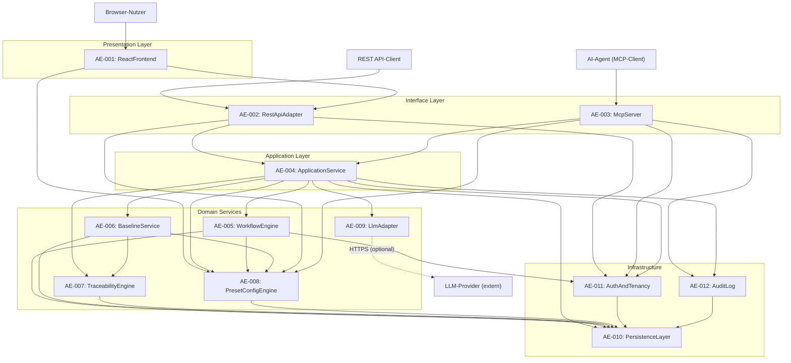

# ReqFlow — Architecture Elements (L2)

> Status: ENTWURF | Erstellt: 2026-06-17
> Quelle: REQUIREMENTS_L1.md, REQUIREMENTS_L2.md, system-overview.md, KONZEPT.md
> Sprache: Deutsch (Beschreibungen), English (IDs, Code-Namen).

---

## 1. Übersicht

Die Architektur-Zerlegung von ReqFlow transformiert die zwölf narrativen L1-Komponenten (C1–C12) aus `system-overview.md` in zwölf formale Architecture Elements (AE-001–AE-012). Jedes AE ist ein strukturiertes Artefakt mit eindeutiger Verantwortlichkeit, zugeordneten COMP-REQs, expliziten Schnittstellen und deterministischen Abhängigkeiten.

Die Subsystem-Gruppierung folgt einer geschichteten Architektur:

- **Presentation Layer**: Nutzer-interagierende UI-Subsysteme
- **Interface Layer**: Gleichrangige Adapter für REST und MCP
- **Application Layer**: Domain-Service-Fassade als einziger legitimer Geschäftslogik-Einstieg
- **Domain Services**: Spezialisierte Engines für Workflow, Baselines, Traceability, Presets und LLM-Abstraktion
- **Infrastructure**: Querschnittliche Dienste für Persistenz, Authentifizierung und Auditierung

---

## 2. Architecture Elements Katalog

### 2.1 Presentation Layer

#### AE-001: ReactFrontend

| Attribut | Wert |
|----------|------|
| **Typ** | Subsystem |
| **Verantwortlichkeit** | Single-Page-Application in React + TypeScript. Stellt Dashboard, Requirements-Editor, Architecture-Editor, Artefakt-Navigation (Baumstruktur), Traceability-Anzeige und Workspace-Konfiguration bereit. Rendert UI-Labels dynamisch basierend auf dem aktiven Terminologie-Profil. |
| **Zugeordnete COMP-REQs** | COMP-REQ-037, COMP-REQ-039, COMP-REQ-040, COMP-REQ-041, COMP-REQ-042 |
| **Erfüllte SYS-REQs** | SYS-REQ-14, SYS-REQ-16, SYS-REQ-17 |

**Bereitgestellte Schnittstellen:**
- `UI-Dashboard`: Projektübersicht, offene Punkte, Workspace-Karten mit Requirements-Zählern
- `UI-Editor`: Inline-Editing für Requirements, ArchitectureElements und TestCases mit Markdown-Unterstützung
- `UI-Navigation`: Lazy-Loading-Baumstruktur für Artefakt-Hierarchie, Traceability-Anzeige
- `UI-i18n`: Sprachumschaltung Deutsch/Englisch via react-i18next

**Benötigte Schnittstellen:**
- `RestApiAdapter:REST-API` (von AE-002) — Alle CRUD-Operationen via HTTP/JSON, OpenAPI-generierte Clients
- `RestApiAdapter:i18n-Errors` (von AE-002) — Übersetzte Fehlermeldungen basierend auf `Accept-Language`
- `PresetConfigEngine:Terminology-Profile` (von AE-008) — Dev-Modus / SE-Modus Labels für UI-Rendering

**Abhängigkeiten:** AE-002, AE-008

---

### 2.2 Interface Layer

#### AE-002: RestApiAdapter

| Attribut | Wert |
|----------|------|
| **Typ** | Component |
| **Verantwortlichkeit** | Django REST Framework (DRF)-basierte REST-Schnittstelle. Exponiert alle Domain-Operationen als HTTP/JSON-Endpunkte unter `/api/v1/`. Übersetzt HTTP-Requests in `ApplicationService`-Aufrufe, validiert JSON-Request-Bodies und serialisiert Responses. Stellt auto-generierte OpenAPI-3.0-Spezifikation bereit. |
| **Zugeordnete COMP-REQs** | COMP-REQ-013, COMP-REQ-014, COMP-REQ-015, COMP-REQ-038 |
| **Erfüllte SYS-REQs** | SYS-REQ-06 |

**Bereitgestellte Schnittstellen:**
- `REST-CRUD`: Vollständige CRUD-Endpunkte für 7 Entitäten (Artifact, Requirement, ArchitectureElement, TestCase, TraceLink, Baseline, WorkflowDefinition)
- `OpenAPI-Spec`: Auto-generierte OpenAPI-3.0-JSON unter `/api/v1/schema/` mit Swagger-UI
- `i18n-Errors`: Übersetzte Fehlermeldungen DE/EN basierend auf `Accept-Language`-Header

**Benötigte Schnittstellen:**
- `ApplicationService:Use-Case-Methods` (von AE-004) — Domain-Operationen, Pydantic-/DRF-Serializer als DTOs
- `AuthAndTenancy:Auth-Context` (von AE-011) — Bearer-Token/API-Key-Validierung, Tenant/Rollen-Kontext
- `PresetConfigEngine:Preset-Query` (von AE-008) — Feature-Enablement-Checks für Endpoint-Sichtbarkeit

**Abhängigkeiten:** AE-004, AE-008, AE-011

---

#### AE-003: McpServer

| Attribut | Wert |
|----------|------|
| **Typ** | Component |
| **Verantwortlichkeit** | Nativer MCP-Protokoll-Handler für AI-Agenten. Implementiert 20 Tools in vier Gruppen (Requirements, Architecture, Test, Cross-Cutting). Greift direkt auf `ApplicationService` zu — nicht über REST. Erfasst Agent-Client-Identität und API-Key für Audit-Zwecke. |
| **Zugeordnete COMP-REQs** | COMP-REQ-009, COMP-REQ-010, COMP-REQ-011, COMP-REQ-012 |
| **Erfüllte SYS-REQs** | SYS-REQ-05, SYS-REQ-20 |

**Bereitgestellte Schnittstellen:**
- `MCP-Tools`: 20 Tools (6 Requirements, 5 Architecture, 5 Test, 4 Cross-Cutting) mit JSON-Schema-Validierung
- `MCP-Transport`: Protokoll-Handler für stdio, SSE und HTTP-Transport

**Benötigte Schnittstellen:**
- `ApplicationService:Use-Case-Methods` (von AE-004) — Identische Domain-Operationen wie REST — gemeinsamer Kontrakt
- `AuthAndTenancy:Auth-Context` (von AE-011) — API-Key-Validierung, Agent-Identitäts-Extraktion
- `PresetConfigEngine:Preset-Query` (von AE-008) — Feature-Enablement und LLM-Konfigurations-Checks
- `AuditLog:MCP-Audit` (von AE-012) — Agent-Identität und API-Key-Hash bei schreibenden MCP-Operationen

**Abhängigkeiten:** AE-004, AE-008, AE-011, AE-012

---

### 2.3 Application Layer

#### AE-004: ApplicationService

| Attribut | Wert |
|----------|------|
| **Typ** | Service |
| **Verantwortlichkeit** | Zentrale Domain-Service-Fassade für alle Use-Cases. Orchestriert die untergeordneten Domain-Services (WorkflowEngine, BaselineService, TraceabilityEngine, LlmAdapter). Stellt transaktionale Konsistenz sicher. Einziger legitimer Zugriffspunkt für REST- und MCP-Adapter. |
| **Zugeordnete COMP-REQs** | COMP-REQ-001, COMP-REQ-002, COMP-REQ-003, COMP-REQ-007, COMP-REQ-029, COMP-REQ-043, COMP-REQ-044, COMP-REQ-045, COMP-REQ-046, COMP-REQ-047 |
| **Erfüllte SYS-REQs** | SYS-REQ-01, SYS-REQ-02, SYS-REQ-04, SYS-REQ-12, SYS-REQ-18, SYS-REQ-19, SYS-REQ-20 |

**Bereitgestellte Schnittstellen:**
- `Use-Case-Methods`: ArtifactService, RequirementService, ArchitectureService, TestService, SearchService, ExportService, BaselineFacade, WorkflowFacade
- `Transaction-Boundary`: Atomare Orchestrierung mehrerer Domain-Services pro Use-Case

**Benötigte Schnittstellen:**
- `WorkflowEngine:Transition-Validation` (von AE-005) — State-Übergangs-Validierung und Workflow-Initialisierung
- `BaselineService:Snapshot-Ops` (von AE-006) — Baseline-Erstellung und Diff-Vergleich
- `TraceabilityEngine:Link-Ops` (von AE-007) — TraceLink-CRUD und Upstream/Downstream-Queries
- `PresetConfigEngine:Preset-Query` (von AE-008) — Preset-Regeln, Feature-Flags und Terminologie-Profile
- `LlmAdapter:Capability-Interface` (von AE-009) — LLM-gestützte Validierung und Zerlegung
- `AuditLog:Log-Write` (von AE-012) — Append-Only-Logging nach jeder Schreiboperation
- `AuthAndTenancy:RBAC` (von AE-011) — Berechtigungsprüfung pro Operation und Ressource
- `PersistenceLayer:ORM-Access` (von AE-010) — Django ORM mit Custom Manager und Tenant-Isolation

**Abhängigkeiten:** AE-005, AE-006, AE-007, AE-008, AE-009, AE-010, AE-011, AE-012

---

### 2.4 Domain Services

#### AE-005: WorkflowEngine

| Attribut | Wert |
|----------|------|
| **Typ** | Service |
| **Verantwortlichkeit** | Verwaltung konfigurierbarer Item-Lifecycles. Führt WorkflowDefinitions pro Item-Typ und Workspace, validiert State-Übergänge gegen erlaubte Rollen und `change_reason`-Pflicht, und protokolliert jeden Übergang append-only in `WorkflowState.history`. |
| **Zugeordnete COMP-REQs** | COMP-REQ-004, COMP-REQ-022, COMP-REQ-023, COMP-REQ-024 |
| **Erfüllte SYS-REQs** | SYS-REQ-02, SYS-REQ-09 |

**Bereitgestellte Schnittstellen:**
- `Transition-Validation`: Prüfung von `from_state → to_state` gegen WorkflowDefinition, Rollen-Check, `change_reason`-Pflicht
- `WorkflowDefinition-Store`: CRUD für WorkflowDefinitions mit Default-Templates pro Preset
- `State-History`: Append-only `WorkflowState.history` mit User, Zeitstempel und Begründung

**Benötigte Schnittstellen:**
- `PresetConfigEngine:Preset-Query` (von AE-008) — Preset-spezifische Workflow-Regeln und Approver-Rollen-Verfügbarkeit
- `AuthAndTenancy:RBAC` (von AE-011) — Rollen-Check für Workflow-Transitionen (Approver-Verfügbarkeit)
- `PersistenceLayer:ORM-Access` (von AE-010) — Persistenz von WorkflowDefinition und WorkflowState

**Abhängigkeiten:** AE-008, AE-010, AE-011

---

#### AE-006: BaselineService

| Attribut | Wert |
|----------|------|
| **Typ** | Service |
| **Verantwortlichkeit** | Erstellung unveränderlicher, benannter Baselines auf drei Scopes (document, project, global). Ermittelt betroffene Item-IDs und Versionen, persistiert atomar als JSON-Snapshot und stellt Diff-Vergleiche zwischen Baselines bereit. |
| **Zugeordnete COMP-REQs** | COMP-REQ-019, COMP-REQ-020, COMP-REQ-021 |
| **Erfüllte SYS-REQs** | SYS-REQ-08 |

**Bereitgestellte Schnittstellen:**
- `Baseline-Snapshot`: Scope-Auflösung und atomare Snapshot-Erstellung (document/project/global)
- `Baseline-Diff`: Vergleich zweier Baselines (added, changed, removed mit Versions-Delta)
- `Preset-Gate`: Scope-Verfügbarkeitsprüfung vor Erstellung

**Benötigte Schnittstellen:**
- `TraceabilityEngine:Graph-Query` (von AE-007) — Trace-Link-Sammlung für vollständigen Snapshot
- `PresetConfigEngine:Preset-Query` (von AE-008) — Scope-Erlaubnis pro aktivem Preset
- `PersistenceLayer:ORM-Access` (von AE-010) — Persistenz der Baseline-Entität

**Abhängigkeiten:** AE-007, AE-008, AE-010

---

#### AE-007: TraceabilityEngine

| Attribut | Wert |
|----------|------|
| **Typ** | Service |
| **Verantwortlichkeit** | Verwaltung von TraceLinks zwischen Requirements, ArchitectureElements und TestCases mit sechs Link-Typen. Beantwortet Upstream/Downstream-Queries für Impact-Analysen und berechnet Coverage-Reports (Requirement → Test-Abdeckung). |
| **Zugeordnete COMP-REQs** | COMP-REQ-005, COMP-REQ-006, COMP-REQ-030 |
| **Erfüllte SYS-REQs** | SYS-REQ-03, SYS-REQ-12 |

**Bereitgestellte Schnittstellen:**
- `TraceLink-CRUD`: Verwaltung von 6 Link-Typen (parent-child, derives-from, satisfies, verifies, implements, refines)
- `Graph-Query`: Upstream- und Downstream-Queries mit Link-Typ-Annotation
- `Coverage-Report`: Prozentuale Test-Abdeckung pro Workspace mit Liste ungedeckter Requirements

**Benötigte Schnittstellen:**
- `PersistenceLayer:ORM-Access` (von AE-010) — Persistenz der TraceLink-Entität mit GIST/GIN-Indizes

**Abhängigkeiten:** AE-010

---

#### AE-008: PresetConfigEngine

| Attribut | Wert |
|----------|------|
| **Typ** | Service |
| **Verantwortlichkeit** | Zentrale Konfigurations-Engine für Configurable Rigor. Verwaltet SE-Tiefe-Presets (Minimal/Standard/Extended) und Terminologie-Profile (Dev-Modus/SE-Modus) auf Workspace-Ebene. Liefert zur Laufzeit Entscheidungen über Pflichtfelder, sichtbare Funktionen, Baseline-Scope-Verfügbarkeit und Workflow-Konfigurierbarkeit. |
| **Zugeordnete COMP-REQs** | COMP-REQ-016, COMP-REQ-017, COMP-REQ-018, COMP-REQ-033, COMP-REQ-034 |
| **Erfüllte SYS-REQs** | SYS-REQ-07, SYS-REQ-14 |

**Bereitgestellte Schnittstellen:**
- `Preset-Query`: `get_preset(workspace_id)`, `is_feature_enabled(feature_key, workspace_id)`
- `Terminology-Profile`: `get_terminology_profile(workspace_id)`, `switch_terminology_profile()`
- `Preset-Policy`: Downgrade-Validierung mit Inkompabilitäts-Check

**Benötigte Schnittstellen:**
- `PersistenceLayer:ORM-Access` (von AE-010) — Persistenz der Workspace-Konfiguration (Preset, Terminologie)

**Abhängigkeiten:** AE-010

---

#### AE-009: LlmAdapter

| Attribut | Wert |
|----------|------|
| **Typ** | Component |
| **Verantwortlichkeit** | Provider-agnostische LLM-Abstraktionsschicht. Stellt stabile interne Schnittstelle (`LlmCapabilityInterface`) mit drei Operationen bereit. Provider-Implementierungen (Anthropic, OpenAI, Ollama) sind über Plugin-Interface austauschbar. Bei fehlender Konfiguration: graceful Degradation mit strukturiertem Fehler. |
| **Zugeordnete COMP-REQs** | COMP-REQ-031, COMP-REQ-032 |
| **Erfüllte SYS-REQs** | SYS-REQ-13 |

**Bereitgestellte Schnittstellen:**
- `LLM-Capability`: `validate_artifact()`, `decompose_requirement()`, `check_consistency()`
- `Capability-Registry`: Aktivierung/Deaktivierung einzelner Capabilities pro Deployment

**Benötigte Schnittstellen:**
- `External-LLM` (extern) — HTTPS-Outbound zum konfigurierten Provider (Anthropic/OpenAI/Ollama)

**Abhängigkeiten:** *(keine internen AE-Abhängigkeiten)*

---

### 2.5 Infrastructure

#### AE-010: PersistenceLayer

| Attribut | Wert |
|----------|------|
| **Typ** | Component |
| **Verantwortlichkeit** | Datenhaltung via PostgreSQL und Django ORM. Hält alle Entitäten mit vollständigem Audit-Felder-Set. Erzwingt Tenant-Isolation über einen Custom Django Manager, der jede Query automatisch mit `tenant_id`-Filter versieht. Stellt performance-kritische Indizes für Hierarchie-, Graph- und Full-Text-Queries bereit. |
| **Zugeordnete COMP-REQs** | COMP-REQ-035, COMP-REQ-048 |
| **Erfüllte SYS-REQs** | SYS-REQ-15 |

**Bereitgestellte Schnittstellen:**
- `ORM-Access`: Django ORM mit Custom Manager (automatischer `tenant_id`-Filter)
- `Index-Layer`: PostgreSQL-Indizes für Recursive CTE (Artifact-Hierarchie), GIST/GIN (TraceLink-Graph), tsvector (Full-Text-Search)

**Benötigte Schnittstellen:**
- *(keine internen AE-Abhängigkeiten — PersistenceLayer ist die unterste Schicht)*

**Abhängigkeiten:** *(keine)*

---

#### AE-011: AuthAndTenancy

| Attribut | Wert |
|----------|------|
| **Typ** | Cross-Cutting |
| **Verantwortlichkeit** | Token-basierte Authentifizierung (Bearer Token / API Keys) und mandantenfähige Isolation. Verwaltet vier Rollen (Admin, Editor, Viewer, Approver) auf Workspace-Ebene. Extrahiert Tenant aus dem Authentifizierungstoken und propagiert ihn in den Request-Context für den Custom Manager der PersistenceLayer. |
| **Zugeordnete COMP-REQs** | COMP-REQ-025, COMP-REQ-026, COMP-REQ-036 |
| **Erfüllte SYS-REQs** | SYS-REQ-10, SYS-REQ-15 |

**Bereitgestellte Schnittstellen:**
- `Auth-Context`: Token-Validierung, Tenant-Extraktion, Rollen-Ermittlung
- `RBAC`: Berechtigungsprüfung pro Operation und Ressource (Admin/Editor/Viewer/Approver)

**Benötigte Schnittstellen:**
- `PersistenceLayer:ORM-Access` (von AE-010) — User-, Rollen- und Tenant-Lookups

**Abhängigkeiten:** AE-010

---

#### AE-012: AuditLog

| Attribut | Wert |
|----------|------|
| **Typ** | Cross-Cutting |
| **Verantwortlichkeit** | Append-only Log aller schreibenden Operationen (REST und MCP). Erfasst Akteur (User-ID oder Agent-Client-ID), Operation, Entitäts-Typ, Entitäts-ID, Zeitstempel und optional Feld-Diff. Unterscheidet manuelle Änderungen (via REST/UI) von agentengesteuerten Änderungen (via MCP) durch Client-Name und API-Key-Hash. |
| **Zugeordnete COMP-REQs** | COMP-REQ-027, COMP-REQ-028 |
| **Erfüllte SYS-REQs** | SYS-REQ-11 |

**Bereitgestellte Schnittstellen:**
- `Log-Write`: Append-Only-Logging für Create/Update/Delete auf allen Entitäten
- `MCP-Audit`: Erfassung von Agent-Identität und API-Key-Hash bei MCP-Schreiboperationen

**Benötigte Schnittstellen:**
- `PersistenceLayer:ORM-Access` (von AE-010) — Persistenz der AuditLog-Einträge

**Abhängigkeiten:** AE-010

---

## 3. Schnittstellen-Matrix

| AE-Provider | Schnittstelle | AE-Consumer | Typ | Vertrag (Kurzform) |
|-------------|--------------|-------------|-----|-------------------|
| AE-001 | UI-Dashboard | User (Browser) | HTTPS/React | Projektübersicht, offene Punkte |
| AE-001 | UI-Editor | User (Browser) | HTTPS/React | Inline-Editing, Markdown |
| AE-001 | UI-Navigation | User (Browser) | HTTPS/React | Baumstruktur, Lazy-Loading |
| AE-002 | REST-CRUD | AE-001, External Clients | HTTP/JSON | CRUD-Endpunkte `/api/v1/`, OpenAPI-Spec |
| AE-002 | i18n-Errors | AE-001 | HTTP/JSON | Übersetzte Fehlermeldungen DE/EN |
| AE-003 | MCP-Tools | External Agents | MCP-Protokoll | 20 Tools, 4 Gruppen, JSON-Schema |
| AE-004 | Use-Case-Methods | AE-002, AE-003 | In-Process Python | Service-Fassade, Pydantic-DTOs |
| AE-005 | Transition-Validation | AE-004 | In-Process Python | State-Übergang + Rollen-Check |
| AE-005 | WorkflowDefinition-Store | AE-004 | In-Process Python | Default-Templates pro Preset |
| AE-006 | Baseline-Snapshot | AE-004 | In-Process Python | Scope-Auflösung + atomarer JSON-Snapshot |
| AE-006 | Baseline-Diff | AE-004 | In-Process Python | added/changed/removed mit Versions-Delta |
| AE-007 | TraceLink-CRUD | AE-004 | In-Process Python | 6 Link-Typen, DB-Constraints |
| AE-007 | Graph-Query | AE-004, AE-006 | In-Process Python | Upstream/Downstream < 200ms |
| AE-007 | Coverage-Report | AE-004 | In-Process Python | Requirement→Test-Abdeckung |
| AE-008 | Preset-Query | AE-002, AE-003, AE-004, AE-005, AE-006 | In-Process Python | `get_preset()`, `is_feature_enabled()` |
| AE-008 | Terminology-Profile | AE-001, AE-004 | In-Process Python | Dev-Modus / SE-Modus Labels |
| AE-009 | LLM-Capability | AE-004 | In-Process Python | `validate`, `decompose`, `check_consistency` |
| AE-010 | ORM-Access | AE-004, AE-005, AE-006, AE-007, AE-008, AE-011, AE-012 | Django ORM | Custom Manager + `tenant_id`-Filter |
| AE-011 | Auth-Context | AE-002, AE-003 | In-Process Python / Middleware | Token-Validierung, Tenant-Kontext |
| AE-011 | RBAC | AE-004, AE-005 | In-Process Python | 4 Rollen, Workspace-Ebene |
| AE-012 | Log-Write | AE-004 | In-Process Python | Append-Only, Actor + Operation + Timestamp |
| AE-012 | MCP-Audit | AE-003 | In-Process Python | Agent-Identität + API-Key-Hash |

---

## 4. Komponentendiagramm (Mermaid)

**Lesehinweis:** Durchgezogene Pfeile = synchrone In-Process-Aufrufe / DB-Zugriffe. Gestrichelte Pfeile = optionale externe HTTPS-Calls. Die Abhängigkeitsrichtung folgt dem Consumer-→-Provider-Muster.

---

## 5. Traceability: COMP-REQ → AE

| COMP-REQ | Primäres AE | Mitwirkende AEs |
|----------|-------------|----------------|
| COMP-REQ-001 | AE-004 | AE-010 |
| COMP-REQ-002 | AE-004 | AE-010 |
| COMP-REQ-003 | AE-004 | AE-005, AE-010, AE-012 |
| COMP-REQ-004 | AE-005 | AE-011 |
| COMP-REQ-005 | AE-007 | AE-010 |
| COMP-REQ-006 | AE-007 | AE-010 |
| COMP-REQ-007 | AE-004 | AE-010 |
| COMP-REQ-009 | AE-003 | AE-004, AE-011, AE-012 |
| COMP-REQ-010 | AE-003 | AE-004, AE-011, AE-012 |
| COMP-REQ-011 | AE-003 | AE-004, AE-011, AE-012 |
| COMP-REQ-012 | AE-003 | AE-004, AE-007, AE-010 |
| COMP-REQ-013 | AE-002 | AE-004 |
| COMP-REQ-014 | AE-002 | — |
| COMP-REQ-015 | AE-002 | AE-010 |
| COMP-REQ-016 | AE-008 | AE-010 |
| COMP-REQ-017 | AE-008 | AE-010 |
| COMP-REQ-018 | AE-008 | AE-010 |
| COMP-REQ-019 | AE-006 | AE-007, AE-010 |
| COMP-REQ-020 | AE-006 | AE-010 |
| COMP-REQ-021 | AE-006 | AE-008 |
| COMP-REQ-022 | AE-005 | AE-010 |
| COMP-REQ-023 | AE-005 | AE-010 |
| COMP-REQ-024 | AE-005 | AE-010 |
| COMP-REQ-025 | AE-011 | AE-010 |
| COMP-REQ-026 | AE-011 | AE-008 |
| COMP-REQ-027 | AE-012 | AE-010 |
| COMP-REQ-028 | AE-012 | AE-010 |
| COMP-REQ-029 | AE-004 | AE-010 |
| COMP-REQ-030 | AE-007 | AE-010 |
| COMP-REQ-031 | AE-009 | — |
| COMP-REQ-032 | AE-009 | — |
| COMP-REQ-033 | AE-008 | AE-010 |
| COMP-REQ-034 | AE-008 | AE-010 |
| COMP-REQ-035 | AE-010 | AE-011 |
| COMP-REQ-036 | AE-011 | AE-010 |
| COMP-REQ-037 | AE-001 | — |
| COMP-REQ-038 | AE-002 | — |
| COMP-REQ-039 | AE-001 | — |
| COMP-REQ-040 | AE-001 | AE-002 |
| COMP-REQ-041 | AE-001 | AE-002 |
| COMP-REQ-042 | AE-001 | AE-002 |
| COMP-REQ-043 | AE-004 | AE-001, AE-002, AE-010 |
| COMP-REQ-044 | AE-004 | AE-008, AE-010 |
| COMP-REQ-045 | AE-004 | AE-008 |
| COMP-REQ-046 | AE-004 | AE-010 |
| COMP-REQ-047 | AE-004 | AE-010 |
| COMP-REQ-048 | AE-010 | — |

---

## 6. Architektonische Begründung

### 6.1 Entscheidungen

**Gleichrangige Adapter (REST + MCP) über gemeinsamer Fassade:**
RestApiAdapter (AE-002) und McpServer (AE-003) sind beide Consumer der ApplicationService-Fassade (AE-004). Dies verhindert divergierende Geschäftslogik zwischen den Schnittstellen und ermöglicht Batch-Operationen (z. B. `requirement.decompose`) ohne HTTP-Roundtrip-Overhead.

**Querschnittliche Services als explizite AEs:**
AuthAndTenancy (AE-011) und AuditLog (AE-012) sind als *Cross-Cutting* typisiert, um ihre systemübergreifende Natur zu betonen. Sie sind keine optionalen Add-ons, sondern verpflichtende Infrastruktur für alle Schreiboperationen.

**Tenant-Isolation als unterste Schicht:**
PersistenceLayer (AE-010) ist die einzige AE ohne interne Abhängigkeiten. Der Custom Django Manager erzwingt `tenant_id`-Filter auf ORM-Ebene — keine Anwendungslogik darf diesen Filter umgehen. Das schafft eine deterministische Sicherheitsgarantie.

### 6.2 Verworfene Alternative

*Monolithischer ApplicationService ohne interne Subservice-Struktur:*
Eine Alternative bestand darin, AE-004 als undifferenzierte Schicht zu modellieren, in der alle Use-Cases direkt nebeneinander liegen. Dies wurde verworfen, weil die L2-Whitebox in `system-overview.md` (Abschnitt 4.2) zeigt, dass eine Partitionierung nach Use-Case-Gruppen (ArtifactService, RequirementService, SearchService, ExportService etc.) die Kohäsion erhöht und Anämie verhindert. Die Subservice-Struktur bleibt innerhalb von AE-004 als Implementierungsdetail erhalten; nach außen präsentiert AE-004 eine einheitliche Fassade.

---

*Erstellt durch se-architect-Agent | ReqFlow SE-Kaskade L2 | 2026-06-17*
