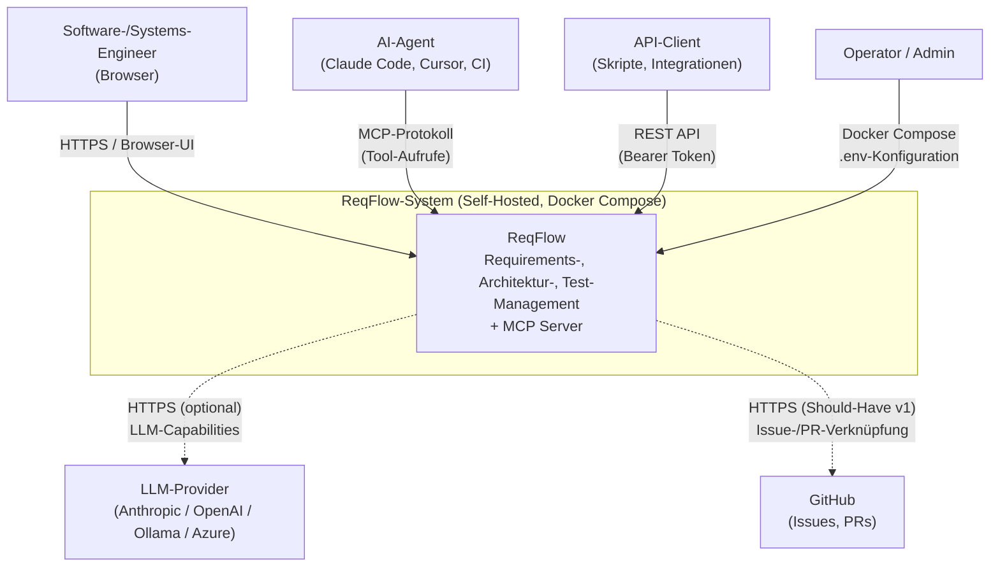
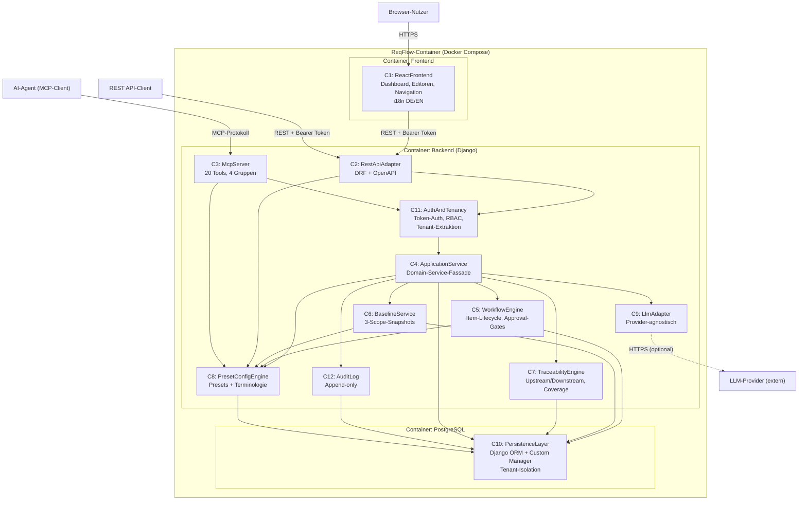
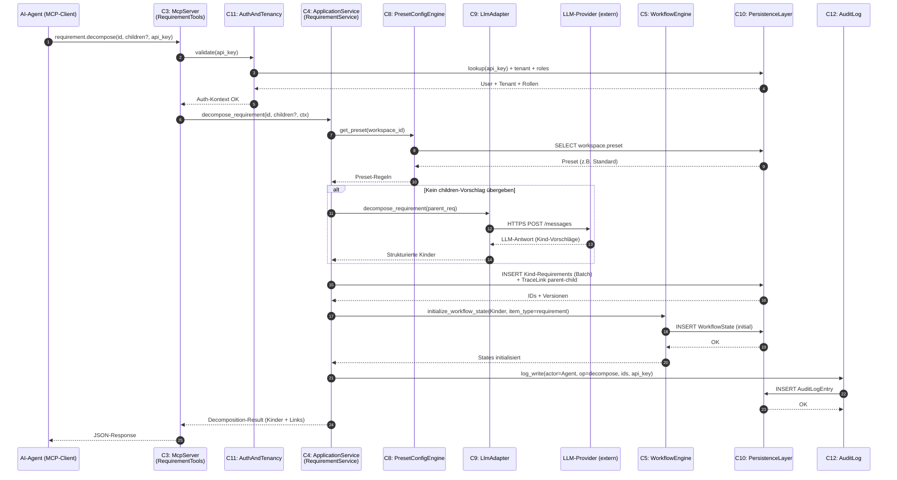
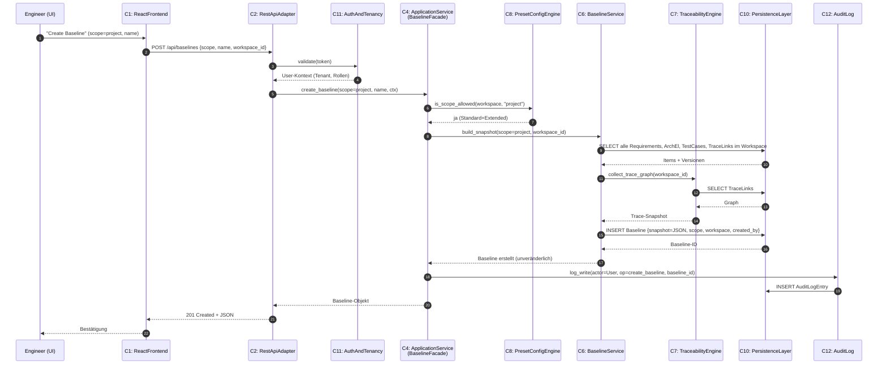

# ReqFlow — System-Architektur (L1/L2)

> Status: ENTWURF | Erstellt: 2026-06-17 | Autor: se-architect-Agent (SE-Kaskade)
>
> Quelle: `docs/KONZEPT.md` (FINAL, Runden 1–4) + `docs/REQUIREMENTS_L1.md` (SN-01 … SN-12, SYS-REQ-01 … SYS-REQ-20)
>
> Sprache: Deutsch (internes Architektur-Dokument gemäß Sprachregeln). Code-Bezeichner und Komponentennamen englisch.
>
> Notation: Dieses Dokument folgt dem C4-Ansatz auf L1 (Kontext + Container) und L2 (Komponenten innerhalb der Container).

---

## 1. Überblick

ReqFlow ist ein AI-natives Requirements-Management-System, das zwei gleichrangige primäre Schnittstellen — eine REST API und einen MCP Server — auf ein gemeinsames Domain-Service-Modell auflegt. Die Architektur folgt fünf tragenden Prinzipien:

**Dual-Interface, Single Domain-Core:** REST und MCP sind keine hierarchisch gestapelten Schichten, sondern zwei gleichrangige Adapter, die direkt gegen einen gemeinsamen Application-Service-Layer arbeiten. Das verhindert HTTP-Roundtrips beim MCP-Aufruf, ermöglicht Batch-Operationen wie `requirement.decompose` und garantiert semantische Konsistenz: Was via REST geht, geht auch via MCP — und umgekehrt.

**Provider-Abstraktion für LLMs:** Alle AI-Capabilities (Validierung, Decomposition, optionale Generierung und Konsistenz-Checks) laufen über eine schmale Adapter-Schicht, die das LLM-Detail (OpenAI, Anthropic, Ollama, Azure-OpenAI, …) hinter einer stabilen internen Schnittstelle versteckt. Kein Geschäftsmodul kennt einen konkreten Provider. Deployments ohne LLM-Zugang verlieren AI-Features, aber keine Kernfunktionalität.

**Configurable Rigor als Querschnitts-Konzept:** Die Preset-/Config-Engine ist kein Modul am Rand, sondern ein Querschnitts-Service, der von WorkflowEngine, Baseline-Service, REST/MCP-Adaptern und UI gleichermaßen konsultiert wird. Ein Preset (Minimal / Standard / Extended) entscheidet zur Laufzeit über Pflichtfelder, sichtbare Tools, Baseline-Scope und Workflow-Strenge — ohne Code-Pfad-Verzweigung pro Zielgruppe.

**Tenant-Context-Propagation:** Mandantenfähigkeit ist nicht als separates DB-Schema realisiert, sondern als Row-Level-Isolation über einen `tenant_id`-FK auf jeder Entität. Ein Custom Django Manager und eine Auth-Middleware injizieren den aktiven Tenant in jeden Query — keine Anwendungslogik darf den Filter umgehen. In v1 existiert genau ein Default-Tenant; die v2-Aktivierung von Multi-Tenancy erfordert keine Datenmigration.

**Self-Hosted First:** Docker Compose ist die primäre Deploymentform. Drei Services (Backend, Frontend, PostgreSQL) starten via `docker-compose up`. Keine externen Cloud-Abhängigkeiten zur Laufzeit. Eine LLM-Anbindung ist optional und über Umgebungsvariablen konfigurierbar.

---

## 2. L1-Systemkontext

### 2.1 Externe Akteure und Schnittstellen

ReqFlow ist als geschlossenes System modelliert, das mit folgenden Akteuren interagiert:

| Akteur | Typ | Schnittstelle | Zweck |
|---|---|---|---|
| Software-Engineer / Systems-Engineer | Mensch | Browser → React-UI | Manuelles Requirements-Management, Reviews, Approvals |
| AI-Agent (Claude Code, Cursor, CI-Agent) | Maschine | MCP-Protokoll | Strukturierter Read/Write-Zugriff auf alle Artefakttypen |
| API-Client (Custom-Integration, Skript) | Maschine | REST API (HTTP/JSON) | Programmatischer Zugriff, CI/CD-Integration |
| LLM-Provider (Anthropic, OpenAI, Ollama, …) | Externes System | HTTPS-Outbound | Optionale AI-Capabilities (Validierung, Decomposition) |
| GitHub (v1 Should-Have) | Externes System | HTTPS-Outbound | Verknüpfung Requirements ↔ Issues/PRs |
| Operator / Admin | Mensch | Docker Compose / .env | Deployment, Konfiguration |

### 2.2 Systemgrenze

Innerhalb der Systemgrenze: Django-Backend, React-Frontend, PostgreSQL. Außerhalb: Browser, AI-Agent-Runtimes, LLM-Provider, GitHub, Docker-Host.

### 2.3 Kontextdiagramm (Mermaid)

---

## 3. L1-Whitebox (Hauptkomponenten)

Die L1-Whitebox zerlegt ReqFlow in zehn Hauptkomponenten. Jede Komponente hat eine klar abgegrenzte Verantwortlichkeit und kommuniziert mit den anderen Komponenten ausschließlich über definierte Schnittstellen.

### 3.1 Komponenten und Verantwortlichkeiten

**C1 — `ReactFrontend` (UI-Layer)**
Single-Page-Application in React + TypeScript. Stellt Dashboard, Requirements-Editor, Architecture-Editor, Artefakt-Navigation, Traceability-Anzeige und Workspace-Konfiguration bereit. Liest aktives Terminologie-Profil aus Workspace-Settings und rendert Labels entsprechend. i18n via react-i18next (DE/EN). Kommuniziert ausschließlich über die REST API mit dem Backend.
*Erfüllt:* SYS-REQ-17, SYS-REQ-14, SYS-REQ-16.

**C2 — `RestApiAdapter` (REST-Schnittstelle)**
Django REST Framework. Exponiert alle Domain-Operationen als HTTP/JSON-Endpunkte mit Bearer-Token-Authentifizierung. Auto-generierte OpenAPI-Spezifikation (`drf-spectacular` oder vergleichbar). Übersetzt HTTP-Requests in `ApplicationService`-Aufrufe. Keine Geschäftslogik in dieser Schicht — reine Translation und Serialization.
*Erfüllt:* SYS-REQ-06.
*i18n:* Backend-Fehlermeldungen werden über ein zentrales i18n-Modul (Django gettext / python-babel) in DE/EN übersetzt; fehlende Translation-Keys sind Build-Fehler (Lint-Regel), konsistent mit SYS-REQ-16.

**C3 — `McpServer` (MCP-Schnittstelle)**
Nativer MCP-Protokoll-Handler (stdio/sse/HTTP-Transport je nach Client). Implementiert 20 Tools in vier Gruppen (Requirements, Architecture, Tests, Übergreifend). Greift — wie der REST-Adapter — direkt auf `ApplicationService` zu, nicht über die REST API. Schreibende Operationen werden mit Agent-Client-Identität und API-Key im AuditLog erfasst.
*Erfüllt:* SYS-REQ-05, SYS-REQ-11 (MCP-Teil), SYS-REQ-20 (artifact.search).

**C4 — `ApplicationService` (Domain-Service-Schicht)**
Fassade zur gesamten Geschäftslogik. Bietet Use-Case-orientierte Operationen (z.B. `create_requirement`, `decompose_requirement`, `create_baseline`, `transition_workflow_state`). Orchestriert die unter ihr liegenden Domain-Komponenten (WorkflowEngine, BaselineService, TraceabilityEngine). Sicherstellt transaktionale Konsistenz. Einziger legitimer Zugriffspunkt für REST- und MCP-Adapter.
*Erfüllt:* Querschnitts-Erfüllung von SYS-REQ-01 … SYS-REQ-04, SYS-REQ-12, SYS-REQ-19, SYS-REQ-20.

**C5 — `WorkflowEngine` (Item-Lifecycle)**
Verwaltet `WorkflowDefinition`s pro Item-Typ und Workspace. Validiert State-Übergänge gegen erlaubte Rollen und `change_reason`-Pflicht. Schreibt jeden Übergang in `WorkflowState.history`. Stellt Default-Workflows für die drei Presets bereit (nicht konfigurierbar im Minimal, vollständig konfigurierbar im Extended).
*Erfüllt:* SYS-REQ-02 (Workflow-Teil), SYS-REQ-09, L2-WF-01, L2-WF-02.

**C6 — `BaselineService` (Snapshot-Engine)**
Erstellt unveränderliche Baselines auf drei Scopes (`document`, `project`, `global`). Resolviert den Scope, ermittelt alle betroffenen Item-IDs samt Versionen und persistiert atomar als JSON-Snapshot. Stellt Baseline-Vergleichs-Operationen (Diff) bereit. Global-Baselines nur im Extended-Preset (Preset-Konsultation via `PresetConfigEngine`).
*Erfüllt:* SYS-REQ-08, L2-BL-01, L2-BL-02.

**C7 — `TraceabilityEngine` (Verknüpfungs-Logik)**
Verwaltet TraceLinks zwischen Requirements, ArchitectureElements und TestCases mit den Link-Typen `parent-child`, `derives-from`, `satisfies`, `verifies`, `implements`, `refines`. Beantwortet Upstream/Downstream-Queries und Coverage-Reports. Performance-Ziel: < 200 ms für 10.000 Items.
*Erfüllt:* SYS-REQ-03, SYS-REQ-12 (Coverage-Teil).

**C8 — `PresetConfigEngine` (Configurable Rigor)**
Verwaltet Workspace-Presets (Minimal / Standard / Extended) und Terminologie-Profile (Dev-Modus / SE-Modus). Liefert zur Laufzeit Entscheidungen über Pflichtfelder, sichtbare Tools, Baseline-Scope-Verfügbarkeit, Workflow-Konfigurierbarkeit und `change_reason`-Pflicht. Wird von WorkflowEngine, BaselineService, ApplicationService und RestApiAdapter konsultiert.
*Erfüllt:* SYS-REQ-07, SYS-REQ-14.

**C9 — `LlmAdapter` (Provider-Abstraktion)**
Schmale Schnittstelle zwischen Anwendungslogik und externen LLM-Providern. Stellt drei Operationen bereit: `validate_artifact`, `decompose_requirement`, `check_consistency`. Provider-Implementierungen (Anthropic, OpenAI, Ollama, Azure) sind austauschbar und werden über Deployment-Konfiguration (.env / Workspace-Settings) gewählt. Bei fehlender Konfiguration: graceful Fehler "LLM nicht konfiguriert".
*Erfüllt:* SYS-REQ-13.

**C10 — `PersistenceLayer` (Datenhaltung)**
PostgreSQL via Django ORM. Hält alle Entitäten: Tenant, Workspace, Artifact, Requirement, ArchitectureElement, TraceLink, TestCase, Baseline, WorkflowDefinition, WorkflowState, AuditLog, User, Role. Tenant-Isolation wird über einen Custom Django Manager auf allen Entitäten erzwungen — keine Query darf den Filter umgehen.
*Erfüllt:* SYS-REQ-15, L2-TI-01, Datenmodell-Basis für SYS-REQ-01 … SYS-REQ-20.
*Performance:* PostgreSQL-Indizes für hierarchische Queries (Recursive CTE), TraceLink-Graph-Queries (GIST/GIN) und Full-Text-Search (tsvector) sind vorgesehen, um die <200ms/<500ms-Ziele zu erreichen.

**C11 — `AuthAndTenancy` (Auth-Middleware)**
Token-basierte Authentifizierung (Bearer Token / API Keys). Vier Rollen (Admin, Editor, Viewer, Approver). Approver-Rolle nur im Extended-Preset aktiv. Extrahiert den aktiven Tenant aus dem Token und propagiert ihn in den Request-Context für `PersistenceLayer.CustomManager`. Erzwingt Berechtigungs-Checks pro Operation und Ressource.
*Erfüllt:* SYS-REQ-10, SYS-REQ-15 (Tenant-Extraktion).

**C12 — `AuditLog` (Änderungshistorie)**
Append-only Log aller schreibenden Operationen (REST und MCP). Erfasst Akteur (User oder Agent-Client + API-Key), Operation, Entitäts-ID, Zeitstempel, optional Feld-Diff. Wird von ApplicationService nach jeder schreibenden Operation befüllt. Im Datenmodell als eigene Entität persistiert; in v1 Operation-Level, Feld-Level als v2-Erweiterung möglich.
*Erfüllt:* SYS-REQ-11.

### 3.2 L1-Komponentendiagramm (Mermaid)

**Lesehinweis:** Durchgezogene Pfeile = synchrone In-Process-Aufrufe / DB-Zugriffe. Gestrichelte Pfeile = optionale externe HTTPS-Calls.

---

## 4. L2-Whitebox (Subsystem-Zerlegung)

Die L2-Sicht zoomt in die fünf kritischsten L1-Komponenten und beschreibt ihre interne Struktur. Komponenten ohne nennenswerte Binnenstruktur (z.B. `AuditLog` als simples Append-Modell) sind hier ausgespart.

### 4.1 L2 — `McpServer` (Tool-Gruppen)

Der MCP Server ist intern in vier Tool-Gruppen plus eine Transport-/Dispatch-Schicht zerlegt:

| Sub-Komponente | Tools | Zweck |
|---|---|---|
| `McpTransport` | — | Protokoll-Handler (stdio / SSE / HTTP), JSON-RPC-Dispatch |
| `RequirementTools` | `requirement.get/query/create/update/decompose/validate` | Requirements-CRUD + LLM-gestützte Validierung/Zerlegung |
| `ArchitectureTools` | `architecture.get/query/create/update/link` | Architektur-Element-CRUD + Verknüpfung |
| `TestTools` | `test.get/query/create/update/link` | TestCase-CRUD + Coverage-Verknüpfung |
| `CrossCuttingTools` | `traceability.query`, `artifact.search`, `artifact.get_tree`, `workspace.get_context` | Übergreifende Queries und Agent-Orientierung |

Jede Tool-Gruppe ist ein dünner Translator: Sie validiert Eingabe-Parameter (JSON-Schema je Tool), ruft die entsprechende `ApplicationService`-Operation und serialisiert das Ergebnis.

Erfüllt: L2-MCP-01 … L2-MCP-04.

### 4.2 L2 — `ApplicationService` (Use-Case-Aufteilung)

Der ApplicationService ist nach Use-Case-Gruppen partitioniert (Subservices), nicht nach Entitätstyp. Das vermeidet Anämie und bündelt Cross-Entity-Logik:

| Subservice | Verantwortlichkeit |
|---|---|
| `ArtifactService` | Artifact-Hierarchie-CRUD, Zyklus-Prüfung, Tree-Queries |
| `RequirementService` | Requirement-CRUD, Decomposition, Validation-Orchestrierung |
| `ArchitectureService` | ArchitectureElement-CRUD, Versionierung |
| `TestService` | TestCase-CRUD, Coverage-Berechnung |
| `TraceLinkService` | TraceLink-CRUD, Quell/Ziel-Validierung |
| `BaselineFacade` | Baseline-Lifecycle (delegiert an `BaselineService`) |
| `WorkflowFacade` | Workflow-State-Transitionen (delegiert an `WorkflowEngine`) |
| `SearchService` | Volltextsuche über Requirements + ArchitectureElements + TestCases (PostgreSQL-Full-Text in v1) |
| `ExportService` | JSON-/CSV-Export für alle Entitäten inkl. aktivem Terminologie-Profil als Metadatum |
| `PresetPolicyService` | Validierung von Preset-Downgrades (OP-02): prüft Baselines, Approved Items und Workflow-States gegen Ziel-Preset-Constraints; blockiert bei Inkompabilität |

Erfüllt: SYS-REQ-01, SYS-REQ-02, SYS-REQ-04, SYS-REQ-12, SYS-REQ-19, SYS-REQ-20.

### 4.3 L2 — `WorkflowEngine`

| Sub-Komponente | Zweck |
|---|---|
| `WorkflowDefinitionStore` | CRUD + Default-Templates pro Preset |
| `TransitionValidator` | Prüft `from→to` gegen WorkflowDefinition, `allowed_roles` und `requires_change_reason` |
| `StateMutator` | Persistiert State-Übergang atomar + schreibt History-Eintrag |
| `WorkflowMigrationHandler` | Behandelt Items in nicht mehr existierenden States bei Definition-Wechsel (offener Punkt OP-03 — v1-Default: Block-Wechsel solange Items im verwaisten State sind) |

Erfüllt: L2-WF-01, L2-WF-02.

### 4.4 L2 — `BaselineService`

| Sub-Komponente | Zweck |
|---|---|
| `ScopeResolver` | Ermittelt betroffene Item-IDs/Versionen je Scope (document/project/global) |
| `SnapshotBuilder` | Erstellt atomaren JSON-Snapshot, persistiert unveränderlich |
| `BaselineDiff` | Vergleich zweier Baselines (added/changed/removed Items mit Versions-Delta) |
| `PresetGate` | Konsultiert `PresetConfigEngine`: `global`-Scope nur im Extended, `document`+`project` ab Standard |

Erfüllt: L2-BL-01, L2-BL-02.

### 4.5 L2 — `LlmAdapter`

Zentrale Abstraktion mit drei austauschbaren Providern in v1, weiteren über Plugin-Interface:

| Sub-Komponente | Zweck |
|---|---|
| `LlmCapabilityInterface` | Stabile interne Signaturen: `validate_artifact`, `decompose_requirement`, `check_consistency` |
| `AnthropicProvider` | Default-Implementierung (Claude, neueste Version) |
| `OpenAiProvider` | Alternative Implementierung |
| `OllamaProvider` | Lokale Self-Hosted-Variante |
| `CapabilityRegistry` | Liest Deployment-Config, aktiviert/deaktiviert einzelne Capabilities, returniert "nicht konfiguriert"-Fehler graceful |
| `LlmAuditHook` | Schreibt jeden LLM-Aufruf in den AuditLog (Provider, Capability, Artefakt-ID, Token-Verbrauch falls verfügbar) |

Erfüllt: SYS-REQ-13.

### 4.6 L2-Sequenzdiagramm: MCP-Tool-Aufruf `requirement.decompose`

Dieser Flow demonstriert die Zusammenarbeit von MCP, Auth, ApplicationService, LlmAdapter, WorkflowEngine, PersistenceLayer und AuditLog bei einer LLM-gestützten Schreiboperation eines AI-Agenten.

### 4.7 L2-Sequenzdiagramm: Baseline-Erstellung (Scope `project`)

---

## 5. Schnittstellen-Übersicht

### 5.1 REST API — Endpunkt-Kategorien

Alle Endpunkte unter `/api/v1/`. Authentifizierung: Bearer Token (API Key). Auto-generierte OpenAPI-Spec unter `/api/v1/schema/`.

| Kategorie | Beispiel-Endpunkte | Erfüllt SYS-REQ |
|---|---|---|
| Auth & Identity | `POST /auth/token`, `GET /auth/me` | SYS-REQ-10 |
| Workspace & Preset | `GET/PATCH /workspaces/{id}`, `GET /workspaces/{id}/preset` | SYS-REQ-07, SYS-REQ-14 |
| Artefakt-Hierarchie | `GET/POST/PATCH/DELETE /artifacts/{id}`, `GET /artifacts/tree` | SYS-REQ-01 |
| Requirements | `GET/POST/PATCH/DELETE /requirements/{id}`, `POST /requirements/{id}/decompose` | SYS-REQ-02 |
| Architecture-Elements | `GET/POST/PATCH/DELETE /architecture/{id}`, `POST /architecture/{id}/links` | SYS-REQ-04 |
| Tests | `GET/POST/PATCH/DELETE /tests/{id}`, `POST /tests/{id}/links` | SYS-REQ-12 |
| Trace-Links | `GET/POST/DELETE /tracelinks`, `GET /traceability/{artifact_id}` | SYS-REQ-03 |
| Baselines | `GET/POST /baselines`, `GET /baselines/{id}/diff/{other_id}` | SYS-REQ-08 |
| Workflows | `GET/POST/PATCH /workflows`, `POST /items/{id}/transition` | SYS-REQ-09 |
| Audit-Log | `GET /audit-log?filter=…` (read-only) | SYS-REQ-11 |
| Search | `GET /search?q=…&types=…` | SYS-REQ-20 |
| Export | `GET /export?format=json|csv&scope=…` | SYS-REQ-19 |
| OpenAPI-Spec | `GET /schema/`, `GET /schema/swagger-ui/` | SYS-REQ-06 |

### 5.2 MCP Server — Tool-Gruppen (20 Tools)

Alle Tools nutzen generische Entitätsnamen (Requirement, ArchitectureElement, TestCase), unabhängig vom aktiven Terminologie-Profil.

| Gruppe | Tools |
|---|---|
| Requirements (6) | `requirement.get`, `.query`, `.create`, `.update`, `.decompose`, `.validate` |
| Architecture (5) | `architecture.get`, `.query`, `.create`, `.update`, `.link` |
| Test (5) | `test.get`, `.query`, `.create`, `.update`, `.link` |
| Übergreifend (4) | `traceability.query`, `artifact.search`, `artifact.get_tree`, `workspace.get_context` |

### 5.3 Interne Schnittstellen (zwischen L1-Komponenten)

| Schnittstelle | Caller → Callee | Typ | Vertrag (Kurzform) |
|---|---|---|---|
| `RestApiAdapter → ApplicationService` | C2 → C4 | In-Process Python | Use-Case-Methoden, Pydantic-/DRF-Serializer als DTOs |
| `McpServer → ApplicationService` | C3 → C4 | In-Process Python | Identische Use-Case-Methoden wie REST — gemeinsamer Domain-Kontrakt |
| `ApplicationService → WorkflowEngine` | C4 → C5 | In-Process Python | `transition(item_id, target_state, change_reason, ctx)` |
| `ApplicationService → BaselineService` | C4 → C6 | In-Process Python | `build(scope, workspace_id, ctx)`, `diff(a, b)` |
| `ApplicationService → TraceabilityEngine` | C4 → C7 | In-Process Python | `query(artifact_id, direction)`, `coverage(workspace_id)` |
| `ApplicationService → LlmAdapter` | C4 → C9 | In-Process Python | `validate`, `decompose`, `check_consistency` |
| `ApplicationService → AuditLog` | C4 → C12 | In-Process Python | `log_write(actor, op, entity_id, details)` |
| `Any → PresetConfigEngine` | * → C8 | In-Process Python | `get_preset(workspace_id)`, `is_feature_enabled(key, workspace_id)` |
| `Any → PersistenceLayer` | * → C10 | Django ORM | Custom Manager erzwingt `tenant_id`-Filter |
| `LlmAdapter → External LLM` | C9 → LLM | HTTPS-Outbound | Provider-spezifisch, hinter `LlmCapabilityInterface` versteckt |

---

## 6. Architektur-Entscheidungen (ADR-Kurzform)

**ADR-01 — MCP Server greift direkt auf ApplicationService zu (nicht über REST)**
*Entscheidung:* McpServer und RestApiAdapter sind zwei gleichrangige Adapter über demselben ApplicationService.
*Rationale:* Vermeidet HTTP-Roundtrip-Overhead bei Batch-Operationen wie `requirement.decompose`, erlaubt MCP-spezifische Audit-Felder (Agent-Client, API-Key) ohne REST-Verunreinigung und garantiert semantische Konsistenz zwischen beiden Schnittstellen. *Verworfene Alternative:* MCP als Wrapper über REST — abgelehnt wegen Latenz und doppelter Auth-Verarbeitung.
*Quelle:* KONZEPT.md 9.3 (Bullet "MCP Server als eigenständige Schnittstelle"), SN-12.

**ADR-02 — LLM-Provider über schmale Adapter-Schicht abstrahieren**
*Entscheidung:* `LlmAdapter` mit `LlmCapabilityInterface` als einziger Berührungspunkt der Domain mit LLMs.
*Rationale:* Vendor-Lock-in vermeiden, lokale Self-Hosted-Alternativen (Ollama) ermöglichen, graceful Degradation bei fehlender Konfiguration. Pluggable Capabilities sind die AI-native Dimension 1. *Verworfene Alternative:* Direkter Anthropic-SDK-Aufruf in `RequirementService` — abgelehnt wegen harter Kopplung und fehlender Self-Host-Tauglichkeit.
*Quelle:* KONZEPT.md 1 (Dimension 1), 9.3, SN-07, SYS-REQ-13.

**ADR-03 — Tenant-Isolation via Row-Level + Custom Django Manager (kein Schema-per-Tenant)**
*Entscheidung:* Alle Entitäten tragen `tenant_id`-FK; ein Custom Manager filtert automatisch.
*Rationale:* Schema-per-Tenant (django-tenants) erzeugt erheblichen Migration- und Backup-Overhead, der für Open-Source/Self-Hosted-Fokus unangemessen ist. Row-Level skaliert für v2-SaaS bis in den niedrigen vierstelligen Tenant-Bereich problemlos. *Verworfene Alternative:* Schema-per-Tenant — abgelehnt wegen Overhead.
*Quelle:* KONZEPT.md 5.4, 9.3, SN-08, SYS-REQ-15.

**ADR-04 — Configurable Rigor als Querschnitts-Service (PresetConfigEngine)**
*Entscheidung:* Preset-Regeln zentralisiert in C8, konsultiert von WorkflowEngine, BaselineService, REST-Adapter, MCP und UI.
*Rationale:* Vermeidet duplizierte Preset-Checks im Code und garantiert konsistentes Verhalten über alle Schnittstellen. Single Source of Truth für Pflichtfelder, Tool-Sichtbarkeit, Scope-Verfügbarkeit. *Verworfene Alternative:* Preset-Checks pro Modul — abgelehnt wegen Duplizierung und Drift-Risiko.
*Quelle:* KONZEPT.md 2, 7, SN-02, SYS-REQ-07.

**ADR-05 — Generisches Artefakt-Datenmodell + Terminologie-Profile (statt Zielgruppen-Code-Pfade)**
*Entscheidung:* Ein einheitliches Datenmodell für beide Zielgruppen; Terminologie nur in der UI-Label-Schicht.
*Rationale:* Zielgruppen-spezifische Code-Pfade würden den Maintenance-Aufwand verdoppeln und die MCP-Semantik gefährden. Profilwechsel ist datenlos (nur Labels). *Verworfene Alternative:* Separate Entitäten für Dev-Modus vs. SE-Modus — abgelehnt wegen Datenmodell-Duplizierung.
*Quelle:* KONZEPT.md 3.2, 3.3, SN-10, SYS-REQ-14.

**ADR-06 — Item-Lifecycle als konfigurierbare WorkflowEngine (statt hartcodiertem Status-Enum)**
*Entscheidung:* `WorkflowDefinition` + `WorkflowState` ersetzen den bisherigen `status`-Enum.
*Rationale:* Domain-spezifische Workflows (Compliance, Approval-Gates, rollengebunden) ohne Code-Änderung. Default-Workflow ist Enum-kompatibel — API-Backward-Compatibility bleibt erhalten. *Verworfene Alternative:* Hartcodierter Status-Enum — abgelehnt wegen Inflexibilität für SE-Zielgruppe.
*Quelle:* KONZEPT.md 7a, SN-05, SYS-REQ-09.

**ADR-07 — Baselines auf drei Scopes (Dokument / Projekt / Global)**
*Entscheidung:* Eine Baseline-Entität mit `scope`-Enum-Feld; Snapshot-Inhalt scope-spezifisch.
*Rationale:* Drei Granularitäten decken alle realen Übergabe-Szenarien ab. Eine einzige Entität vermeidet Duplizierung; `scope` ist das einzige unterscheidende Feld. *Verworfene Alternative:* Drei separate Entitäten — abgelehnt wegen Schema-Duplizierung.
*Quelle:* KONZEPT.md 5.2 (Baseline), SN-04, SYS-REQ-08.

**ADR-08 — Self-Hosted via Docker Compose (kein Kubernetes in v1)**
*Entscheidung:* Drei Services (Backend, Frontend, PostgreSQL) in einer `docker-compose.yml`.
*Rationale:* Zielgruppe ist Developer-affin; Docker Compose ist niedrige Einstiegshürde und Standard für Self-Hosted-Tools. Kubernetes wäre Overkill für v1-Footprint. *Verworfene Alternative:* Helm-Chart in v1 — verschoben auf v2.
*Quelle:* KONZEPT.md 9.1, 9.3, SN-06, SYS-REQ-18.

**ADR-09 — Volltextsuche via PostgreSQL Full-Text (keine separate Search-Engine in v1)**
*Entscheidung:* `tsvector`-basierte Suche über Requirements + ArchitectureElements + TestCases.
*Rationale:* Erfüllt die < 500 ms-Anforderung für 10.000 Items ohne zusätzlichen Service. Elasticsearch / OpenSearch wäre Infrastruktur-Overkill. Semantische Suche via Vektor-DB ist explizit v2. *Verworfene Alternative:* Elasticsearch — abgelehnt wegen Self-Hosted-Footprint.
*Quelle:* KONZEPT.md 10.2 (Tabelle Vektor-DB → v2), SYS-REQ-20.

**ADR-10 — AuditLog Operation-Level in v1, Feld-Level v2**
*Entscheidung:* AuditLog erfasst Operation + Akteur + Entitäts-ID + Zeitstempel. Feld-Diffs sind v2.
*Rationale:* Operation-Level erfüllt die Audit-Anforderungen von v1 (audit-ready, nicht zertifiziert). Feld-Level erfordert Diff-Berechnung und größeren Storage-Footprint — sinnvoll bei IEC-61508-Erweiterung (v2). *Verworfene Alternative:* Sofort Feld-Level — abgelehnt wegen Aufwand-Nutzen-Verhältnis in v1.
*Quelle:* KONZEPT.md 11.2 (Bullet "Audit-Log-Granularität"), SYS-REQ-11, OP-03 (Workflow-Wechsel-Semantik).

---

## 7. Traceability

### 7.1 SYS-REQ → L1-Komponente

| SYS-REQ | Primär erfüllt durch | Mitwirkende Komponenten |
|---|---|---|
| SYS-REQ-01 (Artefakt-Hierarchie) | C4.ArtifactService | C10, C11 |
| SYS-REQ-02 (Requirements CRUD + Workflow) | C4.RequirementService | C5, C10, C11, C12 |
| SYS-REQ-03 (Traceability) | C7.TraceabilityEngine | C4, C10 |
| SYS-REQ-04 (ArchitectureElement) | C4.ArchitectureService | C5, C7, C10, C11 |
| SYS-REQ-05 (MCP Server) | C3.McpServer | C4, C11, C12 |
| SYS-REQ-06 (REST API + OpenAPI) | C2.RestApiAdapter | C4, C11 |
| SYS-REQ-07 (Configurable-Rigor-Presets) | C8.PresetConfigEngine | C2, C3, C4, C5, C6, C1 |
| SYS-REQ-08 (Multi-Level-Baselines) | C6.BaselineService | C4, C7, C8, C10 |
| SYS-REQ-09 (Item-Level-Workflow) | C5.WorkflowEngine | C4, C8, C10, C12 |
| SYS-REQ-10 (RBAC) | C11.AuthAndTenancy | C5 (Approver-Check), C10 |
| SYS-REQ-11 (Audit-Trail) | C12.AuditLog | C2, C3, C4, C10 |
| SYS-REQ-12 (Testmanagement + Coverage) | C4.TestService | C7, C10, C11 |
| SYS-REQ-13 (LLM-Capabilities) | C9.LlmAdapter | C4, C12 |
| SYS-REQ-14 (Terminologie-Profile) | C8.PresetConfigEngine | C1, C10 |
| SYS-REQ-15 (Multi-Tenancy-Vorbereitung) | C10.PersistenceLayer + C11 | Alle |
| SYS-REQ-16 (i18n DE/EN) | C1.ReactFrontend | C2 (Backend-Fehlertexte) |
| SYS-REQ-17 (React-UI) | C1.ReactFrontend | C2 |
| SYS-REQ-18 (Docker Compose) | Deployment (alle Container) | C1, C2/C3-Container, C10-Container |
| SYS-REQ-19 (Export JSON/CSV) | C4.ExportService | C8 (Terminologie-Metadatum), C10 |
| SYS-REQ-20 (Volltextsuche) | C4.SearchService | C3 (artifact.search-Tool), C10 |

### 7.2 SN → SYS-REQ → L1-Komponente (Kurzkette)

| SN | SYS-REQ | Hauptkomponente |
|---|---|---|
| SN-01 (Maschinenlesbarer Kontext für AI) | SYS-REQ-05, 06 | C3, C2 |
| SN-02 (Skalierbare SE-Tiefe) | SYS-REQ-07 | C8 |
| SN-03 (Traceability) | SYS-REQ-03 | C7 |
| SN-04 (Baselines mehrere Ebenen) | SYS-REQ-08 | C6 |
| SN-05 (Konfigurierbarer Item-Lifecycle) | SYS-REQ-09 | C5 |
| SN-06 (Self-Hosted, kein Lock-in) | SYS-REQ-18 | Deployment + C9 (LLM optional) |
| SN-07 (LLM optional) | SYS-REQ-13 | C9 |
| SN-08 (Mandantenfähigkeit) | SYS-REQ-15 | C10, C11 |
| SN-09 (Zweisprachige UI) | SYS-REQ-16 | C1 |
| SN-10 (Terminologie-Flexibilität) | SYS-REQ-14 | C8 |
| SN-11 (Audit-Trail) | SYS-REQ-11 | C12 |
| SN-12 (REST und MCP gleichrangig) | SYS-REQ-05, 06 | C2 + C3 über C4 |

### 7.3 Decomposition-Completeness — Begründung

Die zwölf L1-Komponenten decken alle zwanzig SYS-REQ vollständig ab. Jede SYS-REQ hat eine primär verantwortliche Komponente und identifizierte Mitwirkende. Keine SYS-REQ ist ohne Owner. Keine Komponente existiert ohne SYS-REQ-Begründung. Die Querschnitts-Komponenten (`AuthAndTenancy`, `PresetConfigEngine`, `AuditLog`, `PersistenceLayer`) sind durch mehrere SYS-REQs motiviert — das ist gewollt und reflektiert die tatsächliche Cross-Cutting-Natur dieser Anliegen.

Offene Punkte aus REQUIREMENTS_L1.md (OP-01 LLM-Capability-Scope, OP-02 Preset-Downgrade-Semantik, OP-03 Workflow-Wechsel-Semantik) sind in der Architektur durch dedizierte Komponenten/Sub-Komponenten adressierbar:

- OP-01: `LlmAdapter.CapabilityRegistry` erlaubt selektive Aktivierung — operative v1-Auswahl ist Config-Entscheidung, keine Architektur-Änderung.
- OP-02: `PresetConfigEngine` benötigt eine `downgrade_policy`-Konfiguration (v1-Empfehlung: Block-Downgrade solange inkompatible Items existieren).
- OP-03: `WorkflowEngine.WorkflowMigrationHandler` ist explizit als Sub-Komponente vorgesehen; v1-Default: Block-Wechsel solange Items im verwaisten State sind.

---

*Erstellt durch se-architect-Agent | ReqFlow SE-Kaskade | 2026-06-17*
*Nächster Schritt: Übergabe an se-critic für Quality-Gate-Validierung der Architektur-Decomposition*
