# IMPLEMENTATION_PLAN — Umsetzung der korrigierten Audit-Review 2026-09

> **Rolle.** Umsetzungsstrategie auf Basis der **korrigierten** Zweitprüfung, nicht der
> Rohaudit-Liste. Kein Produktcode, keine Migration, kein Push. Fixes für **widerlegte**
> Findings (121-Headline, 180-Prämisse, 129-„degraded→200"-Form, 042, 283, 204) sind
> **nicht** eingeplant. `stack-seeds.md` und `.kimi-code/` bleiben unangetastet.
>
> **Aufwand.** Die **verbindliche** Aufwandsschätzung liefert `effort-estimator` in
> `plan/EFFORT_ESTIMATES.md`: **Gesamtspanne 52,5–115,0 PT, Erwartungswert ≈ 84 PT**
> (1 Dev, sequentiell; ohne ADR-Wartezeit). Pro Einheit stehen dort `S/M/L` (bzw. `XL`)
> und die PT-Spanne. Der Planner-Agent schätzt nicht selbst (Text-Referenz). Diese
> Schätzung ist Voraussetzung für den Start von W2; ihre PT-Werte sind Leitzahl, die
> `S/M/L`-Angaben in §4 dienen nur der Groborientierung.
>
> **Post-Rewrite-Hinweis (2026-10-01).** Das Frontmatter-`base_head` `3da62d63` ist ein
> **pre-rewrite**-SHA; die Historie wurde am 2026-10-01 per `git filter-repo` über alle
> lokalen Refs umgeschrieben. Die Alt→Neu-Zuordnung der zentralen Refs liefert
> [`plan/SECURITY_TRACK_EXECUTION.md`](plan/SECURITY_TRACK_EXECUTION.md) (Phase 3).
> Hash-Verweise in Audit-/Evidenz-Dokumenten sind bewusst historische Provenienz.

---

## 1. Scope-Abgrenzung

**Drin (Umsetzungsgegenstand):**

- 8 haltende Criticals: `030, 031, 071, 115, 120, 123, 220, 221`.
- Herabgestufte, aber weiter reale Defekte: `052→High`, `122→High`, `345→Medium`
  (= Duplikat 123, wird **nur als 123** geführt), `121(Low)` (nur Healthcheck-Teil),
  `282→Medium`, `273→Low`.
- Alle korrigierten **Highs** aus `AUDIT_REVIEW_FINDINGS.md` §2 (76/76 geprüft).
- Die **NEU-AUDIT-LUECKEN** N1–N8 aus `AUDIT_REVIEW_CORRECTED_TOP.md` §2 /
  `REVIEW_WP6A` §6 / `REVIEW_WP6B` §6 / `REVIEW_WP1B` §5 / `REVIEW_LIVE_CRITICALS` §6.
- Doku-Hygiene der Traceability-/SE-Matrix (WP-5), soweit sie Produktzusagen betrifft
  (`201, 330–334, 339–350`).
- Der offene Secret-Vorgang `220` + `ff77bbd0…` + aktive `admin`-Keys als **eigener
  P0-Track**; Ziel-Key-Menge nach `SECURITY_TRACK_REVIEW.md` korrigiert: nicht „8", sondern
  **Legacy-`user`-Keys mit `scope ∈ {write, admin}` und `expires_at=NULL`** (inkl.
  `ff77bbd0…`), inventarisiert vor Widerruf.

**Draußen (bewusst NICHT eingeplant):**

- **Widerlegte Findings:** `121` (Headline „Beat dispatcht nie"), `180` (Prämisse „DB
  schützt nichts"), `129` in der Form „degraded→200", `042` (Multi-Interview startbar),
  `283` (Bus-Namensverwechslung), `204` (stale Registerzeile).
- **Teil-FALSCH (`006, 016, 021, 088, 153, 234`):** nur Präzisierung/Registerkorrektur,
  kein Code-Fix (siehe `DOC-06`).
- **Duplikate** werden zusammengeführt, nicht separat umgesetzt: `345→123`, `346→052`,
  `002≈300`, `241→148`, `121(b)→125/270`, `231↔055/063`, `221↔030` (bleiben **zwei
  getrennte Arbeitseinheiten** — RES-01 Redis-Timeouts und RES-02
  Throttle-Reihenfolge/Amplifikation —, die in W1 als gemeinsamer Pfad gebündelt
  werden), `227↔184/185` (`185→DATA-07`), `227/184`, `349→070` (toter Link →
  nur `DOC-06`, kein Fixgegenstand).
- **agent-meta / generierte Prompts / `.claude`,`.**` `.opencode` etc.:** nicht Produkt.
- **Bewusst verschobene, nicht live verifizierte Mechaniken** (`071` ReqIF, `222`
  Workspace-Fence, `190` Diff-Engine): bleiben drin, aber die **Live-Nachtest-Pflicht**
  wird als separates Akzeptanzkriterium der jeweiligen Einheit geführt (nicht weglassen).
- `Hermes-Desktop-Hostvertrag` (`101, 113, 152`): BLOCKED, nicht planbar.

---

## 2. Arbeitsströme / Epics

Anders geschnitten als der Vorschlag, aber begründet: statt „Integration" **getrennt**
nach „Import-/Datenkorrektheit" (`DATA`) und „externen Schnittstellen/LLM" (`INT`), weil
die Import-Pfade die Datenintegrität berühren (P0), während OpenAPI/LLM-Adapter
Korrektheit/Kosten betreffen (P1). „Plugins" bleibt eigenständig (optionales POC-Modul,
keine Server-Regression). Security läuft in **zwei** Strömen: Produkt-AuthZ (`SEC`) und
dem betrieblichen Secret-Vorgang (`SECTRACK`, eigener P0-Track).

| Epic | Gegenstand | Detaildatei |
|---|---|---|
| **A `SEC`** | Security & Authorization (Produkt): Workspace-Fence, API-Key-Fence, Admin-Härtung, Hardening | `plan/SECURITY_AUTHZ.md` |
| **B `RES`** | Resilience & Health: Redis-Timeouts, Throttle-Reihenfolge, Health-Vertrag, Celery-Topologie, Beat, Observability | `plan/RESILIENCE_HEALTH.md` |
| **C `DATA`** | Datenintegrität & Recovery: Backup/Restore, State-Bypass, Locking, Constraints, RLS, Outbox-Idempotenz | `plan/DATA_RECOVERY.md` |
| **D `INT`** | Externe Schnittstellen & LLM: ReqIF/CSV-Vertrag, LLM-Defaults/Parser, REST-Pagination, OpenAPI, MCP-Fehlervertrag | `plan/INTEGRATION_LLM.md` |
| **E `PLUG`** | Native Plugins (Hermes/Claude-Code POC) | `plan/PLUGINS.md` |
| **F `DOC`** | Traceability/Doku-Hygiene, i18n, CI/Test-Wahrheit, UI/a11y, Registerkorrektur | `plan/TRACE_DOCS.md` |
| **G `SECTRACK`** | Offener Secret-Vorgang: Rotation, History-Blob, Secret-Scan-Gate, Evidenz-Redactor | `plan/SECURITY_TRACK.md` |

---

## 3. Priorisierung P0/P1/P2 (nach echtem Risiko, nicht Audit-Severity)

- **P0 — Produktions-/Datensicherheitsrisiko:** offene/rotierbare Credentials, AuthZ-Bypass,
  Verfügbarkeitsausfall (Redis-Hang), falsches Health-Signal, funktionsloser
  Wiederherstellungspfad, stiller Import-„Erfolg", Plugin-Crash im Hauptpfad.
- **P1 — Hohe Korrektheit/Verfügbarkeit mit begrenztem Blast-Radius**, Security-Hardening,
  Silently-wrong/data-quality.
- **P2 — Hygiene, Observability, Doku, UI/a11y, Register.**

**P0-Kern (bestätigt/justiert):**

| # | Einheit | Finding(s) | Blockierungsaussage |
|---|---|---|---|
| 1 | `SECTRACK-01/02/03/04` | 220, ff77bbd0…, 8 Keys, 224, 239 | **Push-Blocker:** Option-A-History-Rewrite + Rotation + Scan-Gate müssen **vor** dem ersten Push liegen; ohne das bleibt 220 Critical. |
| 2 | `SEC-01→02/03` | 222, N2, 240 | **ADR-Blocker:** Tenant-vs-Workspace-Entscheidung (ii) muss fallen, sonst wird der Fence nur konfigurierbar statt dicht. |
| 3 | `RES-01/02` | 030, 221, N6 | Redis-Ausfall nimmt alle MCP-Clients in Beschlag, während Health grün bleibt — blockiert zuverlässigen Betrieb. |
| 4 | `RES-03` | 031, 129, 139, 275, 286 | **ADR-Blocker:** Health-Vertrag (i) entscheidet fail-closed vs. degraded; Compose/CI-Gates hängen daran. |
| 5 | `DATA-01/02` | 123, 124, 127, 122, 128, 345 | **ADR-Blocker (iii):** Restore ist funktionslos ⇒ Wiederherstellungspfad existiert faktisch nicht. |
| 6 | `DATA-03/04` | 167, 168, 169, 170, N7, 281 | Stille State-/Version-Bypässe + Lost-Update-Race ⇒ Datenintegrität. |
| 7 | `INT-01` | 071 (349→DOC-06) | ReqIF-Import meldet `success:true` bei fehlgeschlagenem Import. |
| 8 | `PLUG-01` | 115, 114 | Hermes-Hauptpfad crasht mit `TypeError`; Fixture verdeckt es. |

> Justierung gegenüber dem Vorschlag: `071` + `115` sind haltende **Criticals** und
> gehören explizit in W1; `DATA-03/04` (State-Bypass/Locking) sind P0, weil sie
> Revisions- und Workflow-Zusagen still brechen.

---

## 4. Arbeitseinheiten — Index

Vollständige Felder (Ort, Zielverhalten, messbare Akzeptanz, Teststrategie, Aufwand,
Risiko/Rollback, Abhängigkeiten, ADR) stehen in den Detaildateien. IDs sind stabil und
Grundlage für `effort-estimator`.

| ID | Kurztitel | Findings | Prio | Epic | Welle | ADR |
|---|---|---|---|---|---|---|
| SEC-01 | ADR Tenant- vs. Workspace-Autorisierungsmodell | 222, N2, 240, 081, 043 | P0 | SEC | W1 | — (schreibt ii) |
| SEC-02 | REST-Workspace-Fence objekt-abgeleitet | 222 | P0 | SEC | W1 | ii |
| SEC-03 | API-Key `workspace_ids`+`expires_at` auf REST durchsetzen | N2, 240, 035 | P0 | SEC | W1 | ii |
| SEC-04 | Django-Admin-Härtung + Webhook-Secret (N1) | 223, N1 | P1 | SEC | W2 | ii |
| SEC-05 | CORS tote Konfiguration | 226 | P2 | SEC | W3 | — |
| SEC-06 | Proxy-/NUM_PROXIES-Konfiguration | 229 | P2 | SEC | W3 | — |
| SEC-07 | Budget-Fail-open sichtbar machen | 231, 063 | P2 | SEC | W3 | — |
| SEC-08 | CI/CD-Supply-Chain + Staging-Gate | 137, 149, 225 | P1 | SEC | W2 | — |
| RES-01 | Redis-/Cache-Timeouts fail-safe | 030 | P0 | RES | W1 | — |
| RES-02 | Rate-Limit nach AuthN + Bucket-Amplifikation | 221, N6 | P0 | RES | W1 | — |
| RES-03 | ADR + Health-Vertrag (live/ready, Cache/Worker/Beat) | 031, 129, 139, 275, 286, 205 | P0 | RES | W1 | i |
| RES-04 | Celery-Queue-Topologie + acks_late | 120, 126, 132, 133, 056 | P1 | RES | W2 | iv |
| RES-05 | Beat-Healthcheck funktionsbasiert + Memory-Limit | 121(a), N4 | P1 | RES | W2 | i |
| RES-06 | `audit.archive_lifecycle_manager` registrieren | 125, 270 | P1 | RES | W2 | iv |
| RES-07 | Observability: Log-Level, request_id, Metrics | 274, 276, 278, 077, 277, 141 | P2 | RES | W3 | — |
| RES-08 | Audit-Query-Offset + `n_live_tup`-Evidenz | 287, 288 | P2 | RES | W3 | — |
| DATA-01 | ADR + Restore-Pfad funktionsfähig & atomar | 123, 127, 345 | P0 | DATA | W1 | iii |
| DATA-02 | Backup-Format/Ort, Off-Host, Retention, Medien | 122, 124, 128 | P0 | DATA | W1 | iii |
| DATA-03 | State-Bypass + Version-Bump (ReqIF/CSV/Interview/Sonderrouten) | 167, 168, 169, 170, N7, 282 | P0 | DATA | W1 | — |
| DATA-04 | `Goal.sequence_number` UNIQUE + Lock | 281 | P0 | DATA | W1 | — |
| DATA-05 | Self-Link + `link_type`-CHECK | 157, 182 | P1 | DATA | W2 | — |
| DATA-06 | `we_item_state` Workspace-FK + State-CHECK | 171, 180, 186, 227 | P1 | DATA | W2 | ii |
| DATA-07 | RLS-Deckung `at_api_key`/`at_user_role`/`audit_entry` + as_*-Tabellen | 184, 227, 185, N1 | P1 | DATA | W2 | ii |
| DATA-08 | TestCase-Tag-Rückstände + Frontend-Route | 181, 189 | P1 | DATA | W2 | — |
| DATA-09 | Outbox-Idempotenz der 3 realen Abonnenten | N3 | P1 | DATA | W2 | v |
| DATA-10 | Preset-SSOT / Fail-open-Gate | 160, 162, 161, 175 | P1 | DATA | W3 | vi |
| INT-01 | ReqIF `success`-Vertrag + Savepoint wirksam | 071, 079 (349→DOC-06, toter Link) | P0 | INT | W1 | v |
| INT-02 | LLM-Defaults/Provider-Auswahl (Anthropic/OpenAI/Azure) | 052, 053, 058, N8, 346 (=052) | P1 | INT | W2 | — |
| INT-03 | LLM-Parser-Härtung, Retry-Amplifikation, Usage | 057, 055, 059, 061, 062, 054 | P1 | INT | W2 | — |
| INT-04 | CSV-Import: Dedupe/Idempotenz + BOM/Fehlermeldung | 072, 079, 080, 081, 083 | P1 | INT | W2 | v |
| INT-05 | REST-Pagination: ungepagte Listen + 500-vs-404 | 073, 074 | P1 | INT | W2 | — |
| INT-06 | OpenAPI/Fehlerkontrakt (COMMON_ERROR_RESPONSES, ReqIF-Schema) | 075, 076, 078, 090, 077 | P1 | INT | W2 | v |
| INT-07 | MCP-Fehlervertrag & Validierung | 032, 033, 036, 034, 045, 046, 047, 048, 037, N5 | P2 | INT | W3 | — |
| PLUG-01 | Hermes-`TypeError` + Fixture-Falschgrün | 115, 114 | P0 | PLUG | W1 | — |
| PLUG-02 | Plugin-Pagination `next` | 109 | P1 | PLUG | W2 | — |
| PLUG-03 | Plugin-Vertrag (artifact_id, count, Whitelist, Error-Sichtbarkeit) | 111, 112, 113, 117, 110 | P1 | PLUG | W2 | — |
| PLUG-04 | Plugin-/Server-Versions-SSOT + Install-Doku | 106, 107, 108, 100, 101, 102–105 | P2 | PLUG | W3 | vii |
| PLUG-05 | Plugin-Timeout-/Fehlersemantik | 116 | P2 | PLUG | W3 | — |
| DOC-01 | Traceability-Matrix/ADR-Frontmatter/`refines`-Doku | 201, 325, 328, 330–350 | P1 | DOC | W2 | vi |
| DOC-02 | i18n-Ratchet & Key-Vertrag | 300, 301, 002, 016, 303, 304, 302, 348 | P1 | DOC | W3 | viii |
| DOC-03 | Test-/CI-Wahrheit (pytest/vitest-Zahlen, CI-Gaps) | 193, 194, 195, 196, 198, 199, 200 | P1 | DOC | W2 | — |
| DOC-04 | UI/a11y-Highs (Skip-Link, Controls, N+1) | 003, 001, 005, 006, 008 | P2 | DOC | W3 | — |
| DOC-05 | Doc-Drift-Zahlen vereinheitlichen | 037, N5, 085, 086, 188 | P2 | DOC | W3 | — |
| DOC-06 | Register-Hygiene & Teil-FALSCH-Präzisierung | 204, 345/346, 088, 153, 234, 006, 016, 021, 071§5, 129 | P2 | DOC | W2 | — |
| SECTRACK-01 | Key-Rotation: ff77bbd0 + 8 admin-Keys, Expiry/Fence-Policy | 220, 240 | P0 | SECTRACK | W1 | — |
| SECTRACK-02 | History-Blob Option A (`git filter-repo`, Bundle-Backup) | 220 | P0 | SECTRACK | W1 | — |
| SECTRACK-03 | Secret-Scan-Gate (gitleaks + `reqlo_[A-Za-z0-9]{40}`) | 224, 220 | P0 | SECTRACK | W1 | — |
| SECTRACK-04 | Evidenz-Redactor + Cleanup-Checkliste | 239, 220 | P0 | SECTRACK | W1 | — |
| SECTRACK-05 | Hardcoded Deploy-Credentials | 241, 148 | P2 | SECTRACK | W3 | — |

> **Size & PT je Einheit** (verbindliche PT-Spannen: `plan/EFFORT_ESTIMATES.md` §1):
> - **SEC:** `SEC-01 S` · `SEC-02 L` · `SEC-03 M` · `SEC-04 M` · `SEC-05 S` · `SEC-06 S` · `SEC-07 S` · `SEC-08 M`
> - **RES:** `RES-01 S` · `RES-02 M` · `RES-03 L` · `RES-04 M` · `RES-05 M` · `RES-06 S` · `RES-07 M` · `RES-08 S`
> - **DATA:** `DATA-01 M` · `DATA-02 M` · `DATA-03 L` · `DATA-04 S` · `DATA-05 S` · `DATA-06 M` · `DATA-07 M` · `DATA-08 S` · `DATA-09 M` · `DATA-10 M`
> - **INT:** `INT-01 M` · `INT-02 M` · `INT-03 M` · `INT-04 M` · `INT-05 M` · `INT-06 M` · `INT-07 M`
> - **PLUG:** `PLUG-01 S` · `PLUG-02 S` · `PLUG-03 M` · `PLUG-04 M` · `PLUG-05 S`
> - **DOC:** `DOC-01 M` · `DOC-02 M` · `DOC-03 M` · `DOC-04 M` · `DOC-05 S` · `DOC-06 S`
> - **SECTRACK:** `SECTRACK-01 S` · `SECTRACK-02 S` · `SECTRACK-03 S` · `SECTRACK-04 M` · `SECTRACK-05 S`
>
> Epic-Erwartungswerte (PT, `EFFORT_ESTIMATES.md` §2): SEC ≈12,1 · RES ≈14,3 ·
> DATA ≈20,9 · INT ≈15,25 · PLUG ≈6,25 · DOC ≈10,0 · SECTRACK ≈5,0.
> **Gesamt 52,5–115,0 PT, Erwartungswert ≈84 PT** (1 Dev).

---

## 5. ADR-Kandidaten (explizit)

| # | Entscheidungsfrage | Optionen | Blockiert bis Entscheidung | Bestehender Kandidat |
|---|---|---|---|---|
| **i** | Soll `degraded` HTTP 200 oder 503 liefern — und ein oder zwei Endpunkte (`/health/live` + `/health/ready`)? | A strikt fail-closed · B degraded-200 mit Pflicht-Liste + auswertendem Gate · C zwei Endpunkte, harte Trennung | `RES-03`, `RES-05`, `RES-07` (274/276) | JA (#3) |
| **ii** | Ist **Workspace** oder **Tenant** die führende Autorisierungsachse? | A Workspace objekt-abgeleitet · B Tenant führend, Workspace als Policy · C Zwei-Ebenen mit Ressourcen-Scope-Dekorator | `SEC-02`, `SEC-03`, `SEC-04`, `DATA-06`, `DATA-07` | JA (#1) |
| **iii** | Welche Backup-/Restore-Quelle ist verbindlich — Sidecar, Skripte oder vergleichender Smoke? | A Sidecar · B Skripte repariert · C beide + Vergleichs-Smoke als Wahrheit | `DATA-01`, `DATA-02`, `DOC-01` (`REQ-L2-BL-011`) | JA (#5) |
| **iv** | Warum vier Celery-Queues — Wirkung herstellen, zurückbauen oder Prioritätsklassen? | A Routing echt · B auf eine Queue · C Prioritätsklassen; `task_acks_late` als Teilentscheidung | `RES-04`, `RES-06` (teil), `DOC-01` (`350`) | JA (#4) |
| **v** | Welche Fehler-/Erfolgssemantik und welche Idempotenz garantieren Importe/Outbox? | A ein Vertrag alle Pfade + `Idempotency-Key` · B nur Importe, MCP Spec · C verschärfte Bedingung | `INT-01`, `INT-04`, `INT-06`, `DATA-09` | JA (#8) |
| **vi** | Wie groß ist der SSOT-Anspruch der Presets (Daten vs. Code) — und `refines` als Hierarchiekante? | A volle SSOT · B ehrliche Teil-SSOT · C Code-SSOT/Export | `DATA-10`, `DOC-01` | JA (#2), `refines` aus REVIEW_WP4 §6 |
| **vii** | Plugin- vs. Server-Version: eine Projektversion, unabhängige Plugin-SemVer oder Build-Artefakt? | A `VERSION` SSOT · B unabhängige Plugin-Version · C Build-Artefakt | `PLUG-04` | JA (#7) |
| **viii** | Darf `t()` einen Inline-Default behalten — und sind dynamische Keys erlaubt? | A strikt · B Default erlaubt + sinkender Ratchet · C generierte Keys | `DOC-02` | JA (#6) |

> **Empfehlung `api-specialist`** (`plan/INTERFACE_CONTRACTS.md` §7; Vorschlag, **keine**
> Entscheidung):
> - **ADR i → Option C** (zwei Endpunkte `/health/live` + `/health/ready`) kombiniert mit
>   **fail-closed Readiness** (A-Semantik für `/health/ready`) und verpflichtender
>   Ausfall-Liste; `/health/` wird Deprecation-Alias. Details `INTERFACE_CONTRACTS.md` §3.
> - **ADR v → Option A** für die Importpfade (ein Ergebnismodell `succeeded/skipped/failed`
>   + `Idempotency-Key`, `success ⇔ failed==0`), **MCP strikt JSON-RPC 2.0** (B-Regel für
>   MCP). Details `INTERFACE_CONTRACTS.md` §2.
> - ADR-blockierte Teile bleiben **Vertragsvorschlag**, kein Sofort-Fix
>   (`INTERFACE_CONTRACTS.md` §6). Sofort zulässig: BOM-Fix, `errors`-nie-leer,
>   `request_id`, `page`-404, MCP-`-32602`.
>
> **Vorbedingungen `security-auditor`** (`plan/SECURITY_TRACK_REVIEW.md`; 9 Findings,
> 12 Plan-Lücken):
> - **S1 (Rewrite-Scope, HIGH):** `3dcc80d8` ist auch über den **aktuell ausgecheckten**
>   Branch `chore/audit-review-2026-09` erreichbar (nicht nur
>   `chore/system-audit-2026-09`) → `--replace-text` über **alle Refs**; siehe §7.
> - **S2 (Ziel-Key-Menge, HIGH):** `ff77bbd0…` **unabhängig zuerst** widerrufen; reales
>   Policy-Ziel sind **Legacy-`user`-Keys** mit `scope ∈ {write, admin}` und
>   `expires_at=NULL` — die Agent-Key-Pflicht ist bereits implementiert. Inventar via
>   `inventory_api_keys`, Klassifikation vor Widerruf.
> - **S3 (Redactor, MEDIUM):** exakte Feldnamen-Denylist statt Substring `key`
>   (`top_keys` muss überleben).
> - **S4 (Scan-Gate-Ordering, MEDIUM):** History-`detect` ist vor dem Rewrite rot →
>   Rewrite-first oder datierter Allowlist-Eintrag.
> - **S5 (neue Secret-Stores):** Bundle **und** Ersatztextdatei sind Klartext-Secret-At-Rest
>   → außerhalb Repo, verschlüsselt/ACL, sichere Löschung.
> - **S6:** `stack-seeds.md`/`.kimi-code/` sind **nicht** ignore-regeln → `stack-seeds.md`
>   nach Nutzung sicher löschen; `.kimi-code/` in `.git/info/exclude` + read-only scannen.

**Keine ADR (bewusst, weil Fix oder etablierte Praxis):** `030` (`CACHES`-Timeout),
`126` (`acks_late`, Teil von iv), `238` (Prompt-Injection), `281/282` (Korrektheit gegen
akzeptierten Transaktionsvertrag), `193` (Nachweisdisziplin), `037/084` (Doku-Drift),
`224/225` (Supply-Chain-Praxis, empfohlene Ausprägung), `169/170` (State-Bypass —
Korrektheitsfix, kein Trade-off). Für **`refines`** wird kein eigener ADR erfunden,
sondern unter Kandidat (vi) mitentschieden und in `DOC-01` dokumentiert.

**Regel:** Wo eine ADR nötig ist, steht im Plan die **ADR-Arbeitseinheit** (SEC-01,
RES-03, DATA-01, RES-04, INT-01, DATA-10/`DOC-01`, PLUG-04, DOC-02) — die abhängige
Fix-Arbeit beginnt erst **nach** der Entscheidung.

---

## 6. Sequenzierung & Wellen

- **W1 — P0 (Sofort):** Secret-Track in korrigierter Reihenfolge
  **SECTRACK-01** (Rotation, sofort/unabhängig) → **SECTRACK-04** (Redactor, vor neuen
  Evidenzdateien) → **SECTRACK-02** (Rewrite über **alle** Refs, parallele Agents beendet)
  → **SECTRACK-03** (Scan-Gate; History-`detect` **erst nach** dem Rewrite);
  SEC-01(ADR) → SEC-02/03, RES-01/02/03(ADR+), DATA-01(ADR)/02, DATA-03/04, INT-01, PLUG-01.
- **W2 — P0-Rest + P1-Kern:** SEC-04/08, RES-04/05/06, DATA-05/06/07/08/09, INT-02…06,
  PLUG-02/03, DOC-01/03/06.
- **W3 — P1/P2:** SEC-05/06/07, RES-07/08, DATA-10, INT-07, PLUG-04/05, DOC-02/04/05,
  SECTRACK-05.
- **W4 — Abschluss:** Gesamt-DoD, Live-Nachtest 030/031/120/221, Restore-Smoke,
  Secret-Scan-Beweis, ADR-Statuskontrolle; **davor kein Push**.

```mermaid
flowchart TD
  subgraph W1[Welle 1 - P0]
    ST1[SECTRACK-01 Key-Rotation sofort/unabhängig]
    ST4[SECTRACK-04 Evidenz-Redactor]
    ST2[SECTRACK-02 History-Rewrite ALLE Refs]
    ST3[SECTRACK-03 Secret-Scan-Gate]
    ADRii{{ADR ii Tenant/Workspace}}
    SEC2[SEC-02 REST-Fence]
    SEC3[SEC-03 API-Key-Fence]
    RES1[RES-01 Redis-Timeouts]
    RES2[RES-02 Throttle nach AuthN]
    ADRi{{ADR i Health-Vertrag}}
    RES3[RES-03 Health live/ready]
    ADRiii{{ADR iii Backup-Wahrheit}}
    D1[DATA-01 Restore funktionsfähig]
    D2[DATA-02 Backup-Kontrakt]
    D3[DATA-03 State/Version]
    D4[DATA-04 Goal-Sequenz-Lock]
    INT1[INT-01 ReqIF success]
    P1[PLUG-01 Hermes TypeError]
  end
  ST1 --> ST2
  ST1 --> ST4
  ST4 --> ST2
  ST2 -.History-Detect erst nach Rewrite.-> ST3
  ST3 -.vor erstem Push.-> STPUSH((Kein Push))
  ADRii --> SEC2
  ADRii --> SEC3
  ADRi --> RES3
  ADRiii --> D1
  D1 --> D2
  RES1 --> RES2
  subgraph W2[Welle 2 - P1-Kern]
    SEC4[SEC-04 Admin/N1]
    SEC8[SEC-08 CI-Supply-Chain]
    RES4[RES-04 Celery-Topologie]
    RES5[RES-05 Beat-Health]
    RES6[RES-06 Archive-Task]
    D5[DATA-05 Self-Link/CHECK]
    D6[DATA-06 we_item_state]
    D7[DATA-07 RLS]
    D8[DATA-08 TestCase-Tags]
    D9[DATA-09 Outbox-Idempotenz]
    I2[INT-02 LLM-Defaults]
    I3[INT-03 LLM-Parser/Retry]
    I4[INT-04 CSV-Dedupe]
    I5[INT-05 Pagination]
    I6[INT-06 OpenAPI/Vertrag]
    %% INT-06 haengt NICHT von RES-07 (W3) ab: request_id ist sofort zulaessig (lose Kopplung)
    PL2[PLUG-02/03]
    DOC1[DOC-01 Trace/Doku]
    DOC3[DOC-03 Test-Wahrheit]
    DOC6[DOC-06 Register]
  end
  SEC2 --> SEC4
  SEC2 --> D6
  SEC2 --> D7
  RES3 --> RES5
  RES4 --> RES6
  INT1 --> I4
  INT1 --> I6
  PL1 --> PL2
  subgraph W3[Welle 3 - P1/P2]
    REST[SEC-05/06/07  RES-07/08]
    D10[DATA-10 Preset-SSOT]
    I7[INT-07 MCP-Vertrag]
    PL45[PLUG-04/05]
    DOC245[DOC-02/04/05  SECTRACK-05]
  end
  ADRii --> REST
  ADRi --> REST
  I6 --> I7
```

**Kritischer Pfad:** `SECTRACK-01 (Rotation, sofort) → SECTRACK-04 (Redactor) →
SECTRACK-02 (Rewrite über alle Refs) → SECTRACK-03 (Scan-Gate; History-Detect nach
Rewrite)` → `SEC-01 (ADR ii)` → `SEC-02/03 (Fence)` → `DATA-06/07 (DB-Schutz)`; parallel
`ADR i → RES-03 → RES-05`, `ADR iii → DATA-01 → DATA-02` und `INT-01 → INT-04/06`.
Der Secret-Track ist **Push-Blocker**, aber nicht Implementierungsblocker der übrigen
Wellen (er läuft parallel; nur der erste Push wartet). **Der History-Detect-Schritt darf
erst nach dem Rewrite laufen** — sonst ist das Gate sofort rot (Ordering-Falle,
`SECURITY_TRACK_REVIEW.md` §6.3).

**Explizite Blockierer:** (B1) ADR ii blockiert SEC-02/03/04, DATA-06/07; (B2) ADR i
blockiert RES-03/05/07; (B3) ADR iii blockiert DATA-01/02; (B4) ADR iv blockiert
RES-04/06; (B5) ADR v blockiert INT-01/04/06, DATA-09; (B6) SECTRACK-02 blockiert den
ersten Push; (B7) Hermes-Host ist BLOCKED (PLUG-03/04 nur HTTP-/Code-Ebene);
(B8) **History-Scan-Gate (SECTRACK-03) ist nach SECTRACK-02 zu ordnen** (Rewrite-first
oder datierter Allowlist-Eintrag für `3dcc80d8`); (B9) **SECTRACK-01 blockiert nicht auf
SECTRACK-02** und ist zeitlich vorzuziehen (`ff77bbd0…` ist live).

---

## 7. Security-Track (eigener P0-Abschnitt)

Details in `plan/SECURITY_TRACK.md`; **verifiziert/geschärft** durch
`plan/SECURITY_TRACK_REVIEW.md` (9 Findings, 12 Plan-Lücken). Kern (korrigiert):

0. **Reihenfolge (geschärft):** `SECTRACK-01` (Rotation, sofort/unabhängig) → `SECTRACK-04`
   (Redactor, vor neuen Evidenzdateien) → `SECTRACK-02` (Rewrite, wenn parallele Agents
   beendet) → `SECTRACK-03` (Scan-Gate; **History-`detect` erst nach dem Rewrite**).
1. **SECTRACK-01 — Rotation (Ziel geändert):** `ff77bbd0…` **unabhängig zuerst** über den
   Produktionspfad `DELETE /api/v1/api-keys/<id>/` widerrufen (nicht „User löschen"); die
   aktiven `admin`-Keys **zuerst per `inventory_api_keys --format json` inventarisieren und
   klassifizieren** (Test-Fixture vs. echter Client), dann widerrufen/rotieren. Das reale
   Policy-Ziel sind **Legacy-`user`-Keys** mit `scope ∈ {write, admin}` und
   `expires_at=NULL` — die Agent-Key-Pflicht (`expires_at`/`workspace_ids`) ist **bereits**
   implementiert (`authentication.py:552-558,619-646`). Blinde Rotation bricht sonst
   e2e-Kampagnen.
2. **SECTRACK-02 — History-Blob (Option A, Ref-Scope korrigiert):** `3dcc80d8` ist **auch**
   über den aktuell ausgecheckten Branch `chore/audit-review-2026-09` erreichbar — der
   frühere Aufruf `--refs chore/system-audit-2026-09` war **falsch** und hätte den Leak am
   HEAD stehen gelassen. Korrekt: `git filter-repo --replace-text … --force` über **alle
   Refs**, danach `git reflog expire --expire=now --all` + `git gc --prune=now`,
   Remote-Wiederanbindung **ohne Push**, Unerreichbarkeits-Beweis
   (`git for-each-ref --contains 3dcc80d8` leer, `git cat-file -e 3dcc80d8` schlägt fehl),
   **SHA-Verweis-Sweep generiert** (`git grep -l 3dcc80d8` — ≥13 Dokumente, nicht 3).
   **Bundle + Ersatztextdatei sind selbst Klartext-Secret-Stores** → außerhalb Repo,
   verschlüsselt/ACL-geschützt, sichere Löschung. Nur wenn parallele Agents beendet sind.
   **Kein Push.**
3. **SECTRACK-03 — Secret-Scan-Gate:** Pre-Commit `gitleaks protect --staged --redact` +
   **Custom-Regel `reqlo_[A-Za-z0-9]{40}\b`** (Boundary, damit das 44-Zeichen-README-Beispiel
   nicht erfasst wird) in `.gitleaks.toml`; gitleaks-Version **pinnen**; CI-`detect`
   (Arbeitsbaum **und** History) in **GitHub Actions und Woodpecker**; schmale, begründete
   Allowlist. **Ordering:** History-`detect` erst nach `SECTRACK-02` (sonst dauerhaft rot).
4. **SECTRACK-04 — Evidenz-Redactor + Cleanup-Checkliste:** konkreter Wrapper
   (`scripts/audit/evidence.py`) `safe_dump()` serialisiert **nie** den Roh-Body; nur
   `status`/`top_keys`/`value_types`/`body_len`/`redacted_value_keys`; **exakte
   Feldnamen-Denylist** (nicht Substring `key` — das würde `top_keys` zerstören):
   `plaintext`, `token`, `access_token`, `refresh_token`, `password`, `secret`, `api_key`,
   `apikey`, `key_hash`, `private_key`, `client_secret`, `authorization`, `cookie`,
   `session`. Cleanup-Checkliste geschärft: je Key widerrufen + **zwei** 401-Messungen +
   `revoked_at` NOT NULL + `list_api_keys` liefert `revoked == true` (nicht „nicht in
   Liste") + `rg` = 0.

**Zusätzliche Vorbedingungen (neu):** `stack-seeds.md` ist **nicht** ignore-regeln →
nach Nutzung sicher löschen; `.kimi-code/` in `.git/info/exclude` + read-only scannen
(nie gescannte Secret-Fläche); `pip`/CI-Scanner-Bootstrap (`pre-commit install`) nötig.
Ein technischer Push-Guard ist zu erwägen (das Prosa-Verbot ist keine Security-Boundary).

**Status:** `220` bleibt Critical bis (2) ausgeführt **und** verifiziert ist. `ff77bbd0…`
ist **vor** dem Rewrite und **unabhängig** von ihm zu widerrufen.

---

## 8. Test- / Verifikationsstrategie

**Suiten:** `pytest` (Backend, gezielt je Modul während der Entwicklung; vollständig in
CI), `npm test` (Vitest Frontend), `e2e/` Playwright (gezielt `--grep`, voller Lauf nur
mit Freigabe laut `.meta-config/project.yaml`), **Live-Nachtest** gegen den Comose-Stack
(für 030/031/120/221/073/074, mit definierten, reversiblen Mutationen in Testdaten).
Audit-Evidenz gilt weiterhin **nicht** als Beweis — jede Behauptung wird an Produktcode
oder Live-Messung nachgemessen.

**Regression-Fixierung je Critical:**

| Finding | Regressionstest (neu/erweitert) |
|---|---|
| 030 | Test: `CACHES["default"]` hat `socket_connect_timeout`+`socket_timeout`; Live: Redis-Stop ⇒ MCP antwortet innerhalb Timeout (kein 8-s-Hang) |
| 031 | Test: `/health/ready` bei Redis down ⇒ 503 und `checks.cache=dependency_down` |
| 071 | Test: ReqIF-Import mit fehlerhaftem Objekt ⇒ `success=false` + Savepoint rollt Objekt zurück |
| 115 | Test: `_fmt_state` mit Dict-`missing_fields` ⇒ kein `TypeError`, Rückgabe string |
| 120 | Test: jede Queue bindet an eigenen Exchange/Routing-Key; Live: `_kombu.binding.*` eindeutig |
| 123 | Test/CI: `restore.sh` kopiert Datei in Container, restore reproduziert 15/15-Tabellenzahlen |
| 220 | Scan: `gitleaks` clean; Rotation dokumentiert; `ff77bbd0` ⇒ 401 |
| 221 | Test: Throttle läuft nach AuthN; 401 erzeugt **keinen** neuen Bucket-Key |
| 222/N2 | Test: Bearer/API-Key mit WS-A-Rolle ≠ Zugriff auf WS-B-Objekt über Detailroute ⇒ 403; Live mit Scoped-User |

**Nachmess-Matrix (Audit-Behauptung → Test):** 073/074 (500/ungepaggt), 120 (4×),
270 (`celery inspect registered` = 7 Tasks), 281 (UNIQUE fehlt), 285/287/288
(DB-`SELECT`), 052 (Shipped-Default `mock`), 109 (401 Workspaces/PAGE_SIZE 25).

---

## 9. Definition of Done

**Pro Arbeitseinheit (Projekt-DoD `rapid-prototyping`: `req-traceability=false`,
`tests-required=false`):**

1. Zielverhalten der Detaildatei erreicht; messbare Akzeptanzkriterien erfüllt.
2. Regressionstest vorhanden und **rot-bewiesen** vor dem Fix (wo testbar).
3. Gezielte Tests grün; keine neuen Fehler in den betroffenen Modulen.
4. Keine hardcodierten Secrets; Secret-Scan über die Änderung clean.
5. Conventional Commit; Doku/Frontmatter mitgezogen (falls betroffen).
6. Risiko/Rollback-Pfad aus der Detaildatei belegt.

**Gesamt-DoD:** alle P0-Einheiten geschlossen und live nachgetestet; `restore.sh`-Smoke
15/15; `pytest`/`npm test` grün (CI); kein Critical offen außer `220`-History-Teil (nur
nach Option-A-Nachweis geschlossen); ADRs (i)–(v) entschieden bzw. bewusst `deprecated`;
Secret-Scan-Gate aktiv; `git grep`-Beweis 0 Klartext-Keys; **kein Push bis dahin**.

---

## 10. Branch-/Commit-Strategie

Ausgang: `chore/audit-review-2026-09` (nur Doku). Feature-Branches werden von `main`
abgezweigt (Branch-Guard), wenn die Wellen starten. **Kein Push durch Planner.**

| Welle | Branch | Inhalt |
|---|---|---|
| W1 | `chore/secret-rotation-2026-09` | SECTRACK-01…04 (kein Push, nur lokale Operationen + Doku) |
| W1 | `fix/authz-workspace-fence` | SEC-01(ADR ii) + SEC-02/03 |
| W1 | `fix/redis-throttle-health` | RES-01/02/03 |
| W1 | `fix/data-recovery-integrity` | DATA-01…04, INT-01, PLUG-01 |
| W2 | `fix/sec-admin-supply-chain` | SEC-04/08 |
| W2 | `fix/celery-topology` | RES-04/05/06 |
| W2 | `fix/data-constraints-rls-outbox` | DATA-05…09 |
| W2 | `fix/llm-rest-reqif-contract` | INT-02…06 |
| W2 | `fix/plugin-contract` | PLUG-02/03 |
| W2 | `chore/trace-test-register` | DOC-01/03/06 |
| W3 | `fix/hardening-observability-i18n-ui` | SEC-05/06/07, RES-07/08, DATA-10, INT-07, PLUG-04/05, DOC-02/04/05, SECTRACK-05 |

**Commits:** Conventional Commits, Englisch, ≤72 Zeichen, `feat(REQ-…):`/`fix:`/`chore:`.
Reihenfolge je Branch: rot-beweisender Test → Fix → Doku. **Merge-Reihenfolge:**
zuerst Secret-Track (lokal abgeschlossen), dann SEC → RES → DATA → INT → PLUG → DOC;
innerhalb einer Welle ADR-Branches vor ihren abhängigen Fixes. Merge setzt `git`-Rolle
voraus; **Push erst nach W4-DoD und ausdrücklicher Freigabe**.

---

## 11. Restrisiken / explizit nicht Behauptetes

- **Keine vollständige Beseitigung:** Der Plan schließt die korrigierten Criticals/Highs
  und die neuen Lücken; die 143 nicht vollständig geprüften Medium/Low/Info bleiben
  unadressiert.
- **Externe Fakten unbelegt:** Provider-Retirement-Daten (`052/053`) und Issue-`#940`
  (`164`) sind ohne Netz nicht verifiziert — Fixes adressieren die Konfigurationsfalle,
  nicht die Retirement-Behauptung.
- **Hermes-Host BLOCKED:** Plugin-Hostintegration (`101/113/152`) nur auf HTTP-/Code-Ebene
  planbar.
- **Snapshot-Absolutzahlen nicht reproduzierbar:** 3062 vs. 3442 Artefakte, 44 vs. 42
  Tabellen, 5914 vs. 2425 Cache-Keys; Prozentzahlen wie `188/311` bleiben
  umgebungsgebunden.
- **Live-Nichtverifikation:** `071` (ReqIF-Mutation) und `222` (Scoped-User) sind im
  Plan mit **verbindlichem Live-Nachtest** als Akzeptanzkriterium, nicht als erledigt
  behauptet.
- **Redis `maxmemory 256mb noeviction`** (`131`): bleibt Restrisiko; der Plan senkt die
  Key-Churn (`RES-02`), garantiert aber keine Eviction-Politik.
- **`.kimi-code/` und `stack-seeds.md`:** beide **nicht** ignore-regeln
  (`git check-ignore` exit 1) → ein `git add -A` würde sie committen. `stack-seeds.md`
  nach Nutzung **sicher löschen**; `.kimi-code/` in `.git/info/exclude` aufnehmen und
  **read-only scannen** (bisher nie geprüfte Secret-Fläche). Kein Klartext-Secret in Doku.
- **Widerlegte Findings** werden nicht umgesetzt; ihre Registerkorrektur ist `DOC-06`,
  kein Code-Fix. Explizit ausgeschlossen: `121`-Headline (nur `121(a)` Healthcheck →
  `RES-05`), `180`-Prämisse (nur Rest-Tabellen → `DATA-06`), `129`-Form „degraded→200"
  (nur Rest-Kern Cache/Worker/Beat → `RES-03`), `042`, `283`, `204`.
- **Secret-Rewrite-Restrisiko (`SECURITY_TRACK_REVIEW.md`):** Auch Option A beseitigt
  **nicht** CI-Runner-Caches, IDE-Local-History, Windows-Shadow-Copies und
  Backup-Snapshots; Bundle und Ersatztextdatei sind selbst neue Klartext-Secret-Stores
  (außerhalb Repo + verschlüsselt + sichere Löschung). Ein etwaiges `git push --all`
  vor dem Rewrite würde den (widerrufenen) Key sofort exponieren.
- **Scan-Gate-Ordering:** Ohne Rewrite-first (oder datierten Allowlist-Eintrag) ist
  `gitleaks detect` (History) dauerhaft rot und wird faktisch abgeschaltet.
- **`principal_type`-Default & `admin`-SPOF:** `create_api_key` defaultet auf `user`; ohne
  explizite Automatisierungs-Policy entstehen weiterhin ADMIN-weite Keys ohne Ablauf.
  9 Keys an einem `admin`-Konto ohne Expiry bleiben Single-Point-of-Failure (Querbezug
  `SEC-04`/`223`).
- **Aufwand:** verbindlich aus `plan/EFFORT_ESTIMATES.md` — **52,5–115,0 PT, ≈84 PT**
  (1 Dev, sequentiell, ohne ADR-Wartezeit); die `S/M/L`-Angaben sind Groborientierung.
  Live-Nachtest-Setup und ADR-Wartezeit können die obere Spanne überschreiten.

*Erstellt durch `planner` am 2026-10-01. Kein Produktcode, keine Migration, kein Push.*
