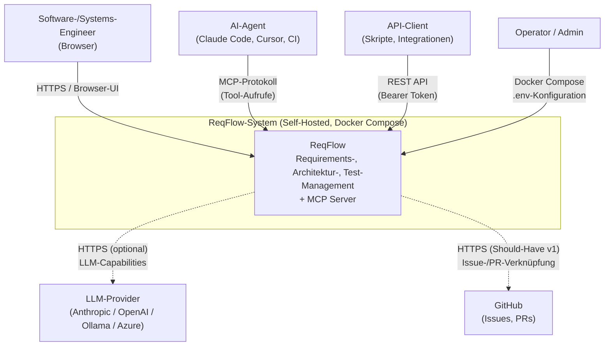
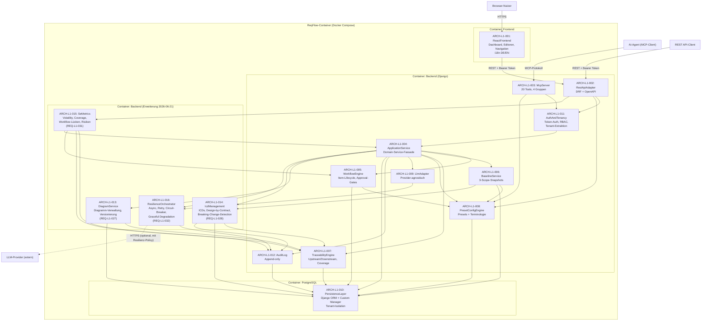
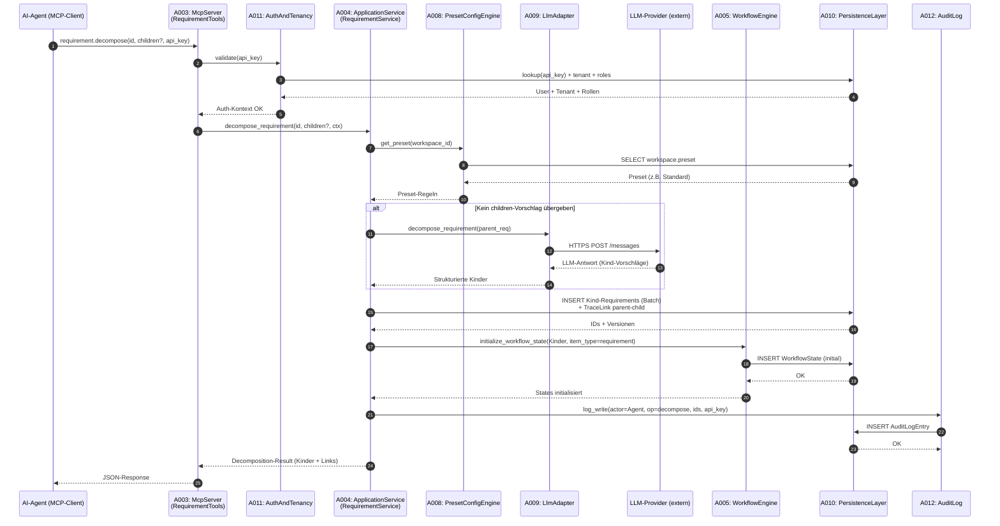
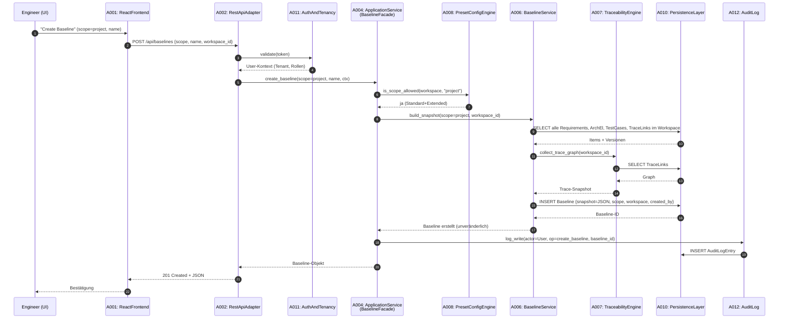

# ReqFlow — L1 Architecture (Gesamtsystem)

> Status: ERWEITERT 2026-07-29 (Superpowers Phasen 0-6) | Vorheriger Stand ERWEITERT 2026-06-21 (REQ-L1-027..032) | Erstellt: 2026-06-17 | Autor: se-architect-Agent (SE-Kaskade)
>
> Quelle: `docs/KONZEPT.md` (FINAL, Runden 1–4) + `docs/se/L1/Gesamtsystem/L1_Gesamtsystem_Requirements.md` (REQ-L1-001 … REQ-L1-032, approved)
>
> Notation: Dieses Dokument folgt dem C4-Ansatz auf L1 (Kontext + Container).
> L2-Whitebox-Inhalte sind in den jeweiligen `docs/se/L1/Gesamtsystem/L2/<SystemName>System/L2_<SystemName>System_Architecture.md` ausgelagert.

---

## 1. Überblick

ReqFlow ist ein AI-natives Requirements-Management-System, das zwei gleichrangige primäre Schnittstellen — eine REST API und einen MCP Server — auf ein gemeinsames Domain-Service-Modell auflegt. Die Architektur folgt fünf tragenden Prinzipien:

**Dual-Interface, Single Domain-Core:** REST und MCP sind keine hierarchisch gestapelten Schichten, sondern zwei gleichrangige Adapter, die direkt gegen einen gemeinsamen Application-Service-Layer arbeiten. Das verhindert HTTP-Roundtrips beim MCP-Aufruf, ermöglicht Batch-Operationen wie `requirement.decompose` und garantiert semantische Konsistenz: Was via REST geht, geht auch via MCP — und umgekehrt.

**Provider-Abstraktion für LLMs:** Alle AI-Capabilities (Validierung, Decomposition, optionale Generierung und Konsistenz-Checks) laufen über eine schmale Adapter-Schicht, die das LLM-Detail (OpenAI, Anthropic, Ollama, Azure-OpenAI, …) hinter einer stabilen internen Schnittstelle versteckt. Kein Geschäftsmodul kennt einen konkreten Provider. Deployments ohne LLM-Zugang verlieren AI-Features, aber keine Kernfunktionalität.

**Configurable Rigor als Querschnitts-Konzept:** Die Preset-/Config-Engine ist kein Modul am Rand, sondern ein Querschnitts-Service, der von WorkflowEngine, Baseline-Service, REST/MCP-Adaptern und UI gleichermaßen konsultiert wird. Ein Preset (Minimal / Standard / Extended) entscheidet zur Laufzeit über Pflichtfelder, sichtbare Tools, Baseline-Scope und Workflow-Strenge — ohne Code-Pfad-Verzweigung pro Zielgruppe.

**Tenant-Context-Propagation:** Mandantenfähigkeit ist nicht als separates DB-Schema realisiert, sondern als Row-Level-Isolation über einen `tenant_id`-FK auf jeder Entität. Ein Custom Django Manager und eine Auth-Middleware injizieren den aktiven Tenant in jeden Query — keine Anwendungslogik darf den Filter umgehen. In v1 existiert genau ein Default-Tenant; die v2-Aktivierung von Multi-Tenancy erfordert keine Datenmigration.

**Self-Hosted First:** Docker Compose ist die primäre Deploymentform. Drei Services (Backend, Frontend, PostgreSQL) starten via `docker-compose up`. Keine externen Cloud-Abhängigkeiten zur Laufzeit. Eine LLM-Anbindung ist optional und über Umgebungsvariablen konfigurierbar.

---

## 2. L1-Systemkontext

### 2.1 Externe Akteure und Schnittstellen

ReqFlow ist als geschlossenes System modelliert, das mit folgenden Akteuren interagiert:

| Akteur | Typ | Schnittstelle | Zweck | Bezug REQ-L1 |
|---|---|---|---|---|
| Software-Engineer / Systems-Engineer | Mensch | Browser → React-UI | Manuelles Requirements-Management, Reviews, Approvals | REQ-L1-017 |
| AI-Agent (Claude Code, Cursor, CI-Agent) | Maschine | MCP-Protokoll | Strukturierter Read/Write-Zugriff via profilierte Agent-Templates (Phase 6) | REQ-L1-005 |
| API-Client (Custom-Integration, Skript) | Maschine | REST API (HTTP/JSON) | Programmatischer Zugriff, CI/CD-Integration | REQ-L1-006 |
| LLM-Provider (Anthropic, OpenAI, Ollama, …) | Externes System | HTTPS-Outbound | Optionale AI-Capabilities (Validierung, Decomposition) | REQ-L1-013 |
| GitHub (v1 Should-Have) | Externes System | HTTPS-Outbound | Verknüpfung Requirements ↔ Issues/PRs | REQ-L1-022 |
| Operator / Admin | Mensch | Docker Compose / .env | Deployment, Konfiguration | REQ-L1-018 |

### 2.2 Systemgrenze

Innerhalb der Systemgrenze: Django-Backend, React-Frontend, PostgreSQL. Außerhalb: Browser, AI-Agent-Runtimes, LLM-Provider, GitHub, Docker-Host.

### 2.3 Kontextdiagramm (Mermaid)

---

## 3. L1-Whitebox (16 Subsysteme / Architektureinheiten)

Die L1-Whitebox zerlegt ReqFlow in sechzehn Subsysteme (Architektureinheiten, ARCH-L1-001 … ARCH-L1-016). Jedes Subsystem hat eine klar abgegrenzte Verantwortlichkeit und kommuniziert ausschließlich über definierte Schnittstellen. Jedes ARCH-L1-0xx entspricht einem L2-System (siehe jeweilige L2-Architektur-Dokumente).

> **Erweiterung 2026-06-21 (HOFF-20260621-004):** Vier neue L2-Systeme (ARCH-L1-013..016) wurden zur Abdeckung von REQ-L1-027..032 ergänzt. Drei bestehende Systeme (A004, A007, A009) erhalten Erweiterungs-Hooks. Siehe §3.3 (Neue Subsysteme) und §3.4 (Erweiterungen bestehender Subsysteme).

### 3.1 Subsysteme und Verantwortlichkeiten

#### ARCH-L1-001 — ReactFrontend (UI-Layer)

**Domain:** software
**Responsibility:** Single-Page-Application in React + TypeScript. Stellt Dashboard, Requirements-Editor, Architecture-Editor, Artefakt-Navigation, Traceability-Anzeige und Workspace-Konfiguration bereit. Liest aktives Terminologie-Profil aus Workspace-Settings und rendert Labels entsprechend. i18n via react-i18next (DE/EN). Kommuniziert ausschließlich über die REST API mit dem Backend.

**Externe Interfaces (eingehend):**
- Browser → HTTPS → Nutzerinteraktion

**Interne Interfaces (ausgehend):**
- ARCH-L1-001 → ARCH-L1-002: REST + Bearer Token (JSON)
- ARCH-L1-001 → ARCH-L1-013: IF-L1-058 (Canvas Auto-Save Push, JSON-Stroke-Daten, intervallgesteuert max. 5s)
- ARCH-L1-001 → ARCH-L1-013: IF-L1-059 (Mermaid Source Update, Quellcode mit 500ms Debounce)

**Interne Interfaces (eingehend):**
- ARCH-L1-013 → ARCH-L1-001: IF-L1-060 (Canvas-Stroke-Daten (JSON) + SVG/PNG-Export)
- ARCH-L1-013 → ARCH-L1-001: IF-L1-061 (Mermaid Source + Render-Hinweise + PNG/SVG-Export)

**Zugeordnete REQ-L1:** REQ-L1-016 (i18n), REQ-L1-017 (React-UI)
**Mitwirkend bei:** REQ-L1-007 (Preset-Sichtbarkeit), REQ-L1-014 (Terminologie-Profile), REQ-L1-026 (UI-Performance), REQ-L1-056 (Free-Hand Canvas), REQ-L1-057 (Mermaid Live Preview), REQ-161 (Unified Workflow Status Editor), REQ-176 (Visual Workflow Editor), REQ-184 (Settings IA Split)

→ Siehe `docs/se/L1/Gesamtsystem/L2/ReactFrontendSystem/L2_ReactFrontendSystem_Architecture.md`

---

#### ARCH-L1-002 — RestApiAdapter (REST-Schnittstelle)

**Domain:** software
**Responsibility:** Django REST Framework. Exponiert alle Domain-Operationen als HTTP/JSON-Endpunkte mit Bearer-Token-Authentifizierung. Auto-generierte OpenAPI-Spezifikation (`drf-spectacular` oder vergleichbar). Übersetzt HTTP-Requests in `ApplicationService`-Aufrufe. Keine Geschäftslogik in dieser Schicht — reine Translation und Serialization. Backend-Fehlermeldungen werden über ein zentrales i18n-Modul in DE/EN übersetzt; fehlende Translation-Keys sind Build-Fehler (Lint-Regel).

**Externe Interfaces (eingehend):**
- API-Client → HTTP/JSON + Bearer Token
- ReactFrontend → HTTP/JSON + Bearer Token

**Interne Interfaces (ausgehend):**
- ARCH-L1-002 → ARCH-L1-011: Token-Validierung, Auth-Kontext
- ARCH-L1-002 → ARCH-L1-004: Use-Case-Methoden (In-Process Python)
- ARCH-L1-002 → ARCH-L1-008: Preset-Abfrage (zur Laufzeit-Entscheidung über sichtbare Endpunkte/Felder)

**Zugeordnete REQ-L1:** REQ-L1-006 (REST API + OpenAPI)
**Mitwirkend bei:** REQ-L1-010 (RBAC-Enforcement), REQ-L1-011 (Audit-Log-Auslösung), REQ-L1-016 (i18n Backend-Fehlertexte), REQ-L1-026 (API-Performance)

→ Siehe `docs/se/L1/Gesamtsystem/L2/RestApiAdapterSystem/L2_RestApiAdapterSystem_Architecture.md`

---

#### ARCH-L1-003 — McpServer (MCP-Schnittstelle)

**Responsibility:** Nativer MCP-Protokoll-Handler (stdio/sse/HTTP-Transport je nach Client). Implementiert über 40 Tools in fünf Gruppen (Requirements, Architecture, Tests, Übergreifend, GenericCrud). Der SSE-Transport erfolgt asynchron via Redis PubSub, um den HTTP 202 Accepted Standard zu erfüllen. Greift — wie der REST-Adapter — direkt auf `ApplicationService` zu, nicht über die REST API. Schreibende Operationen werden mit Agent-Client-Identität und API-Key im AuditLog erfasst.

**Interfaces:**
- AI-Agent → MCP-Protokoll (Tool-Aufrufe)
- ARCH-L1-003 → ARCH-L1-004: In-Process-Aufrufe der Use-Case-Methoden
- ARCH-L1-003 → ARCH-L1-011: API-Key-Validierung

**Zugeordnete REQ-L1:** REQ-L1-005 (MCP Server)
**Mitwirkend bei:** REQ-L1-010 (RBAC), REQ-L1-011 (MCP-Audit-Trail), REQ-L1-013 (LLM-Capability-Aufrufe via ApplicationService), REQ-L1-020 (artifact.search-Tool)

→ Siehe `docs/se/L1/Gesamtsystem/L2/McpServerSystem/L2_McpServerSystem_Architecture.md`

---

#### ARCH-L1-004 — ApplicationService (Domain-Service-Schicht)

**Domain:** software
**Responsibility:** Fassade zur gesamten Geschäftslogik. Bietet Use-Case-orientierte Operationen (z.B. `create_requirement`, `decompose_requirement`, `create_baseline`, `transition_workflow_state`). Orchestriert die unter ihr liegenden Domain-Komponenten (WorkflowEngine, BaselineService, TraceabilityEngine). Sicherstellt transaktionale Konsistenz. Einziger legitimer Zugriffspunkt für REST- und MCP-Adapter.

**Interne Interfaces (eingehend):**
- ARCH-L1-002 → ARCH-L1-004: REST-Use-Case-Aufrufe
- ARCH-L1-003 → ARCH-L1-004: MCP-Use-Case-Aufrufe

**Interne Interfaces (ausgehend):**
- ARCH-L1-004 → ARCH-L1-005: Workflow-Transitionen
- ARCH-L1-004 → ARCH-L1-006: Baseline-Erstellung / Diff
- ARCH-L1-004 → ARCH-L1-007: Traceability-Queries / Coverage
- ARCH-L1-004 → ARCH-L1-008: Preset-Regeln (Pflichtfelder, Scope-Verfügbarkeit)
- ARCH-L1-004 → ARCH-L1-009: LLM-Capability-Aufrufe (validate, decompose, check_consistency)
- ARCH-L1-004 → ARCH-L1-012: Audit-Log-Schreibung
- ARCH-L1-004 → ARCH-L1-010: Persistenz via Django ORM

**Zugeordnete REQ-L1:** REQ-L1-001 (Artefakt-Hierarchie), REQ-L1-002 (Requirements CRUD), REQ-L1-004 (ArchitectureElement), REQ-L1-012 (Testmanagement), REQ-L1-019 (Export), REQ-L1-020 (Volltextsuche), REQ-L1-021 (CSV-Import), REQ-L1-022 (GitHub-Integration), REQ-L1-023 (PDF-Export), REQ-L1-024 (Webhooks), REQ-L1-025 (ACID)
**Mitwirkend bei:** REQ-L1-003, REQ-L1-005, REQ-L1-006, REQ-L1-007, REQ-L1-008, REQ-L1-009, REQ-L1-010, REQ-L1-011, REQ-L1-013, REQ-L1-015, REQ-L1-026

→ Siehe `docs/se/L1/Gesamtsystem/L2/ApplicationServiceSystem/L2_ApplicationServiceSystem_Architecture.md`

---

#### ARCH-L1-005 — WorkflowEngine (Item-Lifecycle)

**Domain:** software
**Responsibility:** Universelle State-Machine für alle primären Entitätstypen (Requirement, StakeholderNeed, Adr, TestCase, Risk, Issue, TestRun, Baseline, ICD, Diagram, Glossary). Validiert State-Übergänge gegen erlaubte Rollen und per-Transition konfigurierbare `change_reason`-Pflicht (REQ-172). Schreibt jeden Übergang in `WorkflowState.history`. Implementiert das Symmetrische Global-Default/Override-Modell (REQ-178): Bezieht pro Rigor-Preset eine tenant-weite globale Workflow-Definition als Source-of-Truth, die auf Workspace-Ebene geerbt, überschrieben (Override) oder auf den Default zurückgesetzt werden kann (Reset-to-Default).

**Interne Interfaces (eingehend):**
- ARCH-L1-004 → ARCH-L1-005: `transition(item_id, target_state, change_reason, ctx)`
- ARCH-L1-008 → ARCH-L1-005: Preset-Regeln (Workflow-Konfigurierbarkeit, Erben von Global Defaults)

**Interne Interfaces (ausgehend):**
- ARCH-L1-005 → ARCH-L1-010: Persistenz von WorkflowDefinition (Global & Workspace-Override), WorkflowState
- ARCH-L1-005 → ARCH-L1-011: Rollen-Prüfung (Approver-Check)

**Zugeordnete REQ-L1:** REQ-L1-009 (Item-Level-Workflow), REQ-160..REQ-177 (Universal Workflow Engine)
**Mitwirkend bei:** REQ-L1-002, REQ-L1-004, REQ-L1-007, REQ-L1-010, REQ-L1-011, REQ-L1-012, REQ-L1-025, REQ-178 (Global Default)

→ Siehe `docs/se/L1/Gesamtsystem/L2/WorkflowEngineSystem/L2_WorkflowEngineSystem_Architecture.md`

---

#### ARCH-L1-006 — BaselineService (Snapshot-Engine)

**Domain:** software
**Responsibility:** Erstellt unveränderliche Baselines auf drei Scopes (`document`, `project`, `global`). Resolviert den Scope, ermittelt alle betroffenen Item-IDs samt Versionen und persistiert atomar als JSON-Snapshot. Stellt Baseline-Vergleichs-Operationen (Diff) bereit. Global-Baselines nur im Extended-Preset (Preset-Konsultation via ARCH-L1-008).

**Interne Interfaces (eingehend):**
- ARCH-L1-004 → ARCH-L1-006: `build(scope, workspace_id, ctx)`, `diff(a, b)`
- ARCH-L1-008 → ARCH-L1-006: Preset-Regeln (Scope-Verfügbarkeit)

**Interne Interfaces (ausgehend):**
- ARCH-L1-006 → ARCH-L1-007: Trace-Graph-Sammlung für Snapshot
- ARCH-L1-006 → ARCH-L1-010: Persistenz von Baseline-Entität

**Zugeordnete REQ-L1:** REQ-L1-008 (Multi-Level-Baselines)
**Mitwirkend bei:** REQ-L1-007, REQ-L1-025

→ Siehe `docs/se/L1/Gesamtsystem/L2/BaselineServiceSystem/L2_BaselineServiceSystem_Architecture.md`

---

#### ARCH-L1-007 — TraceabilityEngine (Verknüpfungs-Logik)

**Domain:** software
**Responsibility:** Verwaltet TraceLinks zwischen Requirements, ArchitectureElements und TestCases mit den Link-Typen `parent-child`, `derives-from`, `satisfies`, `verifies`, `implements`, `refines`. Beantwortet Upstream/Downstream-Queries und Coverage-Reports. Performance-Ziel: < 200 ms für 10.000 Items.

**Interne Interfaces (eingehend):**
- ARCH-L1-004 → ARCH-L1-007: `query(artifact_id, direction)`, `coverage(workspace_id)`
- ARCH-L1-006 → ARCH-L1-007: Trace-Graph für Baseline-Snapshot

**Interne Interfaces (ausgehend):**
- ARCH-L1-007 → ARCH-L1-010: Persistenz von TraceLink-Entität

**Zugeordnete REQ-L1:** REQ-L1-003 (Traceability-Engine)
**Mitwirkend bei:** REQ-L1-001, REQ-L1-004, REQ-L1-008, REQ-L1-012 (Coverage-Tracking), REQ-L1-020, REQ-L1-023, REQ-L1-026

→ Siehe `docs/se/L1/Gesamtsystem/L2/TraceabilityEngineSystem/L2_TraceabilityEngineSystem_Architecture.md`

---

#### ARCH-L1-008 — PresetConfigEngine (Configurable Rigor)

**Domain:** software
**Responsibility:** Verwaltet System Settings und Workspace-Presets (Minimal / Standard / Extended). Beherbergt tenant-weite globale Configuration-Defaults für Workflows (pro Preset) und Berechtigungen (REQ-178, REQ-181). Liefert zur Laufzeit Entscheidungen über Pflichtfelder, sichtbare Tools, Baseline-Scope-Verfügbarkeit, Workflow-Konfigurierbarkeit und `change_reason`-Pflicht. Wird von WorkflowEngine (für Defaults), BaselineService, ApplicationService, RestApiAdapter und ReactFrontend konsultiert. Verwaltet Terminologie-Profile (Dev-Modus / SE-Modus).

**Interne Interfaces (eingehend):**
- ARCH-L1-002 → ARCH-L1-008: `is_feature_enabled(key, workspace_id)`, System-Settings-Verwaltung
- ARCH-L1-003 → ARCH-L1-008: `get_preset(workspace_id)`
- ARCH-L1-004 → ARCH-L1-008: `get_preset(workspace_id)`
- ARCH-L1-005 → ARCH-L1-008: Workflow-Konfigurierbarkeit und Global-Defaults
- ARCH-L1-006 → ARCH-L1-008: Scope-Verfügbarkeit
- ARCH-L1-011 → ARCH-L1-008: Permissions-Global-Defaults

**Interne Interfaces (ausgehend):**
- ARCH-L1-008 → ARCH-L1-010: Persistenz von System-Settings, Workspace-Settings, Preset-Konfiguration

**Zugeordnete REQ-L1:** REQ-L1-007 (Configurable-Rigor-Presets), REQ-L1-014 (Terminologie-Profile), REQ-178 (Global Workflow Defaults), REQ-181 (Global Permissions Defaults)
**Mitwirkend bei:** REQ-L1-002, REQ-L1-008, REQ-L1-009, REQ-L1-017, REQ-L1-019, REQ-184

→ Siehe `docs/se/L1/Gesamtsystem/L2/PresetConfigEngineSystem/L2_PresetConfigEngineSystem_Architecture.md`

---

#### ARCH-L1-009 — LlmAdapter (Provider-Abstraktion)

**Domain:** software
**Responsibility:** Schmale Schnittstelle zwischen Anwendungslogik und externen LLM-Providern. Stellt drei Operationen bereit: `validate_artifact`, `decompose_requirement`, `check_consistency`. Provider-Implementierungen (Anthropic, OpenAI, Ollama, Azure) sind austauschbar und werden über Deployment-Konfiguration (.env / Workspace-Settings) gewählt. Bei fehlender Konfiguration: graceful Fehler "LLM nicht konfiguriert".

**Externe Interfaces (ausgehend):**
- ARCH-L1-009 → LLM-Provider: HTTPS-Outbound (Provider-spezifisch, hinter `LlmCapabilityInterface` versteckt)

**Interne Interfaces (eingehend):**
- ARCH-L1-004 → ARCH-L1-009: `validate`, `decompose`, `check_consistency`

**Zugeordnete REQ-L1:** REQ-L1-013 (LLM-Capabilities)
**Mitwirkend bei:** REQ-L1-002, REQ-L1-004

→ Siehe `docs/se/L1/Gesamtsystem/L2/LlmAdapterSystem/L2_LlmAdapterSystem_Architecture.md`

---

#### ARCH-L1-010 — PersistenceLayer (Datenhaltung)

**Domain:** software
**Responsibility:** PostgreSQL via Django ORM. Hält alle Entitäten: Tenant, Workspace, Artifact, Requirement, ArchitectureElement, TraceLink, TestCase, Baseline, WorkflowDefinition, WorkflowState, AuditLog, User, Role. Tenant-Isolation wird über einen Custom Django Manager auf allen Entitäten erzwungen — keine Query darf den Filter umgehen. PostgreSQL-Indizes für hierarchische Queries (Recursive CTE), TraceLink-Graph-Queries (GIST/GIN) und Full-Text-Search (tsvector) sind vorgesehen, um die <200ms/<500ms-Ziele zu erreichen.

**Interne Interfaces (eingehend):**
- ARCH-L1-004 → ARCH-L1-010: Django ORM (alle Entitäten)
- ARCH-L1-005 → ARCH-L1-010: WorkflowDefinition, WorkflowState
- ARCH-L1-006 → ARCH-L1-010: Baseline
- ARCH-L1-007 → ARCH-L1-010: TraceLink
- ARCH-L1-008 → ARCH-L1-010: Workspace, Preset-Konfiguration
- ARCH-L1-012 → ARCH-L1-010: AuditLog
- ARCH-L1-011 → ARCH-L1-010: User, Role, Tenant (Auth-Lookup)

**Zugeordnete REQ-L1:** REQ-L1-015 (Multi-Tenancy-Vorbereitung), REQ-L1-025 (ACID), REQ-L1-026 (Performance)
**Mitwirkend bei:** Alle REQ-L1 mit Persistenzbedarf (001–024)

→ Siehe `docs/se/L1/Gesamtsystem/L2/PersistenceLayerSystem/L2_PersistenceLayerSystem_Architecture.md`

---

#### ARCH-L1-011 — AuthAndTenancy (Auth-Middleware)

**Domain:** software
**Responsibility:** Token-basierte Authentifizierung (Bearer Token / API Keys) und Tenant-Isolation. Setzt das **Globale Permission-Modell** um (REQ-181, REQ-186), das als alleinige autoritative Durchsetzungsinstanz für Zugriffsentscheidungen dient, inklusive Vererbung von Global-Defaults und Behandlung von Workspace-Overrides. Löst damit die alte hardkodierte `UserRole`/`ItemPermission`-Prüfung ab. Extrahiert den aktiven Tenant aus dem Token und propagiert ihn in den Request-Context für `PersistenceLayer.CustomManager`. Erzwingt Berechtigungs-Checks pro Operation und Ressource. **Credential-Login (REQ-L1-033):** verifiziert Benutzername/Passwort und stellt Token aus. Stellt Self-Initializing beim Anwendungsstart sicher (REQ-188).

**Externe Interfaces (eingehend):**
- API-Client / ReactFrontend → Bearer Token / API Key
- AI-Agent → API Key
- RestApiAdapter (öffentlicher `POST /auth/login/`) → `{username, password}` (kein Auth-Header)

**Interne Interfaces (ausgehend):**
- ARCH-L1-011 → ARCH-L1-010: User, Role, Tenant, Permissions Lookup (inkl. Passwort-Hash-Check)
- ARCH-L1-011 → ARCH-L1-004: Auth-Kontext (User, Tenant, Autoritative Permissions)
- ARCH-L1-011 → ARCH-L1-005: Rollen-Check (Approver-Transition)
- ARCH-L1-011 → ARCH-L1-008: Konsultation der Global-Permission-Defaults
- ARCH-L1-011 → ARCH-L1-002: Login-Token-Ausgabe `{token, user, tenant_id, roles}`

**Zugeordnete REQ-L1:** REQ-L1-010 (RBAC), REQ-L1-015 (Tenant-Extraktion), REQ-L1-033 (Credential-Login + Token-Ausgabe), REQ-181 (Global Permissions Default), REQ-186 (Autoritative Durchsetzung)
**Mitwirkend bei:** REQ-L1-002, REQ-L1-005, REQ-L1-006, REQ-L1-009, REQ-L1-011, REQ-L1-012, REQ-182, REQ-183, REQ-187, REQ-188

→ Siehe `docs/se/L1/Gesamtsystem/L2/AuthAndTenancySystem/L2_AuthAndTenancySystem_Architecture.md`

---

#### ARCH-L1-012 — AuditLog (Änderungshistorie)

**Domain:** software
**Responsibility:** Append-only Log aller schreibenden Operationen (REST und MCP). Erfasst Akteur (User oder Agent-Client + API-Key), Operation, Entitäts-ID, Zeitstempel, optional Feld-Diff. Wird von ApplicationService nach jeder schreibenden Operation befüllt. Im Datenmodell als eigene Entität persistiert; in v1 Operation-Level, Feld-Level als v2-Erweiterung möglich.

**Interne Interfaces (eingehend):**
- ARCH-L1-004 → ARCH-L1-012: `log_write(actor, op, entity_id, details)`
- ARCH-L1-002 → ARCH-L1-004 → ARCH-L1-012: REST-Schreiboperationen (indirekt)
- ARCH-L1-003 → ARCH-L1-004 → ARCH-L1-012: MCP-Schreiboperationen (indirekt)

**Interne Interfaces (ausgehend):**
- ARCH-L1-012 → ARCH-L1-010: Persistenz von AuditLogEntry

**Zugeordnete REQ-L1:** REQ-L1-011 (Audit-Trail)
**Mitwirkend bei:** REQ-L1-002, REQ-L1-005, REQ-L1-009, REQ-L1-025

→ Siehe `docs/se/L1/Gesamtsystem/L2/AuditLogSystem/L2_AuditLogSystem_Architecture.md`

---

---

### 3.3 Neue L2-Subsysteme (REQ-L1-027..032)

> Hinzugefügt 2026-06-21 (HOFF-20260621-004) zur Abdeckung der neuen L0-Anforderungen REQ-L0-016..021.

#### ARCH-L1-013 — DiagramService (Diagramm- und Grafik-Verwaltung)

| Eigenschaft | Wert |
|-------------|------|
| **Typ** | neu |
| **Verantwortlichkeit** | Verwaltet Diagramme (Blockdiagramm, Flussdiagramm, Kontextdiagramm — mindestens 3 Typen) als eigenständige, versionierte Artefakte mit strukturiertem Payload (z.B. Mermaid-Source, PlantUML-Source, oder strukturiertes JSON-Modell). Stellt Payload-Validierung, Versionierungs-Logik und renderbare Repräsentationen bereit. Verknüpft Diagramme via TraceabilityEngine mit Requirements/ArchitectureElements. **Erweiterung 2026-06-30:** Enthält zwei neue Komponenten für Free-Hand Canvas Drawing (COMP-DS-006) und Mermaid Live Preview (COMP-DS-007), die das bestehende Diagramm-Management um freie Zeichnung und Code-basierte Live-Preview erweitern. |
| **Ableitet von** | REQ-L1-027, REQ-L1-056, REQ-L1-057 |
| **Domain** | software |
| **Tier** | L2 |
| **Schnittstellen (eingehend)** | IF-L1-032 (ApplicationService → DiagramService): `create_diagram`, `update_diagram`, `get_diagram`, `list_versions`   IF-L1-033 (McpServer → DiagramService): `artifact.get` für Diagramm-Artefakttyp   IF-L1-058 (ReactFrontend → DiagramService): Canvas-Auto-Save-Push (JSON-Stroke-Daten, intervallgesteuert max. 5s)   IF-L1-059 (ReactFrontend → DiagramService): Mermaid-Source-Update (Quellcode mit 500ms Debounce) |
| **Schnittstellen (ausgehend)** | IF-L1-034 (DiagramService → TraceabilityEngine): TraceLink `documents` zwischen Diagramm und Requirement/ArchitectureElement   IF-L1-035 (DiagramService → PersistenceLayer): Diagram-Entity, DiagramVersion-Entity (Django ORM)   IF-L1-036 (DiagramService → AuditLog): Schreib-Operationen (via ApplicationService delegiert)   IF-L1-060 (DiagramService → ReactFrontend): Canvas-Stroke-Daten (JSON) + SVG-Export + PNG-Export (clientseitig via Canvas.toDataURL)   IF-L1-061 (DiagramService → ReactFrontend): Mermaid-Source + Render-Hinweise + PNG/SVG-Export (clientseitig via mermaid.js + canvas.toDataURL) |

**Begründung (Separation of Concerns):**
Diagramme haben einen distinkten Verantwortungsbereich: Payload-Validierung pro Diagramm-Typ, immutable Versionierung pro Änderung, optionale Server-side Render-Pipeline. Die Validierung von Mermaid-/PlantUML-Source oder strukturiertem JSON ist disjunkt von der CRUD-Logik für textuelle Anforderungen in ApplicationService. Ein eigenes System bewahrt die Kohäsion von A004 und ermöglicht spätere Render-Erweiterungen (PNG/SVG-Export) ohne A004 zu kontaminieren.

**Erweiterung 2026-06-30 (Canvas + Mermaid):**
Die beiden neuen Komponenten COMP-DS-006 (CanvasEditor) und COMP-DS-007 (MermaidLiveRenderer) werden IN das bestehende DiagramServiceSystem integriert, nicht als neue L2-Subsysteme. Begründung: (1) Beide Capabilities teilen die bestehende Infrastruktur (Versionierung, Traceability, MCP-Integration). (2) Ein neues L2-Subsystem würde Duplikation der Versionierungs- und Traceability-Logik erzeugen. (3) Alle Diagramm-bezogenen Capabilities bleiben in einem System (hohe Kohäsion). (4) Die bestehenden Komponenten DiagramManager, DiagramValidator und DiagramRenderer werden um neue Payload-Typen erweitert (Canvas-Stroke-Daten, Mermaid-Source-Code).

→ Siehe `docs/se/L1/Gesamtsystem/L2/DiagramServiceSystem/L2_DiagramServiceSystem_Architecture.md`

---

#### ARCH-L1-014 — IcdManagement (Interface Control Document Management)

| Eigenschaft | Wert |
|-------------|------|
| **Typ** | neu |
| **Verantwortlichkeit** | Verwaltet ICDs zwischen ArchitectureElements als versionierte, unveränderliche Interface-Verträge mit Feldern für Richtung, Typ, semantische Beschreibung, Vorbedingungen (Preconditions), Nachbedingungen (Postconditions) und Invarianten (Design-by-Contract). Erkennt inkompatible Änderungen über semantische Diff-Analyse und meldet Breaking-Change-Warnungen. ICD-Versionen sind Baseline-fähig. |
| **Ableitet von** | REQ-L1-028 |
| **Domain** | software |
| **Tier** | L2 |
| **Schnittstellen (eingehend)** | IF-L1-037 (ApplicationService → IcdManagement): `create_icd`, `update_icd`, `validate_compatibility`, `get_icd_history`   IF-L1-038 (BaselineService → IcdManagement): `get_icd_versions(workspace_id)` für Snapshot-Inklusion |
| **Schnittstellen (ausgehend)** | IF-L1-039 (IcdManagement → TraceabilityEngine): TraceLink `realizes` zwischen ICD und source/target ArchitectureElement   IF-L1-040 (IcdManagement → PersistenceLayer): Icd-Entity, IcdVersion-Entity (immutable)   IF-L1-041 (IcdManagement → AuditLog): Breaking-Change-Events |

**Begründung (Separation of Concerns):**
ICDs sind keine generischen TraceLinks — sie sind versionierte Verträge mit semantischer Kompatibilitäts-Logik (Pre-/Post-/Invariant-Vergleich für Breaking-Change-Detection). Diese DbC-Validierung ist disjunkt von der reinen Graph-Verwaltung in TraceabilityEngine. Auch die Unveränderlichkeit jeder ICD-Version folgt einer eigenen Lifecycle-Regel (vergleichbar mit Baselines, aber pro Schnittstelle). Eigenes System verhindert, dass A007 zwei verschiedene Konsistenz-Modelle gleichzeitig pflegen muss.

→ Siehe `docs/se/L1/Gesamtsystem/L2/IcdManagementSystem/L2_IcdManagementSystem_Architecture.md` (anzulegen)

---

#### ARCH-L1-015 — SeMetrics (SE-Prozess-Metrikmodul)

| Eigenschaft | Wert |
|-------------|------|
| **Typ** | neu |
| **Verantwortlichkeit** | Berechnet und exponiert SE-Prozessmetriken über alle Artefakttypen und Subsysteme: Requirements Volatility (Änderungsrate je Anforderung in konfigurierbarem Zeitraum), Traceability Coverage (Anteil verknüpfter Requirements), Workflow-Lücken (Items ohne vollständige Workflow-Historie), offene Risiken nach Schweregrad. Aggregiert aus AuditLog (Volatility), TraceabilityEngine (Coverage), WorkflowEngine (Lücken), ApplicationService (Risiko-Artefakte). Stellt Dashboard-Daten und REST-Endpunkt `GET /metrics/workspace/{id}` bereit. Konfigurierbare Schwellwert-Warnungen. |
| **Ableitet von** | REQ-L1-031 |
| **Domain** | software |
| **Tier** | L2 |
| **Schnittstellen (eingehend)** | IF-L1-042 (RestApiAdapter → SeMetrics): `compute_metrics(workspace_id, timeframe, scope_filter)`   IF-L1-043 (ReactFrontend → SeMetrics via REST): Dashboard-Datenabruf (über A002 → A015) |
| **Schnittstellen (ausgehend)** | IF-L1-044 (SeMetrics → AuditLog): `query_changes(workspace_id, timeframe)` für Volatility   IF-L1-045 (SeMetrics → TraceabilityEngine): `coverage(workspace_id)`   IF-L1-046 (SeMetrics → WorkflowEngine): `find_incomplete_states(workspace_id)`   IF-L1-047 (SeMetrics → ApplicationService): `query_risks_by_severity(workspace_id)`   IF-L1-048 (SeMetrics → PersistenceLayer): Metric-Cache-Entity (materialisierte Aggregationen, optional) |

**Begründung (Separation of Concerns):**
Metrik-Aggregation ist ein eigenständiges Read-Modell, das Daten aus mindestens vier verschiedenen Subsystemen (AuditLog, TraceabilityEngine, WorkflowEngine, ApplicationService) konsolidiert. Eingebettet in eines dieser Systeme würde es zirkuläre Abhängigkeiten erzeugen oder das Host-System mit fremder Verantwortung belasten. Im ApplicationService wäre es ein Gott-System-Antipattern. SoC bewahrt Single-Responsibility und ermöglicht zukünftige Erweiterungen (materialisierte Views, Scheduled-Aggregation, Time-Series-Storage) ohne Auswirkung auf transaktionale Pfade.

→ Siehe `docs/se/L1/Gesamtsystem/L2/SeMetricsSystem/L2_SeMetricsSystem_Architecture.md` (anzulegen)

---

#### ARCH-L1-016 — ResilienceOrchestrator (Resilienz / Graceful Degradation)

| Eigenschaft | Wert |
|-------------|------|
| **Typ** | neu |
| **Verantwortlichkeit** | Zentraler Resilienz-Manager für alle Outbound-Calls zu optionalen Subsystemen: LlmAdapter (extern: LLM-Provider), Webhook-Dispatcher (extern: Webhook-Targets), GitHub-Integration (extern: GitHub API). Stellt einheitliche Policies für asynchrone Entkopplung (Async-Queue), konfigurierbare Timeouts, mindestens einen Retry mit exponential backoff und Circuit-Breaker-Logik bereit. Garantiert Kernverfügbarkeit (CRUD, Traceability, Baselines) von > 99,5 % bei Ausfall optionaler Subsysteme. Schreibt Degradation-Events in AuditLog. |
| **Ableitet von** | REQ-L1-032 |
| **Priorität** | mandatory |
| **Domain** | system |
| **Tier** | L2 |
| **Schnittstellen (eingehend)** | IF-L1-049 (ApplicationService → ResilienceOrchestrator): `execute_optional(operation, target_subsystem, payload, policy)`   IF-L1-050 (LlmAdapter → ResilienceOrchestrator): Wrapping aller HTTPS-Outbound-Calls zu LLM-Providern |
| **Schnittstellen (ausgehend)** | IF-L1-051 (ResilienceOrchestrator → LlmAdapter / Webhook / GitHub): Delegierter Aufruf nach Policy-Anwendung   IF-L1-052 (ResilienceOrchestrator → AuditLog): Degradation-Events, Retry-Logs, Circuit-State-Changes |

**Begründung (Separation of Concerns):**
Resilienz-Policies (Timeout, Retry, Circuit-Breaker, Async-Decoupling) sind ein Cross-Cutting Concern für alle drei optionalen Outbound-Subsysteme. Lokal je System implementiert führt zu Policy-Drift, inkonsistenten Retry-Strategien und nicht-aggregierbaren Degradation-Metriken. Ein zentraler Resilienz-Manager garantiert konsistente Policy-Anwendung, einheitliches Audit von Degradation-Events und eine zentrale Stelle für Konfigurations-Tuning. Die mandatory-Priorität (im Gegensatz zu den anderen desired-Anforderungen) und die >99,5 %-Kernverfügbarkeitsgarantie rechtfertigen ein eigenes System statt einer reinen Library-Lösung. Domain "system" reflektiert den infrastruktur-nahen, übergreifenden Charakter.

→ Siehe `docs/se/L1/Gesamtsystem/L2/ResilienceOrchestratorSystem/L2_ResilienceOrchestratorSystem_Architecture.md` (anzulegen)

---

### 3.4 Erweiterungen bestehender L2-Subsysteme (REQ-L1-027..032)

#### Erweiterung ARCH-L1-004 ApplicationService — REQ-L1-029 (ADR/Risiko/Issue)

- **Was neu:** Drei zusätzliche Domain-Services in der Fassade — `AdrService`, `RiskService`, `IssueService` — mit identischem CRUD-Lifecycle-Muster wie `RequirementService` und `ArchitectureService`. Die Services orchestrieren WorkflowEngine (für eigene WorkflowDefinitions pro Artefakttyp), TraceabilityEngine (für Verknüpfung zu Requirements/ArchitectureElements/TestCases), PersistenceLayer (für neue Entitäten Adr/Risk/Issue) und AuditLog.
- **Warum hier:** ApplicationService ist die etablierte Fassade für alle artefakt-orientierten CRUD-Services und folgt einem einheitlichen Muster (siehe COMP-AS-001..005). ADR, Risiko und Issue sind Artefakttypen mit identischem Lifecycle-Profil — Workflow + TraceLinks + Audit. Sie in ein neues System auszulagern würde Code-Duplizierung erzeugen und die Konsistenz der Artefakt-CRUD-Logik gefährden.
- **Neue Interfaces:** IF-L1-053..055 (intern in A004 als neue COMP-AS-013..015), keine neuen externen L1-Inter-System-Schnittstellen.
- **Neue REQ-L2 erforderlich:** mindestens 3 (REQ-L2-AS-026 ADR-CRUD, REQ-L2-AS-027 Risiko-CRUD, REQ-L2-AS-028 Issue-CRUD).

#### Erweiterung ARCH-L1-004 ApplicationService — REQ-L1-032 (Webhook/GitHub-Resilienz-Hooks)

- **Was neu:** Bestehende `WebhookDispatcher`-Komponente (COMP-AS-011) und GitHub-Integration (REQ-L2-AS-015) werden umgestellt, ihre Outbound-Calls über ResilienceOrchestrator (A016) zu routen statt direkter HTTPS-Calls.
- **Warum hier:** Diese Komponenten verbleiben in A004, weil ihre Trigger-Logik (Event-Emission bei Domain-Operationen) integraler Teil der Geschäftslogik ist. Nur die Ausführungs-/Transport-Schicht delegiert nach A016.
- **Neue Interfaces:** IF-L1-049 (A004 → A016) als Wrapper-Aufruf.

#### Erweiterung ARCH-L1-004 ApplicationService — REQ-L1-027 (Diagramm-Fassade)

- **Was neu:** Neue Service-Klasse `DiagramFacadeService` als Fassaden-Eintrittspunkt für Diagramm-Operationen; delegiert an A013 DiagramService und orchestriert WorkflowEngine + TraceabilityEngine + AuditLog.
- **Warum hier:** ApplicationService bleibt der einheitliche Eintrittspunkt für REST und MCP (ADR-01). Die fachliche Diagramm-Logik liegt in A013, die Fassade in A004 wahrt die Single-Entry-Point-Regel.
- **Neue Interfaces:** IF-L1-032 (A004 → A013).

#### Erweiterung ARCH-L1-004 ApplicationService — REQ-L1-028 (ICD-Fassade)

- **Was neu:** Neue Service-Klasse `IcdFacadeService` als Fassade für ICD-Operationen; delegiert an A014 IcdManagement.
- **Warum hier:** Identische Begründung wie für REQ-L1-027 — Single-Entry-Point-Regel via A004.
- **Neue Interfaces:** IF-L1-037 (A004 → A014).

#### Erweiterung ARCH-L1-007 TraceabilityEngine — REQ-L1-030 (Cross-Projekt-Traceability)

- **Was neu:** TraceabilityEngine erhält Awareness für `project_id` auf Artefakt-Ebene. Query-Engine wird erweitert um Cross-Projekt-Graph-Traversal mit Cross-Projekt-Annotation in den Ergebnissen. Neue Validierungs-Regel im TraceLinkManager: Cross-Tenant-Links werden abgelehnt (Konsultation von A011 AuthAndTenancy für Tenant-Boundary-Check). Neuer Link-Typ optional; mindestens reicht Annotation `cross_project=true` im Query-Result.
- **Warum hier:** Kernverantwortlichkeit von A007 ist Graph-Management von TraceLinks. project_id ist ein zusätzliches Feld auf Artefakten; die Graph-Traversal-Logik ist bereits dort gekapselt. Ein neues System wäre Duplizierung der Graph-Algorithmen.
- **Neue Interfaces:** IF-L1-056 (A007 → A011): `validate_cross_tenant_boundary(source_artifact_id, target_artifact_id)` für Sicherheits-Guard.
- **Neue REQ-L2 erforderlich:** mindestens 2 (REQ-L2-TE-013 Cross-Projekt-Link-CRUD, REQ-L2-TE-014 Cross-Projekt-Graph-Query mit Annotation).

#### Erweiterung ARCH-L1-007 TraceabilityEngine — REQ-L1-027/028 (Neue Link-Typen)

- **Was neu:** Zwei neue Link-Typen — `documents` (Diagramm → Requirement/ArchitectureElement) und `realizes` (ICD → ArchitectureElement). Erweiterung des Link-Type-Enums von 6 auf 8.
- **Warum hier:** TraceLink-Typ-Verwaltung ist Single Source of Truth in A007.
- **Neue Interfaces:** IF-L1-034 (A013 → A007), IF-L1-039 (A014 → A007).

#### Erweiterung ARCH-L1-009 LlmAdapter — REQ-L1-032 (Resilienz-Routing)

- **Was neu:** Bestehende HTTPS-Outbound-Calls (IF-L1-023) werden durch ResilienceOrchestrator (A016) geroutet. LlmAdapter ruft A016, A016 ruft den eigentlichen Provider mit Policy-Anwendung.
- **Warum hier:** LlmAdapter bleibt Provider-Abstraktion (ADR-02). Resilienz ist orthogonal und wird zentral von A016 verwaltet.
- **Neue Interfaces:** IF-L1-050 (A009 → A016).

#### Erweiterung ARCH-L1-006 BaselineService — REQ-L1-028 (ICD-Snapshot)

- **Was neu:** Baseline-Snapshot inkludiert ICD-Versionen für den Scope. Snapshot-Builder ruft IcdManagement (A014) für aktuelle ICD-Versionen ab.
- **Warum hier:** Baselines sind übergreifend für alle versionierten Artefakte. ICD-Versionen sind versioniert und Baseline-relevant.
- **Neue Interfaces:** IF-L1-038 (A006 → A014).

---

### 3.6 Erweiterungen durch "Superpowers" (Phasen 0–6)

Diese Erweiterungen schärfen bestehende L1-Subsysteme primär im Bereich MCP-Fähigkeiten, AI-Integration und Status-Konsistenz. Sie erfordern keine neuen L1-Subsysteme, sondern vertiefen die Funktionalität:

#### Erweiterung ARCH-L1-005 WorkflowEngine & ARCH-L1-010 PersistenceLayer — Phase 0 (Status Unification)
- **Was neu:** Der Status aller Artefakte wird auf einen universellen Workflow-State (`WorkflowItemState.current_state`) vereinheitlicht. Einführung eines universellen Outdate/Reactivate-Mechanismus, der harte Löschungen und inkonsistente Soft-Deletes ablöst.
- **Warum hier:** Löst Inkonsistenzen bei der Statusverwaltung. Die WorkflowEngine wird zur Single Source of Truth für den Business-Prozess (inklusive historischer Zustände).

#### Erweiterung ARCH-L1-003 McpServer — Phase 1 & 2 (CRUD & Context Generators)
- **Was neu:** Vollständige Abdeckung aller Entitäten durch MCP-Tools (Phase 1). Einführung von `workspace.get_context` mit Token-Budget-Management und dynamischer Tiefe (`depth`) zur Kontext-Aggregierung für Agenten (Phase 2).
- **Warum hier:** Erweitert die Maschine-zu-Maschine-Schnittstelle. Der McpServer kapselt die Aufbereitung von Kontext, basierend auf Konfigurationen (PresetConfigEngine).

#### Erweiterung ARCH-L1-005 WorkflowEngine & ARCH-L1-009 LlmAdapter — Phase 3 (Derive Write Mode)
- **Was neu:** AI-Derivation-Operationen schreiben direkt in die Datenbank, gesteuert durch `is_approval_gate` und `auto_approve_target` Metadaten der WorkflowEngine.
- **Warum hier:** Verbindet AI-Generierung mit dem regulären Status-Workflow, sodass Agenten-Outputs korrekt als Draft oder In-Review persistiert werden, ohne den Review-Prozess zu umgehen.

#### Erweiterung ARCH-L1-010 PersistenceLayer — Phase 4 (Prompt Templates) & Phase 5 (ReviewPolicy)
- **Was neu:** Ablösung von Tenant-Singletons für Prompts durch ein versioniertes `PromptTemplate`-Modell mit Fallback-Logik (Workspace -> Tenant -> Default). Einführung eines `ReviewPolicy`-Modells zur feingranularen Steuerung von Freigaben (z.B. `review_high_risk`).
- **Warum hier:** Flexibilisierung der Konfigurationen auf Workspace-Ebene bei gleichzeitiger Wahrung von System-Defaults.

#### Externes Interface-Artefakt — Phase 6 (Agent Templates)
- **Was neu:** Bereitstellung von standardisierten Agenten-Profilen (`docs/agent-templates/` wie z.B. Quality Auditor, Change Manager), die Whitelists für MCP-Tools definieren.
- **Warum extern:** Diese Templates sind keine internen Backend-Subsysteme, sondern Distributions-Artefakte für Downstream-Konsumenten (AI-Agenten), um Rollen-spezifisch mit ReqogniLoom zu interagieren.

### 3.5 L1-Komponentendiagramm (Mermaid)

**Lesehinweis:** Durchgezogene Pfeile = synchrone In-Process-Aufrufe / DB-Zugriffe. Gestrichelte Pfeile = optionale externe HTTPS-Calls. Erweiterung 2026-06-21: A013..A016 mit ihren Verbindungen sind die neuen Subsysteme zur Abdeckung von REQ-L1-027..032.

---

## 4. Cross-Cutting-Sequenzen (L1-Verhalten)

Die folgenden Sequenz-Diagramme zeigen die L1-übergreifende Zusammenarbeit zweier kritischer Flows. Die Detail-Sequenzen je System sind in den jeweiligen L2-Architektur-Dokumenten verankert.

### 4.1 MCP-Tool-Aufruf `requirement.decompose`

Dieser Flow demonstriert die Zusammenarbeit von MCP, Auth, ApplicationService, LlmAdapter, WorkflowEngine, PersistenceLayer und AuditLog bei einer LLM-gestützten Schreiboperation eines AI-Agenten.

### 4.2 Baseline-Erstellung (Scope `project`)

---

## 5. Schnittstellen-Übersicht (L1)

Die konsolidierte Schnittstellen-Registry liegt in `docs/se/interface-registry.md`. Hier die L1-relevante Kurzfassung der internen AE-↔-AE-Schnittstellen.

| Schnittstelle | Caller → Callee | Typ | Vertrag (Kurzform) |
|---|---|---|---|
| `RestApiAdapter → ApplicationService` | A002 → A004 | In-Process Python | Use-Case-Methoden, Pydantic-/DRF-Serializer als DTOs |
| `McpServer → ApplicationService` | A003 → A004 | In-Process Python | Identische Use-Case-Methoden wie REST — gemeinsamer Domain-Kontrakt |
| `ApplicationService → WorkflowEngine` | A004 → A005 | In-Process Python | `transition(item_id, target_state, change_reason, ctx)` |
| `ApplicationService → BaselineService` | A004 → A006 | In-Process Python | `build(scope, workspace_id, ctx)`, `diff(a, b)` |
| `ApplicationService → TraceabilityEngine` | A004 → A007 | In-Process Python | `query(artifact_id, direction)`, `coverage(workspace_id)` |
| `ApplicationService → LlmAdapter` | A004 → A009 | In-Process Python | `validate`, `decompose`, `check_consistency` |
| `ApplicationService → AuditLog` | A004 → A012 | In-Process Python | `log_write(actor, op, entity_id, details)` |
| `AuthAndTenancy → ApplicationService` | A011 → A004 | In-Process Python | Auth-Kontext (User, Tenant, Rollen) |
| `AuthAndTenancy → WorkflowEngine` | A011 → A005 | In-Process Python | Rollen-Check (Approver-Transition) |
| `Any → PresetConfigEngine` | * → A008 | In-Process Python | `get_preset(workspace_id)`, `is_feature_enabled(key, workspace_id)` |
| `Any → PersistenceLayer` | * → A010 | Django ORM | Custom Manager erzwingt `tenant_id`-Filter |
| `LlmAdapter → External LLM` | A009 → LLM | HTTPS-Outbound | Provider-spezifisch, hinter `LlmCapabilityInterface` versteckt |

**Erweiterung 2026-06-21 (HOFF-20260621-004) — reservierte Interface-IDs:**

> Die folgenden IDs sind **reserviert** für die neuen Verbindungen aus REQ-L1-027..032. Die finale Eintragung in `docs/se/interface-registry.md` erfolgt durch den `se-interface-mgr`-Agenten als nächsten Kaskaden-Schritt.

| ID (reserviert) | Quelle → Ziel | Typ | Vertrag (Kurzform) | Quelle REQ |
|-----------------|---------------|-----|---------------------|------------|
| IF-L1-032 | A004 ApplicationService → A013 DiagramService | In-Process Python | `create_diagram`, `update_diagram`, `get_diagram`, `list_versions` | REQ-L1-027 |
| IF-L1-033 | A003 McpServer → A013 DiagramService | In-Process Python | `artifact.get` für Diagramm-Typ | REQ-L1-027 |
| IF-L1-034 | A013 DiagramService → A007 TraceabilityEngine | In-Process Python | TraceLink-Typ `documents` | REQ-L1-027 |
| IF-L1-035 | A013 DiagramService → A010 PersistenceLayer | Django ORM | Diagram-Entity, DiagramVersion-Entity | REQ-L1-027 |
| IF-L1-036 | A013 DiagramService → A012 AuditLog | In-Process Python | Schreib-Operationen (delegiert via A004) | REQ-L1-027 |
| IF-L1-037 | A004 ApplicationService → A014 IcdManagement | In-Process Python | `create_icd`, `update_icd`, `validate_compatibility`, `get_icd_history` | REQ-L1-028 |
| IF-L1-038 | A006 BaselineService → A014 IcdManagement | In-Process Python | `get_icd_versions(workspace_id)` für Snapshot | REQ-L1-028 |
| IF-L1-039 | A014 IcdManagement → A007 TraceabilityEngine | In-Process Python | TraceLink-Typ `realizes` | REQ-L1-028 |
| IF-L1-040 | A014 IcdManagement → A010 PersistenceLayer | Django ORM | Icd-Entity, IcdVersion-Entity (immutable) | REQ-L1-028 |
| IF-L1-041 | A014 IcdManagement → A012 AuditLog | In-Process Python | Breaking-Change-Events | REQ-L1-028 |
| IF-L1-042 | A002 RestApiAdapter → A015 SeMetrics | In-Process Python | `compute_metrics(workspace_id, timeframe, scope_filter)` | REQ-L1-031 |
| IF-L1-043 | A001 ReactFrontend → A015 SeMetrics (via REST) | REST + Bearer Token | Dashboard-Datenabruf via A002 | REQ-L1-031 |
| IF-L1-044 | A015 SeMetrics → A012 AuditLog | In-Process Python | `query_changes(workspace_id, timeframe)` für Volatility | REQ-L1-031 |
| IF-L1-045 | A015 SeMetrics → A007 TraceabilityEngine | In-Process Python | `coverage(workspace_id)` | REQ-L1-031 |
| IF-L1-046 | A015 SeMetrics → A005 WorkflowEngine | In-Process Python | `find_incomplete_states(workspace_id)` | REQ-L1-031 |
| IF-L1-047 | A015 SeMetrics → A004 ApplicationService | In-Process Python | `query_risks_by_severity(workspace_id)` | REQ-L1-031 |
| IF-L1-048 | A015 SeMetrics → A010 PersistenceLayer | Django ORM | Metric-Cache-Entity (optional, materialisierte Aggregationen) | REQ-L1-031 |
| IF-L1-049 | A004 ApplicationService → A016 ResilienceOrchestrator | In-Process Python | `execute_optional(operation, target_subsystem, payload, policy)` | REQ-L1-032 |
| IF-L1-050 | A009 LlmAdapter → A016 ResilienceOrchestrator | In-Process Python | Wrapping aller HTTPS-Outbound-Calls | REQ-L1-032 |
| IF-L1-051 | A016 ResilienceOrchestrator → A009 / Webhook / GitHub | In-Process / HTTPS | Delegierter Aufruf nach Policy-Anwendung | REQ-L1-032 |
| IF-L1-052 | A016 ResilienceOrchestrator → A012 AuditLog | In-Process Python | Degradation-Events, Retry-Logs, Circuit-State-Changes | REQ-L1-032 |
| IF-L1-056 | A007 TraceabilityEngine → A011 AuthAndTenancy | In-Process Python | `validate_cross_tenant_boundary(source, target)` | REQ-L1-030 |
| IF-L1-058 | A001 ReactFrontend → A013 DiagramService | REST + Bearer Token | Canvas-Auto-Save-Push (JSON-Stroke-Daten, intervallgesteuert max. 5s) | REQ-L1-056 |
| IF-L1-059 | A001 ReactFrontend → A013 DiagramService | REST + Bearer Token | Mermaid-Source-Update (Quellcode mit 500ms Debounce) | REQ-L1-057 |
| IF-L1-060 | A013 DiagramService → A001 ReactFrontend | REST + Bearer Token | Canvas-Stroke-Daten (JSON) + SVG-Export + PNG-Export (clientseitig via Canvas.toDataURL) | REQ-L1-056 |
| IF-L1-061 | A013 DiagramService → A001 ReactFrontend | REST + Bearer Token | Mermaid-Source + Render-Hinweise + PNG/SVG-Export (clientseitig via mermaid.js + canvas.toDataURL) | REQ-L1-057 |

---

## 6. Architektur-Entscheidungen (ADR-Kurzform)

**ADR-01 — MCP Server greift direkt auf ApplicationService zu (nicht über REST)**
*Entscheidung:* McpServer und RestApiAdapter sind zwei gleichrangige Adapter über demselben ApplicationService.
*Rationale:* Vermeidet HTTP-Roundtrip-Overhead bei Batch-Operationen wie `requirement.decompose`, erlaubt MCP-spezifische Audit-Felder (Agent-Client, API-Key) ohne REST-Verunreinigung und garantiert semantische Konsistenz zwischen beiden Schnittstellen. *Verworfene Alternative:* MCP als Wrapper über REST — abgelehnt wegen Latenz und doppelter Auth-Verarbeitung.
*Quelle:* KONZEPT.md 9.3 (Bullet "MCP Server als eigenständige Schnittstelle"), REQ-L1-005, REQ-L1-006.

**ADR-02 — LLM-Provider über schmale Adapter-Schicht abstrahieren**
*Entscheidung:* `LlmAdapter` mit `LlmCapabilityInterface` als einziger Berührungspunkt der Domain mit LLMs.
*Rationale:* Vendor-Lock-in vermeiden, lokale Self-Hosted-Alternativen (Ollama) ermöglichen, graceful Degradation bei fehlender Konfiguration. Pluggable Capabilities sind die AI-native Dimension 1. *Verworfene Alternative:* Direkter Anthropic-SDK-Aufruf in `RequirementService` — abgelehnt wegen harter Kopplung und fehlender Self-Host-Tauglichkeit.
*Quelle:* KONZEPT.md 1 (Dimension 1), 9.3, REQ-L1-013.

**ADR-03 — Tenant-Isolation via Row-Level + Custom Django Manager (kein Schema-per-Tenant)**
*Entscheidung:* Alle Entitäten tragen `tenant_id`-FK; ein Custom Manager filtert automatisch.
*Rationale:* Schema-per-Tenant (django-tenants) erzeugt erheblichen Migration- und Backup-Overhead, der für Open-Source/Self-Hosted-Fokus unangemessen ist. Row-Level skaliert für v2-SaaS bis in den niedrigen vierstelligen Tenant-Bereich problemlos. *Verworfene Alternative:* Schema-per-Tenant — abgelehnt wegen Overhead.
*Quelle:* KONZEPT.md 5.4, 9.3, REQ-L1-015.

**ADR-04 — Configurable Rigor als Querschnitts-Service (PresetConfigEngine)**
*Entscheidung:* Preset-Regeln zentralisiert in A008, konsultiert von WorkflowEngine, BaselineService, REST-Adapter, MCP und UI.
*Rationale:* Vermeidet duplizierte Preset-Checks im Code und garantiert konsistentes Verhalten über alle Schnittstellen. Single Source of Truth für Pflichtfelder, Tool-Sichtbarkeit, Scope-Verfügbarkeit. *Verworfene Alternative:* Preset-Checks pro Modul — abgelehnt wegen Duplizierung und Drift-Risiko.
*Quelle:* KONZEPT.md 2, 7, REQ-L1-007.

**ADR-05 — Generisches Artefakt-Datenmodell + Terminologie-Profile (statt Zielgruppen-Code-Pfade)**
*Entscheidung:* Ein einheitliches Datenmodell für beide Zielgruppen; Terminologie nur in der UI-Label-Schicht.
*Rationale:* Zielgruppen-spezifische Code-Pfade würden den Maintenance-Aufwand verdoppeln und die MCP-Semantik gefährden. Profilwechsel ist datenlos (nur Labels). *Verworfene Alternative:* Separate Entitäten für Dev-Modus vs. SE-Modus — abgelehnt wegen Datenmodell-Duplizierung.
*Quelle:* KONZEPT.md 3.2, 3.3, REQ-L1-014.

**ADR-06 — Item-Lifecycle als konfigurierbare WorkflowEngine (statt hartcodiertem Status-Enum)**
*Entscheidung:* `WorkflowDefinition` + `WorkflowState` ersetzen den bisherigen `status`-Enum.
*Rationale:* Domain-spezifische Workflows (Compliance, Approval-Gates, rollengebunden) ohne Code-Änderung. Default-Workflow ist Enum-kompatibel — API-Backward-Compatibility bleibt erhalten. *Verworfene Alternative:* Hartcodierter Status-Enum — abgelehnt wegen Inflexibilität für SE-Zielgruppe.
*Quelle:* KONZEPT.md 7a, REQ-L1-009.

**ADR-07 — Baselines auf drei Scopes (Dokument / Projekt / Global)**
*Entscheidung:* Eine Baseline-Entität mit `scope`-Enum-Feld; Snapshot-Inhalt scope-spezifisch.
*Rationale:* Drei Granularitäten decken alle realen Übergabe-Szenarien ab. Eine einzige Entität vermeidet Duplizierung; `scope` ist das einzige unterscheidende Feld. *Verworfene Alternative:* Drei separate Entitäten — abgelehnt wegen Schema-Duplizierung.
*Quelle:* KONZEPT.md 5.2 (Baseline), REQ-L1-008.

**ADR-08 — Self-Hosted via Docker Compose (kein Kubernetes in v1)**
*Entscheidung:* Drei Services (Backend, Frontend, PostgreSQL) in einer `docker-compose.yml`.
*Rationale:* Zielgruppe ist Developer-affin; Docker Compose ist niedrige Einstiegshürde und Standard für Self-Hosted-Tools. Kubernetes wäre Overkill für v1-Footprint. *Verworfene Alternative:* Helm-Chart in v1 — verschoben auf v2.
*Quelle:* KONZEPT.md 9.1, 9.3, REQ-L1-018.

**ADR-09 — Volltextsuche via PostgreSQL Full-Text (keine separate Search-Engine in v1)**
*Entscheidung:* `tsvector`-basierte Suche über Requirements + ArchitectureElements + TestCases.
*Rationale:* Erfüllt die < 500 ms-Anforderung für 10.000 Items ohne zusätzlichen Service. Elasticsearch / OpenSearch wäre Infrastruktur-Overkill. Semantische Suche via Vektor-DB ist explizit v2. *Verworfene Alternative:* Elasticsearch — abgelehnt wegen Self-Hosted-Footprint.
*Quelle:* KONZEPT.md 10.2 (Tabelle Vektor-DB → v2), REQ-L1-020.

**ADR-10 — AuditLog Operation-Level in v1, Feld-Level v2**
*Entscheidung:* AuditLog erfasst Operation + Akteur + Entitäts-ID + Zeitstempel. Feld-Diffs sind v2.
*Rationale:* Operation-Level erfüllt die Audit-Anforderungen von v1 (audit-ready, nicht zertifiziert). Feld-Level erfordert Diff-Berechnung und größeren Storage-Footprint — sinnvoll bei IEC-61508-Erweiterung (v2). *Verworfene Alternative:* Sofort Feld-Level — abgelehnt wegen Aufwand-Nutzen-Verhältnis in v1.
*Quelle:* KONZEPT.md 11.2 (Bullet "Audit-Log-Granularität"), REQ-L1-011.

**ADR-11 — Einheitliche Löschsemantik (Hard vs. Soft Delete)**
*Entscheidung:* Projektweiter Standard ist Soft-Delete mit Cascade-Regeln. Exporte und API-Queries filtern gelöschte Entitäten standardmäßig aus.
*Rationale:* Verhindert inkonsistente Zustände (verwaiste TraceLinks, Datenlecks im Export). Hartes Löschen ist nur auf DB-Admin-Ebene oder via DSGVO-Spezialprozess zulässig.
*Quelle:* SYSTEM_AUDIT (X-01, S-07, S-16, S-17), REQ-L1-098.

**ADR-12 — Zentralisierter In-Memory-Cache (Multi-Process fähig)**
*Entscheidung:* Der Einsatz lokaler In-Memory-Caches (z. B. für Preset-Policies) ist in Produktionsumgebungen mit Celery/Gunicorn untersagt. Caching erfolgt zentralisiert über Redis.
*Rationale:* Verhindert Zustand-Inkonsistenzen zwischen parallel laufenden API-Workern und Hintergrund-Tasks.
*Quelle:* SYSTEM_AUDIT (X-02, S-15, P-12).

**ADR-13 — Resiliente externe Calls (LLM-Provider)**
*Entscheidung:* Aufrufe an LLM-Provider oder Webhooks müssen in asynchrone Tasks (z. B. Celery) ausgelagert und durch Timeout- sowie Circuit-Breaker-Mechanismen geschützt werden.
*Rationale:* Verhindert das Blockieren von synchronen Request-Pfaden durch langsame externe Systeme. Silent Fallbacks müssen mit WARNING geloggt werden.
*Quelle:* SYSTEM_AUDIT (X-03, S-11, S-12).

**ADR-14 — Globales Rate-Limiting**
*Entscheidung:* Rate-Limiting wird pro API-Key und User global für REST- und MCP-Schnittstellen durchgesetzt.
*Rationale:* Verhindert Denial-of-Service (DoS) und Ressourcenerschöpfung durch fehlerhafte Skripte oder Agenten.
*Quelle:* SYSTEM_AUDIT (X-04, P-15).

**ADR-15 — Service-Layer als Autorisierungs-Gate**
*Entscheidung:* Rollen-, Tenant- und Permission-Checks müssen unmittelbar am Eingang der `ApplicationService`-Schicht erfolgen, unabhängig vom aufrufenden Protokoll (REST oder MCP).
*Rationale:* Gewährleistet Defense-in-Depth und verhindert, dass lückenhafte Protokoll-Adapter zu Sicherheitsproblemen führen.
*Quelle:* SYSTEM_AUDIT (X-05, S-03, P-03, A-01).

---

## 7. Traceability (L1)

### 7.1 ARCH-L1 → REQ-L1 Zuordnung

Die folgende Matrix ordnet jedem Architekturelement (Subsystem) die REQ-L1 zu, für die es primär oder mitwirkend verantwortlich ist.

| ARCH-L1 | Name | Primäre REQ-L1 | Mitwirkende REQ-L1 |
|---|---|---|---|
| ARCH-L1-001 | ReactFrontend | REQ-L1-016, REQ-L1-017 | REQ-L1-007, REQ-L1-014, REQ-L1-026 |
| ARCH-L1-002 | RestApiAdapter | REQ-L1-006 | REQ-L1-010, REQ-L1-011, REQ-L1-016, REQ-L1-026 |
| ARCH-L1-003 | McpServer | REQ-L1-005 | REQ-L1-010, REQ-L1-011, REQ-L1-013, REQ-L1-020 |
| ARCH-L1-004 | ApplicationService | REQ-L1-001, REQ-L1-002, REQ-L1-004, REQ-L1-012, REQ-L1-019, REQ-L1-020, REQ-L1-021, REQ-L1-022, REQ-L1-023, REQ-L1-024, REQ-L1-025 | REQ-L1-003, REQ-L1-005, REQ-L1-006, REQ-L1-007, REQ-L1-008, REQ-L1-009, REQ-L1-010, REQ-L1-011, REQ-L1-013, REQ-L1-015, REQ-L1-026 |
| ARCH-L1-005 | WorkflowEngine | REQ-L1-009 | REQ-L1-002, REQ-L1-004, REQ-L1-007, REQ-L1-010, REQ-L1-011, REQ-L1-012, REQ-L1-025 |
| ARCH-L1-006 | BaselineService | REQ-L1-008 | REQ-L1-007, REQ-L1-025 |
| ARCH-L1-007 | TraceabilityEngine | REQ-L1-003 | REQ-L1-001, REQ-L1-004, REQ-L1-008, REQ-L1-012, REQ-L1-020, REQ-L1-023, REQ-L1-026 |
| ARCH-L1-008 | PresetConfigEngine | REQ-L1-007, REQ-L1-014 | REQ-L1-002, REQ-L1-008, REQ-L1-009, REQ-L1-017, REQ-L1-019 |
| ARCH-L1-009 | LlmAdapter | REQ-L1-013 | REQ-L1-002, REQ-L1-004 |
| ARCH-L1-010 | PersistenceLayer | REQ-L1-015, REQ-L1-025, REQ-L1-026 | REQ-L1-001–REQ-L1-024 (alle mit Persistenzbedarf) |
| ARCH-L1-011 | AuthAndTenancy | REQ-L1-010, REQ-L1-015 | REQ-L1-002, REQ-L1-005, REQ-L1-006, REQ-L1-009, REQ-L1-011, REQ-L1-012 |
| ARCH-L1-012 | AuditLog | REQ-L1-011 | REQ-L1-002, REQ-L1-005, REQ-L1-009, REQ-L1-025, REQ-L1-032 (Degradation-Events) |
| ARCH-L1-013 | DiagramService (neu) | REQ-L1-027, REQ-L1-056, REQ-L1-057 | — |
| ARCH-L1-014 | IcdManagement (neu) | REQ-L1-028 | — |
| ARCH-L1-015 | SeMetrics (neu) | REQ-L1-031 | — |
| ARCH-L1-016 | ResilienceOrchestrator (neu) | REQ-L1-032 | — |

### 7.2 REQ-L1 → ARCH-L1 (Umkehransicht)

| REQ-L1 | Titel | Primär erfüllt durch | Mitwirkende ARCH-L1 |
|---|---|---|---|
| REQ-L1-001 | Artefakt-Hierarchie | A004 | A007, A010 |
| REQ-L1-002 | Requirements CRUD + Workflow | A004 | A005, A010, A011, A012 |
| REQ-L1-003 | Traceability-Engine | A007 | A004, A010 |
| REQ-L1-004 | ArchitectureElement | A004 | A005, A007, A010, A011 |
| REQ-L1-005 | MCP Server | A003 | A004, A011, A012 |
| REQ-L1-006 | REST API + OpenAPI | A002 | A004, A011 |
| REQ-L1-007 | Configurable-Rigor-Presets | A008 | A001, A002, A003, A004, A005, A006 |
| REQ-L1-008 | Multi-Level-Baselines | A006 | A004, A007, A008, A010 |
| REQ-L1-009 | Item-Level-Workflow | A005 | A004, A008, A010, A012 |
| REQ-L1-010 | RBAC | A011 | A005 (Approver-Check), A010 |
| REQ-L1-011 | Audit-Trail | A012 | A002, A003, A004, A010 |
| REQ-L1-012 | Testmanagement + Coverage | A004 | A007, A010, A011 |
| REQ-L1-013 | LLM-Capabilities | A009 | A004, A012 |
| REQ-L1-014 | Terminologie-Profile | A008 | A001, A010 |
| REQ-L1-015 | Multi-Tenancy-Vorbereitung | A010, A011 | Alle |
| REQ-L1-016 | i18n DE/EN | A001 | A002 |
| REQ-L1-017 | React-UI | A001 | A002 |
| REQ-L1-018 | Docker Compose | A001, A002, A003, A010 | — |
| REQ-L1-019 | Export JSON/CSV | A004 | A008, A010 |
| REQ-L1-020 | Volltextsuche | A004 | A003, A010 |
| REQ-L1-021 | CSV-Bulk-Import | A004 | A010 |
| REQ-L1-022 | GitHub-Integration | A004 | — |
| REQ-L1-023 | PDF-Report-Export | A004 | A007 |
| REQ-L1-024 | Webhook-Support | A004 | — |
| REQ-L1-025 | Transaktionale Konsistenz (ACID) | A010 | A004 |
| REQ-L1-026 | Performance | A010 | A001, A002, A003, A004 |
| REQ-L1-027 | Diagramm- und Grafik-Verwaltung | A013 (neu) | A004 (Fassade), A007 (TraceLinks `documents`), A010, A012 |
| REQ-L1-028 | ICD-Verwaltung mit DbC | A014 (neu) | A004 (Fassade), A006 (Baseline-Snapshot), A007 (TraceLinks `realizes`), A010, A012 |
| REQ-L1-029 | ADR-, Risiko- und Issue-Verwaltung | A004 (erweitert) | A005 (WorkflowDefinitions), A007 (TraceLinks), A010, A012 |
| REQ-L1-030 | Projektübergreifende Traceability | A007 (erweitert) | A004, A010, A011 (Cross-Tenant-Guard) |
| REQ-L1-031 | SE-Prozess-Metrikmodul | A015 (neu) | A002 (REST-Endpunkt), A001 (Dashboard), A004, A005, A007, A010, A012 |
| REQ-L1-032 | Resilienz / Graceful Degradation | A016 (neu) | A004 (Webhook/GitHub-Wrapping), A009 (LLM-Routing), A012 (Degradation-Events) |
| REQ-L1-056 | Free-Hand Canvas Drawing | A013 (erweitert) | A004 (Fassade), A007 (TraceLinks `documents`), A010, A012 |
| REQ-L1-057 | Mermaid Live Preview | A013 (erweitert) | A004 (Fassade), A007 (TraceLinks `documents`), A010, A012 |

### 7.3 Decomposition-Completeness — Begründung

Die zwölf ursprünglichen L1-Subsysteme decken alle 26 ursprünglichen REQ-L1 vollständig ab. Jede REQ-L1 hat eine primär verantwortliche Architektureinheit und identifizierte Mitwirkende. Keine REQ-L1 ist ohne Owner. Keine Architektureinheit existiert ohne REQ-L1-Begründung. Die Querschnitts-Subsysteme (`AuthAndTenancy`, `PresetConfigEngine`, `AuditLog`, `PersistenceLayer`) sind durch mehrere REQ-L1 motiviert — das ist gewollt und reflektiert die tatsächliche Cross-Cutting-Natur dieser Anliegen.

**Erweiterung 2026-06-21:** Die sechs neuen REQ-L1-027..032 sind vollständig abgedeckt: 4 durch neue L2-Systeme (A013 DiagramService für REQ-L1-027, A014 IcdManagement für REQ-L1-028, A015 SeMetrics für REQ-L1-031, A016 ResilienceOrchestrator für REQ-L1-032) und 2 durch Erweiterung bestehender Systeme (REQ-L1-029 durch A004 ApplicationService, REQ-L1-030 durch A007 TraceabilityEngine). Die Entscheidung "neu vs. erweitert" folgt dem Separation-of-Concerns-Prinzip: Anforderungen mit distinkter Domänenlogik (Diagramm-Payload-Validierung, DbC-Semantik, Cross-System-Aggregation, Cross-Cutting-Resilienz-Policies) bekommen eigene Systeme; Anforderungen mit identischem Lifecycle-Muster bestehender Verantwortlichkeiten (Artefakt-CRUD für ADR/Risk/Issue, TraceLink-Erweiterung für Cross-Projekt) werden in bestehende Systeme integriert.

**Erweiterung 2026-06-30:** REQ-L1-056 (Free-Hand Canvas Drawing) und REQ-L1-057 (Mermaid Live Preview) werden durch Erweiterung von A013 DiagramService abgedeckt. Entscheidung: Neue Komponenten IN DiagramService (COMP-DS-006 CanvasEditor, COMP-DS-007 MermaidLiveRenderer) statt neue L2-Subsysteme. Begründung: (1) Beide Capabilities teilen bestehende Infrastruktur (Versionierung, Traceability, MCP). (2) Ein neues L2-Subsystem würde Duplikation erzeugen. (3) Alle Diagramm-bezogenen Capabilities bleiben in einem System (Kohäsion). Architektonische Entscheidungen: Clientseitiges Mermaid-Rendering (mermaid.js im Browser) für Performance und Self-Hosted-First; JSON-Stroke-Daten als Primärformat für Canvas (diff-bar, versionierbar).

Offene Punkte aus L1_Gesamtsystem_Requirements.md (OP-01 LLM-Capability-Scope, OP-02 Preset-Downgrade-Semantik, OP-03 Workflow-Wechsel-Semantik) sind in der Architektur durch dedizierte Subsysteme/Sub-Komponenten adressierbar:

- OP-01: `LlmAdapter.CapabilityRegistry` erlaubt selektive Aktivierung — operative v1-Auswahl ist Config-Entscheidung, keine Architektur-Änderung.
- OP-02: `PresetConfigEngine` benötigt eine `downgrade_policy`-Konfiguration (v1-Empfehlung: Block-Downgrade solange inkompatible Items existieren).
- OP-03: `WorkflowEngine.WorkflowMigrationHandler` ist explizit als Sub-Komponente vorgesehen; v1-Default: Block-Wechsel solange Items im verwaisten State sind.

---

---

## 8. L2-Cascade Status

> **Status:** ERWEITERT 2026-06-21 — 4 neue Systeme + 3 erweiterte Systeme | Ursprüngliche L2-Cascade abgeschlossen 2026-06-20
>
> Alle 12 ursprünglichen Subsysteme haben vollständige L2-Architekturen und L2-Anforderungen (Status LEAF).
> Vier neue Subsysteme (ARCH-L1-013..016) benötigen L2-Zerlegung durch die SE-Kaskade.
> Drei bestehende Subsysteme (A004, A007, A009) benötigen REQ-L2-Ergänzungen (neue REQ-L2-IDs).

| System | Komponenten | REQ-L2 | Status |
|--------|------------|--------|--------|
| ApplicationServiceSystem | 12 | 25 | LEAF |
| WorkflowEngineSystem | 3 | 8 | LEAF |
| McpServerSystem | 6 | 12 | LEAF |
| TraceabilityEngineSystem | 3 | 12 | LEAF |
| LlmAdapterSystem | 4 | 7 | LEAF |
| RestApiAdapterSystem | 5 | 12 | LEAF |
| BaselineServiceSystem | 3 | 8 | LEAF |
| ReactFrontendSystem | 6 | 12 | LEAF |
| AuthAndTenancySystem | 3 | 10 | LEAF |
| PresetConfigEngineSystem | 3 | 14 | LEAF |
| AuditLogSystem | 2 | 7 | LEAF |
| PersistenceLayerSystem | 5 | 9 | LEAF |
| **DiagramServiceSystem** | 7 | 7 | **EXTENDED (2026-06-30)** |
| **IcdManagementSystem** | TBD | TBD | **PENDING (neu)** |
| **SeMetricsSystem** | TBD | TBD | **PENDING (neu)** |
| **ResilienceOrchestratorSystem** | TBD | TBD | **PENDING (neu)** |

**Hinweis Erweiterung 2026-06-21:**
- 4 neue Systeme (A013..A016) benötigen vollständige L2-Architektur + L2-Requirements via SE-Kaskade
- 3 bestehende Systeme erhalten neue REQ-L2: A004 (mind. 4 neue: ADR/Risk/Issue + Webhook-Resilienz + Diagram-Fassade + ICD-Fassade), A007 (mind. 4 neue: Cross-Projekt-Link, Cross-Projekt-Query, 2 neue Link-Typen), A009 (mind. 1 neue: Resilienz-Routing)

**Kennzahlen L2-Gesamt (vor Erweiterung):**

| Metrik | Wert |
|--------|------|
| REQ-L2 gesamt | 136 |
| Components gesamt | 55 |
| Interne Schnittstellen | 95 |
| Test Cases (AC) | 459+ |

Nächster Schritt: Implementierung durch developer-Agenten.

---

*Erstellt durch se-architect-Agent | ReqFlow SE-Kaskade | 2026-06-18*
*Aktualisiert: ARCH-L1-001..012 zugewiesen, REQ-L1-001..026 vollständig abgedeckt*
*Aktualisiert 2026-06-20: L2-Cascade abgeschlossen, alle 12 Systeme LEAF*
*Aktualisiert 2026-06-21 (HOFF-20260621-004): L1-Whitebox erweitert um ARCH-L1-013..016 für REQ-L1-027..032. A004, A007, A009 erhalten Erweiterungen.*
*Aktualisiert 2026-06-30: A013 DiagramService erweitert um COMP-DS-006 (CanvasEditor) und COMP-DS-007 (MermaidLiveRenderer) für REQ-L1-056/057. Neue Interfaces IF-L1-058..061.*
*Nächste Ebene: Siehe `docs/se/L1/Gesamtsystem/L2/<SystemName>System/L2_<SystemName>System_Architecture.md` (16 Systeme ARCH-L1-001 … ARCH-L1-016; 4 davon PENDING)*
