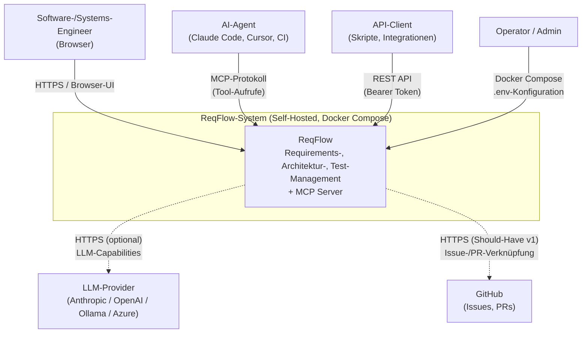
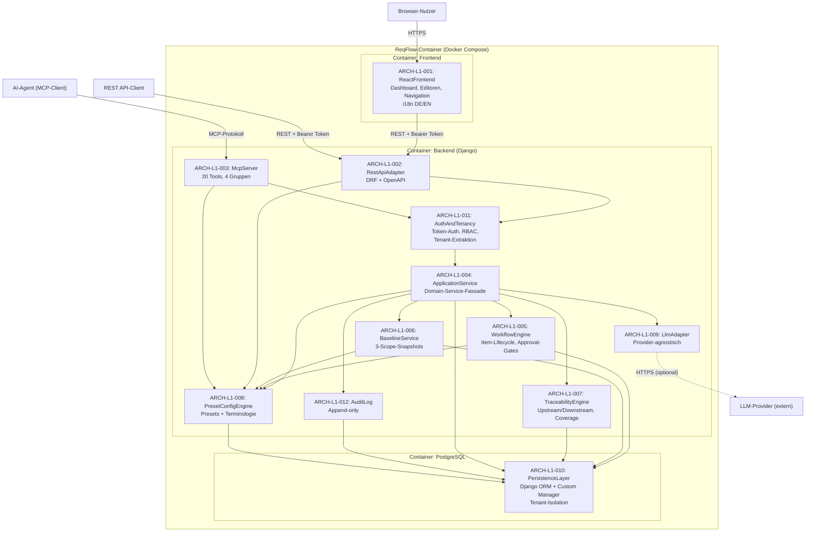
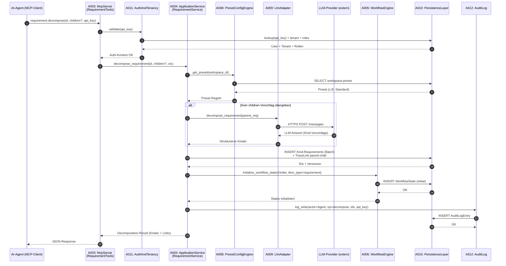
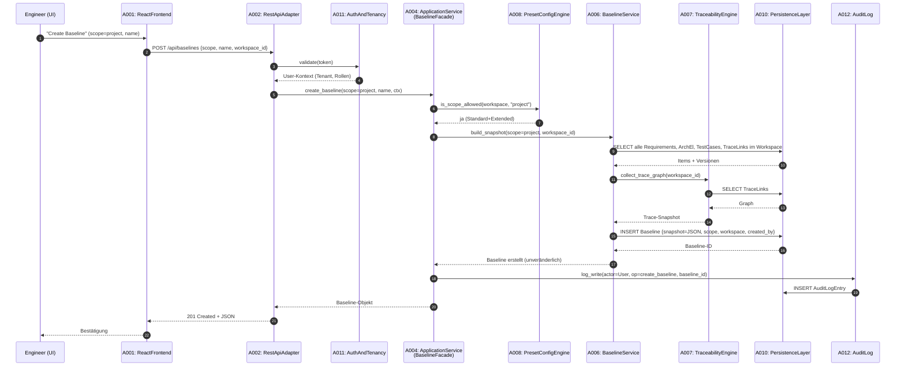

# ReqFlow — L1 Architecture (Gesamtsystem)

> Status: KONSOLIDIERT | Erstellt: 2026-06-17 | Aktualisiert: 2026-06-18 | Autor: se-architect-Agent (SE-Kaskade)
>
> Quelle: `docs/KONZEPT.md` (FINAL, Runden 1–4) + `docs/se/L1/Gesamtsystem/L1_Gesamtsystem_Requirements.md` (REQ-L1-001 … REQ-L1-026, approved)
>
> Notation: Dieses Dokument folgt dem C4-Ansatz auf L1 (Kontext + Container).
> L2-Whitebox-Inhalte sind in den jeweiligen `docs/se/L1/Gesamtsystem/L2/<SystemName>System/L2_<SystemName>System_Architecture.md` ausgelagert.

---

## 1. Überblick

ReqFlow ist ein AI-natives Requirements-Management-System, das zwei gleichrangige primäre Schnittstellen — eine REST API und einen MCP Server — auf ein gemeinsames Domain-Service-Modell auflegt. Die Architektur folgt fünf tragenden Prinzipien:

**Dual-Interface, Single Domain-Core:** REST und MCP sind keine hierarchisch gestapelten Schichten, sondern zwei gleichrangige Adapter, die direkt gegen einen gemeinsamen Application-Service-Layer arbeiten. Das verhindert HTTP-Roundtrips beim MCP-Aufruf, ermöglicht Batch-Operationen wie `requirement.decompose` und garantiert semantische Konsistenz: Was via REST geht, geht auch via MCP — und umgekehrt.

**Provider-Abstraktion für LLMs:** Alle AI-Capabilities (Validierung, Decomposition, optionale Generierung und Konsistenz-Checks) laufen über eine schmale Adapter-Schicht, die das LLM-Detail (OpenAI, Anthropic, Ollama, Azure-OpenAI, …) hinter einer stabilen internen Schnittstelle versteckt. Kein Geschäftsmodul kennt einen konkreten Provider. Deployments ohne LLM-Zugang verlieren AI-Features, aber keine Kernfunktionalität.

**Configurable Rigor als Querschnitts-Konzept:** Die Preset-/Config-Engine ist kein Modul am Rand, sondern ein Querschnitts-Service, der von WorkflowEngine, Baseline-Service, REST/MCP-Adaptern und UI gleichermaßen konsultiert wird. Ein Preset (Minimal / Standard / Extended) entscheidet zur Laufzeit über Pflichtfelder, sichtbare Tools, Baseline-Scope und Workflow-Strenge — ohne Code-Pfad-Verzweigung pro Zielgruppe.

**Tenant-Context-Propagation:** Mandantenfähigkeit ist nicht als separates DB-Schema realisiert, sondern als Row-Level-Isolation über einen `tenant_id`-FK auf jeder Entität. Ein Custom Django Manager und eine Auth-Middleware injizieren den aktiven Tenant in jeden Query — keine Anwendungslogik darf den Filter umgehen. In v1 existiert genau ein Default-Tenant; die v2-Aktivierung von Multi-Tenancy erfordert keine Datenmigration.

**Self-Hosted First:** Docker Compose ist die primäre Deploymentform. Drei Services (Backend, Frontend, PostgreSQL) starten via `docker-compose up`. Keine externen Cloud-Abhängigkeiten zur Laufzeit. Eine LLM-Anbindung ist optional und über Umgebungsvariablen konfigurierbar.

---

## 2. L1-Systemkontext

### 2.1 Externe Akteure und Schnittstellen

ReqFlow ist als geschlossenes System modelliert, das mit folgenden Akteuren interagiert:

| Akteur | Typ | Schnittstelle | Zweck | Bezug REQ-L1 |
|---|---|---|---|---|
| Software-Engineer / Systems-Engineer | Mensch | Browser → React-UI | Manuelles Requirements-Management, Reviews, Approvals | REQ-L1-017 |
| AI-Agent (Claude Code, Cursor, CI-Agent) | Maschine | MCP-Protokoll | Strukturierter Read/Write-Zugriff auf alle Artefakttypen | REQ-L1-005 |
| API-Client (Custom-Integration, Skript) | Maschine | REST API (HTTP/JSON) | Programmatischer Zugriff, CI/CD-Integration | REQ-L1-006 |
| LLM-Provider (Anthropic, OpenAI, Ollama, …) | Externes System | HTTPS-Outbound | Optionale AI-Capabilities (Validierung, Decomposition) | REQ-L1-013 |
| GitHub (v1 Should-Have) | Externes System | HTTPS-Outbound | Verknüpfung Requirements ↔ Issues/PRs | REQ-L1-022 |
| Operator / Admin | Mensch | Docker Compose / .env | Deployment, Konfiguration | REQ-L1-018 |

### 2.2 Systemgrenze

Innerhalb der Systemgrenze: Django-Backend, React-Frontend, PostgreSQL. Außerhalb: Browser, AI-Agent-Runtimes, LLM-Provider, GitHub, Docker-Host.

### 2.3 Kontextdiagramm (Mermaid)

---

## 3. L1-Whitebox (12 Subsysteme / Architektureinheiten)

Die L1-Whitebox zerlegt ReqFlow in zwölf Subsysteme (Architektureinheiten, ARCH-L1-001 … ARCH-L1-012). Jedes Subsystem hat eine klar abgegrenzte Verantwortlichkeit und kommuniziert ausschließlich über definierte Schnittstellen. Jedes ARCH-L1-0xx entspricht einem L2-System (siehe jeweilige L2-Architektur-Dokumente).

### 3.1 Subsysteme und Verantwortlichkeiten

#### ARCH-L1-001 — ReactFrontend (UI-Layer)

**Domain:** software
**Responsibility:** Single-Page-Application in React + TypeScript. Stellt Dashboard, Requirements-Editor, Architecture-Editor, Artefakt-Navigation, Traceability-Anzeige und Workspace-Konfiguration bereit. Liest aktives Terminologie-Profil aus Workspace-Settings und rendert Labels entsprechend. i18n via react-i18next (DE/EN). Kommuniziert ausschließlich über die REST API mit dem Backend.

**Externe Interfaces (eingehend):**
- Browser → HTTPS → Nutzerinteraktion

**Interne Interfaces (ausgehend):**
- ARCH-L1-001 → ARCH-L1-002: REST + Bearer Token (JSON)

**Zugeordnete REQ-L1:** REQ-L1-016 (i18n), REQ-L1-017 (React-UI)
**Mitwirkend bei:** REQ-L1-007 (Preset-Sichtbarkeit), REQ-L1-014 (Terminologie-Profile), REQ-L1-026 (UI-Performance)

→ Siehe `docs/se/L1/Gesamtsystem/L2/ReactFrontendSystem/L2_ReactFrontendSystem_Architecture.md`

---

#### ARCH-L1-002 — RestApiAdapter (REST-Schnittstelle)

**Domain:** software
**Responsibility:** Django REST Framework. Exponiert alle Domain-Operationen als HTTP/JSON-Endpunkte mit Bearer-Token-Authentifizierung. Auto-generierte OpenAPI-Spezifikation (`drf-spectacular` oder vergleichbar). Übersetzt HTTP-Requests in `ApplicationService`-Aufrufe. Keine Geschäftslogik in dieser Schicht — reine Translation und Serialization. Backend-Fehlermeldungen werden über ein zentrales i18n-Modul in DE/EN übersetzt; fehlende Translation-Keys sind Build-Fehler (Lint-Regel).

**Externe Interfaces (eingehend):**
- API-Client → HTTP/JSON + Bearer Token
- ReactFrontend → HTTP/JSON + Bearer Token

**Interne Interfaces (ausgehend):**
- ARCH-L1-002 → ARCH-L1-011: Token-Validierung, Auth-Kontext
- ARCH-L1-002 → ARCH-L1-004: Use-Case-Methoden (In-Process Python)
- ARCH-L1-002 → ARCH-L1-008: Preset-Abfrage (zur Laufzeit-Entscheidung über sichtbare Endpunkte/Felder)

**Zugeordnete REQ-L1:** REQ-L1-006 (REST API + OpenAPI)
**Mitwirkend bei:** REQ-L1-010 (RBAC-Enforcement), REQ-L1-011 (Audit-Log-Auslösung), REQ-L1-016 (i18n Backend-Fehlertexte), REQ-L1-026 (API-Performance)

→ Siehe `docs/se/L1/Gesamtsystem/L2/RestApiAdapterSystem/L2_RestApiAdapterSystem_Architecture.md`

---

#### ARCH-L1-003 — McpServer (MCP-Schnittstelle)

**Domain:** software
**Responsibility:** Nativer MCP-Protokoll-Handler (stdio/sse/HTTP-Transport je nach Client). Implementiert 20 Tools in vier Gruppen (Requirements, Architecture, Tests, Übergreifend). Greift — wie der REST-Adapter — direkt auf `ApplicationService` zu, nicht über die REST API. Schreibende Operationen werden mit Agent-Client-Identität und API-Key im AuditLog erfasst.

**Externe Interfaces (eingehend):**
- AI-Agent → MCP-Protokoll (Tool-Aufrufe)

**Interne Interfaces (ausgehend):**
- ARCH-L1-003 → ARCH-L1-011: API-Key-Validierung, Auth-Kontext
- ARCH-L1-003 → ARCH-L1-004: Use-Case-Methoden (In-Process Python)
- ARCH-L1-003 → ARCH-L1-008: Preset-Abfrage

**Zugeordnete REQ-L1:** REQ-L1-005 (MCP Server)
**Mitwirkend bei:** REQ-L1-010 (RBAC), REQ-L1-011 (MCP-Audit-Trail), REQ-L1-013 (LLM-Capability-Aufrufe via ApplicationService), REQ-L1-020 (artifact.search-Tool)

→ Siehe `docs/se/L1/Gesamtsystem/L2/McpServerSystem/L2_McpServerSystem_Architecture.md`

---

#### ARCH-L1-004 — ApplicationService (Domain-Service-Schicht)

**Domain:** software
**Responsibility:** Fassade zur gesamten Geschäftslogik. Bietet Use-Case-orientierte Operationen (z.B. `create_requirement`, `decompose_requirement`, `create_baseline`, `transition_workflow_state`). Orchestriert die unter ihr liegenden Domain-Komponenten (WorkflowEngine, BaselineService, TraceabilityEngine). Sicherstellt transaktionale Konsistenz. Einziger legitimer Zugriffspunkt für REST- und MCP-Adapter.

**Interne Interfaces (eingehend):**
- ARCH-L1-002 → ARCH-L1-004: REST-Use-Case-Aufrufe
- ARCH-L1-003 → ARCH-L1-004: MCP-Use-Case-Aufrufe

**Interne Interfaces (ausgehend):**
- ARCH-L1-004 → ARCH-L1-005: Workflow-Transitionen
- ARCH-L1-004 → ARCH-L1-006: Baseline-Erstellung / Diff
- ARCH-L1-004 → ARCH-L1-007: Traceability-Queries / Coverage
- ARCH-L1-004 → ARCH-L1-008: Preset-Regeln (Pflichtfelder, Scope-Verfügbarkeit)
- ARCH-L1-004 → ARCH-L1-009: LLM-Capability-Aufrufe (validate, decompose, check_consistency)
- ARCH-L1-004 → ARCH-L1-012: Audit-Log-Schreibung
- ARCH-L1-004 → ARCH-L1-010: Persistenz via Django ORM

**Zugeordnete REQ-L1:** REQ-L1-001 (Artefakt-Hierarchie), REQ-L1-002 (Requirements CRUD), REQ-L1-004 (ArchitectureElement), REQ-L1-012 (Testmanagement), REQ-L1-019 (Export), REQ-L1-020 (Volltextsuche), REQ-L1-021 (CSV-Import), REQ-L1-022 (GitHub-Integration), REQ-L1-023 (PDF-Export), REQ-L1-024 (Webhooks), REQ-L1-025 (ACID)
**Mitwirkend bei:** REQ-L1-003, REQ-L1-005, REQ-L1-006, REQ-L1-007, REQ-L1-008, REQ-L1-009, REQ-L1-010, REQ-L1-011, REQ-L1-013, REQ-L1-015, REQ-L1-026

→ Siehe `docs/se/L1/Gesamtsystem/L2/ApplicationServiceSystem/L2_ApplicationServiceSystem_Architecture.md`

---

#### ARCH-L1-005 — WorkflowEngine (Item-Lifecycle)

**Domain:** software
**Responsibility:** Verwaltet `WorkflowDefinition`s pro Item-Typ und Workspace. Validiert State-Übergänge gegen erlaubte Rollen und `change_reason`-Pflicht. Schreibt jeden Übergang in `WorkflowState.history`. Stellt Default-Workflows für die drei Presets bereit (nicht konfigurierbar im Minimal, vollständig konfigurierbar im Extended).

**Interne Interfaces (eingehend):**
- ARCH-L1-004 → ARCH-L1-005: `transition(item_id, target_state, change_reason, ctx)`
- ARCH-L1-008 → ARCH-L1-005: Preset-Regeln (Workflow-Konfigurierbarkeit)

**Interne Interfaces (ausgehend):**
- ARCH-L1-005 → ARCH-L1-010: Persistenz von WorkflowDefinition, WorkflowState
- ARCH-L1-005 → ARCH-L1-011: Rollen-Prüfung (Approver-Check)

**Zugeordnete REQ-L1:** REQ-L1-009 (Item-Level-Workflow)
**Mitwirkend bei:** REQ-L1-002 (Workflow-Teil), REQ-L1-004, REQ-L1-007, REQ-L1-010, REQ-L1-011, REQ-L1-012, REQ-L1-025

→ Siehe `docs/se/L1/Gesamtsystem/L2/WorkflowEngineSystem/L2_WorkflowEngineSystem_Architecture.md`

---

#### ARCH-L1-006 — BaselineService (Snapshot-Engine)

**Domain:** software
**Responsibility:** Erstellt unveränderliche Baselines auf drei Scopes (`document`, `project`, `global`). Resolviert den Scope, ermittelt alle betroffenen Item-IDs samt Versionen und persistiert atomar als JSON-Snapshot. Stellt Baseline-Vergleichs-Operationen (Diff) bereit. Global-Baselines nur im Extended-Preset (Preset-Konsultation via ARCH-L1-008).

**Interne Interfaces (eingehend):**
- ARCH-L1-004 → ARCH-L1-006: `build(scope, workspace_id, ctx)`, `diff(a, b)`
- ARCH-L1-008 → ARCH-L1-006: Preset-Regeln (Scope-Verfügbarkeit)

**Interne Interfaces (ausgehend):**
- ARCH-L1-006 → ARCH-L1-007: Trace-Graph-Sammlung für Snapshot
- ARCH-L1-006 → ARCH-L1-010: Persistenz von Baseline-Entität

**Zugeordnete REQ-L1:** REQ-L1-008 (Multi-Level-Baselines)
**Mitwirkend bei:** REQ-L1-007, REQ-L1-025

→ Siehe `docs/se/L1/Gesamtsystem/L2/BaselineServiceSystem/L2_BaselineServiceSystem_Architecture.md`

---

#### ARCH-L1-007 — TraceabilityEngine (Verknüpfungs-Logik)

**Domain:** software
**Responsibility:** Verwaltet TraceLinks zwischen Requirements, ArchitectureElements und TestCases mit den Link-Typen `parent-child`, `derives-from`, `satisfies`, `verifies`, `implements`, `refines`. Beantwortet Upstream/Downstream-Queries und Coverage-Reports. Performance-Ziel: < 200 ms für 10.000 Items.

**Interne Interfaces (eingehend):**
- ARCH-L1-004 → ARCH-L1-007: `query(artifact_id, direction)`, `coverage(workspace_id)`
- ARCH-L1-006 → ARCH-L1-007: Trace-Graph für Baseline-Snapshot

**Interne Interfaces (ausgehend):**
- ARCH-L1-007 → ARCH-L1-010: Persistenz von TraceLink-Entität

**Zugeordnete REQ-L1:** REQ-L1-003 (Traceability-Engine)
**Mitwirkend bei:** REQ-L1-001, REQ-L1-004, REQ-L1-008, REQ-L1-012 (Coverage-Tracking), REQ-L1-020, REQ-L1-023, REQ-L1-026

→ Siehe `docs/se/L1/Gesamtsystem/L2/TraceabilityEngineSystem/L2_TraceabilityEngineSystem_Architecture.md`

---

#### ARCH-L1-008 — PresetConfigEngine (Configurable Rigor)

**Domain:** software
**Responsibility:** Verwaltet Workspace-Presets (Minimal / Standard / Extended) und Terminologie-Profile (Dev-Modus / SE-Modus). Liefert zur Laufzeit Entscheidungen über Pflichtfelder, sichtbare Tools, Baseline-Scope-Verfügbarkeit, Workflow-Konfigurierbarkeit und `change_reason`-Pflicht. Wird von WorkflowEngine, BaselineService, ApplicationService, RestApiAdapter und ReactFrontend konsultiert.

**Interne Interfaces (eingehend):**
- ARCH-L1-002 → ARCH-L1-008: `is_feature_enabled(key, workspace_id)`
- ARCH-L1-003 → ARCH-L1-008: `get_preset(workspace_id)`
- ARCH-L1-004 → ARCH-L1-008: `get_preset(workspace_id)`
- ARCH-L1-005 → ARCH-L1-008: Workflow-Konfigurierbarkeit
- ARCH-L1-006 → ARCH-L1-008: Scope-Verfügbarkeit

**Interne Interfaces (ausgehend):**
- ARCH-L1-008 → ARCH-L1-010: Persistenz von Workspace-Settings, Preset-Konfiguration

**Zugeordnete REQ-L1:** REQ-L1-007 (Configurable-Rigor-Presets), REQ-L1-014 (Terminologie-Profile)
**Mitwirkend bei:** REQ-L1-002, REQ-L1-008, REQ-L1-009, REQ-L1-017, REQ-L1-019

→ Siehe `docs/se/L1/Gesamtsystem/L2/PresetConfigEngineSystem/L2_PresetConfigEngineSystem_Architecture.md`

---

#### ARCH-L1-009 — LlmAdapter (Provider-Abstraktion)

**Domain:** software
**Responsibility:** Schmale Schnittstelle zwischen Anwendungslogik und externen LLM-Providern. Stellt drei Operationen bereit: `validate_artifact`, `decompose_requirement`, `check_consistency`. Provider-Implementierungen (Anthropic, OpenAI, Ollama, Azure) sind austauschbar und werden über Deployment-Konfiguration (.env / Workspace-Settings) gewählt. Bei fehlender Konfiguration: graceful Fehler "LLM nicht konfiguriert".

**Externe Interfaces (ausgehend):**
- ARCH-L1-009 → LLM-Provider: HTTPS-Outbound (Provider-spezifisch, hinter `LlmCapabilityInterface` versteckt)

**Interne Interfaces (eingehend):**
- ARCH-L1-004 → ARCH-L1-009: `validate`, `decompose`, `check_consistency`

**Zugeordnete REQ-L1:** REQ-L1-013 (LLM-Capabilities)
**Mitwirkend bei:** REQ-L1-002, REQ-L1-004

→ Siehe `docs/se/L1/Gesamtsystem/L2/LlmAdapterSystem/L2_LlmAdapterSystem_Architecture.md`

---

#### ARCH-L1-010 — PersistenceLayer (Datenhaltung)

**Domain:** software
**Responsibility:** PostgreSQL via Django ORM. Hält alle Entitäten: Tenant, Workspace, Artifact, Requirement, ArchitectureElement, TraceLink, TestCase, Baseline, WorkflowDefinition, WorkflowState, AuditLog, User, Role. Tenant-Isolation wird über einen Custom Django Manager auf allen Entitäten erzwungen — keine Query darf den Filter umgehen. PostgreSQL-Indizes für hierarchische Queries (Recursive CTE), TraceLink-Graph-Queries (GIST/GIN) und Full-Text-Search (tsvector) sind vorgesehen, um die <200ms/<500ms-Ziele zu erreichen.

**Interne Interfaces (eingehend):**
- ARCH-L1-004 → ARCH-L1-010: Django ORM (alle Entitäten)
- ARCH-L1-005 → ARCH-L1-010: WorkflowDefinition, WorkflowState
- ARCH-L1-006 → ARCH-L1-010: Baseline
- ARCH-L1-007 → ARCH-L1-010: TraceLink
- ARCH-L1-008 → ARCH-L1-010: Workspace, Preset-Konfiguration
- ARCH-L1-012 → ARCH-L1-010: AuditLog
- ARCH-L1-011 → ARCH-L1-010: User, Role, Tenant (Auth-Lookup)

**Zugeordnete REQ-L1:** REQ-L1-015 (Multi-Tenancy-Vorbereitung), REQ-L1-025 (ACID), REQ-L1-026 (Performance)
**Mitwirkend bei:** Alle REQ-L1 mit Persistenzbedarf (001–024)

→ Siehe `docs/se/L1/Gesamtsystem/L2/PersistenceLayerSystem/L2_PersistenceLayerSystem_Architecture.md`

---

#### ARCH-L1-011 — AuthAndTenancy (Auth-Middleware)

**Domain:** software
**Responsibility:** Token-basierte Authentifizierung (Bearer Token / API Keys). Vier Rollen (Admin, Editor, Viewer, Approver). Approver-Rolle nur im Extended-Preset aktiv. Extrahiert den aktiven Tenant aus dem Token und propagiert ihn in den Request-Context für `PersistenceLayer.CustomManager`. Erzwingt Berechtigungs-Checks pro Operation und Ressource.

**Externe Interfaces (eingehend):**
- API-Client / ReactFrontend → Bearer Token / API Key
- AI-Agent → API Key

**Interne Interfaces (ausgehend):**
- ARCH-L1-011 → ARCH-L1-010: User, Role, Tenant Lookup
- ARCH-L1-011 → ARCH-L1-004: Auth-Kontext (User, Tenant, Rollen)
- ARCH-L1-011 → ARCH-L1-005: Rollen-Check (Approver-Transition)

**Zugeordnete REQ-L1:** REQ-L1-010 (RBAC), REQ-L1-015 (Tenant-Extraktion)
**Mitwirkend bei:** REQ-L1-002, REQ-L1-005, REQ-L1-006, REQ-L1-009, REQ-L1-011, REQ-L1-012

→ Siehe `docs/se/L1/Gesamtsystem/L2/AuthAndTenancySystem/L2_AuthAndTenancySystem_Architecture.md`

---

#### ARCH-L1-012 — AuditLog (Änderungshistorie)

**Domain:** software
**Responsibility:** Append-only Log aller schreibenden Operationen (REST und MCP). Erfasst Akteur (User oder Agent-Client + API-Key), Operation, Entitäts-ID, Zeitstempel, optional Feld-Diff. Wird von ApplicationService nach jeder schreibenden Operation befüllt. Im Datenmodell als eigene Entität persistiert; in v1 Operation-Level, Feld-Level als v2-Erweiterung möglich.

**Interne Interfaces (eingehend):**
- ARCH-L1-004 → ARCH-L1-012: `log_write(actor, op, entity_id, details)`
- ARCH-L1-002 → ARCH-L1-004 → ARCH-L1-012: REST-Schreiboperationen (indirekt)
- ARCH-L1-003 → ARCH-L1-004 → ARCH-L1-012: MCP-Schreiboperationen (indirekt)

**Interne Interfaces (ausgehend):**
- ARCH-L1-012 → ARCH-L1-010: Persistenz von AuditLogEntry

**Zugeordnete REQ-L1:** REQ-L1-011 (Audit-Trail)
**Mitwirkend bei:** REQ-L1-002, REQ-L1-005, REQ-L1-009, REQ-L1-025

→ Siehe `docs/se/L1/Gesamtsystem/L2/AuditLogSystem/L2_AuditLogSystem_Architecture.md`

---

### 3.2 L1-Komponentendiagramm (Mermaid)

**Lesehinweis:** Durchgezogene Pfeile = synchrone In-Process-Aufrufe / DB-Zugriffe. Gestrichelte Pfeile = optionale externe HTTPS-Calls.

---

## 4. Cross-Cutting-Sequenzen (L1-Verhalten)

Die folgenden Sequenz-Diagramme zeigen die L1-übergreifende Zusammenarbeit zweier kritischer Flows. Die Detail-Sequenzen je System sind in den jeweiligen L2-Architektur-Dokumenten verankert.

### 4.1 MCP-Tool-Aufruf `requirement.decompose`

Dieser Flow demonstriert die Zusammenarbeit von MCP, Auth, ApplicationService, LlmAdapter, WorkflowEngine, PersistenceLayer und AuditLog bei einer LLM-gestützten Schreiboperation eines AI-Agenten.

### 4.2 Baseline-Erstellung (Scope `project`)

---

## 5. Schnittstellen-Übersicht (L1)

Die konsolidierte Schnittstellen-Registry liegt in `docs/se/interface-registry.md`. Hier die L1-relevante Kurzfassung der internen AE-↔-AE-Schnittstellen.

| Schnittstelle | Caller → Callee | Typ | Vertrag (Kurzform) |
|---|---|---|---|
| `RestApiAdapter → ApplicationService` | A002 → A004 | In-Process Python | Use-Case-Methoden, Pydantic-/DRF-Serializer als DTOs |
| `McpServer → ApplicationService` | A003 → A004 | In-Process Python | Identische Use-Case-Methoden wie REST — gemeinsamer Domain-Kontrakt |
| `ApplicationService → WorkflowEngine` | A004 → A005 | In-Process Python | `transition(item_id, target_state, change_reason, ctx)` |
| `ApplicationService → BaselineService` | A004 → A006 | In-Process Python | `build(scope, workspace_id, ctx)`, `diff(a, b)` |
| `ApplicationService → TraceabilityEngine` | A004 → A007 | In-Process Python | `query(artifact_id, direction)`, `coverage(workspace_id)` |
| `ApplicationService → LlmAdapter` | A004 → A009 | In-Process Python | `validate`, `decompose`, `check_consistency` |
| `ApplicationService → AuditLog` | A004 → A012 | In-Process Python | `log_write(actor, op, entity_id, details)` |
| `AuthAndTenancy → ApplicationService` | A011 → A004 | In-Process Python | Auth-Kontext (User, Tenant, Rollen) |
| `AuthAndTenancy → WorkflowEngine` | A011 → A005 | In-Process Python | Rollen-Check (Approver-Transition) |
| `Any → PresetConfigEngine` | * → A008 | In-Process Python | `get_preset(workspace_id)`, `is_feature_enabled(key, workspace_id)` |
| `Any → PersistenceLayer` | * → A010 | Django ORM | Custom Manager erzwingt `tenant_id`-Filter |
| `LlmAdapter → External LLM` | A009 → LLM | HTTPS-Outbound | Provider-spezifisch, hinter `LlmCapabilityInterface` versteckt |

---

## 6. Architektur-Entscheidungen (ADR-Kurzform)

**ADR-01 — MCP Server greift direkt auf ApplicationService zu (nicht über REST)**
*Entscheidung:* McpServer und RestApiAdapter sind zwei gleichrangige Adapter über demselben ApplicationService.
*Rationale:* Vermeidet HTTP-Roundtrip-Overhead bei Batch-Operationen wie `requirement.decompose`, erlaubt MCP-spezifische Audit-Felder (Agent-Client, API-Key) ohne REST-Verunreinigung und garantiert semantische Konsistenz zwischen beiden Schnittstellen. *Verworfene Alternative:* MCP als Wrapper über REST — abgelehnt wegen Latenz und doppelter Auth-Verarbeitung.
*Quelle:* KONZEPT.md 9.3 (Bullet "MCP Server als eigenständige Schnittstelle"), REQ-L1-005, REQ-L1-006.

**ADR-02 — LLM-Provider über schmale Adapter-Schicht abstrahieren**
*Entscheidung:* `LlmAdapter` mit `LlmCapabilityInterface` als einziger Berührungspunkt der Domain mit LLMs.
*Rationale:* Vendor-Lock-in vermeiden, lokale Self-Hosted-Alternativen (Ollama) ermöglichen, graceful Degradation bei fehlender Konfiguration. Pluggable Capabilities sind die AI-native Dimension 1. *Verworfene Alternative:* Direkter Anthropic-SDK-Aufruf in `RequirementService` — abgelehnt wegen harter Kopplung und fehlender Self-Host-Tauglichkeit.
*Quelle:* KONZEPT.md 1 (Dimension 1), 9.3, REQ-L1-013.

**ADR-03 — Tenant-Isolation via Row-Level + Custom Django Manager (kein Schema-per-Tenant)**
*Entscheidung:* Alle Entitäten tragen `tenant_id`-FK; ein Custom Manager filtert automatisch.
*Rationale:* Schema-per-Tenant (django-tenants) erzeugt erheblichen Migration- und Backup-Overhead, der für Open-Source/Self-Hosted-Fokus unangemessen ist. Row-Level skaliert für v2-SaaS bis in den niedrigen vierstelligen Tenant-Bereich problemlos. *Verworfene Alternative:* Schema-per-Tenant — abgelehnt wegen Overhead.
*Quelle:* KONZEPT.md 5.4, 9.3, REQ-L1-015.

**ADR-04 — Configurable Rigor als Querschnitts-Service (PresetConfigEngine)**
*Entscheidung:* Preset-Regeln zentralisiert in A008, konsultiert von WorkflowEngine, BaselineService, REST-Adapter, MCP und UI.
*Rationale:* Vermeidet duplizierte Preset-Checks im Code und garantiert konsistentes Verhalten über alle Schnittstellen. Single Source of Truth für Pflichtfelder, Tool-Sichtbarkeit, Scope-Verfügbarkeit. *Verworfene Alternative:* Preset-Checks pro Modul — abgelehnt wegen Duplizierung und Drift-Risiko.
*Quelle:* KONZEPT.md 2, 7, REQ-L1-007.

**ADR-05 — Generisches Artefakt-Datenmodell + Terminologie-Profile (statt Zielgruppen-Code-Pfade)**
*Entscheidung:* Ein einheitliches Datenmodell für beide Zielgruppen; Terminologie nur in der UI-Label-Schicht.
*Rationale:* Zielgruppen-spezifische Code-Pfade würden den Maintenance-Aufwand verdoppeln und die MCP-Semantik gefährden. Profilwechsel ist datenlos (nur Labels). *Verworfene Alternative:* Separate Entitäten für Dev-Modus vs. SE-Modus — abgelehnt wegen Datenmodell-Duplizierung.
*Quelle:* KONZEPT.md 3.2, 3.3, REQ-L1-014.

**ADR-06 — Item-Lifecycle als konfigurierbare WorkflowEngine (statt hartcodiertem Status-Enum)**
*Entscheidung:* `WorkflowDefinition` + `WorkflowState` ersetzen den bisherigen `status`-Enum.
*Rationale:* Domain-spezifische Workflows (Compliance, Approval-Gates, rollengebunden) ohne Code-Änderung. Default-Workflow ist Enum-kompatibel — API-Backward-Compatibility bleibt erhalten. *Verworfene Alternative:* Hartcodierter Status-Enum — abgelehnt wegen Inflexibilität für SE-Zielgruppe.
*Quelle:* KONZEPT.md 7a, REQ-L1-009.

**ADR-07 — Baselines auf drei Scopes (Dokument / Projekt / Global)**
*Entscheidung:* Eine Baseline-Entität mit `scope`-Enum-Feld; Snapshot-Inhalt scope-spezifisch.
*Rationale:* Drei Granularitäten decken alle realen Übergabe-Szenarien ab. Eine einzige Entität vermeidet Duplizierung; `scope` ist das einzige unterscheidende Feld. *Verworfene Alternative:* Drei separate Entitäten — abgelehnt wegen Schema-Duplizierung.
*Quelle:* KONZEPT.md 5.2 (Baseline), REQ-L1-008.

**ADR-08 — Self-Hosted via Docker Compose (kein Kubernetes in v1)**
*Entscheidung:* Drei Services (Backend, Frontend, PostgreSQL) in einer `docker-compose.yml`.
*Rationale:* Zielgruppe ist Developer-affin; Docker Compose ist niedrige Einstiegshürde und Standard für Self-Hosted-Tools. Kubernetes wäre Overkill für v1-Footprint. *Verworfene Alternative:* Helm-Chart in v1 — verschoben auf v2.
*Quelle:* KONZEPT.md 9.1, 9.3, REQ-L1-018.

**ADR-09 — Volltextsuche via PostgreSQL Full-Text (keine separate Search-Engine in v1)**
*Entscheidung:* `tsvector`-basierte Suche über Requirements + ArchitectureElements + TestCases.
*Rationale:* Erfüllt die < 500 ms-Anforderung für 10.000 Items ohne zusätzlichen Service. Elasticsearch / OpenSearch wäre Infrastruktur-Overkill. Semantische Suche via Vektor-DB ist explizit v2. *Verworfene Alternative:* Elasticsearch — abgelehnt wegen Self-Hosted-Footprint.
*Quelle:* KONZEPT.md 10.2 (Tabelle Vektor-DB → v2), REQ-L1-020.

**ADR-10 — AuditLog Operation-Level in v1, Feld-Level v2**
*Entscheidung:* AuditLog erfasst Operation + Akteur + Entitäts-ID + Zeitstempel. Feld-Diffs sind v2.
*Rationale:* Operation-Level erfüllt die Audit-Anforderungen von v1 (audit-ready, nicht zertifiziert). Feld-Level erfordert Diff-Berechnung und größeren Storage-Footprint — sinnvoll bei IEC-61508-Erweiterung (v2). *Verworfene Alternative:* Sofort Feld-Level — abgelehnt wegen Aufwand-Nutzen-Verhältnis in v1.
*Quelle:* KONZEPT.md 11.2 (Bullet "Audit-Log-Granularität"), REQ-L1-011.

---

## 7. Traceability (L1)

### 7.1 ARCH-L1 → REQ-L1 Zuordnung

Die folgende Matrix ordnet jedem Architekturelement (Subsystem) die REQ-L1 zu, für die es primär oder mitwirkend verantwortlich ist.

| ARCH-L1 | Name | Primäre REQ-L1 | Mitwirkende REQ-L1 |
|---|---|---|---|
| ARCH-L1-001 | ReactFrontend | REQ-L1-016, REQ-L1-017 | REQ-L1-007, REQ-L1-014, REQ-L1-026 |
| ARCH-L1-002 | RestApiAdapter | REQ-L1-006 | REQ-L1-010, REQ-L1-011, REQ-L1-016, REQ-L1-026 |
| ARCH-L1-003 | McpServer | REQ-L1-005 | REQ-L1-010, REQ-L1-011, REQ-L1-013, REQ-L1-020 |
| ARCH-L1-004 | ApplicationService | REQ-L1-001, REQ-L1-002, REQ-L1-004, REQ-L1-012, REQ-L1-019, REQ-L1-020, REQ-L1-021, REQ-L1-022, REQ-L1-023, REQ-L1-024, REQ-L1-025 | REQ-L1-003, REQ-L1-005, REQ-L1-006, REQ-L1-007, REQ-L1-008, REQ-L1-009, REQ-L1-010, REQ-L1-011, REQ-L1-013, REQ-L1-015, REQ-L1-026 |
| ARCH-L1-005 | WorkflowEngine | REQ-L1-009 | REQ-L1-002, REQ-L1-004, REQ-L1-007, REQ-L1-010, REQ-L1-011, REQ-L1-012, REQ-L1-025 |
| ARCH-L1-006 | BaselineService | REQ-L1-008 | REQ-L1-007, REQ-L1-025 |
| ARCH-L1-007 | TraceabilityEngine | REQ-L1-003 | REQ-L1-001, REQ-L1-004, REQ-L1-008, REQ-L1-012, REQ-L1-020, REQ-L1-023, REQ-L1-026 |
| ARCH-L1-008 | PresetConfigEngine | REQ-L1-007, REQ-L1-014 | REQ-L1-002, REQ-L1-008, REQ-L1-009, REQ-L1-017, REQ-L1-019 |
| ARCH-L1-009 | LlmAdapter | REQ-L1-013 | REQ-L1-002, REQ-L1-004 |
| ARCH-L1-010 | PersistenceLayer | REQ-L1-015, REQ-L1-025, REQ-L1-026 | REQ-L1-001–REQ-L1-024 (alle mit Persistenzbedarf) |
| ARCH-L1-011 | AuthAndTenancy | REQ-L1-010, REQ-L1-015 | REQ-L1-002, REQ-L1-005, REQ-L1-006, REQ-L1-009, REQ-L1-011, REQ-L1-012 |
| ARCH-L1-012 | AuditLog | REQ-L1-011 | REQ-L1-002, REQ-L1-005, REQ-L1-009, REQ-L1-025 |

### 7.2 REQ-L1 → ARCH-L1 (Umkehransicht)

| REQ-L1 | Titel | Primär erfüllt durch | Mitwirkende ARCH-L1 |
|---|---|---|---|
| REQ-L1-001 | Artefakt-Hierarchie | A004 | A007, A010 |
| REQ-L1-002 | Requirements CRUD + Workflow | A004 | A005, A010, A011, A012 |
| REQ-L1-003 | Traceability-Engine | A007 | A004, A010 |
| REQ-L1-004 | ArchitectureElement | A004 | A005, A007, A010, A011 |
| REQ-L1-005 | MCP Server | A003 | A004, A011, A012 |
| REQ-L1-006 | REST API + OpenAPI | A002 | A004, A011 |
| REQ-L1-007 | Configurable-Rigor-Presets | A008 | A001, A002, A003, A004, A005, A006 |
| REQ-L1-008 | Multi-Level-Baselines | A006 | A004, A007, A008, A010 |
| REQ-L1-009 | Item-Level-Workflow | A005 | A004, A008, A010, A012 |
| REQ-L1-010 | RBAC | A011 | A005 (Approver-Check), A010 |
| REQ-L1-011 | Audit-Trail | A012 | A002, A003, A004, A010 |
| REQ-L1-012 | Testmanagement + Coverage | A004 | A007, A010, A011 |
| REQ-L1-013 | LLM-Capabilities | A009 | A004, A012 |
| REQ-L1-014 | Terminologie-Profile | A008 | A001, A010 |
| REQ-L1-015 | Multi-Tenancy-Vorbereitung | A010, A011 | Alle |
| REQ-L1-016 | i18n DE/EN | A001 | A002 |
| REQ-L1-017 | React-UI | A001 | A002 |
| REQ-L1-018 | Docker Compose | A001, A002, A003, A010 | — |
| REQ-L1-019 | Export JSON/CSV | A004 | A008, A010 |
| REQ-L1-020 | Volltextsuche | A004 | A003, A010 |
| REQ-L1-021 | CSV-Bulk-Import | A004 | A010 |
| REQ-L1-022 | GitHub-Integration | A004 | — |
| REQ-L1-023 | PDF-Report-Export | A004 | A007 |
| REQ-L1-024 | Webhook-Support | A004 | — |
| REQ-L1-025 | Transaktionale Konsistenz (ACID) | A010 | A004 |
| REQ-L1-026 | Performance | A010 | A001, A002, A003, A004 |

### 7.3 Decomposition-Completeness — Begründung

Die zwölf L1-Subsysteme decken alle 26 REQ-L1 vollständig ab. Jede REQ-L1 hat eine primär verantwortliche Architektureinheit und identifizierte Mitwirkende. Keine REQ-L1 ist ohne Owner. Keine Architektureinheit existiert ohne REQ-L1-Begründung. Die Querschnitts-Subsysteme (`AuthAndTenancy`, `PresetConfigEngine`, `AuditLog`, `PersistenceLayer`) sind durch mehrere REQ-L1 motiviert — das ist gewollt und reflektiert die tatsächliche Cross-Cutting-Natur dieser Anliegen.

Offene Punkte aus L1_Gesamtsystem_Requirements.md (OP-01 LLM-Capability-Scope, OP-02 Preset-Downgrade-Semantik, OP-03 Workflow-Wechsel-Semantik) sind in der Architektur durch dedizierte Subsysteme/Sub-Komponenten adressierbar:

- OP-01: `LlmAdapter.CapabilityRegistry` erlaubt selektive Aktivierung — operative v1-Auswahl ist Config-Entscheidung, keine Architektur-Änderung.
- OP-02: `PresetConfigEngine` benötigt eine `downgrade_policy`-Konfiguration (v1-Empfehlung: Block-Downgrade solange inkompatible Items existieren).
- OP-03: `WorkflowEngine.WorkflowMigrationHandler` ist explizit als Sub-Komponente vorgesehen; v1-Default: Block-Wechsel solange Items im verwaisten State sind.

---

---

## 8. L2-Cascade Status

> **Status:** ABGESCHLOSSEN | Datum: 2026-06-20
>
> Alle 12 Subsysteme haben vollständige L2-Architekturen und L2-Anforderungen.
> Termination-Entscheidung: Alle 12 Systeme sind **LEAF** (keine L3-Zerlegung).

| System | Komponenten | REQ-L2 | Status |
|--------|------------|--------|--------|
| ApplicationServiceSystem | 12 | 25 | LEAF |
| WorkflowEngineSystem | 3 | 8 | LEAF |
| McpServerSystem | 6 | 12 | LEAF |
| TraceabilityEngineSystem | 3 | 12 | LEAF |
| LlmAdapterSystem | 4 | 7 | LEAF |
| RestApiAdapterSystem | 5 | 12 | LEAF |
| BaselineServiceSystem | 3 | 8 | LEAF |
| ReactFrontendSystem | 6 | 12 | LEAF |
| AuthAndTenancySystem | 3 | 10 | LEAF |
| PresetConfigEngineSystem | 3 | 14 | LEAF |
| AuditLogSystem | 2 | 7 | LEAF |
| PersistenceLayerSystem | 5 | 9 | LEAF |

**Kennzahlen L2-Gesamt:**

| Metrik | Wert |
|--------|------|
| REQ-L2 gesamt | 136 |
| Components gesamt | 55 |
| Interne Schnittstellen | 95 |
| Test Cases (AC) | 459+ |

Nächster Schritt: Implementierung durch developer-Agenten.

---

*Erstellt durch se-architect-Agent | ReqFlow SE-Kaskade | 2026-06-18*
*Aktualisiert: ARCH-L1-001..012 zugewiesen, REQ-L1-001..026 vollständig abgedeckt*
*Aktualisiert 2026-06-20: L2-Cascade abgeschlossen, alle 12 Systeme LEAF*
*Nächste Ebene: Siehe `docs/se/L1/Gesamtsystem/L2/<SystemName>System/L2_<SystemName>System_Architecture.md` (12 Systeme ARCH-L1-001 … ARCH-L1-012)*
