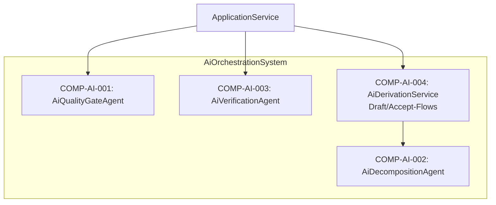

# L2 AiOrchestration Architecture

> **Level:** L2 (Subsystem white-box)
> **System:** AiOrchestrationSystem (ARCH-L1-017)
> **Parent:** L1_Gesamtsystem_Architecture.md
> **Datum:** 2026-07-12
> **Status:** entworfen
> **Designation:** subsystem (white-box)

---

## 1. Verantwortlichkeit

Das AiOrchestrationSystem koordiniert spezialisierte KI-Agenten und Workflows innerhalb der Plattform. Es abstrahiert die asynchrone und komplexe Ausführung von KI-Aufgaben (z.B. Quality Gates, automatische Dekomposition, Test-Mock-Generierung) vom restlichen System und wickelt die Orchestrierung ab, bevor es strukturierte Ergebnisse über den ApplicationService integriert.

---

## 2. White-Box (Komponenten-Zerlegung)

### Komponenten

| Komp-ID | Name | Verantwortlichkeit | Domain |
|---------|------|--------------------|--------|
| COMP-AI-001 | AiQualityGateAgent | Validiert Anforderungen und Statusübergänge automatisch gegen INCOSE-Regeln. | software |
| COMP-AI-002 | AiDecompositionAgent | Generiert SystemRequirement-Entwürfe und Fibonacci-Schätzungen. | software |
| COMP-AI-003 | AiVerificationAgent | Generiert automatische Testfälle aus Requirements. | software |
| COMP-AI-004 | AiDerivationService | Implementiert die Draft/Accept-Infrastruktur für KI-Flows (Need → SysReq, SysReq → Arch, SysReq → SysReq Level n+1). Erzeugt Entwürfe (Drafts) und speichert diese erst nach expliziter Nutzer-Freigabe. | software |

### Interne Schnittstellen

| ID | Richtung | Quelle -> Ziel | Typ | Vertrag |
|----|----------|----------------|-----|---------|
| IF-AI-INT-001 | intern | COMP-AI-004 -> COMP-AI-002 | In-Process Python | `trigger_decomposition(flow_type, item_id)` |

### Komponentendiagramm (Mermaid)

---

## 3. Zugeordnete REQ-L2

| REQ-L2 | Komponente(n) |
|--------|---------------|
| REQ-L2-AI-001 | COMP-AI-004 |
| REQ-L2-AI-002 | COMP-AI-004 |
| REQ-L2-AI-003 | COMP-AI-001 |
| REQ-L2-AI-004 | COMP-AI-001 |
| REQ-L2-AI-005 | COMP-AI-002, COMP-AI-003 |
| REQ-L2-AI-006 | COMP-AI-001, COMP-AI-002, COMP-AI-003, COMP-AI-004 |
| REQ-L2-AI-007 | COMP-AI-004 |
| REQ-L2-AI-008 | COMP-AI-004 |

---

*Erstellt durch se-architect-Agent | ReqFlow SE-Kaskade Phase 3 | 2026-07-12*
