# L2 ApplicationService Architecture

> **Level:** L2 (Subsystem white-box)
> **System:** ApplicationServiceSystem (ARCH-L1-004)
> **Parent:** L1_Gesamtsystem_Architecture.md
> **Datum:** 2026-06-20
> **Status:** entworfen

---

## 1. Verantwortlichkeit

Zentrale Domain-Service-Fassade fuer alle Use-Cases. Orchestriert die untergeordneten Domain-Services (WorkflowEngine, BaselineService, TraceabilityEngine, LlmAdapter). Stellt transaktionale Konsistenz sicher. Einziger legitimer Zugriffspunkt fuer REST- und MCP-Adapter.

---

## 2. Black-Box (Eingebettete Sicht)

### Externe Schnittstellen

| ID | Richtung | Gegenstelle | Typ | Vertrag |
|----|----------|-------------|-----|---------|
| IF-AS-EXT-IN-001 | eingehend | RestApiAdapter | In-Process Python | Use-Case-Methoden (Pydantic/DRF-Serializer als DTOs) |
| IF-AS-EXT-IN-002 | eingehend | McpServer | In-Process Python | Use-Case-Methoden (identischer Domain-Kontrakt wie REST) |
| IF-AS-EXT-IN-003 | eingehend | AuthAndTenancy | In-Process Python | Auth-Kontext (User, Tenant, Rollen) pro Operation |
| IF-AS-EXT-OUT-001 | ausgehend | WorkflowEngine | In-Process Python | `transition(item_id, target_state, change_reason, ctx)` |
| IF-AS-EXT-OUT-002 | ausgehend | BaselineService | In-Process Python | `build(scope, workspace_id, ctx)`, `diff(a, b)` |
| IF-AS-EXT-OUT-003 | ausgehend | TraceabilityEngine | In-Process Python | `query(artifact_id, direction)`, `coverage(workspace_id)` |
| IF-AS-EXT-OUT-004 | ausgehend | PresetConfigEngine | In-Process Python | `get_preset(workspace_id)`, `is_feature_enabled(key, workspace_id)` |
| IF-AS-EXT-OUT-005 | ausgehend | LlmAdapter | In-Process Python | `validate`, `decompose`, `check_consistency` |
| IF-AS-EXT-OUT-006 | ausgehend | AuditLog | Async Event (via COMP-AS-016) | `AuditEvent`-Domain-Event wird von COMP-AS-016 an AuditLog-Subscriber zugestellt; kein synchroner Direktaufruf mehr |
| IF-AS-EXT-OUT-007 | ausgehend | PersistenceLayer | Django ORM | Alle Entitaeten, Custom Manager mit Tenant-Isolation |

---

## 3. White-Box (Komponenten-Zerlegung)

### Komponenten

| Komp-ID | Name | Verantwortlichkeit | Domain |
|---------|------|--------------------|--------|
| COMP-AS-001 | ArtifactService | Artifact-Hierarchie-CRUD, Zyklus-Pruefung, Tree-Queries via PostgreSQL Recursive CTE; dynamische Custom-Attribute (JSONB, GIN-Index) mit Typschema-Validierung | software |
| COMP-AS-002 | RequirementService | Requirement-CRUD, Decomposition-Orchestrierung, LLM-Validation, GitHub-Integration | software |
| COMP-AS-003 | ArchitectureService | ArchitectureElement-CRUD, automatische Versions-Inkrementierung (Optimistic Locking) | software |
| COMP-AS-004 | TestService | TestCase-CRUD, Test-Execution-Status-Management, Coverage-Berechnung | software |
| COMP-AS-005 | TraceLinkService | TraceLink-CRUD, Quell/Ziel-Validierung, Link-Typ-Validierung, AuditLog-Ausloesung | software |
| COMP-AS-006 | BaselineFacade | Baseline-Lifecycle-Orchestrierung: Preset-Check -> Snapshot-Delegation -> AuditLog; Diff-Operationen | software |
| COMP-AS-007 | WorkflowFacade | Workflow-State-Transition-Orchestrierung: Validierungs-Delegation an WorkflowEngine, AuditLog-Ausloesung | software |
| COMP-AS-008 | ExportService | JSON-/CSV-Export fuer alle Entitaeten inkl. aktivem Terminologie-Profil als Metadatum; PDF-Report-Export | software |
| COMP-AS-009 | ImportService | CSV-Bulk-Import fuer Requirements, ArchitectureElements und TestCases mit atomarer Transaktionssemantik | software |
| COMP-AS-010 | SearchService | Volltextsuche ueber Requirements + ArchitectureElements + TestCases (PostgreSQL Full-Text Search) mit Type-/Workspace-Filter | software |
| COMP-AS-011 | WebhookDispatcher | Asynchroner Webhook-Dispatch fuer konfigurierbare Event-Typen mit Retry-Logik (exponentieller Backoff); Event-Subscriber am DomainEventBus | software |
| COMP-AS-012 | PresetPolicyService | Preset-Regel-Validierung (Scope-Erlaubnis, change_reason-Pflicht, Downgrade-Inkompatibilitaets-Check) | software |
| COMP-AS-013 | AdrService | ADR-CRUD, Orchestrierung von WorkflowEngine, TraceabilityEngine, PersistenceLayer und EventBus | software |
| COMP-AS-014 | RiskService | Risk-CRUD, Orchestrierung von WorkflowEngine, TraceabilityEngine, PersistenceLayer und EventBus | software |
| COMP-AS-015 | IssueService | Issue-CRUD, Orchestrierung von WorkflowEngine, TraceabilityEngine, PersistenceLayer und EventBus | software |
| COMP-AS-016 | DomainEventBus | Publiziert Domain-Events nach Mutation im post_commit-Hook; speichert Events im Transactional-Outbox-Store (DB-Tabelle); stellt Events asynchron an registrierte Subscriber zu (AuditLogWriter, SeMetrics, WebhookDispatcher) via Django-Q- oder Celery-Worker | software |

### Interne Schnittstellen

| ID | Richtung | Quelle -> Ziel | Typ | Vertrag |
|----|----------|----------------|-----|---------|
| IF-AS-INT-001 | intern | COMP-AS-001 -> COMP-AS-005 | In-Process Python | `cascade_delete_trace_links(artifact_id)` |
| IF-AS-INT-002 | intern | COMP-AS-002, COMP-AS-013, COMP-AS-014, COMP-AS-015 -> COMP-AS-005 | In-Process Python | `create_trace_link(source_id, target_id, link_type)` |
| IF-AS-INT-003 | intern | COMP-AS-002, COMP-AS-013, COMP-AS-014, COMP-AS-015 -> COMP-AS-007 | In-Process Python | `transition(item_id, target_state, change_reason, ctx)` |
| IF-AS-INT-004 | intern | COMP-AS-003 -> COMP-AS-005 | In-Process Python | `cascade_delete_trace_links(architecture_element_id)` |
| IF-AS-INT-005 | intern | COMP-AS-004 -> COMP-AS-005 | In-Process Python | `cascade_delete_trace_links(test_case_id)` |
| IF-AS-INT-006 | intern | COMP-AS-006 -> COMP-AS-012 | In-Process Python | `is_scope_allowed(workspace_id, scope)` |
| IF-AS-INT-007 | intern | COMP-AS-007 -> COMP-AS-012 | In-Process Python | `validate_transition_roles(ctx, target_state)` |
| IF-AS-INT-008 | intern | COMP-AS-002, COMP-AS-013, COMP-AS-014, COMP-AS-015 -> COMP-AS-012 | In-Process Python | `is_change_reason_required(workspace_id)` |
| IF-AS-INT-009 | intern | COMP-AS-002 -> COMP-AS-016 | Domain-Event (Outbox) | `RequirementCreated / RequirementUpdated / RequirementDeleted` — nach Commit via post_commit-Hook publiziert |
| IF-AS-INT-010 | intern | COMP-AS-003 -> COMP-AS-016 | Domain-Event (Outbox) | `ArchitectureElementCreated / Updated / Deleted` — nach Commit publiziert |
| IF-AS-INT-011 | intern | COMP-AS-004 -> COMP-AS-016 | Domain-Event (Outbox) | `TestCaseCreated / Updated / Deleted` — nach Commit publiziert |
| IF-AS-INT-012 | intern | COMP-AS-006 -> COMP-AS-016 | Domain-Event (Outbox) | `BaselineCreated` — nach Commit publiziert |
| IF-AS-INT-013 | intern | COMP-AS-016 -> COMP-AS-011 | Async Worker Call | Subscriber-Dispatch: DomainEventBus stellt gefilterte WebhookEvents an WebhookDispatcher zu |
| IF-AS-INT-014 | intern | COMP-AS-016 -> extern AuditLog | Async Worker Call | Subscriber-Dispatch: DomainEventBus stellt AuditEvent an AuditLog-Writer zu (ersetzt IF-AS-EXT-OUT-006 synchronen Direktaufruf) |
| IF-AS-INT-015 | intern | COMP-AS-013 -> COMP-AS-016 | Domain-Event (Outbox) | `AdrCreated / Updated / Deleted` — nach Commit publiziert |
| IF-AS-INT-016 | intern | COMP-AS-014 -> COMP-AS-016 | Domain-Event (Outbox) | `RiskCreated / Updated / Deleted` — nach Commit publiziert |
| IF-AS-INT-017 | intern | COMP-AS-015 -> COMP-AS-016 | Domain-Event (Outbox) | `IssueCreated / Updated / Deleted` — nach Commit publiziert |

### Komponentendiagramm (Mermaid)

```mermaid
flowchart TD
    subgraph ApplicationServiceSystem
        C001["COMP-AS-001: ArtifactService<br/>Hierarchie + Zyklus-Check"]
        C002["COMP-AS-002: RequirementService<br/>CRUD + Decomposition"]
        C003["COMP-AS-003: ArchitectureService<br/>ArchEl-CRUD + Versioning"]
        C004["COMP-AS-004: TestService<br/>TestCase-CRUD + Coverage"]
        C005["COMP-AS-005: TraceLinkService<br/>Link-CRUD + Validierung"]
        C006["COMP-AS-006: BaselineFacade<br/>Baseline-Lifecycle"]
        C007["COMP-AS-007: WorkflowFacade<br/>Transition-Orchestrierung"]
        C008["COMP-AS-008: ExportService<br/>JSON/CSV/PDF Export"]
        C009["COMP-AS-009: ImportService<br/>CSV Bulk Import"]
        C010["COMP-AS-010: SearchService<br/>Full-Text Search"]
        C011["COMP-AS-011: WebhookDispatcher<br/>Async Event-Dispatch"]
        C012["COMP-AS-012: PresetPolicyService<br/>Preset-Regel-Enforcement"]
        C013["COMP-AS-013: AdrService<br/>ADR-CRUD + Orchestrierung"]
        C014["COMP-AS-014: RiskService<br/>Risk-CRUD + Orchestrierung"]
        C015["COMP-AS-015: IssueService<br/>Issue-CRUD + Orchestrierung"]
        C016["COMP-AS-016: DomainEventBus<br/>Transactional Outbox + Subscriber-Dispatch"]
    end

    ext_in1["RestApiAdapter"] -->|IF-AS-EXT-IN-001| C002
    ext_in1 -->|IF-AS-EXT-IN-001| C013
    ext_in1 -->|IF-AS-EXT-IN-001| C014
    ext_in1 -->|IF-AS-EXT-IN-001| C015
    ext_in2["McpServer"] -->|IF-AS-EXT-IN-002| C002
    ext_in2 -->|IF-AS-EXT-IN-002| C013
    ext_in2 -->|IF-AS-EXT-IN-002| C014
    ext_in2 -->|IF-AS-EXT-IN-002| C015
    ext_in3["AuthAndTenancy"] -->|IF-AS-EXT-IN-003| C002
    ext_in3 -->|IF-AS-EXT-IN-003| C013
    ext_in3 -->|IF-AS-EXT-IN-003| C014
    ext_in3 -->|IF-AS-EXT-IN-003| C015

    C001 -->|IF-AS-INT-001| C005
    C002 -->|IF-AS-INT-002| C005
    C013 -->|IF-AS-INT-002| C005
    C014 -->|IF-AS-INT-002| C005
    C015 -->|IF-AS-INT-002| C005
    C002 -->|IF-AS-INT-003| C007
    C013 -->|IF-AS-INT-003| C007
    C014 -->|IF-AS-INT-003| C007
    C015 -->|IF-AS-INT-003| C007
    C003 -->|IF-AS-INT-004| C005
    C004 -->|IF-AS-INT-005| C005
    C006 -->|IF-AS-INT-006| C012
    C007 -->|IF-AS-INT-007| C012
    C002 -->|IF-AS-INT-008| C012
    C013 -->|IF-AS-INT-008| C012
    C014 -->|IF-AS-INT-008| C012
    C015 -->|IF-AS-INT-008| C012

    C002 -.->|IF-AS-INT-009| C016
    C003 -.->|IF-AS-INT-010| C016
    C004 -.->|IF-AS-INT-011| C016
    C006 -.->|IF-AS-INT-012| C016
    C013 -.->|IF-AS-INT-015| C016
    C014 -.->|IF-AS-INT-016| C016
    C015 -.->|IF-AS-INT-017| C016
    C016 -.->|IF-AS-INT-013| C011
    C016 -.->|IF-AS-INT-014| ext_audit

    C002 -->|IF-AS-EXT-OUT-005| ext_llm["LlmAdapter"]
    C005 -->|IF-AS-EXT-OUT-003| ext_trace["TraceabilityEngine"]
    C006 -->|IF-AS-EXT-OUT-002| ext_bl["BaselineService"]
    C007 -->|IF-AS-EXT-OUT-001| ext_wf["WorkflowEngine"]
    C012 -->|IF-AS-EXT-OUT-004| ext_pc["PresetConfigEngine"]

    C001 -->|IF-AS-EXT-OUT-007| ext_db["PersistenceLayer"]
    C002 -->|IF-AS-EXT-OUT-007| ext_db
    C003 -->|IF-AS-EXT-OUT-007| ext_db
    C004 -->|IF-AS-EXT-OUT-007| ext_db
    C005 -->|IF-AS-EXT-OUT-007| ext_db
    C006 -->|IF-AS-EXT-OUT-007| ext_db
    C007 -->|IF-AS-EXT-OUT-007| ext_db
    C008 -->|IF-AS-EXT-OUT-007| ext_db
    C009 -->|IF-AS-EXT-OUT-007| ext_db
    C010 -->|IF-AS-EXT-OUT-007| ext_db
    C013 -->|IF-AS-EXT-OUT-007| ext_db
    C014 -->|IF-AS-EXT-OUT-007| ext_db
    C015 -->|IF-AS-EXT-OUT-007| ext_db

    ext_audit["AuditLog"]

    C011 -.->|HTTPS POST| ext_wh["Externe Webhook-URLs"]
```

**Legende:** Durchgezogene Pfeile = synchrone In-Process-Aufrufe. Gestrichelte Pfeile = asynchrone / event-basierte Aufrufe.

---

## 4. Zugeordnete REQ-L2

| REQ-L2 | Komponente |
|--------|-----------|
| REQ-L2-AS-001 | COMP-AS-001 |
| REQ-L2-AS-002 | COMP-AS-001 |
| REQ-L2-AS-003 | COMP-AS-002 |
| REQ-L2-AS-004 | COMP-AS-003 |
| REQ-L2-AS-005 | COMP-AS-004 |
| REQ-L2-AS-006 | COMP-AS-008 |
| REQ-L2-AS-007 | COMP-AS-008 |
| REQ-L2-AS-008 | COMP-AS-010 |
| REQ-L2-AS-009 | COMP-AS-010 |
| REQ-L2-AS-010 | COMP-AS-005 |
| REQ-L2-AS-011 | COMP-AS-006 |
| REQ-L2-AS-012 | COMP-AS-007 |
| REQ-L2-AS-013 | COMP-AS-002 |
| REQ-L2-AS-014 | COMP-AS-009 |
| REQ-L2-AS-015 | COMP-AS-002 |
| REQ-L2-AS-016 | COMP-AS-008 |
| REQ-L2-AS-017 | COMP-AS-011 |
| REQ-L2-AS-018 | Alle Write-Komponenten |
| REQ-L2-AS-019 | Alle Write-Komponenten |
| REQ-L2-AS-020 | COMP-AS-012 |
| REQ-L2-AS-021 | Alle Komponenten |
| REQ-L2-AS-022 | Alle Komponenten |
| REQ-L2-AS-023 | Alle Komponenten |
| REQ-L2-AS-024 | COMP-AS-002 |
| REQ-L2-AS-025 | COMP-AS-004 |
| REQ-L1-029 | COMP-AS-013 |
| REQ-L1-029 | COMP-AS-014 |
| REQ-L1-029 | COMP-AS-015 |
| REQ-L2-AS-026 | COMP-AS-016 |
| REQ-L2-AS-039 | COMP-AS-001 |

---

## 5. ADRs (lokal)

**ADR-AS-01 — Use-Case-orientierte Service-Partitionierung statt monolithischem ApplicationService**
*Entscheidung:* Zwoelf eigenstaendige Domain-Services statt einer God-Class.
*Rationale:* Vermeidet Anemic Domain Services, buendelt Cross-Entity-Logik (z.B. Decomposition erzeugt Requirements, TraceLinks und WorkflowStates) ermoeglicht parallele Entwicklung und klare Testverantwortlichkeiten. Jeder Service ist ein koharenter Black-Box mit klarem Vertrag.
*Verworfene Alternative:* Monolithischer ApplicationService ohne interne Zerlegung — abgelehnt wegen God-Class-Risiko und schlechter Testisolation.

**ADR-AS-02 — Fassaden-Muster fuer externe Subsysteme**
*Entscheidung:* `BaselineFacade` und `WorkflowFacade` kapseln die Delegation an externe L1-Subsysteme.
*Rationale:* Trennt Orchestrierungslogik (Preset-Check + AuditLog + Transaction) von der eigentlichen Engine-Implementierung und erlaubt unabhaengige Evolution. PresetPolicyService als zentrale Querschnitts-Komponente wahrt Single Source of Truth fuer Preset-Regeln.
*Verworfene Alternative:* Jeder Service konsultiert PresetConfigEngine direkt — abgelehnt wegen Duplizierung und Drift-Risiko.

**ADR-AS-03 — Event-Bus statt synchroner Fassaden-Aufrufe fuer AuditLog, SeMetrics und WebhookDispatcher**
*Entscheidung:* COMP-AS-016 (DomainEventBus) uebernimmt alle ausgehenden Benachrichtigungen an AuditLog, SeMetrics und WebhookDispatcher. Domain-Services feuern nur noch typisierte Domain-Events (RequirementCreated/Updated/Deleted, BaselineCreated, WorkflowTransitioned) in den Outbox-Store; ein asynchroner Worker stellt diese an registrierte Subscriber zu.
*Rationale:* Entkopplung der schreibenden Domain-Services von Querschnittsbelangen (Audit, Metriken, Webhooks) — kein synchroner Aufruf im HTTP-Request-Thread mehr. Reduziert Antwortzeiten und eliminiert Latenzspitzen durch sequenzielle AuditLog/Webhook-Aufrufe. Subscriber koennen unabhaengig skaliert, deaktiviert oder ausgetauscht werden ohne aendernden Eingriff in Domain-Services. Transactional Outbox garantiert Exactly-Once-Delivery bei DB-Commit-Semantik.
*Verworfene Alternative:* Direktaufruf von AuditLog, SeMetrics und WebhookDispatcher im HTTP-Request-Thread (bisheriger Ansatz) — abgelehnt wegen Latenzrisiko (drei zusaetzliche synchrone Aufrufe pro Mutation), hoher Kopplung (jeder neue Subscriber erfordert Aenderung in Domain-Services) und Fehler-Propagation (Ausfall des AuditLog-Service blockiert Schreib-Operationen).

---

*Erstellt durch se-architect-Agent | ReqFlow SE-Kaskade | 2026-06-20*
*Aktualisiert: 2026-06-21 — Handlungsempfehlung 1.2 eingearbeitet: Event-Bus-Architektur (COMP-AS-016, ADR-AS-03)*
*Aktualisiert: 2026-06-21 — AdrService (COMP-AS-013), RiskService (COMP-AS-014), IssueService (COMP-AS-015) nach REQ-L1-029 hinzugefügt*
