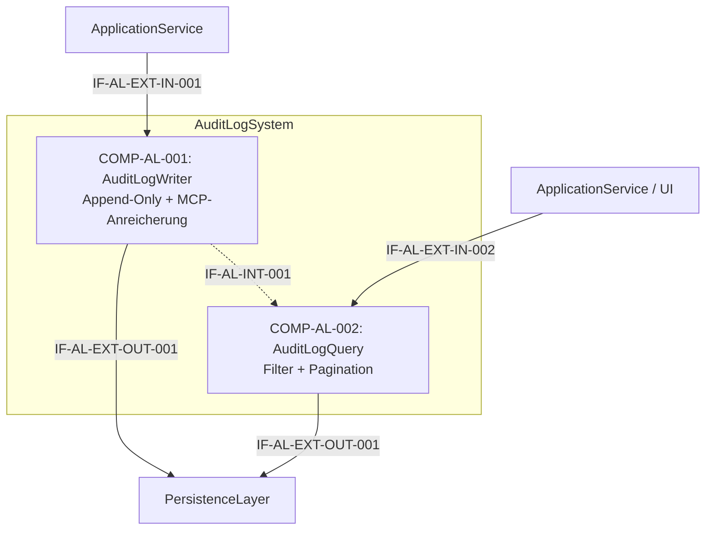

# L2 AuditLog Architecture

> **Level:** L2 (Subsystem white-box)
> **System:** AuditLogSystem (ARCH-L1-012)
> **Parent:** L1_Gesamtsystem_Architecture.md
> **Datum:** 2026-06-20
> **Status:** entworfen

---

## 1. Verantwortlichkeit

Append-only Log aller schreibenden Operationen (REST und MCP). Erfasst Akteur (User oder Agent-Client + API-Key), Operation, Entitaets-ID, Zeitstempel, optional Feld-Diff. Wird von ApplicationService nach jeder schreibenden Operation befuellt. Im Datenmodell als eigene Entitaet persistiert.

---

## 2. Black-Box (Eingebettete Sicht)

### Externe Schnittstellen

| ID | Richtung | Gegenstelle | Typ | Vertrag |
|----|----------|-------------|-----|---------|
| IF-AL-EXT-IN-001 | eingehend | ApplicationService | In-Process Python | `log_write(actor, actor_type, op, entity_type, entity_id, version, change_reason?, ctx)` |
| IF-AL-EXT-IN-002 | eingehend | ApplicationService / UI | In-Process Python | Query mit Filter-Parametern |
| IF-AL-EXT-OUT-001 | ausgehend | PersistenceLayer | Django ORM | AuditLogEntry-Entitaet (append-only) |

---

## 3. White-Box (Komponenten-Zerlegung)

### Komponenten

| Komp-ID | Name | Verantwortlichkeit | Domain |
|---------|------|--------------------|--------|
| COMP-AL-001 | AuditLogWriter | Append-Only-Persistierung von Audit-Eintraegen, atomare Transaktion mit ausloesender Operation, MCP-Anreicherung (Agent-Identitaet, API-Key-Hash) | software |
| COMP-AL-002 | AuditLogQuery | Paginierte Audit-Queries nach entity_id, actor, operation, timestamp, source; Tenant-Isolation; Performance-Ziele | software |

### Interne Schnittstellen

| ID | Richtung | Quelle -> Ziel | Typ | Vertrag |
|----|----------|----------------|-----|---------|
| IF-AL-INT-001 | intern | COMP-AL-001 -> COMP-AL-002 | In-Process Python | Gemeinsames AuditLogEntry-Modell (Read-Only fuer Query) |

### Komponentendiagramm (Mermaid)

---

## 4. Zugeordnete REQ-L2

| REQ-L2 | Komponente |
|--------|-----------|
| REQ-L2-AL-001 | COMP-AL-001 |
| REQ-L2-AL-002 | COMP-AL-001 |
| REQ-L2-AL-003 | COMP-AL-001 |
| REQ-L2-AL-004 | COMP-AL-001 |
| REQ-L2-AL-005 | COMP-AL-002 |
| REQ-L2-AL-006 | COMP-AL-001, COMP-AL-002 |
| REQ-L2-AL-007 | COMP-AL-002 |

---

## 5. ADRs (lokal)

**ADR-AL-01 — Write/Read-Trennung bei gemeinsamem Modell**
*Entscheidung:* Zwei Komponenten (Writer + Query) mit gemeinsamem AuditLogEntry-Modell.
*Rationale:* Schreib- und Lesepfade haben unterschiedliche Performance-Charakteristiken (INSERT im kritischen Pfad vs. SELECT mit Filtern). Die Trennung erlaubt spaetere Optimierung (z.B. Lesereplika) ohne Kopplung. Beide teilen dasselbe append-only Modell.
*Verworfene Alternative:* Einzelne AuditLog-Komponente — akzeptabel fuer v1, aber Trennung bereitet v2-Skalierung vor.

**ADR-AL-02 — Synchrones Audit-Logging in derselben Transaktion**
*Entscheidung:* Audit-Write erfolgt synchron und atomar innerhalb der Geschaeftstransaktion.
*Rationale:* Asynchrones Logging (Message-Queue) wuerde die atomare Konsistenz verletzen. Bei Crash nach Geschaeftsoperation aber vor Queue-Verarbeitung waere der Audit-Eintrag verloren.
*Verworfene Alternative:* Asynchrones Audit-Logging — abgelehnt wegen Konsistenzrisiko.

---

*Erstellt durch se-architect-Agent | ReqFlow SE-Kaskade | 2026-06-20*
