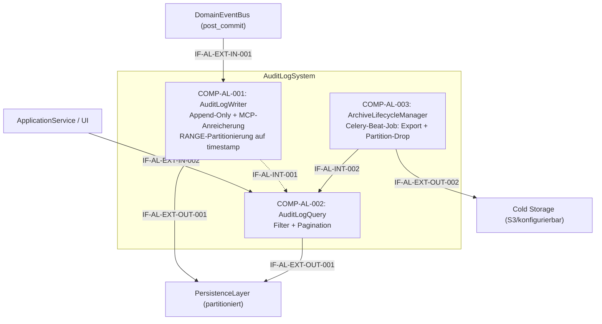

# L2 AuditLog Architecture

> **Level:** L2 (Subsystem white-box)
> **System:** AuditLogSystem (ARCH-L1-012)
> **Parent:** L1_Gesamtsystem_Architecture.md
> **Datum:** 2026-06-20
> **Status:** entworfen

---

## 1. Verantwortlichkeit

Append-only Log aller schreibenden Operationen (REST und MCP). Erfasst Akteur (User oder Agent-Client + API-Key), Operation, Entitaets-ID, Zeitstempel, optional Feld-Diff. Wird von ApplicationService nach jeder schreibenden Operation befuellt (via DomainEventBus post_commit). Im Datenmodell als eigene Entitaet persistiert. Langzeit-Eintraege (> 2 Jahre) werden durch einen periodischen Archivierungs-Job nach Cold Storage exportiert und aus der Primaer-DB entfernt.

---

## 2. Black-Box (Eingebettete Sicht)

### Externe Schnittstellen

| ID | Richtung | Gegenstelle | Typ | Vertrag |
|----|----------|-------------|-----|---------|
| IF-AL-EXT-IN-001 | eingehend | ApplicationService (via DomainEventBus) | Domain-Event (post_commit) | `AuditableOperationOccurred`-Event mit Feldern: actor, actor_type, op, entity_type, entity_id, version, change_reason?, ctx — wird jetzt als Event-Subscriber via DomainEventBus aufgerufen (statt direktem In-Process-Aufruf) |
| IF-AL-EXT-IN-002 | eingehend | ApplicationService / UI | In-Process Python | Query mit Filter-Parametern |
| IF-AL-EXT-OUT-001 | ausgehend | PersistenceLayer | Django ORM | AuditLogEntry-Entitaet (append-only), Tabelle ist monatlich per RANGE-Partitionierung auf `timestamp` partitioniert |
| IF-AL-EXT-OUT-002 | ausgehend | Cold Storage (S3 oder konfigurierbar) | HTTP/S3-API | Komprimierte JSON-Archive exportierter Audit-Partitionen (gzip); Dateiname-Konvention: `audit_YYYY_MM.json.gz`; Schreib-Bestaetigung erforderlich vor Loeschung in Primaer-DB |

---

## 3. White-Box (Komponenten-Zerlegung)

### Komponenten

| Komp-ID | Name | Verantwortlichkeit | Domain |
|---------|------|--------------------|--------|
| COMP-AL-001 | AuditLogWriter | Append-Only-Persistierung von Audit-Eintraegen, atomare Transaktion mit ausloesender Operation, MCP-Anreicherung (Agent-Identitaet, API-Key-Hash); Tabelle ist monatlich per RANGE-Partitionierung auf `timestamp` partitioniert | software |
| COMP-AL-002 | AuditLogQuery | Paginierte Audit-Queries nach entity_id, actor, operation, timestamp, source; Tenant-Isolation; Performance-Ziele; stellt Daten fuer Archivierungs-Export bereit | software |
| COMP-AL-003 | ArchiveLifecycleManager | Periodischer Celery-Beat-Job; exportiert Eintraege aelter als 2 Jahre als komprimierte JSON-Archive nach Cold Storage (konfigurierbar); loescht exportierte Partition nach erfolgreichem Export aus Primaer-DB; Fail-Safe: kein Loeschen ohne bestaedigten Export | software |

### Interne Schnittstellen

| ID | Richtung | Quelle -> Ziel | Typ | Vertrag |
|----|----------|----------------|-----|---------|
| IF-AL-INT-001 | intern | COMP-AL-001 -> COMP-AL-002 | In-Process Python | Gemeinsames AuditLogEntry-Modell (Read-Only fuer Query) |
| IF-AL-INT-002 | intern | COMP-AL-003 -> COMP-AL-002 | In-Process Python | Lesezugriff auf AuditLogEntry-Eintraege gefiltert nach timestamp < (now - 2 Jahre); paginiert fuer speichereffizienten Export |

### Komponentendiagramm (Mermaid)

---

## 4. Zugeordnete REQ-L2

| REQ-L2 | Komponente |
|--------|-----------|
| REQ-L2-AL-001 | COMP-AL-001 |
| REQ-L2-AL-002 | COMP-AL-001 |
| REQ-L2-AL-003 | COMP-AL-001 |
| REQ-L2-AL-004 | COMP-AL-001 |
| REQ-L2-AL-005 | COMP-AL-002 |
| REQ-L2-AL-006 | COMP-AL-001, COMP-AL-002 |
| REQ-L2-AL-007 | COMP-AL-002 |
| REQ-L2-AL-008 | COMP-AL-001 |
| REQ-L2-AL-009 | COMP-AL-003 |

---

## 5. ADRs (lokal)

**ADR-AL-01 — Write/Read-Trennung bei gemeinsamem Modell**
*Entscheidung:* Zwei Komponenten (Writer + Query) mit gemeinsamem AuditLogEntry-Modell.
*Rationale:* Schreib- und Lesepfade haben unterschiedliche Performance-Charakteristiken (INSERT im kritischen Pfad vs. SELECT mit Filtern). Die Trennung erlaubt spaetere Optimierung (z.B. Lesereplika) ohne Kopplung. Beide teilen dasselbe append-only Modell.
*Verworfene Alternative:* Einzelne AuditLog-Komponente — akzeptabel fuer v1, aber Trennung bereitet v2-Skalierung vor.

**ADR-AL-02 — Synchrones Audit-Logging in der Transaktion, Aufruf via Event-Bus**
*Entscheidung:* Audit-Write erfolgt synchron und atomar innerhalb der Geschaeftstransaktion; der Aufruf erfolgt jetzt als Event-Subscriber via DomainEventBus (post_commit-Event) statt direktem In-Process-Aufruf.
*Rationale:* Asynchrones Logging (Message-Queue) wuerde die atomare Konsistenz verletzen. Bei Crash nach Geschaeftsoperation aber vor Queue-Verarbeitung waere der Audit-Eintrag verloren. Das post_commit-Event gewaehrleistet, dass der Audit-Write nur bei erfolgreich committeter Transaktion ausgeloest wird. Die Event-Bus-Integration entkoppelt ApplicationService und AuditLogWriter ohne Konsistenzrisiko.
*Verworfene Alternative:* Asynchrones Audit-Logging — abgelehnt wegen Konsistenzrisiko.

**ADR-AL-03 — Table-Partitioning und Cold-Storage-Archivierung**
*Entscheidung:* Die AuditLogEntry-Tabelle wird monatlich per PostgreSQL RANGE-Partitionierung auf `timestamp` partitioniert. Ein periodischer Celery-Beat-Job (ArchiveLifecycleManager) exportiert Partitionen aelter als 2 Jahre als komprimierte JSON-Archive in konfigurierbare Cold Storage (S3-kompatibel) und verwirft die Partition anschliessend per Partition-Drop aus der Primaer-DB. Loesch-Operation erfordert bestaedigten Export-Erfolg (Fail-Safe).
*Rationale:* Compliance-Normen (IEC 61508) verlangen lueckenlose Nachverfolgbarkeit — Audit-Daten duerfen nicht vernichtet werden, muessen aber zugreifbar bleiben. Endlos-Speicherung im heissen System degradiert Query-Performance und Index-Groesse progressiv. Partitionierung erlaubt Partition-Drop statt Row-Delete, was deutlich effizienter ist und keinen Lock-Contention auf heissem System erzeugt. Archivierung in Cold Storage sichert Compliance-Nachweispflicht ueber den Retention-Zeitraum hinaus.
*Verworfene Alternative:* Zeilen-Delete mit WHERE timestamp < cutoff — abgelehnt wegen Performance-Impact auf das heisse System (Row-Delete auf grosser Tabelle erzeugt Bloat und Lock-Contention) und fehlendem Nachweis-Archiv.

---

*Erstellt durch se-architect-Agent | ReqFlow SE-Kaskade | 2026-06-20*
*Aktualisiert 2026-06-21: Archivierungsstrategie (ADR-AL-03), COMP-AL-003, IF-AL-EXT-OUT-002, IF-AL-INT-002, Event-Bus-Integration (ADR-AL-02)*
