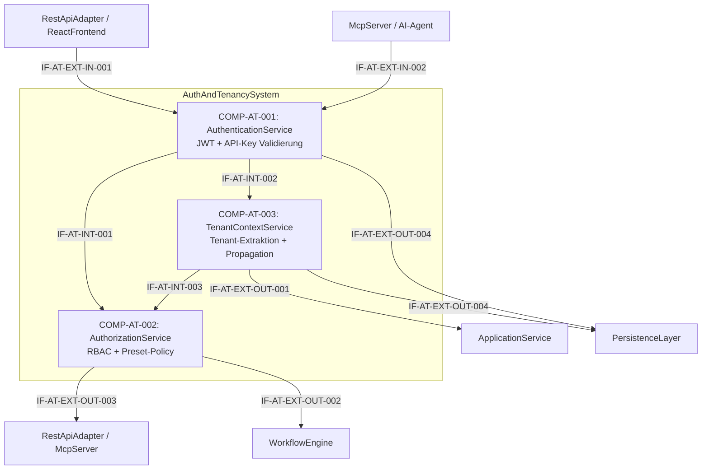

# L2 AuthAndTenancy Architecture

> **Level:** L2 (Subsystem white-box)
> **System:** AuthAndTenancySystem (ARCH-L1-011)
> **Parent:** L1_Gesamtsystem_Architecture.md
> **Datum:** 2026-06-20
> **Status:** entworfen

---

## 1. Verantwortlichkeit

Token-basierte Authentifizierung (Bearer Token / API Keys), RBAC-Enforcement und Tenant-Context-Propagation. Extrahiert den aktiven Tenant aus dem Token und propagiert ihn in den Request-Context fuer PersistenceLayer.CustomManager. Erzwingt Berechtigungs-Checks pro Operation und Ressource.

---

## 2. Black-Box (Eingebettete Sicht)

### Externe Schnittstellen

| ID | Richtung | Gegenstelle | Typ | Vertrag |
|----|----------|-------------|-----|---------|
| IF-AT-EXT-IN-001 | eingehend | RestApiAdapter / ReactFrontend | HTTPS + JSON | Bearer Token (JWT) |
| IF-AT-EXT-IN-002 | eingehend | McpServer / AI-Agent | MCP-Protokoll | API Key im Header |
| IF-AT-EXT-OUT-001 | ausgehend | ApplicationService | In-Process Python | Auth-Kontext (User, Tenant, Rollen) |
| IF-AT-EXT-OUT-002 | ausgehend | WorkflowEngine | In-Process Python | Rollen-Check-Ergebnis |
| IF-AT-EXT-OUT-003 | ausgehend | RestApiAdapter / McpServer | In-Process Python | Berechtigungsentscheid (allow/deny) |
| IF-AT-EXT-OUT-004 | ausgehend | PersistenceLayer | Django ORM | User, Role, Tenant Lookup |

---

## 3. White-Box (Komponenten-Zerlegung)

### Komponenten

| Komp-ID | Name | Verantwortlichkeit | Domain |
|---------|------|--------------------|--------|
| COMP-AT-001 | AuthenticationService | Bearer-Token-Validierung (JWT), API-Key-Validierung (SHA-256), Timing-Attack-resistenter Vergleich | software |
| COMP-AT-002 | AuthorizationService | RBAC-Policy-Evaluierung pro Operation/Ressource, Preset-spezifische Rollenrestriktionen (Approver nur Extended) | software |
| COMP-AT-003 | TenantContextService | Tenant-Extraktion aus Token, Request-Context-Injektion fuer Custom Manager, Tenant-Isolations-Garantie | software |

### Interne Schnittstellen

| ID | Richtung | Quelle -> Ziel | Typ | Vertrag |
|----|----------|----------------|-----|---------|
| IF-AT-INT-001 | intern | COMP-AT-001 -> COMP-AT-002 | In-Process Python | `IdentityClaims {user_id, roles, auth_method}` |
| IF-AT-INT-002 | intern | COMP-AT-001 -> COMP-AT-003 | In-Process Python | `IdentityClaims {user_id, tenant_id}` |
| IF-AT-INT-003 | intern | COMP-AT-003 -> COMP-AT-002 | In-Process Python | `TenantContext {tenant_id, tenant_name}` |

### Komponentendiagramm (Mermaid)

---

## 4. Zugeordnete REQ-L2

| REQ-L2 | Komponente |
|--------|-----------|
| REQ-L2-AT-001 | COMP-AT-001 |
| REQ-L2-AT-002 | COMP-AT-001 |
| REQ-L2-AT-003 | COMP-AT-002 |
| REQ-L2-AT-004 | COMP-AT-002 |
| REQ-L2-AT-005 | COMP-AT-003 |
| REQ-L2-AT-006 | COMP-AT-002 |
| REQ-L2-AT-007 | COMP-AT-001 |
| REQ-L2-AT-008 | COMP-AT-003 |
| REQ-L2-AT-009 | COMP-AT-001 |
| REQ-L2-AT-010 | COMP-AT-001 |

---

## 5. ADRs (lokal)

**ADR-AT-01 — Separation of Identity, Permission und Tenanting**
*Entscheidung:* Drei getrennte Komponenten fuer Authentifizierung, Autorisierung und Tenant-Context.
*Rationale:* Trennt technische Interception (Token-Validierung) von fachlicher Policy-Evaluierung (RBAC) und architektonisch kritischem Querschnittsanliegen (Tenant-Isolation). Ermoeglicht unabhaengige Evolution und Testbarkeit.
*Verworfene Alternative:* Monolithischer AuthService — abgelehnt wegen God-Object-Risiko und hoher Kopplung an PersistenceLayer, PresetConfigEngine und alle Consumer.

**ADR-AT-02 — Tenant-Isolation via Custom Django Manager (kein Schema-per-Tenant)**
*Entscheidung:* Row-Level-Isolation mit `tenant_id`-FK auf jeder Entitaet; Custom Manager filtert automatisch.
*Rationale:* Schema-per-Tenant erzeugt Migration- und Backup-Overhead. Row-Level skaliert fuer v2-SaaS bis in den niedrigen vierstelligen Tenant-Bereich.
*Verworfene Alternative:* Schema-per-Tenant (django-tenants) — abgelehnt wegen Self-Hosted-Overhead.

---

*Erstellt durch se-architect-Agent | ReqFlow SE-Kaskade | 2026-06-20*
