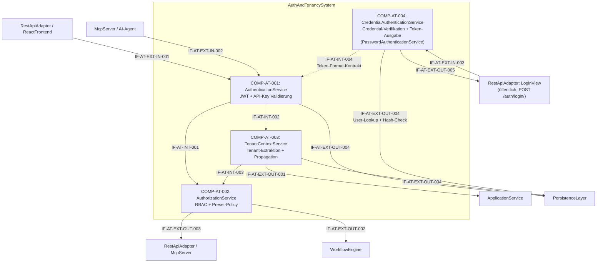

# L2 AuthAndTenancy Architecture

> **Level:** L2 (Subsystem white-box)
> **System:** AuthAndTenancySystem (ARCH-L1-011)
> **Parent:** L1_Gesamtsystem_Architecture.md
> **Datum:** 2026-06-20
> **Status:** entworfen

---

## 1. Verantwortlichkeit

Token-basierte Authentifizierung (Bearer Token / API Keys), RBAC-Enforcement und Tenant-Context-Propagation. Extrahiert den aktiven Tenant aus dem Token und propagiert ihn in den Request-Context fuer PersistenceLayer.CustomManager. Erzwingt Berechtigungs-Checks pro Operation und Ressource.

---

## 2. Black-Box (Eingebettete Sicht)

### Externe Schnittstellen

| ID | Richtung | Gegenstelle | Typ | Vertrag |
|----|----------|-------------|-----|---------|
| IF-AT-EXT-IN-001 | eingehend | RestApiAdapter / ReactFrontend | HTTPS + JSON | Bearer Token (JWT) |
| IF-AT-EXT-IN-002 | eingehend | McpServer / AI-Agent | MCP-Protokoll | API Key im Header |
| IF-AT-EXT-OUT-001 | ausgehend | ApplicationService | In-Process Python | Auth-Kontext (User, Tenant, Rollen) |
| IF-AT-EXT-OUT-002 | ausgehend | WorkflowEngine | In-Process Python | Rollen-Check-Ergebnis |
| IF-AT-EXT-OUT-003 | ausgehend | RestApiAdapter / McpServer | In-Process Python | Berechtigungsentscheid (allow/deny) |
| IF-AT-EXT-OUT-004 | ausgehend | PersistenceLayer | Django ORM | User, Role, Tenant Lookup (inkl. Passwort-Hash-Check) |
| IF-AT-EXT-IN-003 | eingehend | RestApiAdapter (`LoginView`, öffentlich) | In-Process Python | `authenticate_credentials(username, password)` + `issue_token(user, roles)` |
| IF-AT-EXT-OUT-005 | ausgehend | RestApiAdapter (`LoginView`) | In-Process Python | Ausgestellter Bearer-Token + `{user, tenant_id, roles}` bzw. `AuthenticationFailed("invalid_token")` |

---

## 3. White-Box (Komponenten-Zerlegung)

### Komponenten

| Komp-ID | Name | Verantwortlichkeit | Domain |
|---------|------|--------------------|--------|
| COMP-AT-001 | AuthenticationService | Bearer-Token-Validierung (JWT), API-Key-Validierung (SHA-256), Timing-Attack-resistenter Vergleich | software |
| COMP-AT-002 | AuthorizationService | RBAC-Policy-Evaluierung pro Operation/Ressource, Preset-spezifische Rollenrestriktionen (Approver nur Extended) | software |
| COMP-AT-003 | TenantContextService | Tenant-Extraktion aus Token, Request-Context-Injektion fuer Custom Manager, Tenant-Isolations-Garantie | software |
| COMP-AT-004 | CredentialAuthenticationService | Credential-Verifikation (Benutzername/Passwort, constant-time, enumeration-resistent), Rollen-Auflösung und Ausstellung eines `BearerTokenAuthentication`-kompatiblen HS256-JWT. Bildet die als-gebaut-Klasse `PasswordAuthenticationService` ab. | software |

### Interne Schnittstellen

| ID | Richtung | Quelle -> Ziel | Typ | Vertrag |
|----|----------|----------------|-----|---------|
| IF-AT-INT-001 | intern | COMP-AT-001 -> COMP-AT-002 | In-Process Python | `IdentityClaims {user_id, roles, auth_method}` |
| IF-AT-INT-002 | intern | COMP-AT-001 -> COMP-AT-003 | In-Process Python | `IdentityClaims {user_id, tenant_id}` |
| IF-AT-INT-003 | intern | COMP-AT-003 -> COMP-AT-002 | In-Process Python | `TenantContext {tenant_id, tenant_name}` |
| IF-AT-INT-004 | intern (Format-Kontrakt) | COMP-AT-004 ~ COMP-AT-001 | JWT-Claim-Schema | Von COMP-AT-004 ausgestellte Tokens tragen exakt das Claim-Set, das COMP-AT-001 (`validate_bearer_token`) konsumiert: `{user_id, tenant_id, roles, iat, exp, iss?, aud?}`. Gemeinsame Quelle: `AUTH_JWT_*`-Settings + `jwt_tokens.encode_hs256`. Garantiert den Token-Round-Trip (REQ-L2-AT-012). |

### Komponentendiagramm (Mermaid)

---

## 4. Zugeordnete REQ-L2

| REQ-L2 | Komponente |
|--------|-----------|
| REQ-L2-AT-001 | COMP-AT-001 |
| REQ-L2-AT-002 | COMP-AT-001 |
| REQ-L2-AT-003 | COMP-AT-002 |
| REQ-L2-AT-004 | COMP-AT-002 |
| REQ-L2-AT-005 | COMP-AT-003 |
| REQ-L2-AT-006 | COMP-AT-002 |
| REQ-L2-AT-007 | COMP-AT-001 |
| REQ-L2-AT-008 | COMP-AT-003 |
| REQ-L2-AT-009 | COMP-AT-001 |
| REQ-L2-AT-010 | COMP-AT-001 |
| REQ-L2-AT-011 | COMP-AT-004 |
| REQ-L2-AT-012 | COMP-AT-004 |
| REQ-L2-AT-013 | COMP-AT-004 (RestApiAdapter-seitig: LoginView öffentlich) |
| REQ-L2-AT-014 | COMP-AT-004 (Vertrag mit PersistenceLayer `User`) |
| REQ-L2-AT-015 | COMP-AT-003 / COMP-AT-001 (RestApiAdapter-seitig: MeView) |
| REQ-L2-AT-016 | COMP-AT-004 |

---

## 5. ADRs (lokal)

**ADR-AT-01 — Separation of Identity, Permission und Tenanting**
*Entscheidung:* Drei getrennte Komponenten fuer Authentifizierung, Autorisierung und Tenant-Context.
*Rationale:* Trennt technische Interception (Token-Validierung) von fachlicher Policy-Evaluierung (RBAC) und architektonisch kritischem Querschnittsanliegen (Tenant-Isolation). Ermoeglicht unabhaengige Evolution und Testbarkeit.
*Verworfene Alternative:* Monolithischer AuthService — abgelehnt wegen God-Object-Risiko und hoher Kopplung an PersistenceLayer, PresetConfigEngine und alle Consumer.

**ADR-AT-02 — Tenant-Isolation via Custom Django Manager (kein Schema-per-Tenant)**
*Entscheidung:* Row-Level-Isolation mit `tenant_id`-FK auf jeder Entitaet; Custom Manager filtert automatisch.
*Rationale:* Schema-per-Tenant erzeugt Migration- und Backup-Overhead. Row-Level skaliert fuer v2-SaaS bis in den niedrigen vierstelligen Tenant-Bereich.
*Verworfene Alternative:* Schema-per-Tenant (django-tenants) — abgelehnt wegen Self-Hosted-Overhead.

**ADR-AT-03 — Öffentlicher (unauthentifizierter) Login-Endpunkt**
*Kontext (arch_trigger REQ-L1-033):* Credential-Login erfordert einen unauthentifizierten Einstiegspunkt — ein Client kann seinen ersten Token nicht mit einem Token holen (Henne-Ei-Problem).
*Entscheidung:* `POST /api/v1/auth/login/` wird explizit von der Auth-Middleware-Interception (REQ-L2-AT-007) ausgenommen (`authentication_classes=[]`, `AllowAny`), als vierter Eintrag der bestehenden Ausnahmeliste (`/health`, `/api/docs`, `/api/openapi.json`). Der Schutz wird stattdessen in die Credential-Verifikation selbst verlagert (constant-time, enumeration-resistent, HTTP 401 ohne Kontoinformation). `GET /auth/me/` bleibt geschützt.
*Rationale:* Die Ausnahme ist eng begrenzt (genau ein zusätzlicher Pfad) und ändert das Sicherheitsmodell der übrigen Oberfläche nicht. Tenant-Isolation ist hier nicht betroffen, da `User` nicht tenant-scoped ist und der Lookup vor jeglichem Tenant-Kontext läuft (analog zur API-Key-Validierung).
*Verworfene Alternative:* Login hinter der Middleware mit Sonderfall-Bypass-Flag im Request — abgelehnt, weil ein Bypass-Flag im Auth-Pfad fehleranfälliger ist als eine deklarative, an einer Stelle sichtbare Ausnahmeliste.

**ADR-AT-04 — Wiederverwendung des bestehenden Token-Formats statt Session-Cookies**
*Kontext (arch_trigger REQ-L1-033):* Token-Ausgabe und -Format müssen mit der bestehenden `BearerTokenAuthentication`-Schicht (COMP-AT-001 / REQ-L2-AT-001) kompatibel sein.
*Entscheidung:* COMP-AT-004 stellt denselben HS256-JWT aus, den COMP-AT-001 validiert — identisches Claim-Set (`user_id, tenant_id, roles, iat, exp, iss?, aud?`), gemeinsame `AUTH_JWT_*`-Settings und gemeinsame `encode_hs256`-Routine (IF-AT-INT-004). Aussteller- und Validatorseite lesen dieselben Settings; genau das garantiert den Round-Trip.
*Rationale:* Keine zweite Auth-Mechanik (Sessions, Cookies) — der via Login erhaltene Token funktioniert sofort an allen geschützten REST- und MCP-Endpunkten. RBAC (REQ-L2-AT-003) und Tenant-Kontext (REQ-L2-AT-008) bleiben unverändert; Login ist nur ein neuer Aussteller für ein bereits etabliertes Format. Konsistent mit ADR-01 (Token-Prinzip) und STRATEGY.md §3.
*Verworfene Alternative:* Server-side Session + Session-Cookie — abgelehnt, weil es ein zweites, stateful Auth-Modell neben Bearer-Token einführte, MCP-Agenten nicht bedient und dem Stateless-Prinzip (REQ-L0-021/AC3) widerspricht.

**ADR-AT-05 — Credential-Login als eigene Komponente COMP-AT-004 (nicht in COMP-AT-001 verschmolzen)**
*Kontext:* Die als-gebaut-Klasse `PasswordAuthenticationService` liegt physisch im selben Modul (`auth_tenancy`) wie der Token-Validator (COMP-AT-001) und referenziert dessen JWT-Bausteine.
*Entscheidung:* Credential-Verifikation + Token-Ausstellung werden als eigene Architektur-Komponente COMP-AT-004 modelliert.
*Rationale (Separation of Concerns):* COMP-AT-001 **verifiziert** vorhandene Tokens/Keys (eingehende Anfragen aller geschützten Endpunkte); COMP-AT-004 **erzeugt** Tokens aus Credentials (ein einziger öffentlicher Endpunkt). Das sind gegenläufige Verantwortungsrichtungen (Consume vs. Produce) mit unterschiedlichem Bedrohungsmodell (Enumeration/Timing beim Login vs. Signaturprüfung bei Validierung). Getrennte Komponenten halten beide Verantwortungen kohäsiv und ermöglichen unabhängiges Testen. Der gemeinsame Token-Format-Vertrag wird explizit als IF-AT-INT-004 modelliert statt durch Verschmelzung implizit.
*Verworfene Alternative:* Login-Methoden direkt an COMP-AT-001 anhängen — abgelehnt, weil es Produce- und Consume-Pfad in einer Komponente vermischt und das Login-spezifische Bedrohungsmodell (Enumeration) im Validator verwässert.

---

*Erstellt durch se-architect-Agent | ReqFlow SE-Kaskade | 2026-06-20*
*Erweiterung 2026-06-25: COMP-AT-004 CredentialAuthenticationService + ADR-AT-03..05 (REQ-L1-033 Credential-Login) durch se-architect-Agent*
