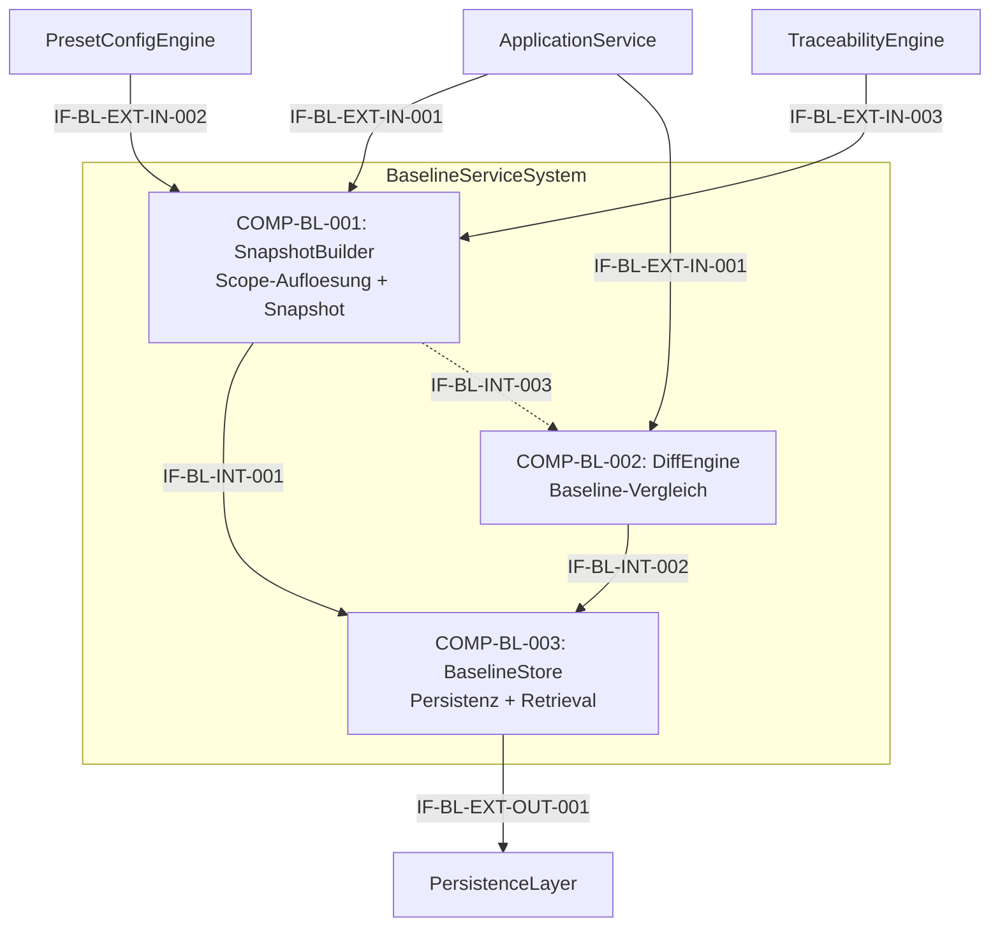

# L2 BaselineService Architecture

> **Level:** L2 (Subsystem white-box)
> **System:** BaselineServiceSystem (ARCH-L1-006)
> **Parent:** L1_Gesamtsystem_Architecture.md
> **Datum:** 2026-06-20
> **Status:** entworfen

---

## 1. Verantwortlichkeit

Erstellung unveraenderlicher, benannter Baselines auf drei Scopes (document, project, global). Ermittelt betroffene Item-IDs und Versionen, persistiert atomar als JSON-Snapshot und stellt Diff-Vergleiche zwischen Baselines bereit.

---

## 2. Black-Box (Eingebettete Sicht)

### Externe Schnittstellen

| ID | Richtung | Gegenstelle | Typ | Vertrag |
|----|----------|-------------|-----|---------|
| IF-BL-EXT-IN-001 | eingehend | ApplicationService | In-Process Python | `build(scope, workspace_id, name, description, ctx)`, `diff(baseline_a_id, baseline_b_id)`, `get(baseline_id)`, `list(workspace_id, scope?)` |
| IF-BL-EXT-IN-002 | eingehend | PresetConfigEngine | In-Process Python | Preset-Regeln (Scope-Verfuegbarkeit) |
| IF-BL-EXT-IN-003 | eingehend | TraceabilityEngine | In-Process Python | `collect_trace_graph(workspace_id) -> item_ids, versionen, trace_links` |
| IF-BL-EXT-OUT-001 | ausgehend | PersistenceLayer | Django ORM | Baseline-Entitaet (INSERT/SELECT, immutable) |

---

## 3. White-Box (Komponenten-Zerlegung)

### Komponenten

| Komp-ID | Name | Verantwortlichkeit | Domain |
|---------|------|--------------------|--------|
| COMP-BL-001 | SnapshotBuilder | Scope-Aufloesung, Item-ID/Version-Ermittlung, atomare JSON-Snapshot-Erstellung, Immutability-Enforcement, Naming/Metadata-Validierung | software |
| COMP-BL-002 | DiffEngine | Vergleich zweier Baselines desselben Scopes (added/removed/changed mit Versions-Delta), Scope-Kompatibilitaetspruefung | software |
| COMP-BL-003 | BaselineStore | Baseline-Persistenz (INSERT/SELECT), Retrieval und Listing, Tenant-Isolation, atomare Transaktionen | software |

### Interne Schnittstellen

| ID | Richtung | Quelle -> Ziel | Typ | Vertrag |
|----|----------|----------------|-----|---------|
| IF-BL-INT-001 | intern | COMP-BL-001 -> COMP-BL-003 | In-Process Python | `persist_snapshot(snapshot, metadata) -> baseline_id` |
| IF-BL-INT-002 | intern | COMP-BL-002 -> COMP-BL-003 | In-Process Python | `load_snapshot(baseline_id) -> BaselineEntity` |
| IF-BL-INT-003 | intern | COMP-BL-001 -> COMP-BL-002 | In-Process Python | `get_snapshot_data(baseline_id) -> JSON` (optionaler direkter Zugriff) |

### Komponentendiagramm (Mermaid)

---

## 4. Zugeordnete REQ-L2

| REQ-L2 | Komponente |
|--------|-----------|
| REQ-L2-BL-001 | COMP-BL-001 |
| REQ-L2-BL-002 | COMP-BL-003 |
| REQ-L2-BL-003 | COMP-BL-002 |
| REQ-L2-BL-004 | COMP-BL-001 |
| REQ-L2-BL-005 | COMP-BL-001 |
| REQ-L2-BL-006 | COMP-BL-003 |
| REQ-L2-BL-007 | COMP-BL-003 |
| REQ-L2-BL-008 | COMP-BL-001, COMP-BL-002, COMP-BL-003 |

---

## 5. ADRs (lokal)

**ADR-BL-01 — Drei Komponenten statt monolithischem BaselineService**
*Entscheidung:* SnapshotBuilder, DiffEngine und BaselineStore als eigenstaendige Komponenten.
*Rationale:* Scope-Aufloesung (rekursive CTEs), Diff-Berechnung (JSON-Vergleich) und Persistenz (ORM/Constraints) sind orthogonal genug, um separate Module zu rechtfertigen. Ermoeglicht unabhaengige Testisolation und zukuenftige Optimierungen.
*Verworfene Alternative:* Monolithischer BaselineService — abgelehnt wegen SRP-Verletzung und schlechter Testisolation.

**ADR-BL-02 — JSON-Snapshot statt referentieller Baseline**
*Entscheidung:* Baseline-Snapshot als JSON-Dokument mit Item-IDs + Versionen.
*Rationale:* Unabhaengigkeit von nachfolgenden Aenderungen an Items. Einfacher Diff. Keine komplexe referentielle Kopplung.
*Verworfene Alternative:* Baseline als referentielle Kopie aller Items — abgelehnt wegen Speicher-Overhead und Kopplungsrisiko.

---

*Erstellt durch se-architect-Agent | ReqFlow SE-Kaskade | 2026-06-20*
