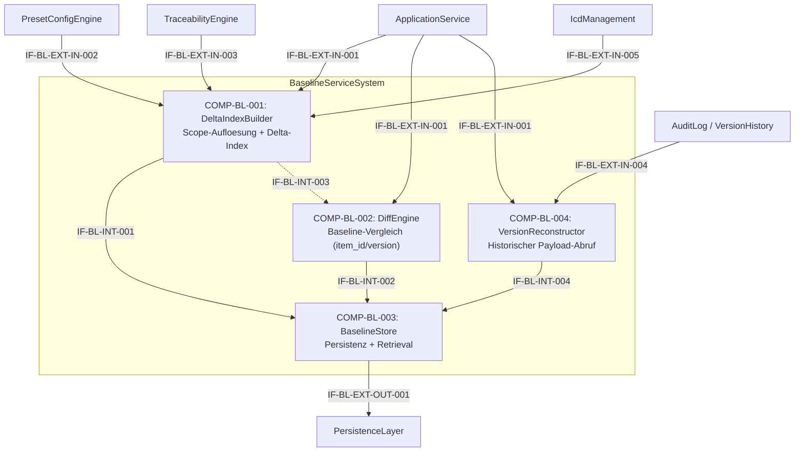

# L2 BaselineService Architecture

> **Level:** L2 (Subsystem white-box)
> **System:** BaselineServiceSystem (ARCH-L1-006)
> **Parent:** L1_Gesamtsystem_Architecture.md
> **Datum:** 2026-06-20
> **Status:** entworfen

---

## 1. Verantwortlichkeit

Erstellung unveraenderlicher, benannter Baselines auf drei Scopes (document, project, global). Ermittelt betroffene Item-IDs und Versionen, persistiert als schlanke Delta-Index-Tabelle (item_id, version) und stellt Diff-Vergleiche sowie historische Zustandsrekonstruktion zwischen Baselines bereit.

---

## 2. Black-Box (Eingebettete Sicht)

### Externe Schnittstellen

| ID | Richtung | Gegenstelle | Typ | Vertrag |
|----|----------|-------------|-----|---------|
| IF-BL-EXT-IN-001 | eingehend | ApplicationService | In-Process Python | `build(scope, workspace_id, name, description, ctx)`, `diff(baseline_a_id, baseline_b_id)`, `get(baseline_id)`, `list(workspace_id, scope?)` |
| IF-BL-EXT-IN-002 | eingehend | PresetConfigEngine | In-Process Python | Preset-Regeln (Scope-Verfuegbarkeit) |
| IF-BL-EXT-IN-003 | eingehend | TraceabilityEngine | In-Process Python | `collect_trace_graph(workspace_id) -> item_ids, versionen, trace_links` |
| IF-BL-EXT-IN-004 | eingehend | AuditLog / VersionHistory | Django ORM | `get_version(item_id, version) -> ItemPayload` |
| IF-BL-EXT-IN-005 | eingehend | IcdManagement | In-Process Python | `get_icd_versions(workspace_id, scope) -> icd_ids, versionen` |
| IF-BL-EXT-OUT-001 | ausgehend | PersistenceLayer | Django ORM | Baseline-Entitaet (INSERT/SELECT, immutable) |

---

## 3. White-Box (Komponenten-Zerlegung)

### Komponenten

| Komp-ID | Name | Verantwortlichkeit | Domain |
|---------|------|--------------------|--------|
| COMP-BL-001 | DeltaIndexBuilder | Scope-Aufloesung, Item-ID/Version- sowie ICD-Version-Ermittlung, Immutability-Enforcement, Naming/Metadata-Validierung; persistiert zusaetzlich den vollstaendigen Entity-Zustand im `state`-JSONField (REQ-L2-BL-012) in der BaselineDeltaIndex-Tabelle. | software |
| COMP-BL-002 | DiffEngine | Vergleich zweier Baselines desselben Scopes (added/removed/changed mit Versions-Delta) auf Basis von Item/ICD-Versions-Paaren, Scope-Kompatibilitaetspruefung | software |
| COMP-BL-003 | BaselineStore | Baseline-Persistenz (INSERT/SELECT), Retrieval und Listing der Delta-Index-Tabelle (fuer Items und ICDs), Tenant-Isolation, atomare Transaktionen | software |
| COMP-BL-004 | VersionReconstructor | Laedt fuer ein Item/ICD den historischen Payload; greift bevorzugt auf das `state`-Feld im BaselineDeltaIndexEntry zurueck und nutzt AuditLog / VersionHistory nur als Fallback; implementiert `get_entity_at_baseline(baseline_id, entity_id) -> Payload` | software |

### Interne Schnittstellen

| ID | Richtung | Quelle -> Ziel | Typ | Vertrag |
|----|----------|----------------|-----|---------|
| IF-BL-INT-001 | intern | COMP-BL-001 -> COMP-BL-003 | In-Process Python | `persist_delta_index(delta_index, metadata) -> baseline_id` |
| IF-BL-INT-002 | intern | COMP-BL-002 -> COMP-BL-003 | In-Process Python | `load_delta_index(baseline_id) -> list[tuple[entity_id, version, type]]` |
| IF-BL-INT-003 | intern | COMP-BL-001 -> COMP-BL-002 | In-Process Python | `get_delta_index(baseline_id) -> list[tuple[entity_id, version, type]]` (optionaler direkter Zugriff) |
| IF-BL-INT-004 | intern | COMP-BL-004 -> COMP-BL-003 | In-Process Python | `lookup_entity_version(baseline_id, entity_id) -> version` |

### Komponentendiagramm (Mermaid)

---

## 4. Zugeordnete REQ-L2

| REQ-L2 | Komponente |
|--------|-----------|
| REQ-L2-BL-001 | COMP-BL-001 |
| REQ-L2-BL-002 | COMP-BL-003 |
| REQ-L2-BL-003 | COMP-BL-002 |
| REQ-L2-BL-004 | COMP-BL-001 |
| REQ-L2-BL-005 | COMP-BL-001 |
| REQ-L2-BL-006 | COMP-BL-003 |
| REQ-L2-BL-007 | COMP-BL-003 |
| REQ-L2-BL-008 | COMP-BL-001, COMP-BL-002, COMP-BL-003 |
| REQ-L2-BL-009 | COMP-BL-004 |

---

## 5. ADRs (lokal)

**ADR-BL-01 — Vier Komponenten statt monolithischem BaselineService**
*Entscheidung:* DeltaIndexBuilder, DiffEngine, BaselineStore und VersionReconstructor als eigenstaendige Komponenten.
*Rationale:* Scope-Aufloesung (rekursive CTEs), Diff-Berechnung, Persistenz (ORM/Constraints) und Payload-Rekonstruktion (AuditLog-Zugriff) sind orthogonal genug, um separate Module zu rechtfertigen. Ermoeglicht unabhaengige Testisolation und zukuenftige Optimierungen je Belang.
*Verworfene Alternative:* Monolithischer BaselineService — abgelehnt wegen SRP-Verletzung und schlechter Testisolation.

**ADR-BL-02 — State-Snapshot im Delta-Index (Revoked Delta-Storage Only)**
*Entscheidung:* Baseline speichert Identifikatoren und Versionen, aber neu (gemäß REQ-L2-BL-012) auch den vollständigen Payload-Zustand zum Zeitpunkt der Baseline in einem `state`-JSONField am `BaselineDeltaIndexEntry`. Der Zugriff durch COMP-BL-004 (VersionReconstructor) erfolgt primär auf dieses Feld, ein Lookup im AuditLog ist nur noch der Fallback.
*Rationale:* Ein rein referenzieller Delta-Index ohne Snapshot-Payload zwang den Reconstructor zu teuren History-Lookups, was bei großen Workspaces inakzeptable Latenz und N+1-Query-Probleme verursachte. Der Speicher-Overhead eines JSON-Snapshots wird zugunsten der Lesegeschwindigkeit und Unabhängigkeit von lückenloser Historie in Kauf genommen.
*Verworfene Alternativen:*
- Reines Delta-Storage (nur IDs) — urspruenglich gewählt, aber verworfen wegen massiver Latenz-Probleme bei der Payload-Rekonstruktion.

**ADR-BL-03 — VersionReconstructor als eigenstaendige Komponente**
*Entscheidung:* Die Rekonstruktion historischer Item-Payloads wird in COMP-BL-004 (VersionReconstructor) isoliert; sie wird nicht in DeltaIndexBuilder oder BaselineStore eingebettet.
*Rationale:* Indexierung (welche Items sind Teil einer Baseline) und Rekonstruktion (wie war der Zustand eines Items zur Baseline-Zeit) sind orthogonale Verantwortlichkeiten. Die Trennung erlaubt unabhaengige Caching-Strategien fuer den VersionReconstructor (z.B. LRU-Cache auf `(item_id, version)`-Ebene) und vereinfacht die Testisolation beider Belange. Die externe Abhaengigkeit zu AuditLog / RequirementVersion ist klar auf eine Komponente begrenzt.
*Verworfene Alternative:* Payload-Rekonstruktion direkt im BaselineStore oder DeltaIndexBuilder — abgelehnt wegen SRP-Verletzung, erschwerter Testbarkeit und unklarer Abhaengigkeitsrichtung zur Versionshistorie.

---

*Erstellt durch se-architect-Agent | ReqFlow SE-Kaskade | 2026-06-20*
