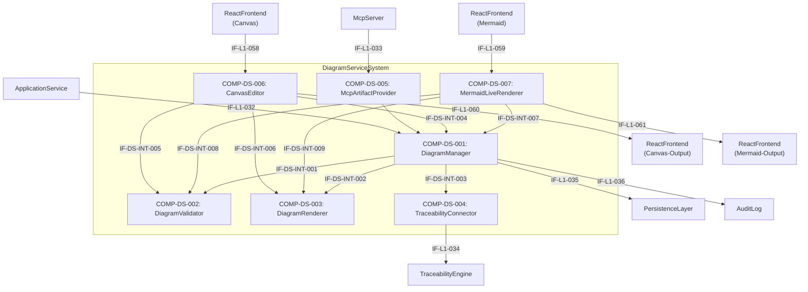

# L2 DiagramService Architecture

> **Level:** L2 (Subsystem white-box)
> **System:** DiagramServiceSystem (ARCH-L1-013)
> **Parent:** L1_Gesamtsystem_Architecture.md
> **Datum:** 2026-06-21
> **Erweitert:** 2026-06-30 (COMP-DS-006 CanvasEditor, COMP-DS-007 MermaidLiveRenderer)
> **Status:** entworfen
> **Designation:** subsystem (white-box)
> **decomposition_status:** terminal (keine L3)

---

## 1. Verantwortlichkeit

Das DiagramServiceSystem verwaltet Diagramme als eigenständige, versionierte Artefakte. Es ermöglicht Speicherung, Payload-Validierung und Rendern grafischer Modelle. Es stellt die Anbindung zur TraceabilityEngine und zum MCP-Server sicher.

---

## 2. Black-Box (Eingebettete Sicht)

### Externe Schnittstellen

| ID | Richtung | Gegenstelle | Typ | Vertrag |
|----|----------|-------------|-----|---------|
| IF-L1-032 | input | ApplicationService | control | `create_diagram`, `update_diagram`, `get_diagram`, `list_versions` |
| IF-L1-033 | input | McpServer | control | `artifact.get` für Diagramm-Artefakttyp |
| IF-L1-034 | output | TraceabilityEngine | data | TraceLink `documents` |
| IF-L1-035 | output | PersistenceLayer | data | Diagram-Entity, DiagramVersion-Entity |
| IF-L1-036 | output | AuditLog | data | Schreib-Operationen (delegiert via ApplicationService) |
| IF-L1-058 | input | ReactFrontend | control | Canvas-Auto-Save-Push (JSON-Stroke-Daten, intervallgesteuert max. 5s) |
| IF-L1-059 | input | ReactFrontend | control | Mermaid-Source-Update (Quellcode mit 500ms Debounce) |
| IF-L1-060 | output | ReactFrontend | data | Canvas-Stroke-Daten (JSON) + SVG-Export + PNG-Export (clientseitig via Canvas.toDataURL) |
| IF-L1-061 | output | ReactFrontend | data | Mermaid-Source + Render-Hinweise + PNG/SVG-Export (clientseitig via mermaid.js + canvas.toDataURL) |

---

## 3. White-Box (Komponenten-Zerlegung)

### Komponenten

| Komp-ID | Name | Verantwortlichkeit | Domain | REQ-Referenz |
|---------|------|--------------------|--------|--------------|
| COMP-DS-001 | DiagramManager | Koordiniert CRUD-Operationen, erzeugt unveränderliche Versionen und delegiert an untergeordnete Komponenten. | software | REQ-L2-DS-001 |
| COMP-DS-002 | DiagramValidator | Prüft den Diagramm-Payload auf Typspezifische Syntax (z.B. Mermaid). | software | REQ-L2-DS-002 |
| COMP-DS-003 | DiagramRenderer | Generiert die renderbare Repräsentation für das Frontend. | software | REQ-L2-DS-003 |
| COMP-DS-004 | TraceabilityConnector | Erzeugt TraceLinks vom Typ `documents` in der TraceabilityEngine. | software | REQ-L2-DS-004 |
| COMP-DS-005 | McpArtifactProvider | Adaptiert MCP `artifact.get` Anfragen und liefert strukturierte Diagrammdaten. | software | REQ-L2-DS-005 |
| COMP-DS-006 | CanvasEditor | Verwaltet Free-Hand Canvas-Diagramme: JSON-Stroke-Daten als Primärformat, Auto-Save-Mechanismus (max. 5s Intervall), SVG/PNG-Export. Validiert Stroke-Daten-Struktur. Delegiert Persistierung und Versionierung an COMP-DS-001. | software | REQ-L2-DS-006 |
| COMP-DS-007 | MermaidLiveRenderer | Verwaltet Mermaid-Code-Diagramme: Validiert Mermaid-Syntax (5 Typen: flowchart, sequenceDiagram, classDiagram, stateDiagram, erDiagram), stellt Quellcode + Render-Hinweise für clientseitiges Rendering (mermaid.js) bereit, implementiert Fallback-Strategie bei Renderer-Ausfall. | software | REQ-L2-DS-007 |

### Interne Schnittstellen

| ID | Richtung | Quelle -> Ziel | Typ | Vertrag |
|----|----------|----------------|-----|---------|
| IF-DS-INT-001 | intern | COMP-DS-001 -> COMP-DS-002 | In-Process Python | `validate_payload(type, content) -> bool` |
| IF-DS-INT-002 | intern | COMP-DS-001 -> COMP-DS-003 | In-Process Python | `prepare_renderable(type, content) -> RenderableDiagram` |
| IF-DS-INT-003 | intern | COMP-DS-001 -> COMP-DS-004 | In-Process Python | `create_document_link(diagram_id, target_id)` |
| IF-DS-INT-004 | intern | COMP-DS-006 -> COMP-DS-001 | In-Process Python | `create_diagram(type='canvas', payload=stroke_data)` / `update_diagram()` |
| IF-DS-INT-005 | intern | COMP-DS-006 -> COMP-DS-002 | In-Process Python | `validate_payload(type='canvas', content=stroke_data) -> bool` |
| IF-DS-INT-006 | intern | COMP-DS-006 -> COMP-DS-003 | In-Process Python | `prepare_renderable(type='canvas', content=stroke_data) -> SVG` |
| IF-DS-INT-007 | intern | COMP-DS-007 -> COMP-DS-001 | In-Process Python | `create_diagram(type='mermaid', payload=source_code)` / `update_diagram()` |
| IF-DS-INT-008 | intern | COMP-DS-007 -> COMP-DS-002 | In-Process Python | `validate_payload(type='mermaid', content=source_code) -> bool` |
| IF-DS-INT-009 | intern | COMP-DS-007 -> COMP-DS-003 | In-Process Python | `prepare_renderable(type='mermaid', content=source_code) -> RenderHints` |

### Dependency-Graph (azyklisch)

Unidirektionaler Datenfluss von den Eingängen zu den Verarbeitern und Persistenz.

---

## 4. Zugeordnete REQ-L2

| REQ-L2 | Komponente(n) |
|--------|---------------|
| REQ-L2-DS-001 | COMP-DS-001 |
| REQ-L2-DS-002 | COMP-DS-002 |
| REQ-L2-DS-003 | COMP-DS-003 |
| REQ-L2-DS-004 | COMP-DS-004 |
| REQ-L2-DS-005 | COMP-DS-005 |
| REQ-L2-DS-006 | COMP-DS-006 |
| REQ-L2-DS-007 | COMP-DS-007 |

---

## 5. Interface-Belegung (IF-L1-032..036, IF-L1-058..061)

| Interface | Eigentuemerkomponente | Richtung | Zweck |
|-----------|----------------------|----------|-------|
| IF-L1-032 | COMP-DS-001 | input | ApplicationService CRUD Trigger |
| IF-L1-033 | COMP-DS-005 | input | MCP Tool Trigger |
| IF-L1-034 | COMP-DS-004 | output | TraceLink Persistenz |
| IF-L1-035 | COMP-DS-001 | output | Diagram Entity Persistenz |
| IF-L1-036 | COMP-DS-001 | output | Audit Logging |
| IF-L1-058 | COMP-DS-006 | input | Canvas Auto-Save Push (Frontend → Backend) |
| IF-L1-059 | COMP-DS-007 | input | Mermaid Source Update (Frontend → Backend) |
| IF-L1-060 | COMP-DS-006 | output | Canvas Stroke-Daten + SVG/PNG-Export (Backend → Frontend, PNG clientseitig via Canvas.toDataURL) |
| IF-L1-061 | COMP-DS-007 | output | Mermaid Source + Render-Hinweise + PNG/SVG-Export (Backend → Frontend, clientseitig via mermaid.js + canvas.toDataURL) |

---

## 6. ADRs (lokal)

**ADR-DS-01 — Entkopplung von Validator und Renderer**
*Entscheidung:* DiagramValidator und DiagramRenderer sind separate Komponenten.
*Rationale:* Validierung stellt die strukturelle Integrität sicher, bevor Daten überhaupt versioniert gespeichert werden, während Rendering erst bei Abruf für das UI erfolgt. Diese Trennung erlaubt, dass fehlerhafte Diagramme von vornherein abgelehnt werden, ohne Rendering-Logik zu belasten. Dies stellt sicher, dass REQ-L2-DS-002 und REQ-L2-DS-003 separat getestet und skaliert werden können.
*Verworfene Alternative:* Ein gemeinsamer Parser für Validierung und Rendering — abgelehnt, da sie auf unterschiedlichen Zeitpunkten des Lebenszyklus (Write vs. Read) arbeiten.

**ADR-DS-02 — Canvas und Mermaid als Komponenten IN DiagramService (keine neuen L2-Subsysteme)**
*Entscheidung:* COMP-DS-006 (CanvasEditor) und COMP-DS-007 (MermaidLiveRenderer) werden als neue Komponenten in das bestehende DiagramServiceSystem integriert.
*Rationale:* (1) Beide Capabilities teilen die bestehende Infrastruktur (Versionierung, Traceability, MCP-Integration). (2) Ein neues L2-Subsystem würde Duplikation der Versionierungs- und Traceability-Logik erzeugen. (3) Alle Diagramm-bezogenen Capabilities bleiben in einem System (hohe Kohäsion). (4) Die bestehenden Komponenten DiagramManager, DiagramValidator und DiagramRenderer werden um neue Payload-Typen erweitert.
*Verworfene Alternative:* Zwei neue L2-Subsysteme (CanvasServiceSystem, MermaidServiceSystem) — abgelehnt wegen Duplikation der Versionierungs-, Traceability- und MCP-Infrastruktur.

**ADR-DS-03 — Clientseitiges Mermaid-Rendering (mermaid.js im Browser)**
*Entscheidung:* Mermaid-Diagramme werden clientseitig mit mermaid.js im Browser gerendert, nicht serverseitig.
*Rationale:* (1) Self-Hosted-First: Kein zusätzlicher Server-Prozess für Rendering erforderlich. (2) Performance: Keine Roundtrips für Live-Preview (500ms Debounce). (3) mermaid.js ist ausgereift und wird von GitHub/GitLab verwendet. (4) Fallback-Strategie (AC9) ist clientseitig einfacher implementierbar.
*Verworfene Alternative:* Serverseitiges Rendering mit headless Chromium — abgelehnt wegen hohem Ressourcenbedarf und zusätzlicher Infrastruktur-Komplexität.

**ADR-DS-04 — JSON-Stroke-Daten als Primärformat für Canvas**
*Entscheidung:* Canvas-Diagramme werden als JSON-Stroke-Daten persistiert (Primärformat), SVG wird als abgeleitetes Export-Format generiert.
*Rationale:* (1) JSON-Stroke-Daten sind diff-bar und versionierbar (Text-basiert). (2) Kompakt und parsbar. (3) Unabhängig von spezifischen Canvas-Libraries. (4) SVG-Export kann bei Bedarf aus Stroke-Daten rekonstruiert werden.
*Verworfene Alternative:* SVG als Primärformat — abgelehnt, da SVG nicht diff-bar ist und keine semantische Struktur für Edit-Operationen (Auswahl, Verschiebung) bietet.

**ADR-DS-05 — Direkte Frontend→DiagramService-Route für Echtzeit-Operationen**
*Entscheidung:* IF-L1-058 (Canvas Auto-Save Push) und IF-L1-059 (Mermaid Source Update) dürfen direkt vom ReactFrontend (ARCH-L1-001) an den DiagramService (ARCH-L1-013) geroutet werden, ohne den ApplicationService (ARCH-L1-004) zu traversieren.
*Rationale:* Auto-Save für Canvas (max. 5s-Intervall, REQ-L1-056 AC8) und Mermaid-Live-Preview (500ms-Debounce, REQ-L1-057 AC1) erfordern Latenzen <200ms Roundtrip. Eine zusätzliche A004-Traversierung (~5-10ms In-Process) wäre verkraftbar, aber die wesentliche Begründung ist: Die REST-Endpunkte für Auto-Save und Live-Preview sind reine Datenübergabepfade ohne Geschäftslogik (keine Workflow-Transitions, keine Berechtigungsprüfung über TenantContext hinaus, keine Baseline-Interaktionen). Sie erben die Tenant-Isolation via Authenticated-Request-Context. Eine A004-Traversierung würde Code-Duplizierung in A004 erzwingen (reine Durchreiche-Methoden), ohne messbaren Sicherheitsgewinn.
*Ausnahme von:* ADR-01 (Single-Entry-Point Rule)
*Verworfene Alternative:* Vollständige A004-Traversierung — abgelehnt, da sie entweder 4 reine Durchreiche-Methoden in A004 erfordert oder die Canvas/Mermaid-Logik in A004 migrieren würde, was Separation of Concerns verletzt (ADR-DS-02).
*Geltungsbereich:* Ausschließlich IF-L1-058 und IF-L1-059. Alle anderen DiagramService-Operationen (create_diagram, update_diagram, get_diagram, list_versions, get_mcp_artifact) bleiben unter A004-Traversierung.

---

## 7. Decomposition Completeness

| Aspekt | Abdeckung |
|--------|-----------|
| Alle IF-L1-032..036 eingebunden | vollständig |
| Alle IF-L1-058..061 eingebunden | vollständig |
| Alle REQ-L2-DS-001..007 zugewiesen | vollständig |
| Azyklischer Dependency-Graph | nachgewiesen |

---

*Erstellt durch se-architect-Agent | ReqFlow SE-Kaskade L1→L2 | 2026-06-21*
*Erweitert 2026-06-30: COMP-DS-006 (CanvasEditor) + COMP-DS-007 (MermaidLiveRenderer) für REQ-L1-056/057*
*Handoff: HOFF-20260621-002 | Parent: ARCH-L1-013 | REQ-Quelle: REQ-L2-DS-001..007*
*Designation: subsystem (white-box) — decomposition_status: terminal (keine L3)*
