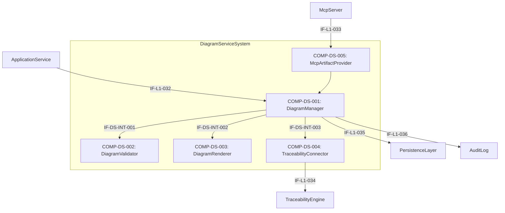

# L2 DiagramService Architecture

> **Level:** L2 (Subsystem white-box)
> **System:** DiagramServiceSystem (ARCH-L1-013)
> **Parent:** L1_Gesamtsystem_Architecture.md
> **Datum:** 2026-06-21
> **Status:** entworfen
> **Designation:** subsystem (white-box)
> **decomposition_status:** complete

---

## 1. Verantwortlichkeit

Das DiagramServiceSystem verwaltet Diagramme als eigenständige, versionierte Artefakte. Es ermöglicht Speicherung, Payload-Validierung und Rendern grafischer Modelle. Es stellt die Anbindung zur TraceabilityEngine und zum MCP-Server sicher.

---

## 2. Black-Box (Eingebettete Sicht)

### Externe Schnittstellen

| ID | Richtung | Gegenstelle | Typ | Vertrag |
|----|----------|-------------|-----|---------|
| IF-L1-032 | input | ApplicationService | control | `create_diagram`, `update_diagram`, `get_diagram`, `list_versions` |
| IF-L1-033 | input | McpServer | control | `artifact.get` für Diagramm-Artefakttyp |
| IF-L1-034 | output | TraceabilityEngine | data | TraceLink `documents` |
| IF-L1-035 | output | PersistenceLayer | data | Diagram-Entity, DiagramVersion-Entity |
| IF-L1-036 | output | AuditLog | data | Schreib-Operationen (delegiert via ApplicationService) |

---

## 3. White-Box (Komponenten-Zerlegung)

### Komponenten

| Komp-ID | Name | Verantwortlichkeit | Domain | REQ-Referenz |
|---------|------|--------------------|--------|--------------|
| COMP-DS-001 | DiagramManager | Koordiniert CRUD-Operationen, erzeugt unveränderliche Versionen und delegiert an untergeordnete Komponenten. | software | REQ-L2-DS-001 |
| COMP-DS-002 | DiagramValidator | Prüft den Diagramm-Payload auf Typspezifische Syntax (z.B. Mermaid). | software | REQ-L2-DS-002 |
| COMP-DS-003 | DiagramRenderer | Generiert die renderbare Repräsentation für das Frontend. | software | REQ-L2-DS-003 |
| COMP-DS-004 | TraceabilityConnector | Erzeugt TraceLinks vom Typ `documents` in der TraceabilityEngine. | software | REQ-L2-DS-004 |
| COMP-DS-005 | McpArtifactProvider | Adaptiert MCP `artifact.get` Anfragen und liefert strukturierte Diagrammdaten. | software | REQ-L2-DS-005 |

### Interne Schnittstellen

| ID | Richtung | Quelle -> Ziel | Typ | Vertrag |
|----|----------|----------------|-----|---------|
| IF-DS-INT-001 | intern | COMP-DS-001 -> COMP-DS-002 | In-Process Python | `validate_payload(type, content) -> bool` |
| IF-DS-INT-002 | intern | COMP-DS-001 -> COMP-DS-003 | In-Process Python | `prepare_renderable(type, content) -> RenderableDiagram` |
| IF-DS-INT-003 | intern | COMP-DS-001 -> COMP-DS-004 | In-Process Python | `create_document_link(diagram_id, target_id)` |

### Dependency-Graph (azyklisch)

Unidirektionaler Datenfluss von den Eingängen zu den Verarbeitern und Persistenz.

---

## 4. Zugeordnete REQ-L2

| REQ-L2 | Komponente(n) |
|--------|---------------|
| REQ-L2-DS-001 | COMP-DS-001 |
| REQ-L2-DS-002 | COMP-DS-002 |
| REQ-L2-DS-003 | COMP-DS-003 |
| REQ-L2-DS-004 | COMP-DS-004 |
| REQ-L2-DS-005 | COMP-DS-005 |

---

## 5. Interface-Belegung (IF-L1-032..036)

| Interface | Eigentuemerkomponente | Richtung | Zweck |
|-----------|----------------------|----------|-------|
| IF-L1-032 | COMP-DS-001 | input | ApplicationService CRUD Trigger |
| IF-L1-033 | COMP-DS-005 | input | MCP Tool Trigger |
| IF-L1-034 | COMP-DS-004 | output | TraceLink Persistenz |
| IF-L1-035 | COMP-DS-001 | output | Diagram Entity Persistenz |
| IF-L1-036 | COMP-DS-001 | output | Audit Logging |

---

## 6. ADRs (lokal)

**ADR-DS-01 — Entkopplung von Validator und Renderer**
*Entscheidung:* DiagramValidator und DiagramRenderer sind separate Komponenten.
*Rationale:* Validierung stellt die strukturelle Integrität sicher, bevor Daten überhaupt versioniert gespeichert werden, während Rendering erst bei Abruf für das UI erfolgt. Diese Trennung erlaubt, dass fehlerhafte Diagramme von vornherein abgelehnt werden, ohne Rendering-Logik zu belasten. Dies stellt sicher, dass REQ-L2-DS-002 und REQ-L2-DS-003 separat getestet und skaliert werden können.
*Verworfene Alternative:* Ein gemeinsamer Parser für Validierung und Rendering — abgelehnt, da sie auf unterschiedlichen Zeitpunkten des Lebenszyklus (Write vs. Read) arbeiten.

---

## 7. Decomposition Completeness

| Aspekt | Abdeckung |
|--------|-----------|
| Alle IF-L1-032..036 eingebunden | vollständig |
| Alle REQ-L2-DS-001..005 zugewiesen | vollständig |
| Azyklischer Dependency-Graph | nachgewiesen |

---

*Erstellt durch se-architect-Agent | ReqFlow SE-Kaskade L1→L2 | 2026-06-21*
*Handoff: HOFF-20260621-002 | Parent: ARCH-L1-013 | REQ-Quelle: REQ-L2-DS-001..005*
*Designation: subsystem (white-box) — decomposition_status: complete*
