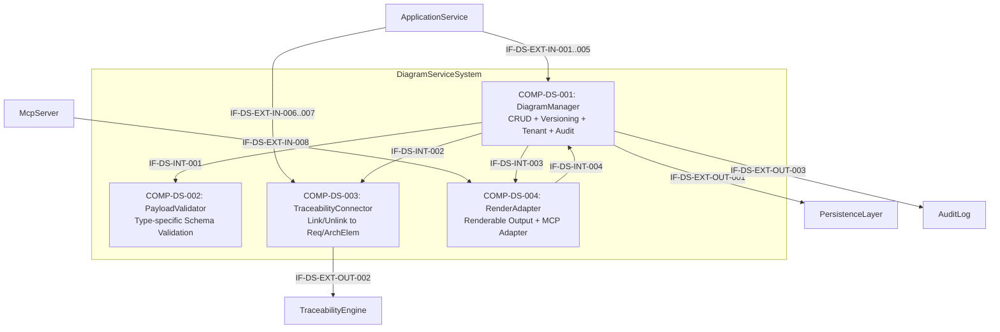

# L2 DiagramService Architecture

> **Level:** L2 (Subsystem white-box)
> **System:** DiagramServiceSystem (ARCH-L1-013)
> **Parent:** L1_Gesamtsystem_Architecture.md
> **Datum:** 2026-06-21
> **Status:** entworfen

---

## 1. Verantwortlichkeit

Verwaltet Diagramme (Blockdiagramm, Flussdiagramm, Kontextdiagramm — mindestens 3 Typen) als eigenstaendige, versionierte Artefakte mit strukturiertem Payload. Stellt Payload-Validierung, immutable Versionierungs-Logik und renderbare Darstellungen bereit. Verknuepft Diagramme via TraceabilityEngine mit Requirements und ArchitectureElements. Erfuellt Tenant-Isolation und ein Performance-SLA von 200 ms (p95) bei 10.000 DiagramVersions.

**Nicht im Scope:** Rendering zu Bilddateien (PNG/SVG) auf Server-Seite, Diagramm-Diff-Berechnung, direkte Schreibzugriffe anderer Subsysteme auf den PersistenceLayer (nur COMP-DS-001 schreibt).

---

## 2. Black-Box (Eingebettete Sicht)

### Externe Schnittstellen

| ID | Richtung | Gegenstelle | Typ | Vertrag |
|----|----------|-------------|-----|---------|
| IF-DS-EXT-IN-001 | eingehend | ApplicationService | In-Process Python | `create_diagram(type, payload, workspace_id, ctx) -> DiagramDTO` |
| IF-DS-EXT-IN-002 | eingehend | ApplicationService | In-Process Python | `update_diagram(diagram_id, payload, ctx) -> DiagramVersionDTO` — erzeugt neue unveraenderliche Version |
| IF-DS-EXT-IN-003 | eingehend | ApplicationService | In-Process Python | `get_diagram(diagram_id, version?, ctx) -> DiagramDTO` — aktuelle oder spezifische Version |
| IF-DS-EXT-IN-004 | eingehend | ApplicationService | In-Process Python | `list_versions(diagram_id, ctx) -> DiagramVersionDTO[]` |
| IF-DS-EXT-IN-005 | eingehend | ApplicationService | In-Process Python | `delete_diagram(diagram_id, ctx)` — Soft-Delete aller Versionen |
| IF-DS-EXT-IN-006 | eingehend | ApplicationService | In-Process Python | `link_artifact(diagram_id, artifact_id, target_type, ctx)` — TraceLink erzeugen; `target_type` unterscheidet `requirement` von `architecture_element` (Unterfunktion von IF-L1-032) |
| IF-DS-EXT-IN-007 | eingehend | ApplicationService | In-Process Python | `unlink_artifact(diagram_id, artifact_id, ctx)` — TraceLink loeschen (Unterfunktion von IF-L1-032) |
| IF-DS-EXT-IN-008 | eingehend | McpServer | MCP Protocol | `artifact.get(artifact_id, ctx) -> ArtifactPayload` — MCP-Artefaktabruf |
| IF-DS-EXT-OUT-001 | ausgehend | PersistenceLayer | Django ORM | Diagram-Entity, DiagramVersion-Entity lesen und schreiben (realisiert IF-L1-035) |
| IF-DS-EXT-OUT-002 | ausgehend | TraceabilityEngine | In-Process Python | TraceLink `documents` erzeugen/loeschen zwischen Diagramm und Requirement/ArchitectureElement (realisiert IF-L1-034) |
| IF-DS-EXT-OUT-003 | ausgehend | AuditLog | In-Process Python | Audit-Ereignisse fuer Create/Update/Delete/Link-Operationen (realisiert IF-L1-036) |

---

## 3. White-Box (Komponenten-Zerlegung)

### Komponenten

| Komp-ID | Name | Verantwortlichkeit | Domain |
|---------|------|--------------------|--------|
| COMP-DS-001 | DiagramManager | CRUD-Operationen (create, read, update, delete), immutable Versionierungs-Logik, Typ-Registrierung, UUID-Vergabe, Tenant-Isolation (workspace_id-Filter), exklusiver PersistenceLayer-Schreibzugriff (IF-DS-EXT-OUT-001), AuditLog-Integration (IF-DS-EXT-OUT-003) | software |
| COMP-DS-002 | PayloadValidator | Typ-spezifische Strukturvalidierung von Diagramm-Payloads vor Create/Update; Schema-Registry fuer mindestens 3 Typen (Blockdiagramm, Flussdiagramm, Kontextdiagramm); strukturierte Fehlermeldungen | software |
| COMP-DS-003 | TraceabilityConnector | link/unlink-Operationen zu Requirements und ArchitectureElements; Validierung der Diagram-UUID und des target_type vor Link-Erzeugung; Interaktion mit TraceabilityEngine via IF-DS-EXT-OUT-002 | software |
| COMP-DS-004 | RenderAdapter | Typ-spezifische Umwandlung des strukturierten Payloads in eine renderbare Darstellung (z. B. Mermaid-Syntax); MCP-Adapter fuer `artifact.get`; kein eigener Persistenzzugriff — liest Payload ueber COMP-DS-001 | software |

### Interne Schnittstellen

| ID | Richtung | Quelle -> Ziel | Typ | Vertrag |
|----|----------|----------------|-----|---------|
| IF-DS-INT-001 | intern | COMP-DS-001 -> COMP-DS-002 | In-Process Python | `validate(type, payload) -> ValidationResult` — aufgerufen vor Create/Update |
| IF-DS-INT-002 | intern | COMP-DS-001 -> COMP-DS-003 | In-Process Python | `link(diagram_id, artifact_id, target_type, ctx)` / `unlink(diagram_id, artifact_id, ctx)` |
| IF-DS-INT-003 | intern | COMP-DS-001 -> COMP-DS-004 | In-Process Python | `render(diagram_id, version?, ctx) -> RenderedRepresentation` — angefordert bei get_diagram und artifact.get |
| IF-DS-INT-004 | intern | COMP-DS-004 -> COMP-DS-001 | In-Process Python | `get_payload(diagram_id, version?, ctx) -> DiagramPayload` — RenderAdapter liest Payload lesend |

### Komponentendiagramm (Mermaid)

---

## 4. Zugeordnete REQ-L2

| REQ-L2 | Komponente |
|--------|-----------|
| REQ-L2-DS-001 | COMP-DS-001, COMP-DS-002, COMP-DS-004 |
| REQ-L2-DS-002 | COMP-DS-001 |
| REQ-L2-DS-003 | COMP-DS-001 |
| REQ-L2-DS-004 | COMP-DS-001 |
| REQ-L2-DS-005 | COMP-DS-001 |
| REQ-L2-DS-006 | COMP-DS-002 |
| REQ-L2-DS-007 | COMP-DS-001 |
| REQ-L2-DS-008 | COMP-DS-003 |
| REQ-L2-DS-009 | COMP-DS-004 |
| REQ-L2-DS-010 | COMP-DS-004 |
| REQ-L2-DS-011 | COMP-DS-001 |
| REQ-L2-DS-012 | COMP-DS-001 |
| REQ-L2-DS-013 | COMP-DS-001, COMP-DS-002, COMP-DS-004 |

---

## 5. Designentscheidungen

| ID | Entscheidung | Begruendung |
|----|-------------|-----------|
| ADR-DS-01 | Vier Komponenten (Manager, Validator, TraceConnector, RenderAdapter) statt monolithischer DiagramService-Klasse | CRUD/Versionierung (schreibend), Validierung (zustandslos), Traceability (externe Integration) und Rendering (Transformation) haben orthogonale Zugriffsmuster und Aenderungsgruende. SRP wird pro Komponente eingehalten. |
| ADR-DS-02 | Exklusiver PersistenceLayer-Schreibzugriff durch COMP-DS-001 | Verhindert konkurrierende Schreibpfade und erlaubt zentrale Tenant-Isolation-Pruefung an einer einzigen Stelle. Verworfene Alternative: Direktzugriff durch RenderAdapter — abgelehnt wegen Umgehung der Tenant-Pruefstufe. |
| ADR-DS-03 | TraceabilityConnector als eigenstaendige Komponente | TraceabilityEngine ist ein unabhaengiges Subsystem; die Kopplung wird in COMP-DS-003 isoliert. DiagramManager kennt TraceabilityEngine nicht direkt und bleibt unabhaengig testbar. Verworfene Alternative: TraceLink-Erzeugung direkt in DiagramManager — abgelehnt wegen Kopplung zweier unabhaengiger Fachdomaenen. |
| ADR-DS-04 | Immutable Versioning: jede update_diagram-Operation erzeugt eine neue DiagramVersion-Entitaet | Entspricht dem Audit-First-Prinzip des Gesamtsystems; historische Versionen bleiben navigierbar. Verworfene Alternative: Mutable In-Place-Update — abgelehnt, da Versionierbarkeit (REQ-L2-DS-004, REQ-L2-DS-007) verloren geht. |
| ADR-DS-05 | RenderAdapter liest Payload lesend ueber DiagramManager (IF-DS-INT-004) | Stellt sicher, dass Tenant-Pruefung und Version-Lookup immer durch COMP-DS-001 laufen. Verworfene Alternative: RenderAdapter greift direkt auf PersistenceLayer zu — abgelehnt wegen Umgehung der Tenant-Isolation. |
| ADR-DS-06 | link_artifact mit explizitem target_type-Parameter | target_type unterscheidet requirement von architecture_element und ermooglicht typsichere TraceLink-Erzeugung in COMP-DS-003. IF-DS-EXT-IN-006/007 sind Unterfunktionen von IF-L1-032 (kein eigener L1-Interface-Eintrag benoetigt). |

---

## 6. Termination

**Designation:** terminal (component-level — keine L3-Zerlegung)

**Begruendung:** Alle 4 Komponenten sind funktional kohaerent und haben je maximal 4 interne/externe Schnittstellen. Jede Komponente ist auf eine klar abgegrenzte Verantwortlichkeit beschraenkt (SRP erfullt). Weitere Zerlegung wuerde Kommunikations-Overhead erzeugen, ohne Komplexitaet zu reduzieren.

---

*Erstellt durch se-architect-Agent | ReqFlow SE-Kaskade | 2026-06-21*
*Korrigiert durch se-critic-Agent (Iteration 1): IF-DS-EXT-OUT-001/002 Nummerierung auf Requirements-Definition angeglichen; IF-DS-EXT-IN-006 target_type-Parameter dokumentiert; ADR-DS-06 ergaenzt*
