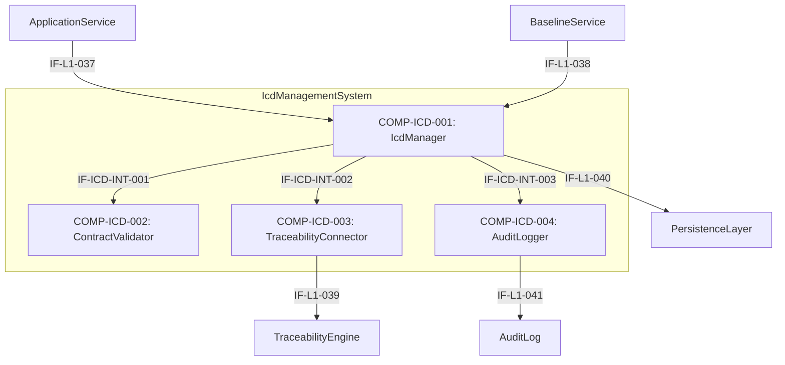

# L2 IcdManagement Architecture

> **Level:** L2 (Subsystem white-box)
> **System:** IcdManagementSystem (ARCH-L1-014)
> **Parent:** L1_Gesamtsystem_Architecture.md
> **Datum:** 2026-06-21
> **Status:** entworfen
> **Designation:** subsystem (white-box)
> **decomposition_status:** complete

---

## 1. Verantwortlichkeit

Das IcdManagementSystem verwaltet Schnittstellen zwischen ArchitectureElements als versionierte Interface Control Documents (ICDs). Es setzt Design-by-Contract durch, prüft Änderungen auf Kompatibilität, meldet Breaking-Change-Warnungen und integriert sich in die Baseline-Erstellung.

---

## 2. Black-Box (Eingebettete Sicht)

### Externe Schnittstellen

| ID | Richtung | Gegenstelle | Typ | Vertrag |
|----|----------|-------------|-----|---------|
| IF-L1-037 | input | ApplicationService | control | `create_icd`, `update_icd`, `validate_compatibility`, `get_icd_history` |
| IF-L1-038 | input | BaselineService | control | `get_icd_versions(workspace_id)` |
| IF-L1-039 | output | TraceabilityEngine | data | TraceLink `realizes` zwischen ICD und ArchitectureElement |
| IF-L1-040 | output | PersistenceLayer | data | Icd-Entity, IcdVersion-Entity (immutable) |
| IF-L1-041 | output | AuditLog | data | Breaking-Change-Events an AuditLog |

---

## 3. White-Box (Komponenten-Zerlegung)

### Komponenten

| Komp-ID | Name | Verantwortlichkeit | Domain | REQ-Referenz |
|---------|------|--------------------|--------|--------------|
| COMP-ICD-001 | IcdManager | Koordiniert CRUD-Operationen, garantiert Unveränderlichkeit von ICD-Versionen und integriert Snapshot-Abfragen für die Baseline. | software | REQ-L2-ICD-001, REQ-L2-ICD-005 |
| COMP-ICD-002 | ContractValidator | Setzt Design-by-Contract-Modell um (Pre/Post/Invarianten) und führt semantische Kompatibilitätsprüfungen zur Erkennung von Breaking Changes durch. | software | REQ-L2-ICD-002, REQ-L2-ICD-003 |
| COMP-ICD-003 | TraceabilityConnector | Erzeugt TraceLinks vom Typ `realizes` in der TraceabilityEngine bei ICD-Erstellung/Aktualisierung. | software | REQ-L2-ICD-004 |
| COMP-ICD-004 | AuditLogger | Übermittelt erkannte Breaking-Change-Events als auditierbare Protokolle an das externe AuditLog. | software | REQ-L2-ICD-006 |

### Interne Schnittstellen

| ID | Richtung | Quelle -> Ziel | Typ | Vertrag |
|----|----------|----------------|-----|---------|
| IF-ICD-INT-001 | intern | COMP-ICD-001 -> COMP-ICD-002 | In-Process Python | `validate_contract(old_version, new_version) -> ValidationResult` |
| IF-ICD-INT-002 | intern | COMP-ICD-001 -> COMP-ICD-003 | In-Process Python | `link_to_architecture(icd_id, source_id, target_id)` |
| IF-ICD-INT-003 | intern | COMP-ICD-001 -> COMP-ICD-004 | In-Process Python | `log_breaking_change(icd_id, details)` |

### Dependency-Graph (azyklisch)

Unidirektionaler Datenfluss von den Eingängen zu den Verarbeitern und Persistenz.

---

## 4. Zugeordnete REQ-L2

| REQ-L2 | Komponente(n) |
|--------|---------------|
| REQ-L2-ICD-001 | COMP-ICD-001 |
| REQ-L2-ICD-002 | COMP-ICD-002 |
| REQ-L2-ICD-003 | COMP-ICD-002 |
| REQ-L2-ICD-004 | COMP-ICD-003 |
| REQ-L2-ICD-005 | COMP-ICD-001 |
| REQ-L2-ICD-006 | COMP-ICD-004 |

---

## 5. Interface-Belegung (IF-L1-037..041)

| Interface | Eigentuemerkomponente | Richtung | Zweck |
|-----------|----------------------|----------|-------|
| IF-L1-037 | COMP-ICD-001 | input | ApplicationService CRUD Trigger |
| IF-L1-038 | COMP-ICD-001 | input | Baseline Snapshot Abfrage |
| IF-L1-039 | COMP-ICD-003 | output | TraceLink Persistenz |
| IF-L1-040 | COMP-ICD-001 | output | ICD Entity Persistenz |
| IF-L1-041 | COMP-ICD-004 | output | Breaking Change Audit Logging |

---

## 6. ADRs (lokal)

**ADR-ICD-01 — Isolation der Vertragsvalidierung in ContractValidator**
*Entscheidung:* Der Vergleich von Vorbedingungen, Nachbedingungen und Invarianten zwischen zwei ICD-Versionen zur Erkennung von Breaking Changes ist in die Komponente ContractValidator gekapselt.
*Rationale:* Diese Prüfung ist semantisch komplex (Design-by-Contract). Durch Auslagerung bleibt der IcdManager fokussiert auf Versionierung, Persistenz und Baseline-Abfragen. Die Trennung stellt sicher, dass die komplexe Kompatibilitätslogik unabhängig testbar ist.
*Verworfene Alternative:* Kompatibilitätsprüfung als private Methode innerhalb des IcdManager — abgelehnt, da dies die Kohäsion des IcdManager verletzen würde und Unit-Tests der Kompatibilitätsregeln unnötig mit Persistenz-Mocking verknüpfen würde.

---

## 7. Decomposition Completeness

| Aspekt | Abdeckung |
|--------|-----------|
| Alle IF-L1-037..041 eingebunden | vollständig |
| Alle REQ-L2-ICD-001..006 zugewiesen | vollständig |
| Azyklischer Dependency-Graph | nachgewiesen |

---

*Erstellt durch se-architect-Agent | ReqFlow SE-Kaskade L1→L2 | 2026-06-21*
*Handoff: HOFF-20260621-002 | Parent: ARCH-L1-014 | REQ-Quelle: REQ-L2-ICD-001..006*
*Designation: subsystem (white-box) — decomposition_status: complete*
