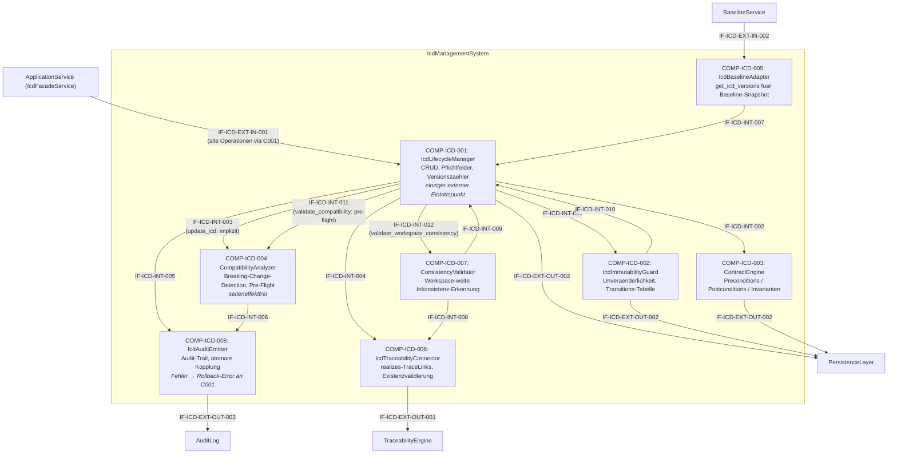
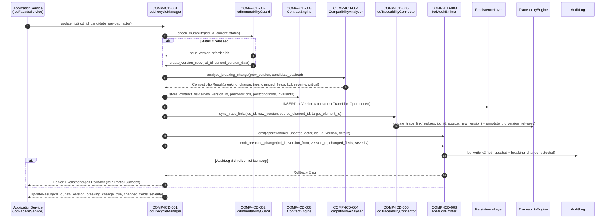

# L2 IcdManagement Architecture

> **Level:** L2 (Subsystem white-box)
> **System:** IcdManagementSystem (ARCH-L1-014)
> **Parent:** L1_Gesamtsystem_Architecture.md
> **Datum:** 2026-06-21
> **Status:** entworfen
> **Revision:** 2026-06-21 (se-critic-Audit HOFF-20260621-004 — F-01/F-02 Diagramm-Kapselung, F-04 ADR-Praezisierung)

---

## 1. Verantwortlichkeit

Verwaltung von Interface Control Documents (ICDs) zwischen ArchitectureElements als versionierte, unveraenderliche Schnittstellenvertraege. Enforces Design-by-Contract (Preconditions, Postconditions, Invarianten), erkennt semantische Breaking Changes bei ICD-Aktualisierungen, stellt ICD-Versionen fuer Baseline-Snapshots bereit, verankert ICDs via TraceLinks im Traceability-Graphen und protokolliert alle schreibenden Operationen im AuditLog.

---

## 2. Black-Box (Eingebettete Sicht)

### Externe Schnittstellen

| ID | Richtung | Gegenstelle | Typ | Vertrag |
|----|----------|-------------|-----|---------|
| IF-ICD-EXT-IN-001 | eingehend | ApplicationService (IcdFacadeService) | In-Process | `create_icd`, `update_icd`, `validate_compatibility`, `get_icd`, `get_icd_history`, `list_icds`, `transition`, `validate_workspace_consistency` — alle Operationen laufen durch COMP-ICD-001 als einzigen Eintrittspunkt |
| IF-ICD-EXT-IN-002 | eingehend | BaselineService | In-Process | `get_icd_versions(workspace_id)` — vollstaendige ICD-Versionsobjekte fuer Snapshot-Inklusion |
| IF-ICD-EXT-OUT-001 | ausgehend | TraceabilityEngine | In-Process | TraceLink `realizes` (ICD → source_element_id, ICD → target_element_id); historische Links mit `version_ref`-Annotation |
| IF-ICD-EXT-OUT-002 | ausgehend | PersistenceLayer | In-Process (ORM) | Icd-Entity, IcdVersion-Entity (immutable nach release); atomare Transaktionen |
| IF-ICD-EXT-OUT-003 | ausgehend | AuditLog | In-Process | `log_write(actor, op, icd_id, version, details)` fuer alle schreibenden Operationen und Breaking-Change-Events |

---

## 3. White-Box (Komponenten-Zerlegung)

### Komponenten

| Komp-ID | Name | Verantwortlichkeit | Domain |
|---------|------|--------------------|--------|
| COMP-ICD-001 | IcdLifecycleManager | Einziger Eintrittspunkt fuer alle externen Aufrufe ueber IF-ICD-EXT-IN-001. Verantwortlich fuer ICD-CRUD (Erstellen, Lesen, Auflisten), Pflichtfeld-Validierung (UUID, source_element_id, target_element_id, direction, interface_type, title, description), Version-Initialisierung (version=1 bei create), Versionszaehler-Inkrementierung bei Update. Delegiert intern: validate_compatibility an COMP-ICD-004, validate_workspace_consistency an COMP-ICD-007. | software |
| COMP-ICD-002 | IcdImmutabilityGuard | Enforcement der Unveraenderlichkeit freigegebener ICD-Versionen; Status-Transitions-Tabelle (draft→released, released→deprecated, released→draft als neue Version); Ablehnung direkter Mutations auf released-Versionen; Warnung bei Referenzierung deprecated ICDs | software |
| COMP-ICD-003 | ContractEngine | Speicherung und Retrieval von Design-by-Contract-Feldern (preconditions, postconditions, invariants als Listen von Zeichenketten); optionale Felder mit leerem-Listen-Default; keine syntaktische Inhaltsvalidierung; Erhalt der DbC-Felder in der Versionshistorie | software |
| COMP-ICD-004 | CompatibilityAnalyzer | Semantische Breaking-Change-Detection beim ICD-Update (Vergleich direction, interface_type, preconditions, invariants, source_element_id, target_element_id); Klassifikation nach Schweregrad (critical/warning); explizite Pre-Flight-Operation `validate_compatibility` ohne Persistierung; seiteneffektfrei (kein direktes Schreiben, kein direktes Audit-Logging) | software |
| COMP-ICD-005 | IcdBaselineAdapter | Bereitstellung von `get_icd_versions(workspace_id)` fuer BaselineService; Aggregation aller aktuellen ICD-Versionsobjekte mit vollstaendigem Feldinhalt (icd_id, version, status, direction, interface_type, preconditions, postconditions, invariants) | software |
| COMP-ICD-006 | IcdTraceabilityConnector | Erzeugung und Pflege von `realizes`-TraceLinks zwischen ICD und source/target ArchitectureElement; Validierung der Existenz von source_element_id und target_element_id vor ICD-Erstellung; Versionierungsannotation historischer Links (`version_ref`) | software |
| COMP-ICD-007 | ConsistencyValidator | Workspace-weite Konsistenzpruefung; Erkennung von direction-Konflikten, verwaisten ICDs (referenzierte ArchitectureElements nicht mehr existent), deprecated ICDs mit aktivem TraceLink; strukturierter Inkonsistenz-Bericht mit icd_id, inconsistency_type, description | software |
| COMP-ICD-008 | IcdAuditEmitter | Audit-Trail-Ausgabe fuer alle schreibenden ICD-Operationen (create, update, transition, deprecate) und Breaking-Change-Events; stellt sicher, dass kein schreibender Vorgang ohne korrespondierenden AuditLog-Eintrag abgeschlossen wird; bei Fehler beim AuditLog-Schreiben signalisiert IcdAuditEmitter einen Rollback-Error an IcdLifecycleManager, der die gesamte Transaktion abbricht — kein Partial-Success-Modus | software |

### Interne Schnittstellen

| ID | Richtung | Quelle -> Ziel | Typ | Vertrag |
|----|----------|----------------|-----|---------|
| IF-ICD-INT-001 | intern | COMP-ICD-001 -> COMP-ICD-002 | In-Process | `check_mutability(icd_id, current_status)` → erlaubt/abgelehnt + neues Versionsobjekt bei released |
| IF-ICD-INT-002 | intern | COMP-ICD-001 -> COMP-ICD-003 | In-Process | `store_contract_fields(icd_version_id, preconditions, postconditions, invariants)` / `load_contract_fields(icd_version_id)` |
| IF-ICD-INT-003 | intern | COMP-ICD-001 -> COMP-ICD-004 | In-Process | `analyze_breaking_change(previous_version, candidate_payload)` → `CompatibilityResult` |
| IF-ICD-INT-004 | intern | COMP-ICD-001 -> COMP-ICD-006 | In-Process | `sync_trace_links(icd_id, version, source_element_id, target_element_id)` |
| IF-ICD-INT-005 | intern | COMP-ICD-001 -> COMP-ICD-008 | In-Process | `emit(operation, actor, icd_id, version, details)` |
| IF-ICD-INT-006 | intern | COMP-ICD-004 -> COMP-ICD-008 | In-Process | `emit_breaking_change(icd_id, version_from, version_to, changed_fields, severity)` — wird von COMP-ICD-001 nach Breaking-Change-Detection ausgeloest, nicht direkt von COMP-ICD-004 |
| IF-ICD-INT-007 | intern | COMP-ICD-005 -> COMP-ICD-001 | In-Process | `query_current_versions(workspace_id)` → Liste von IcdVersion-Objekten |
| IF-ICD-INT-008 | intern | COMP-ICD-007 -> COMP-ICD-006 | In-Process | `query_active_trace_links(workspace_id)` → aktive `realizes`-Links fuer Konsistenzpruefung |
| IF-ICD-INT-009 | intern | COMP-ICD-007 -> COMP-ICD-001 | In-Process | `query_all_icds(workspace_id)` → alle Icd-Entitaeten mit aktuellem Status |
| IF-ICD-INT-010 | intern | COMP-ICD-002 -> COMP-ICD-001 | In-Process | `create_version_copy(icd_id, current_version_data)` → neue IcdVersion mit inkrementiertem Zaehler |
| IF-ICD-INT-011 | intern | COMP-ICD-001 -> COMP-ICD-004 | In-Process | `run_preflight_check(icd_id, candidate_payload)` → CompatibilityResult ohne Persistierung — wird fuer die explizite validate_compatibility-Operation verwendet (REQ-L2-ICD-006); identische Logik wie IF-ICD-INT-003, separates Aufrufsignal kennzeichnet No-Write-Kontext |
| IF-ICD-INT-012 | intern | COMP-ICD-001 -> COMP-ICD-007 | In-Process | `run_consistency_check(workspace_id)` → strukturierter Inkonsistenz-Bericht — wird fuer validate_workspace_consistency-Operation verwendet (REQ-L2-ICD-009) |

### Komponentendiagramm (Mermaid)

---

## 4. Interface-Mapping: Externe Schnittstellen → Besitzende Komponenten

| Externe Schnittstelle | Besitzende Komponente(n) |
|-----------------------|--------------------------|
| IF-ICD-EXT-IN-001 (ApplicationService → alle ICD-Operationen) | COMP-ICD-001 (einziger Eintrittspunkt; delegiert intern validate_compatibility an COMP-ICD-004 via IF-ICD-INT-011, validate_workspace_consistency an COMP-ICD-007 via IF-ICD-INT-012) |
| IF-ICD-EXT-IN-002 (BaselineService → get_icd_versions) | COMP-ICD-005 |
| IF-ICD-EXT-OUT-001 (→ TraceabilityEngine: realizes-Links) | COMP-ICD-006 |
| IF-ICD-EXT-OUT-002 (→ PersistenceLayer: Entitaeten) | COMP-ICD-001, COMP-ICD-002, COMP-ICD-003 |
| IF-ICD-EXT-OUT-003 (→ AuditLog: Audit-Eintraege) | COMP-ICD-008 |

---

## 5. Traceability: REQ-L2-ICD → Komponenten

| REQ-L2-ICD | Primaere Komponente(n) | Mitwirkende Komponente(n) |
|------------|------------------------|---------------------------|
| REQ-L2-ICD-001 (ICD CRUD + Metadaten) | COMP-ICD-001 | COMP-ICD-008 |
| REQ-L2-ICD-002 (Unveraenderlichkeit released) | COMP-ICD-002 | COMP-ICD-001, COMP-ICD-008 |
| REQ-L2-ICD-003 (Lebenszyklusstatus draft/released/deprecated) | COMP-ICD-002 | COMP-ICD-001, COMP-ICD-008 |
| REQ-L2-ICD-004 (Design-by-Contract Felder) | COMP-ICD-003 | COMP-ICD-001 |
| REQ-L2-ICD-005 (Breaking-Change-Detection bei Update) | COMP-ICD-004 | COMP-ICD-001, COMP-ICD-008 |
| REQ-L2-ICD-006 (validate_compatibility Pre-Flight) | COMP-ICD-004 | COMP-ICD-001 (Routing via IF-ICD-INT-011) |
| REQ-L2-ICD-007 (realizes-TraceLinks) | COMP-ICD-006 | COMP-ICD-001, COMP-ICD-008 |
| REQ-L2-ICD-008 (Baseline-Faehigkeit get_icd_versions) | COMP-ICD-005 | COMP-ICD-001 |
| REQ-L2-ICD-009 (Workspace-Konsistenzpruefung) | COMP-ICD-007 | COMP-ICD-006, COMP-ICD-001 (Routing via IF-ICD-INT-012) |
| REQ-L2-ICD-010 (Audit-Trail) | COMP-ICD-008 | COMP-ICD-001, COMP-ICD-004 |
| REQ-L2-ICD-011 (Atomare Persistierung, ACID) | COMP-ICD-001, COMP-ICD-008 | COMP-ICD-006, COMP-ICD-002 |
| REQ-L2-ICD-012 (Performance-Anforderungen) | COMP-ICD-001, COMP-ICD-005 | COMP-ICD-007 |

---

## 6. Schluesselsequenz: ICD-Update mit Breaking Change

Das folgende Sequenzdiagramm zeigt den kritischsten Flow — eine ICD-Aktualisierung, die einen Breaking Change ausloest.

---

## 7. ADRs (lokal)

**ADR-ICD-01 — Acht Komponenten statt monolithischem IcdService**

*Entscheidung:* IcdLifecycleManager, IcdImmutabilityGuard, ContractEngine, CompatibilityAnalyzer, IcdBaselineAdapter, IcdTraceabilityConnector, ConsistencyValidator und IcdAuditEmitter als eigenstaendige Komponenten.

*Rationale:* Das IcdManagementSystem verbindet fuenf orthogonale Verantwortlichkeiten (Lifecycle, Unveraenderlichkeit, DbC-Speicherung, Kompatibilitaetsanalyse, Traceability), die alle in Kombination auftreten, aber jeweils eigene Invarianten und Testbarkeitsanforderungen haben. Ein Monolith wuerden CompatibilityAnalyzer (rein funktionale Vergleichslogik, keine Seiteneffekte) mit IcdAuditEmitter (IO-intensiv, transaktionskritisch) vermengen — das verhindert Unit-Testisolation und erleichtert kein selektives Mocking.

*Verworfene Alternative:* Drei-Komponenten-Modell (LifecycleManager + CompatibilityEngine + Store) — abgelehnt, weil Audit-Kopplung, Traceability-Sync und Baseline-Export orthogonale Querschnittsverantwortlichkeiten sind, die in keiner der drei Komponenten nativerweise residieren.

---

**ADR-ICD-02 — IcdImmutabilityGuard als eigenstaendige Komponente**

*Entscheidung:* Unveraenderlichkeitsdurchsetzung und Transitions-Tabelle in einer dedizierten Komponente, nicht als Bedingungspfad im IcdLifecycleManager.

*Rationale:* Die Transitions-Tabelle (draft→released, released→deprecated, released→draft als neue Version) ist eine eigenstaendige Geschaeftsregel mit eigener Evolierbarkeit — z.B. koennte eine kuenftige Anforderung neue Zustaende (z.B. `archived`) einfuehren, ohne den LifecycleManager zu aendern. Trennung erleichtert die formale Verifikation der Zustandsmaschine (alle erlaubten und verbotenen Uebergaenge sind in einer Komponente lokalisiert).

*Verworfene Alternative:* Status-Checks im IcdLifecycleManager inline — abgelehnt wegen SRP-Verletzung und erschwerter Erweiterbarkeit.

---

**ADR-ICD-03 — CompatibilityAnalyzer ist seiteneffektfrei**

*Entscheidung:* CompatibilityAnalyzer fuehrt ausschliesslich Vergleichslogik durch, kein Persistieren, kein direktes Audit-Logging.

*Rationale:* `validate_compatibility` (REQ-L2-ICD-006) muss als reine Pre-Flight-Operation nutzbar sein, ohne Datenbankzugriffe oder Nebenwirkungen auszuloesen. Indem CompatibilityAnalyzer seiteneffektfrei bleibt, kann dieselbe Komponente sowohl fuer `validate_compatibility` (kein Schreiben, via IF-ICD-INT-011) als auch fuer den impliziten Breaking-Change-Check bei `update_icd` (via IF-ICD-INT-003) genutzt werden. Das Routing beider Operationen erfolgt ausschliesslich ueber COMP-ICD-001 — externe Aufrufer sehen nur IF-ICD-EXT-IN-001. Das Emittieren des Audit-Events delegiert COMP-ICD-001 nach Empfang des CompatibilityResult an COMP-ICD-008 via IF-ICD-INT-005.

*Verworfene Alternative:* CompatibilityAnalyzer schreibt direkt in AuditLog — abgelehnt wegen Verletzung der Seiteneffektfreiheit und erschwerter Testisolation.

---

**ADR-ICD-04 — Atomare Transaktionsgrenzen ueber Komponenten hinweg**

*Entscheidung:* IcdLifecycleManager koordiniert die atomare Transaktion fuer alle beteiligten Operationen (IcdVersion-INSERT, TraceLink-Sync, AuditLog-Emit). Bei Fehler des AuditLog-Schreibens bricht die gesamte Transaktion ab (kein Partial-Success).

*Rationale:* REQ-L2-ICD-011 fordert vollstaendiges Rollback bei Fehler in einem Teilschritt. REQ-L2-ICD-010 fordert, dass kein schreibender Vorgang ohne korrespondierenden AuditLog-Eintrag abgeschlossen werden kann. Diese beiden Anforderungen zusammen erzwingen: Schlaegt COMP-ICD-008 (IcdAuditEmitter) beim Schreiben in den AuditLog fehl, signalisiert er einen Rollback-Error an COMP-ICD-001. COMP-ICD-001 bricht die Transaktion ab und gibt einen Fehler an den Aufrufer zurueck. Das Ergebnis ist atomar: Entweder alle Teilschritte (IcdVersion, TraceLinks, AuditLog) schreiben erfolgreich, oder keiner schreibt. Da IcdLifecycleManager der orchestrierende Eintrittspunkt ist, haelt er die Transaktionsgrenze — alle ausgehenden Aufrufe zu COMP-ICD-006 (TraceabilityConnector) und COMP-ICD-008 (AuditEmitter) werden innerhalb derselben Transaktion ausgefuehrt.

*Verworfene Alternative:* Verteilte Saga-Kompensation — abgelehnt wegen Overengineering fuer einen In-Process-Kontext; atomare Transaktionen genuegen hier.

*Verworfene Alternative:* Partial-Success (ICD geschrieben, Audit optional) — abgelehnt, da REQ-L2-ICD-010 explizit "kein schreibender Vorgang ohne AuditLog-Eintrag" fordert.

---

**ADR-ICD-05 — IcdLifecycleManager als einziger externer Eintrittspunkt**

*Entscheidung:* Alle externen Aufrufe ueber IF-ICD-EXT-IN-001 laufen ausschliesslich durch COMP-ICD-001 (IcdLifecycleManager). COMP-ICD-001 delegiert intern validate_compatibility an COMP-ICD-004 (via IF-ICD-INT-011) und validate_workspace_consistency an COMP-ICD-007 (via IF-ICD-INT-012).

*Rationale:* Das IcdManagementSystem ist nach aussen eine Black Box mit genau einem Eintrittspunkt fuer den ApplicationService. Direkte externe Kanten zu COMP-ICD-004 oder COMP-ICD-007 wuerden erfordern, dass der ApplicationService (IcdFacadeService) Kenntnis ueber die interne Komponentenstruktur hat — das verletzt das Kapselungsprinzip und erhoeh die Kopplung zwischen A004 und A014. Durch das Routing aller Operationen ueber COMP-ICD-001 bleibt die interne Zerlegung veraenderbar, ohne die externe Schnittstelle zu aendern.

*Verworfene Alternative:* Direkte externe Kanten zu COMP-ICD-004 und COMP-ICD-007 — abgelehnt wegen Kapselungsverletzung und erhoehter Kopplung zwischen ApplicationService und internen IcdManagement-Komponenten.

---

*Erstellt durch se-architect-Agent | ReqFlow SE-Kaskade L1→L2 | 2026-06-21*
*Revidiert durch se-critic-Agent | Audit HOFF-20260621-004 | 2026-06-21*
*Abgeleitet von: REQ-L1-028 (ARCH-L1-014 IcdManagement), REQ-L2-ICD-001..012*
*Designation: LEAF (terminal, keine L3-Zerlegung)*
