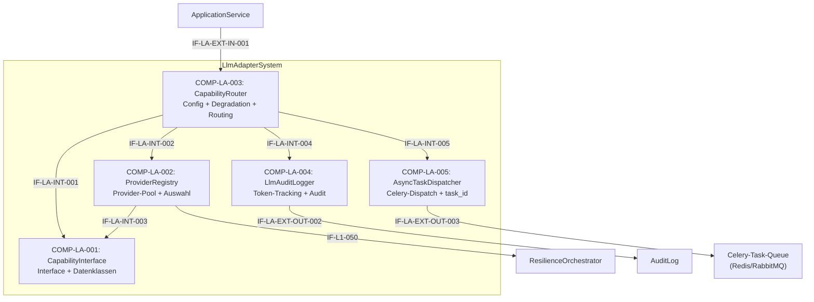

# L2 LlmAdapter Architecture

> **Level:** L2 (Subsystem white-box)
> **System:** LlmAdapterSystem (ARCH-L1-009)
> **Parent:** L1_Gesamtsystem_Architecture.md
> **Datum:** 2026-06-20
> **Status:** entworfen

---

## 1. Verantwortlichkeit

Provider-agnostische LLM-Abstraktionsschicht. Stellt stabile interne Schnittstelle (`LlmCapabilityInterface`) mit drei Operationen bereit: `validate_artifact`, `decompose_requirement`, `check_consistency`. Provider-Implementierungen (Anthropic, OpenAI, Ollama, Azure) sind austauschbar. Bei fehlender Konfiguration: graceful Degradation mit strukturiertem Fehler.

---

## 2. Black-Box (Eingebettete Sicht)

### Externe Schnittstellen

| ID | Richtung | Gegenstelle | Typ | Vertrag |
|----|----------|-------------|-----|---------|
| IF-LA-EXT-IN-001 | eingehend | ApplicationService | In-Process Python | `execute_capability(capability_name, **kwargs) -> LlmResult` |
| IF-L1-050 | ausgehend | ResilienceOrchestrator | API / In-Process | Provider-spezifische API-Aufrufe (HTTP-Requests) inkl. Retry-Logik |
| IF-LA-EXT-OUT-002 | ausgehend | AuditLog | In-Process Python | LLM-Aufruf-Audit-Eintrag |
| IF-LA-EXT-OUT-003 | ausgehend | Celery-Task-Queue (Redis/RabbitMQ) | Message Queue | `dispatch_task(capability, kwargs) -> task_id`; `get_task_status(task_id) -> TaskStatusResult` |

---

## 3. White-Box (Komponenten-Zerlegung)

### Komponenten

| Komp-ID | Name | Verantwortlichkeit | Domain |
|---------|------|--------------------|--------|
| COMP-LA-001 | CapabilityInterface | Stabile abstrakte Schnittstelle (`LlmCapabilityInterface`) mit drei Operationen; standardisierte Ergebnisdatenklassen (`LlmResult`, `LlmDecompositionResult`, `LlmConsistencyResult`) | software |
| COMP-LA-002 | ProviderRegistry | Sammlung der austauschbaren Provider-Implementierungen; Provider-Auswahl basierend auf Deployment-Config; leitet ausgehende Requests an den ResilienceOrchestrator (IF-L1-050) weiter statt direkt HTTPS aufzurufen | software |
| COMP-LA-003 | CapabilityRouter | Zentraler Einstiegspunkt fuer LLM-Aufrufe; Capability-Aktivierung/Deaktivierung; Graceful Degradation bei fehlender Konfiguration oder Provider-Fehlern; Routing-Entscheidung sync vs. async: `validate_artifact` → synchron; `decompose_requirement`, `check_consistency` → Celery-Task-Dispatch mit sofortiger task_id-Rueckgabe | software |
| COMP-LA-004 | LlmAuditLogger | Audit-Logging fuer jeden LLM-Aufruf (erfolgreich oder fehlgeschlagen); Token-Verbrauch aus Provider-Responses extrahieren | software |
| COMP-LA-005 | AsyncTaskDispatcher | Dispatcht LLM-Langlaeufer (`decompose_requirement`, `check_consistency`) als Celery-Tasks in Queue (IF-LA-EXT-OUT-003); gibt sofort `task_id` zurueck; stellt `get_task_status(task_id)` bereit; verwaltet Task-Ergebnisse im Celery Result-Backend; bei Task-Fehler: Ergebnis als `{status: "failed", error: "..."}` speichern | software |

### Interne Schnittstellen

| ID | Richtung | Quelle -> Ziel | Typ | Vertrag |
|----|----------|----------------|-----|---------|
| IF-LA-INT-001 | intern | COMP-LA-003 -> COMP-LA-001 | In-Process Python | `execute_capability(capability_name, **kwargs)` |
| IF-LA-INT-002 | intern | COMP-LA-003 -> COMP-LA-002 | In-Process Python | `get_provider() -> LlmCapabilityInterface-Instanz` |
| IF-LA-INT-003 | intern | COMP-LA-002 -> COMP-LA-001 | Vererbung | Klassenimplementierung (`validate_artifact`, `decompose_requirement`, `check_consistency`) |
| IF-LA-INT-004 | intern | COMP-LA-003 -> COMP-LA-004 | In-Process Python | `log_llm_call(provider, capability, artifact_id, token_usage, success, error)` |
| IF-LA-INT-005 | intern | COMP-LA-003 -> COMP-LA-005 | In-Process Python | Dispatch-Anfrage fuer async-faehige Capabilities: `dispatch_async(capability, kwargs) -> task_id` |

### Komponentendiagramm (Mermaid)

---

## 4. Zugeordnete REQ-L2

| REQ-L2 | Komponente |
|--------|-----------|
| REQ-L2-LA-001 | COMP-LA-001, COMP-LA-002 |
| REQ-L2-LA-002 | COMP-LA-003 |
| REQ-L2-LA-003 | COMP-LA-003 |
| REQ-L2-LA-004 | COMP-LA-001 |
| REQ-L2-LA-005 | COMP-LA-002, COMP-LA-003 |
| REQ-L2-LA-006 | COMP-LA-004 |
| REQ-L2-LA-007 | COMP-LA-002 |
| REQ-L2-LA-008 | COMP-LA-005 |

---

## 5. ADRs (lokal)

**ADR-LA-01 — L2-Whitebox mit 5 orthogonalen Komponenten**
*Entscheidung:* `CapabilityInterface`, `ProviderRegistry`, `CapabilityRouter`, `LlmAuditLogger` und `AsyncTaskDispatcher` als separate Komponenten.
*Rationale:* Trennt Vertrag-Modell (Interface + Datenklassen) von Implementierung (Provider-Pool), Konfiguration/Degradation (Router), Audit-Concerns und asynchroner Ausführung (Dispatcher). Ermoeglicht Plugin-Faehigkeit der Provider und unabhaengige Testbarkeit.
*Verworfene Alternative:* Monolithischer LlmAdapter ohne interne Zerlegung — abgelehnt wegen verschleierter Plugin-Faehigkeit und schlechter Testbarkeit.

**ADR-LA-03 — Celery fuer LLM-Langlaeufer statt synchronem WSGI-Call**
*Entscheidung:* `decompose_requirement` und `check_consistency` werden als Celery-Tasks asynchron ausgefuehrt; der Aufrufer erhaelt sofort eine `task_id`; Status-Abfrage ueber `get_task_status(task_id)`.
*Rationale:* LLM-API-Calls dauern 10–60 Sekunden. Ein blockierender WSGI-Thread bindet Server-Ressourcen fuer diese Dauer und fuehrt unter Last zu Worker-Erschoepfung; Reverse-Proxy-Timeouts (i.d.R. 30–60 s) koennen die Verbindung vorzeitig trennen. Celery entkoppelt Task-Submission von Task-Execution: der HTTP-Request kehrt sofort zurueck, der Langlaeufer laeuft im Worker-Prozess.
*Verworfene Alternative:* Synchroner WSGI-Call mit erhoehtem Timeout — abgelehnt wegen Worker-Erschoepfung unter gleichzeitiger Last und unkontrollierbarem Ressourcenverbrauch.

**ADR-LA-02 — L3-Zerlegung nicht gerechtfertigt**
*Entscheidung:* LlmAdapter bleibt auf L2 als Whitebox; L3 ist terminal.
*Rationale:* Die 5 L2-Komponenten sind ausreichend granular. Eine L3-Zerlegung in 7 Units (UNIT-LLM-01..07) stellt keine eigenstaendigen Systeme dar, sondern interne Software-Klassen. L2-Whitebox bietet ausreichende Strukturierung fuer alle REQ-L2-LA.
*Verworfene Alternative:* L3-Zerlegung mit 7 Units — abgelehnt wegen Over-Engineering.

**ADR-LA-04 — Routing über ResilienceOrchestrator**
*Entscheidung:* HTTPS-Outbound-Calls zu LLM-Providern erfolgen nicht mehr direkt, sondern werden über den ResilienceOrchestrator (IF-L1-050) geroutet.
*Rationale:* Vorgabe aus L1-Architektur (REQ-L1-032). Der ResilienceOrchestrator zentralisiert Circuit-Breaker, Retry- und Backoff-Mechanismen für alle ausgehenden Aufrufe, anstatt diese Logik im LlmAdapter zu duplizieren.
*Verworfene Alternative:* Fehlerbehandlung direkt im LlmAdapter implementieren — abgelehnt, da dies dem Architekturkonzept der zentralen Resilience widerspricht.

---

*Erstellt durch se-architect-Agent | ReqFlow SE-Kaskade | 2026-06-20*
