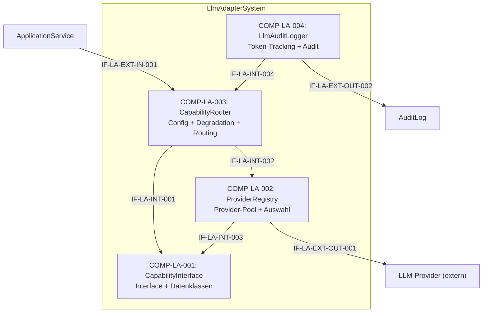

# L2 LlmAdapter Architecture

> **Level:** L2 (Subsystem white-box)
> **System:** LlmAdapterSystem (ARCH-L1-009)
> **Parent:** L1_Gesamtsystem_Architecture.md
> **Datum:** 2026-06-20
> **Status:** entworfen

---

## 1. Verantwortlichkeit

Provider-agnostische LLM-Abstraktionsschicht. Stellt stabile interne Schnittstelle (`LlmCapabilityInterface`) mit drei Operationen bereit: `validate_artifact`, `decompose_requirement`, `check_consistency`. Provider-Implementierungen (Anthropic, OpenAI, Ollama, Azure) sind austauschbar. Bei fehlender Konfiguration: graceful Degradation mit strukturiertem Fehler.

---

## 2. Black-Box (Eingebettete Sicht)

### Externe Schnittstellen

| ID | Richtung | Gegenstelle | Typ | Vertrag |
|----|----------|-------------|-----|---------|
| IF-LA-EXT-IN-001 | eingehend | ApplicationService | In-Process Python | `execute_capability(capability_name, **kwargs) -> LlmResult` |
| IF-LA-EXT-OUT-001 | ausgehend | LLM-Provider (extern) | HTTPS-Outbound | Provider-spezifische API (Anthropic/OpenAI/Ollama/Azure) |
| IF-LA-EXT-OUT-002 | ausgehend | AuditLog | In-Process Python | LLM-Aufruf-Audit-Eintrag |

---

## 3. White-Box (Komponenten-Zerlegung)

### Komponenten

| Komp-ID | Name | Verantwortlichkeit | Domain |
|---------|------|--------------------|--------|
| COMP-LA-001 | CapabilityInterface | Stabile abstrakte Schnittstelle (`LlmCapabilityInterface`) mit drei Operationen; standardisierte Ergebnisdatenklassen (`LlmResult`, `LlmDecompositionResult`, `LlmConsistencyResult`) | software |
| COMP-LA-002 | ProviderRegistry | Sammlung der austauschbaren Provider-Implementierungen; Provider-Auswahl und -Instanziierung basierend auf Deployment-Config; Fehlerbehandlung und Timeout | software |
| COMP-LA-003 | CapabilityRouter | Zentraler Einstiegspunkt fuer LLM-Aufrufe; Capability-Aktivierung/Deaktivierung; Graceful Degradation bei fehlender Konfiguration oder Provider-Fehlern | software |
| COMP-LA-004 | LlmAuditLogger | Audit-Logging fuer jeden LLM-Aufruf (erfolgreich oder fehlgeschlagen); Token-Verbrauch aus Provider-Responses extrahieren | software |

### Interne Schnittstellen

| ID | Richtung | Quelle -> Ziel | Typ | Vertrag |
|----|----------|----------------|-----|---------|
| IF-LA-INT-001 | intern | COMP-LA-003 -> COMP-LA-001 | In-Process Python | `execute_capability(capability_name, **kwargs)` |
| IF-LA-INT-002 | intern | COMP-LA-003 -> COMP-LA-002 | In-Process Python | `get_provider() -> LlmCapabilityInterface-Instanz` |
| IF-LA-INT-003 | intern | COMP-LA-002 -> COMP-LA-001 | Vererbung | Klassenimplementierung (`validate_artifact`, `decompose_requirement`, `check_consistency`) |
| IF-LA-INT-004 | intern | COMP-LA-004 -> COMP-LA-003 | In-Process Python | `log_llm_call(provider, capability, artifact_id, token_usage, success, error)` |

### Komponentendiagramm (Mermaid)

---

## 4. Zugeordnete REQ-L2

| REQ-L2 | Komponente |
|--------|-----------|
| REQ-L2-LA-001 | COMP-LA-001, COMP-LA-002 |
| REQ-L2-LA-002 | COMP-LA-003 |
| REQ-L2-LA-003 | COMP-LA-003 |
| REQ-L2-LA-004 | COMP-LA-001 |
| REQ-L2-LA-005 | COMP-LA-002, COMP-LA-003 |
| REQ-L2-LA-006 | COMP-LA-004 |
| REQ-L2-LA-007 | COMP-LA-002 |

---

## 5. ADRs (lokal)

**ADR-LA-01 — L2-Whitebox mit 4 orthogonalen Komponenten**
*Entscheidung:* `CapabilityInterface`, `ProviderRegistry`, `CapabilityRouter`, `LlmAuditLogger` als separate Komponenten.
*Rationale:* Trennt Vertrag-Modell (Interface + Datenklassen) von Implementierung (Provider-Pool), Konfiguration/Degradation (Router) und Audit-Concerns. Ermoeglicht Plugin-Faehigkeit der Provider und unabhaengige Testbarkeit.
*Verworfene Alternative:* Monolithischer LlmAdapter ohne interne Zerlegung — abgelehnt wegen verschleierter Plugin-Faehigkeit und schlechter Testbarkeit.

**ADR-LA-02 — L3-Zerlegung nicht gerechtfertigt**
*Entscheidung:* LlmAdapter bleibt auf L2 als Whitebox; L3 ist terminal.
*Rationale:* Die 4 L2-Komponenten sind ausreichend granular. Eine L3-Zerlegung in 7 Units (UNIT-LLM-01..07) stellt keine eigenstaendigen Systeme dar, sondern interne Software-Klassen. L2-Whitebox bietet ausreichende Strukturierung fuer alle 7 REQ-L2-LA.
*Verworfene Alternative:* L3-Zerlegung mit 7 Units — abgelehnt wegen Over-Engineering.

---

*Erstellt durch se-architect-Agent | ReqFlow SE-Kaskade | 2026-06-20*
