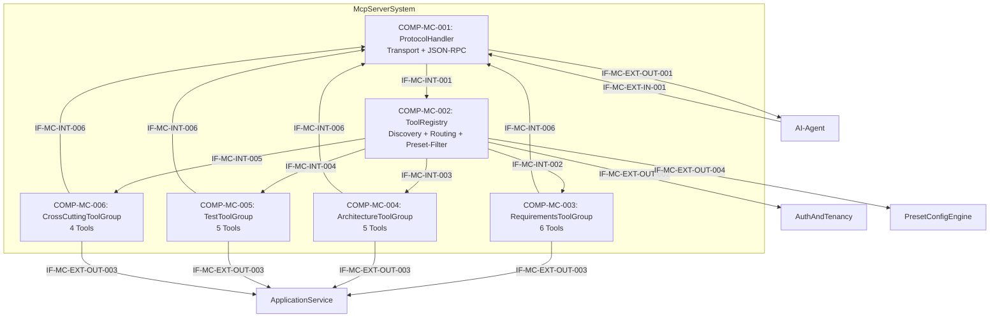

# L2 McpServer Architecture

> **Level:** L2 (Subsystem white-box)
> **System:** McpServerSystem (ARCH-L1-003)
> **Parent:** L1_Gesamtsystem_Architecture.md
> **Datum:** 2026-06-20
> **Status:** entworfen

---

## 1. Verantwortlichkeit

Nativer MCP-Protokoll-Handler fuer AI-Agenten. Exponiert 20 Tools in vier Gruppen ueber drei Transportprotokolle (stdio, SSE, HTTP). Greift direkt auf ApplicationService zu — nicht ueber REST. Erfasst Agent-Client-Identitaet und API-Key fuer Audit-Zwecke.

---

## 2. Black-Box (Eingebettete Sicht)

### Externe Schnittstellen

| ID | Richtung | Gegenstelle | Typ | Vertrag |
|----|----------|-------------|-----|---------|
| IF-MC-EXT-IN-001 | eingehend | AI-Agent | MCP-Protokoll | JSON-RPC ueber stdio/SSE/HTTP mit API-Key |
| IF-MC-EXT-OUT-001 | ausgehend | AI-Agent | MCP-Protokoll | Strukturierte Tool-Response (JSON) oder Fehler |
| IF-MC-EXT-OUT-002 | ausgehend | AuthAndTenancy | In-Process Python | API-Key-Validierung, Agent-Identitaet |
| IF-MC-EXT-OUT-003 | ausgehend | ApplicationService | In-Process Python | Use-Case-Methoden (In-Process Python) |
| IF-MC-EXT-OUT-004 | ausgehend | PresetConfigEngine | In-Process Python | Preset-Abfrage |

---

## 3. White-Box (Komponenten-Zerlegung)

### Komponenten

| Komp-ID | Name | Verantwortlichkeit | Domain |
|---------|------|--------------------|--------|
| COMP-MC-001 | ProtocolHandler | Transport-Protokoll-Abstraktion (stdio, SSE, HTTP), JSON-RPC-Frame-Validierung, Request/Response-Handling | software |
| COMP-MC-002 | ToolRegistry | Tool-Discovery, -Registrierung und -Routing; Preset-basierte Tool-Sichtbarkeit; strukturierte Fehlerformatierung | software |
| COMP-MC-003 | RequirementsToolGroup | 6 Requirements-Tools: requirement.get/query/create/update/decompose/validate | software |
| COMP-MC-004 | ArchitectureToolGroup | 5 Architecture-Tools: architecture.get/query/create/update/link | software |
| COMP-MC-005 | TestToolGroup | 5 Test-Tools: test.get/query/create/update/link | software |
| COMP-MC-006 | CrossCuttingToolGroup | 4 uebergreifende Tools: traceability.query, artifact.search, artifact.get_tree, workspace.get_context | software |

### Interne Schnittstellen

| ID | Richtung | Quelle -> Ziel | Typ | Vertrag |
|----|----------|----------------|-----|---------|
| IF-MC-INT-001 | intern | COMP-MC-001 -> COMP-MC-002 | In-Process Python | `dispatch_request(json_rpc_frame) -> tool_call` |
| IF-MC-INT-002 | intern | COMP-MC-002 -> COMP-MC-003 | In-Process Python | `execute_tool(tool_name, params, auth_context) -> ToolResult` |
| IF-MC-INT-003 | intern | COMP-MC-002 -> COMP-MC-004 | In-Process Python | `execute_tool(tool_name, params, auth_context) -> ToolResult` |
| IF-MC-INT-004 | intern | COMP-MC-002 -> COMP-MC-005 | In-Process Python | `execute_tool(tool_name, params, auth_context) -> ToolResult` |
| IF-MC-INT-005 | intern | COMP-MC-002 -> COMP-MC-006 | In-Process Python | `execute_tool(tool_name, params, auth_context) -> ToolResult` |
| IF-MC-INT-006 | intern | COMP-MC-003..006 -> COMP-MC-001 | In-Process Python | `ToolResult -> JSON-Response` |

### Komponentendiagramm (Mermaid)

---

## 4. Zugeordnete REQ-L2

| REQ-L2 | Komponente |
|--------|-----------|
| REQ-L2-MC-001 | COMP-MC-003 |
| REQ-L2-MC-002 | COMP-MC-004 |
| REQ-L2-MC-003 | COMP-MC-005 |
| REQ-L2-MC-004 | COMP-MC-006 |
| REQ-L2-MC-005 | COMP-MC-001 |
| REQ-L2-MC-006 | COMP-MC-001, COMP-MC-002 |
| REQ-L2-MC-007 | COMP-MC-002 |
| REQ-L2-MC-008 | COMP-MC-002 |
| REQ-L2-MC-009 | COMP-MC-003..006 |
| REQ-L2-MC-010 | Alle Komponenten |
| REQ-L2-MC-011 | COMP-MC-001, COMP-MC-002 |
| REQ-L2-MC-012 | COMP-MC-003..005 |

---

## 5. ADRs (lokal)

**ADR-MC-01 — Transport + Registry + Tool-Gruppen statt 22 Einzel-Units**
*Entscheidung:* 6 Komponenten: ProtocolHandler, ToolRegistry, 4 Tool-Gruppen.
*Rationale:* 20 individuelle Tools plus Transport wuerden eine L2-Ebene ueberfrachten. Die natuerliche Gruppierung in 4 Artefakt-Domains plus eine technische Transport-/Dispatch-Schicht reduziert die Komplexitaet auf verwaltbare Einheiten, waehrend die individuellen Tools auf Code-Ebene modelliert werden.
*Verworfene Alternative:* 22 L2-Komponenten (einzelne Tools) — abgelehnt wegen Ueberfrachtung der L2-Ebene.

**ADR-MC-02 — Direkter ApplicationService-Zugriff (keine REST-Umleitung)**
*Entscheidung:* Alle Domain-Operationen direkt ueber ApplicationService via In-Process-Python.
*Rationale:* Vermeidet HTTP-Roundtrip-Overhead bei Batch-Operationen, erlaubt MCP-spezifische Audit-Felder ohne REST-Verunreinigung und garantiert semantische Konsistenz.
*Verworfene Alternative:* MCP als Wrapper ueber REST — abgelehnt wegen Latenz und doppelter Auth-Verarbeitung.

---

*Erstellt durch se-architect-Agent | ReqFlow SE-Kaskade | 2026-06-20*
