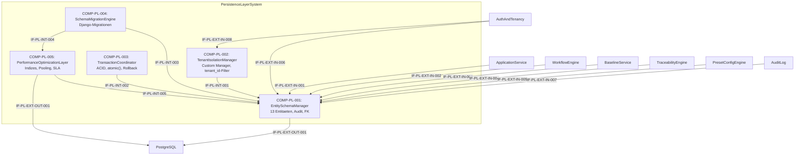

# L2 PersistenceLayer Architecture

> **Level:** L2 (Subsystem white-box)
> **System:** PersistenceLayerSystem (ARCH-L1-010)
> **Parent:** L1_Gesamtsystem_Architecture.md
> **Datum:** 2026-06-20
> **Status:** entworfen

---

## 1. Verantwortlichkeit

Zentrale Datenhaltungsschicht von ReqFlow. PostgreSQL via Django ORM. Hält alle Entitaeten: Tenant, Workspace, Artifact, Requirement, ArchitectureElement, TraceLink, TestCase, Baseline, WorkflowDefinition, WorkflowState, AuditLog, User, Role. Tenant-Isolation wird ueber einen Custom Django Manager auf allen Entitaeten erzwungen.

---

## 2. Black-Box (Eingebettete Sicht)

### Externe Schnittstellen

| ID | Richtung | Gegenstelle | Typ | Vertrag |
|----|----------|-------------|-----|---------|
| IF-PL-EXT-IN-001 | eingehend | ApplicationService | Django ORM | CRUD auf allen Entitaeten |
| IF-PL-EXT-IN-002 | eingehend | WorkflowEngine | Django ORM | WorkflowDefinition, WorkflowState |
| IF-PL-EXT-IN-003 | eingehend | BaselineService | Django ORM | Baseline |
| IF-PL-EXT-IN-004 | eingehend | TraceabilityEngine | Django ORM | TraceLink |
| IF-PL-EXT-IN-005 | eingehend | PresetConfigEngine | Django ORM | Workspace, Preset-Konfiguration |
| IF-PL-EXT-IN-006 | eingehend | AuthAndTenancy | Django ORM | User, Role, Tenant |
| IF-PL-EXT-IN-007 | eingehend | AuditLog | Django ORM | AuditLogEntry |
| IF-PL-EXT-IN-008 | eingehend | AuthAndTenancy | Python Thread-Local | Tenant-Kontext (tenant_id) |
| IF-PL-EXT-OUT-001 | ausgehend | PostgreSQL (extern) | TCP / psycopg2 | SQL, Connection-Pool-Parameter |

---

## 3. White-Box (Komponenten-Zerlegung)

### Komponenten

| Komp-ID | Name | Verantwortlichkeit | Domain |
|---------|------|--------------------|--------|
| COMP-PL-001 | EntitySchemaManager | Django ORM Modelle fuer alle 13 Entitaeten, Audit-Felder, Foreign-Key-Constraints mit semantisch korrekten `on_delete`-Regeln | software |
| COMP-PL-002 | TenantIsolationManager | Custom Django Manager (`TenantQuerySet`), automatischer `tenant_id`-Filter, Tenant-Context-Validierung | software |
| COMP-PL-003 | TransactionCoordinator | Transaktionskontrolle (`transaction.atomic()`), Rollback-Garantie, Multi-Entity-Transaktionen | software |
| COMP-PL-004 | SchemaMigrationEngine | Django-Migrationen (Vorwaerts/Rueckwaerts), idempotentes Schema-Management, Deployment-Reproduzierbarkeit | software |
| COMP-PL-005 | PerformanceOptimizationLayer | PostgreSQL-Indizes (BTree, GIST/GIN, tsvector), Connection-Pooling, Latenz-SLA-Monitoring | software |

### Interne Schnittstellen

| ID | Richtung | Quelle -> Ziel | Typ | Vertrag |
|----|----------|----------------|-----|---------|
| IF-PL-INT-001 | intern | COMP-PL-002 -> COMP-PL-001 | Python API | `TenantQuerySet` als Default-Manager auf allen Modellen |
| IF-PL-INT-002 | intern | COMP-PL-003 -> COMP-PL-001 | Python API | `transaction.atomic()` Context-Manager umschließt ORM-Write-Operationen |
| IF-PL-INT-003 | intern | COMP-PL-004 -> COMP-PL-001 | Python API | Django-Migrationen generiert aus `models.py` |
| IF-PL-INT-004 | intern | COMP-PL-004 -> COMP-PL-005 | Python API | Migrationen enthalten `AddIndex`, `RemoveIndex` Operationen |
| IF-PL-INT-005 | intern | COMP-PL-005 -> COMP-PL-001 | Python API | `Meta.indexes` und `Index`-Klasse in Modell-Definitionen |

### Komponentendiagramm (Mermaid)

---

## 4. Zugeordnete REQ-L2

| REQ-L2 | Komponente |
|--------|-----------|
| REQ-L2-PL-001 | COMP-PL-002 |
| REQ-L2-PL-002 | COMP-PL-003 |
| REQ-L2-PL-003 | COMP-PL-005 |
| REQ-L2-PL-004 | COMP-PL-001 |
| REQ-L2-PL-005 | COMP-PL-001 |
| REQ-L2-PL-006 | COMP-PL-004 |
| REQ-L2-PL-007 | COMP-PL-005 |
| REQ-L2-PL-008 | COMP-PL-005 |
| REQ-L2-PL-009 | COMP-PL-001 |

---

## 5. ADRs (lokal)

**ADR-PL-01 — Fuenf logische Komponenten statt monolithischer PersistenceLayer**
*Entscheidung:* EntitySchemaManager, TenantIsolationManager, TransactionCoordinator, SchemaMigrationEngine, PerformanceOptimizationLayer.
*Rationale:* Bündelt das statische Datenmodell (Schema + Audit + Integritaet), das Cross-Cutting Concern Tenant-Isolation, die orthogonale Transaktionskontrolle, das Deployment-Time-Concern Migrationen und die Performance-Maßnahmen (Indizes + Pooling) in kohärente Einheiten.
*Verworfene Alternative:* Monolithische PersistenceLayer ohne L2-Zerlegung — abgelehnt wegen mangelnder Zuordnbarkeit der REQ-L2 und fehlender Klarheit bei Custom Manager und Migrationen.

**ADR-PL-02 — L3-Zerlegung nicht gerechtfertigt**
*Entscheidung:* PersistenceLayer ist terminal (Leaf-AE); keine L3-Decomposition.
*Rationale:* Infrastruktur-Layer-Charakter, Django-Framework-Abstraktionen machen feinere Zerlegung überflüssig, homogene Domain (alles software), keine unabhängige Deployability.
*Verworfene Alternative:* L3-Zerlegung in ModelDefinitionComponent, FieldValidatorComponent — abgelehnt wegen Framework-Interna-Duplizierung ohne architektonischen Mehrwert.

---

*Erstellt durch se-architect-Agent | ReqFlow SE-Kaskade | 2026-06-20*
