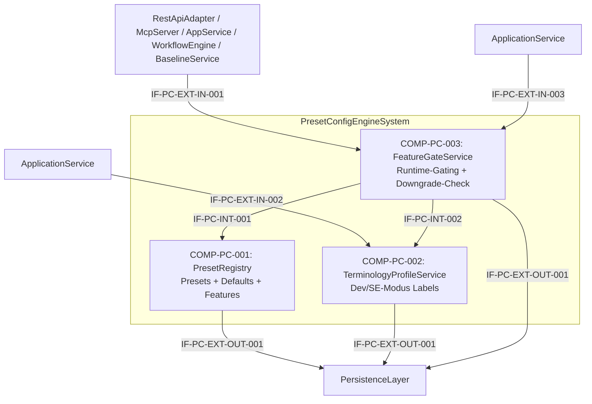

# L2 PresetConfigEngine Architecture

> **Level:** L2 (Subsystem white-box)
> **System:** PresetConfigEngineSystem (ARCH-L1-008)
> **Parent:** L1_Gesamtsystem_Architecture.md
> **Datum:** 2026-06-20
> **Status:** entworfen

---

## 1. Verantwortlichkeit

Zentrale Konfigurations-Engine fuer Configurable Rigor. Verwaltet SE-Tiefe-Presets (Minimal / Standard / Extended) und Terminologie-Profile (Dev-Modus / SE-Modus) auf Workspace-Ebene. Liefert zur Laufzeit Entscheidungen ueber Pflichtfelder, sichtbare Funktionen, Baseline-Scope-Verfuegbarkeit, Workflow-Konfigurierbarkeit und `change_reason`-Pflicht.

---

## 2. Black-Box (Eingebettete Sicht)

### Externe Schnittstellen

| ID | Richtung | Gegenstelle | Typ | Vertrag |
|----|----------|-------------|-----|---------|
| IF-PC-EXT-IN-001 | eingehend | RestApiAdapter / McpServer / ApplicationService / WorkflowEngine / BaselineService | In-Process Python | `get_preset(workspace_id)`, `is_feature_enabled(feature_key, workspace_id)` |
| IF-PC-EXT-IN-002 | eingehend | ApplicationService | In-Process Python | `get_terminology_profile(workspace_id)` |
| IF-PC-EXT-IN-003 | eingehend | ApplicationService | In-Process Python | `switch_preset(workspace_id, target_preset)`, `validate_downgrade(workspace_id, target_preset)` |
| IF-PC-EXT-OUT-001 | ausgehend | PersistenceLayer | Django ORM | Workspace, WorkspaceSettings, PresetConfig, TerminologyProfile |

---

## 3. White-Box (Komponenten-Zerlegung)

### Komponenten

| Komp-ID | Name | Verantwortlichkeit | Domain |
|---------|------|--------------------|--------|
| COMP-PC-001 | PresetRegistry | Preset-Definitionen und -Defaults (Minimal / Standard / Extended), Feature-Flags, Baseline-Scope-Verfuegbarkeit, Workflow-Konfigurierbarkeit, `change_reason`-Policy | software |
| COMP-PC-002 | TerminologyProfileService | Verwaltung von Terminologie-Profilen (Dev-Modus / SE-Modus), vollstaendiges Mapping von generischen Entity-Namen zu domaenenspezifischen Labels | software |
| COMP-PC-003 | FeatureGateService | Laufzeit-Entscheidungen ueber sichtbare Endpunkte/Felder, Preset-Downgrade-Validierung, Cache-Verwaltung fuer <10ms-Queries | software |

### Interne Schnittstellen

| ID | Richtung | Quelle -> Ziel | Typ | Vertrag |
|----|----------|----------------|-----|---------|
| IF-PC-INT-001 | intern | COMP-PC-003 -> COMP-PC-001 | In-Process Python | `get_preset_config(workspace_id) -> PresetConfig` |
| IF-PC-INT-002 | intern | COMP-PC-003 -> COMP-PC-002 | In-Process Python | `get_terminology_profile(workspace_id) -> TerminologyMapping` |

### Komponentendiagramm (Mermaid)

---

## 4. Zugeordnete REQ-L2

| REQ-L2 | Komponente |
|--------|-----------|
| REQ-L2-PC-001 | COMP-PC-001 |
| REQ-L2-PC-002 | COMP-PC-003 |
| REQ-L2-PC-003 | COMP-PC-001 |
| REQ-L2-PC-004 | COMP-PC-001 |
| REQ-L2-PC-005 | COMP-PC-001 |
| REQ-L2-PC-006 | COMP-PC-001 |
| REQ-L2-PC-007 | COMP-PC-001 |
| REQ-L2-PC-008 | COMP-PC-003 |
| REQ-L2-PC-009 | COMP-PC-002 |
| REQ-L2-PC-010 | COMP-PC-002 |
| REQ-L2-PC-011 | COMP-PC-003 |
| REQ-L2-PC-012 | COMP-PC-001 |
| REQ-L2-PC-013 | COMP-PC-003 |
| REQ-L2-PC-014 | COMP-PC-001 |

---

## 5. ADRs (lokal)

**ADR-PC-01 — Configurable Rigor als Querschnitts-Service mit 3 Komponenten**
*Entscheidung:* PresetRegistry, TerminologyProfileService, FeatureGateService.
*Rationale:* Trennt statische Preset-Regeln (Registry) von dynamischen Labels (Terminology) und Laufzeit-Entscheidungen (FeatureGate). Ermoeglicht unabhaengige Evolution von Preset-Definitionen und Terminologie-Mappings.
*Verworfene Alternative:* Einzelner PresetConfigEngine ohne interne Zerlegung — abgelehnt wegen Vermischung von Konfiguration, Terminologie und Laufzeit-Logik.

**ADR-PC-02 — L3-Zerlegung nicht gerechtfertigt**
*Entscheidung:* PresetConfigEngine bleibt auf L2; L3 ist terminal.
*Rationale:* Die Logik ist datengetrieben (Preset-Regeln in JSON-Config, nicht in Code). Alle 14 REQ-L2-PC sind direkt auf Service-Methoden abbildbar. Eine Zerlegung in Sub-Units wuerde kuenstliche Komplexitaet erzeugen.
*Verworfene Alternative:* L3-Zerlegung in PresetManager, TerminologyManager, DowngradeValidator — abgelehnt wegen Schnittstellen-Overhead ohne messbaren Mehrwert.

---

*Erstellt durch se-architect-Agent | ReqFlow SE-Kaskade | 2026-06-20*
