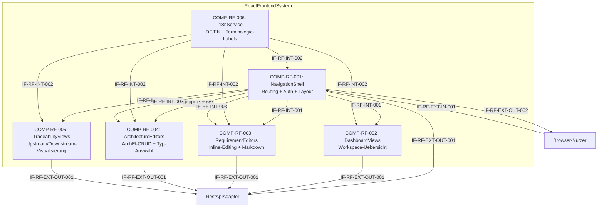

# L2 ReactFrontend Architecture

> **Level:** L2 (Subsystem white-box)
> **System:** ReactFrontendSystem (ARCH-L1-001)
> **Parent:** L1_Gesamtsystem_Architecture.md
> **Datum:** 2026-06-20
> **Status:** entworfen

---

## 1. Verantwortlichkeit

Single-Page-Application in React + TypeScript. Stellt Dashboard, Requirements-Editor, Architecture-Editor, Artefakt-Navigation, Traceability-Anzeige und Workspace-Konfiguration bereit. Liest aktives Terminologie-Profil aus Workspace-Settings und rendert Labels entsprechend. i18n via react-i18next (DE/EN). Kommuniziert ausschliesslich ueber die REST API mit dem Backend.

---

## 2. Black-Box (Eingebettete Sicht)

### Externe Schnittstellen

| ID | Richtung | Gegenstelle | Typ | Vertrag |
|----|----------|-------------|-----|---------|
| IF-RF-EXT-IN-001 | eingehend | Browser-Nutzer | HTTPS / HTML / JS | Nutzerinteraktion via Mouse, Keyboard, Touch |
| IF-RF-EXT-OUT-001 | ausgehend | RestApiAdapter | REST + Bearer Token | HTTP/JSON + Bearer Token, OpenAPI 3.0 — alle CRUD-Operationen, Preset-Abfragen, Terminologie-Profile |
| IF-RF-EXT-OUT-002 | ausgehend | Browser-Nutzer | HTML / CSS / JS | Gerenderte UI-Komponenten |

---

## 3. White-Box (Komponenten-Zerlegung)

### Komponenten

| Komp-ID | Name | Verantwortlichkeit | Domain |
|---------|------|--------------------|--------|
| COMP-RF-001 | NavigationShell | Hauptanwendungs-Layout, Routing zwischen Funktionsmodulen, Authentifizierungs-Gate, Top-Level Error Boundaries, 401-Redirect | software |
| COMP-RF-002 | DashboardViews | Workspace-Uebersicht mit Projekt-Karten, Requirements-Zaehlern, Anzahl offener Punkte und aktivem Terminologie-Profil | software |
| COMP-RF-003 | RequirementEditors | Inline-Editing fuer Requirements, Markdown-Rendering, Workflow-State-Anzeige und -Transitionen, bidirektionale Traceability-Anzeige | software |
| COMP-RF-004 | ArchitectureEditors | CRUD-Operationen fuer ArchitectureElements, Element-Typ-Auswahl, Markdown-Description, verknuepfte TraceLinks | software |
| COMP-RF-005 | TraceabilityViews | Bidirektionale TraceLinks (Upstream/Downstream) zwischen Requirements, ArchitectureElements und TestCases visualisieren | software |
| COMP-RF-006 | I18nService | Uebersetzungsmanagement via react-i18next (DE/EN), Build-Time-Validierung fehlender Translation-Keys, dynamisches Label-Rendering basierend auf Terminologie-Profil | software |

### Interne Schnittstellen

| ID | Richtung | Quelle -> Ziel | Typ | Vertrag |
|----|----------|----------------|-----|---------|
| IF-RF-INT-001 | intern | COMP-RF-001 -> COMP-RF-002..005 | React Context / Router-State | Routing-Events, View-Activation, Modul-Ein-/Ausblendung basierend auf Preset |
| IF-RF-INT-002 | intern | COMP-RF-006 -> COMP-RF-001..005 | React Context | Translation-Keys (`t(key, params)`), Terminologie-Profil-Labels, Locale-Change-Events |
| IF-RF-INT-003 | intern | COMP-RF-001 -> COMP-RF-003..004 | React Props / State | Artefakt-Selektion (`{artifact_id, artifact_type}`) |

### Komponentendiagramm (Mermaid)

---

## 4. Zugeordnete REQ-L2

| REQ-L2 | Komponente |
|--------|-----------|
| REQ-L2-RF-001 | COMP-RF-006 |
| REQ-L2-RF-002 | COMP-RF-002 |
| REQ-L2-RF-003 | COMP-RF-003 |
| REQ-L2-RF-004 | COMP-RF-004 |
| REQ-L2-RF-005 | COMP-RF-001 |
| REQ-L2-RF-006 | COMP-RF-005 |
| REQ-L2-RF-007 | COMP-RF-001 |
| REQ-L2-RF-008 | COMP-RF-006 |
| REQ-L2-RF-009 | COMP-RF-001 |
| REQ-L2-RF-010 | COMP-RF-001 |
| REQ-L2-RF-011 | COMP-RF-001 |
| REQ-L2-RF-012 | COMP-RF-001 |

---

## 5. ADRs (lokal)

**ADR-RF-01 — 6 funktionale Komponenten statt monolithischem Frontend**
*Entscheidung:* NavigationShell, DashboardViews, RequirementEditors, ArchitectureEditors, TraceabilityViews, I18nService.
*Rationale:* Die funktionalen Module spiegeln die Use-Cases aus REQ-L1-017 wider. I18nService als querschnittlicher Service kapselt Aspekte, die alle Funktionsmodule benoetigen. NavigationShell trennt Routing und Auth vom Funktions-UI.
*Verworfene Alternative:* Monolithisches ReactFrontend ohne L2-Zerlegung — abgelehnt wegen mangelnder Zuordnbarkeit der REQ-L2 und fehlender Klarheit bei Schnittstellen-Definition.

**ADR-RF-02 — L3-Zerlegung nicht gerechtfertigt**
*Entscheidung:* ReactFrontend ist terminal; keine L3-Decomposition.
*Rationale:* Eine weitere Zerlegung wuerde in die React-Komponenten-Ebene (Buttons, Forms, Hooks) absteigen — das ist Implementierungsdetail, keine Systems-Engineering-Zerlegung. Die 6 ARCH-L2-Komponenten bilden die minimale Menge fuer Orthogonalitaet.
*Verworfene Alternative:* L3-Zerlegung in RequirementsEditor, ArchitectureEditor, TraceabilityViewer — abgelehnt wegen uebermaessiger Fragmentierung und fehlender unabhaengiger Deployability.

---

*Erstellt durch se-architect-Agent | ReqFlow SE-Kaskade | 2026-06-20*
