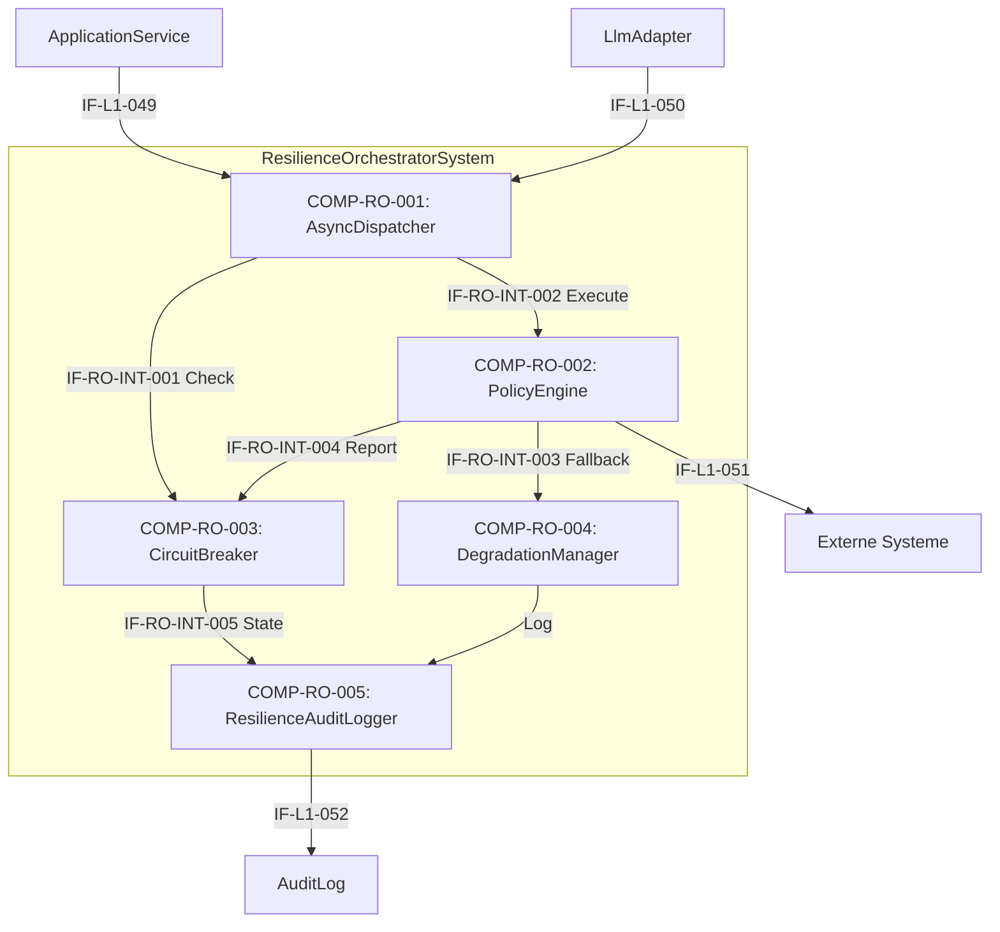

# L2 ResilienceOrchestrator Architecture

> **Level:** L2 (Subsystem white-box)
> **System:** ResilienceOrchestratorSystem (ARCH-L1-016)
> **Parent:** L1_Gesamtsystem_Architecture.md
> **Datum:** 2026-06-21
> **Status:** entworfen
> **Designation:** subsystem (white-box)
> **decomposition_status:** complete

---

## 1. Verantwortlichkeit

Das ResilienceOrchestratorSystem ist der zentrale Resilienz-Manager für alle externen Aufrufe (LLM-Adapter, Webhook-Dispatcher, GitHub-Integration). Es entkoppelt das System asynchron und implementiert Timeouts, Retry-Logik (Exponential Backoff) sowie Circuit-Breaker-Mechanismen, um zu garantieren, dass Ausfälle bei optionalen Subsystemen die Kernverfügbarkeit des ReqFlow-Systems nicht beeinträchtigen.

---

## 2. Black-Box (Eingebettete Sicht)

### Externe Schnittstellen

| ID | Richtung | Gegenstelle | Typ | Vertrag |
|----|----------|-------------|-----|---------|
| IF-L1-049 | input | ApplicationService | control | `execute_optional(operation, target, payload, policy)` |
| IF-L1-050 | input | LlmAdapter | control | Wrapping aller HTTPS-Outbound-Calls |
| IF-L1-051 | output | Externe Systeme | control | Delegierter Aufruf nach Policy-Anwendung (z.B. GitHub, Webhook) |
| IF-L1-052 | output | AuditLog | data | Degradation-Events, Retry-Logs, Circuit-State-Changes |

---

## 3. White-Box (Komponenten-Zerlegung)

### Komponenten

| Komp-ID | Name | Verantwortlichkeit | Domain | REQ-Referenz |
|---------|------|--------------------|--------|--------------|
| COMP-RO-001 | AsyncDispatcher | Reiht externe Aufrufe in eine Message-Queue (z.B. Celery) ein, um synchrone Request-Threads im ApplicationService nicht zu blockieren. | system | REQ-L2-RO-001 |
| COMP-RO-002 | PolicyEngine | Wendet konfigurierbare Timeout-Schwellen und Retry-Strategien mit Exponential Backoff auf transiente Fehler an. | system | REQ-L2-RO-002, REQ-L2-RO-003 |
| COMP-RO-003 | CircuitBreaker | Überwacht Fehlerraten pro Zielsystem und unterbricht als Zustandsautomat (Closed, Open, Half-Open) den Datenverkehr bei Überlastung/Ausfall präventiv. | system | REQ-L2-RO-004 |
| COMP-RO-004 | DegradationManager | Erzeugt bei Ausfällen (Timeout, Retries ausgeschöpft oder Circuit Open) dedizierte Fallback-Antworten (Graceful Degradation), um die Kernverfügbarkeit aufrechtzuerhalten. | system | REQ-L2-RO-005 |
| COMP-RO-005 | ResilienceAuditLogger | Protokolliert Degradation-Ereignisse, Circuit-Breaker-Statuswechsel und Retry-Logs zuverlässig im AuditLog. | system | REQ-L2-RO-006 |

### Interne Schnittstellen

| ID | Richtung | Quelle -> Ziel | Typ | Vertrag |
|----|----------|----------------|-----|---------|
| IF-RO-INT-001 | intern | COMP-RO-001 -> COMP-RO-003 | In-Process Python | `can_execute(target_id) -> bool` |
| IF-RO-INT-002 | intern | COMP-RO-001 -> COMP-RO-002 | In-Process Python | `execute_with_policy(operation, target, payload)` |
| IF-RO-INT-003 | intern | COMP-RO-002 -> COMP-RO-004 | In-Process Python | `handle_failure(exception, target) -> FallbackResponse` |
| IF-RO-INT-004 | intern | COMP-RO-002 -> COMP-RO-003 | In-Process Python | `report_success(target)` oder `report_failure(target)` |
| IF-RO-INT-005 | intern | COMP-RO-003 -> COMP-RO-005 | In-Process Python | `log_state_change(target, old_state, new_state)` |

### Dependency-Graph (azyklisch)

Unidirektionaler Datenfluss von den Eingängen zu den Verarbeitern und Persistenz.

---

## 4. Zugeordnete REQ-L2

| REQ-L2 | Komponente(n) |
|--------|---------------|
| REQ-L2-RO-001 | COMP-RO-001 |
| REQ-L2-RO-002 | COMP-RO-002 |
| REQ-L2-RO-003 | COMP-RO-002 |
| REQ-L2-RO-004 | COMP-RO-003 |
| REQ-L2-RO-005 | COMP-RO-004 |
| REQ-L2-RO-006 | COMP-RO-005 |

---

## 5. Interface-Belegung (IF-L1-049..052)

| Interface | Eigentuemerkomponente | Richtung | Zweck |
|-----------|----------------------|----------|-------|
| IF-L1-049 | COMP-RO-001 | input | Generische asynchrone Ausführungsanforderung |
| IF-L1-050 | COMP-RO-001 | input | Wrapper für LLM Aufrufe |
| IF-L1-051 | COMP-RO-002 | output | Durchgereichter Aufruf an Externe Systeme nach Policy-Check |
| IF-L1-052 | COMP-RO-005 | output | Audit Logging für Resilienz-Events |

---

## 6. ADRs (lokal)

**ADR-RO-01 — Trennung von PolicyEngine und CircuitBreaker**
*Entscheidung:* Retry/Timeout (PolicyEngine) und der globale Zustandsautomat für Ausfälle (CircuitBreaker) sind getrennte Komponenten.
*Rationale:* Die PolicyEngine agiert auf der Ebene einzelner Requests (Timeouts, Retry-Schleifen). Der CircuitBreaker agiert aggregiert über alle Requests zu einem bestimmten Target-System. Die Trennung ist zwingend erforderlich, damit der CircuitBreaker systemweit "Open" schalten kann, was die PolicyEngine dann sofort berücksichtigt, ohne Retries zu verschwenden.
*Verworfene Alternative:* Zusammenlegung in einen "ResilienceHandler" — abgelehnt, da lokaler Request-Scope und globaler Target-Scope unterschiedliche Verantwortlichkeiten und Lebenszyklen besitzen.

---

## 7. Decomposition Completeness

| Aspekt | Abdeckung |
|--------|-----------|
| Alle IF-L1-049..052 eingebunden | vollständig |
| Alle REQ-L2-RO-001..006 zugewiesen | vollständig |
| Azyklischer Dependency-Graph | nachgewiesen |

---

*Erstellt durch se-architect-Agent | ReqFlow SE-Kaskade L1→L2 | 2026-06-21*
*Handoff: HOFF-20260621-002 | Parent: ARCH-L1-016 | REQ-Quelle: REQ-L2-RO-001..006*
*Designation: subsystem (white-box) — decomposition_status: complete*
