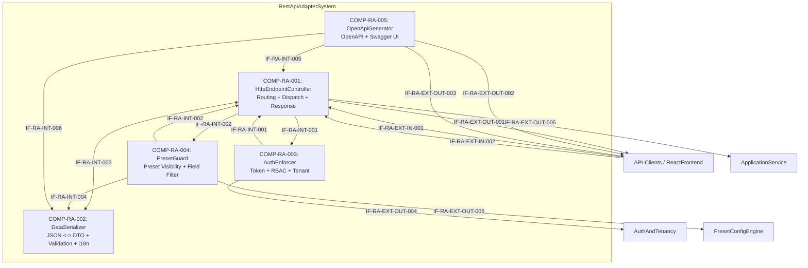

# L2 RestApiAdapter Architecture

> **Level:** L2 (Subsystem white-box)
> **System:** RestApiAdapterSystem (ARCH-L1-002)
> **Parent:** L1_Gesamtsystem_Architecture.md
> **Datum:** 2026-06-20
> **Status:** entworfen

---

## 1. Verantwortlichkeit

Django REST Framework (DRF)-basierte REST-Schnittstelle. Exponiert alle Domain-Operationen als HTTP/JSON-Endpunkte unter `/api/v1/`. Uebersetzt HTTP-Requests in `ApplicationService`-Aufrufe, validiert JSON-Request-Bodies, serialisiert Responses, enforced Auth/RBAC/Tenant-Kontext, und stellt auto-generierte OpenAPI-3.0-Spezifikation bereit.

---

## 2. Black-Box (Eingebettete Sicht)

### Externe Schnittstellen

| ID | Richtung | Gegenstelle | Typ | Vertrag |
|----|----------|-------------|-----|---------|
| IF-RA-EXT-IN-001 | eingehend | API-Clients | HTTP/JSON | REST-Requests mit Bearer Token |
| IF-RA-EXT-IN-002 | eingehend | ReactFrontend | HTTP/JSON | REST-Requests mit Bearer Token |
| IF-RA-EXT-OUT-001 | ausgehend | API-Clients / ReactFrontend | HTTP/JSON | JSON-Responses mit HTTP-Statuscodes |
| IF-RA-EXT-OUT-002 | ausgehend | API-Clients / ReactFrontend | HTTP/JSON | OpenAPI-3.0-Spezifikation unter `/api/v1/schema/` |
| IF-RA-EXT-OUT-003 | ausgehend | API-Clients / ReactFrontend | HTTP/JSON | Swagger-UI unter `/api/v1/schema/swagger-ui/` |
| IF-RA-EXT-OUT-004 | ausgehend | AuthAndTenancy | In-Process Python | Token-Validierung, Auth-Kontext |
| IF-RA-EXT-OUT-005 | ausgehend | ApplicationService | In-Process Python | Use-Case-Methoden (Pydantic-/DRF-Serializer als DTOs) |
| IF-RA-EXT-OUT-006 | ausgehend | PresetConfigEngine | In-Process Python | Preset-Abfrage: `is_feature_enabled(key, workspace_id)` |

---

## 3. White-Box (Komponenten-Zerlegung)

### Komponenten

| Komp-ID | Name | Verantwortlichkeit | Domain |
|---------|------|--------------------|--------|
| COMP-RA-001 | HttpEndpointController | HTTP-Request-Routing, Method-Dispatch, HTTP-Statuscode-Selektion, Response-Assembly, Delegation an ApplicationService | software |
| COMP-RA-002 | DataSerializer | JSON-Deserialisierung/Serialisierung, Input-Validierung, DTO-Konvertierung, Pagination/Filtering/Sorting, i18n-Fehlermeldungen | software |
| COMP-RA-003 | AuthEnforcer | Bearer-Token-Extraktion, Delegation an AuthAndTenancy, RBAC-Enforcement, Tenant-Kontext-Propagation | software |
| COMP-RA-004 | PresetGuard | Runtime-Preset-Abfrage, Endpoint-Sichtbarkeit, Feld-Filterung | software |
| COMP-RA-005 | OpenApiGenerator | OpenAPI-3.0-Spezifikation-Generierung, Swagger-UI-Bereitstellung | software |

### Interne Schnittstellen

| ID | Richtung | Quelle -> Ziel | Typ | Vertrag |
|----|----------|----------------|-----|---------|
| IF-RA-INT-001 | intern | COMP-RA-001 -> COMP-RA-003 | In-Process Python | `AuthRequest {headers, path, method} -> AuthContext \| AuthError` |
| IF-RA-INT-002 | intern | COMP-RA-001 -> COMP-RA-004 | In-Process Python | `PresetRequest {endpoint_id, workspace_id, method} -> PresetDecision \| PresetError` |
| IF-RA-INT-003 | intern | COMP-RA-001 <-> COMP-RA-002 | In-Process Python | `SerializeRequest {json_body, query_params, entity_type, direction} -> ValidatedDTO \| ValidationError \| JSON_Response` |
| IF-RA-INT-004 | intern | COMP-RA-004 -> COMP-RA-002 | In-Process Python | `FieldFilter {permitted_fields, required_fields}` |
| IF-RA-INT-005 | intern | COMP-RA-005 -> COMP-RA-001 | In-Process Python | `EndpointRegistry {routes: RouteDef[]}` |
| IF-RA-INT-006 | intern | COMP-RA-005 -> COMP-RA-002 | In-Process Python | `SerializerSchemas {entity_type, field_defs, validators}` |

### Komponentendiagramm (Mermaid)

---

## 4. Zugeordnete REQ-L2

| REQ-L2 | Komponente |
|--------|-----------|
| REQ-L2-RA-001 | COMP-RA-001, COMP-RA-002 |
| REQ-L2-RA-002 | COMP-RA-005 |
| REQ-L2-RA-003 | COMP-RA-001, COMP-RA-002 |
| REQ-L2-RA-004 | COMP-RA-002 |
| REQ-L2-RA-005 | COMP-RA-003 |
| REQ-L2-RA-006 | COMP-RA-003 |
| REQ-L2-RA-007 | COMP-RA-001 |
| REQ-L2-RA-008 | COMP-RA-004, COMP-RA-002 |
| REQ-L2-RA-009 | COMP-RA-001, COMP-RA-002 |
| REQ-L2-RA-010 | COMP-RA-002 |
| REQ-L2-RA-011 | COMP-RA-003 |
| REQ-L2-RA-012 | COMP-RA-001, COMP-RA-002 |

---

## 5. ADRs (lokal)

**ADR-RA-01 — 5 Module nach klassischem DRF-Schichtenmodell**
*Entscheidung:* HttpEndpointController, DataSerializer, AuthEnforcer, PresetGuard, OpenApiGenerator.
*Rationale:* Maximiert Kohaession (jedes Modul hat eine eindeutige, fokussierte Verantwortlichkeit) und minimiert Kopplung (SchemaGenerator kann unabhaengig von AuthEnforcer entwickelt werden).
*Verworfene Alternative:* Monolithischer Adapter (1 Modul) — abgelehnt wegen Verletzung des Orthogonalitaets-Prinzips und erschwerter paralleler Entwicklung.

**ADR-RA-02 — L3-Zerlegung nicht gerechtfertigt**
*Entscheidung:* RestApiAdapter bleibt auf L2; L3 terminiert.
*Rationale:* DRF-ViewSets und Serializer sind Implementierungsartefakte, keine architektonischen Subsysteme. Eine L3-Zerlegung wuerde Framework-Spezifika in die SE-Ebene heben. REQ-L2-RA-012 definiert den Adapter als "pure translation layer".
*Verworfene Alternative:* L3 mit DRF-ViewSets und Serializern als separate Units — abgelehnt wegen Over-Engineering.

---

*Erstellt durch se-architect-Agent | ReqFlow SE-Kaskade | 2026-06-20*
