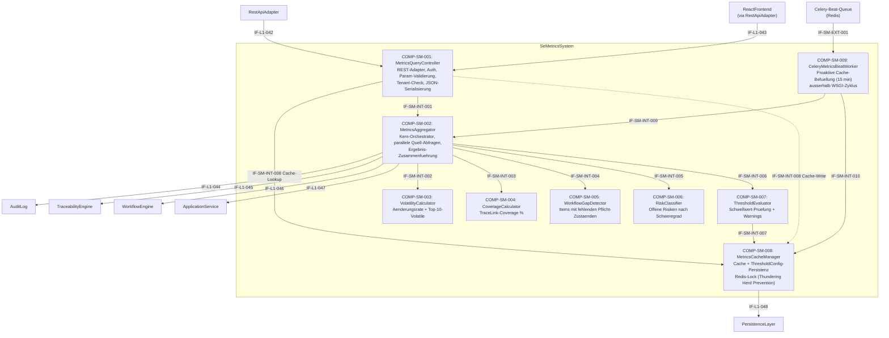

# L2 SeMetrics Architecture

> **Level:** L2 (Subsystem white-box)
> **System:** SeMetricsSystem (ARCH-L1-015)
> **Parent:** L1_Gesamtsystem_Architecture.md
> **Datum:** 2026-06-21
> **Status:** entworfen
> **Designation:** component (terminal — keine L3-Zerlegung)

---

## 1. Verantwortlichkeit

Reines Read-Modell zur Berechnung und Exposition von SE-Prozessmetriken. Aggregiert Daten aus vier Quellsystemen — AuditLog (IF-L1-044), TraceabilityEngine (IF-L1-045), WorkflowEngine (IF-L1-046) und ApplicationService (IF-L1-047) — und stellt das Ergebnis als strukturierten JSON-Metrikbericht bereit. Das System fuehrt keine schreibenden Operationen auf Kern-Entitaeten durch. Einzige erlaubte Schreibzugriffe: optionaler Metric-Cache (IF-L1-048) und Schwellwert-Konfiguration (IF-L1-048).

---

## 2. Black-Box (Eingebettete Sicht)

### Externe Schnittstellen

| ID | Richtung | Gegenstelle | Typ | Vertrag |
|----|----------|-------------|-----|---------|
| IF-L1-042 | eingehend | RestApiAdapter | HTTP/JSON (In-Process Python) | `compute_metrics(workspace_id, timeframe, scope_filter)` via `GET /metrics/workspace/{id}` — Haupt-Trigger der Metrik-Berechnung |
| IF-L1-043 | eingehend | ReactFrontend (via RestApiAdapter) | HTTP/JSON | Dashboard-Datenabruf; identischer Endpunkt wie IF-L1-042, unterschiedlicher Aufrufer (A001 → A002 → A015) |
| IF-L1-044 | ausgehend | AuditLog | In-Process Python | `query_changes(workspace_id, timeframe)` — Lesezugriff auf AuditLogEntry fuer Volatility-Quelldaten |
| IF-L1-045 | ausgehend | TraceabilityEngine | In-Process Python | `coverage(workspace_id)` — Lesezugriff auf TraceLink-Coverage fuer Coverage-Berechnung |
| IF-L1-046 | ausgehend | WorkflowEngine | In-Process Python | `find_incomplete_states(workspace_id)` — Lesezugriff auf WorkflowState fuer Luecken-Erkennung |
| IF-L1-047 | ausgehend | ApplicationService | In-Process Python | `query_risks_by_severity(workspace_id)` — Lesezugriff auf Risiko-Artefakte |
| IF-L1-048 | ausgehend | PersistenceLayer | Django ORM | Metric-Cache-Entity (Lesen/Schreiben) + ThresholdConfig-Entity (Lesen/Schreiben) — einzige Schreibzugriffe des Systems |
| IF-SM-EXT-001 | ausgehend | Celery-Beat-Queue (Redis) | Message Queue | Periodischer Task-Dispatch fuer proaktive Cache-Befuellung aller aktiven Workspaces; Intervall konfigurierbar (Default: 15 Minuten); Vertrag: `prefill_metrics_cache(workspace_ids: list[str])` als Celery-Task-Signatur |

---

## 3. White-Box (Komponenten-Zerlegung)

### Komponenten

| Komp-ID | Name | Verantwortlichkeit | Domain | REQ-Referenz |
|---------|------|--------------------|--------|--------------|
| COMP-SM-001 | MetricsQueryController | REST-Endpunkt-Adapter: empfaengt `GET /metrics/workspace/{id}`, validiert Bearer Token (401), prueft workspace_id-Existenz (404), fuehrt Tenant-Isolation-Check durch (403), parst und validiert `timeframe`- und `scope_filter`-Parameter (400), koordiniert MetricsAggregator und serialisiert die JSON-Antwort nach stabilem Format | software | REQ-L2-SM-001, REQ-L2-SM-002, REQ-L2-SM-010, REQ-L2-SM-012 |
| COMP-SM-002 | MetricsAggregator | Kern-Orchestrator: ruft die vier Quell-Interfaces (IF-L1-044..047) parallel ab, delegiert Berechnungen an VolatilityCalculator, CoverageCalculator, WorkflowGapDetector und RiskClassifier, sammelt deren Ergebnisse, delegiert Schwellwert-Pruefung an ThresholdEvaluator, baut das vollstaendige MetricsResult-Objekt zusammen | software | REQ-L2-SM-001, REQ-L2-SM-008, REQ-L2-SM-011 |
| COMP-SM-003 | VolatilityCalculator | Berechnet Requirements Volatility: zaehlt Aenderungsereignisse (Operation `update`/`workflow_transition`, EntityType `Requirement`) je Requirement aus AuditLog-Quelldaten, berechnet Gesamt-Aenderungsrate (total_changes / total_requirements), erstellt geordnete Top-10-Volatile-Liste | software | REQ-L2-SM-003 |
| COMP-SM-004 | CoverageCalculator | Berechnet Traceability Coverage: ermittelt aus TraceabilityEngine-Quelldaten Anteil der Requirements mit mindestens einem ausgehenden TraceLink, berechnet coverage_percent (1 Nachkommastelle), erstellt Liste uncovered_ids | software | REQ-L2-SM-004 |
| COMP-SM-005 | WorkflowGapDetector | Erkennt Workflow-Luecken: identifiziert aus WorkflowEngine-Quelldaten Items, die einen obligatorischen Zustand der aktiven WorkflowDefinition nie durchlaufen haben, erstellt Liste mit item_id, item_type und missing_state | software | REQ-L2-SM-005 |
| COMP-SM-006 | RiskClassifier | Klassifiziert offene Risiken: filtert aus ApplicationService-Quelldaten Risiko-Artefakte mit WorkflowState != geschlossen/mitigation-abgeschlossen, aggregiert nach Schweregrad (critical, high, medium, low), berechnet Gesamtanzahl | software | REQ-L2-SM-006 |
| COMP-SM-007 | ThresholdEvaluator | Prueft berechnete Metrikwerte gegen konfigurierte Schwellwerte je Workspace: liest ThresholdConfig via IF-SM-INT-006 aus MetricsCacheManager, erzeugt warnings-Liste mit Metrik-Name, Ist-Wert, Schwellwert und Beschreibung fuer Ueberschreitungen | software | REQ-L2-SM-007 |
| COMP-SM-008 | MetricsCacheManager | Verwaltet optionalen Metric-Cache (IF-L1-048): prueft Cache-Treffer vor Berechnung, schreibt berechnete Ergebnisse nach Berechnung, invalidiert bei Aenderungsereignis oder nach TTL (Default: 5 min); verwaltet ThresholdConfig-Persistenz (CRUD via IF-L1-048); Cache-Fehler fuehren zu Fallback auf Live-Berechnung (kein 5xx); Thundering Herd Prevention via Redis-Lock: bei Cache-Miss wird Lock gesetzt, eine Berechnung ausgeloest, alle weiteren parallelen Anfragen warten auf Lock-Release statt eigene Berechnungen zu starten; Proaktive Celery-Beat-Integration: dispatcht periodisch Cache-Befuellungs-Task fuer aktive Workspaces via IF-SM-EXT-001 | software | REQ-L2-SM-007, REQ-L2-SM-009, REQ-L2-SM-013 |
| COMP-SM-009 | CeleryMetricsBeatWorker | Celery-Beat-Task, der in konfigurierbarem Intervall (Default: 15 Minuten) Metriken fuer alle aktiven Workspaces vorberechnet und via IF-SM-INT-010 in COMP-SM-008 schreibt; verhindert Cold-Start-Burst nach Cache-Invalidierung; delegiert Berechnung via IF-SM-INT-009 an MetricsAggregator; kein WSGI-Thread wird blockiert, da Ausfuehrung ausserhalb des Request-Response-Zyklus erfolgt | software | REQ-L2-SM-009, REQ-L2-SM-013 |

### Interne Schnittstellen

| ID | Richtung | Quelle -> Ziel | Typ | Vertrag |
|----|----------|----------------|-----|---------|
| IF-SM-INT-001 | intern | COMP-SM-001 -> COMP-SM-002 | In-Process Python | `compute(workspace_id, timeframe, scope_filter, tenant_ctx) -> MetricsResult` |
| IF-SM-INT-002 | intern | COMP-SM-002 -> COMP-SM-003 | In-Process Python | `calculate(audit_entries: list[AuditEntry], timeframe) -> VolatilityResult` |
| IF-SM-INT-003 | intern | COMP-SM-002 -> COMP-SM-004 | In-Process Python | `calculate(coverage_data: CoverageData) -> CoverageResult` |
| IF-SM-INT-004 | intern | COMP-SM-002 -> COMP-SM-005 | In-Process Python | `detect(incomplete_states: list[IncompleteState]) -> WorkflowGapResult` |
| IF-SM-INT-005 | intern | COMP-SM-002 -> COMP-SM-006 | In-Process Python | `classify(risk_artifacts: list[RiskArtifact]) -> RiskResult` |
| IF-SM-INT-006 | intern | COMP-SM-002 -> COMP-SM-007 | In-Process Python | `evaluate(metrics_result: MetricsResult, workspace_id) -> list[Warning]` |
| IF-SM-INT-007 | intern | COMP-SM-007 -> COMP-SM-008 | In-Process Python | `get_threshold_config(workspace_id) -> ThresholdConfig` |
| IF-SM-INT-008 | intern | COMP-SM-001 -> COMP-SM-008 | In-Process Python | `get_cached(workspace_id, timeframe) -> MetricsResult | None` und `put_cached(workspace_id, timeframe, result)` |
| IF-SM-INT-009 | intern | COMP-SM-009 -> COMP-SM-002 | In-Process Python (Celery-Worker-Kontext) | `compute(workspace_id, timeframe, scope_filter=None, tenant_ctx=SystemCtx) -> MetricsResult` — Beat-Worker delegiert vollstaendige Berechnung an MetricsAggregator |
| IF-SM-INT-010 | intern | COMP-SM-009 -> COMP-SM-008 | In-Process Python (Celery-Worker-Kontext) | `put_cached(workspace_id, timeframe, result: MetricsResult)` — Beat-Worker schreibt vorberechnetes Ergebnis direkt in Cache; Lock wird nach Schreiboperation freigegeben |

### Dependency-Graph (azyklisch)

Unidirektionaler Datenfluss: Eingang → Controller → Aggregator → Calculator-Schicht → Cache/Threshold. Celery-Beat-Pfad laeuft parallel zum synchronen Request-Pfad.

```
IF-L1-042/043 (extern, eingehend)        IF-SM-EXT-001 (Celery-Beat-Queue, eingehend)
        |                                         |
        v                                         v
COMP-SM-001 (MetricsQueryController)    COMP-SM-009 (CeleryMetricsBeatWorker)
        |  IF-SM-INT-008 (Cache-Lookup)           |  IF-SM-INT-009
        |-----> COMP-SM-008 (MetricsCacheManager) |-----> COMP-SM-002 (MetricsAggregator)
        |                |   ^                    |  IF-SM-INT-010       |
        |                |   |--------------------+-> COMP-SM-008        |
        |                v                                               |
        |           IF-L1-048 (PersistenceLayer)                        |
        |                                                                |
        | IF-SM-INT-001                                                  |
        v                                                                |
COMP-SM-002 (MetricsAggregator) <---------------------------------------+
    |   |   |   |   |
    |   |   |   |   |-- IF-L1-044 --> AuditLog (extern)
    |   |   |   |-- IF-L1-045 --> TraceabilityEngine (extern)
    |   |   |-- IF-L1-046 --> WorkflowEngine (extern)
    |   |-- IF-L1-047 --> ApplicationService (extern)
    |
    |-- IF-SM-INT-002 --> COMP-SM-003 (VolatilityCalculator)
    |-- IF-SM-INT-003 --> COMP-SM-004 (CoverageCalculator)
    |-- IF-SM-INT-004 --> COMP-SM-005 (WorkflowGapDetector)
    |-- IF-SM-INT-005 --> COMP-SM-006 (RiskClassifier)
    |-- IF-SM-INT-006 --> COMP-SM-007 (ThresholdEvaluator)
                              |
                              | IF-SM-INT-007
                              v
                         COMP-SM-008 (MetricsCacheManager)
                              |
                              v
                         IF-L1-048 (PersistenceLayer)
```

**Nachweis Azyklizitaet:** Alle Pfeile verlaufen von den Eingangspunkten (IF-L1-042/043, IF-SM-EXT-001) in Richtung PersistenceLayer. COMP-SM-009 ist reiner Quellknoten im internen Graph (keine eingehenden internen Kanten). Kein Knoten taucht als Quelle und Ziel in einem Zyklus auf.

### Komponentendiagramm (Mermaid)



**Legende:** Durchgezogene Pfeile = synchrone In-Process-Aufrufe. Gestrichelte Pfeile = optionale Post-Berechnung Cache-Schreibung. COMP-SM-009 laeuft im Celery-Worker-Prozess ausserhalb des WSGI-Request-Zyklus.

---

## 4. Zugeordnete REQ-L2

| REQ-L2 | Komponente(n) |
|--------|---------------|
| REQ-L2-SM-001 | COMP-SM-001, COMP-SM-002 |
| REQ-L2-SM-002 | COMP-SM-001 |
| REQ-L2-SM-003 | COMP-SM-003 |
| REQ-L2-SM-004 | COMP-SM-004 |
| REQ-L2-SM-005 | COMP-SM-005 |
| REQ-L2-SM-006 | COMP-SM-006 |
| REQ-L2-SM-007 | COMP-SM-007, COMP-SM-008 |
| REQ-L2-SM-008 | COMP-SM-002, COMP-SM-003, COMP-SM-004, COMP-SM-005, COMP-SM-006 |
| REQ-L2-SM-009 | COMP-SM-008, COMP-SM-009 |
| REQ-L2-SM-010 | COMP-SM-001 |
| REQ-L2-SM-011 | COMP-SM-002, COMP-SM-008 |
| REQ-L2-SM-012 | COMP-SM-001 |
| REQ-L2-SM-013 | COMP-SM-008, COMP-SM-009 |

---

## 5. Interface-Belegung (IF-L1-042..048)

| Interface | Eigentuemerkomponente | Richtung | Zweck |
|-----------|----------------------|----------|-------|
| IF-L1-042 | COMP-SM-001 | eingehend | REST-Request von RestApiAdapter — Metrik-Abfrage ausloesen |
| IF-L1-043 | COMP-SM-001 | eingehend | Dashboard-Datenabruf von ReactFrontend (via RestApiAdapter) |
| IF-L1-044 | COMP-SM-002 | ausgehend | AuditLog-Lesezugriff fuer Volatility-Quelldaten |
| IF-L1-045 | COMP-SM-002 | ausgehend | TraceabilityEngine-Lesezugriff fuer Coverage-Daten |
| IF-L1-046 | COMP-SM-002 | ausgehend | WorkflowEngine-Lesezugriff fuer Luecken-Daten |
| IF-L1-047 | COMP-SM-002 | ausgehend | ApplicationService-Lesezugriff fuer Risiko-Artefakte |
| IF-L1-048 | COMP-SM-008 | ausgehend | PersistenceLayer fuer Cache-Entitaet und ThresholdConfig (einzige Schreibzugriffe) |
| IF-SM-EXT-001 | COMP-SM-009 | ausgehend | Celery-Beat-Queue (Redis) — periodischer Task-Dispatch fuer proaktive Cache-Befuellung aller aktiven Workspaces |

---

## 6. ADRs (lokal)

**ADR-SM-01 — Strikter Read-Modell-Charakter mit dediziertem Aggregator**
*Entscheidung:* MetricsAggregator (COMP-SM-002) ruft alle vier Quell-Interfaces (IF-L1-044..047) ausschliesslich lesend ab. Schreibzugriffe auf Kern-Entitaeten sind architektonisch ausgeschlossen.
*Rationale:* Ein Read-Modell ohne Seiteneffekte verhindert zirkulaere Abhaengigkeiten (SeMetrics liest aus Systemen, die durch eigene Schreiboperationen veraendert wuerden). Trennung von Lese- und Schreibpfad folgt CQRS-Prinzip und schuetzt die transaktionalen Pfade der Quellsysteme vor unbeabsichtigter Veraenderung.
*Verworfene Alternative:* SeMetrics mit eigenem Schreibzugriff auf WorkflowState (z.B. zum Markieren gepruefter Luecken) — abgelehnt, da dies den Read-Modell-Charakter verletzt und zirkulaere Abhaengigkeiten erzeugt.

**ADR-SM-02 — Separation der vier Metrik-Berechnungen in eigenstaendige Calculator-Komponenten**
*Entscheidung:* Vier dedizierte Calculator-Komponenten (COMP-SM-003..006) statt einer monolithischen Berechnungsklasse.
*Rationale:* Jede Metrik hat eine eigenstaendige Datenquelle, einen eigenstaendigen Algorithmus und eigenstaendige Acceptance Criteria. Die Trennung ermoeglicht unabhaengige Testbarkeit, parallele Ausfuehrung der vier Quell-Abfragen im MetricsAggregator und spaetere Erweiterung (neue Metrik-Typen) ohne bestehende Berechnungen zu tangieren. Orthogonalitaet ist voll gewahrt — keine Calculator-Komponente teilt Zustand mit einer anderen.
*Verworfene Alternative:* Einzelner `MetricsCalculator` mit vier Methoden — abgelehnt wegen eingeschraenkter Testbarkeit und schlechterer Kohäsion.

**ADR-SM-03 — Optionaler Cache als eigenstaendige Komponente (COMP-SM-008), nicht als Querschnitts-Decorator**
*Entscheidung:* MetricsCacheManager als separate Komponente mit expliziten Cache-Lookup- und Cache-Write-Aufrufen vom MetricsQueryController und MetricsAggregator.
*Rationale:* Cache-Logik (TTL, Invalidierung, Fehler-Fallback) ist eigenstaendige Verantwortlichkeit. Als Decorator auf dem Aggregator wuerde sie die Calculator-Testbarkeit beeintraechtighen. Explizite Aufrufpunkte machen das Cache-Verhalten transparent und testbar. Cache-Fehler erzeugen keinen 5xx — Fallback auf Live-Berechnung ist in COMP-SM-008 lokalisiert.
*Verworfene Alternative:* Transparentes Caching als Decorator-Pattern ueber den MetricsAggregator — abgelehnt wegen schlechterer Testbarkeit der Fallback-Logik und verschwommenem Verantwortungsschnitt.

**ADR-SM-04 — ThresholdConfig-Persistenz in COMP-SM-008 (MetricsCacheManager)**
*Entscheidung:* COMP-SM-008 verwaltet sowohl Metric-Cache als auch ThresholdConfig-Persistenz via IF-L1-048.
*Rationale:* Beide sind Workspace-gebundene Konfigurationsdaten, die via IF-L1-048 (PersistenceLayer) gelesen und geschrieben werden. Gemeinsame Verwaltung in COMP-SM-008 vermeidet eine neunte Komponente ausschliesslich fuer Konfigurationspersistenz. IF-L1-048 ist der einzige legitime Schreibkanal des Read-Modells — seine Buendelung in einer Komponente macht den Read-Modell-Charakter des gesamten Systems verifizierbar.
*Verworfene Alternative:* Separate ThresholdConfigManager-Komponente — abgelehnt, da dies zu zwei Komponenten mit identischer Schnittstellennutzung (IF-L1-048) und ueberlappendem Verantwortungsbereich fuehrt.

**ADR-SM-05 — Celery-Beat + Redis-Lock fuer proaktive Cache-Befuellung und Thundering Herd Prevention**
*Entscheidung:* COMP-SM-009 (CeleryMetricsBeatWorker) befuellt den Cache proaktiv alle 15 Minuten via Celery-Beat. COMP-SM-008 setzt bei Cache-Miss einen Redis-Lock, um sicherzustellen, dass nur eine parallele Anfrage die Berechnung ausloest; alle anderen warten auf Lock-Release und lesen dann den befuellten Cache.
*Rationale:* Proaktive Cache-Befuellung verhindert Cache-Miss-Bursts nach TTL-Ablauf oder Cache-Invalidierung (Cold-Start-Problem). Der Redis-Lock im MetricsCacheManager verhindert das Thundering-Herd-Problem, bei dem N gleichzeitige Cache-Misses N parallele schwere Aggregationsberechnungen ausloesen wuerden und den WSGI-Thread-Pool erschoepfen koennten. Die Ausfuehrung im Celery-Worker-Prozess haelt den WSGI-Request-Response-Zyklus frei von blockierenden Aggregationsoperationen. Redis ist bereits als Celery-Broker vorhanden — kein zusaetzlicher Infrastruktur-Aufwand.
*Verworfene Alternative:* Lazy-Berechnung bei jedem Cache-Miss ohne Lock-Mechanismus — abgelehnt wegen Thundering-Herd-Gefahr (N gleichzeitige Requests loesen N Berechnungen aus) und WSGI-Thread-Erschoepfung bei hochfrequenten gleichzeitigen Dashboard-Zugriffen.

---

## 7. Decomposition Completeness

| Aspekt | Abdeckung |
|--------|-----------|
| Alle IF-L1-042..048 eingebunden | vollstaendig (IF-L1-042/043 → COMP-SM-001; IF-L1-044..047 → COMP-SM-002; IF-L1-048 → COMP-SM-008) |
| IF-SM-EXT-001 eingebunden | vollstaendig (IF-SM-EXT-001 → COMP-SM-009, Celery-Beat-Queue-Anbindung) |
| Alle REQ-L2-SM-001..013 zugewiesen | vollstaendig (jede REQ referenziert mindestens eine COMP-SM-xxx; REQ-L2-SM-013 → COMP-SM-008, COMP-SM-009) |
| Azyklischer Dependency-Graph | nachgewiesen (§3, Dependency-Graph-Abschnitt); COMP-SM-009 ist Eingangsknoten ohne eingehende interne Kanten |
| Read-Modell-Charakter (REQ-L2-SM-008) | strukturell erzwungen (nur COMP-SM-008 hat IF-L1-048 Schreibzugriff; COMP-SM-009 schreibt ausschliesslich in Cache via COMP-SM-008) |
| Tenant-Isolation (REQ-L2-SM-010) | COMP-SM-001 prueft Tenant-Kontext vor Delegation an COMP-SM-002 |
| Performance-SLA (REQ-L2-SM-011) | COMP-SM-002 parallelisiert vier Quell-Abfragen; COMP-SM-008 Cache-Pfad ≤ 100ms |
| Thundering Herd Prevention (REQ-L2-SM-013) | COMP-SM-008 Redis-Lock bei Cache-Miss; COMP-SM-009 proaktive Vorbefuellung verhindert Cold-Start-Burst |
| Designation | terminal — component-level leaf, keine L3-Zerlegung |

---

*Erstellt durch se-architect-Agent | ReqFlow SE-Kaskade L1→L2 | 2026-06-21*
*Handoff: HOFF-20260621-007 | Parent: ARCH-L1-015 | REQ-Quelle: REQ-L2-SM-001..012*
*Designation: component (terminal) — decomposition_status: terminal*
