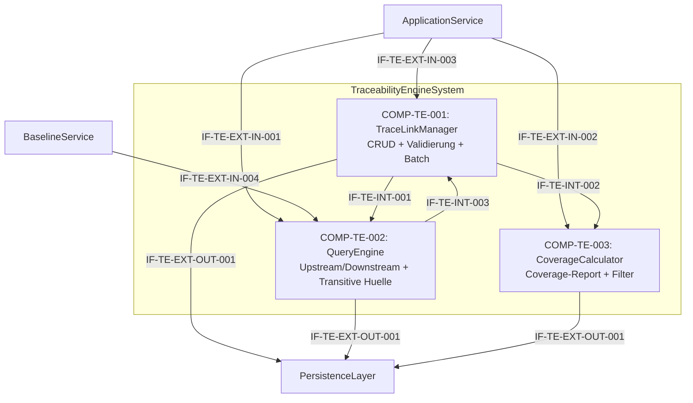

# L2 TraceabilityEngine Architecture

> **Level:** L2 (Subsystem white-box)
> **System:** TraceabilityEngineSystem (ARCH-L1-007)
> **Parent:** L1_Gesamtsystem_Architecture.md
> **Datum:** 2026-06-20
> **Status:** entworfen

---

## 1. Verantwortlichkeit

Verwaltet TraceLinks zwischen Requirements, ArchitectureElements und TestCases mit den Link-Typen `parent-child`, `derives-from`, `satisfies`, `verifies`, `implements`, `refines`. Beantwortet Upstream/Downstream-Queries und Coverage-Reports. Performance-Ziel: < 200 ms fuer 10.000 Items.

---

## 2. Black-Box (Eingebettete Sicht)

### Externe Schnittstellen

| ID | Richtung | Gegenstelle | Typ | Vertrag |
|----|----------|-------------|-----|---------|
| IF-TE-EXT-IN-001 | eingehend | ApplicationService | In-Process Python | `query(artifact_id, direction, ctx)` — Upstream/Downstream-Query |
| IF-TE-EXT-IN-002 | eingehend | ApplicationService | In-Process Python | `coverage(workspace_id, filters?, ctx)` — Coverage-Report-Anfrage |
| IF-TE-EXT-IN-003 | eingehend | ApplicationService | In-Process Python | TraceLink-CRUD (`create`, `read`, `update`, `delete`) |
| IF-TE-EXT-IN-004 | eingehend | BaselineService | In-Process Python | `collect_trace_graph(workspace_id, ctx)` — Trace-Graph fuer Snapshot |
| IF-TE-EXT-OUT-001 | ausgehend | PersistenceLayer | Django ORM | TraceLink-Entitaet + Custom Manager |

---

## 3. White-Box (Komponenten-Zerlegung)

### Komponenten

| Komp-ID | Name | Verantwortlichkeit | Domain |
|---------|------|--------------------|--------|
| COMP-TE-001 | TraceLinkManager | TraceLink-CRUD, Link-Typ-Validierung, Zyklenpraevention fuer `parent-child`, atomare Batch-Operationen, referentielle Integritaet (CASCADE), Audit-Metadaten | software |
| COMP-TE-002 | QueryEngine | Upstream/Downstream-Queries (direkte Nachbarn), transitive Huellenberechnung (Impact-Analyse), Performance-optimierte Graph-Traversierung via PostgreSQL Recursive CTE | software |
| COMP-TE-003 | CoverageCalculator | Test-Coverage-Berechnung (Requirement -> TestCase via `verifies`), gefilterte Coverage nach Artefakttyp und Link-Typ | software |

### Interne Schnittstellen

| ID | Richtung | Quelle -> Ziel | Typ | Vertrag |
|----|----------|----------------|-----|---------|
| IF-TE-INT-001 | intern | COMP-TE-001 -> COMP-TE-002 | In-Process Python | `get_trace_links(workspace_id, filters) -> TraceLink[]` |
| IF-TE-INT-002 | intern | COMP-TE-001 -> COMP-TE-003 | In-Process Python | `get_trace_links(workspace_id, link_type) -> TraceLink[]` |
| IF-TE-INT-003 | intern | COMP-TE-002 -> COMP-TE-001 | In-Process Python | `validate_graph_integrity() -> ValidationResult` |

### Komponentendiagramm (Mermaid)

---

## 4. Zugeordnete REQ-L2

| REQ-L2 | Komponente |
|--------|-----------|
| REQ-L2-TE-001 | COMP-TE-001 |
| REQ-L2-TE-002 | COMP-TE-001 |
| REQ-L2-TE-003 | COMP-TE-001 |
| REQ-L2-TE-004 | COMP-TE-002 |
| REQ-L2-TE-005 | COMP-TE-002 |
| REQ-L2-TE-006 | COMP-TE-003 |
| REQ-L2-TE-007 | COMP-TE-003 |
| REQ-L2-TE-008 | COMP-TE-002 |
| REQ-L2-TE-009 | COMP-TE-001 |
| REQ-L2-TE-010 | COMP-TE-001 |
| REQ-L2-TE-011 | COMP-TE-001 |
| REQ-L2-TE-012 | COMP-TE-001, COMP-TE-002, COMP-TE-003 |

---

## 5. ADRs (lokal)

**ADR-TE-01 — Drei Komponenten statt monolithischer Engine**
*Entscheidung:* TraceLinkManager, QueryEngine, CoverageCalculator.
*Rationale:* CRUD (schreibend), Graph-Query (lesend, performance-kritisch) und Coverage (analytisch, aggregierend) haben unterschiedliche Zugriffsmuster und Optimierungsziele. Die Trennung erlaubt unabhaengige Caching- und Optimierungsstrategien.
*Verworfene Alternative:* Monolithische TraceabilityEngine — abgelehnt wegen Vermischung von schreibenden, lesenden und analytischen Pfaden.

**ADR-TE-02 — PostgreSQL GIST/GIN + Recursive CTE fuer Graph-Queries**
*Entscheidung:* Graph-Queries ueber PostgreSQL Recursive CTEs mit GIST/GIN-Indizes.
*Rationale:* Django ORM allein ist fuer transitive Graph-Traversierung unzureichend. Recursive CTEs sind der Standard-Ansatz fuer hierarchische/graphenartige Daten in PostgreSQL und erfuellen das < 200ms-SLA.
*Verworfene Alternative:* Neo4j oder RedisGraph als separater Service — abgelehnt wegen Self-Hosted-Overhead.

---

*Erstellt durch se-architect-Agent | ReqFlow SE-Kaskade | 2026-06-20*
