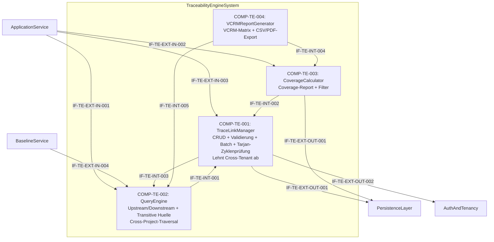

# L2 TraceabilityEngine Architecture

> **Level:** L2 (Subsystem white-box)
> **System:** TraceabilityEngineSystem (ARCH-L1-007)
> **Parent:** L1_Gesamtsystem_Architecture.md
> **Datum:** 2026-06-20
> **Status:** entworfen

---

## 1. Verantwortlichkeit

Verwaltet TraceLinks zwischen Requirements, ArchitectureElements und TestCases mit den Link-Typen `parent-child`, `derives-from`, `satisfies`, `verifies`, `implements`, `refines`, `documents`, `realizes`. Beantwortet Upstream/Downstream-Queries (inkl. Cross-Projekt-Traversal) und Coverage-Reports. Performance-Ziel: < 200 ms fuer 10.000 Items.

---

## 2. Black-Box (Eingebettete Sicht)

### Externe Schnittstellen

| ID | Richtung | Gegenstelle | Typ | Vertrag |
|----|----------|-------------|-----|---------|
| IF-TE-EXT-IN-001 | eingehend | ApplicationService | In-Process Python | `query(artifact_id, direction, ctx)` — Upstream/Downstream-Query |
| IF-TE-EXT-IN-002 | eingehend | ApplicationService | In-Process Python | `coverage(workspace_id, filters?, ctx)` — Coverage-Report-Anfrage |
| IF-TE-EXT-IN-003 | eingehend | ApplicationService | In-Process Python | TraceLink-CRUD (`create`, `read`, `update`, `delete`) |
| IF-TE-EXT-IN-004 | eingehend | BaselineService | In-Process Python | `collect_trace_graph(workspace_id, ctx)` — Trace-Graph fuer Snapshot |
| IF-TE-EXT-OUT-001 | ausgehend | PersistenceLayer | Django ORM | TraceLink-Entitaet + Custom Manager |
| IF-TE-EXT-OUT-002 | ausgehend | AuthAndTenancy | In-Process Python | `validate_cross_tenant_boundary(source, target)` — Guard gegen Cross-Tenant-Links (IF-L1-056) |

---

## 3. White-Box (Komponenten-Zerlegung)

### Komponenten

| Komp-ID | Name | Verantwortlichkeit | Domain |
|---------|------|--------------------|--------|
| COMP-TE-001 | TraceLinkManager | TraceLink-CRUD, Link-Typ-Validierung (8 Link-Typen inkl. 'documents', 'realizes'), Zyklenprüfung via Tarjan-Algorithmus (Bulk: am Ende der Transaktion; Single: eager vor Persistenz); lehnt Cross-Tenant-Links ab; Rollback mit Pfad-Fehlerbericht, atomare Batch-Operationen, referentielle Integritaet (CASCADE), Audit-Metadaten, project_id Awareness | software |
| COMP-TE-002 | QueryEngine | Upstream/Downstream-Queries (direkte Nachbarn), transitive Huellenberechnung (Impact-Analyse inkl. Cross-Projekt-Graph-Traversal via project_id), Performance-optimierte Graph-Traversierung via PostgreSQL Recursive CTE | software |
| COMP-TE-003 | CoverageCalculator | Test-Coverage-Berechnung (Requirement -> TestCase via `verifies`), gefilterte Coverage nach Artefakttyp und Link-Typ | software |
| COMP-TE-004 | VCRMReportGenerator | Generiert Verification Cross Reference Matrix (flache Matrix: requirement_id → component_id → test_case_id → test_result); filterbar nach Baseline und Workspace; Export als CSV; optionaler PDF-Export via Template-Renderer | software |

### Interne Schnittstellen

| ID | Richtung | Quelle -> Ziel | Typ | Vertrag |
|----|----------|----------------|-----|---------|
| IF-TE-INT-001 | intern | COMP-TE-002 -> COMP-TE-001 | In-Process Python | `get_trace_links(workspace_id, filters) -> TraceLink[]` |
| IF-TE-INT-002 | intern | COMP-TE-003 -> COMP-TE-001 | In-Process Python | `get_trace_links(workspace_id, link_type) -> TraceLink[]` |
| IF-TE-INT-003 | intern | COMP-TE-001 -> COMP-TE-002 | In-Process Python | `validate_graph_integrity() -> ValidationResult` |
| IF-TE-INT-004 | intern | COMP-TE-004 -> COMP-TE-003 | In-Process Python | `get_coverage_data(workspace_id, baseline_id?) -> CoverageData` — liest Coverage-Daten fuer VCRM |
| IF-TE-INT-005 | intern | COMP-TE-004 -> COMP-TE-002 | In-Process Python | `query(artifact_id, direction, ctx) -> TraceLink[]` — liest Komponenten-Links fuer VCRM-Matrix |

### Komponentendiagramm (Mermaid)

---

## 4. Zugeordnete REQ-L2

| REQ-L2 | Komponente |
|--------|-----------|
| REQ-L2-TE-001 | COMP-TE-001 |
| REQ-L2-TE-002 | COMP-TE-001 |
| REQ-L2-TE-003 | COMP-TE-001 |
| REQ-L2-TE-004 | COMP-TE-002 |
| REQ-L2-TE-005 | COMP-TE-002 |
| REQ-L2-TE-006 | COMP-TE-003 |
| REQ-L2-TE-007 | COMP-TE-003 |
| REQ-L2-TE-008 | COMP-TE-002 |
| REQ-L2-TE-009 | COMP-TE-001 |
| REQ-L2-TE-010 | COMP-TE-001 |
| REQ-L2-TE-011 | COMP-TE-001 |
| REQ-L2-TE-012 | COMP-TE-001, COMP-TE-002, COMP-TE-003 |
| REQ-L2-TE-013 | COMP-TE-004 |

---

## 5. ADRs (lokal)

**ADR-TE-01 — Vier Komponenten statt monolithischer Engine**
*Entscheidung:* TraceLinkManager, QueryEngine, CoverageCalculator, VCRMReportGenerator.
*Rationale:* CRUD (schreibend), Graph-Query (lesend, performance-kritisch), Coverage (analytisch, aggregierend) und VCRM-Report (dedizierter Report-Typ mit eigenem Ausgabeformat) haben unterschiedliche Zugriffsmuster und Optimierungsziele. Die Trennung erlaubt unabhaengige Caching- und Optimierungsstrategien.
*Verworfene Alternative:* Monolithische TraceabilityEngine — abgelehnt wegen Vermischung von schreibenden, lesenden und analytischen Pfaden.

**ADR-TE-03 — Tarjan-Algorithmus fuer Bulk-Zyklenprüfung**
*Entscheidung:* Zyklenprüfung bei Bulk-Importen wird am Ende der gesamten Transaktion via Tarjan (O(V+E)) durchgeführt; bei Single-Links erfolgt eine Eager-Prüfung vor der Persistenz.
*Rationale:* Eager-Prüfung pro Link im Bulk-Kontext wäre O(n²) und würde das < 200 ms-SLA bei grossen Importen verletzen. Tarjan am Transaktionsende ist linear und erhält ACID-Garantien durch atomaren Rollback bei Zykluserkennung (Pfad-Fehlerbericht inklusive).
*Verworfene Alternative:* Eager-Prüfung pro Link im Bulk — abgelehnt wegen O(n²)-Performance-Impact.

**ADR-TE-04 — VCRM als eigene Komponente (VCRMReportGenerator)**
*Entscheidung:* VCRM-Generierung in COMP-TE-004 getrennt von COMP-TE-003 (CoverageCalculator).
*Rationale:* VCRM ist ein dedizierter Report-Typ mit eigenem Ausgabeformat (flache Matrix, CSV/PDF). Die Trennung von CoverageCalculator (numerische Aggregate) ermöglicht unabhängige Evolution beider Komponenten: Export-Formate und Baseline-Filter ändern sich unabhängig von Coverage-Berechnungslogik.
*Verworfene Alternative:* VCRM in CoverageCalculator integriert — abgelehnt wegen SRP-Verletzung (unterschiedliche Zuständigkeiten und Ausgabeformate).

**ADR-TE-02 — PostgreSQL GIST/GIN + Recursive CTE fuer Graph-Queries**
*Entscheidung:* Graph-Queries ueber PostgreSQL Recursive CTEs mit GIST/GIN-Indizes.
*Rationale:* Django ORM allein ist fuer transitive Graph-Traversierung unzureichend. Recursive CTEs sind der Standard-Ansatz fuer hierarchische/graphenartige Daten in PostgreSQL und erfuellen das < 200ms-SLA.
*Verworfene Alternative:* Neo4j oder RedisGraph als separater Service — abgelehnt wegen Self-Hosted-Overhead.

---

## 6. Resilienz, Timeout & Graceful Degradation

Um das Performance-Ziel (< 200 ms) und die Systemstabilität zu gewährleisten, gelten folgende Strategien für externe Aufrufe:

- **AuthAndTenancy (IF-TE-EXT-OUT-002):**
  - **Timeout:** 50 ms für `validate_cross_tenant_boundary`.
  - **Retry-Strategie:** Max. 1 synchroner Retry (z. B. bei transienten Netzwerk/In-Process-Pikes) mit minimalem Backoff (10 ms).
  - **Graceful Degradation:** Fail-Closed aus Security-Gründen. Wenn der Service nicht antwortet, wird die Aktion abgewiesen (`503 Service Unavailable / Auth Timeout`), um unautorisierte Cross-Tenant-Links zu verhindern, ohne den aufrufenden Thread zu blockieren.

- **PersistenceLayer / DB (IF-TE-EXT-OUT-001 & Raw Queries):**
  - **Timeout (Komplexe Queries):** Harter Datenbank-Timeout (Statement Timeout) von `200 ms` auf Recursive CTEs in der `QueryEngine`.
  - **Timeout (CRUD):** Standard-Timeout von `2000 ms` für schreibende Operationen (Transaktionen).
  - **Retry-Strategie:** Keine automatischen Retries bei Statement Timeouts (Vermeidung von Last-Spiralen / Thundering Herd). Fast-Fail an den Caller.
  - **Graceful Degradation:** Rückgabe eines expliziten `408 Request Timeout` oder `Partial Result` (sofern die Query iterativ aufgebaut ist), bevorzugt jedoch Fast-Fail, um dem Client die Möglichkeit zur Verfeinerung seiner Query-Parameter (z. B. geringere Tiefe) zu geben.

---

*Erstellt durch se-architect-Agent | ReqFlow SE-Kaskade | 2026-06-20*
