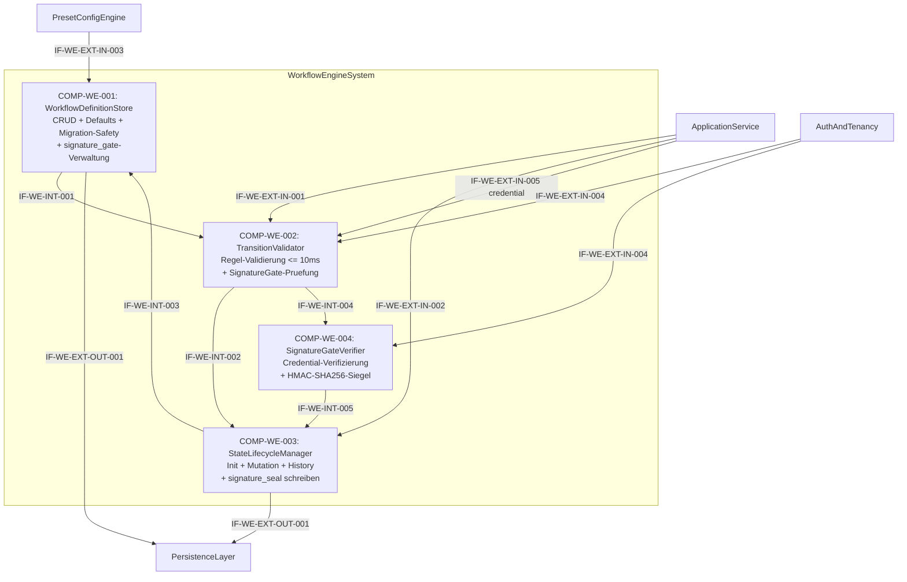

# L2 WorkflowEngine Architecture

> **Level:** L2 (Subsystem white-box)
> **System:** WorkflowEngineSystem (ARCH-L1-005)
> **Parent:** L1_Gesamtsystem_Architecture.md
> **Datum:** 2026-06-20
> **Status:** entworfen

---

## 1. Verantwortlichkeit

Verwaltet konfigurierbare Item-Lifecycles. Fuehrt WorkflowDefinitions pro Item-Typ und Workspace, validiert State-Uebergaenge gegen erlaubte Rollen und `change_reason`-Pflicht, protokolliert jeden Uebergang append-only, und gewaehrleistet Tenant-Isolation sowie Migrations-Sicherheit.

---

## 2. Black-Box (Eingebettete Sicht)

### Externe Schnittstellen

| ID | Richtung | Gegenstelle | Typ | Vertrag |
|----|----------|-------------|-----|---------|
| IF-WE-EXT-IN-001 | eingehend | ApplicationService | In-Process Python | `transition(item_id, target_state, change_reason, ctx)` |
| IF-WE-EXT-IN-002 | eingehend | ApplicationService | In-Process Python | `initialize(item_ids[], item_type, workspace_id, ctx)` |
| IF-WE-EXT-IN-003 | eingehend | PresetConfigEngine | In-Process Python | Preset-Regeln (Workflow-Konfigurierbarkeit) |
| IF-WE-EXT-IN-004 | eingehend | AuthAndTenancy | In-Process Python | Rollen-Kontext; wird zusaetzlich von COMP-WE-004 fuer Credential-Verifizierung (Passwort-Hash-Vergleich, TOTP-Pruefung) genutzt |
| IF-WE-EXT-IN-005 | eingehend | ApplicationService | In-Process Python | `credential (password \| totp_token)` fuer SignatureGate-Verifizierung bei Transitionen mit gesetztem `signature_gate` |
| IF-WE-EXT-OUT-001 | ausgehend | PersistenceLayer | Django ORM | WorkflowDefinition, WorkflowState |

---

## 3. White-Box (Komponenten-Zerlegung)

### Komponenten

| Komp-ID | Name | Verantwortlichkeit | Domain |
|---------|------|--------------------|--------|
| COMP-WE-001 | WorkflowDefinitionStore | CRUD fuer WorkflowDefinitions pro Item-Typ und Workspace, Default-Templates pro Preset, Custom-Definition-Validierung, Migrations-Sicherheit (Orphaned-State-Check), Preset-Downgrade-Blockade; verwaltet `signature_gate`-Attribut pro Transition-Definition | software |
| COMP-WE-002 | TransitionValidator | Validierung aller State-Transitions gegen aktive WorkflowDefinition: Transition-Existenz, Rollenberechtigung, change_reason-Pflicht; prueft SignatureGate-Anforderung — bei Vorhandensein: Delegation des Credentials an COMP-WE-004. Performance-Budget: Validierung <= 10 ms | software |
| COMP-WE-003 | StateLifecycleManager | Atomare State-Initialisierung, State-Mutation mit Optimistic Locking, append-only History-Eintrag, Tenant-Isolation; schreibt `signature_seal` (HMAC-SHA256) in History-Eintrag wenn SignatureGate durchlaufen | software |
| COMP-WE-004 | SignatureGateVerifier | Verifiziert Credentials (Passwort-Hash-Vergleich oder TOTP-Pruefung) gegen AuthAndTenancy; generiert kryptografisches Pruefsiegel (HMAC-SHA256 aus transition_id + timestamp + user_id); gibt `VerificationResult {valid, seal?}` zurueck | software |

### Interne Schnittstellen

| ID | Richtung | Quelle -> Ziel | Typ | Vertrag |
|----|----------|----------------|-----|---------|
| IF-WE-INT-001 | intern | COMP-WE-001 -> COMP-WE-002 | In-Process Python | `WorkflowDefinition {states, transitions, allowed_roles, requires_change_reason, signature_gate?}` |
| IF-WE-INT-002 | intern | COMP-WE-002 -> COMP-WE-003 | In-Process Python | `ValidationResult {valid, error_code?, error_message?}` |
| IF-WE-INT-003 | intern | COMP-WE-003 -> COMP-WE-001 | In-Process Python | `StateQuery {workspace_id, item_type, query_type: "initial_state"}` |
| IF-WE-INT-004 | intern | COMP-WE-002 -> COMP-WE-004 | In-Process Python | `CredentialVerificationRequest {transition_id, user_id, credential (password \| totp_token), timestamp}` |
| IF-WE-INT-005 | intern | COMP-WE-004 -> COMP-WE-003 | In-Process Python | `VerificationResult {valid, seal? (HMAC-SHA256 hex)}` |

### Komponentendiagramm (Mermaid)

---

## 4. Zugeordnete REQ-L2

| REQ-L2 | Komponente |
|--------|-----------|
| REQ-L2-WE-001 | COMP-WE-002 |
| REQ-L2-WE-002 | COMP-WE-001 |
| REQ-L2-WE-003 | COMP-WE-003 |
| REQ-L2-WE-004 | COMP-WE-001 |
| REQ-L2-WE-005 | COMP-WE-003 |
| REQ-L2-WE-006 | COMP-WE-003 |
| REQ-L2-WE-007 | COMP-WE-001 |
| REQ-L2-WE-008 | COMP-WE-002 |
| REQ-L2-WE-009 | COMP-WE-004 |

---

## 5. ADRs (lokal)

**ADR-WE-01 — CQRS-aehnliches Muster mit 3 Modulen**
*Entscheidung:* WorkflowDefinitionStore (schreibend/konfiguratief), TransitionValidator (pruefend, lesend, performance-kritisch), StateLifecycleManager (mutierend, atomar).
*Rationale:* Trennt den niederfrequenten Definitions-CRUD vom hochfrequenten, performance-kritischen Validierungs-Pfad (<= 10ms) und vom atomaren State-Mutation-Pfad. Ermoeglicht zukuenftige Optimierungen (z.B. Caching der WorkflowDefinition im TransitionValidator) ohne Seiteneffekte.
*Verworfene Alternative:* Monolithisches L2-Modul — abgelehnt wegen unklarer Verantwortlichkeiten und Vermischung von Hot-Path und Konfigurationslogik.

**ADR-WE-03 — SignatureGate als dedizierte Komponente (COMP-WE-004)**
*Entscheidung:* Credential-Verifizierung und kryptografische Siegel-Generierung werden in eine eigenstaendige Komponente `SignatureGateVerifier` (COMP-WE-004) ausgelagert statt inline im TransitionValidator implementiert.
*Rationale:* Sicherheitskritische Logik (Passwort-Hash-Vergleich, TOTP-Pruefung, HMAC-Generierung) erfordert Isolation: unabhaengiges Security-Audit ist moeglich, zukuenftige HSM-Integration kann auf Schnittstellenebene eingehaengt werden, und der TransitionValidator bleibt auf sein Performance-Budget (<= 10 ms) fokussiert.
*Verworfene Alternative:* Inline-Implementierung im TransitionValidator — abgelehnt wegen Vermischung von Validierungs- und Sicherheitslogik sowie erschwertem Security-Audit.

**ADR-WE-02 — L3-Zerlegung nicht gerechtfertigt**
*Entscheidung:* WorkflowEngine bleibt auf L2; L3 terminiert.
*Rationale:* Die 3 Module sind kohärente Implementierungsmodule innerhalb einer einzigen Django/DRF-Codebase. Kein Modul besitzt eigene Algorithmik oder Zustandsmaschinen, die einer L3-Zerlegung beduerfen. REQ-L2-WE-012 definiert den Adapter als "pure translation layer".
*Verworfene Alternative:* L3 mit 4 Units (WorkflowDefinitionStore, TransitionValidator, StateMutator, WorkflowMigrationHandler) — abgelehnt wegen Strict-Rule-1-Verletzung und mangelnder architektonischer Relevanz.

---

*Erstellt durch se-architect-Agent | ReqFlow SE-Kaskade | 2026-06-20*
