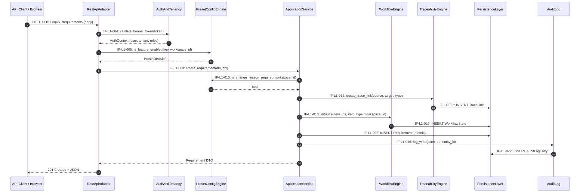
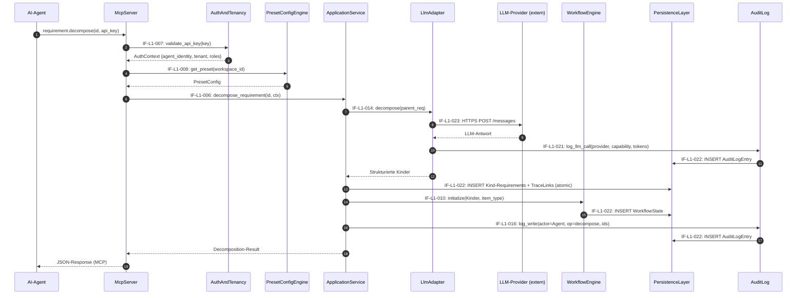
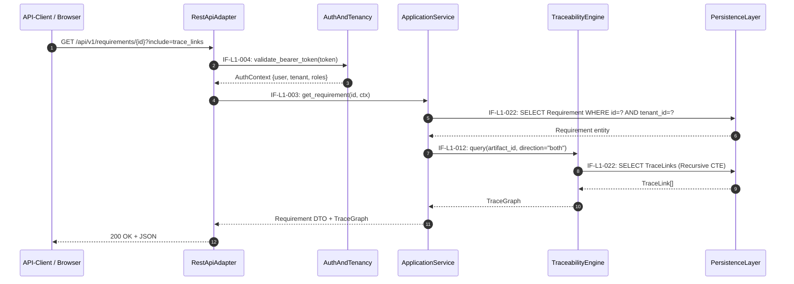
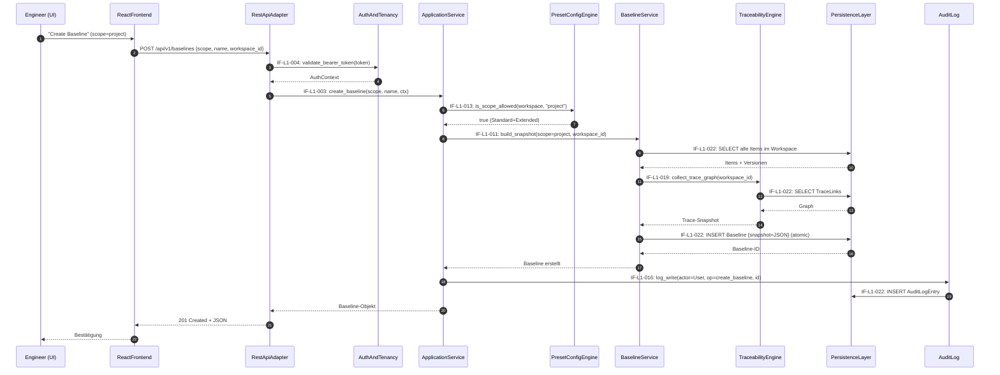

# ReqFlow — Interface Registry

> **Status:** KONSOLIDIERT | **Datum:** 2026-06-20
> **Scope:** L1 (12 Subsysteme) + L2 (55 Komponenten)
> **Total aktive Schnittstellen:** 95
>
> **Quellen (autoritativ):**
> - L1-Architektur: `docs/se/L1/Gesamtsystem/L1_Gesamtsystem_Architecture.md`
> - L2-Architekturen: `docs/se/L1/Gesamtsystem/L2/*/L2_*_Architecture.md` (12 Dateien)
>
> **ID-Schema:**
> - `IF-EXT-NNN` — Externe Schnittstellen (Akteur ↔ Systemgrenze)
> - `IF-L1-NNN` — L1-Inter-System-Schnittstellen (Subsystem ↔ Subsystem)
> - `IF-<SYS>-INT-NNN` — L2-Interne Schnittstellen (Komponente ↔ Komponente innerhalb eines Subsystems)
> - `IF-<SYS>-EXT-IN/OUT-NNN` — L2-Black-Box-Sicht der Subsystemgrenze
>
> **Konventionen:**
> - Quelle = Caller/Consumer; Ziel = Callee/Provider
> - Alle L2-Systeme sind LEAF (terminal) — keine L3-Zerlegung aktiv
> - Entfernte Schnittstellen werden explizit als `(entfernt)` markiert

---

## 1. Externe Schnittstellen (Systemgrenze)

> Akteur ↔ ReqFlow-System. Quellen: L1 §2.1, L2 ReactFrontend §2, McpServer §2, RestApiAdapter §2, LlmAdapter §2.

| ID | Richtung | Akteur / Externes System | Protokoll | Vertrag | REQ-L1 |
|----|----------|-------------------------|-----------|---------|--------|
| IF-EXT-001 | inbound | Software-/Systems-Engineer (Browser) | HTTPS / HTML / JS / React SPA | UI-Interaktion (Mouse, Keyboard, Touch) | REQ-L1-017 |
| IF-EXT-002 | inbound | AI-Agent (Claude Code, Cursor, CI) | MCP (JSON-RPC über stdio / SSE / HTTP) + API-Key | 20 Tools in 4 Gruppen | REQ-L1-005 |
| IF-EXT-003 | inbound | API-Client (Skripte, Integrationen) | HTTP/JSON + Bearer Token | REST API, OpenAPI 3.0 | REQ-L1-006 |
| IF-EXT-004 | inbound | Operator / Admin | Docker Compose CLI, `.env`-Variablen | Deployment, Konfiguration | REQ-L1-018 |
| IF-EXT-005 | outbound | LlmAdapter → LLM-Provider (Anthropic / OpenAI / Ollama / Azure) | HTTPS (optional) | Provider-spezifische APIs hinter `LlmCapabilityInterface` | REQ-L1-013 |
| IF-EXT-006 | outbound | ReqFlow → GitHub (v1 Should-Have) | HTTPS | GitHub REST API (Issues, PRs) | REQ-L1-022 |

### 1.1 REST-API-Endpunkt-Kategorien (Detail)

> Alle Endpunkte unter `/api/v1/`. Authentifizierung: Bearer Token.

| Kategorie | Beispiel-Endpunkte | Erfüllt SYS-REQ |
|-----------|-------------------|-----------------|
| Auth & Identity | `POST /auth/token`, `GET /auth/me` | SYS-REQ-10 |
| Workspace & Preset | `GET/PATCH /workspaces/{id}`, `GET /workspaces/{id}/preset` | SYS-REQ-07, SYS-REQ-14 |
| Artefakt-Hierarchie | `GET/POST/PATCH/DELETE /artifacts/{id}`, `GET /artifacts/tree` | SYS-REQ-01 |
| Requirements | `GET/POST/PATCH/DELETE /requirements/{id}`, `POST /requirements/{id}/decompose` | SYS-REQ-02 |
| Architecture-Elements | `GET/POST/PATCH/DELETE /architecture/{id}`, `POST /architecture/{id}/links` | SYS-REQ-04 |
| Tests | `GET/POST/PATCH/DELETE /tests/{id}`, `POST /tests/{id}/links` | SYS-REQ-12 |
| Trace-Links | `GET/POST/DELETE /tracelinks`, `GET /traceability/{artifact_id}` | SYS-REQ-03 |
| Baselines | `GET/POST /baselines`, `GET /baselines/{id}/diff/{other_id}` | SYS-REQ-08 |
| Workflows | `GET/POST/PATCH /workflows`, `POST /items/{id}/transition` | SYS-REQ-09 |
| Audit-Log | `GET /audit-log?filter=…` (read-only) | SYS-REQ-11 |
| Search | `GET /search?q=…&types=…` | SYS-REQ-20 |
| Export | `GET /export?format=json|csv&scope=…` | SYS-REQ-19 |
| OpenAPI-Spec | `GET /schema/`, `GET /schema/swagger-ui/` | SYS-REQ-06 |

### 1.2 MCP-Tool-Gruppen (Detail)

> 20 Tools in 4 Gruppen.

| Gruppe | Tools |
|--------|-------|
| Requirements (6) | `requirement.get`, `.query`, `.create`, `.update`, `.decompose`, `.validate` |
| Architecture (5) | `architecture.get`, `.query`, `.create`, `.update`, `.link` |
| Test (5) | `test.get`, `.query`, `.create`, `.update`, `.link` |
| Übergreifend (4) | `traceability.query`, `artifact.search`, `artifact.get_tree`, `workspace.get_context` |

---

## 2. L1-Inter-System-Schnittstellen (Subsystem ↔ Subsystem)

> **29 aktive Schnittstellen.** Konsolidiert aus allen 12 L2-Architekturen.
> Pfeilrichtung: Quelle = Caller/Consumer; Ziel = Callee/Provider.
> **ADR-01-konform:** McpServer hat KEINEN direkten Pfad zu AuditLog. McpServer→ApplicationService→AuditLog.
> **ReactFrontend** kommuniziert ausschließlich via REST (IF-L1-001).

### 2.1 Kanonische Schnittstellen (IF-L1-001..023)

| ID | Quelle (L1-System) | Ziel (L1-System) | Typ | Vertrag (Kurzform) | L2-Quelle |
|----|--------------------|--------------------|-----|---------------------|-----------|
| IF-L1-001 | ReactFrontend (001) | RestApiAdapter (002) | REST / HTTP+JSON | Alle CRUD-Operationen, OpenAPI-generierte Clients, Bearer Token | ReactFrontend §2 |
| **(entfernt)** | ReactFrontend (001) | PresetConfigEngine (008) | — | Gelöscht: ReactFrontend kommuniziert ausschließlich via REST (IF-L1-001). Preset/Terminologie via RestApiAdapter → PresetConfigEngine. | ADR-01 |
| IF-L1-003 | RestApiAdapter (002) | ApplicationService (004) | In-Process Python | Use-Case-Methoden, Pydantic-/DRF-Serializer als DTOs | RestApiAdapter §2 (IF-RA-EXT-OUT-005) |
| IF-L1-004 | RestApiAdapter (002) | AuthAndTenancy (011) | In-Process / Middleware | Bearer-Token-Validierung, Tenant/Rollen-Kontext | RestApiAdapter §2 (IF-RA-EXT-OUT-004) |
| IF-L1-005 | RestApiAdapter (002) | PresetConfigEngine (008) | In-Process Python | `is_feature_enabled(feature_key, workspace_id) → bool` | RestApiAdapter §2 (IF-RA-EXT-OUT-006) |
| IF-L1-006 | McpServer (003) | ApplicationService (004) | In-Process Python | Identische Use-Case-Methoden wie REST — gemeinsamer Domain-Kontrakt | McpServer §2 (IF-MC-EXT-OUT-003) |
| IF-L1-007 | McpServer (003) | AuthAndTenancy (011) | In-Process Python | API-Key-Validierung, Agent-Identitäts-Extraktion | McpServer §2 (IF-MC-EXT-OUT-002) |
| IF-L1-008 | McpServer (003) | PresetConfigEngine (008) | In-Process Python | `get_preset(workspace_id)`, `is_feature_enabled(key, workspace_id)` | McpServer §2 (IF-MC-EXT-OUT-004) |
| **(entfernt)** | McpServer (003) | AuditLog (012) | — | Gelöscht: McpServer ruft AuditLog NICHT direkt auf. Audit-Trail wird zentral durch ApplicationService geschrieben (ADR-01). | ADR-01 |
| IF-L1-010 | ApplicationService (004) | WorkflowEngine (005) | In-Process Python | `transition(item_id, target_state, change_reason, ctx)`, Workflow-Initialisierung | ApplicationService §2 (IF-AS-EXT-OUT-001) |
| IF-L1-011 | ApplicationService (004) | BaselineService (006) | In-Process Python | `build(scope, workspace_id, ctx)`, `diff(a, b)`, `get()`, `list()` | ApplicationService §2 (IF-AS-EXT-OUT-002) |
| IF-L1-012 | ApplicationService (004) | TraceabilityEngine (007) | In-Process Python | `query(artifact_id, direction)`, `coverage(workspace_id)`, TraceLink-CRUD | ApplicationService §2 (IF-AS-EXT-OUT-003) |
| IF-L1-013 | ApplicationService (004) | PresetConfigEngine (008) | In-Process Python | `get_preset(workspace_id)`, `is_feature_enabled(key, workspace_id)`, `validate_downgrade()` | ApplicationService §2 (IF-AS-EXT-OUT-004) |
| IF-L1-014 | ApplicationService (004) | LlmAdapter (009) | In-Process Python | `validate`, `decompose`, `check_consistency` | ApplicationService §2 (IF-AS-EXT-OUT-005) |
| IF-L1-015 | ApplicationService (004) | AuthAndTenancy (011) | In-Process Python | RBAC-Check pro Operation und Ressource | ApplicationService §2 (IF-AS-EXT-IN-003 reverse) |
| IF-L1-016 | ApplicationService (004) | AuditLog (012) | In-Process Python | `log_write(actor, op, entity_id, details)` | ApplicationService §2 (IF-AS-EXT-OUT-006) |
| IF-L1-017 | WorkflowEngine (005) | PresetConfigEngine (008) | In-Process Python | Preset-spezifische Workflow-Regeln, Approver-Rollen-Verfügbarkeit | WorkflowEngine §2 (IF-WE-EXT-IN-003) |
| IF-L1-018 | WorkflowEngine (005) | AuthAndTenancy (011) | In-Process Python | Rollen-Check für Workflow-Transitionen | WorkflowEngine §2 (IF-WE-EXT-IN-004) |
| IF-L1-019 | BaselineService (006) | TraceabilityEngine (007) | In-Process Python | `collect_trace_graph(workspace_id) → item_ids, versionen, trace_links` | BaselineService §2 (IF-BL-EXT-IN-003) |
| IF-L1-020 | BaselineService (006) | PresetConfigEngine (008) | In-Process Python | `is_scope_allowed(workspace_id, scope) → bool` | BaselineService §2 (IF-BL-EXT-IN-002) |
| IF-L1-021 | LlmAdapter (009) | AuditLog (012) | In-Process Python | Provider, Capability, Artefakt-ID, Token-Verbrauch, `source="llm_adapter"` | LlmAdapter §2 (IF-LA-EXT-OUT-002) |
| IF-L1-022 | * (alle schreibenden Systeme) | PersistenceLayer (010) | Django ORM | Custom Manager erzwingt `tenant_id`-Filter; alle Entitäten | PersistenceLayer §2, alle L2-Systeme |
| IF-L1-023 | LlmAdapter (009) | External LLM-Provider | HTTPS-Outbound (optional) | Provider-spezifisch, hinter `LlmCapabilityInterface` | LlmAdapter §2 (IF-LA-EXT-OUT-001) |

### 2.2 Erweiterte Schnittstellen (IF-L1-024..031)

> Hinzugefügt während der Konsolidierung zur Auflösung von ID-Konflikten und zur Dokumentation zusätzlicher Verbindungen.

| ID | Quelle (L1-System) | Ziel (L1-System) | Typ | Vertrag (Kurzform) | L2-Quelle |
|----|--------------------|--------------------|-----|---------------------|-----------|
| IF-L1-024 | RestApiAdapter (002) | AuthAndTenancy (011) | In-Process Python | Bearer-Token-Extraktion, Delegation zur Validierung, Auth-Context-Empfang | RestApiAdapter §2, AuthAndTenancy §2 |
| IF-L1-025 | McpServer (003) | WorkflowEngine (005) | In-Process Python | `list_definitions()` — WorkflowDefinitions für workspace.get_context | McpServer §2 |
| IF-L1-026 | McpServer (003) | TraceabilityEngine (007) | In-Process Python | Trace-Graph-Queries für traceability.query | McpServer §2 |
| IF-L1-027 | AuthAndTenancy (011) | ApplicationService (004) | In-Process Python | Auth-Kontext (User, Tenant, Rollen) pro Operation | AuthAndTenancy §2 (IF-AT-EXT-OUT-001) |
| IF-L1-028 | AuthAndTenancy (011) | WorkflowEngine (005) | In-Process Python | Rollen-Info für Transition-Checks | AuthAndTenancy §2 (IF-AT-EXT-OUT-002) |
| IF-L1-029 | RestApiAdapter (002) | ReactFrontend (001) | REST / HTTP+JSON | JSON-Responses mit HTTP-Statuscodes, Body, Headers | RestApiAdapter §2 (IF-RA-EXT-OUT-001) |
| IF-L1-030 | RestApiAdapter (002) | API-Clients / Browser | REST / HTTP+JSON | OpenAPI-3.0-Spezifikation unter `/api/v1/schema/` | RestApiAdapter §2 (IF-RA-EXT-OUT-002) |
| IF-L1-031 | RestApiAdapter (002) | API-Clients / Browser | REST / HTML | Swagger-UI unter `/api/v1/schema/swagger-ui/` | RestApiAdapter §2 (IF-RA-EXT-OUT-003) |

### 2.3 IF-L1-ID-Konfliktdokumentation

> Die L2-Architekturdateien wurden inkrementell erstellt und verwendeten teilweise IF-L1-XX-IDs für andere System-Paare als die ursprüngliche L1-Registry.

| L2-File | Verwendete IF-ID | L2-Definition (Source → Target) | Kanonische Zuordnung | Auflösung |
|---------|------------------|--------------------------------|----------------------|-----------|
| AuthAndTenancy §4.2 | IF-L1-02 | RestApiAdapter → AuthAndTenancy | IF-L1-02 = ReactFrontend → PresetConfigEngine | **Neue ID: IF-L1-024** |
| McpServer §3.2 | IF-L1-10 | McpServer → WorkflowEngine | IF-L1-10 = ApplicationService → WorkflowEngine | **Neue ID: IF-L1-025** |
| McpServer §3.2 | IF-L1-12 | McpServer → TraceabilityEngine | IF-L1-12 = ApplicationService → TraceabilityEngine | **Neue ID: IF-L1-026** |
| ApplicationService §2 | IF-L1-11 | ApplicationService → TraceabilityEngine | IF-L1-11 = ApplicationService → BaselineService | **Kein Konflikt:** IF-L1-012 ist kanonisch für AppService→TraceEngine |
| BaselineService §2.1 | IF-L1-11 | ApplicationService → BaselineService | IF-L1-11 = ApplicationService → BaselineService | **Konform** |
| ApplicationService §2 | IF-L1-12 | ApplicationService → TraceabilityEngine | IF-L1-12 = ApplicationService → TraceabilityEngine | **Konform** |
| TraceabilityEngine §7 | IF-L1-11 | ApplicationService → TraceabilityEngine | IF-L1-11 = ApplicationService → BaselineService | **Kein Konflikt:** IF-L1-012 ist kanonisch |
| PresetConfigEngine §3 | IF-L1-02 | ReactFrontend → PresetConfigEngine | IF-L1-02 = ReactFrontend → PresetConfigEngine | **Konform** (entfernt) |

---

## 3. L2-Interne Schnittstellen (Komponente ↔ Komponente)

> **60 Schnittstellen** innerhalb der 12 L2-Subsysteme. Alle Systeme sind LEAF (terminal).
> Quellen: jeweilige `L2_<System>_Architecture.md` §3 (White-Box).

### 3.1 ApplicationServiceSystem (ARCH-L1-004) — 12 Komponenten, 12 Schnittstellen

> Quelle: `L2_ApplicationServiceSystem_Architecture.md` §3

| ID | Quelle (COMP-AS) | Ziel (COMP-AS) | Typ | Vertrag |
|----|-------------------|-----------------|-----|---------|
| IF-AS-INT-001 | 001 ArtifactService | 005 TraceLinkService | In-Process Python | `cascade_delete_trace_links(artifact_id)` |
| IF-AS-INT-002 | 002 RequirementService | 005 TraceLinkService | In-Process Python | `create_trace_link(source_id, target_id, link_type)` |
| IF-AS-INT-003 | 002 RequirementService | 007 WorkflowFacade | In-Process Python | `transition(item_id, target_state, change_reason, ctx)` |
| IF-AS-INT-004 | 003 ArchitectureService | 005 TraceLinkService | In-Process Python | `cascade_delete_trace_links(architecture_element_id)` |
| IF-AS-INT-005 | 004 TestService | 005 TraceLinkService | In-Process Python | `cascade_delete_trace_links(test_case_id)` |
| IF-AS-INT-006 | 006 BaselineFacade | 012 PresetPolicyService | In-Process Python | `is_scope_allowed(workspace_id, scope)` |
| IF-AS-INT-007 | 007 WorkflowFacade | 012 PresetPolicyService | In-Process Python | `validate_transition_roles(ctx, target_state)` |
| IF-AS-INT-008 | 002 RequirementService | 012 PresetPolicyService | In-Process Python | `is_change_reason_required(workspace_id)` |
| IF-AS-INT-009 | 002 RequirementService | 011 WebhookDispatcher | Event | `WebhookEvent(type="requirement_created", entity_id, timestamp)` |
| IF-AS-INT-010 | 003 ArchitectureService | 011 WebhookDispatcher | Event | `WebhookEvent(type="architecture_element_created", ...)` |
| IF-AS-INT-011 | 004 TestService | 011 WebhookDispatcher | Event | `WebhookEvent(type="test_case_created", ...)` |
| IF-AS-INT-012 | 006 BaselineFacade | 011 WebhookDispatcher | Event | `WebhookEvent(type="baseline_created", ...)` |

### 3.2 AuthAndTenancySystem (ARCH-L1-011) — 3 Komponenten, 3 Schnittstellen

> Quelle: `L2_AuthAndTenancySystem_Architecture.md` §3

| ID | Quelle (COMP-AT) | Ziel (COMP-AT) | Typ | Vertrag |
|----|-------------------|-----------------|-----|---------|
| IF-AT-INT-001 | 001 AuthenticationService | 002 AuthorizationService | In-Process Python | `IdentityClaims {user_id, roles, auth_method}` |
| IF-AT-INT-002 | 001 AuthenticationService | 003 TenantContextService | In-Process Python | `IdentityClaims {user_id, tenant_id}` |
| IF-AT-INT-003 | 003 TenantContextService | 002 AuthorizationService | In-Process Python | `TenantContext {tenant_id, tenant_name}` |

### 3.3 BaselineServiceSystem (ARCH-L1-006) — 3 Komponenten, 3 Schnittstellen

> Quelle: `L2_BaselineServiceSystem_Architecture.md` §3

| ID | Quelle (COMP-BL) | Ziel (COMP-BL) | Typ | Vertrag |
|----|-------------------|-----------------|-----|---------|
| IF-BL-INT-001 | 001 SnapshotBuilder | 003 BaselineStore | In-Process Python | `persist_snapshot(snapshot, metadata) → baseline_id` |
| IF-BL-INT-002 | 002 DiffEngine | 003 BaselineStore | In-Process Python | `load_snapshot(baseline_id) → BaselineEntity` |
| IF-BL-INT-003 | 001 SnapshotBuilder | 002 DiffEngine | In-Process Python | `get_snapshot_data(baseline_id) → JSON` |

### 3.4 LlmAdapterSystem (ARCH-L1-009) — 4 Komponenten, 4 Schnittstellen

> Quelle: `L2_LlmAdapterSystem_Architecture.md` §3

| ID | Quelle (COMP-LA) | Ziel (COMP-LA) | Typ | Vertrag |
|----|-------------------|-----------------|-----|---------|
| IF-LA-INT-001 | 003 CapabilityRouter | 001 CapabilityInterface | In-Process Python | `execute_capability(capability_name, **kwargs)` |
| IF-LA-INT-002 | 003 CapabilityRouter | 002 ProviderRegistry | In-Process Python | `get_provider() → LlmCapabilityInterface-Instanz` |
| IF-LA-INT-003 | 002 ProviderRegistry | 001 CapabilityInterface | Vererbung | Klassenimplementierung (`validate_artifact`, `decompose_requirement`, `check_consistency`) |
| IF-LA-INT-004 | 004 LlmAuditLogger | 003 CapabilityRouter | In-Process Python | `log_llm_call(provider, capability, artifact_id, token_usage, success, error)` |

### 3.5 McpServerSystem (ARCH-L1-003) — 6 Komponenten, 6 Schnittstellen

> Quelle: `L2_McpServerSystem_Architecture.md` §3

| ID | Quelle (COMP-MC) | Ziel (COMP-MC) | Typ | Vertrag |
|----|-------------------|-----------------|-----|---------|
| IF-MC-INT-001 | 001 ProtocolHandler | 002 ToolRegistry | In-Process Python | `dispatch_request(json_rpc_frame) → tool_call` |
| IF-MC-INT-002 | 002 ToolRegistry | 003 RequirementsToolGroup | In-Process Python | `execute_tool(tool_name, params, auth_context) → ToolResult` |
| IF-MC-INT-003 | 002 ToolRegistry | 004 ArchitectureToolGroup | In-Process Python | `execute_tool(tool_name, params, auth_context) → ToolResult` |
| IF-MC-INT-004 | 002 ToolRegistry | 005 TestToolGroup | In-Process Python | `execute_tool(tool_name, params, auth_context) → ToolResult` |
| IF-MC-INT-005 | 002 ToolRegistry | 006 CrossCuttingToolGroup | In-Process Python | `execute_tool(tool_name, params, auth_context) → ToolResult` |
| IF-MC-INT-006 | 003..006 (Tool-Gruppen) | 001 ProtocolHandler | In-Process Python | `ToolResult → JSON-Response` |

### 3.6 PersistenceLayerSystem (ARCH-L1-010) — 5 Komponenten, 5 Schnittstellen

> Quelle: `L2_PersistenceLayerSystem_Architecture.md` §3

| ID | Quelle (COMP-PL) | Ziel (COMP-PL) | Typ | Vertrag |
|----|-------------------|-----------------|-----|---------|
| IF-PL-INT-001 | 002 TenantIsolationManager | 001 EntitySchemaManager | Python API | `TenantQuerySet` als Default-Manager auf allen Modellen |
| IF-PL-INT-002 | 003 TransactionCoordinator | 001 EntitySchemaManager | Python API | `transaction.atomic()` Context-Manager umschließt ORM-Write-Operationen |
| IF-PL-INT-003 | 004 SchemaMigrationEngine | 001 EntitySchemaManager | Python API | Django-Migrationen generiert aus `models.py` |
| IF-PL-INT-004 | 004 SchemaMigrationEngine | 005 PerformanceOptimizationLayer | Python API | Migrationen enthalten `AddIndex`, `RemoveIndex` Operationen |
| IF-PL-INT-005 | 005 PerformanceOptimizationLayer | 001 EntitySchemaManager | Python API | `Meta.indexes` und `Index`-Klasse in Modell-Definitionen |

### 3.7 ReactFrontendSystem (ARCH-L1-001) — 6 Komponenten, 3 Schnittstellen

> Quelle: `L2_ReactFrontendSystem_Architecture.md` §3

| ID | Quelle (COMP-RF) | Ziel (COMP-RF) | Typ | Vertrag |
|----|-------------------|-----------------|-----|---------|
| IF-RF-INT-001 | 001 NavigationShell | 002..005 (Views + Editors) | React Context / Router-State | Routing-Events, View-Activation, Modul-Ein-/Ausblendung basierend auf Preset |
| IF-RF-INT-002 | 006 I18nService | 001..005 (alle Module) | React Context | Translation-Keys (`t(key, params)`), Terminologie-Profil-Labels, Locale-Change-Events |
| IF-RF-INT-003 | 001 NavigationShell | 003..004 (Editors) | React Props / State | Artefakt-Selektion `{artifact_id, artifact_type}` |

### 3.8 RestApiAdapterSystem (ARCH-L1-002) — 5 Komponenten, 6 Schnittstellen

> Quelle: `L2_RestApiAdapterSystem_Architecture.md` §3

| ID | Quelle (COMP-RA) | Ziel (COMP-RA) | Typ | Vertrag |
|----|-------------------|-----------------|-----|---------|
| IF-RA-INT-001 | 001 HttpEndpointController | 003 AuthEnforcer | In-Process Python | `AuthRequest {headers, path, method} → AuthContext \| AuthError` |
| IF-RA-INT-002 | 001 HttpEndpointController | 004 PresetGuard | In-Process Python | `PresetRequest {endpoint_id, workspace_id, method} → PresetDecision \| PresetError` |
| IF-RA-INT-003 | 001 HttpEndpointController | 002 DataSerializer | In-Process Python | `SerializeRequest {json_body, query_params, entity_type, direction} → ValidatedDTO \| ValidationError \| JSON_Response` |
| IF-RA-INT-004 | 004 PresetGuard | 002 DataSerializer | In-Process Python | `FieldFilter {permitted_fields, required_fields}` |
| IF-RA-INT-005 | 005 OpenApiGenerator | 001 HttpEndpointController | In-Process Python | `EndpointRegistry {routes: RouteDef[]}` |
| IF-RA-INT-006 | 005 OpenApiGenerator | 002 DataSerializer | In-Process Python | `SerializerSchemas {entity_type, field_defs, validators}` |

### 3.9 WorkflowEngineSystem (ARCH-L1-005) — 3 Komponenten, 3 Schnittstellen

> Quelle: `L2_WorkflowEngineSystem_Architecture.md` §3

| ID | Quelle (COMP-WE) | Ziel (COMP-WE) | Typ | Vertrag |
|----|-------------------|-----------------|-----|---------|
| IF-WE-INT-001 | 001 WorkflowDefinitionStore | 002 TransitionValidator | In-Process Python | `WorkflowDefinition {states, transitions, allowed_roles, requires_change_reason}` |
| IF-WE-INT-002 | 002 TransitionValidator | 003 StateLifecycleManager | In-Process Python | `ValidationResult {valid, error_code?, error_message?}` |
| IF-WE-INT-003 | 003 StateLifecycleManager | 001 WorkflowDefinitionStore | In-Process Python | `StateQuery {workspace_id, item_type, query_type: "initial_state"}` |

### 3.10 TraceabilityEngineSystem (ARCH-L1-007) — 3 Komponenten, 3 Schnittstellen

> Quelle: `L2_TraceabilityEngineSystem_Architecture.md` §3

| ID | Quelle (COMP-TE) | Ziel (COMP-TE) | Typ | Vertrag |
|----|-------------------|-----------------|-----|---------|
| IF-TE-INT-001 | 001 TraceLinkManager | 002 QueryEngine | In-Process Python | `get_trace_links(workspace_id, filters) → TraceLink[]` |
| IF-TE-INT-002 | 001 TraceLinkManager | 003 CoverageCalculator | In-Process Python | `get_trace_links(workspace_id, link_type) → TraceLink[]` |
| IF-TE-INT-003 | 002 QueryEngine | 001 TraceLinkManager | In-Process Python | `validate_graph_integrity() → ValidationResult` |

### 3.11 PresetConfigEngineSystem (ARCH-L1-008) — 3 Komponenten, 2 Schnittstellen

> Quelle: `L2_PresetConfigEngineSystem_Architecture.md` §3

| ID | Quelle (COMP-PC) | Ziel (COMP-PC) | Typ | Vertrag |
|----|-------------------|-----------------|-----|---------|
| IF-PC-INT-001 | 003 FeatureGateService | 001 PresetRegistry | In-Process Python | `get_preset_config(workspace_id) → PresetConfig` |
| IF-PC-INT-002 | 003 FeatureGateService | 002 TerminologyProfileService | In-Process Python | `get_terminology_profile(workspace_id) → TerminologyMapping` |

### 3.12 AuditLogSystem (ARCH-L1-012) — 2 Komponenten, 1 Schnittstelle

> Quelle: `L2_AuditLogSystem_Architecture.md` §3

| ID | Quelle (COMP-AL) | Ziel (COMP-AL) | Typ | Vertrag |
|----|-------------------|-----------------|-----|---------|
| IF-AL-INT-001 | 001 AuditLogWriter | 002 AuditLogQuery | In-Process Python | Gemeinsames AuditLogEntry-Modell (Read-Only für Query) |

---

## 4. Konnektivitätsmatrix (L1)

> Zeile = Caller (Quelle), Spalte = Callee (Ziel). ✓ = direkte Schnittstelle vorhanden.
> **Hinweis:** IF-L1-022 (alle → PersistenceLayer) ist in der Matrix nicht separat ausgewiesen, da er von fast allen Systemen genutzt wird. Siehe separate Liste unten.

| Caller ↓ / Callee → | 001 RF | 002 RA | 003 MC | 004 AS | 005 WE | 006 BL | 007 TE | 008 PC | 009 LA | 010 PL | 011 AT | 012 AL |
|---|---|---|---|---|---|---|---|---|---|---|---|---|
| **001 ReactFrontend** | — | ✓ | | | | | | | | | | |
| **002 RestApiAdapter** | ✓ | — | | ✓ | | | | ✓ | | | ✓ | |
| **003 McpServer** | | | — | ✓ | ✓ | | ✓ | ✓ | | | ✓ | |
| **004 ApplicationService** | | | | — | ✓ | ✓ | ✓ | ✓ | ✓ | ✓ | ✓ | ✓ |
| **005 WorkflowEngine** | | | | | — | | | ✓ | | ✓ | ✓ | |
| **006 BaselineService** | | | | | | — | ✓ | ✓ | | ✓ | | |
| **007 TraceabilityEngine** | | | | | | | — | | | ✓ | | |
| **008 PresetConfigEngine** | | | | | | | | — | | ✓ | | |
| **009 LlmAdapter** | | | | | | | | | — | | | ✓ |
| **010 PersistenceLayer** | | | | | | | | | | — | | |
| **011 AuthAndTenancy** | | | | ✓ | ✓ | | | | | | — | |
| **012 AuditLog** | | | | | | | | | | ✓ | | — |

### PersistenceLayer-Caller (IF-L1-022)

> Alle schreibenden Subsysteme greifen auf PersistenceLayer zu:

| Caller | Entitäten |
|--------|-----------|
| ApplicationService (004) | Artifact, Requirement, ArchitectureElement, TestCase, TraceLink, Workspace |
| WorkflowEngine (005) | WorkflowDefinition, WorkflowState |
| BaselineService (006) | Baseline |
| TraceabilityEngine (007) | TraceLink |
| PresetConfigEngine (008) | Workspace, WorkspaceSettings, PresetConfig, TerminologyProfile |
| AuthAndTenancy (011) | User, Role, Tenant |
| AuditLog (012) | AuditLogEntry |

---

## 5. Signal-Fluss-Diagramme

### 5.1 Write Path: REST → Persistenz

### 5.2 Write Path: MCP → Persistenz

### 5.3 Read Path: REST → Query

### 5.4 Baseline-Erstellung (Scope `project`)

---

## 6. Synchronisationspunkte

### 6.1 Transaktionsgrenzen (Atomare Operationen)

| Operation | Transaktionsumfang | Garantie | Quelle |
|-----------|-------------------|----------|--------|
| **Requirement-Create** | INSERT Requirement + INSERT TraceLinks + INSERT WorkflowState + INSERT AuditLogEntry | ACID via `transaction.atomic()` (IF-PL-INT-002) | L2 ApplicationService §3, PersistenceLayer §3 |
| **Requirement-Decompose** | INSERT N Kind-Requirements + N TraceLinks + N WorkflowStates + INSERT AuditLogEntry | ACID — Batch in einer Transaktion | L1 §4.1, L2 ApplicationService §3 |
| **Baseline-Create** | SELECT Items + SELECT TraceLinks + INSERT Baseline-Snapshot | Snapshot atomar; Leseoperationen außerhalb der Transaktion | L1 §4.2, L2 BaselineService §3 |
| **Workflow-Transition** | UPDATE WorkflowState + INSERT History + INSERT AuditLogEntry | ACID; Optimistic Locking via Version-Feld | L2 WorkflowEngine §3 (COMP-WE-003) |
| **Audit-Write** | Synchron in der auslösenden Transaktion | Atomar mit Geschäftsoperation — kein asynchrones Logging | L2 AuditLog §5 (ADR-AL-02) |

### 6.2 Ordnungs-Garantien

| Regel | Beschreibung | Begründung |
|-------|-------------|------------|
| **Auth vor Domain** | AuthAndTenancy-Validierung (IF-L1-004/007) MUSS vor jedem ApplicationService-Call erfolgen | Kein Domain-Call ohne gültigen AuthContext |
| **Preset vor Write** | PresetConfigEngine-Abfrage (IF-L1-005/013) MUSS vor schreibenden Operationen erfolgen | Feature-Gating entscheidet über erlaubte Operationen |
| **Domain vor Audit** | ApplicationService-Operation MUSS vor AuditLog-Write erfolgen | Audit-Eintrag referenziert das Ergebnis der Operation |
| **Persistenz vor Audit** | INSERT Entität (IF-L1-022) MUSS vor INSERT AuditLogEntry erfolgen | Audit-Eintrag referenziert persistierte Entity-ID |
| **Workflow-Init nach Create** | WorkflowEngine.initialize() MUSS nach Entity-CRUD erfolgen | WorkflowState referenziert Entity-ID |
| **TraceLink nach Entity** | TraceLink-CRUD MUSS nach Quell-/Ziel-Entity-CRUD erfolgen | Referentielle Integrität (CASCADE) |

### 6.3 Nebenläufigkeits-Constraints

| Constraint | Mechanismus | Quelle |
|------------|-------------|--------|
| **Tenant-Isolation** | Custom Django Manager (`TenantQuerySet`) injiziert `tenant_id`-Filter in JEDE Query (IF-PL-INT-001) | L2 PersistenceLayer §3, ADR-AT-02 |
| **Optimistic Locking** | Version-Feld auf Requirement, ArchitectureElement, TestCase; `UPDATE ... WHERE version = ?` | L2 ApplicationService §3 (COMP-AS-003) |
| **Append-Only Audit** | AuditLogEntry ist append-only; keine UPDATE/DELETE-Operationen | L2 AuditLog §5 (ADR-AL-01) |
| **Immutable Baselines** | Baseline-Snapshot ist nach INSERT unveränderlich; keine UPDATE-Operation | L2 BaselineService §5 (ADR-BL-02) |
| **Webhook-Dispatch asynchron** | WebhookDispatcher (COMP-AS-011) arbeitet asynchron mit Retry-Logik; blockiert nicht den Haupt-Call | L2 ApplicationService §3 (IF-AS-INT-009..012) |
| **LLM-Timeout** | Provider-Calls haben Timeout; Graceful Degradation bei Ausfall (IF-LA-INT-002) | L2 LlmAdapter §5 (ADR-LA-01) |

---

## 7. Zusammenfassung / Kennzahlen

### 7.1 Interface-Zählung

| Klasse | Anzahl | Quellen |
|--------|--------|---------|
| `IF-EXT` Externe Schnittstellen (Akteur ↔ System) | **6** | §1 |
| `IF-L1` L1-Inter-System-Schnittstellen (aktiv) | **29** | §2 (23 kanonische + 6 erweiterte, 2 entfernt) |
| `IF-L2-intern` L2-Interne Schnittstellen (Komponente ↔ Komponente) | **60** | §3 |
| **Gesamt aktiv** | **95** | 6 + 29 + 60 |

### 7.2 L2-Systeme im Detail

| L2-System | Komp. | L2-Int IF | L1-IF (Systemgrenze) | REQ-L2 | L3-Status |
|-----------|-------|-----------|----------------------|--------|-----------|
| ARCH-L1-001 ReactFrontend | 6 | 3 | 3 (IF-L1-001, IF-EXT-001, IF-L1-029) | 12 | terminal |
| ARCH-L1-002 RestApiAdapter | 5 | 6 | 8 (IF-L1-003, 004, 005, 024, 029, 030, 031, IF-EXT-003) | 12 | terminal |
| ARCH-L1-003 McpServer | 6 | 6 | 6 (IF-L1-006, 007, 008, 025, 026, IF-EXT-002) | 12 | terminal |
| ARCH-L1-004 ApplicationService | 12 | 12 | 10 (IF-L1-003, 006, 010..016, 027, IF-L1-022) | 25 | terminal |
| ARCH-L1-005 WorkflowEngine | 3 | 3 | 5 (IF-L1-010, 017, 018, 022, 028) | 8 | terminal |
| ARCH-L1-006 BaselineService | 3 | 3 | 4 (IF-L1-011, 019, 020, 022) | 8 | terminal |
| ARCH-L1-007 TraceabilityEngine | 3 | 3 | 3 (IF-L1-012, 019, 022) | 12 | terminal |
| ARCH-L1-008 PresetConfigEngine | 3 | 2 | 7 (IF-L1-005, 008, 013, 017, 020, 022, IF-EXT-004†) | 14 | terminal |
| ARCH-L1-009 LlmAdapter | 4 | 4 | 3 (IF-L1-014, 021, 023) | 7 | terminal |
| ARCH-L1-010 PersistenceLayer | 5 | 5 | 9 (IF-L1-022 + 7 L1-Caller + IF-PL-EXT-OUT-001) | 9 | terminal |
| ARCH-L1-011 AuthAndTenancy | 3 | 3 | 7 (IF-L1-004, 007, 015, 018, 024, 027, 028) | 10 | terminal |
| ARCH-L1-012 AuditLog | 2 | 1 | 4 (IF-L1-016, 021, 022, IF-EXT-004†) | 7 | terminal |
| **Summe** | **55** | **60** | — | **136** | **alle terminal** |

† IF-EXT-004 (Operator) und IF-EXT-005/006 (LLM-Provider, GitHub) sind systemübergreifend und nicht einem einzelnen L2-System zugeordnet.

### 7.3 Design-by-Contract — Contract-Facetten (Auszug)

> Jede Schnittstelle ist ein Vertrag mit vier Facetten: version, preconditions, postconditions, invariants.
> Ausgewählte Beispiele für kritische Schnittstellen:

| Interface | Version | Precondition | Postcondition | Invariant |
|-----------|---------|-------------|---------------|-----------|
| IF-L1-003 (REST→AppService) | 1.0.0 | AuthContext valid, DTO validiert | Entity persistiert oder ValidationError | Keine Seiteneffekte bei Validation Error |
| IF-L1-010 (AppService→Workflow) | 1.0.0 | Entity existiert, target_state in Definition | WorkflowState initial oder transitiert | WorkflowState referenziert immer existierende Entity |
| IF-L1-016 (AppService→AuditLog) | 1.0.0 | Operation erfolgreich, actor identifiziert | AuditLogEntry append-only persistiert | AuditLogEntry niemals gelöscht oder modifiziert |
| IF-L1-022 (*→PersistenceLayer) | 1.0.0 | tenant_id im Context, FK-Constraints erfüllt | Entity persistiert mit tenant_id-Filter | Tenant-Isolation immer gewährleistet |
| IF-L1-023 (LlmAdapter→LLM) | 1.0.0 | Provider konfiguriert, Capability aktiv | LlmResult oder strukturierter Fehler | Kein internes State-Leak an Provider |

---

## 8. Interface Change Log

| Datum | Änderung | Betroffene IDs | Begründung |
|-------|----------|---------------|------------|
| 2026-06-18 | Initiale Registry aus L1-Architektur | IF-L1-001..023 | SE-Kaskade L1 abgeschlossen |
| 2026-06-20 | L2-Konsolidierung: 60 interne Schnittstellen aus 12 L2-Architekturen | IF-<SYS>-INT-001..* | SE-Kaskade L2 abgeschlossen, alle 12 Systeme terminal |
| 2026-06-20 | ID-Konflikte aufgelöst, IF-L1-024..031 hinzugefügt | IF-L1-024..031 | L2-Dateien verwendeten IF-L1-IDs inkonsistent |
| 2026-06-20 | Entfernt: ReactFrontend→PresetConfigEngine (direkt) | IF-L1-02 (entfernt) | ReactFrontend kommuniziert ausschließlich via REST |
| 2026-06-20 | Entfernt: McpServer→AuditLog (direkt) | IF-L1-09 (entfernt) | Audit-Trail wird zentral durch ApplicationService geschrieben |
| 2026-06-20 | Vollständige Konsolidierung mit Signal-Flüssen und Sync-Punkten | Alle | HOFF-20260620-005, se-interface-mgr |

---

*Konsolidiert durch se-interface-mgr-Agent | ReqFlow SE-Kaskade*
*Quellen: L1_Gesamtsystem_Architecture.md, 12 L2-Architekturen*
*Datum: 2026-06-20 | Branch: refactor/se-structure*
*Handoff: HOFF-20260620-005*
