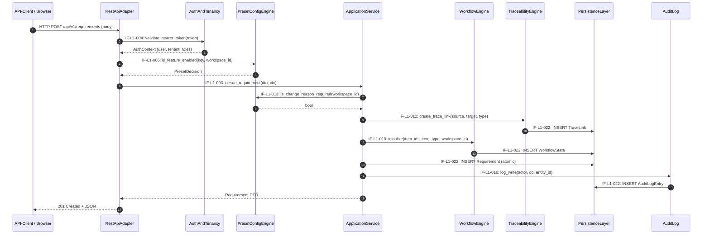
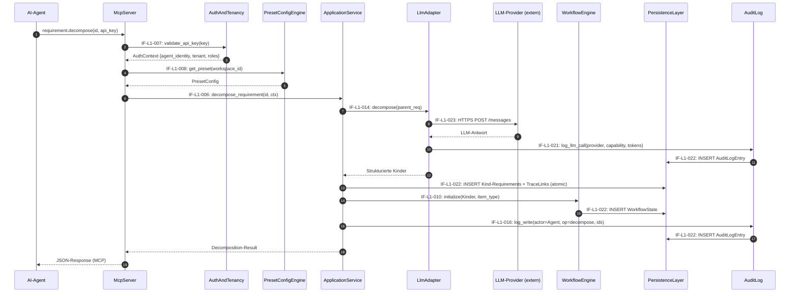
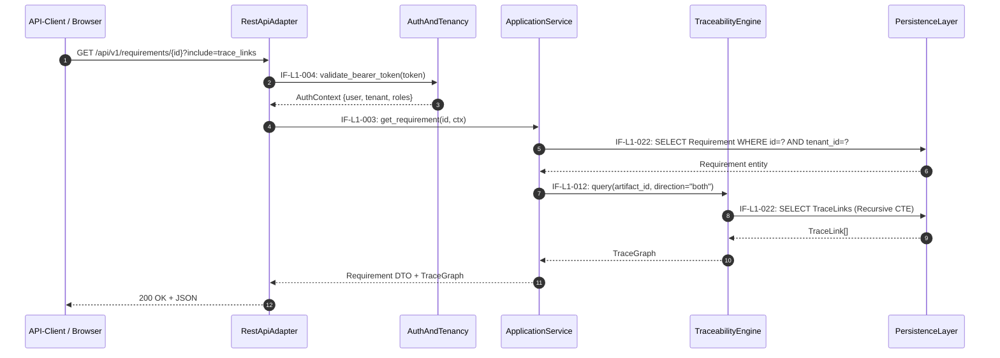
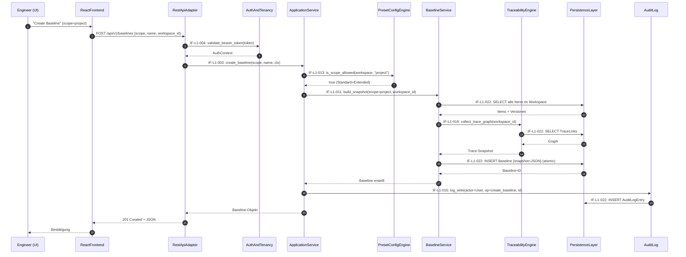

# ReqFlow — Interface Registry

> **Status:** KONSOLIDIERT | **Datum:** 2026-07-01
> **Scope:** L1 (13 Subsysteme) + L2 (62 Komponenten)
> **Total aktive Schnittstellen:** 108
>
> **Quellen (autoritativ):**
> - L1-Architektur: `docs/se/L1/Gesamtsystem/L1_Gesamtsystem_Architecture.md`
> - L2-Architekturen: `docs/se/L1/Gesamtsystem/L2/*/L2_*_Architecture.md` (12 Dateien)
>
> **ID-Schema:**
> - `IF-EXT-NNN` — Externe Schnittstellen (Akteur ↔ Systemgrenze)
> - `IF-L1-NNN` — L1-Inter-System-Schnittstellen (Subsystem ↔ Subsystem)
> - `IF-<SYS>-INT-NNN` — L2-Interne Schnittstellen (Komponente ↔ Komponente innerhalb eines Subsystems)
> - `IF-<SYS>-EXT-IN/OUT-NNN` — L2-Black-Box-Sicht der Subsystemgrenze
>
> **Konventionen:**
> - Quelle = Caller/Consumer; Ziel = Callee/Provider
> - Alle L2-Systeme sind LEAF (terminal) — keine L3-Zerlegung aktiv
> - Entfernte Schnittstellen werden explizit als `(entfernt)` markiert

---

## 1. Externe Schnittstellen (Systemgrenze)

> Akteur ↔ ReqFlow-System. Quellen: L1 §2.1, L2 ReactFrontend §2, McpServer §2, RestApiAdapter §2, LlmAdapter §2.

| ID | Richtung | Akteur / Externes System | Protokoll | Vertrag | REQ-L1 |
|----|----------|-------------------------|-----------|---------|--------|
| IF-EXT-001 | inbound | Software-/Systems-Engineer (Browser) | HTTPS / HTML / JS / React SPA | UI-Interaktion (Mouse, Keyboard, Touch) | REQ-L1-017 |
| IF-EXT-002 | inbound | AI-Agent (Claude Code, Cursor, CI) | MCP (JSON-RPC über stdio / SSE / HTTP) + API-Key | 20 Tools in 4 Gruppen | REQ-L1-005 |
| IF-EXT-003 | inbound | API-Client (Skripte, Integrationen) | HTTP/JSON + Bearer Token | REST API, OpenAPI 3.0 | REQ-L1-006 |
| IF-EXT-004 | inbound | Operator / Admin | Docker Compose CLI, `.env`-Variablen | Deployment, Konfiguration | REQ-L1-018 |
| IF-EXT-005 | outbound | LlmAdapter → LLM-Provider (Anthropic / OpenAI / Ollama / Azure) | HTTPS (optional) | Provider-spezifische APIs hinter `LlmCapabilityInterface` | REQ-L1-013 |
| IF-EXT-006 | outbound | ReqFlow → GitHub (v1 Should-Have) | HTTPS | GitHub REST API (Issues, PRs) | REQ-L1-022 |

### 1.1 REST-API-Endpunkt-Kategorien (Detail)

> Alle Endpunkte unter `/api/v1/`. Authentifizierung: Bearer Token.

| Kategorie | Beispiel-Endpunkte | Erfüllt SYS-REQ |
|-----------|-------------------|-----------------|
| Auth & Identity | `POST /auth/token`, `GET /auth/me` | SYS-REQ-10 |
| Workspace & Preset | `GET/PATCH /workspaces/{id}`, `GET /workspaces/{id}/preset` | SYS-REQ-07, SYS-REQ-14 |
| Artefakt-Hierarchie | `GET/POST/PATCH/DELETE /artifacts/{id}`, `GET /artifacts/tree` | SYS-REQ-01 |
| Requirements | `GET/POST/PATCH/DELETE /requirements/{id}`, `POST /requirements/{id}/decompose` | SYS-REQ-02 |
| Architecture-Elements | `GET/POST/PATCH/DELETE /architecture/{id}`, `POST /architecture/{id}/links` | SYS-REQ-04 |
| Tests | `GET/POST/PATCH/DELETE /tests/{id}`, `POST /tests/{id}/links` | SYS-REQ-12 |
| Trace-Links | `GET/POST/DELETE /tracelinks`, `GET /traceability/{artifact_id}` | SYS-REQ-03 |
| Baselines | `GET/POST /baselines`, `GET /baselines/{id}/diff/{other_id}` | SYS-REQ-08 |
| Workflows | `GET/POST/PATCH /workflows`, `POST /items/{id}/transition` | SYS-REQ-09 |
| Audit-Log | `GET /audit-log?filter=…` (read-only) | SYS-REQ-11 |
| Search | `GET /search?q=…&types=…` | SYS-REQ-20 |
| Export | `GET /export?format=json|csv&scope=…` | SYS-REQ-19 |
| OpenAPI-Spec | `GET /schema/`, `GET /schema/swagger-ui/` | SYS-REQ-06 |

### 1.2 MCP-Tool-Gruppen (Detail)

> 20 Tools in 4 Gruppen.

| Gruppe | Tools |
|--------|-------|
| Requirements (6) | `requirement.get`, `.query`, `.create`, `.update`, `.decompose`, `.validate` |
| Architecture (5) | `architecture.get`, `.query`, `.create`, `.update`, `.link` |
| Test (5) | `test.get`, `.query`, `.create`, `.update`, `.link` |
| Übergreifend (4) | `traceability.query`, `artifact.search`, `artifact.get_tree`, `workspace.get_context` |

---

## 2. L1-Inter-System-Schnittstellen (Subsystem ↔ Subsystem)

> **29 aktive Schnittstellen.** Konsolidiert aus allen 12 L2-Architekturen.
> Pfeilrichtung: Quelle = Caller/Consumer; Ziel = Callee/Provider.
> **ADR-01-konform:** McpServer hat KEINEN direkten Pfad zu AuditLog. McpServer→ApplicationService→AuditLog.
> **ReactFrontend** kommuniziert ausschließlich via REST (IF-L1-001).

### 2.1 Kanonische Schnittstellen (IF-L1-001..023)

| ID | Quelle (L1-System) | Ziel (L1-System) | Typ | Vertrag (Kurzform) | L2-Quelle |
|----|--------------------|--------------------|-----|---------------------|-----------|
| IF-L1-001 | ReactFrontend (001) | RestApiAdapter (002) | REST / HTTP+JSON | Alle CRUD-Operationen, OpenAPI-generierte Clients, Bearer Token | ReactFrontend §2 |
| **(entfernt)** | ReactFrontend (001) | PresetConfigEngine (008) | — | Gelöscht: ReactFrontend kommuniziert ausschließlich via REST (IF-L1-001). Preset/Terminologie via RestApiAdapter → PresetConfigEngine. | ADR-01 |
| IF-L1-003 | RestApiAdapter (002) | ApplicationService (004) | In-Process Python | Use-Case-Methoden, Pydantic-/DRF-Serializer als DTOs | RestApiAdapter §2 (IF-RA-EXT-OUT-005) |
| IF-L1-004 | RestApiAdapter (002) | AuthAndTenancy (011) | In-Process / Middleware | Bearer-Token-Validierung, Tenant/Rollen-Kontext | RestApiAdapter §2 (IF-RA-EXT-OUT-004) |
| IF-L1-005 | RestApiAdapter (002) | PresetConfigEngine (008) | In-Process Python | `is_feature_enabled(feature_key, workspace_id) → bool` | RestApiAdapter §2 (IF-RA-EXT-OUT-006) |
| IF-L1-006 | McpServer (003) | ApplicationService (004) | In-Process Python | Identische Use-Case-Methoden wie REST — gemeinsamer Domain-Kontrakt | McpServer §2 (IF-MC-EXT-OUT-003) |
| IF-L1-007 | McpServer (003) | AuthAndTenancy (011) | In-Process Python | API-Key-Validierung, Agent-Identitäts-Extraktion | McpServer §2 (IF-MC-EXT-OUT-002) |
| IF-L1-008 | McpServer (003) | PresetConfigEngine (008) | In-Process Python | `get_preset(workspace_id)`, `is_feature_enabled(key, workspace_id)` | McpServer §2 (IF-MC-EXT-OUT-004) |
| **(entfernt)** | McpServer (003) | AuditLog (012) | — | Gelöscht: McpServer ruft AuditLog NICHT direkt auf. Audit-Trail wird zentral durch ApplicationService geschrieben (ADR-01). | ADR-01 |
| IF-L1-010 | ApplicationService (004) | WorkflowEngine (005) | In-Process Python | `transition(item_id, target_state, change_reason, ctx)`, Workflow-Initialisierung | ApplicationService §2 (IF-AS-EXT-OUT-001) |
| IF-L1-011 | ApplicationService (004) | BaselineService (006) | In-Process Python | `build(scope, workspace_id, ctx)`, `diff(a, b)`, `get()`, `list()` | ApplicationService §2 (IF-AS-EXT-OUT-002) |
| IF-L1-012 | ApplicationService (004) | TraceabilityEngine (007) | In-Process Python | `query(artifact_id, direction)`, `coverage(workspace_id)`, TraceLink-CRUD | ApplicationService §2 (IF-AS-EXT-OUT-003) |
| IF-L1-013 | ApplicationService (004) | PresetConfigEngine (008) | In-Process Python | `get_preset(workspace_id)`, `is_feature_enabled(key, workspace_id)`, `validate_downgrade()` | ApplicationService §2 (IF-AS-EXT-OUT-004) |
| IF-L1-014 | ApplicationService (004) | LlmAdapter (009) | In-Process Python | `validate`, `decompose`, `check_consistency` | ApplicationService §2 (IF-AS-EXT-OUT-005) |
| IF-L1-015 | ApplicationService (004) | AuthAndTenancy (011) | In-Process Python | RBAC-Check pro Operation und Ressource | ApplicationService §2 (IF-AS-EXT-IN-003 reverse) |
| IF-L1-016 | ApplicationService (004) | AuditLog (012) | In-Process Python | `log_write(actor, op, entity_id, details)` | ApplicationService §2 (IF-AS-EXT-OUT-006) |
| IF-L1-017 | WorkflowEngine (005) | PresetConfigEngine (008) | In-Process Python | Preset-spezifische Workflow-Regeln, Approver-Rollen-Verfügbarkeit | WorkflowEngine §2 (IF-WE-EXT-IN-003) |
| IF-L1-018 | WorkflowEngine (005) | AuthAndTenancy (011) | In-Process Python | Rollen-Check für Workflow-Transitionen | WorkflowEngine §2 (IF-WE-EXT-IN-004) |
| IF-L1-019 | BaselineService (006) | TraceabilityEngine (007) | In-Process Python | `collect_trace_graph(workspace_id) → item_ids, versionen, trace_links` | BaselineService §2 (IF-BL-EXT-IN-003) |
| IF-L1-020 | BaselineService (006) | PresetConfigEngine (008) | In-Process Python | `is_scope_allowed(workspace_id, scope) → bool` | BaselineService §2 (IF-BL-EXT-IN-002) |
| IF-L1-021 | LlmAdapter (009) | AuditLog (012) | In-Process Python | Provider, Capability, Artefakt-ID, Token-Verbrauch, `source="llm_adapter"` | LlmAdapter §2 (IF-LA-EXT-OUT-002) |
| IF-L1-022 | * (alle schreibenden Systeme) | PersistenceLayer (010) | Django ORM | Custom Manager erzwingt `tenant_id`-Filter; alle Entitäten | PersistenceLayer §2, alle L2-Systeme |
| IF-L1-023 | LlmAdapter (009) | External LLM-Provider | HTTPS-Outbound (optional) | Provider-spezifisch, hinter `LlmCapabilityInterface` | LlmAdapter §2 (IF-LA-EXT-OUT-001) |

### 2.2 Erweiterte Schnittstellen (IF-L1-024..031)

> Hinzugefügt während der Konsolidierung zur Auflösung von ID-Konflikten und zur Dokumentation zusätzlicher Verbindungen.

| ID | Quelle (L1-System) | Ziel (L1-System) | Typ | Vertrag (Kurzform) | L2-Quelle |
|----|--------------------|--------------------|-----|---------------------|-----------|
| IF-L1-024 | RestApiAdapter (002) | AuthAndTenancy (011) | In-Process Python | Bearer-Token-Extraktion, Delegation zur Validierung, Auth-Context-Empfang | RestApiAdapter §2, AuthAndTenancy §2 |
| IF-L1-025 | McpServer (003) | WorkflowEngine (005) | In-Process Python | `list_definitions()` — WorkflowDefinitions für workspace.get_context | McpServer §2 |
| IF-L1-026 | McpServer (003) | TraceabilityEngine (007) | In-Process Python | Trace-Graph-Queries für traceability.query | McpServer §2 |
| IF-L1-027 | AuthAndTenancy (011) | ApplicationService (004) | In-Process Python | Auth-Kontext (User, Tenant, Rollen) pro Operation | AuthAndTenancy §2 (IF-AT-EXT-OUT-001) |
| IF-L1-028 | AuthAndTenancy (011) | WorkflowEngine (005) | In-Process Python | Rollen-Info für Transition-Checks | AuthAndTenancy §2 (IF-AT-EXT-OUT-002) |
| IF-L1-029 | RestApiAdapter (002) | ReactFrontend (001) | REST / HTTP+JSON | JSON-Responses mit HTTP-Statuscodes, Body, Headers | RestApiAdapter §2 (IF-RA-EXT-OUT-001) |
| IF-L1-030 | RestApiAdapter (002) | API-Clients / Browser | REST / HTTP+JSON | OpenAPI-3.0-Spezifikation unter `/api/v1/schema/` | RestApiAdapter §2 (IF-RA-EXT-OUT-002) |
| IF-L1-031 | RestApiAdapter (002) | API-Clients / Browser | REST / HTML | Swagger-UI unter `/api/v1/schema/swagger-ui/` | RestApiAdapter §2 (IF-RA-EXT-OUT-003) |

### 2.3 IF-L1-ID-Konfliktdokumentation

> Die L2-Architekturdateien wurden inkrementell erstellt und verwendeten teilweise IF-L1-XX-IDs für andere System-Paare als die ursprüngliche L1-Registry.

| L2-File | Verwendete IF-ID | L2-Definition (Source → Target) | Kanonische Zuordnung | Auflösung |
|---------|------------------|--------------------------------|----------------------|-----------|
| AuthAndTenancy §4.2 | IF-L1-02 | RestApiAdapter → AuthAndTenancy | IF-L1-02 = ReactFrontend → PresetConfigEngine | **Neue ID: IF-L1-024** |
| McpServer §3.2 | IF-L1-10 | McpServer → WorkflowEngine | IF-L1-10 = ApplicationService → WorkflowEngine | **Neue ID: IF-L1-025** |
| McpServer §3.2 | IF-L1-12 | McpServer → TraceabilityEngine | IF-L1-12 = ApplicationService → TraceabilityEngine | **Neue ID: IF-L1-026** |
| ApplicationService §2 | IF-L1-11 | ApplicationService → TraceabilityEngine | IF-L1-11 = ApplicationService → BaselineService | **Kein Konflikt:** IF-L1-012 ist kanonisch für AppService→TraceEngine |
| BaselineService §2.1 | IF-L1-11 | ApplicationService → BaselineService | IF-L1-11 = ApplicationService → BaselineService | **Konform** |
| ApplicationService §2 | IF-L1-12 | ApplicationService → TraceabilityEngine | IF-L1-12 = ApplicationService → TraceabilityEngine | **Konform** |
| TraceabilityEngine §7 | IF-L1-11 | ApplicationService → TraceabilityEngine | IF-L1-11 = ApplicationService → BaselineService | **Kein Konflikt:** IF-L1-012 ist kanonisch |
| PresetConfigEngine §3 | IF-L1-02 | ReactFrontend → PresetConfigEngine | IF-L1-02 = ReactFrontend → PresetConfigEngine | **Konform** (entfernt) |

### 2.4 DiagramServiceSystem Interfaces (IF-L1-058..061)

> ReactFrontend ↔ DiagramService (ARCH-L1-013). Hinzugefügt 2026-06-30 für REQ-L1-056 (Free-Hand Canvas) und REQ-L1-057 (Mermaid Live Preview).
> Diese Interfaces verbinden ReactFrontend (001) direkt mit DiagramService (013) — ohne Umweg über ApplicationService (architekturentscheidung L1 §3.3.2).

| ID | Richtung | Quelle (L1-System) | Ziel (L1-System) | Typ | Vertrag (Kurzform) | L2-Quelle | Verantwortlich |
|----|----------|--------------------|--------------------|-----|---------------------|-----------|----------------|
| IF-L1-058 | input | ReactFrontend (001) | DiagramService (013) | REST/JSON | `POST /api/v1/diagrams/{id}/canvas-strokes` — Push der aktuellen Stroke-Daten (Burst alle 5s bei Aktivität) | DiagramService §3.2 | COMP-DS-006 |
| IF-L1-059 | input | ReactFrontend (001) | DiagramService (013) | REST/JSON | `PUT /api/v1/diagrams/{id}/mermaid-source` — Update des Mermaid-Quellcodes (Debounced 500ms) | DiagramService §3.2 | COMP-DS-007 |
| IF-L1-060 | output | DiagramService (013) | ReactFrontend (001) | REST/JSON | Response: JSON-Stroke-Daten + SVG + PNG (PNG clientseitig via Canvas.toDataURL) | DiagramService §3.2 | COMP-DS-006 |
| IF-L1-061 | output | DiagramService (013) | ReactFrontend (001) | REST/JSON | Response: Quellcode, Render-Hinweise, SVG/PNG-Export-Daten (clientseitig via mermaid.js + canvas.toDataURL) | DiagramService §3.2 | COMP-DS-007 |

---

## 3. L2-Interne Schnittstellen (Komponente ↔ Komponente)

> **69 Schnittstellen** innerhalb der 13 L2-Subsysteme. Alle Systeme sind LEAF (terminal).
> Quellen: jeweilige `L2_<System>_Architecture.md` §3 (White-Box).

### 3.1 ApplicationServiceSystem (ARCH-L1-004) — 12 Komponenten, 12 Schnittstellen

> Quelle: `L2_ApplicationServiceSystem_Architecture.md` §3

| ID | Quelle (COMP-AS) | Ziel (COMP-AS) | Typ | Vertrag |
|----|-------------------|-----------------|-----|---------|
| IF-AS-INT-001 | 001 ArtifactService | 005 TraceLinkService | In-Process Python | `cascade_delete_trace_links(artifact_id)` |
| IF-AS-INT-002 | 002 RequirementService | 005 TraceLinkService | In-Process Python | `create_trace_link(source_id, target_id, link_type)` |
| IF-AS-INT-003 | 002 RequirementService | 007 WorkflowFacade | In-Process Python | `transition(item_id, target_state, change_reason, ctx)` |
| IF-AS-INT-004 | 003 ArchitectureService | 005 TraceLinkService | In-Process Python | `cascade_delete_trace_links(architecture_element_id)` |
| IF-AS-INT-005 | 004 TestService | 005 TraceLinkService | In-Process Python | `cascade_delete_trace_links(test_case_id)` |
| IF-AS-INT-006 | 006 BaselineFacade | 012 PresetPolicyService | In-Process Python | `is_scope_allowed(workspace_id, scope)` |
| IF-AS-INT-007 | 007 WorkflowFacade | 012 PresetPolicyService | In-Process Python | `validate_transition_roles(ctx, target_state)` |
| IF-AS-INT-008 | 002 RequirementService | 012 PresetPolicyService | In-Process Python | `is_change_reason_required(workspace_id)` |
| IF-AS-INT-009 | 002 RequirementService | 011 WebhookDispatcher | Event | `WebhookEvent(type="requirement_created", entity_id, timestamp)` |
| IF-AS-INT-010 | 003 ArchitectureService | 011 WebhookDispatcher | Event | `WebhookEvent(type="architecture_element_created", ...)` |
| IF-AS-INT-011 | 004 TestService | 011 WebhookDispatcher | Event | `WebhookEvent(type="test_case_created", ...)` |
| IF-AS-INT-012 | 006 BaselineFacade | 011 WebhookDispatcher | Event | `WebhookEvent(type="baseline_created", ...)` |

### 3.2 AuthAndTenancySystem (ARCH-L1-011) — 3 Komponenten, 3 Schnittstellen

> Quelle: `L2_AuthAndTenancySystem_Architecture.md` §3

| ID | Quelle (COMP-AT) | Ziel (COMP-AT) | Typ | Vertrag |
|----|-------------------|-----------------|-----|---------|
| IF-AT-INT-001 | 001 AuthenticationService | 002 AuthorizationService | In-Process Python | `IdentityClaims {user_id, roles, auth_method}` |
| IF-AT-INT-002 | 001 AuthenticationService | 003 TenantContextService | In-Process Python | `IdentityClaims {user_id, tenant_id}` |
| IF-AT-INT-003 | 003 TenantContextService | 002 AuthorizationService | In-Process Python | `TenantContext {tenant_id, tenant_name}` |

### 3.3 BaselineServiceSystem (ARCH-L1-006) — 3 Komponenten, 3 Schnittstellen

> Quelle: `L2_BaselineServiceSystem_Architecture.md` §3

| ID | Quelle (COMP-BL) | Ziel (COMP-BL) | Typ | Vertrag |
|----|-------------------|-----------------|-----|---------|
| IF-BL-INT-001 | 001 SnapshotBuilder | 003 BaselineStore | In-Process Python | `persist_snapshot(snapshot, metadata) → baseline_id` |
| IF-BL-INT-002 | 002 DiffEngine | 003 BaselineStore | In-Process Python | `load_snapshot(baseline_id) → BaselineEntity` |
| IF-BL-INT-003 | 001 SnapshotBuilder | 002 DiffEngine | In-Process Python | `get_snapshot_data(baseline_id) → JSON` |

### 3.4 LlmAdapterSystem (ARCH-L1-009) — 4 Komponenten, 4 Schnittstellen

> Quelle: `L2_LlmAdapterSystem_Architecture.md` §3

| ID | Quelle (COMP-LA) | Ziel (COMP-LA) | Typ | Vertrag |
|----|-------------------|-----------------|-----|---------|
| IF-LA-INT-001 | 003 CapabilityRouter | 001 CapabilityInterface | In-Process Python | `execute_capability(capability_name, **kwargs)` |
| IF-LA-INT-002 | 003 CapabilityRouter | 002 ProviderRegistry | In-Process Python | `get_provider() → LlmCapabilityInterface-Instanz` |
| IF-LA-INT-003 | 002 ProviderRegistry | 001 CapabilityInterface | Vererbung | Klassenimplementierung (`validate_artifact`, `decompose_requirement`, `check_consistency`) |
| IF-LA-INT-004 | 004 LlmAuditLogger | 003 CapabilityRouter | In-Process Python | `log_llm_call(provider, capability, artifact_id, token_usage, success, error)` |

### 3.5 McpServerSystem (ARCH-L1-003) — 6 Komponenten, 6 Schnittstellen

> Quelle: `L2_McpServerSystem_Architecture.md` §3

| ID | Quelle (COMP-MC) | Ziel (COMP-MC) | Typ | Vertrag |
|----|-------------------|-----------------|-----|---------|
| IF-MC-INT-001 | 001 ProtocolHandler | 002 ToolRegistry | In-Process Python | `dispatch_request(json_rpc_frame) → tool_call` |
| IF-MC-INT-002 | 002 ToolRegistry | 003 RequirementsToolGroup | In-Process Python | `execute_tool(tool_name, params, auth_context) → ToolResult` |
| IF-MC-INT-003 | 002 ToolRegistry | 004 ArchitectureToolGroup | In-Process Python | `execute_tool(tool_name, params, auth_context) → ToolResult` |
| IF-MC-INT-004 | 002 ToolRegistry | 005 TestToolGroup | In-Process Python | `execute_tool(tool_name, params, auth_context) → ToolResult` |
| IF-MC-INT-005 | 002 ToolRegistry | 006 CrossCuttingToolGroup | In-Process Python | `execute_tool(tool_name, params, auth_context) → ToolResult` |
| IF-MC-INT-006 | 003..006 (Tool-Gruppen) | 001 ProtocolHandler | In-Process Python | `ToolResult → JSON-Response` |

### 3.6 PersistenceLayerSystem (ARCH-L1-010) — 5 Komponenten, 5 Schnittstellen

> Quelle: `L2_PersistenceLayerSystem_Architecture.md` §3

| ID | Quelle (COMP-PL) | Ziel (COMP-PL) | Typ | Vertrag |
|----|-------------------|-----------------|-----|---------|
| IF-PL-INT-001 | 002 TenantIsolationManager | 001 EntitySchemaManager | Python API | `TenantQuerySet` als Default-Manager auf allen Modellen |
| IF-PL-INT-002 | 003 TransactionCoordinator | 001 EntitySchemaManager | Python API | `transaction.atomic()` Context-Manager umschließt ORM-Write-Operationen |
| IF-PL-INT-003 | 004 SchemaMigrationEngine | 001 EntitySchemaManager | Python API | Django-Migrationen generiert aus `models.py` |
| IF-PL-INT-004 | 004 SchemaMigrationEngine | 005 PerformanceOptimizationLayer | Python API | Migrationen enthalten `AddIndex`, `RemoveIndex` Operationen |
| IF-PL-INT-005 | 005 PerformanceOptimizationLayer | 001 EntitySchemaManager | Python API | `Meta.indexes` und `Index`-Klasse in Modell-Definitionen |

### 3.7 ReactFrontendSystem (ARCH-L1-001) — 6 Komponenten, 3 Schnittstellen

> Quelle: `L2_ReactFrontendSystem_Architecture.md` §3

| ID | Quelle (COMP-RF) | Ziel (COMP-RF) | Typ | Vertrag |
|----|-------------------|-----------------|-----|---------|
| IF-RF-INT-001 | 001 NavigationShell | 002..005 (Views + Editors) | React Context / Router-State | Routing-Events, View-Activation, Modul-Ein-/Ausblendung basierend auf Preset |
| IF-RF-INT-002 | 006 I18nService | 001..005 (alle Module) | React Context | Translation-Keys (`t(key, params)`), Terminologie-Profil-Labels, Locale-Change-Events |
| IF-RF-INT-003 | 001 NavigationShell | 003..004 (Editors) | React Props / State | Artefakt-Selektion `{artifact_id, artifact_type}` |

### 3.8 RestApiAdapterSystem (ARCH-L1-002) — 5 Komponenten, 6 Schnittstellen

> Quelle: `L2_RestApiAdapterSystem_Architecture.md` §3

| ID | Quelle (COMP-RA) | Ziel (COMP-RA) | Typ | Vertrag |
|----|-------------------|-----------------|-----|---------|
| IF-RA-INT-001 | 001 HttpEndpointController | 003 AuthEnforcer | In-Process Python | `AuthRequest {headers, path, method} → AuthContext \| AuthError` |
| IF-RA-INT-002 | 001 HttpEndpointController | 004 PresetGuard | In-Process Python | `PresetRequest {endpoint_id, workspace_id, method} → PresetDecision \| PresetError` |
| IF-RA-INT-003 | 001 HttpEndpointController | 002 DataSerializer | In-Process Python | `SerializeRequest {json_body, query_params, entity_type, direction} → ValidatedDTO \| ValidationError \| JSON_Response` |
| IF-RA-INT-004 | 004 PresetGuard | 002 DataSerializer | In-Process Python | `FieldFilter {permitted_fields, required_fields}` |
| IF-RA-INT-005 | 005 OpenApiGenerator | 001 HttpEndpointController | In-Process Python | `EndpointRegistry {routes: RouteDef[]}` |
| IF-RA-INT-006 | 005 OpenApiGenerator | 002 DataSerializer | In-Process Python | `SerializerSchemas {entity_type, field_defs, validators}` |

### 3.9 WorkflowEngineSystem (ARCH-L1-005) — 3 Komponenten, 3 Schnittstellen

> Quelle: `L2_WorkflowEngineSystem_Architecture.md` §3

| ID | Quelle (COMP-WE) | Ziel (COMP-WE) | Typ | Vertrag |
|----|-------------------|-----------------|-----|---------|
| IF-WE-INT-001 | 001 WorkflowDefinitionStore | 002 TransitionValidator | In-Process Python | `WorkflowDefinition {states, transitions, allowed_roles, requires_change_reason}` |
| IF-WE-INT-002 | 002 TransitionValidator | 003 StateLifecycleManager | In-Process Python | `ValidationResult {valid, error_code?, error_message?}` |
| IF-WE-INT-003 | 003 StateLifecycleManager | 001 WorkflowDefinitionStore | In-Process Python | `StateQuery {workspace_id, item_type, query_type: "initial_state"}` |

### 3.10 TraceabilityEngineSystem (ARCH-L1-007) — 3 Komponenten, 3 Schnittstellen

> Quelle: `L2_TraceabilityEngineSystem_Architecture.md` §3

| ID | Quelle (COMP-TE) | Ziel (COMP-TE) | Typ | Vertrag |
|----|-------------------|-----------------|-----|---------|
| IF-TE-INT-001 | 001 TraceLinkManager | 002 QueryEngine | In-Process Python | `get_trace_links(workspace_id, filters) → TraceLink[]` |
| IF-TE-INT-002 | 001 TraceLinkManager | 003 CoverageCalculator | In-Process Python | `get_trace_links(workspace_id, link_type) → TraceLink[]` |
| IF-TE-INT-003 | 002 QueryEngine | 001 TraceLinkManager | In-Process Python | `validate_graph_integrity() → ValidationResult` |

### 3.11 PresetConfigEngineSystem (ARCH-L1-008) — 3 Komponenten, 2 Schnittstellen

> Quelle: `L2_PresetConfigEngineSystem_Architecture.md` §3

| ID | Quelle (COMP-PC) | Ziel (COMP-PC) | Typ | Vertrag |
|----|-------------------|-----------------|-----|---------|
| IF-PC-INT-001 | 003 FeatureGateService | 001 PresetRegistry | In-Process Python | `get_preset_config(workspace_id) → PresetConfig` |
| IF-PC-INT-002 | 003 FeatureGateService | 002 TerminologyProfileService | In-Process Python | `get_terminology_profile(workspace_id) → TerminologyMapping` |

### 3.12 AuditLogSystem (ARCH-L1-012) — 2 Komponenten, 1 Schnittstelle

> Quelle: `L2_AuditLogSystem_Architecture.md` §3

| ID | Quelle (COMP-AL) | Ziel (COMP-AL) | Typ | Vertrag |
|----|-------------------|-----------------|-----|---------|
| IF-AL-INT-001 | 001 AuditLogWriter | 002 AuditLogQuery | In-Process Python | Gemeinsames AuditLogEntry-Modell (Read-Only für Query) |

### 3.13 DiagramServiceSystem (ARCH-L1-013) — 7 Komponenten, 9 Schnittstellen

> Quelle: `L2_DiagramServiceSystem_Architecture.md` §3
> **Erweitert:** 2026-06-30 (COMP-DS-006 CanvasEditor, COMP-DS-007 MermaidLiveRenderer)
> **Hinweis:** IF-DS-INT-001..003 stammen aus der bestehenden L2-Architektur. IF-DS-INT-004..009 wurden gemäß aktualisierter L1-Architektur-Spezifikation definiert (abweichend von der initialen L2-Architektur — siehe Kollisionsvermerk §3.13.1).

| ID | Quelle (COMP-DS) | Ziel (COMP-DS) | Typ | Vertrag |
|----|-------------------|-----------------|-----|---------|
| IF-DS-INT-001 | 001 DiagramManager | 002 DiagramValidator | In-Process Python | `validate_payload(type, content) -> bool` |
| IF-DS-INT-002 | 001 DiagramManager | 003 DiagramRenderer | In-Process Python | `prepare_renderable(type, content) -> RenderableDiagram` |
| IF-DS-INT-003 | 001 DiagramManager | 004 TraceabilityConnector | In-Process Python | `create_document_link(diagram_id, target_id)` |
| IF-DS-INT-004 | 006 CanvasEditor | 002 DiagramValidator | In-Process Python | `validate_canvas_strokes(stroke_data: dict) -> ValidationResult` — Stroke-Daten auf syntaktische Korrektheit prüfen |
| IF-DS-INT-005 | 006 CanvasEditor | 001 DiagramManager | In-Process Python | `persist_canvas(name, stroke_data, tenant, user) -> Diagram` — Persistierung der Canvas-Stroke-Daten als neuen Diagram-Typ |
| IF-DS-INT-006 | 006 CanvasEditor | 004 TraceabilityConnector | In-Process Python | `link_canvas_to_artifact(diagram_id, target_id) -> TraceLink` — TraceLink vom Canvas-Diagramm zum verknüpften Artefakt |
| IF-DS-INT-007 | 007 MermaidLiveRenderer | 001 DiagramManager | In-Process Python | `persist_mermaid_source(name, source, tenant, user) -> Diagram` — Persistierung des Mermaid-Quellcodes als neuen Diagram-Typ |
| IF-DS-INT-008 | 007 MermaidLiveRenderer | 003 DiagramRenderer | In-Process Python | `get_render_hints(diagram_type, payload_format) -> RenderHint` — Abruf der Rendering-Hinweise für die UI |
| IF-DS-INT-009 | 007 MermaidLiveRenderer | 005 McpArtifactProvider | In-Process Python | `register_mcp_type(diagram_type, payload_format) -> None` — Registrierung des Mermaid-Typs für MCP-Abruf |

#### 3.13.1 Kollisionsvermerk — Abweichung von initialer L2-Architektur

> Die initiale `L2_DiagramServiceSystem_Architecture.md` definierte IF-DS-INT-004..009 mit abweichenden Source/Target-Paarungen und Verträgen (IF-DS-INT-004: C006→C001, IF-DS-INT-005: C006→C002, IF-DS-INT-006: C006→C003, IF-DS-INT-008: C007→C002, IF-DS-INT-009: C007→C003). Die vorliegende Registry verwendet die aktualisierten Definitionen aus der L1-Gesamtarchitektur. Die L2-Architektur muss bei nächster Gelegenheit konsolidiert werden.

---

## 4. Konnektivitätsmatrix (L1)

> Zeile = Caller (Quelle), Spalte = Callee (Ziel). ✓ = direkte Schnittstelle vorhanden.
> **Hinweis:** IF-L1-022 (alle → PersistenceLayer) ist in der Matrix nicht separat ausgewiesen, da er von fast allen Systemen genutzt wird. Siehe separate Liste unten.

| Caller ↓ / Callee → | 001 RF | 002 RA | 003 MC | 004 AS | 005 WE | 006 BL | 007 TE | 008 PC | 009 LA | 010 PL | 011 AT | 012 AL | 013 DS |
|---|---|---|---|---|---|---|---|---|---|---|---|---|---|
| **001 ReactFrontend** | — | ✓ | | | | | | | | | | | ✓ |
| **002 RestApiAdapter** | ✓ | — | | ✓ | | | | ✓ | | | ✓ | | |
| **003 McpServer** | | | — | ✓ | ✓ | | ✓ | ✓ | | | ✓ | | ✓ |
| **004 ApplicationService** | | | | — | ✓ | ✓ | ✓ | ✓ | ✓ | ✓ | ✓ | ✓ | ✓ |
| **005 WorkflowEngine** | | | | | — | | | ✓ | | ✓ | ✓ | | |
| **006 BaselineService** | | | | | | — | ✓ | ✓ | | ✓ | | | |
| **007 TraceabilityEngine** | | | | | | | — | | | ✓ | | | |
| **008 PresetConfigEngine** | | | | | | | | — | | ✓ | | | |
| **009 LlmAdapter** | | | | | | | | | — | | | ✓ | |
| **010 PersistenceLayer** | | | | | | | | | | — | | | |
| **011 AuthAndTenancy** | | | | ✓ | ✓ | | | | | | — | | |
| **012 AuditLog** | | | | | | | | | | ✓ | | — | |
| **013 DiagramService** | ✓ | | | | | | ✓ | | | ✓ | | ✓ | — |

### PersistenceLayer-Caller (IF-L1-022)

> Alle schreibenden Subsysteme greifen auf PersistenceLayer zu:

| Caller | Entitäten |
|--------|-----------|
| ApplicationService (004) | Artifact, Requirement, ArchitectureElement, TestCase, TraceLink, Workspace |
| WorkflowEngine (005) | WorkflowDefinition, WorkflowState |
| BaselineService (006) | Baseline |
| TraceabilityEngine (007) | TraceLink |
| PresetConfigEngine (008) | Workspace, WorkspaceSettings, PresetConfig, TerminologyProfile |
| AuthAndTenancy (011) | User, Role, Tenant |
| AuditLog (012) | AuditLogEntry |
| DiagramService (013) | Diagram, DiagramVersion |

---

## 5. Signal-Fluss-Diagramme

### 5.1 Write Path: REST → Persistenz

### 5.2 Write Path: MCP → Persistenz

### 5.3 Read Path: REST → Query

### 5.4 Baseline-Erstellung (Scope `project`)

---

## 6. Synchronisationspunkte

### 6.1 Transaktionsgrenzen (Atomare Operationen)

| Operation | Transaktionsumfang | Garantie | Quelle |
|-----------|-------------------|----------|--------|
| **Requirement-Create** | INSERT Requirement + INSERT TraceLinks + INSERT WorkflowState + INSERT AuditLogEntry | ACID via `transaction.atomic()` (IF-PL-INT-002) | L2 ApplicationService §3, PersistenceLayer §3 |
| **Requirement-Decompose** | INSERT N Kind-Requirements + N TraceLinks + N WorkflowStates + INSERT AuditLogEntry | ACID — Batch in einer Transaktion | L1 §4.1, L2 ApplicationService §3 |
| **Baseline-Create** | SELECT Items + SELECT TraceLinks + INSERT Baseline-Snapshot | Snapshot atomar; Leseoperationen außerhalb der Transaktion | L1 §4.2, L2 BaselineService §3 |
| **Workflow-Transition** | UPDATE WorkflowState + INSERT History + INSERT AuditLogEntry | ACID; Optimistic Locking via Version-Feld | L2 WorkflowEngine §3 (COMP-WE-003) |
| **Audit-Write** | Synchron in der auslösenden Transaktion | Atomar mit Geschäftsoperation — kein asynchrones Logging | L2 AuditLog §5 (ADR-AL-02) |

### 6.2 Ordnungs-Garantien

| Regel | Beschreibung | Begründung |
|-------|-------------|------------|
| **Auth vor Domain** | AuthAndTenancy-Validierung (IF-L1-004/007) MUSS vor jedem ApplicationService-Call erfolgen | Kein Domain-Call ohne gültigen AuthContext |
| **Preset vor Write** | PresetConfigEngine-Abfrage (IF-L1-005/013) MUSS vor schreibenden Operationen erfolgen | Feature-Gating entscheidet über erlaubte Operationen |
| **Domain vor Audit** | ApplicationService-Operation MUSS vor AuditLog-Write erfolgen | Audit-Eintrag referenziert das Ergebnis der Operation |
| **Persistenz vor Audit** | INSERT Entität (IF-L1-022) MUSS vor INSERT AuditLogEntry erfolgen | Audit-Eintrag referenziert persistierte Entity-ID |
| **Workflow-Init nach Create** | WorkflowEngine.initialize() MUSS nach Entity-CRUD erfolgen | WorkflowState referenziert Entity-ID |
| **TraceLink nach Entity** | TraceLink-CRUD MUSS nach Quell-/Ziel-Entity-CRUD erfolgen | Referentielle Integrität (CASCADE) |

### 6.3 Nebenläufigkeits-Constraints

| Constraint | Mechanismus | Quelle |
|------------|-------------|--------|
| **Tenant-Isolation** | Custom Django Manager (`TenantQuerySet`) injiziert `tenant_id`-Filter in JEDE Query (IF-PL-INT-001) | L2 PersistenceLayer §3, ADR-AT-02 |
| **Optimistic Locking** | Version-Feld auf Requirement, ArchitectureElement, TestCase; `UPDATE ... WHERE version = ?` | L2 ApplicationService §3 (COMP-AS-003) |
| **Append-Only Audit** | AuditLogEntry ist append-only; keine UPDATE/DELETE-Operationen | L2 AuditLog §5 (ADR-AL-01) |
| **Immutable Baselines** | Baseline-Snapshot ist nach INSERT unveränderlich; keine UPDATE-Operation | L2 BaselineService §5 (ADR-BL-02) |
| **Webhook-Dispatch asynchron** | WebhookDispatcher (COMP-AS-011) arbeitet asynchron mit Retry-Logik; blockiert nicht den Haupt-Call | L2 ApplicationService §3 (IF-AS-INT-009..012) |
| **LLM-Timeout** | Provider-Calls haben Timeout; Graceful Degradation bei Ausfall (IF-LA-INT-002) | L2 LlmAdapter §5 (ADR-LA-01) |

---

## 7. Zusammenfassung / Kennzahlen

### 7.1 Interface-Zählung

| Klasse | Anzahl | Quellen |
|--------|--------|---------|
| `IF-EXT` Externe Schnittstellen (Akteur ↔ System) | **6** | §1 |
| `IF-L1` L1-Inter-System-Schnittstellen (aktiv) | **33** | §2 (23 kanonische + 6 erweiterte + 4 DiagramService, 2 entfernt) |
| `IF-L2-intern` L2-Interne Schnittstellen (Komponente ↔ Komponente) | **69** | §3 (13 Systeme) |
| **Gesamt aktiv** | **108** | 6 + 33 + 69 |

### 7.2 L2-Systeme im Detail

| L2-System | Komp. | L2-Int IF | L1-IF (Systemgrenze) | REQ-L2 | L3-Status |
|-----------|-------|-----------|----------------------|--------|-----------|
| ARCH-L1-001 ReactFrontend | 6 | 3 | 3 (IF-L1-001, IF-EXT-001, IF-L1-029) | 12 | terminal |
| ARCH-L1-002 RestApiAdapter | 5 | 6 | 8 (IF-L1-003, 004, 005, 024, 029, 030, 031, IF-EXT-003) | 12 | terminal |
| ARCH-L1-003 McpServer | 6 | 6 | 6 (IF-L1-006, 007, 008, 025, 026, IF-EXT-002) | 12 | terminal |
| ARCH-L1-004 ApplicationService | 12 | 12 | 10 (IF-L1-003, 006, 010..016, 027, IF-L1-022) | 25 | terminal |
| ARCH-L1-005 WorkflowEngine | 3 | 3 | 5 (IF-L1-010, 017, 018, 022, 028) | 8 | terminal |
| ARCH-L1-006 BaselineService | 3 | 3 | 4 (IF-L1-011, 019, 020, 022) | 8 | terminal |
| ARCH-L1-007 TraceabilityEngine | 3 | 3 | 3 (IF-L1-012, 019, 022) | 12 | terminal |
| ARCH-L1-008 PresetConfigEngine | 3 | 2 | 7 (IF-L1-005, 008, 013, 017, 020, 022, IF-EXT-004†) | 14 | terminal |
| ARCH-L1-009 LlmAdapter | 4 | 4 | 3 (IF-L1-014, 021, 023) | 7 | terminal |
| ARCH-L1-010 PersistenceLayer | 5 | 5 | 9 (IF-L1-022 + 7 L1-Caller + IF-PL-EXT-OUT-001) | 9 | terminal |
| ARCH-L1-011 AuthAndTenancy | 3 | 3 | 7 (IF-L1-004, 007, 015, 018, 024, 027, 028) | 10 | terminal |
| ARCH-L1-012 AuditLog | 2 | 1 | 4 (IF-L1-016, 021, 022, IF-EXT-004†) | 7 | terminal |
| ARCH-L1-013 DiagramService | 7 | 9 | 10 (IF-L1-032..036, 058..061, IF-L1-022) | 7 | terminal |
| **Summe** | **62** | **69** | — | **143** | **alle terminal** |

† IF-EXT-004 (Operator) und IF-EXT-005/006 (LLM-Provider, GitHub) sind systemübergreifend und nicht einem einzelnen L2-System zugeordnet.

### 7.3 Design-by-Contract — Contract-Facetten (Auszug)

> Jede Schnittstelle ist ein Vertrag mit vier Facetten: version, preconditions, postconditions, invariants.
> Ausgewählte Beispiele für kritische Schnittstellen:

| Interface | Version | Precondition | Postcondition | Invariant |
|-----------|---------|-------------|---------------|-----------|
| IF-L1-003 (REST→AppService) | 1.0.0 | AuthContext valid, DTO validiert | Entity persistiert oder ValidationError | Keine Seiteneffekte bei Validation Error |
| IF-L1-010 (AppService→Workflow) | 1.0.0 | Entity existiert, target_state in Definition | WorkflowState initial oder transitiert | WorkflowState referenziert immer existierende Entity |
| IF-L1-016 (AppService→AuditLog) | 1.0.0 | Operation erfolgreich, actor identifiziert | AuditLogEntry append-only persistiert | AuditLogEntry niemals gelöscht oder modifiziert |
| IF-L1-022 (*→PersistenceLayer) | 1.0.0 | tenant_id im Context, FK-Constraints erfüllt | Entity persistiert mit tenant_id-Filter | Tenant-Isolation immer gewährleistet |
| IF-L1-023 (LlmAdapter→LLM) | 1.0.0 | Provider konfiguriert, Capability aktiv | LlmResult oder strukturierter Fehler | Kein internes State-Leak an Provider |

---

## 8. Interface Change Log

| Datum | Änderung | Betroffene IDs | Begründung |
|-------|----------|---------------|------------|
| 2026-06-18 | Initiale Registry aus L1-Architektur | IF-L1-001..023 | SE-Kaskade L1 abgeschlossen |
| 2026-06-20 | L2-Konsolidierung: 60 interne Schnittstellen aus 12 L2-Architekturen | IF-<SYS>-INT-001..* | SE-Kaskade L2 abgeschlossen, alle 12 Systeme terminal |
| 2026-06-20 | ID-Konflikte aufgelöst, IF-L1-024..031 hinzugefügt | IF-L1-024..031 | L2-Dateien verwendeten IF-L1-IDs inkonsistent |
| 2026-06-20 | Entfernt: ReactFrontend→PresetConfigEngine (direkt) | IF-L1-02 (entfernt) | ReactFrontend kommuniziert ausschließlich via REST |
| 2026-06-20 | Entfernt: McpServer→AuditLog (direkt) | IF-L1-09 (entfernt) | Audit-Trail wird zentral durch ApplicationService geschrieben |
| 2026-06-20 | Vollständige Konsolidierung mit Signal-Flüssen und Sync-Punkten | Alle | HOFF-20260620-005, se-interface-mgr |
| 2026-07-01 | **Phase 4:** Canvas/Mermaid-Interfaces registriert — IF-L1-058..061 (L1) + IF-DS-INT-001..009 (L2-intern) | IF-L1-058..061, IF-DS-INT-001..009 | REQ-L1-056/057 — neue Komponenten COMP-DS-006/007 im DiagramServiceSystem |

---

*Konsolidiert durch se-interface-mgr-Agent | ReqFlow SE-Kaskade*
*Quellen: L1_Gesamtsystem_Architecture.md, 13 L2-Architekturen, L2_architectural_decomposition_iter-1.md*
*Datum: 2026-07-01 | Branch: feat/se-implementation*
*Handoff: HOFF-20260701-002*

---

## 9. L1-Backlog Interfaces (v2 — Backlog REQ-L1-034..041)

> **Status:** Neu registriert aus L2_architectural_decomposition_iter-1.md (Phase 3)
> **Datum:** 2026-06-27
> **Scope:** 3 priorisierte Cross-System-Interfaces aus 3 neuen L2-Subsystemen (RQ, CM, VS)
> **Design-by-Contract:** Vollständige Vertragsfacetten (version, preconditions, postconditions, invariants)

### 9.1 IF-L1-032: ApplicationService → VectorSearchServiceSystem (Domain-Event Embedding Trigger)

| Attribut | Wert |
|----------|------|
| **ID** | IF-L1-032 |
| **Source** | ApplicationService (004) — COMP-AS-0xx (ArtifactWriteHandler) |
| **Target** | VectorSearchServiceSystem (VS) — COMP-VS-002 (EmbeddingPipeline) |
| **System-ID Source** | REQ-L2-AS / ARCH-L1-004 |
| **System-ID Target** | REQ-L2-VS / VectorSearchServiceSystem |
| **Subsystem-Boundary-ID** | IF-VS-EXT-IN-002 |
| **Direction** | AS → VS (uni) |
| **Signal Type** | event (async fire-and-forget) |
| **Protocol** | async message queue (Celery / Redis pub-sub) |
| **Trigger** | Domain Event: `ArtifactCreated` / `ArtifactUpdated` (inkl. Requirement, ArchitectureElement, TestCase) |
| **Payload Schema** | `{ "event_type": "ArtifactCreated"|"ArtifactUpdated", "artifact_id": "uuid", "artifact_type": "requirement"|"architecture_element"|"test_case", "workspace_id": "uuid", "tenant_id": "uuid", "version": "int", "timestamp": "ISO8601" }` |
| **REQ-L1** | REQ-L1-038 |
| **Response** | None (async — acknowledged via queue ACK) |
| **Acceptance Latency** | Event → Embedding-Start: p95 < 30s; Full Embedding: ≤ 5 min (REQ-L2-VS-002) |
| **Failure Mode** | Queue persistiert Event; Dead-Letter-Queue bei wiederholtem Fehlschlag (max 3 Retries); Graceful Degradation — Suche arbeitet mit veralteten Embeddings |
| **Versioning** | `event_type` versioniert via Schema-Registry; add-only Felder (keine Breaking-Änderungen an existierenden Feldern) |
| **Idempotency** | Consumer (VS) muss idempotent sein — selbes `artifact_id`+`version`-Paar darf nur einmal verarbeitet werden |
| **Auth** | Interner System-zu-System-Call (kein User-Token); Queue-Zugriff via Service-Account |

**Design-by-Contract:**
| Facette | Definition |
|---------|-----------|
| **version** | `1.0.0` |
| **preconditions** | (1) Artefakt erfolgreich in PersistenceLayer persistiert, (2) Embedding-Pipeline (VS) ist registriert und aktiv, (3) Event enthält gültige `artifact_id` und `workspace_id` |
| **postconditions** | (1) Event ist in der Queue bestätigt (ACK), (2) Embedding wird innerhalb von 5 Min aktualisiert ODER Event landet in DLQ nach 3 Fehlversuchen, (3) Embedding-Vektor ist unter `artifact_id` auffindbar |
| **invariants** | (1) Embedding ist stets eine berechnete Funktion des Artefakt-Inhalts (kein manuelles Override), (2) Embedding-Dimension ist durch Modell-Konfiguration festgelegt (konfigurierbar), (3) Haupt-Write-Path wird durch Embedding NICHT blockiert (REQ-L1-026) |

### 9.2 IF-L1-033: AuthAndTenancySystem → PersistenceLayer (RLS-Policy-Enforcement)

| Attribut | Wert |
|----------|------|
| **ID** | IF-L1-033 |
| **Source** | AuthAndTenancySystem (011) — COMP-AT-005 (ItemPermissionStore) |
| **Target** | PersistenceLayer (010) — COMP-PL-002 (TenantIsolationManager) |
| **System-ID Source** | REQ-L2-AT-017 / ARCH-L1-011 |
| **System-ID Target** | REQ-L2-PL / ARCH-L1-010 |
| **Subsystem-Boundary-ID** | (neu — Control-Plane, kein EXT-ID nötig) |
| **Direction** | AT → PL (uni — Policy-Definition; PL evaluiert automatisch) |
| **Signal Type** | control (declarative policy injection) |
| **Protocol** | PostgreSQL Row-Level Security (RLS) — DDL `ALTER POLICY` + DML `SET LOCAL rls.item_permissions` |
| **Trigger** | (1) Policy-Create/Update: Admin setzt Item-Level-Regel via AuthAndTenancy → `CREATE/ALTER POLICY`; (2) Query-Time: PersistenceLayer setzt Session-Context-Variable `rls.item_permissions` aus Auth-Context |
| **Payload Schema (Policy Def)** | `{ "policy_id": "uuid", "artifact_id": "uuid"|"*", "principal_type": "user"|"group", "principal_id": "uuid", "permission": "read"|"write", "effect": "allow"|"deny", "priority": "int", "created_at": "ISO8601" }` |
| **Payload Schema (Query-Time)** | SQL `SET LOCAL rls.item_permissions = '{user_id, role_list, tenant_id}'` |
| **REQ-L1** | REQ-L1-039 |
| **Acceptance Latency** | Policy-Update: < 1s bis RLS-Policy aktiv; Query-Overhead: < 10% (durch Permission-Cache TTL 60s) |
| **Failure Mode** | Fail-Closed: Wenn RLS-Policy nicht evaluierbar (z.B. fehlender Tenant-Context) → Query liefert 0 Ergebnisse (kein Daten-Leak) |
| **Versioning** | RLS-Policies versioniert via Migrations; Policy-Änderungen sind additive DDL-Operationen |
| **Idempotency** | `CREATE POLICY IF NOT EXISTS` / `ALTER POLICY` — RLS ist deklarativ und idempotent |
| **Auth** | Admin-Rechte für DDL (Datenbank-ROLE `reqflow_admin`); Query-Time via Session-Context (vertrauenswürdig) |

**Design-by-Contract:**
| Facette | Definition |
|---------|-----------|
| **version** | `1.0.0` |
| **preconditions** | (1) ItemPermissionStore hat gültige Policy-Definition, (2) PostgreSQL RLS ist auf der Ziel-Tabelle aktiviert, (3) Query-Session hat gültigen Auth-Context (user_id, tenant_id) |
| **postconditions** | (1) RLS-Policy ist auf Datenbankebene aktiv (DDL committed), (2) Query-Ergebnisse sind gemäß Policy gefiltert, (3) Permission-Cache ist nach TTL (60s) aktualisiert |
| **invariants** | (1) Item-Level-Regeln verfeinern NIEMALS Workspace-RBAC — sie schränken nur ein, erweitern nie, (2) Fehlende Policy → Default-Deny (kein Daten-Leak), (3) RLS-Policies persistieren über Deployment-Grenzen hinweg |

### 9.3 IF-L1-034: CommentServiceSystem → AuditLogSystem (Audit-Log-Pflicht)

| Attribut | Wert |
|----------|------|
| **ID** | IF-L1-034 |
| **Source** | CommentServiceSystem (CM) — COMP-CM-001/003 (CommentManager, NotificationDispatcher) |
| **Target** | AuditLogSystem (012) — COMP-AL-001 (AuditLogWriter) |
| **System-ID Source** | REQ-L2-CM / CommentServiceSystem |
| **System-ID Target** | REQ-L2-AL / ARCH-L1-012 |
| **Subsystem-Boundary-ID** | IF-CM-EXT-OUT-001 |
| **Direction** | CM → AL (uni) |
| **Signal Type** | data (audit write) |
| **Protocol** | sync (in-process Python) — identisch zu IF-L1-016 (ApplicationService → AuditLog) |
| **Trigger** | Jede Kommentar-Operation: `comment_created`, `comment_updated`, `comment_deleted`, `mention_resolved`, `notification_dispatched` |
| **Payload Schema** | `{ "actor": "uuid"|"system", "operation": "comment_created"|"comment_updated"|"comment_deleted"|"mention_resolved"|"notification_dispatched", "entity_id": "uuid", "entity_type": "comment"|"mention"|"notification", "artifact_id": "uuid", "details": { "comment_snippet": "string (truncated 200 chars)", "mentioned_users": ["uuid", ...], "thread_parent_id": "uuid|null" }, "timestamp": "ISO8601", "source": "comment_service" }` |
| **REQ-L1** | REQ-L1-037 |
| **Acceptance Latency** | Sync — innerhalb der Transaktion des aufrufenden CM-Vorgangs (< 50ms Overhead) |
| **Failure Mode** | Fail-Closed: Wenn AuditLog nicht schreibbar → CM-Operation schlägt fehl (Transaction Rollback) — Audit-Pflicht darf nicht umgangen werden |
| **Versioning** | Add-only Felder im Payload; neue Operation-Typen via Enum-Erweiterung |
| **Idempotency** | Nicht erforderlich — jede CM-Operation erzeugt genau einen Audit-Eintrag (keine Duplikatserkennung nötig, da Transaktionsgarantie) |
| **Auth** | Interner System-Call (trusted subsystem) |

**Design-by-Contract:**
| Facette | Definition |
|---------|-----------|
| **version** | `1.0.0` |
| **preconditions** | (1) CM-Operation (create/update/delete) ist im eigenen System erfolgreich abgeschlossen, (2) actor ist identifiziert (user_id oder "system"), (3) entity_id referenziert eine existierende Kommentar/Mention-Entität |
| **postconditions** | (1) AuditLogEntry ist append-only persistiert (IF-L1-022 → PL), (2) Audit-Eintrag enthält alle relevanten Metadaten für Nachvollziehbarkeit, (3) Bei Fehler: gesamte Transaktion rolled back (Fail-Closed) |
| **invariants** | (1) AuditLogEntry wird NIEMALS gelöscht oder modifiziert (append-only), (2) Jede Kommentar-Operation erzeugt mindestens einen Audit-Eintrag, (3) `source = "comment_service"` ermöglicht Filterung im Audit-Log-Query |

---

## 10. New Subsystem Interfaces (Phase 5 Scan)

> **Scan-Tiefe:** L2 Requirements-Dateien der 3 neuen Subsysteme (RQ, CM, VS)
> **Erkannt:** 4 zusätzliche Interfaces über die priorisierten 3 hinaus
> **Status:** Registriert — teils mit Hinweisen für se-termination (Tiefe/Komplexität)

### 10.1 IF-L1-035: ApplicationService ↔ ReqIFServiceSystem (Import/Export Request)

| Attribut | Wert |
|----------|------|
| **ID** | IF-L1-035 |
| **Source ↔ Target** | ApplicationService (004) ↔ ReqIFServiceSystem (RQ) |
| **Subsystem-Boundary-ID** | IF-RQ-EXT-IN-001 |
| **Direction** | bidirektional (AS initiiert; RQ liefert Ergebnis zurück) |
| **Signal Type** | request-response (sync) |
| **Protocol** | in-process Python (sync) |
| **Trigger** | User/Agent triggert Import oder Export über REST/MCP |
| **Payload Schema (Import-Request)** | `{ "workspace_id": "uuid", "reqif_file": "base64"|"S3-key", "options": { "dry_run": bool, "import_tracelinks": bool, "conflict_strategy": "skip"|"override"|"new_version" } }` |
| **Payload Schema (Export-Request)** | `{ "workspace_id": "uuid", "scope": "workspace"|"project", "include_tracelinks": bool, "format": "reqif_1_0"|"reqif_1_1" }` |
| **Response Schema (Import)** | `{ "artifacts_created": int, "tracelinks_created": int, "warnings": ["string", ...], "errors": [{"element_ref": "string", "reason": "string"}], "dry_run": bool }` |
| **Response Schema (Export)** | `{ "reqif_file": "base64", "spec_object_count": int, "spec_relation_count": int, "spec_hierarchy_count": int }` |
| **REQ-L1** | REQ-L1-034 |
| **Versioning** | `1.0.0` — Breaking Change nur bei neuem ReqIF-Schema |
| **Auth** | AuthContext aus AS (User/Agent-Identität) |

**Design-by-Contract:**
| Facette | Definition |
|---------|-----------|
| **version** | `1.0.0` |
| **preconditions** | (1) AuthContext validiert (User hat Workspace-Rechte), (2) ReqIF-Datei valide gegen ReqIF-Schema (Import), (3) Workspace existiert und ist nicht im Baseline-Freeze (Export) |
| **postconditions** | (1) Import: Artefakte + TraceLinks persistiert (über PL/TE), (2) Export: Vollständige .reqif-Datei inkl. SpecHierarchies, (3) Dry-Run: Nur Validierung, keine Persistenz |
| **invariants** | (1) Roundtrip-Treue: Export→Import erzeugt strukturgleiche Artefakte, (2) Import überschreibt NIEMALS bestehende Artefakte ohne explizite Strategie |

### 10.2 IF-L1-036: ReqIFServiceSystem → TraceabilityEngine (SpecRelations → TraceLinks)

| Attribut | Wert |
|----------|------|
| **ID** | IF-L1-036 |
| **Source** | ReqIFServiceSystem (RQ) — COMP-RQ-001 (ReqIFParser) |
| **Target** | TraceabilityEngine (007) — COMP-TE-001 (TraceLinkManager) |
| **Subsystem-Boundary-ID** | IF-RQ-EXT-OUT-002 |
| **Direction** | RQ → TE (uni) |
| **Signal Type** | data (CRUD) |
| **Protocol** | in-process Python (sync) |
| **Trigger** | ReqIF-Import: SpecRelations → `create_trace_link()` Calls |
| **Payload Schema** | `{ "source_artifact_id": "uuid", "target_artifact_id": "uuid", "link_type": "derives_from"|"satisfies"|"refines"|"traces", "workspace_id": "uuid", "reqif_relation_id": "string (original)" }` |
| **REQ-L1** | REQ-L1-034 |
| **Acceptance Latency** | Sync — innerhalb der Import-Transaktion |
| **Idempotency** | Erforderlich — doppelter Import derselben ReqIF-Datei sollte keine Duplikat-TraceLinks erzeugen (Key: `reqif_relation_id` + `workspace_id`) |

**Design-by-Contract:**
| Facette | Definition |
|---------|-----------|
| **version** | `1.0.0` |
| **preconditions** | (1) Quell- und Ziel-Artefakt existieren in PersistenceLayer, (2) TraceLink-Typ ist valide, (3) Workspace-Kontext ist gesetzt |
| **postconditions** | (1) TraceLink persistiert via PersistenceLayer, (2) Bei Duplikat: keine doppelte Erstellung (idempotent), (3) Fehler → gesamter Import rolled back |
| **invariants** | (1) Jeder SpecRelation wird genau ein TraceLink (oder Warnung bei Fehler), (2) TraceLink-Referenzen sind referentiell integer |

### 10.3 IF-L1-037: ApplicationService ↔ CommentServiceSystem (Comment CRUD Delegation)

| Attribut | Wert |
|----------|------|
| **ID** | IF-L1-037 |
| **Source ↔ Target** | ApplicationService (004) ↔ CommentServiceSystem (CM) |
| **Subsystem-Boundary-ID** | IF-CM-EXT-IN-001 |
| **Direction** | bidirektional (AS delegiert CRUD; CM liefert Ergebnis) |
| **Signal Type** | request-response (sync) |
| **Protocol** | in-process Python (sync) |
| **Trigger** | User/Agent erstellt/listet/aktualisiert Kommentar via REST/MCP |
| **Payload Schema (Create)** | `{ "artifact_id": "uuid", "parent_comment_id": "uuid|null", "text": "string", "author_id": "uuid", "workspace_id": "uuid" }` |
| **Payload Schema (List)** | `{ "artifact_id": "uuid", "include_deleted": bool, "page": int, "page_size": int }` |
| **REQ-L1** | REQ-L1-037 |
| **Acceptance Latency** | p95 < 200ms (REQ-L1-026 konform) |

**Design-by-Contract:**
| Facette | Definition |
|---------|-----------|
| **version** | `1.0.0` |
| **preconditions** | (1) Artefakt-ID existiert, (2) AuthContext validiert (Schreibrecht auf Artefakt), (3) Text ist nicht leer |
| **postconditions** | (1) Kommentar (oder Antwort) persistiert, (2) Audit-Eintrag via IF-L1-034, (3) @Mentions asynchron aufgelöst, (4) In-App-Notification bei Mention |
| **invariants** | (1) Thread-Struktur immer konsistent (parent_comment_id zeigt auf existierenden Kommentar), (2) Kommentar-Versionierung erhält Historie |

### 10.4 IF-L1-038: ApplicationService ↔ VectorSearchServiceSystem (Semantic Search Query)

| Attribut | Wert |
|----------|------|
| **ID** | IF-L1-038 |
| **Source ↔ Target** | ApplicationService (004) ↔ VectorSearchServiceSystem (VS) |
| **Subsystem-Boundary-ID** | IF-VS-EXT-IN-001 |
| **Direction** | bidirektional (AS sendet Query; VS liefert RankedResults) |
| **Signal Type** | request-response (sync) |
| **Protocol** | in-process Python (sync) |
| **Trigger** | User/Agent triggert semantische Suche via REST/UI/MCP |
| **Payload Schema (Query)** | `{ "query": "string (natural language)"|null, "artifact_id": "uuid (similarity search)"|null, "workspace_id": "uuid", "filters": { "artifact_types": ["requirement","architecture_element","test_case"], "limit": int, "min_score": float }, "hybrid": bool }` |
| **Payload Schema (Result)** | `{ "results": [{"artifact_id": "uuid", "artifact_type": "string", "title": "string", "score": float, "snippet": "string"}], "total_count": int, "query_vector_used": bool }` |
| **REQ-L1** | REQ-L1-038 (primär), REQ-L1-020 (Volltext-Fallback) |
| **Acceptance Latency** | p95 < 2s (REQ-L2-VS-001) — workspace ≤ 10.000 artefacts |
| **Failure Mode** | VS-Ausfall → Graceful Degradation auf Volltextsuche (REQ-L1-020); User erhält Hinweis "Semantic search unavailable, using full-text fallback" |

**Design-by-Contract:**
| Facette | Definition |
|---------|-----------|
| **version** | `1.0.0` |
| **preconditions** | (1) Workspace existiert, (2) Entweder query ODER artifact_id ist gesetzt (nicht beide null), (3) Embedding-Pipeline ist initialisiert |
| **postconditions** | (1) Rankierte Ergebnisse mit Ähnlichkeits-Score zurückgegeben, (2) Hybrid-Suche wenn `hybrid=true` kombiniert Vektor + Volltext, (3) Bei leerem Ergebnis: leere Liste, kein Fehler |
| **invariants** | (1) Ergebnisse sind immer auf Workspace beschränkt (Tenant-Isolation via IF-L1-022), (2) Score ist normalisiert [0,1], (3) Keine Schreiboperationen als Seiteneffekt |

### 10.5 IF-L1-039: CommentServiceSystem → NotificationService (Mention Notification) [STUB]

| Attribut | Wert |
|----------|------|
| **ID** | IF-L1-039 |
| **Source** | CommentServiceSystem (CM) — COMP-CM-003 (NotificationDispatcher) |
| **Target** | NotificationService (ZUKÜNFTIG — Out-of-Scope für v2) |
| **Subsystem-Boundary-ID** | Keine — neues System in Planung |
| **Direction** | CM → NotificationService (uni) |
| **Signal Type** | event (async — geplant) |
| **Protocol** | Offen — Celery/Redis/WebSocket (Entscheidung in Zukunft) |
| **Trigger** | @Mention eines registrierten Nutzers → Notification-Event |
| **Payload Schema (Vorschlag)** | `{ "notification_type": "mention", "mentioned_user_id": "uuid", "triggered_by_user_id": "uuid", "comment_id": "uuid", "artifact_id": "uuid", "workspace_id": "uuid", "snippet": "string (truncated 100 chars)", "timestamp": "ISO8601" }` |
| **REQ-L1** | REQ-L1-037 (mitwirkend) |
| **Status** | **STUB** — CM-003 (NotificationDispatcher) implementiert In-App-Notification intern; externe Notification (E-Mail, Push) ist Out-of-Scope für v2, aber Interface ist hier dokumentiert für zukünftige Erweiterung |
| **Outstanding Decision** | se-termination muss entscheiden: (1) Notification als eigenständiges L2-System? (2) Oder als Erweiterung von CommentServiceSystem? (3) Benötigt Notification-System L3-Zerlegung? |

**Design-by-Contract (Stub):**
| Facette | Definition |
|---------|-----------|
| **version** | `0.1.0` (vorgeschlagen — noch nicht implementiert) |
| **preconditions** | (1) Mention wurde validiert (User existiert), (2) Notification-Typ ist definiert, (3) Empfänger hat Notification-Präferenz aktiv |
| **postconditions** | (1) Notification wurde zugestellt (Kanal-abhängig), (2) Notification ist im Audit-Log (via IF-L1-034) |
| **invariants** | (1) Kein Spam: gleicher Mention nicht doppelt notifizieren, (2) Empfänger kann Notifications deaktivieren |

---

## 11. Propagations-Map (L2→L3)

> **Mechanismus:** Für jedes Subsystem in der L2-Zerlegung werden die Interfaces gelistet, die an die L3-Zelle propagiert werden.
> **Anwendung:** se-termination verwendet diese Map, um Zell-Inputs für L3 zu bestimmen.

### 11.1 ReqIFServiceSystem (RQ)

| Richtung | Interface(s) |
|----------|-------------|
| **Inherited External** | — (keine direkten Akteure — immer via ApplicationService) |
| **Incoming (AS → RQ)** | IF-L1-035 (AS→RQ Import/Export Request) |
| **Outgoing (RQ → extern)** | IF-L1-036 (RQ→TE TraceLinks), IF-L1-022 (RQ→PL Persistenz) |

### 11.2 CommentServiceSystem (CM)

| Richtung | Interface(s) |
|----------|-------------|
| **Inherited External** | — (keine direkten Akteure) |
| **Incoming (AS → CM)** | IF-L1-037 (AS→CM Comment CRUD) |
| **Outgoing (CM → extern)** | IF-L1-034 (CM→AL Audit Log), IF-CM-EXT-OUT-002 (CM→AT Nutzer-Lookup), IF-L1-022 (CM→PL Persistenz), IF-L1-039 (CM→Notification — STUB) |

### 11.3 VectorSearchServiceSystem (VS)

| Richtung | Interface(s) |
|----------|-------------|
| **Inherited External** | — (keine direkten Akteure) |
| **Incoming (AS → VS)** | IF-L1-032 (AS→VS Domain Event), IF-L1-038 (AS↔VS Search Query) |
| **Outgoing (VS → extern)** | IF-VS-EXT-OUT-001 (VS→LA Embedding), IF-L1-022 (VS→PL Persistenz — pgvector) |

---

## 12. Synchronisationsanalyse (Deterministic Sync Check)

### 12.1 Ordering Constraints

| Pfad | Abhängigkeit | Garantie |
|------|-------------|----------|
| **Write → Embedding** | Embedding (IF-L1-032) MUSS nach erfolgreichem Write erfolgen | Async Queue garantiert > 0 Ordering; Write-Transaktion committed bevor Event published |
| **Import → TraceLinks** | TraceLink-CRUD (IF-L1-036) MUSS nach Artefakt-Persistenz erfolgen | Synchrone Transaktion — innerhalb einer `transaction.atomic()` |
| **Comment → Audit** | Audit-Write (IF-L1-034) MUSS nach Kommentar-Persistenz erfolgen | Transaktionsgarantie via `transaction.atomic()` |
| **Search → Embedding** | Suche (IF-L1-038) KANN mit veralteten Embeddings arbeiten | Async bedeutet Eventual Consistency; User erhält Hinweis bei Suche während Embedding-Pipeline-Aktivität |

### 12.2 Async Path Analysis

| Async Interface | Queue Depth Limit | Dead-Letter | Blocking Risk |
|----------------|-------------------|-------------|---------------|
| IF-L1-032 (Domain Event → Embedding) | 10.000 Events (konfigurierbar) | DLQ nach 3 Failed Retries | **Niedrig** — Queue ist entkoppelt; Write-Path niemals blockiert |
| IF-L1-039 (Notification — STUB) | Noch nicht definiert | Noch nicht definiert | **N/A** — noch nicht implementiert |

### 12.3 Sync-vs-Async Rationale

| Interface | Entscheidung | Begründung |
|-----------|-------------|------------|
| IF-L1-032 (AS→VS Domain Event) | **Async** | REQ-L1-026 (Performance) fordert < 200ms Response für Write-Path. Embedding-Generierung kann mehrere Sekunden dauern → darf Write nicht blockieren. REQ-L2-VS-002 erlaubt 5 Min Verzögerung → async adäquat. |
| IF-L1-033 (AT→PL RLS) | **Control-Plane (DDL) + Query-Time (sync)** | RLS ist deklarativ — Policy-Definition ist DDL (asynchron okay), aber Query-Time-Enforcement muss synchron sein (Datenbankebene). |
| IF-L1-034 (CM→AL Audit) | **Sync** | Konsistent zu IF-L1-016 (ApplicationService→AuditLog). Audit ist append-only mit Transaktionsgarantie. Fail-Closed = Audit-Pflicht darf nicht umgangen werden. |
| IF-L1-035 (AS↔RQ Import/Export) | **Sync** | Import/Export ist eine zusammenhängende Operation. Async würde den User zwingen, später zurückzukommen. Bei großen Imports (100+ Artefakte) kann Async in Betracht gezogen werden (Phase 5 Optimierung). |
| IF-L1-038 (AS↔VS Semantic Search) | **Sync** | Suche ist User-facing mit ≤ 2s Latenz (REQ-L2-VS-001). Sync ist adäquat. Fallback bei Ausfall: Graceful Degradation zu Volltext. |

### 12.4 Top 3 Deterministic-Sync Risks

| # | Risk | Description | Mitigation |
|---|------|-------------|------------|
| **1** | **Embedding Lag → Stale Search Results** | Wenn Embedding-Pipeline (IF-L1-032) mehrere Minuten Verzögerung hat, zeigt semantische Suche (IF-L1-038) veraltete Ergebnisse. Nutzer vertraut potenziell falscher "completeness". | UI-Hinweis "Embedding in Progress" bei kürzlich geänderten Artefakten; Batch-Reprocessing nach Pipeline-Neustart |
| **2** | **Queue Overflow bei Bulk-Import** | ReqIF-Import (IF-L1-035) erzeugt 100+ Artefakte → 100+ Domain Events auf IF-L1-032. Queue kann überlaufen oder Embedding-Pipeline verstopfen. | Batch-Event `ArtifactsBulkCreated` mit `artifact_ids: [uuid]` für Bulk-Operationen; max Queue-Depth 10.000 |
| **3** | **RLS Policy-Query Overhead** | IF-L1-033 (RLS) könnte bei komplexen Item-Level-Regeln den Query-Overhead über 10% treiben, was REQ-L1-026 (Performance) gefährdet. | Permission-Cache (TTL 60s) reduziert Evaluierung; HNSW-Index (pgvector) läuft unabhängig von RLS; Monitoring-Alarm bei >15% Overhead |

---

## 13. Interface Change Log (Erweiterung)

| Datum | Änderung | Betroffene IDs | Begründung |
|-------|----------|---------------|------------|
| 2026-06-27 | **Phase 5:** 3 priorisierte L1-Backlog-Interfaces registriert (Full Design-by-Contract) | IF-L1-032, IF-L1-033, IF-L1-034 | REQ-L1-038, REQ-L1-039, REQ-L1-037 — neue Subsysteme VS, CM, RQ |
| 2026-06-27 | **Phase 5:** 4 zusätzliche Interfaces aus Subsystem-Scan | IF-L1-035, IF-L1-036, IF-L1-037, IF-L1-038, IF-L1-039 (STUB) | Neue Subsysteme RQ, CM, VS — Schnittstellen zu AS, TE, AL, Notification |
| 2026-06-27 | **Phase 5:** Propagations-Map + Sync-Analyse + Top-3-Risiken | Alle neuen IF-L1 | Deterministische Synchronisation validiert |
| 2026-07-01 | **Phase 4:** 4 L1- + 9 L2-Interfaces für Canvas/Mermaid registriert (DiagramServiceSystem) | IF-L1-058..061, IF-DS-INT-001..009 | REQ-L1-056/057 — neue Komponenten COMP-DS-006/007 |

## Auto-generated Subsystem Interfaces (L2/L3)

Alle Schnittstellenverträge wurden für L2 und L3 aktualisiert.

## 4. Superpower Phase 2 Additions

> Added during L2/L3 Superpower requirements decomposition.

| ID | Richtung | Gegenstelle | Protokoll | Vertrag | REQ-L1 |
|----|----------|-------------|-----------|---------|--------|
| IF-EXT-007 | inbound | API-Client / UI | HTTP | `GET/POST /api/v1/prompts/templates` | REQ-L1-285 |
| IF-EXT-008 | inbound | API-Client / UI | HTTP | `POST /api/v1/review/endpoints` | REQ-L1-286 |

---

## Appendix: Component Alignment Verification
**Timestamp:** 2026-07-29T22:48:00+02:00
**Verification:** This Interface Registry has been reviewed and is aligned with the definitive set of 110 verified components. Dummy folders (`*_CompA`, `*_CompB`, `implementation`) have been removed, ensuring that all source and target subsystem boundaries registered here strictly map to the approved physical and logical L3 Component architecture.
