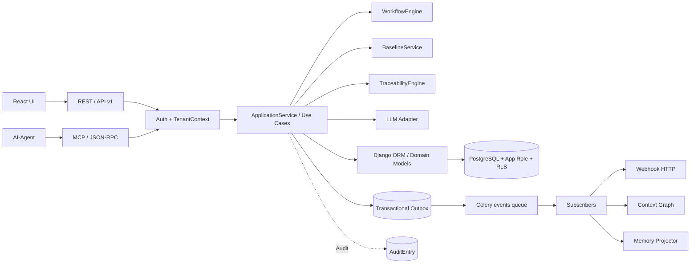

# Systemaudit 2026-09 — Architektur und Systemgrenzen

**Revisionsstand:** `94a3737a312150713a0684c147260a13ded01f50`  
**Branch:** `feat/1031-bluepencil-host-bridge`  
**Auditdatum:** 2026-09-24  
**Scope:** Django-/DRF-Backend, Application-Service-Fassade, Domain-Services, PostgreSQL/ORM/RLS, Celery/Redis/Outbox, MCP, LLM-/Memory-Ausgangsgrenzen, Deployment- und Interface-Grenzen.

## 1. Management-Summary

Die beabsichtigte Architektur ist klar erkennbar: REST und MCP sind als gleichrangige Adapter für einen gemeinsamen Application-Service-Core vorgesehen, Tenant-Isolation wird auf ORM- und PostgreSQL-Ebene zweistufig verteidigt, und die Transactional-Outbox ist inzwischen als belastbarerPersistenzmechanismus implementiert.

Der Audit findet jedoch zwei aktuelle P1-Risiken und mehrere P2-Boundary-Lücken:

1. **Die Development-Compose-Overlay-Datei führt Migrationen mit der Least-Privilege-App-Rolle aus.** Im laufenden Stack führte dies am 2026-09-24 beim Backend zu einer Restart-Schleife mit `must be owner of table audit_entry`.
2. **Der Context-Graph-Projector löst seinen Tenant im echten Celery-Pfad vor dem Armieren von `app.current_tenant` auf.** Dadurch wird die RLS-geschützte Settings-/Workspace-Lookup-Sicht unter dem App-Role leer und der Projector beendet sich als scheinbarer No-op.
3. **Mehrere Layer-3-/Interface-Pfade umgehen den Single-Entry-Point**, obwohl der vorhandene Architecture-Ratchet diese Pfade nicht vollständig erfasst.
4. **Webhook-Ausgangsgrenzen sind nicht vollständig von der Event-Zustellung getrennt:** synchrone HTTP-Aufrufe laufen im Outbox-Worker, und Fehler werden nicht als Event-Fehler an den Bus propagiert.
5. **Interview-Chat-Schreibvorgänge und Baseline-Lesegrenzen enthalten zusätzliche Konsistenz- bzw. Defense-in-Depth-Lücken.**

### Befundübersicht

| ID | Schwere | Status | Kurzfassung |
|---|---:|---|---|
| AB-001 | P1 | bestätigt | Development-Compose führt DDL mit der App-Rolle aus; Backend-Start scheitert reproduzierbar. |
| AB-002 | P1 | bestätigt, hohe Confidence | ContextGraphProjector/Admin-Rebuild lösen Tenant außerhalb des RLS-Kontexts auf und laufen unter dem App-Role still. |
| AB-003 | P2 | bestätigt | Architecture-Ratchet erfasst Shared Mixins und `admin_ops`-Interface-Code nicht vollständig. |
| AB-004 | P2 | bestätigt | Webhook-HTTP läuft synchron im Outbox-Worker; Aufrufe blockieren den gemeinsamen Worker-Pool. |
| AB-005 | P2 | Kontrolllücke bestätigt | Webhook-URLs werden serverseitig ohne SSRF-/Egress-Policy verwendet. |
| AB-006 | P2 | bestätigt | Ein Interview-Chat-Turn schreibt extrahierte Felder in mehreren Einzeltransaktionen und ohne Konfliktsperre. |
| AB-007 | P2 | Gap bestätigt | `bl_delta_index_entry` ist ein Plain Model ohne `tenant_id`/RLS; Isolation hängt von Parent-Pre-Checks ab. |
| AB-008 | P2 | Kontrolllücke bestätigt | LLM-/Memory-URL-Sicherheit wird nicht am Provider-/Backend-Rand durchgehend erzwungen. |
| AB-009 | P2 | bestätigt | Minimal-Deployment lässt alle Celery-Aufgaben still pending. |
| AB-010 | P2 | bestätigt | Architektur- und Interface-Dokumentation describes eine veraltete MCP-Topologie. |
| AB-011 | P2 | bestätigt | Zwei gleichnamige `DomainEventBus`-Konzepte mit unterschiedlicher Semantik bleiben parallel. |
| AB-012 | P2 | bestätigt | `DiffEngine` verwandelt beliebige State-Store-Fehler in einen Versions-Fallback. |

**P0:** Kein belegter P0-Befund.  
**Gesamtbewertung:** Architekturfundament tragfähig, aber die Produktions-/Development-Verdrahtung und die Context-/Tenant-Grenzen müssen vor einer zusätzlichen Skalierung oder einem produktiven Multi-Tenant-Betrieb priorisiert werden.

## 2. Methodik und Evidenzregeln

### 2.1 Vorgehen

- Statische Prüfung der Layer-, Service-, ORM-, Migration-, Celery-, MCP-, LLM-, Memory- und Compose-Pfade.
- Abgleich der Implementierung mit `backend/README.md`, der L1-Architektur, dem Interface-Register und den ADR-/Service-Dokumenten.
- Prüfung der vorhandenen Architecture-Ratchet-, RLS-, Outbox-, Provider- und Worker-Tests.
- Beobachtung des laufenden Docker-Stacks ohne Neustart, Stoppen oder destructive Aktionen.
- Gezielter Testversuch für Context-Graph-Tests; die Ergebnisgrenzen sind in Abschnitt 10 dokumentiert.

### 2.2 Tatsache versus Hypothese

- **Tatsache:** direkt aus aktuellem Quelltext, Migration, Compose-Konfiguration, Test oder Runtime-Log belegt.
- **Hypothese/Risiko:** aus einer Tatsache abgeleitete mögliche Auswirkung; sie wird nicht als bereits eingetretener Datenverlust ausgegeben.
- **Confidence:** Vertrauen in die Ursachen- und Auswirkungskette, nicht in die Schwere allein.
- Historische Berichte wurden als Kontext gelesen, aber nicht ungeprüft als aktueller Befund übernommen.

### 2.3 Schweregrade

- **P0:** Aktueller, systemweiter Ausfall oder unmittelbarer schwerwiegender Daten-/Security-Schaden mit belegtem Produktionspfad.
- **P1:** Wesentliche Verfügbarkeits-, Korrektheits- oder Security-Auswirkung auf einem aktiven Standardpfad.
- **P2:** Materielle Zuverlässigkeits-, Sicherheits-, Wartbarkeits- oder Vertragslücke mit begrenzter oder indirekter Reichweite.
- **P3:** Kleines, lokal begrenztes Risiko mit geringem unmittelbarem Nutzen.

## 3. Architektur- und Systemkarte

### 3.1 Beabsichtigter Hauptpfad



### 3.2 Vertragsgrundlage

Die zentrale fachliche Entscheidung ist ADR-01: REST und MCP greifen direkt auf den Application-Service zu. `backend/README.md:43-56` dokumentiert die Layer 0-3 und die wesentlichen Entscheidungen, insbesondere:

- Custom Manager plus PostgreSQL-RLS für Tenant-Isolation.
- Transactional Outbox mit Inline-INSERT in der Mutation.
- Provider-Abstraktion hinter `LlmCapabilityInterface`.
- Celery/Redis als Async-Transport.
- Shared Docker-Compose als primäre Deployment-Form.

### 3.3 Reale Zusatzgrenzen

- `DomainEventOutbox`, `DomainEventDLQ`, `WebhookSubscription` und `WebhookDeliveryLog` sind bewusst Plain Models mit `workspace_id`-UUID-Feldern.
- `SystemMemorySettings` ist ein bewusst prozessweites Plain Model ohne Tenant-FK.
- `cg_context_edge` und `cg_workspace_context_settings` sind dagegen `TenantScopedModel` mit FORCE-RLS.
- Diese unterschiedlichen Grenzen sind nicht per se ein Fehler; sie müssen aber als unterschiedliche Sicherheitsverträge getestet und dokumentiert werden.

## 4. Befunde

### AB-001 — Development-Compose führt Migrationen mit der App-Rolle aus

**Schwere:** P1  
**Status:** bestätigt, runtime observed  
**Confidence:** Hoch

**Tatsache**

- Das Development-Overlay startet im Backend ausdrücklich `python manage.py migrate --noinput` vor Uvicorn (`deploy/docker-compose.override.yml:64-72`).
- Das Backend erbt dabei aus dem Full-Stack-Compose die Runtime-Credentials `DB_USER=${DB_APP_USER:-reqogniloom_app}` und `DB_PASSWORD=${DB_APP_PASSWORD}` (`deploy/docker-compose.yml:251-265`).
- Der dedizierte Migrationsdienst verwendet dagegen den Bootstrap-/Migrationsbenutzer `DB_USER=${DB_USER:-reqogniloom}` (`deploy/docker-compose.yml:330-371`).
- Die Kommentare des Full-Stacks sagen ausdrücklich, dass Backend und Celery niemals migrieren sollen (`deploy/docker-compose.yml:319-329`).
- Am 2026-09-24 war `ai-native-reqflow-poc-backend-1` im Status `Restarting`. Das Log zeigte beim Anwenden von `audit.0014_auditentry_details` den Fehler `must be owner of table audit_entry` und anschließend `InsufficientPrivilege`.

**Hypothese/Auswirkung**

Jeder neue DDL-Migrationsschritt, der Schema-Owner-Rechte benötigt, kann in der automatisch gemergten Development-Konfiguration den Backend-Start verhindern. Der Fehler ist nicht auf eine einzelne Tabelle beschränkt; die Grenze zwischen DDL-Migrationsrolle und Runtime-Rolle ist im Overlay falsch gesetzt. Ein frischer oder migrierter Development-Stack kann damit dauerhaft unavailable bleiben.

**Root Cause**

Die Compose-Dateien haben zwei konkurrierende Migrationsverträge: ein dedizierter One-Shot-Migrationsdienst und ein zusätzlicher Migrationsaufruf im Backend-Entrypoint. Das Overlay übernimmt den Aufruf, aber nicht die dafür notwendige Superuser-Rolle.

**Gegenmaßnahme**

- Migrationsaufruf aus dem Development-Backend-Entrypoint entfernen.
- `migrate` als einzigen DDL-Service mit `DB_USER=${DB_USER:-reqogniloom}` und separatem `DB_APP_PASSWORD` beibehalten.
- `backend.depends_on: migrate.condition: service_completed_successfully` beibehalten.
- Einen CI-/Smoke-Test ergänzen, der eine ausstehende Migration mit der Runtime-Rolle und mit dem Migrationsbenutzer prüft und den Backend-Health-Endpunkt erst nach erfolgreicher Migration erwartet.

**Alternativen**

- Dem App-Rolle-Benutzer Schema-Owner-Rechte geben: verworfen, weil es die RLS-/Least-Privilege-Grenze aufweicht.
- Im Backend-Docker dauerhaft Superuser-Credentials verwenden: verworfen, weil der Runtime-Prozess dann unnötig migrationsfähig ist.

**Verifikation**

`docker compose config` nur mit maskierten Secret-Werten prüfen, einen absichtlich pending Migration-State herstellen, `docker compose up` ausführen und kontrollieren, dass ausschließlich der `migrate`-Container DDL ausführt. Der aktuelle Runtime-Fehler ist bereits ein Reproduktionssignal, aber kein vollständiger Testlauf.

### AB-002 — ContextGraphProjector löst Tenant außerhalb des RLS-Kontexts auf

**Schwere:** P1  
**Status:** bestätigt; kein aktueller Happy-Path-Test bildet den echten Worker-Zustand ab  
**Confidence:** Hoch

**Tatsache**

- `ContextGraphProjector.handle_event()` ruft zuerst `_get_settings_cached()` auf und erst danach `_resolve_tenant_id()` und `set_request_tenant()` (`backend/context_graph/projector.py:75-109`).
- `_load_settings()` verwendet vor dem Tenant-Arming `WorkspaceContextSettings.unscoped` (`backend/context_graph/projector.py:163-185`).
- `Workspace.unscoped` entfernt nur den Django-Manager-Filter; der Kommentar und `backend/persistence/tenancy.py:161-170` bestätigen, dass PostgreSQL-RLS trotzdem gilt.
- `cg_workspace_context_settings` und `cg_context_edge` verwenden `ENABLE ROW LEVEL SECURITY` und `FORCE ROW LEVEL SECURITY` (`backend/context_graph/migrations/0001_initial.py:27-45,134-135`).
- Der Outbox-Poller startet ohne Request-Kontext (`backend/application/event_bus.py:458-547`), genau die Produktionsbedingung, die der Memory-Regressionstest als fehlerhaft dokumentiert (`backend/memory/tests/test_projector_rls_tenant_resolution.py:4-19`).
- `rebuild_workspace_graph()` verwendet dieselbe problematische Reihenfolge (`backend/context_graph/admin_ops.py:45-57`).
- Die vorhandenen Context-Graph-Tests prüfen RLS-Policy-Metadaten und direkte Tenant-Kontexte, aber nicht den entscheidenden `SET ROLE`-/kein-`app.current_tenant`-Workerpfad (`backend/context_graph/tests/test_rls_policies.py:1-7,66-104`).

**Hypothese/Auswirkung**

Unter dem realen `reqogniloom_app`-Role liefert die RLS-geschützte Settings-/Workspace-Sicht null Zeilen. `handle_event()` interpretiert das als fehlende oder deaktivierte Workspace-Konfiguration und beendet sich ohne Fehler. Context-Graph-Kanten, `last_projected_at` und `last_error` bleiben dadurch veraltet. Der Fehler ist still, obwohl der Worker und die Subscriber-Registrierung gesund aussehen.

**Root Cause**

Tenant-Auflösung und Settings-Lookup wurden vor dem Armieren beider Isolationsschichten platziert. `unscoped` wurde als vollständige Escape-Hatch-Möglichkeit behandelt, obwohl es nur den ORM-Filter umgeht.

**Gegenmaßnahme**

- Tenant-ID bereits bei der Event-Erzeugung im Payload transportieren und im Worker ohne DB-Lookup verwenden; das ist der im Memory-Projekt bereits bewährte Lösungsweg.
- Alternativ einen expliziten, auditierten Maintenance-/SECURITY-DEFINER-Lookup für die einmalige Workspace-Auflösung verwenden.
- Erst nach Auflösung der Tenant-ID `set_request_tenant()` ausführen und alle Context-Graph-Queries darin bündeln.
- Einen echten PostgreSQL-Regressionstest mit `SET ROLE reqogniloom_app`, ohne GUC und ohne `TenantContext` ergänzen; zusätzlich ein End-to-End-Test über `poll_and_dispatch()`.

**Alternativen**

- RLS für die Context-Graph-Tabellen entfernen: verworfen, weil dadurch die Defense-in-Depth-Grenze entfällt.
- Nur den `Workspace`-Lookup cachen: nicht ausreichend, weil auch der Settings-Lookup vor dem Arming problematisch ist.
- Den Fehler nur loggen: nicht ausreichend, die Feature-Korrektheit bleibt verloren.

**Verifikation**

Im Test-Datenbestand zwei Tenants anlegen, unter dem App-Role ohne `app.current_tenant` den Projector aufrufen und anschließend mit korrektem Payload-Tenant denselben Aufruf wiederholen. Erwartung vor Fix: Settings/Edges bleiben unverändert; nach Fix: nur der korrekte Tenant wird projiziert.

### AB-003 — Single-Entry-Point-Grenze ist nicht vollständig durchgesetzt

**Schwere:** P2  
**Status:** bestätigt  
**Confidence:** Hoch

**Tatsache**

- Das Architecture-Ratchet erfasst laut Implementierung `backend/rest_api/*_views.py`, `backend/rest_api/views.py`, `backend/rest_api/serializers.py`, MCP-Tools und Top-Level-MCP-Module (`backend/rest_api/tests/test_architecture.py:99-181`).
- Shared Mixins werden nicht rekursiv erfasst. `backend/rest_api/mixins/workflow_transitions.py:100-112` greift direkt auf `WorkflowItemState.objects` und `WorkflowHistoryEntry.objects` zu.
- `backend/admin_ops/theme_rest.py:31-45,104-155,173-204,225-323` ist ein weiterer REST-Adapter mit direkten Model-Imports und direkten `.objects`-/`.unscoped`-Zugriffen.
- Die Architekturvorgabe in `docs/se/L1/Gesamtsystem/L1_Gesamtsystem_Architecture.md:106-164` und `backend/README.md:43-56` verlangt, dass Adapter Use-Case-Service-Aufrufe translateieren und keinen eigenen Persistenzweg eröffnen.

**Hypothese/Auswirkung**

Business-Regeln, Tenant-Kontext, Audit- und Transaktionsinvarianten können je nach Endpoint unterschiedlich angewandt werden. Der Ratchet verhindert neue Regressionen nur in den gescannten Dateien; ein neuer Adapterpfad kann die zentrale Grenze umgehen, ohne dass ein Test anschlägt.

**Root Cause**

Der Guard ist datei- und verzeichnisbasiert statt architektur-/modulbasiert. Shared Mixins und `admin_ops` liegen außerhalb der geprüften Pfadmenge.

**Gegenmaßnahme**

- Direkte ORM-Zugriffe aus `WorkflowTransitionsMixin` und Theme-Views in Services verschieben.
- Den Ratchet auf alle Interface-Adapter und Shared-Mixin-Verzeichnisse erweitern oder AST-/Import-basierte Regeln verwenden.
- Für jeden Adapterpfad einen Vertragstest ergänzen, der Service-Aufruf, TenantContext, Audit und Transaktionsgrenze prüft.

**Alternativen**

- Nur die Allowlist um weitere Dateien ergänzen: kurzfristig, aber nicht strukturell.
- Kommentare als Ersatz für Services: verworfen, weil die Laufzeitgrenze dadurch nicht verändert wird.

**Verifikation**

Den erweiterten Guard lokal und in CI ausführen und mit Test-Fixtures belegen, dass ein neu eingefügter `.objects`-Zugriff in einem Mixin bzw. `admin_ops`-Adapter fehlschlägt.

### AB-004 — Webhook-Zustellung blockiert den Outbox-Worker und signalisiert Fehler nicht an den Event-Bus

**Schwere:** P2  
**Status:** bestätigt  
**Confidence:** Hoch für Blockade, mittel für Event-Retry-Semantik

**Tatsache**

- `backend/application/event_bus.py:25-31` dokumentiert bis zu fünf HTTP-POSTs, 10-Sekunden-Timeouts und 15 Sekunden Backoff-Sleeps pro Subscription.
- `WebhookDispatcher` führt die Aufrufe synchron im Subscriber-Callback aus (`backend/application/webhook_dispatcher.py:12-15,75-79,106-133,201-301`).
- Der Celery-Service konsumiert alle Queues in einem gemeinsamen Pool (`deploy/docker-compose.yml:431-458`).
- Nach erfolgreicher interner Retry-/Dead-letter-Logik kehrt `_dispatch_with_retry()` ohne Exception zurück. `dispatch_to_subscribers()` wertet nur Exceptions als Fehler (`backend/application/webhook_dispatcher.py:253-275,295-301`; `backend/application/event_bus.py:232-275`).

**Hypothese/Auswirkung**

Ein einzelnes langsames oder unerreichbares Webhook kann den Worker für den Zeitraum der HTTP-/Backoff-Kette belegen und dadurch andere Events, LLM-Tasks und Memory-Tasks verzögern. Wenn alle Webhook-Versuche scheitern, kann das Outbox-Event als erfolgreich markiert werden, obwohl nur ein `WebhookDeliveryLog`-Fehlerstatus existiert. Das ist nicht automatisch Datenverlust, aber die Event-Retry-Schicht signalisiert den externen Fehler nicht.

**Root Cause**

Die Outbox schützt die interne Zustellung, aber nicht die Dauer und Ergebnis-Semantik des externen HTTP-Subscribers. „Event erfolgreich verarbeitet“ und „Webhook erfolgreich zugestellt“ sind nicht getrennt.

**Gegenmaßnahme**

- Pro Subscription eine eigene Celery-Aufgabe in einer Webhook-Queue enqueueen.
- Event- und Webhook-Status getrennt modellieren und das Outbox-Ergebnis an den Subscriber-Status koppeln.
- Retry-/DLQ-Metriken, Queue-Alter und Anzahl laufender HTTP-Anfragen exponieren.
- Eine gemeinsame Worker-Pool-Aufteilung für `events`, `llm` und `memory` einführen oder die Shared-Pool-Entscheidung bewusst als Kapazitätsgrenze dokumentieren.

**Alternativen**

- Timeout oder Worker-Konsole erhöhen: verworfen, weil die Kopplung bestehen bleibt.
- Nur auf `WebhookDeliveryLog` verweisen: reicht nicht für automatische Wiederholung und Outbox-Monitoring.

**Verifikation**

Einen absichtlich langsamen und einen dauerhaft fehlerhaften Testendpunkt injizieren; Taskdauer, Outbox-Status, DLQ-Status, Queue-Backlog und Worker-Auslastung über mindestens einen vollständigen Retry-Zyklus messen.

### AB-005 — Webhook-Ausgangs-URL besitzt keine eigene SSRF-/Egress-Policy

**Schwere:** P2  
**Status:** Kontrolllücke bestätigt  
**Confidence:** Hoch für fehlende Kontrolle, mittel für Ausnutzbarkeit

**Tatsache**

- `WebhookSubscription.url` ist lediglich ein `URLField` (`backend/application/models.py:164-188`).
- Der Dispatcher ruft die konfigurierte URL serverseitig mit `urllib.request.urlopen()` auf (`backend/application/webhook_dispatcher.py:303-340`).
- Im Webhook-Pfad existiert kein Aufruf von `llm_adapter.url_guard.validate_outbound_url`, keine Allowlist für Hosts/Ports und keine Egress-Policy.
- Das LLM-Adaptersystem besitzt dagegen bereits eine dedizierte URL-/SSRF-Prüfung (`backend/llm_adapter/url_guard.py:149-197`), die aber nur im LLM-Kontext angewandt wird.

**Hypothese/Auswirkung**

Ein kompromittierter oder missbrauchter Django-Admin mit Schreibrechten auf Webhook-Subscriptions kann das Backend als Proxy in das private Netzwerk verwenden, sofern der Host private Ziele erreichen kann. Der Bericht behauptet nicht, dass ein unauthentifizierter Tenant dies auslösen kann; die Eintrittsschwelle ist die Admin-/Konfigurationsberechtigung.

**Root Cause**

URL-Sicherheit ist an den LLM-Schreibpfad gekoppelt, nicht an die generelle serverseitige Ausgangsgrenze.

**Gegenmaßnahme**

- Gemeinsame Outbound-URL-Policy für Webhooks, LLM, Honcho und Ollama einführen.
- Schreibpfad und Ausführungspfad validieren; DNS-Rebinding durch IP-Pinning oder einen kontrollierten Egress-Proxy verhindern.
- Schemes, Ports und erlaubte Zielklassen beschränken und private Ziele nur explizit für dokumentierte Self-hosted-Fälle freigeben.

**Alternativen**

- Nur `URLField` beibehalten: unzureichend, weil die URL serverseitig aufgelöst wird.
- Admin-Vertrauen als ausreichende Kontrolle: für eine kompromittierte Admin-Instanz nicht ausreichend.

**Verifikation**

Unit- und Integrationstests für `127.0.0.1`, RFC1918, Link-local, IPv4-mapped IPv6, DNS-Rebinding und erlaubte öffentliche Ziele; zusätzlich ein Test, dass ein gespeicherter Wert vor jedem Request erneut geprüft wird.

### AB-006 — Interview-Chat-Turn ist nicht atomar und nicht konfliktgeschützt

**Schwere:** P2  
**Status:** bestätigt  
**Confidence:** Hoch

**Tatsache**

- Jeder Aufruf von `InterviewService.answer()` ist mit `@atomic_transaction` umgeben (`backend/application/interview_service.py:448-492`).
- `generate_chat_turn()` ruft `self.answer()` für jedes extrahierte Feld in einer Schleife auf (`backend/application/interview_service.py:1680-1688`).
- Erst danach schreibt ein eigener `transaction.atomic()`-Block Transcript und Outbox-Event (`backend/application/interview_service.py:1690-1747`).
- Im Chatpfad gibt es kein `select_for_update` und keinen bedingten Update auf die zuvor gelesene Session-Version. Die Session besitzt zwar eine geerbte `version`, der Chat-Pfad prüft diese aber nicht gegen eine Client- oder Request-Version (`backend/persistence/models.py:2804-2889`).

**Hypothese/Auswirkung**

Wenn ein späteres Feld ungültig ist, die Session-Transaktion fehlschlägt oder der Prozess beendet wird, können bereits geschriebene Felder committed bleiben, während Transcript und Event fehlen. Bei zwei gleichzeitigen Chat-Turns kann außerdem ein Read-Modify-Write auf Transcript/Version zu Lost Updates führen. Die fachliche Session ist dann nicht mehr atomar mit dem erzeugten Turn.

**Root Cause**

Die LLM-Netzwerkgrenze wird korrekt außerhalb einer Transaktion gehalten, aber die daraus resultierenden fachlichen Teilschreibvorgänge werden nicht zu einer einzigen kurzen Commit-Phase mit Lock-/Versionsprüfung zusammengeführt.

**Gegenmaßnahme**

- Alle extrahierten Felder zunächst validieren und in einem kurzen `atomic()`-Block auf eine row-locked Session anwenden.
- Transcript, `collected_fields` und Outbox-Event in derselben Transaktion schreiben.
- Bei Versionskonflikt eine deterministische Retry-/409-Semantik definieren.
- Einen Test mit absichtlich fehlerhaftem zweitem Feld und einen Parallel-Request-Test ergänzen.

**Alternativen**

- Die LLM-Nutzung in eine Transaktion einzschließen: verworfen, da dies DB-Verbindungen und Request-Latenz über einen externen Call hält.
- Nur `version=F('version')+1` beibehalten: unzureichend, weil ein Increment allein keine Lost-Update-Änderung verhindert.

**Verifikation**

Zwei gleichzeitige `generate_chat_turn()`-Aufrufe sowie ein Fehlerpfad nach dem ersten Feld ausführen und prüfen, dass genau eine Version gewinnt, alle Felder gemeinsam committed werden und Event/Transcript denselben Stand referenzieren.

### AB-007 — Baseline-Delta-Einträge haben keine eigene RLS-Schicht

**Schwere:** P2  
**Status:** Defense-in-Depth-Gap bestätigt; aktueller Store-Schutz vorhanden  
**Confidence:** Hoch für den Gap, niedrig für einen aktuell bewiesenen Cross-Tenant-Leak

**Tatsache**

- `BaselineDeltaIndexEntry` ist ein Plain `models.Model` ohne `tenant_id` (`backend/baseline/models.py:116-187`).
- Die RLS-Migration schließt `bl_delta_index_entry` ausdrücklich aus (`backend/baseline/migrations/0006_baseline_snapshot_rls.py:20-35`).
- `BaselineStore` prüft bei öffentlichen Leseoperationen zuerst den Parent-Snapshot mit `tenant_id=tenant_id` und filtert danach den Kind-Eintrag (`backend/baseline/store.py:134-201,247-292`).
- Die Application-Facade bildet ebenfalls zuerst eine tenant-gefilterte Kandidatenliste ab (`backend/application/baseline_facade.py:1022-1051`).
- Die generelle RLS-Coverage-Prüfung betrachtet nur konkrete `TenantScopedModel`-Subklassen (`backend/persistence/tests/test_rls_coverage.py:133-162`), nicht Plain Child Models.

**Hypothese/Auswirkung**

Der aktuelle Store-Pfad schützt die bekannten öffentlichen Operationen transitiv. Ein neuer direkter Reporting-, Admin- oder Service-Query auf `BaselineDeltaIndexEntry` kann jedoch die Parent-Prüfung umgehen, weil die Datenbank selbst keine Tenant-Isolationsinformation besitzt. Die Defense-in-Depth-Zusage ist damit an Code-Disziplin gekoppelt.

**Root Cause**

Das Delta-Schema trägt die Tenant-Zuordnung nur indirekt über den Parent-FK; eine relation-basierte RLS-Policy wurde bewusst zurückgestellt.

**Gegenmaßnahme**

- Bevorzugt `tenant_id` am Kindmodell denormalisieren und per Foreign-Key-/Trigger-Invariant mit dem Parent synchronisieren.
- Alternativ eine geprüfte `EXISTS`-RLS-Policy gegen den Parent verwenden.
- Direkte Kindqueries durch eine Repository-/Store-API sperren und einen Cross-Tenant-Test unter App-Role ergänzen.

**Alternativen**

- Parent-Pre-Checks als einzige dauerhafte Lösung: reicht für die aktuelle API, erfüllt aber keine Datenbank-Defense-in-Depth.
- RLS pauschal entfernen: verworfen, weil dadurch ein echter Schutzpfad entfällt.

**Verifikation**

Unter dem App-Role mit leerem `app.current_tenant` und mit einem Tenant-A-Parent einen direkten Kindquery ausführen; nach der Gegenmaßnahme muss das Ergebnis leer bzw. policygefiltert sein. Zusätzlich alle bestehenden Store-Aufrufer gegen ein Migrationstest-Schema prüfen.

### AB-008 — Outbound-URL-Sicherheit ist nicht am Provider-/Backend-Rand erzwungen

**Schwere:** P2  
**Status:** Kontrolllücke bestätigt  
**Confidence:** Hoch für die Grenzstelle, mittel für die praktische Ausnutzbarkeit

**Tatsache**

- `validate_outbound_url()` wird in `backend/application/settings_service.py:198-220` und `backend/rest_api/settings_views.py:70-83` aufgerufen.
- `llm_adapter.providers.get_provider()` liest die Konfiguration und konstruiert den Provider ohne erneute URL-Prüfung (`backend/llm_adapter/providers.py:2037-2068`).
- `backend/llm_adapter/url_guard.py:39-50` dokumentiert DNS-Rebinding als bekanntes Restrisiko, weil Validierung und HTTP-Verbindung getrennt auflösen.
- Die globale Memory-Konfiguration speichert `ollama_base_url` und `honcho_base_url` als freie Textfelder (`backend/memory/models.py:156-188`); der Memory-Service schreibt sie ohne den LLM-Guard (`backend/application/memory_settings_service.py:117-160`).
- Der Memory-Service ist absichtlich global und schreibgeschützt für normale Tenant-Admin-Rollen; der REST-Pfad verlangt für das Schreiben Django-Superuser (`backend/memory/memory_rest.py:176-197,366-393`).

**Hypothese/Auswirkung**

Ein direkter interner Aufruf von `get_provider(config)`, ein zukünftiger Management-Command oder ein Memory-Backend kann eine ungeprüfte Provider-/Embedding-URL verwenden. Selbst der geprüfte LLM-Pfad bleibt gegen DNS-Rebinding unvollständig geschützt. Das ist kein Beleg für einen aktiven unauthentifizierten Angriff, aber die Sicherheitsinvariante ist nicht an der tatsächlichen Ausführung erzwungen.

**Root Cause**

Die Policy wird an einzelnen Schreibpfaden statt an einem validierten Provider-Konfigurationsobjekt und am HTTP-Clientrand erzwungen. Memory und LLM besitzen außerdem getrennte URL-Konfigurationspfade.

**Gegenmaßnahme**

- URL-Validierung in `resolve_provider_config()`/`get_provider()` und in den Memory-Backends aufrufen.
- Validierte, unveränderliche Provider-Konfiguration als Typ/Objekt bis zum HTTP-Client durchreichen.
- Für DNS-Rebinding IP-Pinning oder einen Egress-Proxy verwenden; Self-hosted-Ollama-/Honcho-Ausnahmen explizit und minimal konfigurieren.
- Konfigurationsquellen und deren Vertrauensstufe dokumentieren.

**Alternativen**

- Nur den REST-Serializer prüfen: unzureichend, weil Worker und interne Aufrufe den Serializer umgehen.
- Alle privaten URLs grundsätzlich blockieren: unpraktisch, da Ollama/Honcho als private Self-hosted-Dienste unterstützt werden.

**Verifikation**

Tests für direkte Provider-Konstruktion, Celery-Worker, Memory-Backend, IPv4-mapped IPv6 und DNS-Wechsel zwischen Validierung und Request ergänzen.

### AB-009 — Minimal-Deployment lässt Async-Funktionen still pending

**Schwere:** P2  
**Status:** bestätigt  
**Confidence:** Hoch

**Tatsache**

- `deploy/docker-compose.minimal.yml:3-12` dokumentiert ausdrücklich, dass kein Celery-Worker/Beat läuft und queuende Aufgaben dauerhaft pending bleiben.
- Betroffen sind laut Datei LLM-Long-Running-Calls, Webhooks, GitHub-Sync und Memory-Konsolidierung.
- Der Backend-Healthcheck prüft nur den HTTP-Health-Endpunkt (`deploy/docker-compose.minimal.yml:154-159`); ein fehlender Worker wird nicht als Readiness- oder Feature-Degradationssignal ausgewiesen.
- Der Vollstack enthält dagegen Worker und Beat (`deploy/docker-compose.yml:373-513`).

**Hypothese/Auswirkung**

Ein Operator kann eine als arbeitsfähig wahrgenommene Minimalinstallation starten und anschließend Feature-Ausfälle erst bemerken, wenn ein Workflow auf ein Ergebnis wartet. Die Fehlermeldung entsteht nicht im enqueueenden Prozess, sondern bleibt als pending Redis-/Task-Zustand unsichtbar.

**Root Cause**

Die Compose-Variante beschreibt die Einschränkung, erzwingt aber keine Kompatibilitätsprüfung zwischen ausgewählten Deployment-Features und vorhandenen Feature-Schaltern.

**Gegenmaßnahme**

- Async-Features im Minimalprofil standardmäßig deaktivieren oder beim Start mit einer Capability-Warnung versehen.
- Einen `/health`-Response mit `async_available`, Queue-/Workerstatus und Feature-Matrix erweitern.
- Für den Vollstack Queue-Tiefe, Worker-Ping und Outbox-Backlog in Readiness/Monitoring aufnehmen.
- CI-Test für beide Compose-Varianten ergänzen.

**Alternativen**

- Nur die bestehende Dokumentation zu lassen: unzureichend, weil die Zustandsmaschine nicht erkannt wird.
- Im Minimalprofil doch Worker starten: macht die Variante nicht mehr minimal und beseitigt die Produktentscheidung nicht.

**Verifikation**

Minimalprofil ohne Worker starten, ein Async-Feature auslösen und sicherstellen, dass der Status/Health-Endpunkt die Degradierung innerhalb eines definierten Zeitfensters sichtbar macht.

### AB-010 — Architektur- und Interface-Dokumentation ist gegenüber der aktuellen MCP-Topologie veraltet

**Schwere:** P2  
**Status:** bestätigt  
**Confidence:** Hoch

**Tatsache**

- `docs/se/interface-registry.md:28-35,57-67` nennt 20 MCP-Tools in vier Gruppen.
- `docs/se/L1/Gesamtsystem/L1_Gesamtsystem_Architecture.md:127-137` nennt 40 Tools in fünf Gruppen.
- Der aktuelle `ToolRegistry` beschreibt selbst einen Katalog von 180+ Tools und importiert deutlich mehr Gruppen/Präfixe (`backend/mcp_server/tool_registry.py:57-74,831-878`).
- `backend/README.md` und `AGENTS.md` verwenden wiederum eine andere aktuelle Zählung (215 Tools/31 Präfixe), während `docs/se/SYSTEM_AUDIT.md:312` noch die historische 11-Gruppen/40+-Tools-Angabe enthält.

**Hypothese/Auswirkung**

Traceability-, Security- und Architektur-Reviews können sich auf eine falsche Grenzmenge beziehen. Neue MCP-Tools werden dann möglicherweise nicht in Interface-Registry, ADRs, Audit-Tests oder Capability-Matrixen nachgezogen.

**Root Cause**

Es gibt keine generierte, versionierte Manifest-Datei als einzige Quelle für Toolzahl, Gruppen, Präfixe, Auth- und Workspace-Scope.

**Gegenmaßnahme**

- Tool-Registry-/Schema-Manifest automatisch aus dem Code erzeugen.
- Counts und Interface-IDs im CI gegen das Manifest validieren.
- Historische Dokumente mit einem Gültigkeits-/Stand-Hinweis versehen, statt sie stillschweigend als aktuell zu behandeln.

**Alternativen**

- Nur die Textzahlen manuell korrigieren: wird bei der nächsten Tool-Erweiterung erneut driften.
- Historische Berichte löschen: nicht empfohlen, sie sind als Audit-Trail wertvoll.

**Verifikation**

Ein Tool hinzufügen/entfernen und den Dokumentations-/Manifest-Check laufen lassen; der Check muss die Abweichung der Counts und Interface-Zuordnung erkennen.

### AB-011 — Zwei `DomainEventBus`-Konzepte bleiben parallel und semantisch ähnlich benannt

**Schwere:** P2  
**Status:** bestätigt  
**Confidence:** Hoch

**Tatsache**

- `backend/audit/events.py:90-176` definiert einen synchronen, prozesslokalen Audit-Bus.
- `backend/audit/apps.py:30-38` registriert den `AuditLogWriter` auf diesem Bus.
- `backend/application/event_bus.py:137-275` definiert den Transactional-Outbox-Bus; `backend/context_graph/apps.py:23-34` weist ausdrücklich darauf hin, dass dies ein anderer Bus ist.
- `ServiceBase._emit_event()` und `ServiceBase._audit()` verwenden getrennte Wege (`backend/application/base.py:202-269,325-348`).
- Im aktuellen Produktionspfad wird der Legacy-Audit-Bus nicht als Publisher der Application-Schreibvorgänge verwendet; `log_write()` schreibt direkt (`backend/audit/services.py:126-190`).

**Hypothese/Auswirkung**

Neue Entwickler können den falschen Bus auswählen und einen Audit- oder Domain-Event-Pfad als verdrahtet annehmen, der nicht am selben Transaktionspunkt läuft. Die zwei gleichen Klassennamen erschweren Contract-Tests, Importprüfungen und Incident-Analyse.

**Root Cause**

Ein Legacy-Mechanismus blieb nach der Transactional-Outbox-Einführung bestehen, ohne eine klare Deprecation-/Ownership-Grenze.

**Gegenmaßnahme**

- Legacy-Bus entfernen oder in einen eindeutig benannten Audit-Bus umbenennen.
- Einen einzigen dokumentierten Eventvertrag für Audit und Outbox festlegen.
- Wiring-Tests ergänzen, die für jede Producer-Operation den tatsächlich verwendeten Eventpfad prüfen.
- Import- und Namenskonventionen im Architecture-Ratchet erzwingen.

**Alternativen**

- Beide Busse unverändert behalten: verworfen, weil die Verwechslungsgefahr bestehen bleibt.
- Audit wieder über den Outbox-Bus führen: nur nach einem expliziten Atomizitäts- und Tenant-ID-Vertrag, nicht als mechanische Umbenennung.

**Verifikation**

Grep-/Importprüfung und ein Startup-/Wiring-Test, der keine unbenutzten Event-Publisher oder Subscriber-Registrierungen toleriert.

### AB-012 — Baseline-Diff verschluckt Store-Fehler und fällt auf Versionslogik zurück

**Schwere:** P2  
**Status:** bestätigt  
**Confidence:** Hoch

**Tatsache**

- `DiffEngine._load_states()` fängt jede Exception ab und liefert `{}` zurück (`backend/baseline/diff_engine.py:161-177`).
- Der Diff unterscheidet bei fehlendem State nur zwischen Legacy-Eintrag und Feldvergleich; bei leerem Mapping kann ein gemeinsames Item mit unterschiedlichen `version`-Werten als geändert erscheinen, während jeder andere State-Fehler als harmloser Legacy-Fallback behandelt wird (`backend/baseline/diff_engine.py:121-151`).
- Die Store-Schnittstelle liefert State-Daten als authoritative Grundlage für Feld-Diffs (`backend/baseline/diff_engine.py:109-114,222-257`).

**Hypothese/Auswirkung**

Ein transienter Datenbank-, RLS- oder Store-Fehler kann in einen scheinbar gültigen Legacy-Versionsdiff umgewandelt werden. Je nach Item-Version entstehen falsch-negative oder falsch-positive Änderungen, ohne dass der Aufrufer einen Fehler oder eine Degradierungskennzeichnung erhält.

**Root Cause**

Der defensive Catch für ältere/stubbed Stores ist nicht von operativen Fehlern getrennt. Der Kommentar nennt ausdrücklich die Rückgabefähigkeit, aber nicht die Fehlerklassifikation.

**Gegenmaßnahme**

- Nur den bekannten „Store unterstützt `load_states` nicht“-Fall als Legacy-Fall behandeln; `BaselineNotFoundError`, DB- und RLS-Fehler propagieren oder als `diff_degraded` markieren.
- State-Fehler in Metrik/Log mit `baseline_id` und Tenantkontext erfassen.
- Failure-Injection-Tests für leere, veraltete und fehlerhafte Stores ergänzen.

**Alternativen**

- Jeden Store-Fehler sofort als Diff-Fehler auslösen: sicher, aber ein einzelner unverfügter State-Pfad blockiert dann die gesamte Vergleichsansicht; ein expliziter Degraded-Status ist die bessere Vertragsentscheidung.
- Immer auf `Artifact.version` zurückfallen: widerspricht dem dokumentierten Issue-398-Fix und erzeugt bekannte Subtyp-Fehlklassifikationen.

**Verifikation**

Store-Mock mit `load_states`-Exceptionen für `OperationalError`, `BaselineNotFoundError` und Legacy-Stub; Diff-Antwort muss unterscheidbar sein und darf keinen stillen Erfolg vortäuschen.

## 5. Bewertung der Tenant-/Datengrenzen

### 5.1 RLS und Manager

Positiv ist die klare Defense-in-Depth-Kette:

- `TenantManager` setzt den ORM-Filter und wirft bei fehlendem Kontext vor SQL-Erzeugung (`backend/persistence/tenancy.py:117-158`).
- `set_request_tenant()` setzt Thread-Kontext und `app.current_tenant` gemeinsam (`backend/persistence/middleware.py:34-67`).
- Die RLS-Migrationen verwenden `ENABLE + FORCE` und eine leere Session-Variable als geschlossenen Zustand.
- `backend/persistence/tests/test_rls_coverage.py` prüft sowohl statische Policy-Deklarationen als auch das Live-Schema.

Die wichtigste Grenze ist daher nicht das Fehlen von RLS, sondern die kontextlose Ausführung von Hintergrundpfaden. AB-002 ist ein konkretes Beispiel dafür, wie ein korrekt konfiguriertes RLS-System durch einen vorgelagerten unscoped-Lookup zur Laufzeitnoop-Falle wird.

### 5.2 Plain Operational Models

`DomainEventOutbox`, `DomainEventDLQ`, `WebhookSubscription` und `WebhookDeliveryLog` besitzen bewusst keine `TenantScopedModel`-Manager. Das ist als Betriebsmodell plausibel, aber die Invarianten müssen explizit bleiben:

- Outbox- und DLQ-Zeilen tragen `workspace_id`, nicht `tenant_id`.
- `DlqService` prüft die Workspace-Zugehörigkeit und filtert anschließend per `workspace_id` (`backend/application/dlq_service.py:83-123,143-170`).
- Der Webhook-Dispatcher filtert Subscriptionen anhand des Event-Workspace (`backend/application/webhook_dispatcher.py:137-153`).
- Django-Admin beschreibt die globale Betriebssicht ausdrücklich (`backend/application/admin.py:12-22`).

Diese Prüfungen sind positiv, aber direkte künftige Queries auf den Plain Models würden nicht automatisch durch RLS geschützt. Ein dedizierter Contract-Test für „jeder öffentliche Zugriff auf Plain Operational Models muss Workspace-Besitz verifizieren“ ist deshalb erforderlich.

### 5.3 SystemMemorySettings

`SystemMemorySettings` ist bewusst prozessweit und nicht tenant-scoped. Das ist für einen globalen Backend-Konfigurationswert plausibel; der Schreibpfad ist auf Django-Superuser begrenzt. Die URLs werden jedoch als freie Textfelder gespeichert und nicht mit dem LLM-Guard validiert (AB-008). Die Entscheidung „global“ reduziert die Tenant-Isolationsanforderung, nicht die SSRF-Anforderung.

## 6. Stärken und bewahrte Entscheidungen

1. **Dual-Interface-Konzept:** REST und MCP sind als gleichrangige Adapter modelliert; die dokumentierte Zielrichtung ist konsistent.
2. **Transaktionale Outbox:** Der Inline-INSERT und die dreiphasige Claim/Dispatch/Write-back-Logik schützen die Mutation/Event-Bindung; `backend/application/event_bus.py:7-31,164-214,458-555` enthält nachvollziehbare Invarianten.
3. **RLS-Grundlage:** FORCE-RLS, App-Role und statische/live Coverage-Tests sind eine belastbare Basis.
4. **Auth-Kontext:** `TenantContextService.activate()` setzt beide Isolationsschichten, und die Workspace-Rollenauflösung berücksichtigt den tatsächlich angefragten Workspace (`backend/auth_tenancy/rest.py:169-212`).
5. **Async-Task-Regressionen:** `backend/llm_adapter/tasks.py:117-198` und `backend/memory/tasks.py:36-59` dokumentieren und umsetzen die korrekte RLS-Aktivierung in Celery; AB-002 zeigt, dass diese Lösung nicht überall übernommen wurde.
6. **DLQ-Replay-Schutz:** `DlqService` prüft Workspace-Zugehörigkeit vor dem Replay und atomarisiert Outbox-Reinsert/DLQ-Löschung.
7. **CI-Grundlage:** `.github/workflows/ci.yml:32-153` führt getrennte Backend-Sets mit PostgreSQL/Redis und `settings_test` aus; Playwright nutzt vier Shards (`.github/workflows/playwright.yml:19-47`).

## 7. Risiko- und Maßnahmenreihenfolge

### Priorität 1 — Verfügbarkeit und richtige Tenant-Auflösung

1. AB-001: Development-Compose-Migrationsgrenze korrigieren und Smoke-Test ergänzen.
2. AB-002: Context-Graph-Event mit Tenant-ID versehen und echten App-Role-Worker-Regressionstest hinzufügen.
3. Vor beiden Änderungen den aktuellen Docker-Stack nicht durch destruktives `down -v` bereinigen; die bestehende Datenbank und das `postgres_data`-Volume bleiben erhalten.

### Priorität 2 — Grenzen konsolidieren

1. AB-003 und AB-011: Interface- und Event-Bus-Boundaries als ausführbare Regeln modellieren.
2. AB-004 und AB-005: Webhook-Lieferung von der Outbox-Dispatch-Phase trennen und SSRF-/Egress-Policy zentralisieren.
3. AB-006: Interview-Turn als atomare, konfliktgeprüfte Commit-Phase implementieren.

### Priorität 3 — Defense-in-Depth und Vertragsdrift

1. AB-007: Baseline-Kindtabelle relational oder denormalisiert absichern.
2. AB-008: URL-Policy an Provider-/Backend-Rand durchsetzen.
3. AB-009: Capability-/Readiness-Signal für Async-Betrieb ergänzen.
4. AB-010 und AB-012: Architekturmanifest und Diff-Fehlervertrag stabilisieren.

## 8. Empfohlene Abnahmekriterien

- Ein Compose-Startup mit ausstehenden Migrationen startet den Backend-Dienst erfolgreich; DDL läuft ausschließlich als Migrationsrolle.
- Ein Context-Graph-Event unter `SET ROLE reqogniloom_app` ohne `app.current_tenant` projiziert nach Einführung des Payload-Tenant-Felds korrekt und sichtbar.
- Ein Architecture-Test schlägt bei direkten ORM-Zugriffen in `backend/rest_api/mixins/` und `backend/admin_ops/*_rest.py` fehl.
- Ein absichtlich langsamer Webhook blockiert nicht den Events-Poller; Queue-Backlog und Zustellstatus sind getrennt messbar.
- Private/loopback Webhook-URLs werden abgewiesen; erlaubte Self-hosted-Ausnahmen sind explizit und minimal.
- Ein absichtlich fehlerhaftes zweites Interview-Feld hinterlässt keine teilweise aktualisierte Session.
- Ein direkter Query auf `bl_delta_index_entry` ist unter dem App-Role ohne passenden Tenant-Kontext leer.
- Dokumentationszahlen und MCP-Manifest werden bei jeder Tool-Änderung durch CI validiert.

## 9. Nicht als aktueller Befund bewertet

- Die historischen Aussagen in `docs/se/DEEP_SYSTEM_ANALYSIS.md` zu Async-LLM, Outbox-Verdrahtung, SSE, Providern und CI wurden nicht ungeprüft übernommen. Mehrere davon sind im aktuellen Code bereits behoben (Beispiele: `backend/llm_adapter/tasks.py`, Celery-Beat-Schedule, aktuelle CI-Dateien).
- Die RLS-Lücken bei `at_api_key`, `at_user_role` und `audit_entry` sind in `backend/persistence/tests/test_rls_coverage.py` ausdrücklich als geprüfte Ausnahmen dokumentiert. Sie bleiben eine getrennte Auth-/Architekturentscheidung und werden in diesem Bericht nicht als neue, unbestätigte P1-Lücke behauptet.
- `DomainEventOutbox`- und `Webhook`-Plain-Models sind nicht per se ein Tenant-Leak; die aktuellen Servicepfade enthalten Workspace-Prüfungen. Offen bleibt die fehlende DB-seitige Defense-in-Depth und ein Contract-Test für künftige Direktzugriffe.

## 10. Verifikationsstatus und Grenzen

- **Runtime-Beobachtung:** Docker-Stack am 2026-09-24 geprüft; Backend in Restart-Schleife, Celery/Beat/PostgreSQL/Redis healthy. Die Ursache ist im Backend-Log sichtbar.
- **Outbox-Beobachtung:** Celery-Log zeigt den 5-Sekunden-Poll und aktuell Backlog 0; das bestätigt Verdrahtung, aber nicht die Context-Graph-Projection unter RLS.
- **Gezielte Host-Tests:** `pytest context_graph/tests/...` konnte auf dem Windows-Host wegen eines installierten Home-Assistant-pytest-Plugins nicht starten (`ModuleNotFoundError: fcntl`).
- **Gezielte Container-Tests:** Der Lauf im Celery-Container erreichte die Test-Sammlung, konnte aber keine Testdatenbank anlegen, weil der Runtime-App-Role kein `CREATEDB` hat (`permission denied to create database`). Das ist ein Testumgebungs-/Migrationsrollen-Problem, kein grüner Testlauf.
- **Nicht ausgeführt:** vollständige pytest-Suite, vollständige Frontend-Suite und vollständiger Playwright-Lauf. Der Bericht ist ein statischer plus gezielter Runtime-Audit; ein Fix soll anschließend gezielt verifiziert werden.

## 11. Abschlussstatus

```text
STATUS: done
RESULT: Systemaudit abgeschlossen; zwei P1-Risiken und zehn P2-Boundary-/Zuverlässigkeitsbefunde evidenzbasiert dokumentiert. Keine Anwendungsdateien wurden geändert.
ARTIFACTS: docs/se/reports/deep_audit/system-audit-2026-09/01-architecture-and-boundaries.md
NEXT: [Review, Tests, Commit]
```

## 12. Quellenverzeichnis

- `backend/README.md:30-80`
- `docs/se/L1/Gesamtsystem/L1_Gesamtsystem_Architecture.md:14-24,74-164`
- `docs/se/interface-registry.md:28-118`
- `backend/persistence/tenancy.py:101-171`
- `backend/persistence/middleware.py:34-74`
- `backend/persistence/migrations/0003_rls_policies.py:43-95`
- `backend/persistence/migrations/0048_app_role.py:1-122`
- `backend/persistence/tests/test_rls_coverage.py:1-223`
- `backend/auth_tenancy/rest.py:135-212`
- `backend/auth_tenancy/services/tenant_context.py:38-113`
- `backend/application/base.py:138-348`
- `backend/application/event_bus.py:1-566`
- `backend/application/tasks.py:1-38`
- `backend/application/webhook_dispatcher.py:1-360`
- `backend/application/models.py:44-230`
- `backend/application/dlq_service.py:75-214`
- `backend/context_graph/projector.py:1-285`
- `backend/context_graph/admin_ops.py:1-118`
- `backend/context_graph/migrations/0001_initial.py:23-135`
- `backend/memory/tests/test_projector_rls_tenant_resolution.py:1-236`
- `backend/baseline/diff_engine.py:29-177`
- `backend/baseline/store.py:44-292`
- `backend/baseline/models.py:36-187`
- `backend/baseline/migrations/0006_baseline_snapshot_rls.py:1-71`
- `backend/llm_adapter/url_guard.py:1-205`
- `backend/llm_adapter/providers.py:2000-2068`
- `backend/application/settings_service.py:198-221`
- `backend/rest_api/settings_views.py:45-110`
- `backend/memory/models.py:137-200`
- `backend/application/memory_settings_service.py:27-177`
- `backend/memory/memory_rest.py:154-234,323-393`
- `backend/rest_api/tests/test_architecture.py:1-294`
- `backend/rest_api/mixins/workflow_transitions.py:1-180`
- `backend/admin_ops/theme_rest.py:1-323`
- `backend/mcp_server/tool_registry.py:57-74,212-320,831-878`
- `backend/reqogniloom/celery.py:16-45`
- `backend/reqogniloom/settings.py:782-821,841-871`
- `deploy/docker-compose.yml:72-314,319-513`
- `deploy/docker-compose.minimal.yml:1-30,116-225`
- `deploy/docker-compose.override.yml:1-159`
- `backend/Dockerfile:213-261`
- `.github/workflows/ci.yml:32-153`
- `.github/workflows/playwright.yml:9-47`
