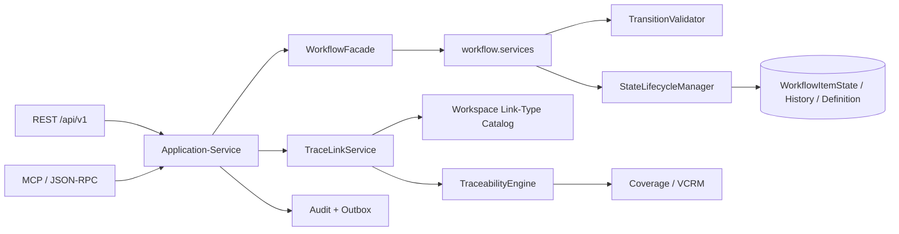

# Systemaudit 2026-09 — Workflow-State-Machines, Requirements und SE-Methodik

## 1. Management-Summary

Der Audit untersucht die Workflow-Engine, ihre öffentlichen Schreibpfade, die State-Machine-Definitionsverwaltung, die Traceability-/V&V-Semantik sowie die formalen SE-Artefakte und deren Statusmarker.

Die zentrale Architektur ist grundsätzlich nachvollziehbar: REST und MCP sollen über den Application-Service auf eine gemeinsame Fachlogik treffen; `WorkflowItemState` ist die fachliche State-Achse, `Artifact.lifecycle_status` die orthogonale Soft-Delete-Achse. Es gibt außerdem konkrete Stärken: atomare Initialisierung, `select_for_update` im Lifecycle-Manager, append-only History auf Anwendungsebene, explizite Cache-Invalidierung nach Global-Definition-Propagation, ein per-Workspace-Linktyp-Katalog und eine fail-closed Cross-Tenant-Prüfung im TraceLinkManager.

Trotzdem ist die freigegebene SE-/DoD-Evidence nicht konsistent genug, um die betroffenen Standardpfade ohne Vorbehalt als konform zu signieren. Der Audit dokumentiert **0 P0, 3 P1 und 9 P2**. Die P1-Befunde betreffen die nachweisbare Lücke zwischen Lock/Version und der fachlichen Validierung, die nicht-atomare und nicht-orphan-gesicherte Global-Definition-Propagation sowie einen Interview-Schreibpfad, der den vorgesehenen Application-/Audit-/Event-Seam umgeht.

Die Traceability- und SE-Dokumentation ist derzeit kein verlässliches Release-Gate: Linktyp-, Baseline- und Suspect-Verträge unterscheiden sich zwischen Requirements, Architektur, Tests, generierter Matrix und aktuellem Code. Mehrere Anforderungen tragen `Covered`, obwohl die zugehörige L3-Anforderung als `Missing` dokumentiert ist; die generierte Matrix ist vom 2026-08-28 und weist ausdrücklich darauf hin, dass sie den Code-Stand nicht prüft.

**Gesamtbewertung:** Workflow-Kern und viele Sicherheits-/Traceability-Bausteine sind vorhanden, aber die Nachweiskette von Anforderung → Implementierung → Test → Review → Status ist derzeit nicht release-reif. Die P1-Punkte sollten vor einer erneuten produktiven Freigabe geschlossen oder durch einen expliziten, datierten Risikoentscheid mit Restrisiko akzeptiert werden.

## 2. Scope, Revision und Methodik

### 2.1 Revision und Abgrenzung

- **Repository:** `C:\Repositories\ai-native-reqflow-POC`
- **Branch:** `feat/1031-bluepencil-host-bridge`
- **Revision:** `66e21f56f36b10e9280e10fed75ee709e5bd7d50`
- **Branch-Guard:** erfüllt; der Branch ist kein `main`/`master`.
- **Änderungsgrenze:** ausschließlich dieser Auditbericht; keine Anwendungsdateien geändert.
- **Nicht im Scope:** allgemeine Code-Qualität, Laufzeit-Performance ohne Testdaten, externe Web-/Cloud-Infrastruktur und die bereits separat auditierte Architektur-/MCP-Domäne.

### 2.2 Vorgehen

1. Workflow-Modelle, Service-Fassaden, Validator, Lifecycle-Manager, REST-Mixin, Provisionierung und Global-Definition-Store statisch gelesen.
2. TraceLink-Katalog, Traceability-Services, Coverage, VCRM, Suspect-Propagation und öffentliche CRUD-/Batch-Pfade statisch gelesen.
3. Requirements, Architektur-, Testmodelle, ADRs, V&V-Strategie, Traceability-Matrix und Test-Coverage-Report gegen den aktuellen Code abgeglichen.
4. Bestehende Workflow-/Traceability-/Interview-Tests als Evidenz inventarisiert; Testausführung nur soweit die lokale Umgebung dies zuließ.
5. historische Auditberichte als Kontext, nicht als aktuelle Tatsache verwendet.

### 2.3 Tatsache, Hypothese und Confidence

- **Tatsache:** direkt aus aktuellem Quelltext, Migration, Test, REST-Route oder Doku belegt.
- **Hypothese:** aus einer Tatsache abgeleitete mögliche Laufzeit-/Governance-Auswirkung; nicht als bereits eingetretener Schaden behauptet.
- **Confidence:** Vertrauen in die Kausalkette, nicht in die Schwere.
- **P0/P1:** nur bei belegbarer aktivem Standardpfad und fehlender Gegenmaßnahme; der Bericht nutzt deshalb konservativ drei P1- und keine P0-Befunde.

### 2.4 Schweregrade

- **P0:** aktueller systemweiter Ausfall oder unmittelbarer schwerwiegender Daten-/Security-Schaden mit belegtem Produktionspfad.
- **P1:** wesentliche Korrektheits-, Audit- oder Verfügbarkeitsauswirkung auf einem aktiven Standardpfad.
- **P2:** materielle Vertrags-, SE-Governance-, Test- oder Zuverlässigkeitslücke mit begrenzter oder indirekter Reichweite.
- **P3:** kleines, lokales Risiko ohne wesentliche aktuelle Auswirkung.

## 3. Ist-Architektur und relevante Verträge



### 3.1 Status- und Lifecycle-Achsen

- `WorkflowItemState.current_state` ist die fachliche Workflow-Achse (`backend/workflow/models.py:186-211`).
- `Artifact.lifecycle_status` ist die orthogonale Soft-Delete-Achse (`backend/persistence/models.py:168-198`).
- `outdate()` und `reactivate()` schreiben die Lifecycle-Achse, ohne den fachlichen Workflow-State zu zerstören (`backend/workflow/services.py:490-660`).
- `WorkflowStateSerializerMixin` projiziert den Status gebündelt und fällt für ungetrackte Typen auf den Initial-State zurück (`backend/rest_api/mixins/workflow_state.py:53-115`).

### 3.2 SE-Kaskade und Statusquellen

- `docs/se/traceability-matrix.md:1-19` kennzeichnet die Matrix als autogeneriert, Stand 2026-08-28.
- `docs/se/traceability-matrix.md:657-666` sagt ausdrücklich, dass der Marker den tatsächlichen Code-Stand nicht prüft.
- `docs/se/test_coverage_report.md:1-7` verwendet überwiegend `Covered`/`Missing`, aber bei vielen Anforderungen `Not Specified` als Verifikationsmethode.
- Die L2-Anforderungen verwenden `Review Findings: ...`, ohne formale `RVW-*`-Review-IDs oder Review-Protokolle.

## 4. Befundübersicht

| ID | Schwere | Status | REQ-/SE-Bezug | Kurzfassung | Confidence |
|---|---:|---|---|---|---|
| WF-001 | P1 | statisch bestätigt | REQ-L2-WE-003 | Öffentliche Transition validiert vor dem Lock; ein zweiter Request kann eine veraltete Kante anwenden. | Hoch |
| WF-002 | P1 | statisch bestätigt | REQ-L2-WE-004, REQ-178, REQ-L1-025 | Global-Definition-Mutationen umgehen Orphan-/Strukturschutz und sind nicht als eine Propagation-Transaktion abgesichert. | Hoch |
| WF-003 | P2 | Vertragsdrift bestätigt | REQ-178, REQ-170, REQ-188 | Provisioning behauptet Legacy-Backfill, repariert bestehende Zeilen aber nicht. | Hoch |
| WF-004 | P1 | statisch bestätigt | REQ-143, REQ-165/167, REQ-L1-011 | Interview-Formalize/Abandon umgehen WorkflowFacade und verschlucken Workflow-/Audit-Fehler. | Hoch |
| TR-001 | P2 | Vertragsdrift bestätigt | REQ-L2-TE-001/002/003 | Öffentliche TraceLink-Update-/Batch-Pfade umgehen Katalog- und Paarvalidierung. | Hoch |
| TR-002 | P2 | Vertragsdrift bestätigt | REQ-L2-TE-002 | Single-Link-Zyklusprüfung ist je Linktyp, Batch-/Integrity-Prüfung global; das ist nicht der dokumentierte Vertrag. | Hoch |
| TR-003 | P2 | Feature-Lücke bestätigt | REQ-L2-TE-013 | `baseline_id` wird im öffentlichen VCRM-Vertrag angenommen, aber explizit abgelehnt. | Hoch |
| TR-004 | P2 | Status-/SE-Drift bestätigt | REQ-L1-043, REQ-L2-TE-016 | Suspect-Propagation ist nur ein Hopp und nur für bestimmte Felder/Modelle; SE-Status bleibt „Not Implemented“. | Hoch |
| SE-001 | P2 | Policy-Risiko bestätigt | REQ-L1-009, REQ-L1-012, V&V §3 | Mandatory-/Evidence-Gates sind bei internen Fehlern absichtlich fail-open. | Hoch |
| SE-002 | P2 | Prozessabweichung bestätigt | SE-Taxonomie/ADR-Standard | ADR- und REQ-Artefakte erfüllen Frontmatter-, Naming- und Review-Lifecycle nicht vollständig. | Hoch |
| SE-003 | P2 | Evidenzdrift bestätigt | REQ-L1-009, REQ-L1-030, REQ-L2-TE-* | Generierte Matrix und Teststatus widersprechen den Anforderungs- und Testdokumenten. | Hoch |
| SE-004 | P2 | Evidenzlücke bestätigt | SE-Review-/V&V-Lifecycle | Keine formale Review-/Traceability-Ablage und keine ausführbaren Nachweise für viele `Covered`-Marker. | Hoch |

**P0:** Kein belegter P0-Befund.

## 5. Detailbefunde

### WF-001 — Öffentliche Transition validiert vor dem Lock

**Schwere:** P1  
**Status:** statisch bestätigt; Laufzeit-Race nicht im Test ausgeführt  
**Confidence:** Hoch für die Codepfade, mittel für die Häufigkeit

#### Tatsache

- Die verbindliche L2-Anforderung verlanget atomare Mutation, append-only History und Optimistic Locking; ein veralteter State muss zu einem Konflikt führen (`docs/se/L1/Gesamtsystem/L2/WorkflowEngineSystem/L2_WorkflowEngineSystem_Requirements.md:99-114`).
- `workflow.services.transition()` liest den State außerhalb der Lock-Sektion (`backend/workflow/services.py:273-282`), validiert diesen Stand (`backend/workflow/services.py:293-316`) und ruft danach `perform_transition()` ohne `expected_version` auf (`backend/workflow/services.py:318-327`).
- `WorkflowFacade.transition()` bietet selbst keinen `expected_version`-Parameter an und reicht keinen an den Engine-Aufruf weiter (`backend/application/workflow_facade.py:63-120`).
- `StateLifecycleManager.perform_transition()` sperrt die State-Zeile zwar mit `select_for_update()` (`backend/workflow/lifecycle_manager.py:295-301`), übernimmt danach aber den bereits gelesenen Request unverändert und validiert die Kante nicht erneut gegen den jetzt gesperrten `previous_state` (`backend/workflow/lifecycle_manager.py:308-341`).
- Der vorhandene Konflikt-Test übergibt `expected_version` nur direkt am Lifecycle-Manager (`backend/workflow/tests/test_lifecycle_manager.py:431-461`); ein Test am öffentlichen Facade-/REST-/MCP-Seam fehlt.

#### Hypothese / Auswirkung

Zwei gleichzeitige Requests können denselben Ausgangsstate lesen und beide die Transition validieren. Request A schreibt zuerst; Request B wartet auf denselben Lock, liest den bereits geänderten State, verwendet aber weiterhin sein ursprüngliches `current_state → target_state`-Paar. Dadurch kann eine im aktuellen Graphen nicht definierte Kante persistiert und als History-Eintrag mit dem neuen Lock-State protokolliert werden. Der Audit-Trail behauptet dann eine gültige Transition, obwohl die fachliche Vorbedingung für den ursprünglichen Request nicht mehr galt.

#### Root Cause

Validierung, Versionsprüfung und Mutation sind nicht als eine atomare fachliche Operation modelliert. Der Lifecycle-Manager schützt die Zeile, aber nicht die fachliche Entscheidung, die vor dem Lock getroffen wurde.

#### Gegenmaßnahme

- Einen öffentlichen Concurrency-Vertrag definieren: `expected_version` vom Client bis zur Lock-Prüfung durchreichen **oder** State/Definition unter demselben Lock erneut lesen und die vollständige Regelvalidierung wiederholen.
- Bei fehlendem `expected_version` die gewünschte Semantik explizit als Last-Writer-Wins dokumentieren und als Abweichung von REQ-L2-WE-003 behandeln; das ist keine stille Option.
- Einen zweifadigen Test am Facade/Application-Service anlegen: zweiRequests mit zwei gültigen konkurrierenden Zielen, exakt ein Erfolg und ein 409; zusätzlich die erzeugte History-Kante prüfen.

#### Alternativen

- Nur ein Thread-/Prozess-Lock ohne fachliche Revalidierung reicht nicht aus.
- Ein globaler Sperr-Key auf `(item_id)` schützt nicht die Versions-/Graphentscheidung und skaliert schlechter.
- Striktes DB-Constraint auf Zielzustände wäre keine ausreichende Ablösung für Rollen- und Precondition-Regeln.

#### Aufwand

M (1–3 Entwicklungstage inkl. öffentlichem Regressionstest).

#### Verifikation / Messplan

- Zwei unabhängige DB-Verbindungen und Threads im Test verwenden.
- Ergebnis: keine Transition von `new_state` zu einem nicht definierten Ziel; bei Versionskonflikt deterministisch HTTP 409; History enthält nur tatsächlich akzeptierte Kanten.

### WF-002 — Global-Workflow-Mutationen umgehen Migrationsschutz und sind nicht atomar

**Schwere:** P1  
**Status:** statisch bestätigt  
**Confidence:** Hoch

#### Tatsache

- Die Workflow-Anforderungen verlangen vor Definitionsänderungen einen Orphan-State-Check und bei Preset-Downgrades eine Blockade (`docs/se/L1/Gesamtsystem/L2/WorkflowEngineSystem/L2_WorkflowEngineSystem_Requirements.md:125-145` und `docs/se/L1/Gesamtsystem/L2/WorkflowEngineSystem/L2_WorkflowEngineSystem_Requirements.md:199-220`).
- Der Global-Store schreibt das Global zuerst und propagiert danach per `QuerySet.update()` (`backend/workflow/global_definition_store.py:126-166`), ohne die gesamte Operation in `transaction.atomic()` zu kapseln.
- `delete_state()` prüft nur, ob Transitionen auf den State verweisen (`backend/workflow/global_definition_store.py:204-220`); es wird nicht geprüft, ob in nicht-customized Workspaces noch Items in diesem State stehen.
- `add_state()`, `rename_state()`, `add_transition()`, `update_transition()` und `delete_transition()` umgehen den strukturellen Workspace-Validator `WorkflowDefinitionStore.validate_and_persist_custom()` (`backend/workflow/global_definition_store.py:168-317`; Workspace-Validierung in `backend/workflow/definition_store.py:1251-1351`).
- Die produktiv erreichbare Admin-Route ruft diese Mutationen direkt auf (`backend/rest_api/global_default_views.py:233-328` und `backend/rest_api/global_default_views.py:331-449`).
- Der vorhandene Regressionstest prüft Cache-Invalidierung und Propagationsanzahl, aber weder Live-Item-Orphans noch atomaren Rollback (`backend/workflow/tests/test_global_definition_store_cache_invalidation.py:43-100`).

#### Hypothese / Auswirkung

Ein Tenant-Admin kann einen State mit aktiven Items aus einem globalen Default entfernen. Die Änderung wird in alle `is_customized=False`-Workspaces kopiert, sodass die Items in einem nicht mehr gültigen State verbleiben. Tritt während der Broadcast-Propagation ein Datenbankfehler auf, kann das Global-Objekt bereits gespeichert sein, während nur ein Teil der abgeleiteten Workspaces aktualisiert wurde. Beides widerspricht der zugesagten Source-of-Truth- und ACID-Semantik.

#### Root Cause

Der Global-Store wurde als paralleler Schreibpfad umgesetzt, nicht als Transaktion/Validierungsvariante des Workspace-Definition-Stores. Die Kommentare „no live WorkflowItemState rows for a global“ schließen die geerbten Live-Zeilen der abgeleiteten Workspaces nicht aus.

#### Gegenmaßnahme

- Eine zentrale Mutation für Workspace- und Global-Definitionen mit einem expliziten Sicherheitsvertrag verwenden.
- Vor jeder State-Entfernung/Rename-/Graphänderung alle betroffenen abgeleiteten Workspaces und Items prüfen; bei Orphans/Downgrade-Inkompatibilität atomar ablehnen.
- Global-Update, Propagation, Cache-Invalidierung und Audit in eine Transaktion bzw. einen nachweisbar atomaren Outbox-/Compensation-Fluss aufnehmen.
- Einen Test mit einem Item in einem nicht-customized Workspace, globalem State-Delete und injiziertem Propagation-Fehler aufnehmen.

#### Alternativen

- Global-Definitionen nur als immutable Versionen mit explizitem Publish-Schritt verwalten.
- Einen asynchronen Propagation-Queue-Eintrag verwenden, aber bis zur vollständigen Übertragung einen `pending`-Status und blockierte Transitions erzwingen.

#### Aufwand

L (3–5 Tage inkl. Admin-API-, Datenbank- und Regressionstests).

#### Verifikation / Messplan

- Vorher/Nachher-Zählung der Items in entfernten States.
- Fault Injection in der zweiten Workspace-Zeile; erwartet wird entweder kein Global-Update oder ein vollständiger Rollback.
- Nachweis, dass kein `WorkflowItemState.current_state` außerhalb des aktiven Graphen liegt.

### WF-003 — Provisioning verspricht Backfill, repariert bestehende Legacy-Zeilen aber nicht

**Schwere:** P2  
**Status:** Vertragsdrift bestätigt  
**Confidence:** Hoch

#### Tatsache

- Der Management-Command behauptet, er backfille Global-Defaults und `source_global`-Links für Legacy-Workspaces (`backend/workflow/management/commands/provision_workflow_definitions.py:10-15`).
- Der Code überspringt jede bereits vorhandene Workspace-Definition (`backend/workflow/management/commands/provision_workflow_definitions.py:94-100`).
- `create_workspace_default_workflow()` setzt `source_global` und verwandelte Defaults nur in den `defaults` eines `get_or_create()`-Aufrufs; ein bestehender Datensatz wird dadurch nicht repariert (`backend/workflow/definition_store.py:1180-1206`).
- Die historische Migration 0009 kann nur Datensätze reparieren, die zum Migrationszeitpunkt existierten (`backend/workflow/migrations/0009_backfill_global_workflow_defaults.py:61-100`); später hinzugekommene oder unvollständig erzeugte Zeilen bleiben unberührt.
- REQ-170 dokumentiert genau diesen Legacy-Backfill als offene Anforderung (`docs/REQUIREMENTS.md:237`).

#### Hypothese / Auswirkung

Ein Workspace, dessen Definition vor dem Global-Default-Modell angelegt wurde oder dessen Initialisierung später übersprungen wurde, bleibt dauerhaft ohne `source_global`/`is_customized`-Vertrag. Reset-to-default und Propagation greifen für diese Zeile nicht wie dokumentiert; ein manueller Command-Lauf meldet den Zustand nicht als repariert.

#### Root Cause

Idempotentes Erzeugen und explizite Reparatur bestehender Datensätze werden im selben `get_or_create()`-Pfad vermischt.

#### Gegenmaßnahme

- Provisioning und Reparatur trennen: Create-only für fehlende Zeilen, Repair-/Verify-Modus für bestehende Legacy-Zeilen.
- Vor/nach dem Lauf eine maschinenlesbare Liste nicht reparierter Workspaces ausgeben.
- REQ-170 entweder mit einem getesteten Backfill schließen oder die Command-Dokumentation und der globale Vertrag auf „create missing only“ korrigieren.

#### Alternativen

- Eine einmalige, separate Migration mit Vorher-/Nachher-Report ist für bekannte Altbestände robuster.
- Lazy-Repair beim ersten Workspace-Zugriff kann ergänzt werden, darf aber nicht die einzige Quelle der Wahrheit sein.

#### Aufwand

S–M (1–2 Tage inkl. Fixture und Command-Test).

#### Verifikation / Messplan

Vorher: zwei Workspaces, ein Legacy ohne `source_global`, einer vollständig. Nachher: Link-/Customized-Status beider und ein absichtlich nicht vorhandener Typ; Report muss jeden Fall explizit ausweisen.

### WF-004 — Interview-Schreibpfade umgehen WorkflowFacade und verschlucken Fehler

**Schwere:** P1  
**Status:** statisch bestätigt  
**Confidence:** Hoch

#### Tatsache

- Die L1-Architektur definiert den Application-Service als einzigen legitimen Zugriffspunkt für REST/MCP und als Orchestrator für Audit/Outbox (`docs/se/L1/Gesamtsystem/L1_Gesamtsystem_Architecture.md:143-162`).
- `InterviewService._formalize_single()` ruft `workflow.services.transition()` direkt auf (`backend/application/interview_service.py:1092-1102`).
- `_formalize_multi()` und `abandon()` verwenden denselben direkten Aufruf (`backend/application/interview_service.py:1250-1260` und `backend/application/interview_service.py:1316-1326`).
- Alle drei Pfade fangen `Exception` und setzen danach nur einen In-Memory-Status bzw. eine lokale Version (`backend/application/interview_service.py:1113-1129`, `backend/application/interview_service.py:1261-1268`, `backend/application/interview_service.py:1336-1349`).
- Der Audit-/Event-Seam liegt dagegen in `WorkflowFacade.transition()` (`backend/application/workflow_facade.py:124-155`); die direkten Aufrufe erzeugen diesen fachlichen Audit-/WorkflowTransitioned-Seam nicht.
- Die Interview-Tests prüfen State und History (`backend/application/tests/test_interview_service.py:1117-1160`), aber nicht den verpflichtenden Application-Audit-/Outbox-Nachweis für diese drei Pfade.

#### Hypothese / Auswirkung

Eine erfolgreiche Interview-Transition kann ohne den vorgesehenen `AuditEntry`-/`WorkflowTransitioned`-Eintrag persistiert werden. Schlägt der Engine-Aufruf fehl, kann die Methode dem Client trotzdem `completed`/`abandoned` zurückgeben, während nur ein flüchtiger In-Memory-Status existiert. Damit sind Audit-Vollständigkeit und die Zustandsquelle nicht mehr dieselbe Wahrheit.

#### Root Cause

Ein Best-Effort-Fallback für Legacy-Sessions wurde direkt in den Interview-Use-Case gelegt, ohne einen expliziten System-Actor-Pfad, Fehlerklassifizierung oder transaktionale Audit-Entscheidung.

#### Gegenmaßnahme

- Alle Interview-Transitions über `WorkflowFacade.transition()` führen und dort Audit/Event/Transaktion atomar bündeln.
- Fehlende Definition/State als expliziten, klassifizierten Systemfall behandeln; kein breites `except Exception` mit Erfolgsantwort.
- Für System-Auto-Transitions (`force_transition`) einen expliziten Actor-/Operationstyp und eigene Audit-Entscheidung definieren.
- Einen Test ergänzen, der bei Engine-Fehler keine `completed`-Antwort und keinen unprotokollierten Erfolgszustand zulässt.

#### Alternativen

- Einen separaten `SystemWorkflowTransition`-Service mit eigener Auditoperation ist zulässig, sofern der Application-/Outbox-Seam erhalten bleibt.
- Retry/Outbox für Interviewabschlüsse ist sinnvoll, aber kein Ersatz für den synchronen State-/Audit-Vertrag.

#### Aufwand

M (2–4 Tage inkl. Fehlerklassifizierung und Integrationstest).

#### Verifikation / Messplan

- Erfolgreiche Single-/Multi-/Abandon-Transition erzeugen jeweils History, AuditEntry und Outbox-Event mit derselben Korrelation.
- Fehlende Definition, fehlender State und absichtlich ausgelöster Engine-Fehler liefern kontrollierte Fehlerantworten und keine nur flüchtige Statusänderung.

### TR-001 — TraceLink-Update- und Batch-Pfade umgehen den Workspace-Katalog

**Schwere:** P2  
**Status:** Vertragsdrift bestätigt  
**Confidence:** Hoch

#### Tatsache

- Die autorisierte Quelle definiert elf Built-ins und sagt ausdrücklich, dass `link_types.catalog` die Validierungsautorität ist (`backend/traceability/types.py:20-37`; `backend/link_types/builtin.py:1-27`).
- `TraceLinkManager.update()` prüft nur, ob der neue String im globalen Enum-Set liegt; Endpoint-Paar, `manual_creatable`, `system_owned` und Workspace-Catalog werden nicht geprüft (`backend/traceability/trace_link_manager.py:463-480`).
- `batch_create()` führt ebenfalls keine `link_types.catalog.validate_link_pair()`-Prüfung aus (`backend/traceability/trace_link_manager.py:492-540`).
- Der öffentliche Service-Test ändert einen `allocated-to`-Link auf `decomposes`, ohne Endpoint-/Katalogprüfung (`backend/traceability/tests/test_services_facade.py:55-63`; ebenso `backend/traceability/tests/test_trace_link_manager.py:131-138`).
- Der Application-Service prüft den Katalog nur in `create_trace_link()` (`backend/application/trace_link_service.py:273-347` und `backend/application/trace_link_service.py:378-440`); für den öffentlichen Update-/Batch-Service existiert keine entsprechende Application-Fassade.
- REST lehnt PATCH auf TraceLinks explizit ab (`backend/rest_api/views.py:3160-3165`), während die Layer-1-Services weiterhin CRUD als öffentliche Verträge dokumentieren (`backend/traceability/services.py:300-347`).

#### Hypothese / Auswirkung

Ein interner Seed-/Migrations-/MCP-/REST-Follow-up-Pfad, der den öffentlichen Layer-1-Service verwendet, kann eine im Workspace deaktivierte oder für die Endpunkte unzulässige Kante erzeugen bzw. eine bestehende Kante in eine unzulässige Semantik umdeuten. Acceptance Tests können damit eine CRUD-Funktion als grün bewerten, obwohl der aktive Katalog sie ablehnen würde.

#### Root Cause

Historische CRUD- und Katalogverträge wurden nicht in einer gemeinsamen, versionierten Write-Fassade zusammengeführt. Die Tests dokumentieren noch den alten Vertrag statt den katalogbasierten.

#### Gegenmaßnahme

- Einen einzigen autoritativen Write-Pfad mit `create/update/batch_create` festlegen und die direkte Manager-API als intern kennzeichnen.
- Für jede Schreiboperation Catalog-Version, Endpoint-Paar, Manual/System-Owned-Flag und Cycle-Policy prüfen.
- Die Testmatrix auf 11 Katalogtypen und Workspace-Overrides aktualisieren; veraltete „8 Typen“-Tests als bewusst historical markieren oder ersetzen.

#### Alternativen

- TraceLink-Update vollständig entfernen und nur Delete+Create erlauben; das reduziert die API, beseitigt aber den Vertragsdrift nicht automatisch.
- Einen Datenbank-Trigger als zusätzliche Defense-in-Depth verwenden, nicht als Ersatz für die Application-Validierung.

#### Aufwand

M.

#### Verifikation / Messplan

Negativ- und Positivtests für deaktivierten Typ, `diagram-ref`, unzulässiges Paar, Tenant-/Workspace-Fence und Batch-Update. Erwartung: jeder öffentliche Write-Pfad liefert dieselbe Fehlerklasse und dieselbe Katalogentscheidung.

### TR-002 — Zyklusprüfung ist zwischen Single-, Batch- und Integrity-Pfad inkonsistent

**Schwere:** P2  
**Status:** Vertragsdrift bestätigt  
**Confidence:** Hoch

#### Tatsache

- REQ-L2-TE-002 verlangt eine Zyklenprüfung über alle sechs damals dokumentierten transitiven Linktypen (`docs/se/L1/Gesamtsystem/L2/TraceabilityEngineSystem/L2_TraceabilityEngineSystem_Requirements.md:60-75`).
- `TraceLinkManager.create()` prüft den Single-Link-Pfad nur über Edges desselben `link_type` und ergänzt lediglich die vereinheitlichte Hierarchie (`backend/traceability/trace_link_manager.py:340-377`).
- `batch_create()` und `validate_graph_integrity()` verwenden dagegen alle Edges ohne Linktyp-Trennung (`backend/traceability/trace_link_manager.py:542-583`).
- Die vorhandenen Zyklentests prüfen nur Same-Type-Fälle (`backend/traceability/tests/test_trace_link_manager.py:211-263`); ein Cross-Type-Fall ist nicht als Entscheidung dokumentiert.

#### Hypothese / Auswirkung

Zwei Requests mit unterschiedlichen Linktypen können im Single-Pfad einen Zyklus erzeugen, den der Batch-/Integrity-Pfad als Zyklus melden. Query-Funktionen benötigen eigene Cycle-Guards, und Coverage-/Impact-Berichte erhalten dadurch graphenabhängig unterschiedliche Ergebnisse. Die SE-Anforderung „globale Zyklenfreiheit“ ist damit nicht präzise oder nicht erfüllt.

#### Root Cause

Die Implementierung behandeltRelationstypen als fachlich getrennte Graphen, während die Anforderung einen gemeinsamen transitiven Graphen beschreibt. Die Entscheidung wurde nur im Codekommentar getroffen und nicht in Requirement/ADR/Testvertrag nachgezogen.

#### Gegenmaßnahme

- Entweder den globalen Zyklusvertrag für alle unterstützten Typen implementieren und die Single-Prüfung entsprechend ausrichten,
- oder die Requirement/Architektur/ADR explizit in getrennte Cycle-Domänen mit erlaubten Ausnahmen zerlegen und dies im Katalog/Tests dokumentieren.
- Für beide Varianten Cross-Type-Tests und ein Consistency-Gate zwischen Single, Batch und `validate_graph_integrity()` ergänzen.

#### Alternativen

- Zykluserkennung je Linktyp beibehalten und Cycle-Semantik als fachliche Domäne im Katalog modellieren; das ist nur zulässig, wenn die Anforderung entsprechend geändert wird.
- Nur den Integrity-Report nachträglich reparieren ist nicht ausreichend, wenn illegale Einzeltransaktionen persistiert werden.

#### Aufwand

M.

#### Verifikation / Messplan

Gleiche Kantenmenge in Single- und Batch-Aufruf vergleichen; Ergebnis muss identisch sein oder die beabsichtigte Ausnahme explizit im Katalog sichtbar machen.

### TR-003 — VCRM akzeptiert `baseline_id`, liefert aber keinen Baseline-Snapshot

**Schwere:** P2  
**Status:** Feature-Lücke bestätigt  
**Confidence:** Hoch

#### Tatsache

- REQ-L2-TE-013 verlangt Baseline-Filterbarkeit und einen Snapshot-Zustand bei `baseline_id` (`docs/se/L1/Gesamtsystem/L2/TraceabilityEngineSystem/L2_TraceabilityEngineSystem_Requirements.md:352-376`).
- `VCRMReportGenerator.generate_vcrm()` nimmt `baseline_id` an und reicht es weiter (`backend/traceability/vcrm_report_generator.py:65-90`).
- `CoverageCalculator.get_coverage_data()` lehnt jeden Nicht-`None`-Wert ausdrücklich mit `BaselineCoverageNotSupportedError` ab (`backend/traceability/coverage_calculator.py:216-262`).
- Der öffentliche Cache-/Facade-Vertrag behält `baseline_id` ebenfalls bei (`backend/traceability/services.py:354-375`).
- Der Regressionstest pinnt ausdrücklich die Ablehnung, nicht die geforderte Baseline-Funktion (`backend/traceability/tests/test_coverage_calculator.py:491-534`).
- Die generierte Matrix führt REQ-L2-TE-013 dennoch als `Implemented`/`Covered` (`docs/se/traceability-matrix.md:582-600`).

#### Hypothese / Auswirkung

Ein Consumer kann einen gültigen API-Aufruf mit Baseline auslösen und erhält entweder einen expliziten Fehler oder — bei unsicherer Wrapper-Nutzung — Live-Daten. Ein V&amp;V-Bericht kann damit nicht als reproduzierbarer Snapshot-Zeitpunkt interpretiert werden. Der Status `Covered` überzeichnet den tatsächlichen Funktionsumfang.

#### Root Cause

Der Parameter wurde als API-Kompatibilitäts-/Vollständigkeitsfeld erhalten, obwohl die benötigte Delta-/Snapshot-Datenbasis nicht für alle Scopes gemeinsam verfügbar ist; die bewusst gewählte Ablehnung wurde nicht in die SE-Statuskette zurückgeschrieben.

#### Gegenmaßnahme

- Entweder die Snapshot-Quelle für VCRM vervollständigen und mit einem echten historischen Fixture testen,
- oder `baseline_id` aus dem akzeptierten Vertrag entfernen, einen separaten `baseline_unsupported`-Status liefern und REQ/Matrix/Teststatus konsequent auf `Partial`/`Missing` setzen.
- Cache-Key, API-Schema und Fehlermapping müssen denselben Vertrag ausdrücken.

#### Alternativen

- Nur einen expliziten `live`-Modus anbieten und Snapshot-Requests ablehnen; das ist ehrlicher als ein stiller Live-Fallback.
- Einen externen, unveränderlichen Baseline-Export als VCRM-Eingang verwenden, wenn die zentrale Delta-Index-Abdeckung nicht rechtzeitig erweitert werden kann.

#### Aufwand

L.

#### Verifikation / Messplan

Zwei zeitlich getrennte Datenstände mit demselben Workspace/Requirement; VCRM-Ausgabe, Cache und HTTP-Fehler müssen eindeutig dem gewählten Baseline- oder Live-Vertrag entsprechen.

### TR-004 — Suspect-Propagation ist nur ein Hopp und Statusmarker bleiben veraltet

**Schwere:** P2  
**Status:** Teilimplementierung plus SE-Drift bestätigt  
**Confidence:** Hoch

#### Tatsache

- REQ-L2-TE-016 fordert ein Event-getriebenes Modell für direkte und transitive Propagation, Suspect-Persistenz und eine Bestätigungs-API (`docs/se/L1/Gesamtsystem/L2/TraceabilityEngineSystem/L2_TraceabilityEngineSystem_Requirements.md:478-506`).
- `TraceLinkService.propagate_suspect_status()` dokumentiert und implementiert ausdrücklich „One hop only“ (`backend/application/trace_link_service.py:1326-1360`).
- Die Änderung wird nur bei `title` oder `description` im `RequirementService` ausgelöst (`backend/application/requirement_service.py:496-562`), nicht für jede fachliche Änderung und nicht für alle betroffenen Artefakttypen.
- Nur `Requirement`, `ArchitectureElement` und `TestCase` werden als flagbare Endmodelle aktualisiert; andere Artefakttypen werden laut Code ausdrücklich übersprungen (`backend/application/trace_link_service.py:1444-1463`).
- Der Test pinnt den Ein-Hop-Grenzfall als gewünschtes Verhalten (`backend/application/tests/test_suspect_propagation.py:173-190`).
- Gleichzeitig bleiben REQ-L1-043, REQ-L2-TE-016 und die generierte Matrix auf `Not Implemented` (`docs/se/L1/Gesamtsystem/L1_Gesamtsystem_Requirements.md:1480-1495`; `docs/se/traceability-matrix.md:141-145` und `docs/se/traceability-matrix.md:601-606`).

#### Hypothese / Auswirkung

Eine Änderung am Wurzelartefakt kann nur den direkten Nachbarn markieren; transitive Nachfolger bleiben trotz REQ-Text unmarkiert. Änderungen an Feldern außerhalb von Titel/Beschreibung lösen überhaupt keine Propagation aus. Reviewer können daher einen `Covered`- oder Compliance-Bericht nicht von einer vollständigen Suspect-Kette ableiten.

#### Root Cause

Ein späterer One-Hop-Entwurf wurde als Implementierungsentscheidung getroffen, aber nicht in die normative Anforderung, ADR-/Lifecycle-Status und Teststrategie zurückgespielt.

#### Gegenmaßnahme

- Normative Entscheidung explizit treffen: transitive Event-Propagation oder bewusste Ein-Hop-Semantik.
- Bei Ein-Hop die Anforderung, UI/API, Audit- und Matrix-Status entsprechend ändern und die Reichweite sichtbar machen.
- Bei vollständiger Umsetzung einen End-to-End-Test über mindestens drei Ebenen, alle relevanten Change-Felder und die Bestätigungs-/Audit-API ergänzen.

#### Alternativen

- Queue-basierte transitive Propagation mit Zyklus-/Tieffenschutz und idempotentem Event-Konsum.
- Ein-Hop als explizite Profiloption, aber nicht stillschweigend als vollständige REQ-Erfüllung.

#### Aufwand

M–L.

#### Verifikation / Messplan

Ein Wurzeldokument mit Kette `A→B→C`; alle erwarteten Nachfolger und `suspect_flagged_at`-Provenance prüfen. Danach denselben Test für Titel-, Nicht-Titel- und Cross-Tier-Felder ausführen.

### SE-001 — SE-Preconditions sind bei internen Fehlern fail-open

**Schwere:** P2  
**Status:** Policy-Risiko bestätigt  
**Confidence:** Hoch

#### Tatsache

- Die V&V-Strategie definiert `Covered`, `Passed` und `Failed` aus TraceLinks und aktuellen TestRuns (`docs/se/V_AND_V_STRATEGY.md:19-29`).
- `backend/workflow/precondition_rules.py` dokumentiert ausdrücklich, dass unbekannte Typen, Preset-Lookup-Fehler, unauflösbare Rows und Datenbankfehler fail-open behandelt werden (`backend/workflow/precondition_rules.py:52-60`).
- Die konkreten Pfade geben bei Preset-/Entity-/Schema-/Datenbankfehlern `None` zurück (`backend/workflow/precondition_rules.py:276-325`, `backend/workflow/precondition_rules.py:410-463`, `backend/workflow/precondition_rules.py:528-610`).
- `TransitionValidator` interpretiert `None` als „keine Verletzung“ und fährt mit der Transition fort (`backend/workflow/transition_validator.py:383-424`).
- Die ältere Test-Quality-Auditnotiz nennt dieselbe Lücke zwischen Konfiguration und Enforcement (`docs/se/reports/test_quality_audit_report.md:50-52`).

#### Hypothese / Auswirkung

Ein temporärer Preset-/DB-/Definitionsfehler kann eine Approval- oder `implemented → verified`-Transition durchlassen, obwohl Pflichtfelder oder Testevidence nicht verifiziert wurden. Der Fehler wird geloggt, aber nicht als blockierender Workflowfehler sichtbar; ein regulatorischer Nachweis kann dadurch unvollständig sein.

#### Root Cause

Verfügbarkeit und Fail-closed-Sicherheit wurden für gemeinsame Infrastruktur zugunsten der Ausführbarkeit priorisiert, ohne einen separaten, risikobasierten Vertrag für sicherheitskritische Approval-Gates.

#### Gegenmaßnahme

- Fail-open nur für nicht-sicherheitskritische Lesepfade zulassen; Approval, Signatur und `verified` müssen bei nicht bewertbarer Evidenz blockieren oder in einen expliziten `pending_review`-Zustand führen.
- Fehlerklassifizierung, Retry/Alerting und Audit-Eintrag definieren.
- Eine Risikoentscheidung mit Restrisiko, Messgrenzen und Verantwortlichem dokumentieren, falls Fail-open bewusst beibehalten wird.

#### Alternativen

- Outbox-/Retry-Blockade bis zur erneuten Prüfung.
- Temporärer `verification_pending`-State mit sichtbarem Review-Zustand und keiner `verified`-Behauptung.

#### Aufwand

M.

#### Verifikation / Messplan

Preset-Ausfall, DB-Timeout, fehlende TestDefinition und transienter Schema-Fehler; Erwartung: kein unkontrollierter `verified`-/`approved`-Zustand, sondern deterministischer Fehler/Pending-Status und messbarer Alarm.

### SE-002 — SE-Taxonomie und ADR-Lifecycle sind nicht vollständig angewendet

**Schwere:** P2  
**Status:** Prozessabweichung bestätigt  
**Confidence:** Hoch

#### Tatsache

- Das ADR-Schema verlangt YAML-Frontmatter, `ADR-NNN`, Status, Datum, Deciders und `affected_reqs` (`.agent-meta/schemas/se-adr.schema.json:4-48`).
- ADR-001 bis ADR-003 beginnen mit H1 und Bold-Metadaten statt mit dem geforderten Frontmatter (`docs/se/ADR/ADR-001_Sandbox-Mechanismus.md:1-9`; `docs/se/ADR/ADR-002_Event-Bus.md:1-9`; `docs/se/ADR/ADR-003_Glossar-Storage.md:1-9`).
- ADR-DS-02 verwendet ebenfalls kein Frontmatter und einen nicht monotonen `ADR-DS-02`-Namen (`docs/se/ADR/ADR-DS-02_DiagramNodeGraphPositionPersistence.md:1-8`).
- ADR-004 ist ein positives Gegenbeispiel mit vollständigem Frontmatter (`docs/se/ADR/ADR-004_traeger_modell_und_auc.md:1-8`).
- Die Workflow-REQ-Datei enthält vor dem eigentlichen Anforderungsblock `Traceability` und `Externe Schnittstellen` sowie anschließend mehrere Matrix-/Summary-Abschnitte (`docs/se/L1/Gesamtsystem/L2/WorkflowEngineSystem/L2_WorkflowEngineSystem_Requirements.md:1-20`, `docs/se/L1/Gesamtsystem/L2/WorkflowEngineSystem/L2_WorkflowEngineSystem_Requirements.md:275-322`).
- Die Traceability-REQ-Datei enthält zusätzlich Erweiterungsblöcke und Master-Matrizen (`docs/se/L1/Gesamtsystem/L2/TraceabilityEngineSystem/L2_TraceabilityEngineSystem_Requirements.md:431-468`, `docs/se/L1/Gesamtsystem/L2/TraceabilityEngineSystem/L2_TraceabilityEngineSystem_Requirements.md:472-546`, `docs/se/L1/Gesamtsystem/L2/TraceabilityEngineSystem/L2_TraceabilityEngineSystem_Requirements.md:609-633`).
- Im SE-Baum liegen `*.critic.iter-1.md`/`*.critic.final.md`-Zwischenartefakte (`docs/se/L1/Gesamtsystem/L2_architectural_decomposition.critic.iter-1.md`, `docs/se/L1/Gesamtsystem/L2_architectural_decomposition.critic.final.md`); `docs/se/reviews/` und `docs/se/traceability/` wurden nicht als formale Ablage gefunden.

#### Hypothese / Auswirkung

Ein Review- oder Release-Tool kann ADRs, Requirements und Reviewabschlüsse nicht zuverlässig über Schema, ID und `review_id` verknüpfen. Historische und finale Artefakte bleiben nebeneinander sichtbar; die formale Quelle der Wahrheit ist nicht eindeutig.

#### Root Cause

Historische, vor dem SE-Taxonomy-Standard erzeugte Artefakte wurden nicht migriert; die Prozessregeln existieren, werden aber nicht als verpflichtendes CI-Gate auf dem gesamten SE-Baum angewendet.

#### Gegenmaßnahme

- Bestehende ADRs in ein migrationsfähiges Format überführen oder explizit als Legacy kennzeichnen.
- REQ-Dateien auf die erlaubte L2-Struktur reduzieren; Traceability-/Matrix-Inhalte in `SE/traceability/` bzw. dedizierte Trace-Dokumente verschieben.
- Formale Review-Protokolle mit `RVW-YYYY-MM-DD-NNN` und `review_id` anlegen und die `reviewed/approved`-Marker darüber referenzieren.
- Einen CI-Check für Frontmatter, Dateinamen, offene ADRs und verbotene Intermediate-Final-Kopien ausführen.

#### Alternativen

- Legacy-Dokumente read-only markieren und neue kanonische Dokumente parallel führen; nur mit explizitem `supersedes`-/`legacy`-Verweis.
- Review- und Traceability-Ablage zentral in einem separaten Repository; Cross-References müssen dann stabil sein.

#### Aufwand

L.

#### Verifikation / Messplan

Schema-Validierung über alle ADR-/REQ-Dateien, Suche nach `review_state: reviewed|approved` ohne `review_id`, Matrix-Existenzprüfung und Indexcheck auf verbotene `*.iter-*`/`*.critic.final*`-Dateien.

### SE-003 — Generierte Traceability-Matrix und Teststatus widersprechen den Quellen

**Schwere:** P2  
**Status:** Evidenzdrift bestätigt  
**Confidence:** Hoch

#### Tatsache

- Die Matrix ist autogeneriert und vom 2026-08-28; sie warnt selbst davor, dass Marker nicht gegen den Code geprüft werden (`docs/se/traceability-matrix.md:1-19`, `docs/se/traceability-matrix.md:657-666`).
- Die Matrix führt REQ-L1-030 als `Implemented` (`docs/se/traceability-matrix.md:127-129`), markiert die zugehörigen REQ-L2-TE-014/015 aber als `Not Implemented`/`Untested` (`docs/se/traceability-matrix.md:601-602`).
- REQ-L2-TE-019 ist in der Matrix `Not Implemented` (`docs/se/traceability-matrix.md:606`), obwohl `backend/traceability/service.py` ein Read-Modell mit rekursiven CTEs für Impact, Path und Cycle Detection implementiert (`backend/traceability/service.py:1-24`, `backend/traceability/service.py:219-340`, `backend/traceability/service.py:347-489`).
- Die L3-Workflow-Anforderung zum 10-ms-Validierungsbudget ist ausdrücklich `Missing` (`docs/se/L1/Gesamtsystem/L2/WorkflowEngineSystem/Components/COMP-WE-002_TransitionValidator/L3_COMP-WE-002_Requirements.md:86-101`), während die Matrix REQ-L2-WE-008 als `Covered` führt (`docs/se/traceability-matrix.md:626-634`).
- `docs/se/test_coverage_report.md:316-337` markiert den Performance-Test ebenfalls als `Missing`; bei den Traceability-REQs werden REQ-L2-TE-014–018 als `Missing`/`Untested` geführt (`docs/se/test_coverage_report.md:472-489`).
- Gleichzeitig enthält die Testabdeckung viele `Covered`-Zeilen mit `Not Specified` als Methode (`docs/se/test_coverage_report.md:7-81`).

#### Hypothese / Auswirkung

Ein Release- oder Review-Entscheid auf Basis der Matrix kann eine nicht ausgeführte, nicht implementierte oder widersprüchliche Fähigkeit als abgedeckt behandeln. Die Matrix ist derzeit Dokumentations-Drift, kein DoD-Gate.

#### Root Cause

Generator und Statusmarker wurden historisch getrennt weiterentwickelt; es gibt keinen Konsistenzcheck zwischen Requirement-Marker, Testmodell, Test-Coverage-Report, Matrix und tatsächlichem Testlauf.

#### Gegenmaßnahme

- Kanonische Statusquelle definieren und Matrix nur daraus generieren.
- Vor jeder Generierung Widersprüche zwischen `Implementation State`, `Test Status`, tatsächlichem Testlauf und Reviewprotokoll als Fehler ausgeben.
- historische Matrix versionieren und mit aktuellem Generationsstand sowie Commit-Hash versehen.
- Coverage nur nach ausführbarem Testnachweis auf `Covered` setzen; Performance- und Cross-Project-Fälle explizit `Missing`/`Untested` belassen, bis sie laufen.

#### Alternativen

- Ein JSON-/YAML-Statusmanifest als einzige Quelle verwenden und Markdown-Matrizen daraus rendern.
- Manuell gepflegte Marker für Übergangszeit, aber mit automatischem Drift-Alarm.

#### Aufwand

M.

#### Verifikation / Messplan

Generator gegen einen Fixture-Datensatz mit mindestens einem absichtlich widersprüchlichen Marker laufen lassen; erwartet wird ein harter Fehler, kein stilles Weiterkopieren.

### SE-004 — Formale Review- und V&V-Nachweise fehlen für viele `Covered`-Marker

**Schwere:** P2  
**Status:** Evidenzlücke bestätigt  
**Confidence:** Hoch

#### Tatsache

- Die Workflow- und Traceability-REQ-Dateien tragen Review-Aussagen und Teststatus, aber keine formale `review_id` oder ein Review-Protokoll (`docs/se/L1/Gesamtsystem/L2/WorkflowEngineSystem/L2_WorkflowEngineSystem_Requirements.md:43-46`; `docs/se/L1/Gesamtsystem/L2/TraceabilityEngineSystem/L2_TraceabilityEngineSystem_Requirements.md:36-39`).
- Der vorhandene Test-Quality-Bericht dokumentiert historische „Shallow Testing“- und Mocking-Lücken, ist aber selbst kein REQ-gebundener Abschlussnachweis (`docs/se/reports/test_quality_audit_report.md:7-18`).
- Die Teststrategie listet nominale Testfälle, darunter Workflow-Konkurrenz und Traceability-Performance (`docs/se/strategy/test-strategy.md:216-239` und `docs/se/strategy/test-strategy.md:260-285`), weist aber keinen aktuellen Ausführungsstatus, Testlauf-Hash oder Coverage-Beleg aus.
- `docs/se/test_coverage_report.md` verwendet bei zahlreichen Anforderungen `Not Specified` als Verifikationsmethode (`docs/se/test_coverage_report.md:7-81`).
- Die separate L1-Validation-Dokumentation zu Canvas/Mermaid ist auf einen anderen Scope und eine alte Iteration begrenzt (`docs/se/L1/Gesamtsystem/validation/L1_Gesamtsystem_Validation.md:10-43`); sie ist kein Ersatz für Review-Protokolle der Workflow-/Traceability-REQs.
- Unter `docs/se/reviews/` und `docs/se/traceability/` wurde keine formale Ablage gefunden.

#### Hypothese / Auswirkung

Ein `Covered`-Marker kann nicht nachvollziehbar auf eine ausgeführte, akzeptierte und versionierte Prüfung zurückgeführt werden. Bei Review, Release oder Compliance wird der Marker als Evidenz verwendet, obwohl der zugrunde liegende Test- oder Reviewabschluss fehlt.

#### Root Cause

Teststatus und Reviewstatus wurden als Dokumentationsfelder ohne verpflichtende `review_id`-/Testlauf-Referenz und ohne CI-Prüfung geführt.

#### Gegenmaßnahme

- Für jede Anforderung mit `review_state: reviewed|approved` ein formales Protokoll und eine `review_id` anlegen.
- Testausführung, Umgebung, Commit/Revision, Ergebnis und Abweichungen im Protokoll speichern.
- Für jede `Covered`-Anforderung mindestens einen konkreten Test- oder Messbeleg verknüpfen; `Not Specified` nicht als Ersatz akzeptieren.
- Traceability-Matrix aus den Protokoll-/Testmanifest-Daten erzeugen.

#### Alternativen

- Wenn die formale SE-Kaskade nicht aktiv ist, die Marker konsequent auf `Implemented (unverified)`/`Not Specified` zurückstufen.
- Externe Test-/Review-Management-Systeme verwenden, aber mit stabiler Rückreferenz im Repository.

#### Aufwand

L.

#### Verifikation / Messplan

Ein Coverage-Generator-Lauf muss für jede `Covered`-Zeile eine `review_id` oder Testlaufreferenz verlangen; fehlende Referenz muss als Fehler enden.

## 6. Positive Evidenz und nicht beanstandete Kontrollen

Die folgenden Kontrollen sind im aktuellen Code sichtbar und werden nicht als Befund behauptet:

- `StateLifecycleManager.initialize_workflow_states()` läuft als eine atomare Batch-Operation (`backend/workflow/lifecycle_manager.py:89-178`).
- `perform_transition()` sperrt die State-Zeile und schreibt State plus History innerhalb einer Transaktion (`backend/workflow/lifecycle_manager.py:246-365`).
- History-`save()` blockiert nachträgliche Updates auf Anwendungsebene (`backend/workflow/models.py:280-289`).
- Die Global-Propagation invalidiert den Validator-Cache für betroffene Workspaces (`backend/workflow/global_definition_store.py:137-165`); der korrespondierende Regressionstest ist vorhanden (`backend/workflow/tests/test_global_definition_store_cache_invalidation.py:43-100`).
- Der Application-Service `TraceLinkService.create_trace_link()` prüft den Workspace-Linktyp-Katalog vor dem Engine-Create (`backend/application/trace_link_service.py:421-440`).
- `TraceLinkManager._validate_cross_tenant_boundary()` ist fail-closed bei unterschiedlichen Tenant-IDs (`backend/traceability/trace_link_manager.py:81-89`).
- Die V&V-Evidence-Prüfung unterscheidet TestCase/TestRun und schließt nicht-Passed-Ergebnisse (`backend/workflow/precondition_rules.py:377-474`).
- Die lokale Git-Historie zeigt einen konventionellen Commit (`docs: add architecture boundary audit report`) auf einem Feature-Branch; Branch-Guard ist erfüllt.

Diese positiven Kontrollen beseitigen die P1/P2-Befunde nicht, insbesondere nicht die öffentliche Race-Lücke, die Global-Propagation und die fehlenden Nachweise.

## 7. Priorisierte Empfehlungen

### Sofort vor erneutem Release

1. **WF-001:** öffentlichen Transition-Concurrency-Vertrag definieren und mit einem echten Zwei-Request-Test schließen.
2. **WF-002:** Global-Definition-Mutation atomar machen und gegen Live-Items/Orphans absichern.
3. **WF-004:** Interview-Transitions auf den Facade-/Audit-/Outbox-Seam führen; keine stillen Erfolgsantworten bei Engine-Fehlern.

### Danach

4. **TR-001/TR-002:** einen autoritativen TraceLink-Write-/Cycle-Vertrag herstellen und die 11-Typen-Konvention in SE-Dokumenten vereinheitlichen.
5. **TR-003/TR-004:** Baseline-VCRM und Suspect-Propagation entweder vollständig umsetzen oder Status/Vertrag sichtbar herabstufen.
6. **SE-001:** Fail-open-Policy für Approval/Verification formalisieren und messbar machen.
7. **SE-002/SE-003/SE-004:** ADR-/REQ-Taxonomie, Matrix und Review-Evidence in einem CI-Gate zusammenführen.

## 8. Empfohlene Abnahmekriterien

- Ein öffentlicher Workflow-Übergang mit veralteter Version liefert 409; kein History-Eintrag beschreibt eine nicht definierte Kante.
- Ein Global-State-Delete mit einem Item in einem nicht-customized Workspace wird blockiert; ein injizierter Propagation-Fehler hinterlässt keine teilweise veröffentlichte Source-of-Truth.
- Ein Interview-Formalize/Abandon erzeugt bei Erfolg History, Audit und Outbox-Event; bei Engine-Fehler gibt es keine erfolgreiche Statusantwort.
- Jeder TraceLink-Schreibpfad akzeptiert oder verwirft einen Link anhand desselben Workspace-Katalogs und derselben Cycle-Policy.
- `baseline_id` liefert entweder einen reproduzierbaren historischen Snapshot oder einen dokumentierten, versionierten `unsupported`-Vertrag; kein stiller Live-Fallback.
- Suspect-Propagation entscheidet explizit zwischen Ein-Hop- und Volltransitivvertrag; Tests und Matrix zeigen denselben Umfang.
- Jeder `Covered`-Marker besitzt eine ausführbare Testreferenz und ein formales Review-Protokoll mit `review_id`.
- `python3 scripts/sync.py --validate`, der SE-Schema-/Taxonomie-Check und ein gezielter Workflow-/Traceability-Testlauf sind grün.

## 9. Verifikationsstatus und Grenzen

- **Statische Prüfung:** Quelltext, Migrationen, REST-Routen, Tests, ADRs und SE-Dokumente wurden repo-relativ geprüft.
- **Lokaler pytest-Versuch:** `rtk pytest backend/workflow/tests/test_lifecycle_manager.py backend/workflow/tests/test_global_definition_store_cache_invalidation.py backend/traceability/tests/test_trace_link_manager.py backend/traceability/tests/test_coverage_calculator.py -q` startete auf dem Windows-Host nicht erfolgreich. Ursache war ein automatisch geladenes Home-Assistant-pytest-Plugin mit `ModuleNotFoundError: fcntl`; der Versuch mit deaktiviertem Plugin-Auto-Load scheiterte anschließend an fehlender Django-App-Initialisierung. Das ist kein grüner Testlauf.
- **ProjectAtlas:** `projectatlas_atlas_session_brief` meldete `refresh_required: 11 indexed path(s) differ`; es wurde kein Refresh ausgeführt, weil die Änderungsgrenze nur diesen Bericht erlaubt.
- **Nicht ausgeführt:** vollständige pytest-Suite, Frontend-Suite, Playwright und Runtime-Performance-/Datenbanktests.
- **Arbeitsbaum:** vor Berichtserstellung nur vorhandene untracked `.serena/memories/*` und `docs/se/reports/deep_audit/system-audit-2026-09/02-agents-plugins-mcp.md`; keine Anwendungsdatei wurde durch diesen Audit verändert.

## 10. Abschlussstatus

```text
STATUS: done
RESULT: Systemaudit zu Workflow-State-Machines, Traceability und SE-Methodik abgeschlossen; 0 P0, 3 P1 und 9 P2 evidenzbasiert dokumentiert. Keine Anwendungsdateien wurden geändert.
ARTIFACTS: docs/se/reports/deep_audit/system-audit-2026-09/04-workflow-state-machines-and-se.md
NEXT: [Review, Tests, Commit]
```

## 11. Quellenverzeichnis

### Workflow und Provisionierung

- `backend/workflow/models.py:94-211,237-289`
- `backend/workflow/services.py:235-351,490-736`
- `backend/workflow/lifecycle_manager.py:89-178,246-365`
- `backend/workflow/transition_validator.py:183-455`
- `backend/workflow/definition_store.py:644-949,1071-1424`
- `backend/workflow/global_definition_store.py:119-318`
- `backend/application/workflow_facade.py:41-157,528-704`
- `backend/application/interview_service.py:1092-1129,1250-1268,1316-1349`
- `backend/application/workspace_provisioning.py:62-136`
- `backend/workflow/management/commands/provision_workflow_definitions.py:1-122`
- `backend/workflow/migrations/0009_backfill_global_workflow_defaults.py:1-119`
- `backend/rest_api/global_default_views.py:161-449`
- `backend/rest_api/mixins/workflow_transitions.py:284-391`

### Traceability und V&V

- `backend/traceability/types.py:19-86,160-260`
- `backend/traceability/trace_link_manager.py:61-89,298-390,463-583`
- `backend/traceability/services.py:110-375,421-431`
- `backend/traceability/coverage_calculator.py:94-213,216-341,347-664`
- `backend/traceability/vcrm_report_generator.py:46-216`
- `backend/traceability/service.py:1-24,219-489`
- `backend/traceability/query_engine.py:56-343`
- `backend/link_types/builtin.py:1-27,81-417`
- `backend/link_types/catalog.py:1-171`
- `backend/application/trace_link_service.py:273-440,816-935,1326-1505`
- `backend/workflow/precondition_rules.py:52-60,240-325,377-474,501-622`

### Tests und historische Nachweise

- `backend/workflow/tests/test_lifecycle_manager.py:212-365,411-461`
- `backend/workflow/tests/test_global_definition_store_cache_invalidation.py:1-100`
- `backend/application/tests/test_workflow_facade.py:49-155,277-406`
- `backend/application/tests/test_interview_service.py:1086-1209`
- `backend/traceability/tests/test_trace_link_manager.py:46-150,208-338`
- `backend/traceability/tests/test_services_facade.py:40-97`
- `backend/traceability/tests/test_coverage_calculator.py:37-186,487-543`
- `backend/traceability/tests/test_vcrm_report_generator.py:42-139,203-392`
- `backend/application/tests/test_suspect_propagation.py:96-190,193-320`
- `docs/se/reports/test_quality_audit_report.md:7-18,50-52`

### SE-Dokumente und Prozessverträge

- `docs/se/L1/Gesamtsystem/L2/WorkflowEngineSystem/L2_WorkflowEngineSystem_Requirements.md:1-322`
- `docs/se/L1/Gesamtsystem/L2/WorkflowEngineSystem/L2_WorkflowEngineSystem_Architecture.md:1-118`
- `docs/se/L1/Gesamtsystem/L2/WorkflowEngineSystem/Components/COMP-WE-002_TransitionValidator/L3_COMP-WE-002_Requirements.md:43-101`
- `docs/se/L1/Gesamtsystem/L2/TraceabilityEngineSystem/L2_TraceabilityEngineSystem_Requirements.md:1-633`
- `docs/se/L1/Gesamtsystem/L2/TraceabilityEngineSystem/L2_TraceabilityEngineSystem_Architecture.md:1-148`
- `docs/se/L1/Gesamtsystem/L2/TraceabilityEngineSystem/L2_TraceabilityEngineSystem_TestModel.md:1-91`
- `docs/se/L1/Gesamtsystem/L1_Gesamtsystem_Requirements.md:218-289,1473-1615,1800-1815`
- `docs/se/L1/Gesamtsystem/L1_Gesamtsystem_Architecture.md:143-180`
- `docs/se/V_AND_V_STRATEGY.md:1-65`
- `docs/se/traceability-matrix.md:1-19,127-151,582-607,638-675`
- `docs/se/test_coverage_report.md:1-81,316-337,472-502`
- `docs/se/strategy/test-strategy.md:209-285`
- `docs/REQUIREMENTS.md:201-263`
- `docs/se/ADR/ADR-001_Sandbox-Mechanismus.md:1-9`
- `docs/se/ADR/ADR-002_Event-Bus.md:1-9`
- `docs/se/ADR/ADR-003_Glossar-Storage.md:1-9`
- `docs/se/ADR/ADR-004_traeger_modell_und_auc.md:1-8`
- `docs/se/ADR/ADR-DS-02_DiagramNodeGraphPositionPersistence.md:1-8`
- `.agent-meta/schemas/se-adr.schema.json:4-101`
- `.opencode/pending-tasks.md`: nicht vorhanden
