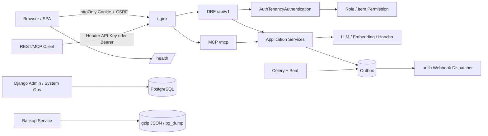

# Systemaudit 2026-09 — Security, Resilience und Operations

## 1. Management-Summary

Dieser Audit untersucht die produktiven Trust Boundaries von ReqogniLoom: JWT-/Cookie-Authentifizierung, Rollen- und API-Key-Autorisierung, SSRF und LLM-/Memory-Ausgänge, MCP-SSE, Upload-/Health-Endpunkte, Outbox/Webhook-Zuverlässigkeit, Backup-Vertraulichkeit, CI-/Lieferkette sowie die CISO-Checklisten für Frontend, Datenzugriff, Auth-Policy, handgebaute Kryptografie und AI-Risiken.

Die statische Analyse bestätigt **0 P0, 3 P1, 14 P2 und 1 P3**. Die drei P1-Risiken sind:

1. ein bis zu 60 Minuten alter Bearer-Autoritäts-Snapshot für Workspaceless-Adminpfade, der nach Deaktivierung/Rollenzugang weiter greifen kann;
2. ein standardmäßig unbegrenztes und an mehreren produktiven LLM-Aufrufpfaden umgangenes Kosten-/Budget-Gate, einschließlich eines als read-only klassifizierten MCP-Tools;
3. direkte GitHub-Actions-Expression-Interpolation in Shell-Blöcken, die einen injizierbaren `workflow_dispatch`-Input und damit Runner-/Secret-Risiko erzeugt.

Zusätzlich bestehen belastbare P2-Lücken bei MFA, Passwortvalidierung, Refresh-Token-Widerruf, API-Key-Lebenszyklus, privilegierten SSRF-Zielen, MCP-Session-IDs, Ressourcenbegrenzung, Upload-Speicherbedarf, Outbox-Timeouts, fehlender RLS auf Betriebstabellen, unverschlüsselten Backups und nicht reproduzierbaren Build-Eingängen.

**Gesamtbewertung:** Die Anwendung besitzt mehrere gute Paved Roads — httpOnly-Cookies plus CSRF, HMAC-geschützte API-Key-Hashes, Refresh-Rotation mit Reuse-Erkennung, workspacebezogene Rollenauflösung, CSP, RLS für die meisten Tenant-Scoped-Tabellen und einen transaktionalen Outbox-INSERT. Diese Schutzschichten werden jedoch an mehreren operativen und autoritativen Grenzen nicht durchgehend angewandt. Ein produktives Release-Gate sollte die P1-Befunde und mindestens die P2-Befunde mit direktem Daten-, Kosten- oder Verfügbarkeitspotenzial schließen oder mit datiertem Restrisiko akzeptieren.

## 2. Scope, Revision und Methodik

### 2.1 Revision und Abgrenzung

- **Repository:** `C:\Repositories\ai-native-reqflow-POC`
- **Branch:** `feat/1031-bluepencil-host-bridge`
- **Revision:** `e3df119e52c0cbcc18df02f708567207c0374826`
- **Änderungsgrenze:** ausschließlich dieser Auditbericht; keine Anwendungsdateien geändert.
- **Prüfbereich:** `backend/`, `frontend/`, `.github/workflows/`, `deploy/` und relevante Tests/Blueprints.
- **Nicht im Scope:** REQ-Traceability, Produktfunktionalität, formale WCAG-Zertifizierung, Laufzeit-/Lasttests, externe Infrastruktur, geheime `.env`-Inhalte und ein nicht verfügbarer Produktions-Proxy.

### 2.2 Vorgehen

1. Öffentliche und administrative Routen, Auth-Middleware, Permission-Klassen, MCP-Transports, Provider-/Memory-Clients, Celery-/Outbox-Pfade, Upload-Handler, Backup- und CI-Konfiguration statisch gelesen.
2. Deep-Dive-Checklisten für Frontend-Security, Data-Access-Control, Auth-Policy, DIY-Security und AI-Risk-Patterns angewandt.
3. Kandidaten in zwei Pass gesammelt und anschließend gegen den aktuellen Code, Tests, Kommentare und False-Positive-Guards revalidiert.
4. Keine Runtime-Aktionen, Tests, Container, Browser-Interaktionen, CVEs-Liveabfragen oder Paketinstallationen ausgeführt.
5. `config/review-rules/security.yaml` und die optionale Erweiterung `.opencode/3-project/ReqLo-security-auditor-ext.md` waren im Repository nicht vorhanden; daher gelten die eingebauten Regeln `SEC-01` bis `SEC-06`.

### 2.3 Tatsache, Hypothese und Confidence

- **Tatsache:** direkt aus aktuellem Quelltext, Migration, Route, Test, Workflow oder Deployment-Manifest belegt.
- **Hypothese/Auswirkung:** aus der Tatsache abgeleitete mögliche Wirkung; kein bereits eingetretener Schaden wird behauptet.
- **Confidence:** Vertrauen in die Kausalkette, nicht in die Schwere.
- **P0/P1:** nur bei einem belegten produktiven Standardpfad und fehlender Gegenmaßnahme; der Bericht bleibt konservativ und enthält kein P0.

### 2.4 Schweregrade und Prioritäten

- **CRITICAL/HIGH:** unmittelbarer schwerwiegender Sicherheits-, Daten- oder Verfügbarkeitsschaden mit produktivem Pfad.
- **MEDIUM:** materielle, begrenzte oder indirekte Wirkung; Priorität P2.
- **LOW:** lokales Wartungs-/Hardening-Risiko; Priorität P3.
- **P0/P1/P2/P3:** Priorität und Reihenfolge, nicht die Severity-Zahl. `P1` bedeutet vor produktivem Release, `P2` zeitnahe Nacharbeit, `P3` Harden-/Akzeptanzentscheidung.

### 2.5 Regel-Mapping

Da die eingebaute Regelbibliothek keine eigene Availability- oder CI-Kategorie besitzt, verwenden Ressourcen-/Lieferkettenbefunde die nächstliegende vorhandene Regel `SEC-05` (Dependency-/Deployment-Risiko). Authentifizierungs- und Autorisierungsbefunde verwenden `SEC-03`, Outbound-URL-/SSRF-Befunde `SEC-06`, At-rest-Credential-Befunde `SEC-02` und die handgebaute JWT-Implementierung `SEC-04`.

## 3. Trust Boundaries und relevante Architektur



Wesentliche Beobachtungen:

- Workspaceless-REST-Routen verwenden weiterhin die Rollen aus dem JWT; workspacegebundene REST-Routen lösen Rollen dagegen aus der DB neu auf (`backend/auth_tenancy/rest.py:172-212`).
- API-Key-Authentifizierung prüft Revocation, Expiry und `user.is_active` (`backend/auth_tenancy/services/authentication.py:500-557`).
- Die LLM-Settings-Schreibstrecke besitzt einen URL-Guard (`backend/llm_adapter/url_guard.py:149-196`), Memory-/Honcho- und Webhook-Ausgänge jedoch nicht denselben Guard.
- Die Outbox bindet den INSERT an die Mutation, dispatcht Subscriber aber synchron im Celery-Worker (`backend/application/event_bus.py:164-214,458-557`).
- MCP-Handshake und Message-POST sind throttled; bei Cache-Ausfall gilt fail-open (`backend/rest_api/throttling.py:164-176`, `backend/mcp_server/throttling.py:139-170`).
- `frontend/nginx.conf` setzt starke Browser-Header und `client_max_body_size 100M`; die Django-Views lesen die Datei dennoch vollständig in den Arbeitsspeicher.

## 4. Befundübersicht

| ID | Severity | Prio | Status | rule_id | Kurzfassung | Confidence |
|---|---:|---:|---|---|---|---:|
| SR-001 | HIGH | P1 | statisch bestätigt | SEC-03 | Workspaceless Bearer nutzt stale Rollen und prüft aktiven User nicht | 97 |
| SR-002 | MEDIUM | P2 | statisch bestätigt | SEC-03 | httpOnly-Schutz ist durch Body-Token standardmäßig reversibel | 95 |
| SR-003 | MEDIUM | P2 | Policy-Lücke | SEC-03 | Kein MFA/TOTP für privilegierte Konten | 93 |
| SR-004 | MEDIUM | P2 | statisch bestätigt | SEC-03 | Passwort-Validatoren werden auf Provisioning-Pfaden umgangen | 96 |
| SR-005 | MEDIUM | P2 | statisch bestätigt | SEC-03 | Passwortwechsel widerruft API-Refresh-Familien nicht; keine absolute Family-TTL | 92 |
| SR-006 | MEDIUM | P2 | Least-Privilege-Lücke | SEC-03 | API-Keys sind standardmäßig unbefristet und maximal scoped | 96 |
| SR-007 | MEDIUM | P2 | statisch bestätigt | SEC-06 | Privilegierte Memory-/Honcho-/Webhook-URLs umgehen Outbound-Guard | 94 |
| SR-008 | HIGH | P1 | statisch bestätigt | SEC-03 | LLM-Budget ist optional und wird in mehreren Pfaden umgangen | 98 |
| SR-009 | MEDIUM | P2 | statisch bestätigt | SEC-03 | MCP-Session-ID ist ein URL-Bearer-Credential | 96 |
| SR-010 | MEDIUM | P2 | Robustheitsrisiko | SEC-05 | Throttle-Fail-open, unbounded Executor-Queue und SSE ohne Stream-Cap | 94 |
| SR-011 | MEDIUM | P2 | Operationsrisiko | SEC-05 | Öffentlicher Health-Check ist teuer und nicht gedrosselt | 93 |
| SR-012 | MEDIUM | P2 | statisch bestätigt | SEC-05 | CSV-/ReqIF-Uploads werden vor der Größenprüfung vollständig gelesen | 97 |
| SR-013 | MEDIUM | P2 | Resilience-Risiko | SEC-05 | Outbox/Webhook-Retry überschreitet Poller- und Celery-Grenzen | 94 |
| SR-014 | MEDIUM | P2 | Defense-in-Depth-Lücke | SEC-03 | Outbox-, DLQ- und Webhook-Tabellen haben keine RLS/Tenant-Spalte | 91 |
| SR-015 | MEDIUM | P2 | statisch bestätigt | SEC-02 | gzip-Backups enthalten Secrets unverschlüsselt | 96 |
| SR-016 | HIGH | P1 | statisch bestätigt | SEC-05 | GitHub-Actions interpoliert nicht vertrauenswürdige Inputs in Shell-Code | 94 |
| SR-017 | MEDIUM | P2 | Supply-Chain-Risiko | SEC-05 | Lockfile, npm-Install und Images/Actions sind nicht reproduzierbar gepinnt | 90 |
| SR-018 | LOW | P3 | DIY-Crypto-Kandidat | SEC-04 | JWT-Signaturprüfung ist handgebaute Kryptografie | 100 |

**P0:** 0. **P1:** 3. **P2:** 14. **P3:** 1.

## 5. Detailbefunde

### SR-001 — Workspaceless Bearer nutzt stale Rollen und prüft aktiven User nicht

**Severity:** HIGH  
**Prio:** P1  
**Status:** statisch bestätigt; Workspaceless-Bearerpfad  
**File:** `backend/auth_tenancy/services/authentication.py:175-220`; `backend/auth_tenancy/rest.py:172-212`; `backend/reqogniloom/settings.py:642-653`; `backend/rest_api/settings_views.py:137-181`  
**rule_id:** SEC-03  
**Mapping:** OWASP-A01/A07 · CWE-287/CWE-613  
**Confidence:** 97

**Evidence:**

`validate_bearer_token()` prüft Signatur, `exp`, `iss` und `aud`, liest danach aber `user_id`, `tenant_id` und `roles` direkt aus dem JWT. Es gibt keinen DB-Check auf `User.is_active`, keine Tokenversion und keinen Session-/Role-Revocation-Check.

`AuthTenancyAuthentication` löst Rollen nur bei einem konkret auflösbaren Workspace neu aus der DB auf. Für Workspaceless-Anfragen gilt:

```python
# backend/auth_tenancy/rest.py:204-209
active_roles = claims.roles
if claims.auth_method == AuthMethod.API_KEY or (
    claims.auth_method == AuthMethod.BEARER_TOKEN and not active_roles
):
    active_roles = _resolve_roles_from_db(claims.user_id)
```

Ein nichtleerer, aber veralteter `roles`-Snapshot wird somit unverändert als Autorität verwendet. `AUTH_JWT_TTL_SECONDS` ist standardmäßig `3600`; Refresh-Tokens haben eine 30-Tage-TTL. `LlmSettingsView` prüft Workspaceless-Adminzugriff mit `ctx.has_role(ROLE_ADMIN)` und darf anschließend `provider`, `base_url`, `model_name` und `api_key` ändern.

**Risk:**

Ein deaktivierter oder administrativ entzogener Benutzer kann einen noch nicht abgelaufenen Access-Token bis zu einer Stunde für Workspaceless-Governance-Endpunkte verwenden. Für LLM-Settings kann dies die Provider-URL und den API-Key verändern und damit Tenant-Daten an einen vom Angreifer kontrollierten Endpunkt senden. Workspacegebundene REST-Pfade sind durch die DB-Rollenauflösung nicht automatisch betroffen; der Befund ist deshalb auf den Workspaceless-Fast-Path begrenzt.

#### Root Cause

Rollen sind im Access-Token als autoritative Snapshot-Daten modelliert, obwohl Rollen und Account-Status mutable sind. Die vorhandene `resolve_active_user()`-Funktion wird nur im Refreshpfad verwendet, nicht als verpflichtender Bearer-Gate.

**Recommendation:**

- Für jede autorisative Anfrage den User- und Rollenstatus aus der DB oder einem zentralen, invalidierbaren Session-/Token-Store lesen.
- Workspaceless-Governancepfade nicht auf `claims.roles` verlassen; mindestens `is_active` und eine aktuelle Rollen-/Berechtigungsprüfung erzwingen.
- Rollen aus dem Access-Token nur als UI-/Performance-Hinweis verwenden oder eine Tokenversion/`authz_version` in der DB prüfen.
- Bei Deaktivierung, Passwortwechsel, Tenant-/Workspacewechsel und relevanten Rollenänderungen alle Sessions widerrufen.
- Die LLM-Settings-Autorisierung zusätzlich an eine aktuelle Tenant-Admin-Prüfung binden.

#### Alternativen

Ein kurzeres JWT-TTL reduziert das Fenster, ersetzt aber die Revocation-Prüfung nicht. Ein eigener Authorization-Service mit kurzlebigem Session-Cache ist robuster, aber komplexer als eine DB-Prüfung auf dem Workspaceless-Seam.

#### Aufwand

M (1–3 Entwicklungstage plus Auth-/REST-Regressionstests).

#### Verifikationsplan

Ein Admin meldet sich an, wird danach deaktiviert oder seine Admin-Rolle wird entzogen, und nutzt denselben Bearer-Token ohne Cookie-Refresh. Erwartet: `401` für Workspaceless-Governance; Workspace-Endpunkte müssen weiterhin nur mit aktueller Workspace-Rolle funktionieren. Zusätzlich Rollenwechsel von Admin zu Editor und Zurück testen.

### SR-002 — httpOnly-Schutz ist durch Body-Token standardmäßig reversibel

**Severity:** MEDIUM  
**Prio:** P2  
**Status:** statisch bestätigt  
**File:** `backend/rest_api/auth_views.py:180-206,227-247,324-343`; `backend/reqogniloom/settings.py:655-668`; `frontend/src/context/AuthContext.tsx:7-15,76-81`  
**rule_id:** SEC-03  
**Mapping:** OWASP-A07 · CWE-522/CWE-598  
**Confidence:** 95

**Evidence:**

Der Login setzt zwar httpOnly Access-/Refresh-Cookies, liefert standardmäßig aber zusätzlich `token` im JSON-Body. Der Schalter `AUTH_LOGIN_INCLUDE_BODY_TOKEN` ist standardmäßig `True`; der Frontend-Code ignoriert das Feld zwar, aber ein Skript im selben Origin kann die Fetch-Response trotzdem lesen.

```python
# backend/rest_api/auth_views.py:202-205
if include_body_token:
    return {"token": token, **body}
```

**Risk:**

Die beabsichtigte XSS-Mitigation „httpOnly-Cookie statt JS-lesbares Token“ gilt nur, wenn der Response-Body kein JWT enthält. Ein XSS- oder Supply-Chain-Skript im Origin kann den Login-Response abfangen und den Bearer-Token für API/CI weiterverwenden. Die Default-Kompatibilität ist damit stärker als die dokumentierte Default-Sicherheitsannahme.

#### Root Cause

Ein deprecated Kompatibilitätskanal ist standardmäßig aktiv, obwohl die Browser-SPA den Cookie-Pfad bereits vollständig nutzt und das Feld nicht als `LoginResponse` typisiert.

**Recommendation:**

- `AUTH_LOGIN_INCLUDE_BODY_TOKEN` in Production auf `False` setzen und den Feldnamen nach Ablauf der Migrationsfrist entfernen.
- Für nicht-browser CLI-Client einen bewusst getrennten, nicht cookie-basierten OAuth-/API-Key-Flow anbieten, nicht denselben Browser-Login-Response.
- Falls Kompatibilität interimlich nötig ist: Body-Token nur per explizitem Client-Flag ohne Browser-Cookie-Pfad, mit restriktiver CORS-/Rate-/Audit-Policy und `Cache-Control: no-store` ausgeben.

#### Alternatives

Ein JS-Client kann den Body-Token nicht automatisch ausblenden. CSP reduziert XSS-Risiken, beseitigt aber den direkt lesbaren Response-Token nicht.

#### Aufwand

S–M (Konfigurationsdefault plus API-/Client-Tests und Migrationshinweis).

#### Verifikationsplan

Login-Response im Browser prüfen: Im sicheren Default darf kein `token` im JSON stehen; die SPA muss weiterhin über `/auth/me/` und Cookies funktionieren. Einen CLI-Test nur gegen den separaten, expliziten Token-Flow ausführen.

### SR-003 — Kein MFA/TOTP für privilegierte Konten

**Severity:** MEDIUM  
**Prio:** P2  
**Status:** Policy-Lücke  
**File:** `backend/rest_api/auth_views.py:102-146,209-247`; `backend/workflow/signature_gate.py:160-169`; `backend/persistence/models.py:531-540`  
**rule_id:** SEC-03  
**Mapping:** OWASP-A01/A07 · CWE-308  
**Confidence:** 93

**Evidence:**

Der Produktionslogin prüft Username, Passwort und `is_active`, aber keinen zweiten Faktor. Das vorhandene TOTP-Gate ist ausdrücklich ein v1-Stub und gibt immer `False` zurück. Django-Superuser-, Tenant-Admin- und Workspace-Admin-Funktionen sind erreichbar, ohne dass ein TOTP/WebAuthn-Faktor erzwungen wird.

**Risk:**

Ein gestohlenes oder erratenes Admin-Passwort genügt für sensible Aktionen wie Benutzer-/Rollenverwaltung, LLM-Providerkonfiguration und Admin-Operationen. MFA ist für privilegierte Rollen besonders relevant, weil die Anwendung mehrere konfigurierbare Rollen und einen globalen System-Admin-Pfad besitzt.

#### Root Cause

TOTP ist als zukünftiger Vertragsbestandteil dokumentiert, aber nicht in den Login- oder Rollen-Step-up-Seam integriert.

**Recommendation:**

WebAuthn als primären Faktor, TOTP als Fallback, Recovery-Codes und serverseitige Enroll-/Disable-Audit-events ergänzen. Für `is_superuser`, Tenant-Admin, LLM-/Backup-/Rollenänderungen Step-up-MFA verlangen; TOTP nicht nur als nicht verpflichtendes Signaturfeld für Workflow-Gates verwenden.

#### Alternativen

Ein externer Identity Provider mit MFA ist für Self-Hosting schwieriger, kann aber für eine produktive Plattformdistribution die sicherste paved Road sein. Ein rein SMS-OTP ist nach NIST nicht die empfohlene Lösung.

#### Aufwand

M–L (Secret-Store, Recovery, Step-up-Middleware und UI).

#### Verifikationsplan

Admin-Login ohne zweiten Faktor muss nach Enrollment abgewiesen werden; vorhandene und neu ausgestellte Recovery-Codes müssen einzeln verbrauchbar sein. Rollen-/Backup-/LLM-Mutationen müssen bei deaktiviertem oder abgelaufenem MFA-Faktor erneut prüfen.

### SR-004 — Passwort-Validatoren werden auf Provisioning-Pfaden umgangen

**Severity:** MEDIUM  
**Prio:** P2  
**Status:** statisch bestätigt  
**File:** `backend/reqogniloom/settings.py:367-372`; `backend/auth_tenancy/services/user_account.py:94-113`; `backend/auth_tenancy/provisioning.py:114-123`; `backend/persistence/models.py:80-101`; `backend/mcp_server/tools/users.py:188-191,510-522`  
**rule_id:** SEC-03  
**Mapping:** OWASP-A07 · CWE-521/CWE-798  
**Confidence:** 96

**Evidence:**

Django konfiguriert Similarity-, Mindestlängen-, Common- und Numeric-Password-Validatoren. `UserAccountService.create()` prüft jedoch nur eine eigene Mindestlänge von acht Zeichen und ruft `user.set_password()` direkt auf. `provision_admin()` tut dasselbe. `UserManager._create_user()` bietet ebenfalls einen direkten `set_password()`-Pfad. MCP `user.create` delegiert an denselben Service.

Damit sind `password123`, `12345678` oder ein dem Benutzername ähnliches Passwort auf diesen nicht-testbaren Produktionspfaden möglich, obwohl die globale Django-Policy sie ablehnen würde.

**Risk:**

Ein schwaches Admin-/Tenant-Admin-Passwort ist leichter zu erraten und erhöht die Wirkung eines Credential-Staging- oder Phishing-Angriffs. Die Lücke ist besonders relevant, weil Provisioning für den initialen Superuser produktionsrelevant ist.

#### Root Cause

Es gibt keine zentrale `PasswordPolicyService`-/`validate_password()`-Invariants für alle User-Erzeugungs- und Passwortänderungspfade; die Django-Validatoren werden nur implizit bei bestimmten Admin-/Formularpfaden erwartet.

**Recommendation:**

- Vor jedem `set_password()`- und Passwortwechselpfad `django.contrib.auth.password_validation.validate_password()` mit dem konkreten User aufrufen.
- Eine zentrale Benutzeranlage-/Passwortänderungsservice-Fassade erzwingen und direkte `set_password()`-Aufrufe in Management-Commands/Provisionierung darauf umstellen.
- Eine aktuelle Breached-Password-Liste (`CommonPasswordValidator` allein genügt nicht) anwenden und die Mindestlänge policy-basiert konfigurierbar machen.
- Audit-Log-Ereignisse für Passwortänderungen und Admin-Provisioning ergänzen.

#### Alternativen

Ein Identity Provider kann Passwortpolicy und MFA zentralisieren. Ohne IdP sollte zumindest ein zentraler, getesteter Policy-Seam eingeführt werden.

#### Aufwand

M (zentraler Service plus Provisioning-/MCP-/Admin-Tests).

#### Verifikationsplan

Eine Tabelle mit Similarity-, Common-, Numeric- und Breached-Passwörtern muss für REST, MCP, Bootstrap und Admin-Passwortänderung dieselbe 400/Validation-Entscheidung ergeben. Testfixtures dürfen nicht als Produktionsbefund missverstanden werden.

### SR-005 — Passwortwechsel widerruft API-Refresh-Familien nicht; keine absolute Family-TTL

**Severity:** MEDIUM  
**Prio:** P2  
**Status:** statisch bestätigt  
**File:** `backend/persistence/admin.py:103-107`; `backend/rest_api/auth_views.py:363-369,428-454`; `backend/auth_tenancy/models.py:189-230`; `backend/reqogniloom/settings.py:648-653`  
**rule_id:** SEC-03  
**Mapping:** OWASP-A07 · CWE-613  
**Confidence:** 92

**Evidence:**

Der Django-Admin-Passwortpfad setzt den neuen Hash, widerruft aber keine `RefreshToken`-Familie. `LogoutView` widerruft nur die konkret präsentierte Refresh-Familie. `RefreshView` prüft bei einer Rotation den aktiven User, aber keine Passwort-/Sicherheitsversion. `RefreshToken` speichert `session_id`, `expires_at`, `used_at` und `revoked_at`, jedoch kein Erstellungsdatum oder absolutes Family-Ablaufdatum. Jede Rotation erhält erneut die 30-Tage-Token-TTL.

**Risk:**

Ein gestohlener Refresh-Token bleibt nach einem Passwortreset bis zu 30 Tage bzw. bei regelmäßiger Rotation länger nutzbar. Ein Admin-Passwortwechsel schützt damit nicht zuverlässig gegen einen bereits kompromittierten API-Session-Flow.

#### Root Cause

Django-Session-Invalidierung und die eigene JWT-Rotation haben getrennte Revocation-Modelle; es gibt keine gemeinsame `auth_version` oder Family-Lifetime.

**Recommendation:**

- Bei Passwortwechsel, Deaktivierung und sicherheitsrelevanten Rollenänderungen alle Refresh-Familien des Users serverseitig widerrufen.
- Eine `session_created_at`-/absolute Family-TTL oder `auth_version` im `RefreshToken`-Modell ergänzen.
- Rotation immer gegen die maximale Session-Lifetime prüfen, auch wenn der einzelne Token noch nicht abgelaufen ist.
- Den bestehenden Django-Session-Hash nicht als ausreichenden Ersatz für API-Refresh-Revocation betrachten.

#### Alternatives

Kurze Refresh-TTL reduziert das Fenster, aber nicht die Revocation nach Passwortwechsel. Ein zentraler Session-Store mit `auth_version` ist robuster als eine zusätzliche Family-TTL allein.

#### Aufwand

M (Schema-/Serviceänderung, Migration und Auth-Regressionstests).

#### Verifikationsplan

Refresh-Token ausstellen, Passwort im Admin ändern und sofort denselben sowie einen abgeleiteten Token testen: beide müssen abgewiesen werden. Zusätzlich eine Family-Lifetime jenseits der per-Token-TTL testen.

### SR-006 — API-Keys sind standardmäßig unbefristet und maximal scoped

**Severity:** MEDIUM  
**Prio:** P2  
**Status:** Least-Privilege-Lücke  
**File:** `backend/auth_tenancy/models.py:152-162`; `backend/auth_tenancy/services/authentication.py:561-635`; `backend/rest_api/api_key_views.py:285-300,338-365`; `frontend/src/api/api-keys.ts:31-40`  
**rule_id:** SEC-03  
**Mapping:** OWASP-A01/A07 · CWE-613/CWE-862  
**Confidence:** 96

**Evidence:**

`ApiKey.scope` hat den Legacy-Default `write`, der als Admin-Tier behandelt wird. `expires_at` ist standardmäßig `NULL` und bedeutet „nie ablaufen“. Das REST-Frontend sendet bei `POST /api-keys/` nur `name`; der Viewset verwendet für ein fehlendes `scope` ebenfalls `write`. `workspace_ids=[]` bedeutet alle Workspaces, in denen der Owner eine Rolle hält.

Die Autorisierung schneidet den Key weiterhin mit den aktuellen Owner-Rollen und dem Workspace-Fence; daraus folgt kein direkter Rollenaufstieg über die aktuelle Rollenmatrix. Das Problem ist die unnötig große Lebensdauer und Capability-Fläche eines gestohlenen Keys.

**Risk:**

Ein aus einem CI-System, Browser-Workflow oder Log ausgelesener Key bleibt bis zum manuellen Widerruf gültig und kann alle Operationen ausführen, die der Owner aktuell besitzt. Ein späterer Rollenwechsel kann die Wirkung eines bestehenden Keys ohne Token-Rotation vergrößern.

#### Root Cause

Kompatibilitätsdefaults wurden beibehalten, obwohl die API inzwischen kanonische Scope-Tiers und ein Key-Management-Gate besitzt; die UI bietet keine sichere Scope-/Expiry-Auswahl an.

**Recommendation:**

- Neuen Keys standardmäßig `read_only` oder einen expliziten, UI-erklärten `author`-Scope geben.
- Für Produktions-/CI-Keys eine verpflichtende, rotierbare Ablaufzeit und eine maximale Family-/Credential-Lifetime erzwingen; `NULL` nur für bewusst migrierte Legacy-Keys.
- Scope, `workspace_ids` und Ablaufdatum im UI sichtbar und bestätigbar machen.
- Bei Rollen-/Workspace-/Deaktivierungsänderung Key-Revocation oder Capability-Versionierung anbieten.
- `API_KEY_PEPPER` in Production verpflichtend und mit einem geplanten Rotations-/Legacy-Key-Prozess betreiben.

#### Alternatives

Eine keylose kurzlebige Workload-Identity ist für externe Agenten robuster, erfordert aber einen anderen Trust-Provider. Ein expliziter Scope im API-Contract ist der kurzfristige Paved Road.

#### Aufwand

M (Serializer/UI/Default-Änderung plus Migrations- und Rotationstests).

#### Verifikationsplan

Ein neu erzeugter Key muss den erwarteten minimalen Scope und eine Ablaufzeit besitzen. Legacy-Keys dürfen nicht stillschweigend unbegrenzt weiterleben; Rotation und Revocation müssen auditierbar sein.

### SR-007 — Privilegierte Memory-/Honcho-/Webhook-URLs umgehen Outbound-Guard

**Severity:** MEDIUM  
**Prio:** P2  
**Status:** statisch bestätigt; Superuser-/Admin-Voraussetzung  
**File:** `backend/memory/memory_rest.py:176-227`; `backend/memory/apps.py:23-46`; `backend/llm_adapter/embedding_service.py:225-247`; `backend/memory/honcho_backend.py:381-410,1019-1079`; `backend/application/models.py:164-177`; `backend/application/webhook_dispatcher.py:303-338`; `backend/llm_adapter/url_guard.py:39-50`  
**rule_id:** SEC-06  
**Mapping:** OWASP-A08/A10 · CWE-918  
**Confidence:** 94

**Evidence:**

`SystemMemorySettingsWriteSerializer` verwendet für `ollama_base_url` und `honcho_base_url` nur `CharField(max_length=255)`, nicht `validate_outbound_url`. Der Write ist auf Django-Superuser beschränkt, die gespeicherten Werte werden aber in `memory.apps._apply_memory_settings_override()` und anschließend in `requests.post()` bzw. dem Honcho-SDK tatsächlich verwendet. Der Honcho-Health-Check führt zusätzlich HEAD/POST-Requests aus.

`WebhookSubscription.url` ist nur ein `URLField`; der Dispatcher ruft `urllib.request.urlopen()` ohne Private-IP-, Egress- oder Redirect-Guard auf. Der vorhandene LLM-Guard dokumentiert selbst DNS-Rebinding als Restrisiko und schützt nur den LLM-Settings-Schreibpfad.

**Risk:**

Ein kompromittierter Superuser kann Memory-/Embedding-Verkehr auf interne Dienste, Redis/Postgres, Cloud-Metadata-Adressen oder andere im Backend-Netz erreichbare Ziele umleiten. Ein Webhook-Admin kann ähnlich interne Ziele mit POST/PROBE treffen. Das ist kein unauthentifizierter öffentlicher SSRF, aber ein realer Trust-Boundary-Bruch mit hoher Datenexfiltrationswirkung.

#### Root Cause

URL-Validierung ist pro Consumer statt als zentraler Egress-Policy implementiert. Settings-Serializer und externe Clients verwenden unterschiedliche HTTP-Bibliotheken mit unterschiedlichen Redirect-/DNS-Semantiken.

**Recommendation:**

- Einen zentralen Outbound-Client für alle LLM-, Embedding-, Honcho- und Webhook-Ausgänge verwenden.
- Vor jedem Request und bei jeder Redirect-Stufe Host/IP/Port/Schema prüfen; nur HTTPS bzw. dokumentierte Private-Allowlist-Ziele zulassen.
- DNS nach der Prüfung pinnen oder einen kontrollierten Egress-Proxy verwenden; DNS-Rebinding nicht nur dokumentieren.
- Redirects standardmäßig deaktivieren oder erneut validieren; Cloud-Metadata-, Loopback-, Link-local- und interne RFC1918-Netze blockieren.
- Für Webhooks getrennte Allowlist-/Tenant-Policy und Outbound-Worker verwenden; Secrets nie als URL-Query- oder Logfeld übernehmen.

#### Alternativen

Ein Egress-Proxy ist für Docker/Cloud-Produktion die stärkste Kontrolle. Eine reine URL-Allowlist im Serializer reicht nicht, wenn der Provider-SDK clientseitig erneut auflöst.

#### Aufwand

M–L (gemeinsame Egress-Fassade, SDK-Anpassungen, Tests mit Redirect-/DNS-Fixture).

#### Verifikationsplan

Für beide Settings-Pfade und Webhooks müssen `127.0.0.1`, `10/8`, `172.16/12`, `192.168/16`, Link-local, IPv4-mapped IPv6, Nicht-HTTP-Schemata und Public→Private-Redirects abgewiesen werden. Erlaubte Ollama-/Honcho-Testziele dürfen weiterhin funktionieren.

### SR-008 — LLM-Budget ist optional und wird in mehreren Pfaden umgangen

**Severity:** HIGH  
**Prio:** P1  
**Status:** statisch bestätigt  
**File:** `backend/reqogniloom/settings.py:747-753`; `backend/llm_adapter/token_tracking.py:211-243`; `backend/mcp_server/tools/cross_cutting.py:132-179`; `backend/mcp_server/tool_registry.py:399-417`; `backend/memory/tasks.py:91-97`; `backend/admin_ops/health_rest.py:273-292`  
**rule_id:** SEC-03  
**Mapping:** OWASP-A01/A04 · CWE-862/CWE-770  
**Confidence:** 98

**Evidence:**

`TENANT_TOKEN_LIMIT_PER_DAY` ist standardmäßig `None`; `is_over_daily_limit()` liefert dann immer `False`. `context.change_impact` ruft `provider.complete()` direkt auf und ist in `_READ_ONLY_TOOL_NAMES` enthalten. Damit kann bereits ein Viewer einen kostenpflichtigen LLM-Aufruf auslösen. `memory.tasks._call_llm()` und der echte LLM-Health-Probe umgehen ebenfalls den zentralen Budget-/Auditpfad.

```python
# backend/mcp_server/tools/cross_cutting.py:177-179
return provider.complete(
    prompt, purpose="context_change_impact", context=context
)
```

Andere Flows wie `backend/application/ai_review_service.py`, `backend/application/architecture_decompose_service.py`, `backend/application/interview_service.py` und Bundle-Kompression prüfen das Budget bereits. Der Befund ist deshalb auf die genannten, nachweislich ungeschützten Pfade begrenzt.

**Risk:**

Ein gültiger API-Key oder ein normaler Viewer kann Provider-Kosten erzeugen, ohne dass ein Tenant-Budget greift. Bei Redis-/DB-Fehlern wird der Accounting-Fehler zusätzlich fail-open behandelt. Ein Health-Poll kann ebenfalls pro Anfrage eine echte Provider-Anfrage auslösen.

#### Root Cause

Budgetprüfung und Usage-Recording sind nicht am zentralen Provider-/Router-Seam verankert, sondern optionales Service-Setup. Read-only bedeutet auth- und datenseitig keine Kostenfreiheit.

**Recommendation:**

- Budgetprüfung als nicht umgehbare Policy im `CapabilityRouter`/Provider-Transport implementieren, nicht in einzelnen Services.
- Jede reale Completion, Embedding- und Health-/Background-Kostenart auf getrennte Budgets/Quoten abbilden und `record_token_usage()` im selben zentralen Seam ausführen.
- `TENANT_TOKEN_LIMIT_PER_DAY` in Production auf einen positiven Wert setzen und bei fehlender/fehlerhafter Accounting-Abhängigkeit für kostenpflichtige Calls fail-closed oder auf einen sicheren lokalen Mock zurückfallen.
- `context.change_impact` entweder kostenpflichtig und write-/cost-gated machen oder explizit als quota-geschützten read-only Compute behandeln.
- Health-Probes aus dem Nutzer-Budget herausnehmen, aber mit einem festen Health-Token-/Requestbudget versehen.

#### Alternativen

Ein externer Provider-Cost-Proxy kann notfalls zusätzlich greifen, ersetzt aber nicht die serverseitige Capability-/Quota-Policy.

#### Aufwand

M–L (zentraler Seam, Migration/Metriken, MCP- und Task-Tests).

#### Verifikationsplan

Mit gesetztem Budget: ein Read-only-MCP-Aufruf, ein Memory-Task und ein Health-Probe müssen entweder abgewiesen, auf ein separates Quotalimit verwiesen oder vollständig erfasst werden. Nach Erreichen des Limits darf kein weiterer Provider-Request starten; ein DB-Fehler darf nicht stillschweigend unbegrenzt durchreichen.

### SR-009 — MCP-Session-ID ist ein URL-Bearer-Credential

**Severity:** MEDIUM  
**Prio:** P2  
**Status:** statisch bestätigt  
**File:** `backend/mcp_server/views.py:480-531,788-801`; `backend/mcp_server/sse_pubsub.py:13-23,74-131`  
**rule_id:** SEC-03  
**Mapping:** OWASP-A07 · CWE-522/CWE-598  
**Confidence:** 96

**Evidence:**

Der SSE-Handshake legt den API-Key verschlüsselt in Redis und liefert dem Client anschließend:

```python
# backend/mcp_server/views.py:795
endpoint = f"{prefix}/mcp/messages/?session_id={session_id}"
```

`McpMessagesView` akzeptiert die Session-ID als einziges Credential, holt daraus den API-Key und dispatcht den Tool-Aufruf. Die Session-Bindung hat eine achtstündige TTL. Die API-Key-Verschlüsselung schützt den Redis-Wert, aber nicht die Session-ID in URL, Access Logs, Browser-History oder Referer.

**Risk:**

Wer den Query-String aus einem Proxy-/Access-Log, Browser-Verlauf, Zwischenproxy oder Screenshare erhält, kann während der TTL Nachrichten im Kontext des API-Key-Owners dispatchen. Der Kommentar „never the api_key“ schützt nicht vor der Exfiltration des daraus autorisierenden Session-Bearers.

#### Root Cause

Der Session-Bearer wurde als URL-Feld für MCP-Kompatibilität gewählt, obwohl der Message-Endpunkt bereits POST und Header unterstützt.

**Recommendation:**

Session-ID aus Query-String und Event-Endpoint entfernen; stattdessen einen kurzlebigen, rotierenden MCP-Session-Token in einem nicht standardmäßig geloggten Header oder einem sicheren, SameSite-Cookie transportieren. Nginx/Proxy-Logs auf `session_id` redacten, `Referrer-Policy` beibehalten und bei Session-Hijacking den gesamten Key widerrufen.

#### Alternatives

TLS allein löst die Log-/History-Exposition nicht. Fragment-Identität im Browser wäre ebenfalls nicht für serverseitige POST-Clients geeignet.

#### Aufwand

M (MCP-Client-Protokoll, Proxy-Logging und Reconnect-Tests).

#### Verifikationsplan

Access-/Error-Logs und `Last-Event-ID`-Reconnect dürfen keine wiederverwendbare Session-ID im Query enthalten. Header-/Cookie-Message-Authentifizierung muss mit ungültiger, abgelaufener und fremder Session sicher fehlschlagen.

### SR-010 — Throttle-Fail-open, unbounded Executor-Queue und SSE ohne Stream-Cap

**Severity:** MEDIUM  
**Prio:** P2  
**Status:** Robustheitsrisiko  
**File:** `backend/rest_api/throttling.py:48-68,164-176`; `backend/mcp_server/views.py:148-156,579-612,728-744`; `backend/mcp_server/sse_pubsub.py:193-257`  
**rule_id:** SEC-05  
**Mapping:** OWASP-A04/A06 · CWE-400  
**Confidence:** 94

**Evidence:**

`DynamicRateThrottle` fängt Cache-/Redis-Fehler und lässt alle Requests durch. Das gilt auch für MCP, weil `McpApiKeyRateThrottle`/`McpIpRateThrottle` dieselbe Klasse verwenden. Die MCP-Nachrichtenverarbeitung nutzt einen `ThreadPoolExecutor(max_workers=10)`, aber `submit()` gibt immer `202` zurück; eine explizit begrenzte Warteschlange oder `queue.Full`-Ablehnung existiert nicht. `async_sse_generator` läuft in einer Endlosschleife mit 15-Sekunden-Keepalive, ohne aktive Stream-, Idle- oder Tenant-Gesamtzahl-Obergrenze.

**Risk:**

Bei Redis-Ausfall, deaktivierter Rate oder einem gültigen Key kann ein Angreifer LLM-/DB-Kosten erzeugen und Executor-/Redis-/DB-Ressourcen sättigen. Viele SSE-Verbindungen bleiben bis zur Session-TTL oder zum Proxy-Timeout offen.

#### Root Cause

Rate-Limitierung ist als DoS-Mitigation bewusst fail-open; für kosten- und streamkritische MCP-Pfade wurde diese Policy nicht durch lokale harte Limits ergänzt.

**Recommendation:**

- Kostenkritische MCP-Aufrufe mit einem lokalen Token-Bucket/Provider-Budget absichern, das bei Redis-Ausfall sicher begrenzt.
- Executor-Queue explizit begrenzen und bei voller Queue `429`/`503` mit Retry-After liefern.
- Pro Tenant und pro Credential aktive SSE-Sessions sowie Idle-Zeit begrenzen.
- Nginx-/ASGI-Prozessgrenzen und SSE-Heartbeat-/Reconnect-Verhalten mit Lasttest verifizieren.

#### Alternativen

Ein externer Rate-Limiter ist robuster, aber ein lokaler harter Backstop bleibt für Auth-/Kostenpfade notwendig.

#### Aufwand

M–L (Queue-/Session-Limits, Monitoring und Lasttest).

#### Verifikationsplan

Redis abschalten, Throttle deaktivieren und die konfigurierten Grenzen überschreiten: MCP muss entweder lokal begrenzen oder einen kontrollierten Fehler liefern. Executor-Queue und SSE-Zähler müssen sichtbar begrenzt bleiben.

### SR-011 — Öffentlicher Health-Check ist teuer und nicht gedrosselt

**Severity:** MEDIUM  
**Prio:** P2  
**Status:** Operationsrisiko  
**File:** `backend/reqogniloom/urls.py:26-28`; `backend/reqogniloom/health.py:73-119,140-225`; `backend/reqogniloom/settings.py:737-745`  
**rule_id:** SEC-05  
**Mapping:** OWASP-A04/A06 · CWE-400  
**Confidence:** 93

**Evidence:**

`/health/` ist eine normale Django-View ohne DRF-Throttle. Sie prüft die Datenbank, ruft `get_memory_backend().health_check()` auf und führt Katalog-/Workflow-Zählungen aus. Bei Honchauslösung kann der Memory-Backend-Check externe HEAD- und Embedding-POSTs auslösen. Die Modulbeschreibung verspricht Liveness-/Readiness-Muster, im URLconf existiert aber nur `/health/`.

**Risk:**

Ein externer Request kann teure DB-/Backend-/Netzwerkarbeit pro Anfrage auslösen und somit Liveness, Worker-Pool und Provider-Kontingent beeinflussen. Umgekehrt kann ein externer Memory-Fehler den Container-Healthcheck und damit die Restart-/Traffic-Entscheidung beeinflussen.

#### Root Cause

Readiness, Liveness und detaillierte Diagnostik teilen sich einen öffentlichen, komplexen Endpunkt.

**Recommendation:**

- Minimalen, günstigen `/health/live`-Endpunkt ohne DB-/Provider-I/O für Container-Liveness bereitstellen.
- Readiness und Admin-Diagnostik trennen; Readiness intern oder per Reverse-Proxy authentifizieren.
- Health-Probes cachen, zeitlich begrenzen und mit einem festen Timeout-/Circuit-Breaker-Budget versehen.
- Öffentliche Probe-Antworten auf statische Statusmarker beschränken.

#### Alternatives

Nur ein Healthcheck am localhost/Unix-Socket ist für kleine Self-Hosting-Installationen ausreichend; für zentrale Orchestrierung sollten getrennte Endpunkte und Metriken verwendet werden.

#### Aufwand

M (Routing, Probe-Split, Reverse-Proxy- und Healthcheck-Tests).

#### Verifikationsplan

Liveness muss bei DB-/Provider-Ausfall nicht kostenintensiv neu fehlschlagen; Readiness darf bei DB-Ausfall fehlschlagen, aber nicht beliebig viele externe Provideraufrufe erzeugen. Öffentliche Response darf keine internen Hosts/DSN-Details enthalten.

### SR-012 — CSV-/ReqIF-Uploads werden vor der Größenprüfung vollständig gelesen

**Severity:** MEDIUM  
**Prio:** P2  
**Status:** statisch bestätigt  
**File:** `frontend/nginx.conf:38-65,68-82`; `backend/rest_api/views.py:7808-7821,8068-8079`; `backend/application/import_service.py:179-248`; `backend/application/reqif_import_service.py:153-163`  
**rule_id:** SEC-05  
**Mapping:** OWASP-A04/A06 · CWE-400  
**Confidence:** 97

**Evidence:**

Nginx erlaubt für `/api/` und `/mcp/` bis zu `100M`. Beide Import-Views rufen `uploaded_file.read()` auf und dekodieren den gesamten Inhalt, bevor der CSV-Parser bzw. der ReqIF-Service die eigentliche Grenze prüft. ReqIF definiert `_MAX_DOCUMENT_CHARS = 20 * 1024 * 1024`; CSV begrenzt erst nach dem Parse auf maximal 1000 Zeilen.

**Risk:**

Ein normaler Editor kann einen großen Upload mehrfach senden und pro Request mehrere hundert MB Strings/Temporärdateien sowie Parser-Objekte belegen. Ein Parserfehler nach dem Einlesen kann zusätzliche CPU/Zeit verursachen. Zusammen mit Worker-/Redis-/DB-Latenz entsteht ein plausibler Memory-DoS-Pfad, auch wenn Nginx die Gesamtgröße begrenzt.

#### Root Cause

Die harte Proxy-Grenze ist wesentlich größer als die fachlichen Grenzen und wird nicht vor dem vollständigen Lesen durchgesetzt.

**Recommendation:**

- Für Import-Endpunkte eine eigene Nginx-/Django-Grenze von z. B. 20–25 MiB setzen.
- `DATA_UPLOAD_MAX_MEMORY_SIZE`/`FILE_UPLOAD_MAX_MEMORY_SIZE` passend konfigurieren und Uploads streamen oder in temporäre Dateien schreiben.
- CSV zeilenweise validieren und ReqIF-XML mit einem streaming/iterativen Parser bzw. vor dem Decode prüfen.
- Import-Rate und parallele Uploads pro Workspace/ Tenant begrenzen.

#### Alternatives

Ein separater Import-Service mit Objekt-Storage und asynchroner Verarbeitung ist robuster für große Dateien, ist für den bestehenden synchronen Vertrag aber ein größerer Umbau.

#### Aufwand

M–L (Proxy-, View-, Parser- und Load-Tests).

#### Verifikationsplan

Uploads knapp unter/über 20 MiB, 100 MiB und mit fehlerhaftem UTF-8 testen. Worker-RSS, Requestdauer, Temp-Dateien und Parser-Fehler müssen bounded bleiben; kein Request darf das 100-MB-Limit in einen unbeschränkten In-Memory-String überführen.

### SR-013 — Outbox/Webhook-Retry überschreitet Poller- und Celery-Grenzen

**Severity:** MEDIUM  
**Prio:** P2  
**Status:** Resilience-Risiko  
**File:** `backend/application/event_bus.py:232-275,297-314,458-557`; `backend/application/webhook_dispatcher.py:55-57,201-301`; `backend/reqogniloom/settings.py:833-838`  
**rule_id:** SEC-05  
**Mapping:** OWASP-A04/A06 · CWE-400  
**Confidence:** 94

**Evidence:**

Der Outbox-INSERT ist korrekt transaktional. Danach ruft `dispatch_to_subscribers()` jedoch jeden Subscriber synchron auf. Der Webhook-Dispatcher führt bis zu fünf 10-Sekunden-Requests plus Backoff pro Subscription aus; `timeout_seconds` im Event-Bus misst nur die verstrichene Zeit und bricht den Subscriber nicht ab. `CLAIM_TIMEOUT_SECONDS` ist fest `300`, während der globale Celery-Hardlimit mindestens `180` Sekunden beträgt; mehrere Subscriptions können die Dispatchzeit über beide Grenzen heben.

**Risk:**

Ein langsamer oder nicht antwortender Webhook kann den Outbox-Poller blockieren, Claims reclaimen lassen, Celery-Tasks hart beenden und At-least-once-Duplikate erzeugen. Ein Backlog kann andere Events verzögern; die DLQ-/Idempotency-Logik bleibt zwar erhalten, ersetzt aber keine Worker-Kapazitätsgrenze.

#### Root Cause

Externe I/O und Retry-Schleifen liegen im periodischen Outbox-Task, nicht in einem eigenen, hart begrenzten Delivery-Task. Der Claim-Timeout ist eine Konstante und nicht an die maximale Subscriber-/Subscription-Last gekoppelt.

**Recommendation:**

- Pro Webhook-Delivery einen separaten Celery-Task mit eigenem kurzen Task-Limit, Concurrency-Limit und Circuit-Breaker in eine Queue enqueuen.
- Jede Subscription separat budgetieren; `timeout_seconds` als echte Cancellation-/Subprocess-Grenze implementieren.
- Claim-Timeout, Celery-Hardlimit und maximale parallele Subscriptions als eine abgeleitete Invariante definieren.
- Retry-/DLQ- und Idempotenztests mit absichtlich langsamem HTTP-Endpunkt und Worker-Kill ausführen.

#### Alternatives

Ein externer Queue-/Workflow-Service kann die Zustellung besser entkoppeln. Die transaktionale Outbox-INSERT-Struktur kann unabhängig davon erhalten bleiben.

#### Aufwand

M–L (Task-Aufspaltung, Timeout-Infrastruktur, Last-/Failover-Tests).

#### Verifikationsplan

Mehrere langsame Subscriptions und ein Worker-Kill nach HTTP-Send-before-mark müssen keinen dauerhaften Claim erzeugen. Erfolgreich zugestellte Subscriptions dürfen bei Reclaim nicht doppelt zugestellt werden; fehlgeschlagene müssen nach dem konfigurierten Budget im DLQ landen.

### SR-014 — Outbox-, DLQ- und Webhook-Tabellen haben keine RLS/Tenant-Spalte

**Severity:** MEDIUM  
**Prio:** P2  
**Status:** Defense-in-Depth-Lücke; kein öffentlicher CRUD-Pfad bewiesen  
**File:** `backend/application/models.py:44-182`; `backend/application/migrations/0001_initial.py:20-89`; `backend/application/migrations/0002_webhook_models.py:19-89`; `backend/application/admin.py:12-23,44-135`  
**rule_id:** SEC-03  
**Mapping:** OWASP-A01 · CWE-862  
**Confidence:** 91

**Evidence:**

`DomainEventOutbox`, `DomainEventDLQ`, `WebhookSubscription` und `WebhookDeliveryLog` erben nicht von `TenantScopedModel`; sie speichern nur `workspace_id` und haben keine `tenant_id`-Spalte. Ihre Migrationen enthalten keine RLS-Policy. Der Django-Admin verwendet den normalen `objects`-Manager und dokumentiert selbst, dass es keinen Thread-Local-Tenantfilter gibt. Die Services filtern meist über `workspace_id`, aber die Datenbank erzwingt diese Grenze nicht.

Der bestehende RLS-Coverage-Test schützt nur konkrete `TenantScopedModel`-Subklassen; diese Betriebsmodelle werden dadurch nicht erfasst.

**Risk:**

Ein fehlerhafter oder manueller Service-/Worker-Query ohne Workspacefilter kann Events, Payloads, Webhook-URLs und Delivery-Logs über Tenantgrenzen hinweg lesen oder verändern. Die Wirkung ist Defense-in-Depth und nicht automatisch ein direkter Public-IDOR, aber sie vergrößert die Folgen eines Komponentenfehlers.

#### Root Cause

Die Outbox-/Webhook-Modelle wurden als operative UUID-Modelle ohne Tenant-FK entworfen; die spätere RLS-Infrastruktur deckt nur `TenantScopedModel` ab.

**Recommendation:**

- `tenant_id` als nicht nullable Spalte ergänzen und alle Schreib-/Lesepfade tenant-scopen.
- RLS mit `ENABLE`/`FORCE` und `app.current_tenant` für alle vier Tabellen ergänzen; alternativ eine geprüfte `SECURITY DEFINER`-Funktion für Worker-Claims verwenden.
- Für Celery/Outbox-Replay den Tenant pro Record/Task explizit setzen und die bestehende statische RLS-Coverage auf operative Tabellen erweitern.
- Admin-Listen mit explizitem Tenantfilter oder bewusstem Superuser-Audit betreiben.

#### Alternativen

Wenn ein globales Worker-Modell bewusst gewollt ist, sollte ein dokumentierter, sicherer Maintenance-Account plus Query-Audit und Row-Marker verwendet werden; die Anwendung sollte niemals auf ungefilterte Reads vertrauen.

#### Aufwand

M–L (Schema, Worker-Kontext, Migration und Cross-Tenant-Tests).

#### Verifikationsplan

Zwei Tenants mit identischem/forensisch ähnlichem `workspace_id`-Kontext anlegen und direkte ORM-/SQL-Zugriffe mit gesetztem und leerem `app.current_tenant` testen. Ein Tenant darf keine Outbox-/Webhook-Zeile des anderen lesen.

### SR-015 — gzip-Backups enthalten Secrets unverschlüsselt

**Severity:** MEDIUM  
**Prio:** P2  
**Status:** statisch bestätigt  
**File:** `backend/admin_ops/services/backup_service.py:58-130`; `deploy/docker-compose.yml:127-170`; `backend/application/models.py:164-177`; `backend/persistence/models.py:538-540`  
**rule_id:** SEC-02  
**Mapping:** OWASP-A02/A07 · CWE-312/CWE-522  
**Confidence:** 96

**Evidence:**

`BackupService.create_backup()` führt `dumpdata` in einen String-Buffer, komprimiert das Ergebnis mit gzip und schreibt es unverschlüsselt als JSON-Datei. Der Compose-Postgres-Backup-Service schreibt ebenfalls unverschlüsselte `pg_dump`-Archive in ein Named Volume. Ein vollständiger Datenbankdump kann LLM-/Honcho-/Webhook-Credentials und Passwort-Hashes enthalten; Webhook-Secrets liegen als Klartextfeld vor.

**Risk:**

Wer ein Backup-Volume, eine Backup-Datei oder einen Admin-Export kompromittiert, erhält Tenant- und Credential-Material. Gzip bietet keine Vertraulichkeit und ist keine At-rest-Verschlüsselung.

#### Root Cause

Backup-Volume und Dateisystemzugriff werden als ausreichende Schutzmaßnahme behandelt; Verschlüsselung, Schlüsseltrennung und Restore-Sicherheitsvertrag fehlen im geprüften Pfad.

**Recommendation:**

- Backups mit einem separaten KMS-/Secret-Manager-Schlüssel verschlüsseln und die Datei nur mit authentifizierter Verschlüsselung anlegen.
- Backup-Volume und Restore-Pipeline mit getrennten Service-Accounts/Netzwerkgrenzen betreiben; Admin-/Sidecar-Zugriffe auditieren.
- Retention, Löschung und Restore-Autorisierung definieren; regelmäßige Restore- und Schlüsselrotationsübungen durchführen.
- Nicht benötigte Secret-Felder aus Management-Dumps entfernen oder vor dem Dump gezielt redigieren; Passwort-Hashes als credentials behandeln.

#### Alternatives

Ein externer verschlüsselter Backup-Dienst kann die Anwendungsschwäche reduzieren, erfordert aber weiterhin eine getrennte Restore-Autorisierung und Secret-Rotation.

#### Aufwand

M (Storage-/KMS-Integration) bis L (Backup-Restore- und Recovery-Prozess).

#### Verifikationsplan

Ein Test-Backup darf ohne Schlüssel nicht lesbar sein; mit dem richtigen Schlüssel muss ein Restore in eine isolierte Test-Datenbank funktionieren. Logs/Metadaten dürfen weder Klartext-Credentials noch den Schlüssel enthalten.

### SR-016 — GitHub-Actions interpoliert nicht vertrauenswürdige Inputs in Shell-Code

**Severity:** HIGH  
**Prio:** P1  
**Status:** statisch bestätigt  
**File:** `.github/workflows/version-drift-check.yml:53-78`; `.github/workflows/docker-publish.yml:127-132`  
**rule_id:** SEC-05  
**Mapping:** OWASP-A06 · CWE-94/CWE-78  
**Confidence:** 94

**Evidence:**

Der `workflow_dispatch`-Input `deployed_url` wird direkt in einen `run:`-Block interpoliert:

```yaml
# .github/workflows/version-drift-check.yml:57
URL="${{ github.event.inputs.deployed_url }}"
```

Ein Input mit Shell-Metazeichen kann die Zuweisung verlassen und weitere Befehle im Runner ausführen. Dasselbe Muster verwendet `steps.meta.outputs.tags` in `.github/workflows/docker-publish.yml:132`, wobei der Output aus Tag-/Metadaten-Zusammenführung stammt. Die Jobs besitzen Checkout-/Actions-Berechtigungen und im Publish-Job Registry-/Security-Berechtigungen.

**Risk:**

Ein Nutzer mit Workflow-Ausführungsrechten oder ein manipulierter Tag/Metadatenwert kann Code im GitHub-Runner ausführen, Tokens/Secrets exfiltrieren, Artefakte verändern oder den Deployment-Status manipulieren. Die Reachability des `docker-publish`-Sinks ist etwas weniger direkt, die Version-Drift-Variante ist jedoch direkt aus dem Dispatch-Input erreichbar.

#### Root Cause

Untrusted GitHub-Actions-Expressions werden als Shell-Quelltext statt als Daten behandelt; es fehlt eine strikte Eingabe-Validierung und env-Indirektion.

**Recommendation:**

- Dispatch-Inputs niemals direkt in `run` interpolieren; ausschließlich `env:` verwenden und dort strikt auf `https://` plus erlaubte Hosts prüfen.
- Keine beliebigen URLs aus Inputs an `curl`/Skripte geben; für bekannte Deployments Secrets/Allowlist verwenden.
- `steps.meta.outputs.tags` nicht in Shell-Code einsetzen; als Eingabeargument an einen gepinnten, auditierbaren Schritt übergeben.
- Actions auf vollständige Commit-SHAs pinnen und `pull_request_target`- und nicht vertrauenswürdige Artefaktpfade grundsätzlich vermeiden.

#### Alternativen

Ein separater, read-only Job ohne Secrets für URL-Eingaben reduziert den Blast Radius; die Shell-Injection muss trotzdem behoben werden.

#### Aufwand

S–M (Workflow-Härtung und CI-Test mit Metazeichen).

#### Verifikationsplan

Ein Test-Dispatch mit `"; id; #`, Newline und Redirect-Metazeichen darf keine zusätzlichen Befehle ausführen. Der Runner darf nur die validierte URL per `curl --fail --proto '=https'` verwenden; der Publish-Job muss bei unzulässigem Tag/Output fail-closed abbrechen.

### SR-017 — Lockfile, npm-Install und Images/Actions sind nicht reproduzierbar gepinnt

**Severity:** MEDIUM  
**Prio:** P2  
**Status:** Supply-Chain-Risiko  
**File:** `backend/requirements.txt:1-8,39-170`; `backend/requirements.lock:1-12,30-164`; `.github/workflows/ci.yml:24-26,98-100,146-153`; `backend/Dockerfile:8,63,96-108,149-151`; `frontend/Dockerfile:4,44-53`; `.github/workflows/docker-publish.yml:42-45,100-106,142-147`  
**rule_id:** SEC-05  
**Mapping:** OWASP-A06 · CWE-1104  
**Confidence:** 90

**Evidence:**

`backend/requirements.lock` ist laut eigener Beschreibung nur Dokumentation und wird weder vom Backend-Dockerfile noch von CI installiert. `backend/requirements.txt` verwendet zahlreiche Ranges; CI und Docker installieren daraus direkt. Die CI nutzt `npm install` statt `npm ci`, obwohl ein `frontend/package-lock.json` vorhanden ist. Docker-Basisbilder (`python:3.12-slim`, `nginx:1.27-alpine`, `pgvector/pgvector:pg16`, `redis:7-alpine`) sind nicht per Digest gepinnt; GitHub Actions werden über Version-Tags statt SHAs referenziert.

**Risk:**

Zwei Builds desselben Commits können unterschiedliche transitive Pakete, Betriebssystem-Patches oder Action-Code ausführen. Ein kompromittierter Package-/Action-/Registry-Input erhält dadurch mehr Einfluss als die jeweilige Source-Version vermuten lässt. Dies ist kein Beleg für eine konkrete CVE, aber eine konkrete Reproduzier- und Lieferkettenlücke.

#### Root Cause

Das Lockfile wird als Referenzdokument statt als Installationsvertrag behandelt; Build- und CI-Pipeline haben unterschiedliche Dependency-Auflösungsstrategien.

**Recommendation:**

- Lockfiles mit Hashes als alleinige Installationsquelle in Docker und CI verwenden; VCS-Abhängigkeit auf verifizierten Commit/Hash bleiben.
- `npm ci` mit Lockfile erzwingen und Lockfile-Drift als CI-Fehler behandeln.
- Containerbasisbilder per Digest und Actions per vollständigem Commit-SHA pinnen; Renovate/Dependabot kontrolliert aktualisieren.
- SBOM, Signatur-/Provenienzprüfung und getrennte Scan-/Build-/Push-Rechte im Release-Prozess erzwingen.

#### Alternativen

Ein externer Build-Proxy mit vertrauenswürdiger Provenienz kann ergänzen, ersetzt aber nicht die lokale reproduzierbare Installation.

#### Aufwand

M–L (Lockfile-/Docker-/Workflow-Refactoring, Renovate und Provenienz).

#### Verifikationsplan

Zwei Builds ohne Netzänderung müssen denselben Dependency-/Image-Inhalt und Digest ergeben. CI muss bei absichtlich verändertem Lockfile bzw. Action-Commit fail-closed abbrechen.

### SR-018 — JWT-Signaturprüfung ist handgebaute Kryptografie

**Severity:** LOW  
**Prio:** P3  
**Status:** DIY-Crypto-Kandidat; kein aktueller Algorithmus-Bypass bewiesen  
**File:** `backend/auth_tenancy/jwt_tokens.py:9-15,42-127`; `backend/auth_tenancy/services/password_authentication.py:197-211,250-279`  
**rule_id:** SEC-04  
**Mapping:** OWASP-A02 · CWE-327/CWE-347  
**Confidence:** 100

**Evidence:**

`decode_jwt()` und `encode_hs256()` implementieren JWT-Parsing, Base64url, HS256, Signaturvergleich und Claim-Prüfung mit Standardbibliothek. Der Code lehnt `alg != HS256` und `alg=none` ab, prüft `exp`, optional `nbf`, `iss` und `aud` und verwendet `hmac.compare_digest`. Die produktive Token-Ausgabe verwendet dieselbe handgebaute Funktion.

**Risk:**

Die aktuelle Implementierung wirkt für den engen Vertrag korrekt, aber jede spätere Algorithmus-/Claim-Erweiterung ist selbst zu verantworten. Unvollständige JWT-Claim-Profile, Unicode-/JSON-/Padding-Randfälle oder eine unvorsichtliche Maintenance-Änderung können die Auth-Grenze beeinträchtigen. Der Befund ist deshalb P3 und kein Behauptungsfehler.

#### Root Cause

Die Datei dokumentiert die Entscheidung, eine zusätzliche PyJWT-Abhängigkeit zu vermeiden; eine gepflegte, auditierte High-Level-JWT-Implementierung ist nicht als Paved Road etabliert.

**Recommendation:**

Eine gepflegte JWT-Bibliothek hinter demselben Adapter-Schnittstellenvertrag verwenden, Claims strikt typisieren und mit bekannten RFC-/Fuzz-Fixtures testen. Algorithmus-Allowlist, `typ`, `iss`, `aud`, `exp`, `nbf` und Schlüsselrotation zentral testen.

#### Alternativen

Wenn Self-Hosting und Dependency-Minimierung Priorität haben, muss die vorhandene Implementierung mindestens fuzz-/property-getestet und von einer Security-Versionierung/Review-Pflicht abgedeckt werden.

#### Aufwand

M (Adapter-/Migration) oder S–M (versärkte Tests und Maintenance-Vertrag).

#### Verifikationsplan

Eine Konformitäts-/Negativtest-Suite muss `alg=none`, falsche Signatur, fehlendes/ungültiges `exp`, `typ=refresh` als Access-Token, unbekannte Claims, Unicode-Payloads, Base64url ohne Padding und `iss`/`aud`-Fehlvergleiche abdecken.

## 6. Positive Schutzmaßnahmen und False-Positive-Guard

Die folgenden Beobachtungen wurden bewusst **nicht** als eigenständige Findings verbucht:

- `frontend/nginx.conf:21-29` setzt CSP, `X-Frame-Options`, `nosniff`, `Referrer-Policy` und `Permissions-Policy`; im ausgelieferten Bundle wurde kein konkreter `sk_`, `pk_`, `AKIA`- oder `ghp_`-Secret-Long-Value gefunden.
- Der Access-/Refresh-Cookie ist httpOnly, Secure-default in Production und SameSite=Lax; Cookie-mutierende Requests werden CSRF-geprüft (`backend/auth_tenancy/rest.py:160-167`, `frontend/src/context/AuthContext.tsx:7-15`).
- API-Key-Klartext wird nur einmal ausgegeben, der Hash wird mit `hmac.compare_digest` verglichen und ein inaktiver User/expired/revoked Key wird abgewiesen (`backend/auth_tenancy/services/authentication.py:500-557`).
- Workspaceless Rollenunion ist nicht der aktuelle Cross-Workspace-Befund: Für erkennbare Workspace-Ziele wird `_resolve_roles_from_db()` mit `user__is_active=True` verwendet; die Regression ist in `backend/rest_api/tests/test_workspace_scoped_roles.py:152-170` abgesichert.
- Der LLM-Settings-Schreibpfad validiert `base_url`; der Restbefund betrifft die nicht gekoppelten Memory-/Honcho-/Webhook-Pfade und dokumentiert DNS-Rebinding als Restrisiko.
- Die Kern-`TenantScopedModel`-Tabellen haben einen statischen und PostgreSQL-RLS-Coverage-Guard (`backend/persistence/tests/test_rls_coverage.py:147-163,189-220`). Die Findings betreffen die nicht als TenantScopedModel modellierten Betriebstabellen.
- Kein öffentlicher Registrierungs-/SMS-OTP-/CAPTCHA-Befund: Die geprüften Authentifizierungs- und Provisioningpfade sind tenant-/admin-gesteuert; CAPTCHA ist für den nicht vorhandenen öffentlichen Signup-Pfad nicht einschlägig.
- `backend/reqogniloom/settings_test.py` verwendet MD5 nur als Test-Hasher und der Bluepencil-Bundle nutzt `Math.random()` als Fallback für nicht-sicherheitskritische IDs; beides fällt unter den FP-Guard.
- `deploy/bluepencil/README.md:1-18,30-34` kennzeichnet das Sidecar ausdrücklich als Debug/QS, standardmäßig deaktiviert und ohne Auth/Tenant-Isolation. Das ist ein akzeptiertes Betriebsrisiko im Opt-in-Profil, kein aktueller Produktionsbefund.
- `deploy/docker-compose.minimal.yml:4-20` dokumentiert ausdrücklich, dass ohne Celery/Beat asynchrone Aufgaben stillstehen. Das ist eine bewusst gewählte Minimal-Installation und kein stiller Produktionsfehler.
- Die fehlende globale `CorsMiddleware`-Verdrahtung bei vorhandener Allowlist ist unter dem vorgesehenen Same-Origin-nginx/Vite-Betrieb kein belegter direkter Cross-Origin-Bypass; die MCP-CORS-Hilfsfunktion reflektiert nur erlaubte Origins.
- Es wurden keine live-Advisories/CVEs abgerufen. Die Supply-Chain-Befunde behaupten keine unbekannte konkrete Schwachstelle, sondern die nachweisbare fehlende Reproduzier-/Pinning-Kontrolle.

## 7. Bedrohungsmodell und Priorisierung

### 7.1 Was wird gebaut?

ReqogniLoom verarbeitet Multi-Tenant-Requirements, Architektur-, Test- und Memory-Daten; kontrolliert LLM-/Embedding-/Honcho-Ausgänge; stellt REST/MCP bereit; erzeugt Webhooks und Backups; und betreibt Celery/Redis/PostgreSQL. Vertrauensgrenzen verlaufen zwischen Browser/Cookie, API-Key/JWT, Workspace-/Tenant-DB, MCP-Session, Provider-Netzwerk, Admin-/Django-Session, Celery-Worker und Backup-Volume.

### 7.2 Was kann schiefgehen?

| Risiko | Schlimmstes belegbares Szenario | Primärer Befund |
|---|---|---|
| Berechtigungsfortschreibung | Deaktivierter Admin nutzt stale Bearer bis zum TTL und konfiguriert LLM-Ziel | SR-001 |
| Kosten-/Verfügbarkeitsmissbrauch | Read-only-MCP/Background/Health erzeugt unbegrenzte Provider-Kosten | SR-008, SR-010 |
| SSRF aus Konfiguration | Superuser/Admin redirectet Memory-/Webhook-Traffic auf interne Ziele | SR-007 |
| Supply-Chain-Kompromittierung | CI-Input/Tag führt Runner-Code aus; Build driftet | SR-016, SR-017 |
| Datenabfluss | Backup-Volume/Log/CI-Token wird kompromittiert | SR-015, SR-009, SR-016 |
| DoS | große Uploads, offene SSEs, teurer Health-Check | SR-010–SR-012 |

### 7.3 Gegenmaßnahmen in Reihenfolge

1. **Sofort/P1:** aktuelle User-/Rollenprüfung für Workspaceless Bearer, zentrales LLM-Budget vor Provideraufruf, CI-Inputs nur als validierte Umgebungsvariablen.
2. **Vor produktivem Release/P2:** MFA, Body-Token-Default deaktivieren, zentrale Passwortpolicy, Refresh-Revocation, API-Key-Expiry/Scope, einheitlicher SSRF-Guard.
3. **Danach/P2:** MCP-Queue-/SSE-Caps, getrennte Health-Endpunkte, upload-streaming, Outbox-Delivery-Tasks, RLS für Betriebstabellen, verschlüsselte Backups.
4. **Härtung/P3:** gepflegte JWT-Bibliothek oder verpflichtendes Security-Fuzzing.

### 7.4 Verifikations-Gates

Vor einem Release sollten mindestens folgende Tests existieren und in CI laufen:

- Workspaceless Bearer: Deaktivierung, Rollenentzug, Tenantwechsel, Token nach Passwortwechsel.
- Auth-Policy: Admin ohne MFA, schwache/gebrechliche Passwörter, Refresh-Family-Ablauf und Revocation.
- MCP: Viewer-cost gate, Session-ID-Leakage, Redis-Ausfall, Queue-Voll, SSE-/Idle-Caps.
- SSRF: Private/Link-local/IPv4-mapped/Redirect-Ziele für Ollama, Honcho, LLM und Webhooks.
- Import/Health: 20-/25-MiB-Grenze, UTF-/Parserfehler, externe Probe- und Request-Floods.
- Outbox: langsame Webhooks, Worker-Kill, Retry/DLQ, Cross-Tenant-Claim.
- Backup/CI: verschlüsselter Dump/Restore, Access-Log-Redaction, Shell-Metazeichen-Dispatch, Lockfile-/Image-Digest-Drift.

## 8. Abschlussstatus

STATUS: done  
RESULT: Der statische Audit hat 3 P1-, 14 P2- und 1 P3-Befund mit konkreten Datei-/Zeilenbelegen bestätigt; Browser-Secrets, Data-Access und DIY-Crypto wurden zusätzlich geprüft. Die nächste Maßnahme ist die Behebung oder datierte Risikoakzeptanz der P1-Befunde, insbesondere stale Bearer-Autorität, LLM-Kostenkontrolle und CI-Expression-Injection. MERGE_SCORE: 0  
ARTIFACTS: `docs/se/reports/deep_audit/system-audit-2026-09/05-security-resilience-and-operations.md`  
FRONTEND_SECRET_FINDINGS: 0  
DATA_ACCESS_FINDINGS: 1  
AUTH_POLICY_FINDINGS: 7  
DIY_SECURITY_FINDINGS: 1  
AI_RISK_FINDINGS: 0
