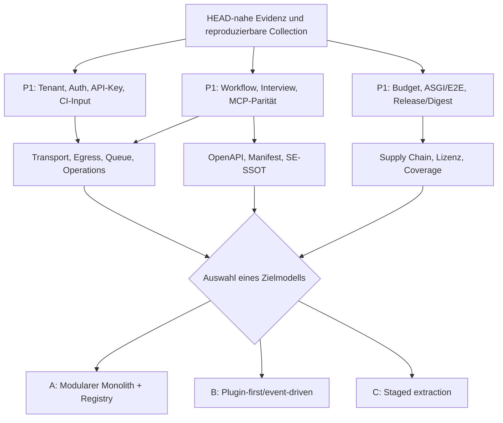

# Systemaudit 2026-09 — Remediation-Roadmap und Zielmodelle

**Zweck:** Dieser Bericht übersetzt die 47 kanonischen Tracks aus [`docs/se/reports/deep_audit/system-audit-2026-09/11-consistency-review.md`](11-consistency-review.md) in umsetzbare Arbeitsströme und stellt drei mögliche Zielmodelle gegenüber. Er ist **keine freigegebene Architekturentscheidung** und beauftragt keine Implementierung.

**Prüfbasis:** `01`–`07`, `10`, `11`, `12`; Primärbelege und offene Messungen stehen in [`docs/se/reports/deep_audit/system-audit-2026-09/09-evidence-register.md`](09-evidence-register.md). Die Severity des Basisfalls ist die kanonisierte Reconciliation, nicht eine bloße Addition der Quellberichte. Für die nachträglich validierten Kernclaims gelten die Korrekturen in [`12-evidence-validation-and-corrections.md`](12-evidence-validation-and-corrections.md). Die Bezeichnung `PROP-*` bezeichnet einen Arbeitsvorschlag und **keine bereits vergebene Ticket- oder REQ-ID**.

## 1. Leitplanken für alle Varianten

Vor einer Auswahl eines Zielmodells gelten folgende Invarianten. Sie sind keine Optionen, sondern Abbruch- oder Rückfallgrenzen:

| Invariante | Begründung / betroffene Tracks |
|---|---|
| Tenant- und RLS-Kontext wird vor geschützten DB-Lookups armiert. | `CR-02`, `CR-17`; ein `unscoped`-ORM-Filter ist keine Umgehung von PostgreSQL-RLS. |
| REST, MCP und UI sprechen einen versionierten Application-/Contract an. | `CR-05`, `CR-11`–`CR-14`, `CR-21`, `CR-22`, `CR-42`. |
| Jeder Write nennt Zielworkspace, Tenant, Actor, Version und Audit-/Event-Korrelation. | `CR-03`, `CR-04`, `CR-06`–`CR-09`, `CR-26`. |
| Workflow- und Global-Definition-Mutationen sind atomar und gegen Orphans/Versionen geprüft. | `CR-08`, `CR-09`, `CR-10`; bestehende Normbezüge `REQ-L2-WE-003` und `REQ-L2-WE-004`. |
| Outbox-INSERT, Event-Status, Webhook-Zustellung und Provider-/Worker-Capazität sind getrennte Verträge. | `CR-18`, `CR-20`, `CR-29`, `CR-32`. |
| URL-Policy wird am tatsächlichen Ausführungsrand und bei Redirects erneut geprüft. | `CR-19`; LLM-Guard allein reicht für Webhook, Memory, Honcho und Ollama nicht. |
| Ein Test-, Build- und Release-Artefakt ist commitgebunden; externe CVE-/Registry-Aussagen werden separat verifiziert. | `CR-30`–`CR-32`, `CR-38`, `CR-39`; `R10` führt keine Live-CVE-Prüfung aus. |
| Fehlgeschlagene Teildaten werden als `unavailable/degraded` sichtbar, nicht als leere, erfolgreiche Antwort. | `CR-11`, `CR-16`, `CR-40`. |

**P0-Regel:** Im Basisszenario gibt es keinen konsolidierten P0-Befund. Ein P0-Workstream wird nur eröffnet, wenn eine neue, HEAD-nahe Messung einen systemweiten Ausfall oder unmittelbaren schweren Daten-/Security-Schaden belegt. Die Roadmap priorisiert P1 vor P2; P2 und P3 dürfen einen P1-Track nicht verdecken.

## 2. Entscheidungskriterien

Vor einer Target-Architecture-Entscheidung müssen mindestens folgende Fragen beantwortet und datiert werden:

1. **Deployment:** Self-hosted Single-Tenant, Multi-Tenant-SaaS oder beide mit getrennten Betriebsprofilen?
2. **Konsistenz:** Müssen Workflow-, Baseline- und Interview-Schreibvorgänge sofort konsistent sein, oder ist ein explizites `pending`-/`degraded`-Modell akzeptabel?
3. **Plugin-Isolation:** Dürfen Drittanbieter-Plugins nur über versionierte Tools/Events arbeiten, oder sollen sie Prozesse/Netzwerk direkt kontrollieren?
4. **Betrieb:** Welche Verfügbarkeits-, Kosten-, Latenz- und Recovery-SLOs gelten für MCP, Webhooks, LLM und Importe?
5. **Compliance:** Welche Nachweise müssen für Tenant-Isolation, Backup-Restore, Review und Release revisionsgebunden vorliegen?
6. **Migrationsbudget:** Welche Reihenfolge ist mit dem verfügbaren Team- und Betriebsbudget für sechs bis zwölf Monate vereinbar?

Ohne diese Antworten wäre jede der drei Varianten eine unzulässige „fertige Entscheidung“.

## 3. Vergleich der Zielmodelle

| Zielmodell | Kurzbeschreibung | Stärkste Passung | Hauptkosten | Reversibility | Grobe Aufwandsklasse |
|---|---|---|---|---|---|
| **A — Modularer Monolith mit expliziter Tool-/Contract-Registry** | Bestehender Django-/Celery-Kern bleibt; REST, MCP, Worker und Plugins greifen ausschließlich über generierte/validierte Contracts und den Application-Service. | Schnelle P1-Schließung, geringe Betriebsneueinführung, Self-hosting. | Registry-/Ratchet-/Parity-Disziplin; nicht automatisch unabhängige Deployments. | sehr hoch: Adapter, Feature-Flags und Dual-Read möglich | M–L, ca. 4–8 Wochen für die Kernwellen |
| **B — Plugin-first/event-driven** | Versionierte Event-/Capability-Verträge und isolierte Plugins/Consumer werden zum primären Integrationsmodell; Event-Zustellung und Providerarbeit sind durch Budgets, Backpressure und Replay geschützt. | Zahlreiche Integrationsflächen, externe Agenten, unabhängige Provider-/Consumer. | Eventual Consistency, Plugin-Sandbox, Betriebs- und Versionsmatrix werden deutlich komplexer. | mittel: Shadow Events/Consumer, Version-Pinning und Adapter-Rückfall nötig | L–XL, ca. 3–6 Monate |
| **C — Staged extraction** | Zuerst Ports/Verträge und klare bounded contexts; nur belegte, betreibbare Domänen werden schrittweise extrahiert, z. B. Delivery, Import, Reporting oder Context Graph. | Unsicherheit über Produktgrenzen, unterschiedliche Skalierungs- oder Compliance-Bedarfe. | Temporäre Doppelstrukturen, Daten-/Transaktionsbrücken und zusätzliche Betriebsverantwortung. | hoch, wenn strangler Routing und Dual-Write/Compensation eingehalten werden | L–XL, ca. 2–6 Monate je erster Extraktion |

Die Aufwandsklassen sind Planungsbandbreiten, keine Zusagen. Externe CVE-/Vendorprüfung, Teamgröße und Supportmodelle sind offen.

## 4. Alternative A — Modularer Monolith mit expliziter Tool-/Contract-Registry

### 4.1 Zielbild

- Der Django-/ORM-/Celery-Kern bleibt der System of Record.
- REST, MCP, Admin-Adapter und Worker verwenden einen gemeinsamen, versionierten Contract- und Service-Seam.
- `docs/agent-templates/tool-manifest.json`, OpenAPI-Komponenten, Event-Envelopes und Workspace-/Tenant-Regeln werden als eine kontrollierte Contract-Source-of-Truth behandelt.
- Ein generierter Registry-Snapshot beschreibt Toolname, Präfix, Read/Write, Zielauflösung, Scope, Schema, Version, Auth-Metadaten und Event-/Side-Effect.
- Das Architecture-Ratchet prüft nicht nur Dateinamen, sondern direkte ORM-/Tenant-/Event-Zugriffe in Mixins, `admin_ops`, Worker und Plugins.

### 4.2 Trade-offs

**Vorteile**

- Die bestehende Application-Service-Fassade, RLS, Outbox und Deployment-Form bleiben weitgehend erhalten.
- P1-Befunde wie `CR-03`, `CR-04`, `CR-05`, `CR-08`, `CR-20` und `CR-30` lassen sich mit vertikalen Tests und einem Registry-Gate schließen.
- Ein einzelner Django-Prozess bleibt einfacher zu debuggen und für Self-Hosting zu betreiben.
- Keine sofortige verteilte Datenbank-/Event-Konsistenzentscheidung.

**Nachteile**

- Eine zentrale Registry kann zu einem neuen Monolith-Godot-Objekt werden, wenn fachliche Services darin verschwinden.
- Contract-Erzeugung allein behebt keine fehlenden Runtime-Transaktionen oder fehlenden Tenant-Kontext.
- Große Änderungen am Manifest können Release- und Agent-Pipeline blockieren; ein reproduzierbarer Generator ist Pflicht.

### 4.3 Invarianten

1. Ein Tool-/API-Contract darf nur einen autoritativen Zielworkspace-Resolver verwenden; kein Fallback auf tenant-weite Rollenunion bei Instanz-Tools.
2. Jede neue oder geänderte Operation erhält Schema, Error-Envelope, Version, Scope, `tenant_id`-/`workspace_id`-Regel und Teststatus.
3. Event-Produktion bleibt an die fachliche Transaktion gebunden; externe HTTP-/Provider-I/O erhält einen separaten, budgetierten Task.
4. Ein P1-Track ohne reproduzierbaren Negativtest bleibt offen, auch wenn der Generator grün ist.
5. Plain Models und Kindtabellen werden entweder über eine explizite Repository-/RLS-Policy geschützt oder als bewusst globale Betriebsobjekte mit eigener Invariante dokumentiert (`CR-17`).

### 4.4 Migrationspfad

| Phase | Inhalt | Abhängigkeit | Ergebnis |
|---|---|---|---|
| A0 — Baseline | `pytest --collect-only`, OpenAPI-Snapshot, Tool-Manifest, Event- und Workspace-Mapping inventarisieren. | keine | versionierter Ausgangsvergleich. |
| A1 — P1-Containment | `CR-03/04/05/08/09/20/26/45` mit gezielten Negativtests schließen; keine breite Registry-Refactorierung vor dem ersten Gate. | DB-/MCP-Testumgebung | aktive Standardpfade sind messbar. |
| A2 — Registry | Generator für Tool/OpenAPI/Event-/Auth-Metadaten; `tools/list` und `/mcp/` aus derselben Quelle. | A1 | keine manuelle Toolzahl-/Transport-Drift. |
| A3 — Boundary enforcement | Application-Service-/RLS-/Outbox-Ratchet auf Mixins, `admin_ops`, Worker und Plugin-Adapter erweitern. | A2 | Single-Entry-Point wird ausführbar. |
| A4 — Release contract | Collection-Manifest, Coverage, Typecheck, ASGI-/nginx-E2E, Lock-/Digest-/SBOM-Gate. | A1–A3 | reproduzierbarer Release-Gate. |
| A5 — Decomposition | Module innerhalb des Monolithen anhand realer Coupling-Messungen trennen, nicht anhand aspirationaler Domänengrenzen. | A4 | Grundlage für eine spätere C-Entscheidung. |

### 4.5 Reversibility

- Contract-Generatoren behalten den bisherigen Manifest-Snapshot als versionierten Input; ein fehlgeschlagener Generator blockiert Release, statt alte Clients still zu ändern.
- Registry-Felder werden additiv eingeführt und mit einem `contract_version` versehen. Alte MCP-/REST-Clients werden für einen festgelegten Zeitraum parallel bedient.
- Event-Consumer können über Feature-Flag pausiert, auf einen Shadow-Event geschrieben und anschließend replayed werden.
- Die DDL-Migration bleibt dem dedizierten `migrate`-Dienst vorbehalten; bei fehlender Least-Privilege-Kompatibilität wird nicht der Runtime-Role mehr Rechte gegeben.
- Ein Ratchet kann zunächst als Report-only laufen, bevor er blockierend wird; für P1-Sicherheitsregeln ist ein dokumentierter Endzeitpunkt Pflicht.

### 4.6 Risiken

- Registry-Overhead und Governance-Overhead können neue Integrationszyklen verlangsamen.
- Ein Generator, der nur Namen/Schemas kennt, kann die fachliche REST/MCP-Parität weiterhin nicht beweisen.
- Ein zentraler Monolith kann Skalierungs- und Deployment-Grenzen verschleiern; deshalb müssen Latenz-/Queue-/Worker-Metriken Teil des Contracts werden.
- Contract-Versionierung kann bestehende Trace-, OpenAPI- oder MCP-Clients brechen, wenn Wire-Änderungen nicht versioniert werden.

### 4.7 Aufwand und Akzeptanzkriterien

**Grobe Aufwandsklasse:** M–L für A0–A4; zusätzliche laufende Pflege für jede Contract-Änderung.

**Mindest-Akzeptanzkriterien:**

1. `docs/agent-templates/tool-manifest.json`, Live-Registry, `/mcp/`-Discovery und generierter Snapshot haben dieselbe Tool-/Präfix-/Scope-Zahl.
2. `comment.resolve` liefert bei Editor Workspace A und Kommentar Workspace B `PERMISSION_DENIED`; ein Workspace-B-Editor erhält Erfolg.
3. Ein neuer REST-/MCP-Key muss Scope, Workspace-Fence und Ablauf-/Nicht-Ablauf-Entscheidung explizit besitzen; ein alter Key wird nur über Rotation geändert.
4. Ein REST/MCP-Multi-Interview mit identischem Proposal erzeugt dieselben Artefakte, History-, Audit- und Outbox-Korrelationen.
5. Ein stale `expected_version` erzeugt 409 und keine History-Kante außerhalb des aktuellen Graphen.
6. Ein absichtlich langsamer Webhook blockiert nicht den Outbox-Poller; Queue-, Event- und Delivery-Status sind getrennt messbar.
7. Ein direkter Zugriff auf `bl_delta_index_entry` unter dem App-Role ohne passenden Tenant-Kontext ist leer/policygefiltert.
8. Architecture-/Contract-Ratchets schlagen bei einem direkten ORM-Zugriff in einem Mixin/`admin_ops`-Adapter fehl.
9. Release-Scan und Push referenzieren denselben Image-Digest; SBOM/Provenance liegen als CI-Artefakte vor.

**Vorgeschlagene Arbeitspakete (keine Ticket-/REQ-ID):**

| Vorschlag | Inhalt | Bezug |
|---|---|---|
| `PROP-A-01` | Contract-Manifest für Tools, OpenAPI, Events, Auth und Workspace-Scope generieren. | `CR-05`, `CR-12`, `CR-21`, `REQ-L2-TE-001` |
| `PROP-A-02` | Boundary-Ratchet für Mixins, `admin_ops`, Worker und Plugin-Adapter. | `CR-15`, `CR-46`, `REQ-L1-025` |
| `PROP-A-03` | Negativtest-Matrix für Tenant-Fence, API-Key-Defaults, Bearer und SSRF. | `CR-03`, `CR-04`, `CR-19`, `CR-26` |
| `PROP-A-04` | Commitgebundenes Collection-/Build-/Release-Manifest. | `CR-30`, `CR-32`, `CR-38` |

## 5. Alternative B — Plugin-first/event-driven

### 5.1 Zielbild

- Jede externe Fähigkeit wird als versioniertes Plugin-/Tool-Manifest mit Capability-Definition, Auth-/Scope-Deklaration, Input-/Output-Schema, Budget, Side-Effects und Support-/Kompatibilitätsmatrix beschrieben.
- Fachliche Änderungen publizieren versionierte Domain-Events in einer Transactional Outbox; Consumer sind idempotent, replaybar und getrennt budgetiert.
- MCP, Hermes, Webhooks, Memory, LLM und externe Analysewerkzeuge verwenden denselben Event-/Capability-Vertrag, aber nicht zwingend denselben Prozess.
- Prompt-Allow/Blocklisten werden als Guidance behandelt; die eigentliche Grenze liegt in Key-/Capability-/Tenant-Authorization und im Plugin-Host.

### 5.2 Trade-offs

**Vorteile**

- Neue Agenten-/Providerintegrationen können unabhängig vom Django-UI-Release versioniert werden.
- Outbox, DLQ, Replay, Budgets und Backpressure werden explizit und auditierbar.
- Ein einheitliches Eventformat kann die heutige doppelte `DomainEventBus`-Semantik (`CR-46`) und Providerdivergenz (`CR-22`, `CR-24`) langfristig auflösen.

**Nachteile**

- Eventual Consistency verändert die fachliche Semantik von Interview, Workflow, Baseline und Traceability.
- Plugin-Isolation, Version-Negotiation, Replay und Consumer-Kompatibilität sind erheblich komplexer.
- Ein Event-Contract kann nicht automatisch eine korrekte RLS-/Tenant-Zuordnung garantieren; Consumer brauchen expliziten Tenantkontext.

### 5.3 Invarianten

1. Event-Envelope enthält `event_id`, `event_type`, `schema_version`, `tenant_id`, `workspace_id`, `actor`, `correlation_id`, `occurred_at` und Idempotency-Key.
2. Outbox-Commit und Event-Publish bleiben atomar getrennt vom externen HTTP-/Provider-Erfolg.
3. Jeder Consumer ist replay- und duplicate-safe; Replay setzt Tenant-/RLS-Kontext vor jedem DB-Zugriff.
4. Jeder kostenpflichtige Consumer besitzt ein eigenes Budget, Queue-Limit, Timeout und Dead-Letter-Vertrag.
5. Ein Plugin darf nur deklarierte Capabilities ausführen; direkter DB-/Netzwerkzugriff ist außerhalb der Paved Road.
6. Event-/Pluginversionen werden in Manifest, CI-Artefakt und Runtime-Diagnostics ausgegeben.

### 5.4 Migrationspfad

| Phase | Inhalt | Abhängigkeit | Ergebnis |
|---|---|---|---|
| B0 — Event-Inventar | Bestehende Audit-Bus-, Outbox- und Direkt-`workflow.services`-Aufrufe erfassen. | A0 | keine verdeckten Producer/Consumer. |
| B1 — Canonical Envelope | Versioniertes Schema und Compatibility-Table einführen, zunächst nur als Shadow-Event. | B0 | alte Events bleiben lesbar. |
| B2 — Security-/Budget-Gates | Tenantkontext, API-Key-Scope, Providerquota, Queue-/SSE-Caps und URL-Policy an Consumer-Seam. | A1/A3 | keine Prompt- oder Admin-only Annahme. |
| B3 — Replay-/DLQ | Idempotency, Claim-/Retry-/DLQ und getrennte Webhook-/LLM-Tasks testen. | B1/B2 | reproduzierbare Zustell-/Fehlersemantik. |
| B4 — Plugin packaging | Hermes-/Bluepencil-/MCP-Surface-Matrix, Lockfile, SBOM und Host-Smoke. | B2/B3 | unterstützte Plugins sind eindeutig. |
| B5 — Event-first APIs | REST/MCP-Fachoperationen auf Event-/Command-Contracts umstellen, soweit Semantik dies erlaubt. | B3/B4 | gezielte, nicht blinde Vollmigration. |

### 5.5 Reversibility

- Shadow-Events werden zunächst parallel geschrieben, aber nicht von neuen Consumers als Source-of-truth verwendet.
- Jede Event-Version hat einen Unsupported-/Migrationszeitraum und einen dokumentierten Rückfall auf den bisherigen synchronen Pfad.
- Plugin-Manifests werden per Range/Hash/Signatur verpinst; ein fehlgeschlagener Consumer kann pausiert werden, ohne Tenant-Daten zu migrieren.
- Queue-/Budget-Konfiguration ist versioniert und kann für Testbetrieb zurückgesetzt werden, ohne Schemaänderung.
- Eventual Consistency darf nicht für Workflow-Approval, Tenant-Recreation oder sicherheitskritische Evidence stillschweigend eingeführt werden.

### 5.6 Risiken

- Doppelte Producer-/Consumer- und Replay-Bugs können doppelte Artefakte oder Audit-Einträge erzeugen.
- Ein zu breites Plugin-Modell kann die gegenwärtige Application-Service-Fassade umgehen.
- Externe Hermes-/Provider-SDKs sind teilweise nicht live verifiziert (`CR-24`).
- Queue-/Provider-/SSE-Kosten werden durch die höhere Zahl asynchroner Komponenten schwerer budgetierbar.

### 5.7 Aufwand und Akzeptanzkriterien

**Grobe Aufwandsklasse:** L–XL; B0–B3 vor einer produktiven Event-first-Ausweitung.

**Mindest-Akzeptanzkriterien:**

1. Jeder Event-Consumer kann mit einem Tenant-Fixture unter `SET ROLE` und leerem/gesetztem `app.current_tenant` sicher laufen oder kontrolliert ablehnen.
2. Derselbe Event zweimal geliefert erzeugt genau ein Artefakt, einen Workflow-Abschluss und eine Outbox-Korrelation.
3. Langsame Webhooks, Provider-Timeouts und Worker-Kill landen nach einem festgelegten Budget in DLQ/Retry und blockieren nicht den Events-Poller.
4. Jeder kostenpflichtige Consumer wird vor dem Provider-Request gegen Tenant-/Capability-Budget geprüft.
5. Ein inkompatibles Plugin/Event wird vor Ausführung abgewiesen; `serverInfo`/Manifest nennen die tatsächlich geladene Version.
6. CI prüft beide Hermes-Varianten, sofern beide unterstützt werden sollen; Bluepencil darf in Shared-/Produktionsprofilen nicht unbeabsichtigt aktiviert werden.
7. Ein Replay eines historischen Events erzeugt auditierbare Korrelation und keine stillen Cross-Tenant-Leaks.

**Vorgeschlagene Arbeitspakete (keine Ticket-/REQ-ID):**

| Vorschlag | Inhalt | Bezug |
|---|---|---|
| `PROP-B-01` | Versioniertes Event-Envelope und Producer-/Consumer-Register. | `CR-11`, `CR-18`, `CR-46`, `REQ-L1-024` |
| `PROP-B-02` | Plugin-Capability-, Budget- und Sandbox-Vertrag. | `CR-20`, `CR-23`, `CR-25`, `CR-29` |
| `PROP-B-03` | Idempotenz-, Replay-, DLQ- und Claim-Fault-Tests. | `CR-06`, `CR-08`, `CR-18` |
| `PROP-B-04` | Hermes-/Provider-/Bluepencil-Support- und Provenienzmatrix. | `CR-24`, `CR-25`, `CR-39` |

## 6. Alternative C — Staged extraction

### 6.1 Zielbild

- Der bestehende Monolith bleibt vorübergehend die Kontrollinstanz.
- Zuerst werden klar messbare bounded contexts über Ports und versionierte Verträge identifiziert: Webhook-/Delivery, Import, Reporting/Baseline, Context Graph, MCP-Adapter oder Metrics.
- Ein context wird erst extrahiert, wenn messbare Grenzen, Datenverantwortung, SLOs, Owner und Rollback existieren.
- Übergangsphase nutzt strangler routing, read-only Shadow-Verarbeitung und Reconciliation statt unkontrollierter Dual-Writes.

### 6.2 Trade-offs

**Vorteile**

- Die größten operativen Engpässe (`CR-18`, `CR-29`, `CR-31`, `CR-35`, `CR-37`) können unabhängig skaliert oder isoliert werden.
- Das bestehende System bleibt während der Migration stabil; Extraktion ist evidence-basiert statt architektonischer Vorliebe.
- Ein Pilot kann zeigen, ob ein Team wirklich unabhängige Services/Worker benötigt.

**Nachteile**

- Temporäre Cross-Service-Transaktionen, doppelte Modelle und verteilte Auth-/RLS-Kontexte sind teuer.
- Ein extrahierter Service verändert Backup, Monitoring, Incident Response und Support.
- Ein vorzeitiger Context-Cut kann `CR-13`/`CR-17`/`CR-26` in eine neue tenantübergreifende Lücke verwandeln.

### 6.3 Invarianten

1. Der strangler Router ist selbst versioniert, beobachtbar und fail-closed; kein stiller Fallback auf einen fremden Tenant.
2. Der neue Service besitzt eine einzige fachliche Schreibquelle; Cross-Context-Kommunikation nutzt Outbox/Events oder eine explizite Saga-/Compensation-Regel.
3. Jede read-only Shadow-Ausgabe wird mit dem alten Ergebnis und einer Toleranzregel verglichen; Divergenz blockiert den Cutover.
4. RLS/TenantContext, Key-Scope, Audit und Rate-Limits werden vor dem ersten Request des extrahierten Services getestet.
5. Ein Rollback auf den Monolithen ist ohne Datenverlust möglich, solange der neue Service keine unumkehrbare Source-of-truth übernommen hat.
6. Backup-/Restore, Version/Digest und SBOM gelten für beide Betriebsmodi.

### 6.4 Migrationspfad

| Phase | Inhalt | Abhängigkeit | Ergebnis |
|---|---|---|---|
| C0 — Context-Map | Coupling, Query-/Queue-Metriken, Verantwortungs- und SLO-Kandidaten messen. | A0/B0 | kein Architektur-Diagramm als Ersatz für Messung. |
| C1 — Contract-Port | Bestehenden Service/Adapter hinter Port-Interface und Schema-Snapshot kapseln. | C0 | Verhalten bleibt im Monolith. |
| C2 — Shadow | Neue Implementierung read-only oder in isolierter Queue parallel betreiben. | C1 | Divergenzbericht. |
| C3 — Reconciliation | Daten-/Event-/Audit-Differenzen klassifizieren; Idempotency- und Replay-Fälle testen. | C2 | belastbarer Cutover-Entscheid. |
| C4 — Canary | Kleine Tenant-/Workspace-Kohorte, Feature-Flag, Kosten-/Latenz-/RLS-Gates. | C3 | kontrollierte Produktionsexposition. |
| C5 — Source-of-Truth | Schreibpfad umstellen, Monolith-Adapter read-only/deprecated, Rollbackfenster halten. | C4 | extrahierter Context mit Rückfallpfad. |
| C6 — Decommission | Alte Jobs/Queues/Revisionen erst nach Retention-, Restore- und Incident-Nachweis entfernen. | C5 | kein Big-Bang-Cleanup. |

### 6.5 Reversibility

- Jeder Cutover erhält einen datierten Feature-Flag, Traffic-Split und ein dokumentiertes Rückfallkommando.
- Vor C5 bleibt der alte Schreibpfad für den Canary-Bereich verfügbar; nach C5 muss der Rollback eine definierte Reconciliation ausführen, nicht nur den Router umschalten.
- Datenbankänderungen folgen Expand/Contract und sind erst nach Rückwärtskompatibilitätsfenster umsetzbar.
- Outbox-Events behalten `correlation_id` und eine versionierte Payload, sodass ein Consumer-Retry nach Rückfall dedupliziert werden kann.
- Backup-Restore wird für beide Source-of-truths getestet, bevor ein Monolith-Service als abgeschaltet gilt.

### 6.6 Risiken

- Der höchste Risikofaktor ist die vorübergehende verteilte Daten- und Auth-Komplexität.
- Ein Extract kann die P1-Authorization-Lücke nur verschieben, wenn Tenant-/RLS- und Budgetverträge nicht Teil des Ports sind.
- Canary-Daten können fachlich korrekt, aber regulatorisch unvollständig sein, wenn Audit-/Review-Events nicht mitgeschrieben werden.
- Betriebs- und Incident-Kosten steigen vor dem ersten messbaren Nutzen.

### 6.7 Aufwand und Akzeptanzkriterien

**Grobe Aufwandsklasse:** L–XL für den ersten Context; spätere Extraktionen sind separat zu schätzen.

**Mindest-Akzeptanzkriterien:**

1. Ein Coupling-/SLO-Report begründet den ausgewählten Context; es gibt keine rein architektonische Begründung.
2. Shadow- und Legacy-Ausgabe stimmen für definierte Fixtures innerhalb einer schriftlich freigegebenen Toleranz überein.
3. Ein getesteter Canary-Tenant kann ohne Cross-Tenant-Leak, Budget- oder RLS-Fehler operieren.
4. Nach Cutover erzeugt ein Retry/Worker-Kill keine doppelten Artefakte, Events oder Audit-Einträge.
5. Der Monolith-Fallback ist für die vereinbarte Rückfallzeit getestet; Datenverlust ist ausgeschlossen.
6. Backup-Restore, SLO-/Queue-Alarm, Version/Digest und SBOM gelten für den extrahierten Context.
7. Eine dokumentierte Kill-/Decommission-Entscheidung ersetzt die technische Fähigkeit zum Rückbau.

**Vorgeschlagene Arbeitspakete (keine Ticket-/REQ-ID):**

| Vorschlag | Inhalt | Bezug |
|---|---|---|
| `PROP-C-01` | Context-/Coupling-Inventar und SLO-Messung. | `CR-35`, `CR-39` |
| `PROP-C-02` | Port-/Schema-/Shadow-Contract für den ersten Kontext. | `CR-11`, `CR-12`, `CR-16` |
| `PROP-C-03` | Canary-/Rollback-/Reconciliation- und RLS-Testmatrix. | `CR-02`, `CR-17`, `CR-26`, `CR-37` |
| `PROP-C-04` | Decommission-Gate für alte Jobs, Queues und Credentials. | `CR-01`, `CR-18`, `CR-28` |

## 7. Priorisierte Workstreams und Abhängigkeiten



### Wave 0 — Evidenz und Containment (vor Strukturentscheidung)

- `E-01`: HEAD-nahe Collection-/Schema-/Testinventar und Commit-Fingerprint.
- `E-02`: `CR-03/04/26/45` mit Negativtests und Security-Review schließen.
- `E-03`: aktuellen Compose-/Django-/ASGI-/Redis-Startup und Restore in einer isolierten Umgebung archivieren.
- `E-04`: P0-Reassessment; kein P0-Ticket ohne bestätigten HEAD-Beleg.

### Wave 1 — Korrektheit und Standardverträge (P1 vor P2)

- `W-01`: Interview- und Workflow-Atomizität (`CR-06`–`CR-09`).
- `W-02`: REST/MCP-Interviews und Workspace-Sprachquelle (`CR-05`, `CR-13`).
- `W-03`: LLM-/Provider-Budget und Egress-Policy (`CR-19`, `CR-20`).
- `W-04`: OpenAPI-/Manifest-/Toolvertrag (`CR-12`, `CR-21`).
- `W-05`: ASGI-/Redis-/nginx-E2E und echte CI-Collection (`CR-30`, `CR-31`).

**Abhängigkeit:** W-01–W-04 benötigen E-01; W-05 benötigt einen stabilen Postgres-/Redis-/ASGI-Testpfad. P1-Tests werden vor P2-Dokumentations-/Coverage-Ausbau verpflichtend.

### Wave 2 — Betrieb und Release-Nachweis (P1/P2)

- `W-06`: Outbox/Webhook-Delivery trennen, Queue-/SSE-/Upload-/Health-Caps (`CR-18`, `CR-29`, `CR-44`).
- `W-07`: Lock-/Digest-/SBOM-/Provenance-/Restore-Kette (`CR-32`, `CR-37`–`CR-39`).
- `W-08`: vollständige Migration-/Typecheck-/Coverage-Baseline (`CR-34`, `CR-36`).
- `W-09`: Boundary-Ratchet und Event-Bus-Naming (`CR-46`).

### Wave 3 — Verträge, SE-Evidenz und Frontend-AA

- `W-10`: `CR-11`, `CR-14`–`CR-17`, `CR-42`, `CR-47` als eine versionierte SSOT-/Review-Kette.
- `W-11`: `CR-40/41` mit Browser-, Reflow-, Keyboard-, Axe- und Screenreader-Matrix.
- `W-12`: historische SSOT-/Archivberichte mit Gültigkeitsmarkern versehen, ohne sie umzuschreiben.

### Quick Wins innerhalb der Waves

`QUICK-01` bis `QUICK-07` aus [`docs/se/reports/deep_audit/system-audit-2026-09/README.md`](README.md) sind kleine, reversible Vorarbeiten. `QUICK-01` ist ein P1-Containment; die übrigen ersetzen keine P1-Sicherheits-/Korrektheitskorrektur.

## 8. Ticket-/REQ-Vorschläge und bestehende Bezüge

Die folgenden Namen sind **Vorschläge für die nächste Planung**, keine behaupteten neuen Requirements. Bestehende REQ-IDs werden nur als normative Bezugsquellen aus den Berichten genannt.

| Arbeitspaket | Vorschlag für Ticket-/REQ-Arbeit | Bestehender Bezug aus den Berichten |
|---|---|---|
| Tenant-/Key-Härtung | `PROP-P1-KEY-01`: sichere Neuschlüssel-Defaults, Rotation, `authz_version` und Negativtests. | `REQ-L1-025`, `REQ-178`; `CR-03`, `CR-26` |
| Workflow-Konkurrenz | `PROP-P1-WF-01`: `expected_version` bis Lock und atomare Re-Validierung. | `REQ-L2-WE-003`; `CR-08` |
| Global-Definition | `PROP-P1-WF-02`: ein atomarer Definitions-/Propagation-Service mit Orphan-Gate. | `REQ-L2-WE-004`, `REQ-170`; `CR-09/10` |
| Trace-Link-Vertrag | `PROP-P2-TE-01`: katalogbasierte Write-Fassade und Cross-Type-Cycle-Policy. | `REQ-L2-TE-001/002/003`; `CR-15` |
| Baseline/VCRM | `PROP-P2-TE-02`: Snapshot-Vertrag oder ehrlicher `unsupported`-Status. | `REQ-L2-TE-013`; `CR-16` |
| SE-Evidenz | `PROP-P2-SE-01`: kanonische Statusquelle, `review_id` und Testlauf-Hash. | `REQ-L1-009`, `REQ-L1-012`, `REQ-L1-030`; `CR-47` |
| Security/CI | `PROP-P1-SEC-01`: Bearer-Revalidierung, Input-Indirektion und Action-SHA-Pins. | `CR-19/20/26/45` |
| Release | `PROP-P1-REL-01`: Test-vor-Image, ein Digest, SBOM/Provenance und Restore-Smoke. | `CR-30/31/32/37/38` |

Bevor ein Vorschlag in eine Requirements-Datei oder ein Issue übernommen wird, muss der Eigentümer die Scope-Grenze, den Testbeleg und den Rückfall explizit bestätigen. Diese Roadmap nimmt keine Änderung an [`docs/REQUIREMENTS.md`](../../../../REQUIREMENTS.md) vor.

## 9. Reversibility- und Abbruchkriterien für die Auswahl

### Abbruch oder Neustart eines Migrationsschritts

- Ein P1-Negativtest schlägt nach zwei Korrekturzyklen weiterhin fehl.
- Tenant-/RLS-, Audit- oder Outbox-Korrelation ist im Shadow-Vergleich nicht eindeutig.
- Ein Release-Digest, Restore-Nachweis oder Capability-/Queue-Gate ist nicht reproduzierbar.
- Ein Plugin-/Event-Consumer erzeugt doppelte Artefakte oder kostenpflichtige Calls ohne Quota.
- Der Rückfallpfad ist nicht im selben Testumfang wie der Vorwärtspfad verifiziert.

### Nicht als Entscheidung zu verstehen

Ein fehlender P0-Befund, ein grüner einzelner Unit-Test oder ein historischer Release-Bericht ersetzen keine Target-Architecture-Entscheidung. Die drei Modelle bleiben Alternativen; diese Datei trifft keine Auswahl.

## 10. Abschlussstatus

```text
STATUS: done
RESULT: Die Roadmap stellt drei umsetzbare Zielmodelle gegenüber, definiert Invarianten, Reversibility, Aufwand, Akzeptanzkriterien und konkrete Arbeitspaket-Vorschläge. P1-Standardpfade und Release-Nachweise werden vor P2 priorisiert; es wurde keine fertige Zielarchitektur als Entscheidung ausgegeben.
ARTIFACTS: docs/se/reports/deep_audit/system-audit-2026-09/08-remediation-roadmap-and-alternatives.md
```
