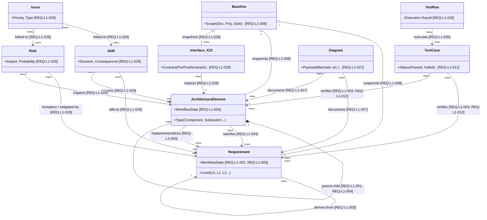
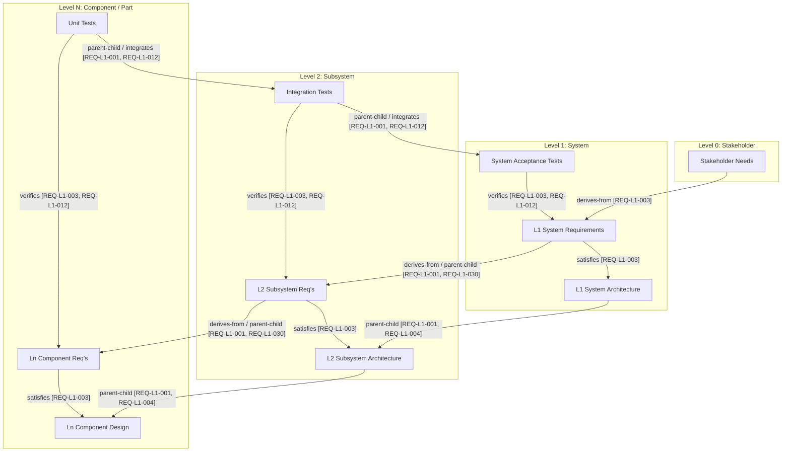

# ReqFlow: Vertiefte Artefakt-Ontologie & Systems Engineering Analyse

Diese erweiterte Analyse taucht tiefer in die Artefakt-Ontologie von ReqFlow ein, referenziert alle maßgeblichen Anforderungen (REQ-IDs) direkt an den Entitäten und Kanten und unterzieht das Modell einem kritischen "Challenge"-Prozess aus Sicht der Systems-Engineering-Disziplin. Abschließend wird eine Gap-Analyse auf Stakeholder-Ebene (L0) durchgeführt.

## 1. Detaillierte Ontologie & Relationen (mit REQ-Mapping)

Das folgende Klassendiagramm visualisiert die System-Ontologie. **Jede Kante (Relation) und jede Entität** ist mit der zugehörigen Anforderungs-ID (z. B. `REQ-L1-003` für Traceability) versehen, um lückenlose Nachvollziehbarkeit zu garantieren.

---

## 2. Rekursive Systemebenen (1-N Herunterbruch)

Ein zentraler Bestandteil des Systems Engineerings ist die rekursive Dekomposition des Systems (Das V-Modell über mehrere Ebenen). ReqFlow implementiert dies durch die Anforderung `REQ-L1-001 (Artefakt-Hierarchie mit beliebiger Tiefe)` und `REQ-L1-030 (Projektübergreifende Traceability)`.

### Der 1-N Ebenen-Herunterbruch

Das folgende Diagramm zeigt die Kaskade über N-Ebenen, bei der jede Ebene (Level) die linke (Requirements & Architektur) und rechte Seite (Test & Integration) des V-Modells abbildet.

### Charakteristiken der 1-N Dekomposition in ReqFlow
1. **Unendliche Rekursion (`REQ-L1-001`)**: Das System beschränkt die Tiefe nicht künstlich. `parent-child`-Links können für Requirements und Architecture Elements beliebig tief verschachtelt werden (z. B. System → Subsystem → Assembly → Component → Part). Zyklen werden automatisch erkannt und blockiert.
-> * ** Feedback:**: In der Aktuellen Umsetzung kann ich diese Verschachtelung kaum erkennen, alles Wirkt in der UI wie eine Ebene. Ich will aber daher eine möglichkeit eine Flache ansicht und eine Ebenen Anicht zu realisieren! Und das gilt von Anforderung,m übner Architektur  test etc. Alle Arktefakte sollen in einem Workspace auch ion einem Ebenennview dargestellt und auch verfolgt werden können
2. **Horizontaler Contract (ICDs) auf jeder Ebene (`REQ-L1-028`)**: Auf Ebene N kommunizieren Architektur-Elemente miteinander. Diese Kommunikation wird pro Ebene durch versionierte Interface Control Documents (ICDs) abgesichert.
-> * ** Feedback:**: Laut SysEng kommunizoieren Systeme innerhalb einer Ebene über die Ebene N-1. lege diesen Need noch viel tiefer. 
3. **Projektübergreifende Kaskadierung (`REQ-L1-030`)**: In großen Enterprise-Programmen liegen L1 und L2 oft in unterschiedlichen Teams/Projekten. ReqFlow ermöglicht den Cross-Project-TraceLink. Die L2-Anforderung in "Projekt B" verweist mit `derives-from` auf die L1-Anforderung in "Projekt A". Da muss im einklang REQ-L1-001 stehenn

---

## 3. Ontologie Challenges & Architektur-Kritik

Die tiefe Analyse der Anforderungen zeigt einige strukturelle Herausforderungen und Design-Entscheidungen auf, die an den Kanten der Ontologie entstehen.

### Challenge 1: Risiko-Mitigation vs. Anforderungsableitung (REQ-L1-029)
* **Status Quo:** Risiken werden als eigene Artefakte erfasst und via TraceLinks mit Requirements/Architektur verknüpft.
* **SE Challenge:** In striktem Systems Engineering führt eine Risiko-Mitigation zwingend zur Entstehung *neuer* abgeleiteter Systemanforderungen (Safety Requirements).
* **Lösung in ReqFlow:** Die Traceability-Engine (`ARCH-L1-007`) muss Cross-Entity-Links (`Risk → Requirement`) zulassen und in Impact-Analysen gesondert ausweisen (z.B. "Unmitigierte Risiken").

### Challenge 2: ICDs als Verträge vs. reine Graphen-Kanten (REQ-L1-028)
* **Status Quo:** ICDs werden durch `IcdManagement` als versionierte Verträge gepflegt und über einen `realizes`-TraceLink verknüpft.
* **SE Challenge:** Wenn sich ein ArchitectureElement ändert, muss das ICD validiert werden.
* **Lösung in ReqFlow:** Das Architektur-Dokument legt fest, dass ICDs *echte versionierbare Entitäten* sind. Dies erlaubt Design-by-Contract mit Breaking-Change-Detection auf jeder N-Ebene.

### Challenge 3: Cross-Project Traceability & Systemrekursion (REQ-L1-030)
* **Status Quo:** ReqFlow erlaubt projektübergreifende Verlinkungen innerhalb desselben Tenants.
* **SE Challenge:** Baseline-Konsistenz bricht an Projektgrenzen.
* **Lösung in ReqFlow:** Die "Global"-Baseline löst dieses Problem. Auf Einzelprojektebene müssen Cross-Project-Links in der API-Antwort markiert werden, damit AI-Agenten wissen, ob sie Kontextgrenzen überschreiten.

### Challenge 4: V-Modell Schluss und Test Run Protokollierung (REQ-L1-035)
* **Status Quo:** TestCase verifiziert Requirement. TestRuns erfassen die Ausführung.
* **SE Challenge:** Die Coverage muss zwischen "Design Coverage" und "Execution Coverage" unterscheiden.
* **Lösung in ReqFlow:** Die Unterscheidung zwischen `TestCase` (Design) und `TestRun` (Ausführung) löst dieses SE-Problem. CI/CD Pipelines speisen via `test.record_result` (`REQ-L1-036`) den Ausführungsnachweis zurück.

---

## 4. Gap-Analyse: Fehlende Stakeholder Needs (L0)

Obwohl ReqFlow bereits 29 Stakeholder Needs (`SN-01` bis `SN-29`, inkl. Backlog) definiert, fehlen aus Sicht eines Enterprise-Ready Systems Engineering Frameworks noch folgende zentrale Konzepte auf Ebene L0:

> [!WARNING]
> **Identifizierte Lücken auf Stakeholder-Ebene (L0)**

### Gap 1: Suspect Linking / Änderungsmarkierung
* **Fehlendes Need:** Wenn sich eine übergeordnete Anforderung (`Requirement L1`) ändert, müssen alle abgeleiteten Anforderungen (`Requirement L2`) und verknüpften `Test Cases` automatisch als "suspect" (prüfbedürftig) markiert werden. Traceability zeigt aktuell nur die *Existenz* einer Kante, aber nicht, ob der Inhalt an beiden Enden der Kante noch konsistent zueinander ist.
* **Empfehlung:** Neues `SN-30: Suspect-Link-Propagierung` definieren.
* ** Feedback:** JA BITTE AUFNHEMEN!

### Gap 2: Produktlinien- & Variantenmanagement (PLE)
* **Fehlendes Need:** Große Hardware/Software-Projekte entwickeln oft eine 150%-Architektur. Einzelne Projekte leiten sich als 100%-Varianten (z.B. durch Feature-Flags) davon ab. ReqFlow unterstützt aktuell keine Variantenverwaltung (z.B. "Dieses Requirement gilt nur für Modellvariante X").
* **Empfehlung:** Neues `SN-31: Varianten- und Produktlinien-Management` definieren.
* ** Feedback:** Backlog , low Prio!

### Gap 3: Projekt-Glossar / Semantisches Data-Dictionary
* **Fehlendes Need:** Eine zentrale, maschinenlesbare Definition von Begriffen und domänenspezifischem Vokabular. Dies ist extrem wichtig, damit AI-Agenten (die Validierung betreiben, vgl. `REQ-L0-007`) Begriffe nicht halluzinieren, sondern gegen ein hart definiertes Projekt-Glossar prüfen.
* **Empfehlung:** Neues `SN-32: Semantisches Projekt-Glossar` definieren.
* ** Feedback:** JA BITTE AUFNHEMEN!

### Gap 4: Branching, Merging & Sandboxing
* **Fehlendes Need:** Systems Engineers müssen oft ein Subsystem "auschecken", isoliert (Sandbox) bearbeiten, durchdenken und dann kontrolliert wieder in den Haupt-Branch (Main) "mergen". ReqFlow kennt Baselines (Snapshots), aber kein paralleles Branching-Konzept für Artefakte.
* **Empfehlung:** Neues `SN-33: Isolierte Sandboxes (Branch & Merge für Requirements)` definieren.
* ** Feedback:** JA BITTE AUFNHEMEN! -> ggf in der Componenten-Umsetzung ggf durch einen internen Git-Mechanismus? müssen wir Prüfen!

### Gap 5: Disaster Recovery & Daten-Portabilität (Admin-Sicht)
* **Fehlendes Need:** Es gibt zwar Projekt-Exporte (CSV/JSON/ReqIF), aber Admins benötigen automatisierbare Wege, um ganze Instanzen (inklusive Audit-Trails, Nutzern und Passwörtern) zu sichern und wiederherzustellen.
* **Empfehlung:** Neues `SN-34: Instanz-Backup & Disaster Recovery` definieren.
* ** Feedback:** JA BITTE AUFNHEMEN! Inkl. Versionsvergleich von Elementen Elemententypen und ganzen Baseline vergleichen. Und Möglichkeit Baseline zurückzuspielen

## 5. Fazit der Deep-Dive Analyse
ReqFlow bietet durch die Entkoppelung von **Artefakt-Lifecycle (WorkflowEngine)**, **Graphen-Beziehungen (TraceabilityEngine)** und **Vertragsverwaltung (IcdManagement)** eine bemerkenswert tiefe und SE-robuste Architektur. Die 1-N Kaskadierung wird durch das unlimitierte Hierarchie-Modell (`REQ-L1-001`) und projektübergreifende Links (`REQ-L1-030`) ideal in der Ontologie abgebildet. Um jedoch im High-End-Enterprise-Markt (z. B. Automotive) zu konkurrieren, müssen die identifizierten Gaps (insb. **Suspect Linking** und **Variantenmanagement**) in das Stakeholder-Backlog aufgenommen werden.
