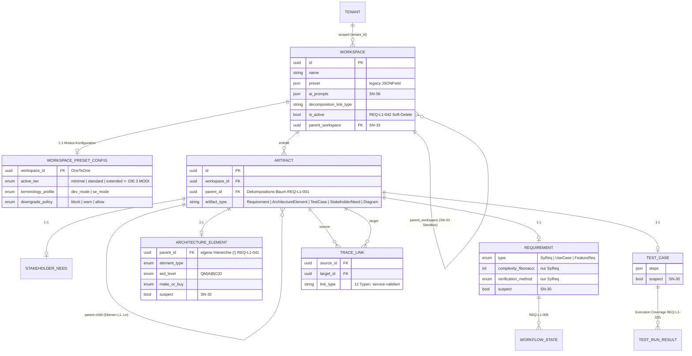

# Workspace-Modi: ER-Modell & SE-Konformitätsprüfung

> Basiert auf `reqflow_ontology_analysis.md` und dem realen Datenmodell
> (`backend/persistence/models.py`, `backend/presets/`). Stand: 2026-07-07.

## 1. Die drei Modi eines Workspace

Ein Workspace hat **einen aktiven Modus** (Preset-Tier), persistiert in
`WorkspacePresetConfig.active_tier` (1:1 zu `Workspace`). Orthogonal dazu das
Terminologie-Profil (`dev_mode` / `se_mode`), das Labels und SE-Rigor steuert.

| Modus | Pflichtfelder (Requirement) | Baselines | Workflows | Change-Reason | Invarianten (REQ-L1-044) |
|---|---|---|---|---|---|
| **minimal** | title | — | fixed | optional | I3 |
| **standard** | + description, acceptance_criteria, priority | document, project | partial | optional | I1, I2, I3 |
| **extended** | + classification, traceability_target, change_reason | + global | full | mandatory | I1–I4 |

Quelle: `presets/registry.py` (immutable, ADR-PC-02 — Regeln in Code, nie in DB).

## 2. ER-Modell

### Modus-Gating (welcher Modus sieht/erzwingt was)

Der Modus ändert **nicht das Schema**, sondern gated Verhalten:

- **Sichtbarkeit (UI):** `PRESET_VISIBILITY` (`frontend/src/types/index.ts`) —
  minimal blendet Baselines, ADR/Risk/Issue, ICDs, Diagramme, Metriken, TestCases aus.
- **Pflichtfelder & Features (Backend):** `FeatureGateService` (`presets/gate.py`).
- **Strukturinvarianten:** `ArchitectureElementInvariantValidator` — I4
  (allocated-to nicht auf Vorfahren) nur in `extended`.
- **Terminologie:** `TERMINOLOGY_LABELS` — se_mode: System/Subsystem/Component,
  dev_mode: Epic/Story/Task.

## 3. SE-Konformitätsprüfung (SE-Modus)

Geprüft: Ist das Datenmodell im SE-Modus (`terminology_profile=se_mode`,
typisch mit Tier `extended`) tatsächlich SE-konform?

### Konform ✅

1. **Rekursive 1-N-Dekomposition** (REQ-L1-001): `Artifact.parent` als
   unbegrenzter Baum, Zyklen via I1 blockiert (standard+).
2. **Design vs. Execution Coverage** (REQ-L1-035): `TestCase` (Design) vs.
   `TestRun`/`TestRunResult` (Ausführung) getrennt — V-Modell-Schluss korrekt.
3. **Suspect-Flags** (SN-30) auf allen vier Kern-Entitäten mit
   Downstream-Propagierung (`TraceLinkService.propagate_suspect_status`).
4. **Kontrolliertes Link-Vokabular**: 12 Link-Typen als Enum
   (`traceability/types.py`), service-validiert.
5. **Allokations-Invariante I4** (REQ-L1-044) rigor-gated auf extended.

### Nicht konform ❌ (Findings)

| # | Finding | SE-Regel | Status |
|---|---|---|---|
| F1 | **Link-Typen ohne Endpunkt-Semantik**: `verifies` zwischen zwei Requirements, `satisfies` von TestCase auf Diagram etc. wird akzeptiert — nur der Typ-String wird validiert, nicht die Richtung/Endpunkt-Typen. | `verifies` nur TestCase→Req/Arch; `satisfies` nur Arch→Req bzw. Req→Need; `derives-from` nur Req→Req/Need; `allocated-to` nur Req/Arch→Arch; `parent-child`/`copy-of` nur typgleich. | **BEHOBEN** — SE-Semantik-Matrix `SE_LINK_SEMANTICS` in `traceability/types.py`, Enforcement in `TraceLinkService.create_trace_link` (nur im se_mode), UI-seitig gefilterte Auswahl in `TraceLinksForm`. |
| F2 | **Doppelte Hierarchie**: `Artifact.parent` UND `ArchitectureElement.parent` sind unabhängige Bäume — Konsistenz zwischen beiden wird nirgends erzwungen (Ebene aus `ArchitectureElement.parent` abgeleitet, Traceability läuft über `Artifact`). | Genau eine Quelle der Wahrheit für die Dekompositionsebene. | Offen — Empfehlung: `ArchitectureElement.parent` als Projektion auf `Artifact.parent` synchronisieren oder deprecaten. |
| F3 | **Suspect am Knoten, nicht an der Kante**: Bei 5 Upstream-Links eines Requirements ist nicht erkennbar, *welche* Beziehung suspekt ist (DOORS-Semantik: Link-Suspect). | Suspect-Flag pro TraceLink. | Offen — braucht Migration (`TraceLink.suspect` + `suspect_since`). |
| F4 | **Frontend/Backend-Divergenz RequirementType**: Frontend bietet `SWReq`/`HWReq` an (`RequirementForm.tsx`), Backend-Choices sind `SyReq|UseCase|FeatureReq` (Migration 0020). | Ein kontrolliertes Vokabular. | Offen — Produktentscheid nötig, welche Menge gilt. |
| F5 | **ICD-Kommunikation über Ebene N-1** (Feedback in Ontologie-Doku): Peer-Kommunikation auf Ebene N müsste über das Interface der Ebene N-1 laufen; aktuell keine strukturelle Prüfung. | Interface-Disziplin über Elternebene. | Offen — Kandidat für Invariante I5 (extended). |

### Umgesetzte Verbesserung (F1)

Im SE-Modus erzwingt der TraceLinkService jetzt die semantische
Endpunkt-Matrix; unbekannte Artefakttypen (z. B. ICD-Artefakte) bleiben
erlaubt (permissive default, kein Bruch bestehender Seeds). Die UI filtert
im SE-Modus die Link-Typ-Auswahl passend zu Quelle/Ziel und zeigt einen
SE-Modus-Hinweis. Im dev_mode bleibt alles unverändert (kein Breaking Change).
