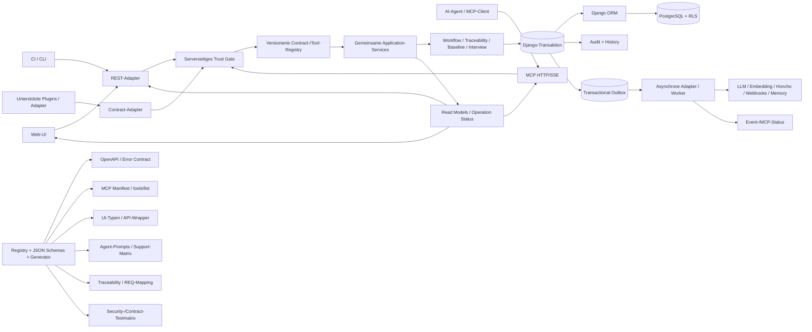

# Systemaudit 2026-09 — Finaler motivationsorientierter Verbesserungsplan

## 0. Zweck, Geltung und Lesehinweise

Dieser Plan entscheidet **die Zielrichtung für die weitere Verbesserungsarbeit**. Er ist ausdrücklich **keine Beschreibung eines bereits vorhandenen Produktversprechens**, keine Freigabe des geprüften Releases und keine Behauptung, dass die genannten Wellen bereits umgesetzt oder getestet wären.

**Verbindliche Planungsentscheidung:** ReqogniLoom bleibt technisch ein zentraler Django-Kern mit zentraler, versionierter Contract-/Tool-Registry. REST, Web-UI, MCP und unterstützte Plugins/Automationen greifen über denselben Application-Service auf die Fachlogik zu. Es gibt weder eine Big-Bang-Extraktion noch ein plugin-first- oder event-first-Modell als aktuelles Hauptziel.

**Maßgebliche Evidenzregel:** Für die zwölf nachgeprüften Kernclaims gilt Bericht `12` vor `11`, `09`, `08` und der Audit-`README`. Bericht `12` korrigiert insbesondere die Reichweite von `CR-09`, `CR-20` und `CR-45`. Historische Testzahlen, Runtime-Beobachtungen und externe CVE-/Registry-Aussagen der Quellberichte werden nicht als aktuelle, gemeinsam verifizierte Evidenz ausgegeben.

### 0.1 Begriffe

- **Application-Service:** Die gemeinsame fachliche Fassade. Nur sie orchestriert Domain-Services, Transaktionen, Audit, Berechtigungen und externe Aufträge.
- **Contract-SSOT:** *Single Source of Truth*, also eine einzige autoritative, versionierte Beschreibung eines öffentlichen Vertrags.
- **Fail-closed:** Ein unsicherer, unvollständiger oder widersprüchlicher Zustand wird abgewiesen, statt mit einer großzügigen Annahme fortzufahren.
- **RLS:** *Row-Level Security* in PostgreSQL; Datenbankseitige Mandantentrennung.
- **Outbox:** Eine in derselben Datenbanktransaktion geschriebene Zustellungsnotiz. Sie trennt eine erfolgreiche fachliche Mutation von einer späteren externen Zustellung.
- **Idempotenz:** Wiederholung derselben fachlichen Absicht erzeugt kein zweites unerwartetes Ergebnis.
- **Drift:** Unbeabsichtigte Abweichung zwischen zwei Versionen derselben Tatsache, etwa OpenAPI, MCP-Manifest, UI-Typen und Dokumentation.
- **Digest/SBOM:** Eine kryptografische Image-Kennung beziehungsweise eine maschinenlesbare Liste der enthaltenen Softwarekomponenten.
- **QS:** Qualitätssicherung und Qualitätssicherungsumgebungen; QS-only bedeutet ausdrücklich „nicht als produktionsreif deklariert“.

---

## 1. Decision Record

### 1.1 Entscheidung

**Entschieden als Planungsentscheidung, nicht als bestehendes Produktversprechen:**

1. Alle bekannten Integrationen außer **Bluepencil** werden für den ersten belastbaren Release vorgesehen; sie gelten nur dann als Release, wenn ihre jeweilige Support-, Trust-, Contract- und Testmatrix grün ist. Bluepencil bleibt **ausschließlich QS-only, standardmäßig aus** und ist kein produktionsreifer Bestandteil.
2. Self-hosted/QS ist das erste Referenzprofil; Multi-Tenant-SaaS folgt mit denselben Kernverträgen und eigenen Nachweisen.
3. Die Konsistenzregel ist **hybrid**: fachlicher Kern, History, Audit und Outbox-Intent werden synchron und atomar geschrieben; externe I/O und Provider-Aufrufe laufen asynchron mit sichtbaren Zuständen `pending`, `degraded`, `retrying`, `succeeded` oder `failed`.
4. Die eigentliche Trust Boundary liegt **ausschließlich serverseitig**. Schlüssel, Tenant, Workspace, aktuelle Rolle und Capability werden serverseitig strikt geprüft. Prompt- und Header-Allowlisten sind Governance-/Bedienhinweise, niemals Autorisierungsquellen.
5. Evidenz wird gestuft und pro Welle vollständig: Collection plus Security-Negativtests in jeder Welle; vor externer Freigabe zusätzlich Runtime, Restore, Digest-/SBOM-Kette und definierte A11y-Matrix. Ein externes SLO wird erst nach einer QS-Baseline festgelegt.
6. Die technische Grundrichtung ist ein **zentraler Django-Kern mit zentraler versionierter Contract-/Tool-Registry**. REST, UI, MCP und Plugins verwenden denselben Application-Service. Eine Big-Bang-Extraktion, plugin-first oder event-first ist nicht das aktuelle Ziel.
7. Registry plus deterministischer Generator bilden den Contract-SSOT. OpenAPI, MCP-Manifest, UI-Typen, Agent-Prompts und Traceability werden daraus erzeugt oder zumindest gegen dieselbe Quelle geprüft.
8. Kostenkontrolle ist **standardmäßig beratend**; eine strikte profilabhängige Durchsetzung ist konfigurierbar. Health-, Memory- und weitere Cross-Cutting-Kosten werden sichtbar gemacht.
9. Bestehende Agent-/API-Keys werden **nicht ungefragt stillschweigend gelöscht oder verändert**. Sie werden inventarisiert, mit Rotationsfrist und Audit versehen. Neue Agent-/Automation-Keys werden fail-closed erzeugt.
10. Alte Contracts und Legacy-Keys erhalten ein **3-Monats-Migrationsfenster**; danach ist die Restabwägung datiert und verantwortlich zu dokumentieren.
11. Beide Hermes-Varianten (TypeScript und Python) sind für den Release verpflichtend, sofern Build-, Install-, Auth-, Timeout- und Tool-Smokes grün sind; andernfalls bleiben sie Preview/QS.
12. Die Teamgröße ist noch offen; der Plan verwendet deshalb Meilensteine und keine verbindliche Kalenderzusage.

### 1.2 Kontext und Motivation

Die Auditberichte erkennen tragfähige Grundlagen: REST und MCP sind als Adapter auf einen gemeinsamen Application-Service ausgerichtet, Tenant-Isolation ist auf ORM- und PostgreSQL-RLS-Ebene vorgesehen, eine Transactional-Outbox existiert, und mehrere Contract- und Architecture-Ratchets schützen einzelne Pfade.

Gleichzeitig ist der geprüfte Stand nicht als konsistenter Release-Gate freigabefähig. Die wichtigsten Gründe sind:

- gemischte Berichtsrevisionen und fehlende einheitliche HEAD-nahe Test-/Runtime-Evidenz;
- nicht durchgängig serverseitig gehärtete Tenant-, Workspace-, Rollen- und Capability-Grenzen;
- nicht atomare oder nicht idempotente Standardpfade in Workflow und Interview;
- mehrere Contract-SSOTs für REST, MCP, UI, Agent-Prompts und Dokumentation;
- unvollständige CI-/Live-Integration-/ASGI-/nginx-Nachweise;
- fehlende digestgebundene Release-, SBOM-, Provenienz- und Restore-Kette;
- UX-/Accessibility-Barrieren sowie fehlende vollständige Screenreader-Evidenz.

Der Plan reagiert nicht auf eine einzelne Schlagzeilenzahl, sondern auf die Kombination aus Vertrauen, Nachvollziehbarkeit, Agentennutzung, Multi-Tenancy, Bedienbarkeit, QS-Reife und Wartbarkeit.

### 1.3 Gewählte Alternative und Trade-offs

**Gewählt: modularer Django-Kern mit expliziter Contract-/Tool-Registry.**

| Trade-off | Vorteil | Nachteil / Gegenmaßnahme |
|---|---|---|
| Kern bleibt zentral | Schnellere P1-Schließung, einheitliche Transaktionen, einfacheres Self-Hosting | Skalierungsgrenzen können verdeckt werden; Coupling-, Queue- und Latenzmetriken werden Teil der Evidenz |
| Registry als SSOT | Weniger Drift zwischen REST, MCP, UI, Prompts und SE-Nachweis | Governance-Overhead; Registry darf nur Metadaten und Verträge enthalten, keine Fachlogik und kein zentrales Sammelobjekt |
| Asynchrone externe I/O | Kerntransaktionen bleiben schnell; Retries und Providerfehler sind beobachtbar | Fachliche Endzustände werden nicht mehr fälschlich als sofort erfolgreich dargestellt; sichtbarer Status ist Pflicht |
| Zwei Betriebsprofile | Selbsthosting/QS und SaaS erhalten unterschiedliche Defaults und Nachweise | Konfigurationsmatrix wächst; gemeinsame Kernlogik und gemeinsame Basisverträge verhindern Code-Forking |
| Keine Big-Bang-Extraktion | Geringeres Betriebs- und Datenrisiko | Langfristig können lokale Kopplungen bleiben; Extraktion wird erst nach messbarem Bedarf als latere Option behandelt |

### 1.4 Konsequenzen

**Positive Konsequenzen**

- REST, MCP, UI und Plugins erhalten denselben fachlichen Sicherheits- und Konsistenzvertrag.
- Sicherheits- und Korrektheitsprobleme werden an einem serverseitigen Seam testbar.
- Audit, History, Outbox und Providerstatus können über Korrelations-IDs nachvollzogen werden.
- Externe Agenten erhalten ehrliche, versionierte Tools statt wechselnder Zahlen, Phantomtransporte und nicht belegte Fähigkeiten.
- CI und Release können prüfen, welche Verträge, Integrationen und Nachweise tatsächlich zum geprüften Image gehören.
- UX kann `pending`, `degraded` und `retrying` erklären, statt Teilausfälle als Leerheit oder Erfolg zu zeigen.

**Negative Konsequenzen**

- Registry, Generator und Drift-Gates verursachen anfangs zusätzliche Pflege.
- Bestehende Schlüssel, Clients und Prompts benötigen Rotations-, Dual-Read- oder Migrationsfenster.
- Strenge Budgets können im SaaS-Profil latenz- oder retrybezogene Trade-offs auslösen; diese müssen messbar und reversibel sein.
- Vollständige externe Evidenz verlängert das Release-Gate. Das ist beabsichtigt, wird aber erst nach W0 belastbar schätzbar.
- A11y, Provider, Hermes, Memory und Lieferkette benötigen explizite Owner; ohne diese Owner darf ein Release-Gate nicht grün erklärt werden.

---

## 2. Motivationsorientierte Ziele

Die folgenden sieben Ziele sind Planungslabels und keine neuen Ticket- oder REQ-IDs.

### Ziel 1 — Vertrauen in Identität, Daten und Ausführung

**Motivation:** Ein Nutzer oder Betreiber muss darauf vertrauen können, dass ein Key, eine Rolle oder ein Workspace keine unzulässige Aktion ermöglicht.

**Ergebnis:**

- Neue Agent-/Automation-Keys sind eng, explizit und befristet.
- Workspaceless-Governance prüft aktuelle Benutzer- und Rollenautorität.
- Zielworkspace-Auflösung und Capability-Prüfung sind für alle Write-Pfade einheitlich.
- Security-Negativtests gehören in jede Welle.

### Ziel 2 — Nachvollziehbarkeit statt Statusbehauptung

**Motivation:** Audit und Dokumentation dürfen keinen Zustand behaupten, der nicht aus einem ausführbaren, revisionsgebundenen Beleg folgt.

**Ergebnis:**

- Jede relevante Mutation hat Tenant, Workspace, Actor, Version, Korrelation, Audit und Outbox-Bezug.
- Tests, Reviews, Contract-Artefakte und Traceability nennen Commit, Umgebung, Ergebnis und Abweichung.
- „Nicht ausgeführt“, „historisch“ und „extern unbestätigt“ bleiben sichtbar.

### Ziel 3 — Sichere und nützliche Agentennutzung

**Motivation:** Der große Toolbestand ist nur dann ein Vorteil, wenn Tools, Rollen, Budgets, Timeouts, Idempotenz und Versionen zuverlässig zusammenarbeiten.

**Ergebnis:**

- MCP-Manifest, Live-Discovery, Agent-Prompts und Support-Matrix stammen aus einer versionierten Registry.
- Read-/Write-Status, Workspace-Auflösung, Fehler, Retry und Kosten sind Teil jedes Toolvertrags.
- Hermes-, HTTP-/SSE- und sonstige Agentenzugänge erhalten explizite Smoke- und Negativtests.

### Ziel 4 — Isolation und belastbarer Multi-Tenant-Betrieb

**Motivation:** SaaS und self-hosted benötigen dieselbe technische Korrektheit, aber unterschiedliche Betriebs- und Nachweisprofile.

**Ergebnis:**

- Tenant-/Workspace-Kontext wird vor geschützten DB-Zugriffen armiert.
- RLS und ORM-/Service-Prüfungen werden gemeinsam getestet.
- Neue Negativtests verhindern Intra-Tenant-Cross-Workspace- und Cross-Tenant-Leaks.
- Das SaaS-Profil erzwingt harte Tenant-/Kostengrenzen; Self-hosted/QS darf standardmäßig beratend arbeiten.

### Ziel 5 — Verständliche, zugängliche und verlustarme UX

**Motivation:** Dirty-State, mobile Navigation, Fokus, Sprache, Kontrast und Teildatenfehler beeinflussen Vertrauen und Datenintegrität.

**Ergebnis:**

- Der UI-Status unterscheidet `pending`, `degraded`, `retrying`, `failed` und echte Leerheit.
- Entwürfe werden beim Verlassen nicht unbemerkt verworfen.
- Kritische Flows bestehen die definierte Tastatur-, Browser- und Screenreader-Matrix.
- Sprache, Fokus und Statusmeldungen bleiben programmatisch nachvollziehbar.

### Ziel 6 — Belastbare QS- und Release-Reife

**Motivation:** Ein grüner Unit-Test oder historischer Release-Report ist kein Nachweis für produktive Laufzeit, Recovery oder Lieferkette.

**Ergebnis:**

- Jede Welle liefert Collection und Security-Negativtests.
- Externe Freigabe verlangt zusätzlich Runtime, Restore, Digest/SBOM und A11y-Nachweise.
- Ein absichtlich roter Test verhindert den Image-Publish.
- Das tatsächlich geprüfte Image wird über einen Digest identifiziert.

### Ziel 7 — Wartbarkeit ohne Parallelarchitektur

**Motivation:** REST, MCP, UI und Plugins dürfen nicht jeweils eigene fachliche Logik oder eigene Vertragsquellen entwickeln.

**Ergebnis:**

- Ein Application-Service bleibt der einzige fachliche Eintrittspunkt.
- Registry und Generator erzeugen Metadaten und Artefakte, nicht eine zweite Fachlogik.
- Direkte ORM-/Tenant-/Eventzugriffe aus Adaptern werden messbar begrenzt.
- Staged extraction bleibt eine messbare spätere Option, nicht der Startpunkt.

---

## 3. Scope, Betriebsprofile und Nicht-Ziele

### 3.1 Scope des ersten belastbaren Releases

Der Plan umfasst:

1. Security- und Trust-Boundary-Härtung für Key, Tenant, Workspace, Rolle und Capability.
2. Atomizität, Idempotenz und Konkurrenzsicherheit für Workflow, Interview und globale Definitionen.
3. Registry und Generator für REST, MCP, UI, Agent-Prompts und Traceability.
4. alle bekannten Integrationsflächen mit explizitem Status und Nachweisplan.
5. CI-, Live-Integrations-, Runtime-, Restore-, Supply-Chain- und Release-Gates.
6. UX-/A11y-Kernflüsse und definierte Screenreader-Matrix.
7. getrennte Betriebsprofile Self-hosted/QS und Multi-Tenant-SaaS.
8. sichtbare Kosten-, Queue-, Provider- und Degraded-State-Telemetrie.

### 3.2 Betriebsprofile

| Aspekt | Self-hosted/QS | Multi-Tenant-SaaS |
|---|---|---|
| Primärer Zweck | Kontrollierte Kunden-/QS-Installation und lokale Evaluation | Mehrere Mandanten mit serverseitig erzwungener Trennung |
| Trust Boundary | Gleich streng serverseitig; Betreiber kontrolliert Deployment und Secrets | Gleich streng serverseitig plus verpflichtende Tenant-/Authz-Revalidierung |
| Kostenmodell | Standardmäßig beratend; Betreiber kann strikt erzwingen | Standardmäßig beratend, aber harte Tenant-/Providerquota als profilabhängiges Release-Gate |
| Async-Funktionen | Nur als verfügbar ausweisen, wenn Worker/Beat vorhanden und getestet sind | Worker-/Queue-/Providerstatus sind Betriebs-Gates |
| Bluepencil | Nur lokale/isolierte QS-Nutzung, standardmäßig aus, niemals Produktionsfreigabe | Technisch ausgeschlossen |
| Hermes/Plugins | Jede Variante erhält `supported`, `preview`, `QS-only` oder `excluded` mit Owner und Testbeleg | Nur ausdrücklich unterstützte, servergehärtete Varianten |
| Externes Freigabe-Gate | Runtime, Restore, Digest/SBOM und A11y-Matrix | zusätzlich harte Tenant-/Kosten-/Readiness-Gates |

Die Profile sind **konfigurations- und nachweisbezogen**, nicht zwei unkontrolliert auseinanderlaufende Produktforks. Self-hosted/QS wird zuerst als Referenzprofil nachgewiesen; SaaS folgt, sobald die gemeinsamen Kernverträge und die zusätzlichen Tenant-/Kosten-Gates belastbar sind.

### 3.3 Integrationen im ersten belastbaren Release

„Berücksichtigt“ bedeutet: Jede Fläche ist inventarisiert, einem Zielstatus zugeordnet, mit Owner, Version, Trust-Regel, Fehler-/Kostenvertrag und Nachweisplan versehen. Alle bekannten Integrationen außer Bluepencil sind Release-Kandidaten; eine Integration wird erst mit grüner Matrix Release, sonst bleibt sie Preview/QS. Nicht gemeint ist, dass jede aktuelle Integration bereits produktionsreif ist.

| Integrationsfläche | Zielstatus für den ersten belastbaren Release | Erforderlicher Nachweis |
|---|---|---|
| Web-UI und REST `/api/v1/` | Release-relevant | OpenAPI-/Runtime-Parität, Auth-Negativtests, A11y-Matrix, produktionsnahe E2E-Läufe |
| MCP HTTP und SSE | Release-relevant | generierte Discovery, authentifizierter Handshake, Message-Roundtrip, Session-/Tenant-/Workspace-Negativtests |
| MCP stdio | Nur als `supported`, wenn ein echter EntryPoint, Vertrag und CI-Smoke existieren; andernfalls `excluded` | kein Phantom-Transport aus README oder Prompts |
| Hermes TypeScript und Hermes Python | beide sind für den Release verpflichtend, sofern die jeweilige Supportmatrix grün ist; andernfalls Preview/QS | Build-/Install-/Auth-/Tool-Smoke, Timeout, Scope, Version und Host-Kompatibilität |
| LLM-Provider | Anthropic, OpenAI, Ollama, Azure OpenAI, `opencode_go` und `mock` werden einzeln inventarisiert und erhalten einen providerseitigen Kompatibilitätsstatus | kein Request nach Budgetgrenze, Timeout/Retry, Fehlerklassifikation, ausgewiesene Live- oder QS-Evidenz |
| Embedding-Provider | `sentence-transformers`, Ollama, OpenAI und `mock` erhalten einen expliziten Schema-/Dimensionsvertrag | kompatible Dimension, kein stilles Schreiben in unpassende Vektorspalten, sichtbarer Fehlerstatus |
| Memory-Backends | `pgvector` und Honcho werden getrennt inventarisiert; Capabilities pro Backend explizit | insbesondere Honcho darf nicht mehr Fähigkeiten vortäuschen, als es tatsächlich implementiert; nicht verfügbare Operationen werden `unsupported`/`degraded` |
| Webhooks und Events | fachlicher Intent synchron, externe Zustellung asynchron | atomarer Outbox-Intent, `pending`/`retrying`/`degraded`, Duplicate-/Worker-Kill-Test |
| CSV/ReqIF-Import, PDF-/Diff-Ausgabe | explizite Datei-/Formatverträge | Schema-, Fehler-, Großen- und reproduzierbare Ausgabeproben |
| Backup/Restore und Release-Images | Betriebsintegration des Releases | Restore in frische DB, Image-Digest, SBOM, Provenance und Signatur |
| Bluepencil | **QS-only, default-off, nicht produktionsreif** | lokale QS-Smoke-/Hashprüfung; darf in SaaS-/Produktionsprofilen nicht erreichbar sein |

### 3.4 Nicht-Ziele

- keine Big-Bang-Extraktion einzelner Services;
- kein plugin-first/event-driven als Hauptziel;
- keine kurzfristige Vollständigkeitsbehauptung für Bluepencil;
- kein stilles Ersetzen handgepflegter Verträge ohne Versions- und Rückfallplan;
- keine Änderung oder Neuerfindung von Requirements in diesem Dokument;
- keine Behauptung aktueller grüner Tests, Runtime-, Restore-, CVE- oder A11y-Läufe;
- keine Kalenderzusage ohne Team-, Betriebs- und Verantwortungsprofil.

### 3.5 Korrigierte Reichweite der vier sensiblen Auditbefunde

| Track | Korrekt bestätigte Reichweite | Planungsfolge |
|---|---|---|
| `CR-09` | Fehlende Atomizität zwischen globaler und abgeleiteter Wahrheit sowie unzureichender Live-Item-/Orphan-Schutz sind P1-relevant. Eine selektive Row-Teilpropagation ist **nicht belegt**. | W2 behebt und testet die Divergenz-/Fault-Atomicity; der Plan behauptet keinen derzeit nachgewiesenen partiellen Row-Update-Fehler. |
| `CR-45` | `deployed_url` ist ein bestätigter Shell-Injection-Sink. Der Docker-Tag-Sink ist nicht gleichwertig bestätigt. | W1 sichert und testet den bestätigten Sink. Der Docker-Tag-Pfad bleibt eine offene Reachability-Messung, kein bestätigter Exploit. |
| `CR-20` | Konkrete direkte Call-Sites sind `context.change_impact`, Memory-Tasks und Health-Probe. „Alle LLM-Pfade umgehen Budget“ ist unbelegt. Andere AI-Services prüfen bereits Limits. | Standardmäßig beratend; Self-hosted/QS zunächst P2, im strikten SaaS-Profil release-relevant P1. Nur diese Call-Sites und neu gefundene Call-Sites werden verpflichtend an das Budget-Seam gebunden. |
| `CR-03` | P1 gilt für **neue** Agent-/Automation-Keys mit fehlenden Scope-/Fence-/Expiry-Feldern. Gewöhnliche User-PATs und Legacy-Härtung bleiben P2. | Neue Agent-/Automation-Keys fail-closed. Bestehende Keys werden inventarisiert, auditiert und innerhalb einer dokumentierten Rotationsfrist migriert; kein stilles Löschen oder Umbiegen. |

---

## 4. Vertrauens- und Konsistenzmodell

### 4.1 Serverseitige Trust Boundary

Jeder REST-, MCP-, UI- und Pluginpfad durchläuft denselben serverseitigen Gate-Vertrag:

```text
untrusted request
    -> AuthN: Key/Token gültig, nicht revoked, nicht abgelaufen, User aktiv
    -> Tenant: autorisierter Tenant aus serverseitiger Identität
    -> Workspace: Ziel eindeutig und erlaubt auflösen
    -> Rolle: aktuelle Rolle aus der autoritativen Quelle
    -> Capability: explizite Lese-/Schreib-/Adminfähigkeit
    -> Contract: Version, Schema, Fehler- und Kompatibilitätsstatus
    -> Application-Service / Domain-Logik
```

**Regeln:**

1. Header wie `X-Workspace-ID`, `X-Project` oder `X-User` sind niemals Identitäts- oder Autorisierungsquelle.
2. Prompt-Allowlisten, Rollenprompts und Header-Allowlisten können eine erlaubte Auswahl präsentieren, aber keine verbotene Aktion serverseitig ermöglichen.
3. Bei nicht auflösbarem Zielworkspace gilt für Write- und privilegierte Read-Pfade fail-closed.
4. Tenant- und Workspace-Fence werden vor Datenbankzugriffen geprüft; RLS bleibt Defense in Depth.
5. Workspaceless-Governance prüft aktuelle Benutzer- und Rollenautorität und verlässt sich nicht auf einen ungeprüften JWT-Rollen-Snapshot.
6. Jeder externe Integrationsaufruf trägt Tenant, Actor, Workspace, Correlation-Id, Budgetklasse und Contract-Version.

### 4.2 Hybrid-Konsistenz

| Teil | Konsistenz | Sichtbarer Zustand |
|---|---|---|
| Requirement, Architecture, Test, Workflow, History, Audit, Outbox-Intent | synchron, eine fachliche Transaktion | Erfolg oder kontrollierter Fehler; kein „pending“ für den lokalen Kernwrite |
| Event-Publish, Webhook, LLM, Embedding, Memory, externe Analyse | asynchron nach Outbox/Task | `pending`, `retrying`, `degraded`, `succeeded`, `failed` |
| Lange laufende MCP-/REST-Operation | Adapter gibt Job-/Statusvertrag zurück, keine erfundene Sofortkompletion | `pending` plus abfragbarer Status und Korrelation |
| UI | zeigt lokale und externe Wirklichkeit getrennt | Sync-Commit plus externer Status; niemals einen externen Fehler als Leerheit |

**Wichtig:** „Asynchron“ darf nicht bedeuten, dass ein Fehler verborgen wird. Jede externe Operation erhält Timeout, Retry-/Backoff-Regel, Idempotenzschlüssel, Budget, DLQ-/Dead-Letter-Verhalten und einen für UI/MCP sichtbaren Endstatus.

---

## 5. Zielarchitektur und Datenflüsse

### 5.1 Zielarchitektur

Die folgende Grafik ist ein **Zielbild**, kein Nachweis des aktuellen Implementierungsstands. Sie baut auf dem im Audit als tragfähig beschriebenen gemeinsamen Application-Service auf und ergänzt Registry, Trust Gate, explizite Hybridzustände und generative Vertragsprüfung.



### 5.2 Fachlicher Kernpfad

```text
UI / REST / MCP / Plugin
  -> serverseitiges Trust Gate
  -> Contract-Resolver und Application-Service
  -> Domain-Service
  -> Django-Transaktion
       -> Tenant-/Workspace-Daten
       -> History
       -> Audit
       -> Outbox-Intent
  -> Commit
  -> asynchroner Adapter für externe I/O
  -> Statusprojektion fuer UI, REST und MCP
```

### 5.3 Provider- und Eventpfad

1. Der fachliche Write speichert die fachliche Entscheidung und den Outbox-Intent in derselben Transaktion.
2. Der Adapter meldet den Auftrag zunächst als `pending`.
3. Externe Arbeit erhält Timeout, Retry, Idempotency-Key, Budget und Profile-Capability.
4. Erfolg projiziert `succeeded`; dauerhafte Fehler werden `failed`; eingeschränkte Funktionalität wird `degraded`.
5. UI und MCP lesen denselben Status-/Correlation-Vertrag; sie erfinden keine getrennte Wahrheit.
6. Ein Retry darf weder doppelte Artefakte noch doppelte Audit-/Outbox-Korrelationen erzeugen.

### 5.4 Architekturgrenzen

- REST, MCP, UI und Plugins enthalten keine eigene fachliche Geschäftslogik.
- Provider, Webhooks und Memory greifen nicht direkt auf Modelle oder Tabellen zu.
- Ein Plugin darf nur deklarierte, serverseitig geprüfte Capabilities ausführen.
- Die Registry beschreibt Verträge; sie implementiert keine Domainlogik.
- Externe Events sind Integrationen, nicht die primäre Source of Truth des Domänenmodells.
- Ein später extrahierter Kontext muss eine einzige fachliche Schreibquelle besitzen und einen getesteten Rückfall zum Django-Kern behalten.

---

## 6. Registry- und Contract-Design

### 6.1 Zweck

Die Registry ist die **versionierte Vertragsquelle**, nicht das Service-Layer-Objekt. Sie muss mindestens folgende Fragen maschinenlesbar beantworten:

- Wie heißt und versioniert der Vertrag?
- Wo ist er verfügbar: REST, MCP, UI, Agent, Plugin?
- Wer darf ihn ausführen?
- Wie wird Tenant und Zielworkspace aufgelöst?
- Welche Eingabe, Ausgabe, Fehler und Version gelten?
- Ist die Operation read, write, privileged oder unsupported?
- Hat sie Side Effects, Idempotenz, Versionierung, Audit und Outbox?
- Welche Kosten-, Timeout-, Retry- und Queue-Grenzen gelten?
- Welche generierten Artefakte und Tests müssen synchron sein?
- Wann ist der Vertrag deprecate oder removed?

### 6.2 Mindestmetadata

| Feldgruppe | Felder | Zweck |
|---|---|---|
| Identität | `contract_id`, `operation_id`, `title`, `contract_version`, `lifecycle_status` | stabile Identität und Kompatibilitätsstatus |
| Oberflächen | `surfaces`, `transport`, `public_name`, `aliases` | REST/MCP/UI-/Plugin-Parität ohne Alias-Drift |
| Identität/Auth | `auth_modes`, `principal_types`, `required_capabilities`, `current_authz_required` | Key-/Rollen-/Capability-Vertrag |
| Tenant/Workspace | `tenant_binding`, `workspace_resolution`, `resolver_id`, `fence_behavior` | serverseitige Zielauflösung und fail-closed Verhalten |
| Daten | `input_schema`, `output_schema`, `error_schema`, `enum_semantics` | ausführbare Wire-Verträge |
| Wirkung | `read_write`, `side_effects`, `transaction_boundary`, `audit_required`, `outbox_event` | Trennung synchroner Kernmutation und externer I/O |
| Konkurrenz | `idempotency_class`, `idempotency_key_source`, `expected_version`, `conflict_status` | Duplicate- und Race-Sicherheit |
| Kosten/Last | `budget_class`, `provider_families`, `max_calls`, `max_tokens`, `timeout`, `retry_policy`, `queue_limit` | Beratung oder strikte Durchsetzung je Profil |
| Governance | `owner_role`, `since_version`, `replacement`, `deprecation_date`, `usage_evidence` | Rückbau und accountable Ownership |
| Evidenz | `collection_manifest`, `security_negative_tests`, `runtime_test`, `restore_test`, `a11y_test` | kein „done“ ohne prüfbare Belege |

### 6.3 Workspace-Resolver

Jeder Operation wird genau **ein** serverseitiges Auflösungsverhalten zugeordnet:

1. **Explizit:** `workspace_id` ist erforderlich.
2. **Abgeleitet:** Ziel-Entity führt zu genau einem Workspace.
3. **Tenant-scoped:** nur für ausdrücklich administrative oder globale Operationen mit eigener Begründung.
4. **Mehrdeutig oder nicht auflösbar:** Write-/privilegierte Read-Ablehnung; kein Fallback auf Rollenunion.

`comment.resolve` ist ein konkretes Beispiel für einen fehlenden oder unvollständigen abgeleiteten Resolver: Kommentar → Artefakt → Workspace. Ein dekorativer Header oder eine Rollenunion darf diese Lücke nicht kompensieren.

### 6.4 Generator-Artefakte

Der Generator erzeugt oder verifiziert mindestens:

1. **OpenAPI** für Pfade, Request-/Response-Schemata, Fehler und Contract-Version.
2. **MCP-Manifest und `tools/list`** für Name, Präfix, Read-/Write-Status, Scope, Schema und Deprecation.
3. **UI-Typen und API-Wrapper** für dieselben Wire-Daten.
4. **Agent-Prompts und Rollenlisten** mit Toolnamen, Capabilities und explizitem Hinweis, dass Allowlisten Governance sind.
5. **Traceability-Zeilen** mit Contract-zu-REQ-/SE-Bezug und Evidenzstatus.
6. **Security-Negativtestmatrix** aus Key-, Tenant-, Workspace-, Rollen- und Capability-Metadaten.
7. **Integration-/Support-Matrix** mit `release`, `preview`, `QS-only` oder `excluded`.
8. **Schemas, Snapshots und Hash-/Versionsangaben** für Release- und Driftprüfung.

Generierte Dateien sind keine unabhängigen SSOTs. Sie tragen einen Hinweis auf die Registry-Version und dürfen nicht manuell auseinanderentwickelt werden. Falls ein Generator technisch noch nicht alle bestehenden Django-/DRF-Flächen abdecken kann, wird mindestens ein deterministischer Parity-Check verpflichtend; das ist kein Grund, eine zweite manuelle Wahrheit einzuführen.

### 6.5 Kompatibilität

**Minor-kompatibel**, sofern beispielsweise:

- optionale Felder hinzugefügt werden;
- bestehende Felder nicht um Semantik oder Nullability ändern;
- bestehende Fehlercodes und Statuscodes erhalten bleiben;
- Read-/Write-, Scope-, Workspace- oder Side-Effect-Semantik unverändert bleiben.

**Major-breaking**, wenn beispielsweise:

- ein Pflichtfeld, Route oder Tool entfernt oder umbenannt wird;
- ein Enumwert verschwindet oder eine Bedeutung ändert;
- Tenant-/Workspace-Auflösung, Authentifizierung oder Capability wechselt;
- aus synchron ein still asynchron wird oder umgekehrt;
- Fehler-, Idempotenz-, Audit- oder Outbox-Semantik geändert wird;
- Side Effects, Budget- oder Retry-Verhalten für sichere Aufrufer verändert wird.

Security-Härtung ist nicht durch Kompatibilität auszusetzen. Bestehende Keys werden dennoch nicht still verändert: New-Key-Policy und Legacy-Rotation werden getrennt versioniert.

### 6.6 Deprecation

1. **Ankündigen:** `deprecated` mit Ersatz, Owner, Migrationsweg und Mindestcompatibilitätsfenster.
2. **Dual unterstützen:** alter und neuer Contract laufen parallel; Nutzung wird gemessen.
3. **Warnen/Metriken:** Calls, aktive Clients und blockierende Consumer sichtbar machen.
4. **Sonnenuntergang:** nur mit datierter Entscheidung, Client-/Nutzungsbeleg, Security-/Datenprüfung und Rückfallweg.
5. **Entfernen:** erst wenn kein unterstützter Consumer mehr existiert oder eine dokumentierte Migration abgeschlossen ist.

Unbekannte Nutzung ist kein Beleg für „keine Nutzung“. Ein nicht gemessener Legacy-Contract wird nicht entfernt. Alte, handgeschriebene Toolzahlen und nicht geroutete stdio-Behauptungen werden nicht als kompatible Verbraucher geschont.

---

## 7. Gestufte Evidenz und sechs Wellen

### 7.1 Gemeinsame Evidenzregel

**In jeder Welle sind mindestens zwei Nachweise erforderlich:**

1. **Collection:** versionierte Liste der ausgeführten Tests/Contracts, erzeugten Artefakte und bekannten, bewusst ausgeschlossenen Fälle.
2. **Security-Negativtests:** relevante Tenant-, Workspace-, Key-, Rollen-, Capability-, Prompt-/Header- und Supply-Chain-Gegenfälle.

Erst nach W4 kommen für eine externe Freigabe zusätzlich hinzu:

3. produktionsnahe Runtime-/ASGI-/nginx-/Redis-/Provider-Nachweise;
4. getesteter Backup-Restore;
5. Image-Digest, SBOM, Provenance und Signatur;
6. die in W5 definierte A11y-Matrix.

Ein grüner Generator, ein einzelner Unit-Test oder ein historischer Report ersetzt keinen dieser Nachweise.

### 7.2 W0 — Evidence- und Decision-Baseline

**Owner-Rolle:** Product-/Release-Owner als DRI; Validator, Security-Auditor, Architect und Operations-Vertretung als Prüfer.

**Motivation:** Berichtsrevisionen und Testumfänge sind uneinheitlich. Ohne gemeinsame Baseline wäre jede nachfolgende Welle nicht vergleichbar.

**Abhängigkeiten:** verbindlicher Ziel-Commit, Zugang zu den Quellberichten, Benennung der Betriebsprofile und Verantwortlicher.

**Arbeitspakete:**

1. Zielrevision, Branch, Runtime, CI- und Datenbankstand einfrieren und als „geprüfter Sollstand“ kennzeichnen.
2. alle bekannten Integrationen mit `release`, `preview`, `QS-only` oder `excluded` inventarisieren;
3. Test-/Contract-Collection-Manifest definieren und die 463 Source-Level-Definitionen aus `CR-30` weder als Collection noch als ausgeführte Tests behandeln;
4. bestehende P1/P2/P3-Tracks neu gegen den Zielstand zuordnen; `12` bleibt für die korrigierten Claims maßgeblich;
5. Evidenzklassen `S/T/R/H/E/O`, Owner, Risikoentscheid und Restannahme dokumentieren;
6. Betriebsprofile, Kostenmodi, A11y-Matrix und externe Release-Gates als Entscheidungsvorlagen anlegen;
7. Legacy-Key-Inventar definieren, ohne Schlüssel zu löschen oder zu verändern.

**Negativtests:**

- Ein Beleg ohne Revision, Umgebung, Kommando/Workflow und Ergebnis darf den Evidence-Status nicht auf `verified` setzen.
- Eine unbekannte Integration darf nicht stillschweigend aus dem Release-Inventar fallen.
- Ein Prompt- oder Header-Allowlist-Eintrag darf nicht als Security-Nachweis gelten.
- Ein historischer Teststatus darf keinen aktuellen Collection-Status erzeugen.

**Exit-Kriterien:**

- alle bekannten Integrationen sind inventarisiert und statusisiert;
- Collection-Schema, Evidence-Ledger, Risiko-Owner und Betriebsprofil-Matrix existieren;
- alle P1-Claims sind am Zielstand neu referenziert oder als nicht verifiziert markiert;
- kein unzugewiesener bestätigter P0/P1-Befund;
- kein Kalenderdatum wird ohne Team-/Betriebsprofil zugesagt.

**Stop/Rollback:** Bei nicht reproduzierbarem Zielstand, widersprüchlicher Toolquelle oder nicht zuordenbarer Evidenz wird keine Implementierungswelle freigegeben. W0 verändert nur Plan-/Evidenzartefakte und kann ohne Datenmigration zurückgenommen werden.

**Grobe Aufwand:** M, etwa 5–10 Personentage plus Review-/Betriebsvertretung; nach Teamgröße neu schätzen.

### 7.3 W1 — Security und Tenant-Isolation

**Owner-Rolle:** Security-Auditor als DRI; Backend-/Identity-Owner, Datenbank-Owner und CI-Owner.

**Motivation:** Vertrauen und Multi-Tenancy hängen an serverseitiger Key-, Tenant-, Workspace-, Rollen- und Capability-Prüfung.

**Abhängigkeiten:** W0-Evidence-Baseline, echte PostgreSQL-/ASGI-Testumgebung, CI-Dispatch-Testfixture.

**Arbeitspakete:**

1. Neue Agent-/Automation-Keys fail-closed: expliziter Scope, Workspace-Fence, Ablauf und Principal-Typ.
2. Legacy-Keys inventarisieren, Nutzung/Owner/letzte Nutzung protokollieren, Rotationsfrist und Eskalation festlegen; kein stilles Löschen.
3. Workspaceless-Bearer auf aktuelle User-/Rollen-/Authz-Autorität umstellen.
4. Zielworkspace-Auflösung für alle Write-Pfade vervollständigen, einschließlich `comment.resolve`; Write-Ratchet erweitern.
5. serverseitige Trust-Reihenfolge für REST, MCP und Plugins vereinheitlichen; Header/Prompts als nicht-autoritativ kennzeichnen.
6. bestätigten `deployed_url`-Injection-Sink entschärfen; Docker-Tag-Claim separat nur als offene Messung führen.
7. RLS-Reihenfolge im Context Graph und für relevante Plain-/Child-Modelle mit `SET ROLE`-/Zwei-Tenant-Tests prüfen.
8. Kosten-Seam für die bestätigten direkten Call-Sites vorbereiten; Standardmodus beratend, striktes Profil konfigurierbar.

**Negativtests:**

- Neuer Agent-Key ohne Scope/Fence/Expiry wird abgewiesen.
- Legacy-Key wird im Audit sichtbar, bleibt bis zur Rotation kontrolliert nutzbar und wird nicht automatisch gelöscht.
- Editor in Workspace A darf Kommentar in Workspace B nicht auflösen; Editor in B darf es.
- Deaktivierter Benutzer oder entzogene Rolle scheitert am Workspaceless-Governance-Endpunkt.
- beliebiger `X-Workspace-ID` verändert keine Identität oder Capability.
- Shell-Metazeichen in `deployed_url` führen keinen Sentinel-Befehl aus.
- App-Role ohne passenden Tenant-Kontext erhält keine fremden oder unerwarteten Zeilen.

**Exit-Kriterien:**

- alle W1-Security-Negativtests sind im Ziel-Environment grün und mit Collection verknüpft;
- neue Key-Erzeugung ist fail-closed, Legacy-Rotation ist nachvollziehbar;
- Server-Trust-Gate ist für alle unterstützten Oberflächen dokumentiert und getestet;
- RLS-/Workspace-Fence-Befunde sind geschlossen oder mit datiertem Restrisiko akzeptiert;
- keine Behauptung eines Cross-Tenant-Leaks, sofern keiner gemessen wurde.

**Stop/Rollback:** Bei fehlender eindeutiger Identität oder wiederholtem Tenant-/Workspace-Negativfehler wird die betroffene Schreibfläche gesperrt. Eine bereits bewiesene Security-Kontrolle wird nicht zurückgerollt, nur um einen alten Client erneut grün zu machen. Für Legacy-Keys wird die Neuausgabe pausiert und ein expliziter Migrationspfad ergänzt.

**Grobe Aufwand:** L, etwa 12–22 Personentage plus Security-Review; nach W0 neu schätzen.

### 7.4 W2 — Workflow, Atomizität und fachlicher Konsistenzkern

**Owner-Rolle:** Workflow-/Domain-Owner als DRI; Backend-, Datenbank-, Audit- und Test-Owner.

**Motivation:** Der Kern muss unter konkurrierenden oder fehlerhaften Aufrufen genau eine fachlich gültige Wirkung erzeugen.

**Abhängigkeiten:** W1-Identitäts-/Tenantvertrag, PostgreSQL-Transaktionsfixtures, Audit-/Outbox-Korrelationsschema.

**Arbeitspakete:**

1. `expected_version` bis zum Lock führen und fachliche Revalidierung innerhalb der Sperre ausführen.
2. Interview-Formalize mit Lock/Constraint/Idempotenz versehen; Audit-/Outbox-Seam verpflichtend machen. Der Lock-Teil ist umgesetzt; der Constraint-Teil ist als benannter Folgeschritt in `backend/application/interview_service.py` (`_lock_in_progress_session`) hinterlegt und unten in diesem Abschnitt beschrieben.
3. REST-/MCP-Multi-Interview-Parität mit bestätigtem Proposal herstellen.
4. globale und abgeleitete Workflow-Definitionen als eine atomare Fachoperation mit Live-Item-/Orphan-Gate modellieren;
5. die `CR-09`-Aussage auf Atomizität, globale/derived Divergenz und Orphan-Schutz begrenzen;
6. Workspace-Sprache auf genau eine autoritative Quelle ausrichten;
7. Fehler-, History-, Audit- und Outbox-Korrelation für Erfolg und Fehler definieren;
8. asynchrone Provider-/Chat-Grenze von der synchronen Kerntransaktion trennen.

**Negativtests:**

- Zwei unabhängige DB-Verbindungen mit konkurrierenden Workflow-Transitions: exakt ein Erfolg, der andere 409, keine ungültige History-Kante.
- Zwei konkurrierende Single-Interviews: exakt ein Abschluss und eine Audit-/Outbox-Korrelation.
- REST- und MCP-Multi-Interview erzeugen denselben fachlichen Vertrag; fehlendes Proposal ergibt kontrollierten Validierungsfehler.
- Fehlerinjektion in globaler Propagation hinterlässt weder globales noch abgeleitetes Teilergebnis.
- State-Löschung mit Live-Item in nicht individualisiertem Workspace wird abgewiesen.
- Chat-/Provider-Ausfall darf keinen scheinbar vollständigen synchronen Interviewabschluss vortäuschen.

**Exit-Kriterien:**

- konkurrierende Writes sind deterministisch und auditierbar;
- keine fehlerbedingte globale/derived Divergenz im Testscope;
- REST, MCP und UI erhalten dieselbe versionierte Fehler-/Status-Semantik;
- Jede fachliche Mutation hat Tenant, Workspace, Actor, Version und Korrelation;
- `CR-06`, `CR-07`, `CR-08`, `CR-09`, `CR-13` und die Multi-Interview-Teilmenge von `CR-05` sind entweder verifiziert geschlossen oder explizit als offen ausgewiesen.

**Stop/Rollback:** Bei nicht eindeutigem Lock-/Version-Semantik oder fehlendem Audit-/Outbox-Seam wird der betroffene Write-Pfad deaktiviert statt teilweise repariert. Datenmigrationen folgen Expand/Contract; ein Rollback darf keine Quelle-of-Truth trennen.

**Grobe Aufwand:** L bis XL, etwa 15–30 Personentage inklusive Concurrency- und Fault-Injection-Tests.

**Benannter Folgeschritt (Interview-Formalize-Constraint):** Die Constraint-Variante aus Arbeitspaket 2 ist bewusst zurückgestellt; sie wird hier nur beschrieben, weder terminiert noch mit einer eigenen Nummer versehen. Geplant ist eine `UniqueConstraint(fields=["session", "artifact"])` auf `InterviewSessionArtifact` (`persistence.models`, Tabelle `pl_interview_session_artifact`) als zweite, datenbankseitige Schicht neben dem bereits umgesetzten Row-Lock auf der Interview-Session. Expand-only: die Spalten `(session, artifact)` existieren bereits, es ist kein Daten-Umbau, kein Backfill und kein Contract-Schritt nötig; der Eingriff ist rein additiv zur bestehenden Struktur. Die Constraint gilt bewusst dem Paar und nicht `session` allein, weil eine Multi-Artifakt-Session legitim eine Zeile je erzeugtem Artefakt anlegt — eine reine Session-Uniqueness-Regel würde gültige Multi-Ergebnisse ablehnen. Vor dem Anlegen der Migration ist ein Duplikat-Vorcheck über die bestehenden Daten zwingend (Gruppierung nach `session_id, artifact_id`, Null Gruppen mit `count(*) > 1` als Erwartungswert), da die Tabelle älter ist als das heutige Formalize-Locking und die Constraint auf bereits verletzenden Daten erst zur Apply-Zeit scheitern würde; gefundene Duplikate sind vor der Migration zu bereinigen, nicht von ihr zu entscheiden. Grund des Deferments: das Schema-Delta sollte in diesem Durchgang keine eigene Migration bekommen, weil dafür eine gesonderte Freigabe fehlte. Verwandte Stelle im Code: `backend/application/interview_service.py`, Docstring von `_lock_in_progress_session`.

### 7.5 W3 — Contract-/SE-SSOT und Integrationsverträge

**Owner-Rolle:** API-/Contract-Owner als DRI; Architect, Frontend-/Tooling-Owner, MCP-Owner, SE-/Requirements-Verantwortliche und Dokumentation.

**Motivation:** Toolzahlen, OpenAPI, UI-Typen, Prompts und Traceability dürfen nicht unabhängig voneinander wachsen.

**Abhängigkeiten:** W1-Trust-Metadaten, W2-stabile fachliche Verträge, Inventar aus W0.

**Arbeitspakete:**

1. versionierte Registry und kanonische JSON Schemas einführen;
2. Generator für MCP-Manifest, OpenAPI, UI-Typen, Agent-Prompts, Traceability und Testmatrix bauen;
3. alle bekannten Integrationen mit Version, Owner, Scope, Budget, Idempotenz, Side Effects und Supportstatus registrieren;
4. REST-/MCP-/UI-Paritätstests für gemeinsame Use Cases einführen;
5. Tool-, Header- und Prompt-Governance von serverseitiger Autorisierbarkeit trennen;
6. Hermes-Varianten klassifizieren und beide als Release-Pflicht behandeln, sofern Build-, Install-, Auth-, Timeout- und Tool-Smokes grün sind; andernfalls als Preview/QS markieren;
7. Memory-/Honcho-Capabilities pro Backend explizit modellieren;
8. stdio nur registrieren, wenn ein realer EntryPoint und Runtime-Test existieren;
9. Bluepencil ausschließlich als QS-only, default-off, aus dem Produktionsreleasevertrag ausschließen;
10. Contract-Versionierung, Deprecation und Rückfall dokumentieren.

**Negativtests:**

- Unbekanntes oder nicht registriertes Tool wird nicht published.
- Ein direkt registriertes Read-Tool ohne korrekten Workspace-Resolver fällt im Ratchet auf.
- Generator-Drift an OpenAPI, MCP-Manifest, UI-Typen, Prompt oder Traceability macht CI rot.
- Ein Prompt, der einen beliebigen Header als Autorisierung ausgibt, erzeugt einen Vertragsfehler.
- Inkompatibles Plugin/Event/Contract wird vor Ausführung abgewiesen.
- Bluepencil ist im SaaS-/Produktionsprofil nicht erreichbar.
- Ein nicht implementiertes Memory-Backend-Feature wird als `unsupported`/`degraded` ausgewiesen, nicht als leerer Erfolg.

**Exit-Kriterien:**

- alle bekannten Integrationen besitzen einen expliziten Release-/Preview-/QS-/Excluded-Status;
- keine handgepflegten Toolzahlen oder Phantomtransports bleiben als SSOT;
- generierte Artefakte sind reproduzierbar und driftfrei;
- Runtime-, Schema- und Prompt-/Traceability-Parität ist im CI nachgewiesen;
- die Registry enthält keine Fachlogik und umgeht nicht den Application-Service.

**Stop/Rollback:** Generatoren starten report-only, wenn der bestehende Vertrag nicht vollständig abbildbar ist; für die eingeführten Bereiche wird danach ein blockierender Endzeitpunkt gesetzt. Bei Drift wird der vorherige versionierte Snapshot wiederhergestellt und nicht durch manuelle Teil-Edits verdeckt.

**Grobe Aufwand:** XL, etwa 20–35 Personentage plus Integrations-Owner.

### 7.6 W4 — CI, Release, Resilience und Betrieb

**Owner-Rolle:** Release-/DevOps-Owner als DRI; SRE, Dependency-/Security-Auditor, Backend-/Frontend-Owner und QA.

**Motivation:** Der Release muss das tatsächlich gebaute, geprüfte und rückrollbare Image referenzieren.

**Abhängigkeiten:** W0–W3, produktionsnahe Compose-/ASGI-/nginx-/Redis-Umgebung, Registry- und Supply-Chain-Artefakte.

**Arbeitspakete:**

1. vollständige Collection gegen alle versionierten Testbäume abgleichen; 463 bleibt eine statische Source-Level-Angabe, bis Collection ausgeführt ist;
2. Live-MCP-/Redis-/ASGI-/nginx-SSE-Integrationstests verpflichtend machen;
3. Core-Contract-Skips von optionalen Fixture-Skips trennen;
4. Outbox, Webhooks, Provider, Queue, SSE, Upload und Health mit sichtbaren Budgets/Backpressure versehen;
5. Health-, Memory-, Context- und Providerkosten getrennt messbar machen;
6. Test-vor-Image-Gate erzwingen;
7. Image einmal bauen, per Digest scannen, exakt diesen Digest pushern und ausliefern;
8. SBOM, Provenance, Signatur, Scanner- und Lockstand archivieren;
9. Backup erzeugen, Integrität prüfen, in frische DB restoren und Post-Restore-Health ausführen;
10. Self-hosted/QS- und SaaS-Readiness getrennt ausweisen;
11. Bluepencil nicht in Produktionsartefakte oder SaaS-Default aufnehmen;
12. Restore-/Rollback-Runbook und Digest-Matrix veröffentlichen.

**Negativtests:**

- absichtlich roter Test verhindert Image-Erzeugung/Push;
- Test- und Build-Artefakte gehören zum selben Commit;
- Scanner-Report, SBOM, Signatur und Registry-Manifest haben denselben Digest;
- absichtlich fehlerhafter Sidecar-Dump verhindert oder alarmiert den Restore;
- langsamer Webhook, Provider-Timeout, Worker-Kill und Queue-Sättigung erzeugen `retrying`/`degraded`, keine Blockade des Kerntransaktionspfads;
- Health-Flood und große Uploads werden gedrosselt oder kontrolliert abgewiesen;
- Health-/Memory-/Context-Provideraufrufe überschreiten kein gesetztes Budget;
- DDL läuft nicht mit der Runtime-Rolle;
- Bluepencil bleibt in SaaS/Produktionsprofilen unsichtbar.

**Exit-Kriterien:**

- Collection, Security-Negativtests, Runtime, Restore, Digest, SBOM, Provenance und Signatur liegen vor;
- der externe Release-Candidate ist auf einen Digest zurückrufbar;
- ein absichtlich rotes Gate verhindert die Veröffentlichung;
- Async- und Providerfehler sind sichtbar, budgetiert und retrybar;
- W4 darf einen Kandidaten erzeugen, aber die **externe Freigabe bleibt bis W5 und zur A11y-Matrix blockiert**.

**Stop/Rollback:** Bei rotem Test, Digestabweichung, Restore-Fehler oder fehlender Korrelation erfolgt kein Push/kein externes Sign-off. Rollback bedeutet Rückkehr auf den letzten nachgewiesenen Digest, nicht bloßes Umschalten eines beweglichen Tags. Nicht bestätigte Bluepencil- und Hermes-Flächen werden deaktiviert oder aus dem Release entfernt.

**Grobe Aufwand:** XL, etwa 25–45 Personentage plus Betriebs-/Security-Review.

### 7.7 W5 — UX, Accessibility und externe Reifeentscheidung

**Owner-Rolle:** Frontend-/Accessibility-Owner als DRI; Product, QA, Browser-/A11y-Spezialist und Customer-Validation-Vertretung.

**Motivation:** Vertrauen und QS-Reife umfassen auch Bedienbarkeit, Datenverlustschutz und verständliche Fehlerzustände.

**Abhängigkeiten:** W3-Status-/Fehlerverträge, W4-Produktionslaufzeit, definierte Browser- und Assistive-Technologie-Matrix.

**Arbeitspakete:**

1. Skip-Link und sichtbare Fokusübergabe;
2. zentralen Dirty-Guard für Sidebar, Router-Back, Tabwechsel und Reload;
3. mobile List/Detail-Semantik für alle relevanten SplitView-Flows;
4. Theme- und Custom-Palette-Kontrastvertrag;
5. `html.lang` und i18n-Zustände;
6. Transcript-, Search-, Formular-, Filter- und Status-Semantik;
7. Traceability-Degraded-State statt als Leerheit;
8. einheitliche sichtbare `pending`/`retrying`/`degraded`/`failed`-Statusdarstellung;
9. Browser-Matrix, Tastaturprüfung, Axe und manuelle Screenreaderprüfung;
10. dokumentierte Restrisiken und verantwortliche Abnahme.

**Definierte Mindest-A11y-Matrix vor externer Freigabe:**

- Chromium und Firefox unter Windows für Tastatur, Zoom/Reflow und Semantik;
- Safari unter macOS sowie Safari/iOS für Touch-/VoiceOver-Flows;
- NVDA und JAWS unter Windows für die kritischen Desktopflows;
- VoiceOver unter macOS/iOS für die kritischen mobilen und Desktopflows;
- Viewports 320 px, 375 px, 767/768 px sowie 200-%-Zoom/Reflow;
- `prefers-reduced-motion`, High-Contrast/forced colors und sichtbare Fokusindikatoren;
- definierte Kernflows: Navigation, Dirty-Guard, Requirement-/Architecture-/Test-Editor, TestRun, Interview, Traceability, Settings/Theme und Fehlerzustände.

**Negativtests:**

- Tastaturstart erreicht nicht den Hauptinhalt oder verliert Fokus in Dialogen;
- Dirty-Draft geht beim Verlassen ohne Bestätigung nicht verloren;
- mobile Ansicht zeigt nie gleichzeitig ungewollt Liste und Detail in unbedienbarer Form;
- absichtlich schlechter Kontrast wird serverseitig abgewiesen;
- fehlgeschlagene Teildaten erscheinen nicht als geprüfte Leerheit;
- `pending`/`degraded`/`retrying` sind für Screenreader und Tastatur verständlich;
- falsche ARIA-Rollen, Status- oder Fokuswechsel schlagen im Browser-/A11y-Gate auf.

**Exit-Kriterien:**

- die oben definierte A11y-Matrix ist vollständig oder je Abweichung mit Owner, Datum und Restrisikoentscheid dokumentiert;
- kein schwerer Datenverlust- oder Navigationsblocker im Critical-User-Journey;
- Browser-, Keyboard- und Screenreader-Nachweise sind versioniert;
- externe Produkt-/Betriebsfreigabe kann erst jetzt erteilt werden.

**Stop/Rollback:** Bei nicht behebbarer Barriere wird die betroffene Funktion/Flow nicht extern freigegeben; ein visuelles oder experimentelles Feature kann per Flag zurückgenommen werden. Ein A11y-Gate wird nicht durch einen grünen Unit-Test oder axe-only-Lauf ersetzt.

**Grobe Aufwand:** L bis XL, etwa 15–30 Personentage inklusive manueller Matrix.

---

## 8. 30-Tage-, 90-Tage- und 6-Monats-Reihenfolge

Die Zeitangaben sind **Reihenfolgehorizonte, keine Kalenderzusagen**. Für Legacy-Keys und alte Contracts gilt ein 3-Monats-Migrationsfenster; die längeren Phasen beschreiben den Reifegrad, nicht eine automatische Verlängerung des Parallelbetriebs. Startpunkt, Teamgröße, Betriebsprofil, unterstützte Integrationen und Review-Kapazität müssen in W0 bestätigt werden. W0 kann bei unvollständiger Evidenz bewusst länger dauern.

### 8.1 Erste 30 Tage: Beweis- und Containment-Fokus

- W0 vollständig aufsetzen: Evidence-Ledger, Integration-Status, Collection-Manifest, Profilmatrix.
- W1-Containment beginnen: neue Agent-Keys fail-closed, Legacy-Key-Audit, `comment.resolve`-Fence, Workspaceless-Bearer und `deployed_url`.
- W2-Tests für Lock-/Version-, Interview- und Global-Definition-Atomizität vorbereiten.
- Quick Wins aus dem Audit reversibel umsetzen, sofern sie keine breite Architekturänderung erfordern.
- W3-Registry-Schema und W5-A11y-Matrix als Entwurf einfrieren.

### 8.2 Bis 90 Tage: Verträge und belastbare Kernkorrektheit

- W1 für beide Betriebsprofile mit Security-Negativtests abschließen.
- W2-Kernpfade mit Concurrency-/Fault-Injection-Nachweis stabilisieren.
- W3 als inkrementeller Contract-SSOT einführen; Integrationen mit `release`/`preview`/`QS-only`/`excluded` explizit klassifizieren.
- W4-Collection-, ASGI-/nginx-/Redis- und Release-Gates bauen.
- W5-Kernflows priorisieren, noch ohne externe A11y-Freigabe zu behaupten.

### 8.3 Bis sechs Monate: externer Release-Gate und Betriebsprofile

- W3 vollständig generiert und gegen Runtime-/Schemaverträge geprüft.
- W4 mit Runtime, Restore, Digest, SBOM, Provenanz und Signatur grün.
- W5 mit definierter A11y-Matrix und dokumentierten Restrisiken abgeschlossen.
- Self-hosted/QS- und Multi-Tenant-SaaS-Profile getrennt nachgewiesen.
- Legacy-Keys mit Rotation-/Restbestand berichtet.
- Erst danach wird anhand realer Coupling-, SLO- und Betriebsdaten über plugin-first/event-driven oder staged extraction entschieden.

### 8.4 Parallelisierbare Arbeitsströme

| Strom | Verantwortung | Parallelisierbare Arbeit | Join-Punkte |
|---|---|---|---|
| A — Security/Data | Security + Datenbank | Trust-Gate, Key-/Workspace-/RLS-Negativtests | W0 Baseline; W1 Exit |
| B — Domain | Workflow + Application | Lock, Idempotenz, Global-/Interview-Invarianten | W1 Tenantvertrag; W2 Contract-Freeze |
| C — Contract/SE | API + MCP + SE/Frontend-Tooling | Registry, Generator, Traceability, Integrationsmatrix | W2 stabile Semantik; W3 Exit |
| D — CI/Release | DevOps + SRE + Security | Collection, ASGI/nginx, Restore, Digest/SBOM | W0 Evidence; W3 Contract-Snapshot |
| E — UX/A11y | Frontend + Accessibility + QA | Dirty-Guard, Status, Browser-/Screenreader-Matrix | W3 Statusvertrag; W4 Runtime |

**Regel:** Ein Strom darf vorziehen, aber kein Stream darf die Join-Punkte oder die Evidenzstufen überspringen.

### 8.5 Quick Wins aus dem Audit

Die folgenden Audit-Labels sind bereits in der Synthese genannt; sie sind keine neuen Ticket-IDs:

| Audit-Label | Quick Win | Grenze |
|---|---|---|
| `QUICK-01` | DDL im Dev-Overlay ausschließlich im Migrationsdienst | behebt nicht alle Runtime-/Multi-Tenant-Befunde |
| `QUICK-02` | MCP-Quickstart/Discovery aus generiertem Manifest ableiten | behebt nicht die Security-Härtung |
| `QUICK-03` | SSE-/HTTP-Batch-Preflight vereinheitlichen | kein Ersatz für authentifizierten SSE-Roundtrip |
| `QUICK-04` | Skip-Link und Fokusübergabe | braucht W5-Matrix |
| `QUICK-05` | Doppelten Autofocus entfernen | Teilflow, kein AA-Sign-off |
| `QUICK-06` | API-E2E-Skript auf vorhandene Specs/Tag-Auswahl korrigieren | P2-Tooling, kein P1-Runtimenachweis |
| `QUICK-07` | Compose-v2-Wrapper vereinheitlichen | kein Ersatz für getestete Migration-/Restore-Gates |

---

## 9. Konkrete Ticket- und REQ-Arbeitsvorschläge

Die folgenden **Arbeitstitel** sind Planungsvorschläge. Sie beanspruchen keine neue Ticket-ID und keine neue REQ-ID. Die Requirements-Verantwortlichen müssen Scope, Akzeptanzkriterien und Traceability vor einer formalen Vergabe bestätigen. `docs/REQUIREMENTS.md` wird durch diesen Plan nicht geändert.

| Arbeitstitel | Vorgeschlagener Inhalt | Bestehender Bezug aus den Auditberichten |
|---|---|---|
| Betriebsprofil- und Release-Matrix | Self-hosted/QS und Multi-Tenant-SaaS mit unterschiedlichen Defaults, Readiness- und A11y-/Runtime-Gates | `CR-01`, `CR-30`–`CR-32`, `CR-44`; `REQ-L1-025` |
| Neue Agent-/Automation-Key-Policy | fail-closed Scope, Workspace-Fence, Expiry und explizite Principal-Typ-Auswahl | `REQ-L1-025`, `REQ-178`; `CR-03` |
| Legacy-Key-Rotation und -Audit | Inventar, Nutzung, Owner, Rotationsfrist, Eskalation, kein stilles Löschen | `REQ-178`; `CR-03` |
| Serverseitiger Workspace-Fence | Zielauflösung für Write-Tools, Service-Defense-in-Depth, Write-Ratchet | `REQ-L1-025`; `CR-04`, `CR-17` |
| Workspaceless-Authorization-Revalidierung | aktive User-/Rollen-/Authz-Prüfung statt stale JWT-Rollen-Snapshot | `CR-26`; `REQ-L1-025` |
| CI-Injection-Härtung | validierte `deployed_url`-Umgebungsvariable, kein Shell-Quelltext; Docker-Tag separat messen | `CR-45` |
| Workflow-Concurrency- und Atomizitätsvertrag | `expected_version`, Lock-gebundene Revalidierung, History-/Audit-/Outbox-Korrelation | `REQ-L2-WE-003`; `CR-06`–`CR-08` |
| Global-Definition-Atomizität | globaler/derived Store, Live-Item-/Orphan-Gate, Fault-Injection; keine Behauptung selektiver Row-Teilpropagation | `REQ-L2-WE-004`, `REQ-170`, `REQ-178`; `CR-09`, `CR-10` |
| REST-/MCP-Interview-Parität | Multi-Formalize mit Proposal, Single-Race/Idempotenz, Audit-/Outbox-Seam | `REQ-143`, `REQ-165`, `REQ-167`, `REQ-L1-011`; `CR-05`–`CR-07` |
| Contract-/Tool-Registry und Generator | zentrale Registry, JSON Schemas, generierte OpenAPI-/MCP-/UI-/Prompt-/Traceability-Artefakte | `REQ-L2-TE-001`, `REQ-L1-024`, `REQ-L1-030`; `CR-12`, `CR-21`, `CR-47` |
| Integration-Release- und Support-Matrix | jede bekannte Fläche mit Release-/Preview-/QS-/Excluded-Status, Version und Owner | `CR-21`–`CR-25`; `REQ-131` nur als zu prüfender Bestandsbezug |
| Profilabhängige Kosten- und Betriebsregeln | beratender Default, optional strikte Tenant-/Providerquota, Health-/Memory-Metriken | `CR-20`, `CR-29`; `REQ-L1-024` |
| Commitgebundenes Release und Restore | Test-vor-Image, Digest-Scan-/Push-/SBOM-/Provenance-Kette, isolierter Restore | `CR-30`–`CR-32`, `CR-37`–`CR-39` |
| A11y- und Degraded-State-Matrix | Critical-User-Journeys, Browser-/Tastatur-/Screenreader-Nachweise, sichtbare externe Zustände | `CR-40`–`CR-42`; `REQ-L1-009`, `REQ-L1-012`, `REQ-L1-030` |

---

## 10. Alternative Zielmodelle und spätere Reversibility

### 10.1 Plugin-first/event-driven — spätere Option, nicht aktuelle Entscheidung

**Mögliche spätere Passung:** unabhängige Provider-/Plugin-Auslieferung, sehr viele externe Consumer, explizite Backpressure-/Replay-/DLQ-Anforderungen.

**Warum jetzt nicht:** Eventual Consistency würde Interview-, Workflow-, Baseline- und Traceability-Semantik verändern; Tenantkontext, Replay, Plugin-Isolation und Versionmatrix würden erheblich komplexer. Die vorhandene Outbox ist bereits ein geeigneter schrittweiser Ausgangspunkt, aber noch kein Beweis für ein vollständiges Event-first-System.

**Reversibility, falls später geprüft:**

1. Event-Inventar und Canonical Envelope zunächst als Shadow-Event.
2. Kein Consumer wird Source of Truth, bevor idempotente Doppel-, Replay- und Cross-Tenant-Tests bestehen.
3. Eventversionen mit Rückfall auf den synchronen Kern.
4. Plugin-/Consumer-Versionen pinnen, pausieren und selektiv zurücknehmen.
5. Budget-, Queue-, Timeout- und DLQ-Verträge versionieren.

**Auswahltrigger:** messbare unabhängige Deployments, SLO-/Lastanforderungen und ein begrenzter Pilot, nicht bloß eine größere Toolzahl.

### 10.2 Staged extraction — spätere Option, nicht aktuelle Entscheidung

**Mögliche spätere Passung:** klar messbare Kopplung oder unabhängige Skalierungs-/Compliance-Anforderung für Delivery, Import, Reporting, Context Graph oder Memory.

**Warum jetzt nicht:** Big-Bang- oder vorschnelle Service-Extraktion würde Transaktionen, RLS, Audit, Source of Truth und Betrieb verkomplizieren, bevor die P1-Standardpfade und die Evidenzkette geschlossen sind.

**Reversibility, falls später geprüft:**

1. Context-/Coupling-/SLO-Messung statt Architekturpräferenz.
2. Port-/Schemavertrag im bestehenden Monolithen.
3. Read-only Shadow-Output mit definierter Toleranz.
4. Reconciliation und Canary mit Tenant-/Workspace-Fence.
5. Alte Schreibquelle bis zum bestätigten Cutover erhalten.
6. Rückbau erst nach Restore-, Aufbewahrungs- und Incident-Nachweis.

### 10.3 Bewusste Nichtentscheidung

Eine kurzfristige Big-Bang-Extraktion, ein provider-/event-first-Umbau oder ein Bluepencil-Produktionsschritt wäre nicht reversibel genug und würde die auditierte Kernproblematik verdecken. Der belastbare erste Schritt ist deshalb Registry, Trust Gate, Application-Service-Parität und Evidenz.

---

## 11. Risiken, Gegenmaßnahmen, offene Messungen und Abbruchkriterien

### 11.1 Planungsrisiken

| Risiko | Gegenmaßnahme |
|---|---|
| Registry wird zum zweiten zentralen Sammelobjekt | Fachlogik bleibt in Application-/Domain-Services; Registry enthält nur Vertragsmetadaten; Schreibzugriffs- und Importregeln begrenzen sie |
| Generator löst nur Dokumentationsdrift, nicht Runtime-Parität | Registry-/Schema-Snapshot plus echte REST-/MCP-/ASGI-Tests; beide Gates sind erforderlich |
| Alle Integrationen führen zu unkontrolliertem Scope | Jede Integration erhält `release`, `preview`, `QS-only` oder `excluded`; kein stilles „später“ |
| Asynchronie tarnt Fehler als Erfolg | Statusvertrag, UI-/MCP-Projektion, Retry-/DLQ-Negativtests und Korrelation |
| Legacy-Key-Rotation bricht Agenten | Inventar, Nutzungsmessung, explizite Rotationsfrist, Dual-/Migrationsfenster; keine stille Löschung |
| Strikte SaaS-Kosten verursachen ungewollte Retries/Last | Tenant-/Providerbudget getrennt von Health-Budget; Retry-/Backoff-/Concurrency-Metriken vor strikter Umstellung |
| Self-hosted/QS und SaaS driften auseinander | gemeinsame Kernservices und gemeinsame Contract-SSOT; nur profilbezogene Defaults/Gates variieren |
| A11y-Matrix wird als nachgelagerte Dokumentation behandelt | W5 ist eigenständige Welle; externe Freigabe ist bis Matrix-Ende blockiert |
| Supply-Chain-Gate stoppt den ersten Release vollständig | frühzeitige W0-/W4-Planung, gestufte Candidate-/Pilot-Pipeline, kein Verzicht auf Digest-/Restore-Nachweis |
| Teamkapazität ist für sechs Wellen zu gering | Wellenabbruch mit sichtbarem Restrisiko; keine Parallelisierung als Ersatz für Ownership oder Evidenz |

### 11.2 Offene Messungen

Die folgenden Punkte sind **offen** und werden in diesem Plan nicht als ausgeführt dargestellt:

1. vollständige `pytest`-Collection und Vitest-/Playwright-Liste im Ziel-Image;
2. HEAD-nahe Wiederholung der P1-Codepfade, insbesondere `CR-09`, `CR-20` und `CR-45`;
3. zwei unabhängige DB-Verbindungen für Interview- und Workflow-Concurrency;
4. Fault-Injection für globale Definitionen sowie Audit-/Outbox-Korrelation;
5. RLS unter App-Role ohne passenden Tenant-Kontext und direkte Kind-/Plain-Model-Queries;
6. authentifizierter SSE-Roundtrip gegen Uvicorn/nginx mit Redis;
7. Queue-/SSE-/Thread-/Health-/Upload-Backpressure und Worker-Kill;
8. Kostenbudget für `context.change_impact`, Memory-Task und Health-Probe sowie neu gefundene direkte Call-Sites;
9. Image-Digest, Test-vor-Image, SBOM, Provenance, Signatur und Registry-Digestgleichheit;
10. Backup-Erzeugung, Integritätsprüfung, Restore in frische DB und Post-Restore-Health;
11. Query-Count-, N+1-, Multi-Worker- und Reflow-Messungen;
12. vollständige A11y-Matrix mit NVDA, JAWS und VoiceOver;
13. tatsächlicher Legacy-Key-Bestand, Nutzung, Owner und Rotationsbedarf;
14. Hermes-TypeScript-/Python-Hostvertrag, Build, Timeout und Install-Smoke;
15. Honcho-/Memory-Capability-Matrix, insbesondere nicht implementierte Operationen.

### 11.3 Abbruch- und Stop-Kriterien

**Globaler Release-Stopp bei:**

- neuem, HEAD-nahem P0 mit systemweitem Ausfall oder unmittelbarem schwerem Daten-/Security-Schaden;
- belegtem Cross-Tenant-Leak oder unkontrollierter Tenant-Autorisierung;
- nicht identischem Scan-/Push-/SBOM-Digest;
- fehlendem oder fehlgeschlagenem Restore-Nachweis;
- freigeschaltetem Bluepencil in einem SaaS-/Produktionsprofil;
- ungeklärter Source-of-Truth nach Rollback oder Retry.

**Wellenabbruch beziehungsweise Neustart bei:**

- fehlendem serverseitigem Key-/Tenant-/Workspace-/Rollen-/Capability-Gate;
- nicht eindeutigem Workspace-Resolver für einen Write-Pfad;
- weiterhin nicht atomarer globaler/derived Mutation nach zwei Korrekturzyklen;
- Contract-Drift, die Runtime, Schema oder Generator nicht gleichzeitig erklären kann;
- P1-Negativtest, der nach zwei Zyklen ohne akzeptierte Restrisikoentscheidung fehlschlägt;
- Release- oder A11y-Gate, das nur durch Abschalten des betroffenen Flows „grün“ wird;
- fehlendem getestetem Rückfallpfad für einen Daten- oder Source-of-Truth-Wechsel.

Ein Abbruch beendet nicht die gesamte Roadmap automatisch. Er stoppt die betroffene Welle, markiert den offenen Track und verlangt eine neue, datierte Entscheidung.

---

## 12. Nächste 10 Entscheidungen / Entscheidungsbedarf

| Nr. | Entscheidung | Status | Bedeutung |
|---:|---|---|---|
| 1 | Alle bekannten Integrationen werden explizit inventarisiert und statusisiert; Bluepencil bleibt QS-only/default-off. | **bereits entschieden** | Keine stillen Phantom- oder Produktionsclaims. |
| 2 | Self-hosted/QS und Multi-Tenant-SaaS werden als getrennte Betriebsprofile geführt. | **bereits entschieden** | Unterschiedliche Defaults und Release-Gates bei gemeinsamem Kern. |
| 3 | Hybrid-Konsistenz: fachlicher Kern synchron, externe I/O asynchron mit sichtbarem Status. | **bereits entschieden** | `pending`/`degraded`/`retrying` sind Vertragsbestandteil. |
| 4 | Trust Boundary ausschließlich serverseitig; Prompt-/Header-Allowlisten sind Governance. | **bereits entschieden** | Key, Tenant, Workspace, Rolle und Capability sind autoritativ. |
| 5 | Collection plus Security-Negativtests in jeder Welle; Runtime, Restore, Digest/SBOM und A11y vor externer Freigabe. | **bereits entschieden** | gestufte Evidenz statt historischer Sammelbehauptung. |
| 6 | Django-Kern mit zentraler Application-Service-Fassade; keine Big-Bang-Extraktion. | **bereits entschieden** | Modularer Monolith als aktuelles Ziel. |
| 7 | Registry plus Generator ist Contract-SSOT; REST/MCP/UI/Prompts/Traceability werden daraus erzeugt oder geprüft. | **bereits entschieden** | eine Vertragsquelle, mehrere geprüfte Oberflächen. |
| 8 | Kostenstandard ist beratend; strikte Durchsetzung ist profilabhängig optional. Health-/Memory-/Cross-Cutting-Kosten werden sichtbar. | **bereits entschieden** | QS darf beraten, SaaS kann Tenant-/Providergrenzen erzwingen. |
| 9 | Neue Agent-/Automation-Keys fail-closed; bestehende Keys nur mit Audit und Rotationsfrist ändern. | **bereits entschieden** | kein ungefragtes stilles Löschen oder Umbiegen. |
| 10 | Exakte Supportmatrix: alle bekannten Integrationen außer Bluepencil sind Release-Kandidaten; Hermes TypeScript und Python sind verpflichtend, sofern ihre Smoke-Matrix grün ist. | **bereits entschieden** | Keine Integration wird stillschweigend übersprungen; nicht grüne Varianten bleiben Preview/QS. |
| 11 | Self-hosted/QS wird zuerst nachgewiesen; SaaS folgt mit denselben Kernverträgen. | **bereits entschieden** | Verhindert doppelte Produktlogik und priorisiert den QS-/Referenzpfad. |
| 12 | Externe SLOs: Baseline und QS-Messung zuerst; konkrete Zielwerte erst nach W0. | **bereits entschieden** | Keine unbelegte 99,9-%- oder Latenzannahme im Plan. |
| 13 | Legacy-Keys und alte Contracts erhalten drei Monate Parallelbetrieb. | **bereits entschieden** | Danach datierte Restabwägung mit Owner, keine stille Löschung. |
| 14 | Teamgröße und konkrete Kalenderkapazität. | **noch offen** | Bestimmt nur die Parallelisierungs-/Schätzungskapazität, nicht die Zielarchitektur. |

---

## 13. Quellenverweis und Revisionen

### 13.1 Maßgebliche Auditquellen

| Quelle | Revision laut Bericht | Verwendung in diesem Plan |
|---|---|---|
| [`README.md`](../../se/reports/deep_audit/system-audit-2026-09/README.md) | `e3df119e52c0cbcc18df02f708567207c0374826` | Synthese, Score, P1/P2/P3-Bild, Integrations- und Bluepencil-Guard; keine alleinige Release-Evidenz |
| [`08-remediation-roadmap-and-alternatives.md`](../../se/reports/deep_audit/system-audit-2026-09/08-remediation-roadmap-and-alternatives.md) | `e3df119e52c0cbcc18df02f708567207c0374826` | Zielmodelle, Wellen, Reversibility und Trade-offs; der vorliegende Plan entscheidet sich ausdrücklich für den zentralen Kern |
| [`09-evidence-register.md`](../../se/reports/deep_audit/system-audit-2026-09/09-evidence-register.md) | `e3df119e52c0cbcc18df02f708567207c0374826` | 47 kanonische Tracks, Primärbelege, offene Messungen und Statusgrenzen |
| [`11-consistency-review.md`](../../se/reports/deep_audit/system-audit-2026-09/11-consistency-review.md) | `e3df119e52c0cbcc18df02f708567207c0374826` | Deduplizierung, Severity- und Reachability-Reconciliation; wird durch `12` für die geprüften Claims korrigiert |
| [`12-evidence-validation-and-corrections.md`](../../se/reports/deep_audit/system-audit-2026-09/12-evidence-validation-and-corrections.md) | `e3df119e52c0cbcc18df02f708567207c0374826` | **maßgeblich** für die korrigierten Reichweiten von `CR-03`, `CR-09`, `CR-20` und `CR-45` sowie die übrigen geprüften Kernclaims |
| [`01-architecture-and-boundaries.md`](../../se/reports/deep_audit/system-audit-2026-09/01-architecture-and-boundaries.md) | `94a3737a312150713a0684c147260a13ded01f50` | Architektur-, RLS-, Outbox- und Deployment-Historie; Runtime-Anteil historisch |
| [`02-agents-plugins-mcp.md`](../../se/reports/deep_audit/system-audit-2026-09/02-agents-plugins-mcp.md) | keine Revisionsangabe im Bericht | MCP-, Hermes-, Provider- und Bluepencil-Inventar; überwiegend statisch |
| [`03-api-ui-data-contract-drift.md`](../../se/reports/deep_audit/system-audit-2026-09/03-api-ui-data-contract-drift.md) | `66e21f56` | REST-/MCP-/UI-/OpenAPI-Drift; begrenzte Teilteste |
| [`04-workflow-state-machines-and-se.md`](../../se/reports/deep_audit/system-audit-2026-09/04-workflow-state-machines-and-se.md) | `66e21f56f36b10e9280e10fed75ee709e5bd7d50` | Workflow-, Traceability- und SE-Evidenz; pytest-Umgebungsfehler dokumentiert |
| [`05-security-resilience-and-operations.md`](../../se/reports/deep_audit/system-audit-2026-09/05-security-resilience-and-operations.md) | `e3df119e52c0cbcc18df02f708567207c0374826` | Security-, Trust-, Provider-, Betriebs- und CI-Befunde; Claims durch `12` korrigiert |
| [`06-frontend-ux-accessibility-and-design-system.md`](../../se/reports/deep_audit/system-audit-2026-09/06-frontend-ux-accessibility-and-design-system.md) | `66e21f56f36b10e9280e10fed75ee709e5bd7d50` | UX-/A11y-Matrix, berechnete Kontraste und begrenzte Vitest-Evidenz; kein AA-Sign-off |
| [`07-testing-ci-performance-and-dependencies.md`](../../se/reports/deep_audit/system-audit-2026-09/07-testing-ci-performance-and-dependencies.md) | `e3df119e52c0cbcc18df02f708567207c0374826` | Collection-, CI-, E2E-, Restore- und Performance-Nachweisplan; keine aktuelle Testausführung |
| [`10-dependencies-supply-chain-and-release.md`](../../se/reports/deep_audit/system-audit-2026-09/10-dependencies-supply-chain-and-release.md) | `e3df119e52c0cbcc18df02f708567207c0374826` | Lock-/Digest-/SBOM-/Provenance-/Restore-Nachweis; externe CVE-Aussagen bleiben unbestätigt |

### 13.2 Weitere Quelle

Die Repository-`README.md` wurde als Nutzer- und Integrationsquelle gelesen. Ihre Toolzahlen, Transport- und Testaussagen werden hier nicht als aktuelle Baseline übernommen, weil der Audit ausdrücklich Drift zwischen README, Manifest, Prompts, Runtime und CI dokumentiert.

### 13.3 Evidenz- und Planungsdisziplin

- Dieser Plan führt keine Tests, Builds, Container, Browser, Scanner oder Provider aus.
- Er behauptet keine neuen Testergebnisse.
- Er ändert keine Requirements, keinen Anwendungscode und keine bestehenden Auditberichte.
- Historische oder statische Zählungen bleiben als solche gekennzeichnet.
- Für eine formale ADR-/REQ- oder Ticket-Übernahme sind die dafür zuständigen Rollen erforderlich; dieser Plan beansprucht keine neue ID.

---

## 14. Umsetzungsstand (2026-09-26)

**Charakter dieses Abschnitts.** Reiner Status-Nachtrag. Die Abschnitte 0–13 einschließlich der Zielarchitektur, der Wellenbeschreibung und der Exit-Kriterien bleiben **unverändert**; dieser Abschnitt **widerspricht** ihnen nicht, sondern berichtet, was von der Umsetzung bis zum 2026-09-26 tatsächlich vorliegt. Er ist **keine** Freigabe, **kein** Release-Gate und **keine** Erfüllungserklärung. Die Wellen selbst stehen in [§7.2](#72-w0--evidence--und-decision-baseline) (W0), [§7.3](#73-w1--security-und-tenant-isolation) (W1), [§7.4](#74-w2--workflow-atomizität-und-fachlicher-konsistenzkern) (W2), [§7.5](#75-w3--contract-se-ssot-und-integrationsverträge) (W3), [§7.6](#76-w4--ci-release-resilience-und-betrieb) (W4) und [§7.7](#77-w5--ux-accessibility-und-externe-reifeentscheidung) (W5); die Abbruch- und Stop-Kriterien stehen in [§11.3](#113-abbruch--und-stop-kriterien).

### 14.1 Wellenstatus

| Welle | Umsetzungsstand | Revisionsbindung |
|---|---|---|
| **W0** — Evidence- und Decision-Baseline | **teilweise umgesetzt.** Die Evidence-Baseline und der W0/W1-Slice sind umgesetzt; die **W0-Exit-Kriterien sind nicht vollständig erfüllt**. | `82f13395` — „fix: harden W0/W1 security boundaries", **gemergt** über **PR #1070** (`59bcb7a9`) |
| **W1** — Security und Tenant-Isolation | **Security-Slice und Close-out gemergt.** Die **W1-Exit-Kriterien sind nicht vollständig erfüllt**; die Restpunkte aus der Review-Runde zu PR #1071 sind offen. | `82f13395` (PR #1070); Close-out `f85407f7` — „fix: close W1 security audit gaps", **gemergt** über **PR #1071** (`acde772e`), einschließlich `7012a7c2` — „fix: address PR 1071 review findings" |
| **W2** — Workflow, Atomizität und fachlicher Konsistenzkern | **in drei Commits umgesetzt, PR #1073 offen** gegen `main`. Die **W2-Exit-Kriterien sind nicht vollständig erfüllt** (siehe [14.3](#143-ausdrücklich-nicht-erfüllt)). | `6f145c87` — „fix(CR-08): enforce expected_version through the workflow lock"; `14fc05e5` — „fix(CR-06/CR-07/CR-05): serialise and audit interview formalization"; `d4d912bf` — „fix(CR-09/CR-10): make global definition propagation atomic and orphan-safe" |
| **W3** — Contract-/SE-SSOT und Integrationsverträge | **nicht begonnen** | keine |
| **W4** — CI, Release, Resilience und Betrieb | **nicht begonnen** | keine |
| **W5** — UX, Accessibility und externe Reifeentscheidung | **nicht begonnen** | keine |

Basis des W2-Zweigs ist `origin/main` = `acde772e` („Merge pull request #1071 from Popoboxxo/feat/audit-w1-closeout"). Diff des W2-Slices gegen diese Basis: **30 Dateien, +4858 / −153**.

### 14.2 Kein Track wird allein wegen grüner Tests als `VERIFIZIERT` markiert

**Ausdrücklich festgehalten:** Grüne Tests allein begründen **keinen** `VERIFIZIERT`-Status. Maßgeblich ist ausschließlich die Abschlussregel in [§6 des Evidenzregisters](../../se/reports/deep_audit/system-audit-2026-09/09-evidence-register.md#6-pflege--und-abschlussregel); sie verlangt für `VERIFIZIERT` zusätzlich zur Test-/CI-Evidenz eine **Commit-/Revisionsbindung**, Umgebung, Ergebnis und gegebenenfalls Abweichung. Die Revisionsbindung für W2 liegt seit dem Commit-Durchgang vor; die **Statuszuschreibung der einzelnen Tracks ist damit noch nicht erfolgt** und folgt als datierter Nachtrag. W2 bleibt daher **`TEILWEISE VERIFIZIERT`** mit offenen Exit-Punkten — revissionsgebunden, aber **nicht** abgeschlossen. W0 und W1 sind gemergt, erfüllen ihre Exit-Kriterien aber ebenfalls **nicht vollständig**.

### 14.3 Ausdrücklich nicht erfüllt

- Die **W0-Exit-Kriterien** sind **nicht vollständig** erfüllt.
- Die **W1-Exit-Kriterien** sind **nicht vollständig** erfüllt; die W1-Restpunkte sind unverändert offen.
- Die **W2-Exit-Kriterien** sind **nicht vollständig** erfüllt. Nicht erfüllt beziehungsweise nur teilweise erfüllt sind insbesondere das Kriterium „dieselbe versionierte Fehler-/Status-Semantik" über REST, MCP **und UI** (die UI-Schicht blieb unberührt) sowie das Kriterium „Tenant, Workspace, Actor, Version **und Korrelation**" (das Korrelationsfeld fehlt).
- **Kein** Wellenabbruch nach [§11.3](#113-abbruch--und-stop-kriterien) wurde ausgelöst; **kein** globales Release-Stopp-Kriterium ist eingetreten. W2 ist damit **nicht gestoppt, aber auch nicht abgeschlossen**.

### 14.4 Offene Restpunkte

| Restpunkt | Stand |
|---|---|
| **D1-Constraint** — `UniqueConstraint(session, artifact)` auf `InterviewSessionArtifact` | **bewusst zurückgestellt.** Vollständig beschrieben in [§7.4](#74-w2--workflow-atomizität-und-fachlicher-konsistenzkern) („Benannter Folgeschritt (Interview-Formalize-Constraint)"); hier **nicht** wiederholt. |
| **Korrelationsfeld** | **offen.** W2-Exit-Kriterium „Korrelation" nicht erfüllt. |
| **W2-Negativtest 6** (Chat-/Provider-Ausfall) | **fehlt vollständig.** |
| **`CR-13`** | **unberührt** — kein Test, keine Implementierung. |
| **`CR-17`**, **`CR-22`**, **`CR-26`** | **unverändert offen.** W2 hat keinen dieser Punkte geschlossen. |
| **`pl_user`** | **unverändert offen.** |
| **Service-Wrapper-`expected_version`-Lücke** | **offen.** |
| **Orphan-Gate-Restfenster** | **offen, bewusst nicht geschlossen**, sondern im Code dokumentiert. |

### 14.5 Statusnotizen

- **Getrenntes Vorhaben, nicht Teil von W2:** **PR #1072**, Branch `chore/refresh-project-metadata`, Commit `22aeae4e` („chore: refresh project metadata"). Es betrifft ausschließlich `.meta-config/project.yaml` und ist **offen** gegen `main`. Inhalte oder Werte aus diesem Vorhaben werden hier **nicht** reproduziert.
- **`deploy/.env`** wurde für diesen Statusnachweis **weder verändert noch gelesen**; es werden hier **keine** Werte aus dieser Datei wiedergegeben.
- Dieser Abschnitt führt **keinen** Test, **keinen** Lint und **keinen** Scan aus. Er berichtet ausschließlich bereits gemessene Werte sowie per `git log`, `git rev-parse` und `gh pr view` verifizierte Revisionen.

---

## Abschluss

**Status: done**

**Erzeugte Datei:**

- `docs/superpowers/plans/2026-09-24-motivated-improvement-plan.md`
